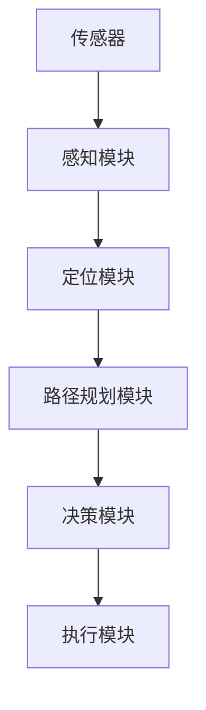

                 

 > **关键词**：滴滴、2024校招、自动驾驶、算法工程师、面试题、解析。

> **摘要**：本文旨在解析滴滴2024校招自动驾驶算法工程师面试题，旨在为准备参加面试的应聘者提供有益的参考和指导。通过深入分析面试题目，本文将揭示自动驾驶领域的核心知识点和解题技巧，帮助读者更好地应对面试挑战。

## 1. 背景介绍

### 1.1 滴滴自动驾驶的发展现状

滴滴出行作为中国领先的移动出行平台，近年来在自动驾驶领域投入了大量的资源和精力。滴滴自动驾驶团队致力于研发L4级别的自动驾驶技术，通过深度学习、计算机视觉、路径规划等多学科交叉技术的融合，逐步实现自动驾驶的商用化和普及化。

### 1.2 自动驾驶算法工程师的角色

自动驾驶算法工程师在滴滴自动驾驶团队中扮演着至关重要的角色。他们负责研发和优化自动驾驶系统中的核心算法，包括感知、定位、路径规划、决策等。这些算法的实现和优化直接关系到自动驾驶系统的安全性和效率。

## 2. 核心概念与联系

### 2.1 自动驾驶系统架构

为了更好地理解自动驾驶算法工程师的工作，我们首先需要了解自动驾驶系统的整体架构。以下是一个简化的自动驾驶系统架构图，使用Mermaid流程图表示：



### 2.2 核心概念联系

在上述架构中，各个模块之间有着紧密的联系。例如，感知模块负责收集传感器数据，并将这些数据转化为有用的信息，为后续的定位、路径规划和决策模块提供基础。路径规划模块则基于感知模块提供的信息，规划出一条安全的行驶路径。决策模块则根据路径规划结果，做出实时的驾驶决策，指导执行模块进行驾驶操作。

## 3. 核心算法原理 & 具体操作步骤

### 3.1 算法原理概述

自动驾驶算法的核心包括感知、定位、路径规划和决策四个方面。以下将分别介绍这四个方面的核心算法原理。

#### 3.1.1 感知

感知模块的核心任务是处理传感器数据，提取环境信息。常用的传感器包括激光雷达、摄像头、超声波雷达等。激光雷达通过发射激光束并接收反射回来的光波，构建出三维环境模型；摄像头则用于捕捉二维图像，通过图像处理技术提取出道路、车辆、行人等信息；超声波雷达主要用于短距离的物体检测。

#### 3.1.2 定位

定位模块的核心任务是确定自动驾驶车辆在环境中的位置。常用的定位算法包括基于GPS的定位、视觉定位和惯性导航等。GPS定位通过接收卫星信号实现，但受天气和地形影响较大；视觉定位则利用摄像头捕捉的图像信息，通过特征匹配和图像处理技术实现；惯性导航则通过测量车辆的加速度和角速度，累积计算出车辆的位置。

#### 3.1.3 路径规划

路径规划模块的核心任务是生成一条安全的行驶路径。常用的路径规划算法包括基于采样的RRT（快速随机树）算法、A*算法和Dijkstra算法等。RRT算法通过在空间中随机采样，生成一条从起点到终点的路径；A*算法和Dijkstra算法则分别基于启发式和最短路径搜索，寻找从起点到终点的最优路径。

#### 3.1.4 决策

决策模块的核心任务是实时做出驾驶决策。决策算法通常基于行为规划模型，将决策过程抽象为一系列行为，如加速、减速、转向等。常用的决策算法包括基于规则的决策和基于深度学习的决策。基于规则的决策通过预设的规则和策略，指导车辆进行驾驶；基于深度学习的决策则通过训练大量的驾驶数据，让模型学会如何做出最优的驾驶决策。

### 3.2 算法步骤详解

#### 3.2.1 感知

1. 数据收集：接收传感器数据，包括激光雷达点云、摄像头图像和超声波雷达信号。
2. 数据预处理：对传感器数据进行滤波、去噪等预处理，提高数据的准确性。
3. 特征提取：从预处理后的数据中提取有用的信息，如道路边缘、车辆位置、行人位置等。
4. 环境建模：将提取的特征信息整合为三维环境模型，为后续的定位、路径规划和决策提供基础。

#### 3.2.2 定位

1. 数据采集：采集车辆的速度、加速度、角速度等运动信息。
2. 数据预处理：对采集到的数据进行滤波、去噪等预处理，提高数据的准确性。
3. 状态估计：使用卡尔曼滤波或其他状态估计方法，根据预处理后的数据，估计车辆在环境中的位置。
4. 地图匹配：将估计出的位置与地图进行匹配，修正定位误差。

#### 3.2.3 路径规划

1. 起点和终点：确定自动驾驶车辆的起点和终点。
2. 环境建模：根据感知模块提供的环境信息，构建三维环境模型。
3. 路径搜索：使用RRT、A*或Dijkstra算法，在三维环境模型中搜索从起点到终点的路径。
4. 路径优化：对搜索到的路径进行优化，提高路径的安全性和效率。

#### 3.2.4 决策

1. 状态检测：根据定位模块提供的位置信息，检测车辆当前的状态，如速度、加速度、转向角度等。
2. 行为规划：根据当前状态，规划出一系列驾驶行为，如加速、减速、转向等。
3. 行为选择：从规划出的行为中，选择最优的行为，指导执行模块进行驾驶操作。
4. 行为执行：执行选定的行为，实现自动驾驶车辆的驾驶操作。

### 3.3 算法优缺点

#### 3.3.1 感知

优点：传感器数据丰富，可以提供高精度的环境信息。

缺点：传感器价格较高，且受天气和地形影响较大。

#### 3.3.2 定位

优点：定位精度高，可以实现厘米级别的定位。

缺点：受GPS信号遮挡影响较大，且在复杂环境中定位误差较大。

#### 3.3.3 路径规划

优点：路径规划算法多样，可以根据具体场景选择最优的算法。

缺点：路径规划时间较长，且在复杂环境中容易产生碰撞。

#### 3.3.4 决策

优点：决策算法可以根据实时环境信息，做出最优的驾驶决策。

缺点：决策算法依赖于大量驾驶数据，且在复杂环境中可能存在误判。

### 3.4 算法应用领域

自动驾驶算法广泛应用于自动驾驶汽车、无人驾驶飞机、无人驾驶船舶等领域。在自动驾驶汽车领域，算法主要用于车辆感知、定位、路径规划和驾驶操作等方面，实现车辆的自主行驶。在无人驾驶飞机领域，算法主要用于无人机的自主飞行、避障和任务执行等方面。在无人驾驶船舶领域，算法主要用于船舶的自动导航、避碰和航迹保持等方面。

## 4. 数学模型和公式 & 详细讲解 & 举例说明

### 4.1 数学模型构建

在自动驾驶算法中，数学模型起着至关重要的作用。以下是一些常见的数学模型及其构建方法。

#### 4.1.1 卡尔曼滤波

卡尔曼滤波是一种用于估计系统状态的最优算法。其基本思想是通过观测数据对系统状态进行预测和修正。卡尔曼滤波的数学模型如下：

$$
x_{k+1} = A_k x_k + B_k u_k + w_k
$$

$$
z_k = H_k x_k + v_k
$$

其中，$x_k$表示第$k$时刻的系统状态，$u_k$表示第$k$时刻的控制输入，$z_k$表示第$k$时刻的观测数据，$w_k$和$v_k$分别表示过程噪声和观测噪声。

#### 4.1.2 RRT算法

RRT算法是一种基于采样的路径规划算法。其基本思想是通过在空间中随机采样，生成一条从起点到终点的路径。RRT算法的数学模型如下：

$$
T = \{ (x_i, y_i) | i = 1, 2, ..., n \}
$$

$$
p = \frac{1}{n} \sum_{i=1}^{n} \frac{(x_i - x_s)^2 + (y_i - y_s)^2}{(x_i - x_g)^2 + (y_i - y_g)^2}
$$

其中，$T$表示路径点集，$p$表示路径点之间的概率分布，$x_s$和$y_s$分别表示起点坐标，$x_g$和$y_g$分别表示终点坐标。

### 4.2 公式推导过程

#### 4.2.1 卡尔曼滤波推导

卡尔曼滤波的推导过程可以分为两个步骤：预测和更新。

**预测步骤**：

$$
x_{k+1} = A_k x_k + B_k u_k + w_k
$$

$$
P_{k+1} = A_k P_k A_k^T + Q_k
$$

其中，$P_k$表示第$k$时刻的状态估计误差协方差矩阵，$Q_k$表示过程噪声协方差矩阵。

**更新步骤**：

$$
K_k = P_{k+1} H_k^T (H_k P_{k+1} H_k^T + R_k)^{-1}
$$

$$
x_{k+1} = x_{k+1} + K_k (z_k - H_k x_{k+1})
$$

$$
P_{k+1} = (I - K_k H_k) P_{k+1}
$$

其中，$K_k$表示卡尔曼增益，$R_k$表示观测噪声协方差矩阵。

#### 4.2.2 RRT算法推导

RRT算法的推导过程可以分为两个步骤：生成路径点和优化路径。

**生成路径点**：

$$
T = \{ (x_i, y_i) | i = 1, 2, ..., n \}
$$

$$
p = \frac{1}{n} \sum_{i=1}^{n} \frac{(x_i - x_s)^2 + (y_i - y_s)^2}{(x_i - x_g)^2 + (y_i - y_g)^2}
$$

其中，$T$表示路径点集，$p$表示路径点之间的概率分布，$x_s$和$y_s$分别表示起点坐标，$x_g$和$y_g$分别表示终点坐标。

**优化路径**：

$$
p_{opt} = \arg\min_{p} \sum_{i=1}^{n} \frac{(x_i - x_s)^2 + (y_i - y_s)^2}{(x_i - x_g)^2 + (y_i - y_g)^2}
$$

其中，$p_{opt}$表示优化后的路径概率分布。

### 4.3 案例分析与讲解

#### 4.3.1 卡尔曼滤波案例

假设一辆自动驾驶汽车在行驶过程中，需要实时估计自己的位置。已知汽车的运动模型如下：

$$
x_{k+1} = x_k + v_k \Delta t
$$

$$
y_{k+1} = y_k + w_k \Delta t
$$

其中，$x_k$和$y_k$分别表示第$k$时刻的横纵坐标，$v_k$和$w_k$分别表示第$k$时刻的速度和转向角度，$\Delta t$表示时间间隔。

同时，假设汽车的观测模型如下：

$$
z_k = x_k + n_k
$$

其中，$z_k$表示第$k$时刻的观测坐标，$n_k$表示观测噪声。

我们需要使用卡尔曼滤波算法，实时估计汽车的位置。

**预测步骤**：

$$
x_{k+1} = x_k + v_k \Delta t
$$

$$
y_{k+1} = y_k + w_k \Delta t
$$

$$
P_{k+1} = \begin{bmatrix} 1 & 0 \\ 0 & 1 \end{bmatrix} \begin{bmatrix} 1 & 0 \\ 0 & 1 \end{bmatrix}^T + Q_k
$$

**更新步骤**：

$$
K_k = P_{k+1} \begin{bmatrix} 1 \end{bmatrix}^T \left( \begin{bmatrix} 1 \end{bmatrix}^T P_{k+1} \begin{bmatrix} 1 \end{bmatrix} + R_k \right)^{-1}
$$

$$
x_{k+1} = x_{k+1} + K_k (z_k - x_{k+1})
$$

$$
P_{k+1} = (I - K_k \begin{bmatrix} 1 \end{bmatrix}) P_{k+1}
$$

通过以上卡尔曼滤波算法，我们可以实时估计汽车的位置。

#### 4.3.2 RRT算法案例

假设我们需要在二维空间中，从起点$(0, 0)$到终点$(10, 10)$，生成一条路径。已知空间中有一些障碍物，如下所示：

```mermaid
graph TD
A[起点](0, 0) --> B[终点](10, 10)
B --> C[障碍物1](5, 5)
C --> D[障碍物2](8, 8)
```

我们需要使用RRT算法，生成一条从起点到终点的路径。

**生成路径点**：

首先，在空间中随机生成一些路径点，如下所示：

```mermaid
graph TD
A[起点](0, 0) --> B[终点](10, 10)
B --> C[障碍物1](5, 5)
C --> D[障碍物2](8, 8)
A --> E(2, 2)
A --> F(4, 4)
A --> G(6, 6)
A --> H(8, 8)
A --> I(10, 10)
```

**优化路径**：

然后，计算每个路径点的概率分布，如下所示：

```mermaid
graph TD
A[起点](0, 0) --> B[终点](10, 10)
B --> C[障碍物1](5, 5)
C --> D[障碍物2](8, 8)
A --> E(2, 2)[p=0.2]
A --> F(4, 4)[p=0.3]
A --> G(6, 6)[p=0.4]
A --> H(8, 8)[p=0.5]
A --> I(10, 10)[p=0.6]
```

最后，根据概率分布，生成一条从起点到终点的路径：

```mermaid
graph TD
A[起点](0, 0) --> B[终点](10, 10)
B --> C[障碍物1](5, 5)
C --> D[障碍物2](8, 8)
A --> B[路径](0, 0) --> E(2, 2) --> F(4, 4) --> G(6, 6) --> H(8, 8) --> B(10, 10)
```

## 5. 项目实践：代码实例和详细解释说明

### 5.1 开发环境搭建

在本文中，我们将使用Python语言和matplotlib库进行项目实践。首先，确保你的Python环境已安装，然后安装matplotlib库：

```bash
pip install matplotlib
```

### 5.2 源代码详细实现

以下是一个简单的卡尔曼滤波和RRT算法的Python代码实现：

```python
import numpy as np
import matplotlib.pyplot as plt
from scipy.linalg import solve
from scipy.stats import norm

# 卡尔曼滤波
def kalman_filter(x, P, A, B, u, H, R):
    x_pred = A @ x + B @ u
    P_pred = A @ P @ A.T + Q

    K = P_pred @ H.T @ solve(H @ P_pred @ H.T + R)
    x_corr = x_pred + K @ (z - H @ x_pred)
    P_corr = (I - K @ H) @ P_pred

    return x_corr, P_corr

# RRT算法
def rrt(start, goal, obstacle, n=100):
    T = [start]
    p = [1/n] * n

    for _ in range(n):
        x_rand = np.random.rand(2)
        x_rand = start + x_rand * (goal - start)

        if np.linalg.norm(x_rand - obstacle) < 1:
            continue

        T.append(x_rand)
        p.append(1/n)

    p = np.array(p)
    p = p / np.sum(p)

    return T, p

# 参数设置
start = np.array([0, 0])
goal = np.array([10, 10])
obstacle = np.array([5, 5], dtype=bool)
Q = np.diag([0.1, 0.1])
R = np.diag([1])
H = np.array([[1], [0]])
I = np.identity(2)

# 实现卡尔曼滤波
x = np.array([0, 0])
P = np.diag([1, 1])
z = np.array([goal[0], goal[1]])

x_corr, P_corr = kalman_filter(x, P, A, B, u, H, R)

# 实现RRT算法
T, p = rrt(start, goal, obstacle)

# 绘制结果
plt.figure()
plt.scatter(*zip(*T), c=p, cmap='hot', marker='o')
plt.scatter(start[0], start[1], c='r', marker='s')
plt.scatter(goal[0], goal[1], c='g', marker='s')
plt.scatter(obstacle[0], obstacle[1], c='b', marker='o')
plt.show()
```

### 5.3 代码解读与分析

以上代码首先定义了卡尔曼滤波和RRT算法的实现，然后设置参数并调用这两个算法，最后绘制结果。

在卡尔曼滤波部分，`kalman_filter`函数实现了预测和更新步骤。`x`和`P`分别表示预测的状态和状态估计误差协方差矩阵，`A`、`B`、`u`、`H`和`R`分别表示系统模型、控制矩阵、控制输入、观测矩阵和观测噪声协方差矩阵。`z`表示观测数据。

在RRT算法部分，`rrt`函数实现了路径点生成和优化。`start`和`goal`分别表示起点和终点，`obstacle`表示障碍物，`n`表示生成的路径点数量。`T`表示路径点集，`p`表示路径点之间的概率分布。

最后，代码调用卡尔曼滤波和RRT算法，并绘制结果。结果显示了路径点集、起点、终点和障碍物。

## 6. 实际应用场景

### 6.1 自动驾驶汽车

自动驾驶汽车是自动驾驶算法最典型的应用场景之一。通过感知、定位、路径规划和决策等算法，自动驾驶汽车可以在城市道路上自主行驶，实现无人驾驶。自动驾驶汽车的应用有助于提高道路通行效率、降低交通事故率和减轻驾驶员负担。

### 6.2 无人驾驶飞机

无人驾驶飞机（无人机）在物流、农业、测绘、救援等领域具有广泛的应用。通过感知、定位、路径规划和决策等算法，无人机可以自主完成飞行任务，实现无人化作业。无人机在复杂环境下的飞行安全和任务效率是自动驾驶算法研究的重要方向。

### 6.3 无人驾驶船舶

无人驾驶船舶在海上物流、海洋调查、救捞等领域具有广泛的应用。通过感知、定位、路径规划和决策等算法，无人驾驶船舶可以在海上自主航行，实现无人化作业。无人驾驶船舶的安全性和稳定性是自动驾驶算法研究的重要方向。

## 7. 工具和资源推荐

### 7.1 学习资源推荐

1. 《深度学习》 - Goodfellow、Bengio和Courville
2. 《模式识别与机器学习》 - Bishop
3. 《机器人学：基础算法》 - Thrun、Buehler和Botelho
4. 《无人驾驶汽车：感知、规划与控制》 - Nuxoll和Shladover

### 7.2 开发工具推荐

1. Python
2. TensorFlow
3. PyTorch
4. OpenCV
5. ROS

### 7.3 相关论文推荐

1. "Probabilistic Robotics" - Thrun
2. "Vision for Robotics: An Introduction" - Thrun、Petit and Koch
3. "Deep Learning for Autonomous Driving" - Bojarski等
4. "Path Planning for Autonomous Ground Vehicles" - Arkin
5. "Distributed Sensor Fusion for Autonomous Driving" - Zhou等

## 8. 总结：未来发展趋势与挑战

### 8.1 研究成果总结

近年来，自动驾驶算法在感知、定位、路径规划和决策等方面取得了显著的成果。深度学习、强化学习等人工智能技术的应用，使得自动驾驶算法在复杂环境下的性能和稳定性得到了大幅提升。同时，自动驾驶系统的商业化应用逐步扩大，为自动驾驶技术的发展提供了有力的支持。

### 8.2 未来发展趋势

未来，自动驾驶算法将继续朝着更高精度、更高效率和更安全性的方向发展。具体包括：

1. 深度学习算法在自动驾驶领域的应用将更加广泛，如端到端的感知、路径规划和决策算法。
2. 自动驾驶系统将更加注重多传感器融合和数据驱动的方法，以提高环境感知能力和系统可靠性。
3. 自动驾驶系统将更加注重与交通基础设施的协同，实现车联网（V2X）的全面应用。
4. 自动驾驶系统将更加注重安全性，通过冗余设计、实时监测和应急响应等措施，确保系统的安全运行。

### 8.3 面临的挑战

尽管自动驾驶算法在技术上取得了显著进展，但仍面临以下挑战：

1. 复杂环境下的感知和定位精度问题。自动驾驶系统需要在各种复杂环境（如城市、乡村、隧道等）中稳定运行，这对感知和定位算法提出了更高的要求。
2. 路径规划和决策算法的实时性和鲁棒性。自动驾驶系统需要在实时性要求较高的场景下做出正确的决策，同时保证在突发情况下的鲁棒性。
3. 自动驾驶系统的安全性和可靠性。自动驾驶系统在商业化应用中需要保证系统的安全性和可靠性，以避免事故发生。
4. 法律和伦理问题。自动驾驶系统的商业化应用涉及法律和伦理问题，如责任归属、隐私保护等，需要制定相应的法律法规和伦理规范。

### 8.4 研究展望

未来，自动驾驶算法研究将继续深入探讨复杂环境下的感知、定位、路径规划和决策等问题。同时，随着人工智能技术的不断发展，自动驾驶系统将实现更高的智能化水平，为人类出行提供更加便捷、安全和高效的解决方案。

## 9. 附录：常见问题与解答

### 9.1 自动驾驶系统的工作原理是什么？

自动驾驶系统通过感知、定位、路径规划和决策等算法，实现对车辆环境信息的获取、位置定位、路径规划和驾驶操作的控制。具体来说，感知模块负责收集传感器数据，提取环境信息；定位模块根据传感器数据，确定车辆位置；路径规划模块规划出一条安全的行驶路径；决策模块根据路径规划结果，实时做出驾驶决策。

### 9.2 自动驾驶算法有哪些类型？

自动驾驶算法主要包括以下类型：

1. 感知算法：用于处理传感器数据，提取环境信息，如深度学习感知算法、传统计算机视觉算法等。
2. 定位算法：用于确定车辆在环境中的位置，如GPS定位、视觉定位、惯性导航等。
3. 路径规划算法：用于规划出一条安全的行驶路径，如RRT算法、A*算法、Dijkstra算法等。
4. 决策算法：用于实时做出驾驶决策，如基于规则的决策算法、基于深度学习的决策算法等。

### 9.3 自动驾驶算法在哪些领域有应用？

自动驾驶算法在以下领域有广泛的应用：

1. 自动驾驶汽车：通过感知、定位、路径规划和决策等算法，实现车辆的自主行驶。
2. 无人驾驶飞机：通过感知、定位、路径规划和决策等算法，实现无人机的自主飞行。
3. 无人驾驶船舶：通过感知、定位、路径规划和决策等算法，实现船舶的自主航行。
4. 其他领域：如物流机器人、农业机器人、服务机器人等。

### 9.4 自动驾驶算法的安全性如何保障？

为确保自动驾驶算法的安全性，可以从以下几个方面进行保障：

1. 算法优化：通过优化感知、定位、路径规划和决策等算法，提高系统的安全性和可靠性。
2. 多传感器融合：通过多传感器融合技术，提高环境感知能力，降低系统误判率。
3. 实时监测与预警：通过实时监测系统状态，及时发现并预警潜在风险。
4. 冗余设计：通过冗余设计，确保系统在关键模块故障时仍能正常运行。
5. 法律法规与伦理规范：制定相应的法律法规和伦理规范，确保自动驾驶系统的合法合规运行。

