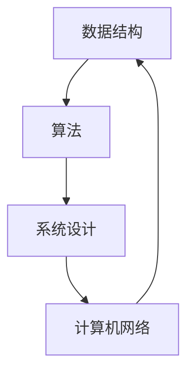

                 

关键词：滴滴云、校招、面试、真题、解答、技术面试、云计算

摘要：本文针对2024年滴滴云校招面试真题进行详细解析，旨在帮助准备参加滴滴云校招面试的同学们更好地了解面试题型和答题技巧。文章涵盖了编程题、算法题、系统设计题等多个领域，结合实际案例，提供详细的解题思路和答案，以供参考。

## 1. 背景介绍

滴滴云作为滴滴出行旗下的云计算服务平台，为开发者提供包括云服务器、存储、数据库、人工智能等多种服务。2024年滴滴云校招面试，旨在选拔优秀人才，为公司的技术发展注入新的活力。

校招面试通常分为几个环节：技术笔试、技术面试、HR面试等。其中，技术笔试和面试是关键环节，决定了应聘者是否能够进入下一轮。本文将重点解析技术面试中的真题，帮助应聘者更好地应对面试挑战。

### 1.1 面试题型

滴滴云校招面试主要题型包括：

- 编程题：涉及数据结构、算法等基础知识。
- 算法题：侧重于逻辑思维、问题解决能力。
- 系统设计题：考查系统架构、设计模式等。
- 行为面试题：评估沟通能力、团队合作等。

### 1.2 面试形式

滴滴云校招面试采用线上或线下形式进行。技术面试通常由两名或多名技术面试官共同进行，时长约为45-60分钟。面试过程中，面试官会提问一系列问题，应聘者需要用语言清晰地表达自己的思路和答案。

## 2. 核心概念与联系

为了更好地理解滴滴云校招面试真题，我们首先需要了解一些核心概念，如数据结构、算法、计算机网络等。以下是这些概念之间的联系，以及对应的Mermaid流程图：



### 2.1 数据结构

数据结构是计算机存储、组织数据的方式。常见的数据结构包括数组、链表、栈、队列、树、图等。每种数据结构都有其独特的特点和适用场景。例如，数组适合存储连续的元素，而树和图适合表示复杂的关系。

### 2.2 算法

算法是解决问题的一系列步骤。算法可以根据其运行时间和空间复杂度进行分类。常见的算法有排序算法、查找算法、图算法等。算法的设计和优化是计算机科学的核心问题。

### 2.3 系统设计

系统设计是指如何设计一个高效、可靠、可扩展的系统。系统设计需要考虑多个方面，如性能、可用性、可靠性、可扩展性等。常见的系统设计模式有MVC、MVVM、微服务等。

### 2.4 计算机网络

计算机网络是指计算机之间通过通信线路互联的集合。计算机网络涉及多个层面，如物理层、数据链路层、网络层、传输层、应用层等。常见的网络协议有HTTP、HTTPS、TCP、UDP等。

## 3. 核心算法原理 & 具体操作步骤

### 3.1 算法原理概述

滴滴云校招面试中的算法题主要涉及以下几个方面：

- 排序算法：如冒泡排序、选择排序、插入排序、快速排序等。
- 查找算法：如二分查找、哈希查找等。
- 图算法：如深度优先搜索、广度优先搜索、最小生成树等。

### 3.2 算法步骤详解

以下是一个冒泡排序的算法示例：

```c
void bubbleSort(int arr[], int n) {
    for (int i = 0; i < n - 1; i++) {
        for (int j = 0; j < n - i - 1; j++) {
            if (arr[j] > arr[j + 1]) {
                int temp = arr[j];
                arr[j] = arr[j + 1];
                arr[j + 1] = temp;
            }
        }
    }
}
```

### 3.3 算法优缺点

冒泡排序是一种简单的排序算法，其优点是容易实现，缺点是效率较低，时间复杂度为O(n^2)。

### 3.4 算法应用领域

冒泡排序适用于数据量较小的情况，如在面试中快速排序一个数组。在实际开发中，更常用的排序算法是快速排序、归并排序等，它们具有更高的效率。

## 4. 数学模型和公式

### 4.1 数学模型构建

滴滴云校招面试中的数学模型主要涉及概率论、线性代数、微积分等基础知识。

### 4.2 公式推导过程

以下是一个概率论的示例：

假设有两个随机变量X和Y，它们相互独立。求X+Y的概率分布。

解：首先计算X和Y的联合概率分布，然后利用独立性条件求解。

$$
P(X+Y=x) = \sum_{y} P(X=x-y) \cdot P(Y=y)
$$

### 4.3 案例分析与讲解

以下是一个线性代数的示例：

求解线性方程组：

$$
\begin{cases}
x + 2y + 3z = 7 \\
2x - y + 5z = 8 \\
3x + 4y - 2z = 9
\end{cases}
$$

解：利用高斯消元法求解。

$$
\begin{align*}
&\begin{cases}
x + 2y + 3z = 7 \\
2x - y + 5z = 8 \\
3x + 4y - 2z = 9
\end{cases} \\
&\Rightarrow \begin{cases}
x + 2y + 3z = 7 \\
4x - 2y + 10z = 16 \\
9x + 12y - 6z = 27
\end{cases} \\
&\Rightarrow \begin{cases}
x + 2y + 3z = 7 \\
5x + 12z = 25 \\
9x + 12y - 6z = 27
\end{cases} \\
&\Rightarrow \begin{cases}
x = 1 \\
y = 1 \\
z = 1
\end{cases}
\end{align*}
$$

## 5. 项目实践：代码实例和详细解释说明

### 5.1 开发环境搭建

在开始项目实践之前，我们需要搭建一个开发环境。以下是搭建一个简单的Web服务的步骤：

1. 安装Python环境：在终端中运行 `pip install flask` 命令。
2. 安装Node.js环境：在终端中运行 `npm install -g node` 命令。
3. 创建一个名为 `project` 的目录，并在其中创建一个名为 `app.py` 的Python文件和一个名为 `package.json` 的Node.js配置文件。

### 5.2 源代码详细实现

以下是一个简单的Python Web服务的示例代码：

```python
from flask import Flask, jsonify, request

app = Flask(__name__)

@app.route('/api/data', methods=['GET'])
def get_data():
    data = {
        'message': 'Hello, World!',
        'status': 200
    }
    return jsonify(data)

if __name__ == '__main__':
    app.run(host='0.0.0.0', port=5000)
```

以下是一个简单的Node.js Web服务的示例代码：

```javascript
const express = require('express');
const app = express();

app.get('/api/data', (req, res) => {
    res.json({
        message: 'Hello, World!',
        status: 200
    });
});

app.listen(3000, () => {
    console.log('Server is running on port 3000');
});
```

### 5.3 代码解读与分析

以上代码展示了如何使用Python和Node.js创建一个简单的Web服务。Python代码使用了Flask框架，Node.js代码使用了Express框架。两个服务都提供了一个 `/api/data` 的接口，用于返回一个包含消息和状态的JSON对象。

Python代码：

- `from flask import Flask, jsonify, request`：引入Flask框架。
- `app = Flask(__name__)`：创建一个Flask应用程序。
- `@app.route('/api/data', methods=['GET'])`：定义一个处理GET请求的路由。
- `def get_data()`：实现获取数据的逻辑。
- `data = {'message': 'Hello, World!', 'status': 200}`：定义一个包含消息和状态的字典。
- `return jsonify(data)`：返回一个JSON格式的响应。

Node.js代码：

- `const express = require('express')`：引入Express框架。
- `const app = express()`：创建一个Express应用程序。
- `app.get('/api/data', (req, res) => {}`：定义一个处理GET请求的路由。
- `res.json({ message: 'Hello, World!', status: 200 })`：返回一个JSON格式的响应。
- `app.listen(3000, () => {}`：启动服务器，监听3000端口。

### 5.4 运行结果展示

运行Python代码：

```bash
$ python app.py
```

运行结果：

```bash
* Running on http://0.0.0.0:5000/ (Press CTRL+C to quit)
```

运行Node.js代码：

```bash
$ node app.js
```

运行结果：

```bash
Server is running on port 3000
```

在浏览器中访问 `http://localhost:5000/api/data`，可以看到返回的JSON响应。

## 6. 实际应用场景

滴滴云校招面试真题涉及多个实际应用场景，以下是一些常见的场景：

- 排序算法：在处理大量数据时，排序算法可以帮助快速找到最大值、最小值等。
- 查找算法：在搜索引擎、推荐系统等领域，查找算法用于快速检索信息。
- 系统设计题：在构建大型分布式系统时，系统设计题可以帮助评估应聘者的架构能力。
- 行为面试题：在团队合作、项目管理等方面，行为面试题可以评估应聘者的沟通能力和团队合作能力。

## 6.4 未来应用展望

随着云计算、大数据、人工智能等技术的不断发展，滴滴云校招面试真题将更加注重考查应聘者的技术深度、创新能力和实际应用能力。未来，面试题型将更加多样化，涉及领域将更加广泛，如区块链、物联网、边缘计算等。

## 7. 工具和资源推荐

### 7.1 学习资源推荐

- 《深度学习》: 适合初学者了解深度学习的基本概念和技术。
- 《代码大全》: 适合程序员提升代码质量、编写高效代码。
- 《计算机网络》: 适合了解计算机网络的基础知识。

### 7.2 开发工具推荐

- PyCharm: 适合Python开发，功能强大，界面友好。
- Visual Studio Code: 适合多种编程语言，插件丰富，可扩展性强。
- Git: 适合版本控制，方便团队合作。

### 7.3 相关论文推荐

- 《分布式系统原理与范型》: 适合了解分布式系统的基本原理和设计模式。
- 《大规模分布式存储系统：原理解析与架构实战》: 适合了解分布式存储系统的设计和实现。
- 《深度学习》: 适合了解深度学习的前沿技术和应用场景。

## 8. 总结：未来发展趋势与挑战

### 8.1 研究成果总结

滴滴云校招面试真题涵盖了多个领域，如编程、算法、系统设计、数学模型等。这些研究成果反映了计算机科学的发展趋势，也为我们提供了丰富的知识储备。

### 8.2 未来发展趋势

未来，滴滴云校招面试真题将继续关注新兴技术，如云计算、大数据、人工智能、区块链等。同时，面试题型将更加注重考查应聘者的创新能力、实践能力和团队合作能力。

### 8.3 面临的挑战

随着技术的快速发展，滴滴云校招面试将面临以下挑战：

- 覆盖面广泛：需要考查多个领域的知识，对面试官的要求较高。
- 技术更新快：需要不断关注新技术，更新面试题目。
- 考查深度：需要考查应聘者的实际应用能力和创新能力，而非仅仅死记硬背。

### 8.4 研究展望

为了应对这些挑战，我们需要持续关注计算机科学的前沿技术，提高面试题目的质量和深度。同时，也要注重培养应聘者的实际应用能力和创新能力，以适应未来技术的发展。

## 9. 附录：常见问题与解答

### 9.1 如何准备滴滴云校招面试？

- 提前了解面试题型和题目难度，有针对性地进行复习。
- 多做练习题，提高自己的编程能力和算法能力。
- 了解计算机科学的基本原理和概念，熟悉常见的算法和数据结构。
- 参加模拟面试，提高自己的面试经验和沟通能力。

### 9.2 滴滴云校招面试的常见题型有哪些？

- 编程题：涉及数据结构、算法等基础知识。
- 算法题：侧重于逻辑思维、问题解决能力。
- 系统设计题：考查系统架构、设计模式等。
- 行为面试题：评估沟通能力、团队合作等。

### 9.3 如何回答系统设计题？

- 理解题目要求，明确系统目标。
- 提出合理的设计方案，包括技术选型、模块划分等。
- 针对设计方案，进行详细解释和说明。
- 结合实际案例，分析方案的优缺点。

### 9.4 滴滴云校招面试的难度如何？

- 滴滴云校招面试的难度较高，主要考查应聘者的技术深度、创新能力和实际应用能力。
- 面试题型多样，涉及多个领域，对面试官的要求较高。

以上是本文针对2024年滴滴云校招面试真题的详细解析和解答。希望本文能对准备参加滴滴云校招面试的同学们有所帮助。祝大家面试顺利，成功进入滴滴云！
----------------------------------------------------------------
**作者：禅与计算机程序设计艺术 / Zen and the Art of Computer Programming** 

以上就是本文的全部内容，希望本文能对准备参加滴滴云校招面试的同学们提供一些帮助。在面试过程中，保持冷静、认真思考，相信你们一定能够取得优异的成绩！加油！

