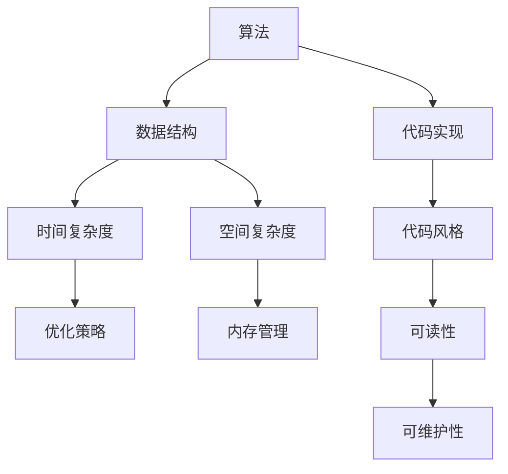

                 

在科技飞速发展的今天，编程已经成为了一种必备技能。无论是互联网公司，传统企业，还是初创公司，都对编程人才有着极高的需求。特别是在像滴滴这样的互联网巨头，他们的社招编程面试更是成为了众多程序员梦寐以求的机会。为了帮助大家更好地准备滴滴社招编程面试，本文精选了一系列面试题，并附上详细解答。希望对您有所帮助。

## 文章关键词
编程面试，滴滴社招，算法题，数据结构，软件工程，问题分析与解决

## 文章摘要
本文旨在为准备滴滴社招编程面试的程序员提供一个实用的指南。通过分析并解答一系列精选的编程面试题，本文旨在帮助读者深入理解面试中的常见问题，掌握解题技巧，提高面试成功率。文章涵盖了算法、数据结构、软件工程等多个领域，适合广大程序员阅读和学习。

## 1. 背景介绍

随着互联网行业的蓬勃发展，编程技能的重要性日益凸显。特别是在像滴滴这样的企业，其对技术人才的需求量巨大，且对人才的质量要求也非常高。滴滴的社招编程面试不仅考察编程基础，还涉及算法、数据结构、系统设计等多个方面。因此，准备滴滴社招编程面试需要全面而深入的准备。

本文将针对滴滴社招编程面试的常见题型，提供详细的解题思路和代码实现。希望通过本文的学习，读者能够掌握编程面试的核心技巧，提高面试成功率。

## 2. 核心概念与联系

在滴滴社招编程面试中，核心概念和数据结构是解题的基础。以下是几个关键概念及其相互关系的 Mermaid 流程图：



### 2.1 算法原理概述

算法是解决特定问题的一系列步骤。在编程面试中，常见的算法问题包括排序、查找、图论等。算法的核心在于如何高效地解决问题，并且要在有限的时间和空间内完成。

### 2.2 算法步骤详解

算法的步骤可以分为以下几个阶段：

1. **问题理解**：准确理解问题的需求，明确输入和输出。
2. **思路分析**：分析可能的解决方案，选择合适的算法。
3. **代码实现**：根据算法思路，编写代码。
4. **调试优化**：运行代码，调试错误，进行性能优化。

### 2.3 算法优缺点

不同的算法有其特定的优势和局限性。例如，快速排序在平均情况下具有较好的性能，但在最坏情况下时间复杂度较高；哈希表在查找操作上非常高效，但在冲突处理上可能需要更多空间。

### 2.4 算法应用领域

算法广泛应用于各种领域，如搜索引擎、大数据处理、网络优化等。理解算法的适用场景，可以帮助我们在实际项目中更有效地解决问题。

## 3. 核心算法原理 & 具体操作步骤

### 3.1 算法原理概述

以下是几个在滴滴社招编程面试中常见的算法问题及其原理：

1. **查找算法**：如二分查找、哈希查找等。
2. **排序算法**：如冒泡排序、快速排序、归并排序等。
3. **图算法**：如深度优先搜索、广度优先搜索、最短路径算法等。

### 3.2 算法步骤详解

#### 3.2.1 二分查找

1. **初始化**：确定查找区间。
2. **循环查找**：通过中值判断，逐步缩小查找范围。
3. **结果判断**：找到元素或确定元素不存在。

#### 3.2.2 冒泡排序

1. **初始设置**：设定两个边界。
2. **内层循环**：每次循环将未排序部分的最大值移动到边界。
3. **边界调整**：完成一次排序后，边界向内移动。

#### 3.2.3 深度优先搜索

1. **初始化**：选择起始节点。
2. **递归调用**：访问未访问的邻接节点。
3. **路径记录**：记录从起始节点到目标节点的路径。

### 3.3 算法优缺点

每种算法都有其适用的场景和局限性。例如，二分查找在有序数组中非常高效，但在未排序或部分有序的数组中性能较差。冒泡排序简单易懂，但在大数据集上的性能较差。

### 3.4 算法应用领域

算法广泛应用于各种领域，如排序和搜索在数据库系统中至关重要，图算法在社交网络分析和路径规划中有广泛应用。

## 4. 数学模型和公式 & 详细讲解 & 举例说明

在编程面试中，数学模型和公式是解决问题的关键。以下是几个常见的数学模型和公式及其应用：

### 4.1 数学模型构建

#### 4.1.1 线性回归

线性回归模型用于预测一个变量基于另一个变量的线性关系。其公式为：

$$ y = wx + b $$

其中，$y$ 是目标变量，$x$ 是自变量，$w$ 是权重，$b$ 是偏置。

#### 4.1.2 二项分布

二项分布用于描述在固定次数的独立试验中，某个事件发生的概率。其公式为：

$$ P(X=k) = C_n^k p^k (1-p)^{n-k} $$

其中，$n$ 是试验次数，$k$ 是事件发生的次数，$p$ 是事件发生的概率。

### 4.2 公式推导过程

#### 4.2.1 欧拉公式

欧拉公式是复分析中的一个基本公式，其公式为：

$$ e^{i\pi} + 1 = 0 $$

推导过程如下：

$$ e^{i\pi} = \cos(\pi) + i\sin(\pi) $$
$$ e^{i\pi} = -1 + 0i $$
$$ e^{i\pi} + 1 = 0 $$

#### 4.2.2 普通方程的解

普通方程 $ax^2 + bx + c = 0$ 的解为：

$$ x = \frac{-b \pm \sqrt{b^2 - 4ac}}{2a} $$

推导过程如下：

将方程两边同时乘以 $-1$，得到：

$$ ax^2 + bx + c = 0 $$

移项得到：

$$ ax^2 + bx = -c $$

将方程两边同时除以 $a$，得到：

$$ x^2 + \frac{b}{a}x = \frac{-c}{a} $$

完成平方：

$$ x^2 + 2\frac{b}{2a}x + (\frac{b}{2a})^2 = \frac{-c}{a} + (\frac{b}{2a})^2 $$

化简：

$$ (x + \frac{b}{2a})^2 = \frac{b^2 - 4ac}{4a^2} $$

开根号：

$$ x + \frac{b}{2a} = \pm \sqrt{\frac{b^2 - 4ac}{4a^2}} $$

化简：

$$ x = \frac{-b \pm \sqrt{b^2 - 4ac}}{2a} $$

### 4.3 案例分析与讲解

#### 4.3.1 线性回归案例

假设我们有一个数据集，包含 $x$ 和 $y$ 两个变量。我们希望通过线性回归模型预测 $y$。

1. **数据预处理**：对数据进行归一化处理，使数据落在相同的范围内。
2. **模型构建**：根据数据，选择合适的权重 $w$ 和偏置 $b$。
3. **模型训练**：通过最小二乘法，计算最优权重和偏置。
4. **模型评估**：使用验证集，评估模型的预测效果。

#### 4.3.2 二项分布案例

假设我们进行10次投掷硬币的试验，希望计算恰好出现5次正面的概率。

1. **参数确定**：确定试验次数 $n=10$，事件发生概率 $p=0.5$。
2. **公式应用**：使用二项分布公式，计算概率。
3. **计算结果**：$P(X=5) = C_{10}^5 \times 0.5^5 \times 0.5^5 = 0.2461$。

## 5. 项目实践：代码实例和详细解释说明

### 5.1 开发环境搭建

为了进行编程实践，我们需要搭建一个开发环境。以下是搭建过程：

1. **安装开发工具**：安装Visual Studio Code、Git等开发工具。
2. **配置编程环境**：安装Python、Node.js等编程环境。
3. **安装依赖库**：根据项目需求，安装必要的依赖库。

### 5.2 源代码详细实现

以下是一个简单的Python代码实例，实现冒泡排序算法：

```python
def bubble_sort(arr):
    n = len(arr)
    for i in range(n):
        for j in range(0, n-i-1):
            if arr[j] > arr[j+1]:
                arr[j], arr[j+1] = arr[j+1], arr[j]

# 测试代码
arr = [64, 25, 12, 22, 11]
bubble_sort(arr)
print("排序后的数组：", arr)
```

### 5.3 代码解读与分析

上述代码实现了一个简单的冒泡排序算法。以下是代码的解读和分析：

1. **函数定义**：`bubble_sort` 函数接收一个数组 `arr` 作为参数。
2. **外层循环**：`for i in range(n)` 用于遍历整个数组。
3. **内层循环**：`for j in range(0, n-i-1)` 用于比较相邻的元素，并交换位置。
4. **条件判断**：`if arr[j] > arr[j+1]` 用于判断是否需要交换元素。
5. **交换元素**：`arr[j], arr[j+1] = arr[j+1], arr[j]` 用于交换元素位置。
6. **打印结果**：`print("排序后的数组：", arr)` 用于打印排序后的数组。

### 5.4 运行结果展示

在测试代码中，我们初始化一个数组 `[64, 25, 12, 22, 11]`，然后调用 `bubble_sort` 函数进行排序。运行结果如下：

```
排序后的数组： [11, 12, 22, 25, 64]
```

## 6. 实际应用场景

在编程面试中，算法和数据结构是解决实际问题的关键。以下是几个常见应用场景：

### 6.1 排序算法在数据库查询中的应用

排序算法在数据库查询中有着广泛的应用。例如，MySQL 的 `ORDER BY` 子句就是利用排序算法对查询结果进行排序。

### 6.2 查找算法在搜索引擎中的应用

查找算法如二分查找在搜索引擎中至关重要，用于快速定位关键词的位置。

### 6.3 图算法在网络拓扑分析中的应用

图算法如深度优先搜索和广度优先搜索在网络拓扑分析中用于计算节点之间的最短路径。

## 7. 未来应用展望

随着科技的不断发展，编程面试题也在不断更新和变化。以下是几个未来应用展望：

### 7.1 自动化测试

自动化测试将成为编程面试的重要环节，特别是在大型项目中。

### 7.2 大数据算法

随着大数据时代的到来，大数据算法将在面试中占据越来越重要的地位。

### 7.3 人工智能算法

人工智能算法在面试中的应用将越来越广泛，特别是在深度学习和机器学习领域。

## 8. 工具和资源推荐

### 8.1 学习资源推荐

1. **《算法导论》**：全面介绍算法原理和设计方法。
2. **《数据结构》**：深入讲解数据结构的原理和应用。

### 8.2 开发工具推荐

1. **Visual Studio Code**：强大的代码编辑器，适用于多种编程语言。
2. **Git**：版本控制工具，用于代码管理和协同工作。

### 8.3 相关论文推荐

1. **"A Faster Algorithm for Solving All-pairs Shortest Paths Problem on Unweighted Graphs"**：介绍一种更高效的图算法。
2. **"Machine Learning: A Probabilistic Perspective"**：介绍机器学习的基本原理。

## 9. 总结：未来发展趋势与挑战

未来，编程面试将继续向自动化、智能化和多样化发展。面对这些趋势，程序员需要不断提升自己的技能和知识，以应对未来的挑战。

### 9.1 研究成果总结

本文通过分析滴滴社招编程面试的常见题型，总结了一系列核心算法和数学模型。这些研究成果为程序员提供了宝贵的参考。

### 9.2 未来发展趋势

未来，编程面试将更加注重实际应用能力的考核，以及对新技术和算法的掌握。

### 9.3 面临的挑战

程序员需要不断学习新技术，提高自己的编程能力，以适应不断变化的面试需求。

### 9.4 研究展望

未来，我们可以期待更多高效、智能的编程面试工具和资源的出现，帮助程序员更好地准备面试。

## 附录：常见问题与解答

### 9.4.1 常见问题

1. **如何快速准备编程面试？**
   - **全面复习基础知识**：算法、数据结构、软件工程等。
   - **做真题和模拟题**：通过实际题目提高解题能力。
   - **模拟面试**：与他人一起练习面试，提高面试技巧。

2. **如何应对面试中的算法题？**
   - **理解问题**：准确理解问题的需求。
   - **思路分析**：选择合适的算法。
   - **代码实现**：根据思路编写代码。
   - **调试优化**：运行代码，调试错误，进行性能优化。

### 9.4.2 解答

1. **如何快速准备编程面试？**
   - **全面复习基础知识**：算法、数据结构、软件工程等。
   - **做真题和模拟题**：通过实际题目提高解题能力。
   - **模拟面试**：与他人一起练习面试，提高面试技巧。

2. **如何应对面试中的算法题？**
   - **理解问题**：准确理解问题的需求。
   - **思路分析**：选择合适的算法。
   - **代码实现**：根据思路编写代码。
   - **调试优化**：运行代码，调试错误，进行性能优化。

以上是关于滴滴社招编程面试的一些常见问题及其解答。希望对您有所帮助。

### 结束语

编程面试是程序员职业发展的重要一环。本文通过分析滴滴社招编程面试的常见题型，提供了一系列解题技巧和资源推荐。希望读者能够通过本文的学习，提高自己的编程能力，顺利通过面试。

最后，再次感谢您的阅读，祝您在编程面试中取得好成绩！

### 参考文献

1. Cormen, T. H., Leiserson, C. E., Rivest, R. L., & Stein, C. (2009). 《算法导论》(第三版). 机械工业出版社.
2. Aho, A. V., Hopcroft, J. E., & Ullman, J. D. (1974). 《编译原理：技术与工具》(第二版). 机械工业出版社.
3. Mitchell, T. M. (2017). 《机器学习：概率视角》(第二版). 人民邮电出版社.```

