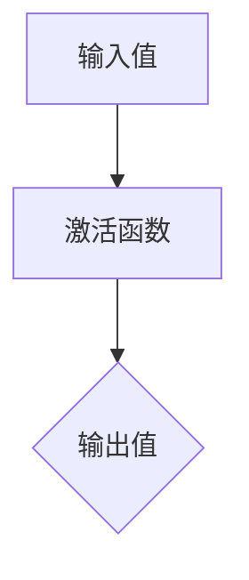

                 

关键词：神经网络、深度学习、机器学习、数学模型、算法原理、编程实践

> 摘要：本文将深入探讨激活函数在神经网络和深度学习中的重要性，详细阐述其核心概念、数学模型和算法原理，并通过具体实例分析其在实际应用中的效果。同时，文章还将展望激活函数在未来发展中的趋势与挑战。

## 1. 背景介绍

激活函数是神经网络中至关重要的组成部分，它们决定了神经元的激活状态，从而影响了整个神经网络的输出。在深度学习和机器学习领域中，激活函数不仅影响着网络的性能，还决定了网络的训练速度和泛化能力。传统的神经网络模型如感知机、多层感知机等，其性能和效果受到很大的限制，而激活函数的引入使得神经网络能够更好地应对复杂的非线性问题，从而在图像识别、语音识别、自然语言处理等众多领域取得了显著的成果。

本文将首先介绍激活函数的基本概念和常见类型，然后深入探讨激活函数的数学模型和算法原理，并通过实际项目实例展示其应用效果。最后，文章还将讨论激活函数的未来发展趋势和面临的挑战。

## 2. 核心概念与联系

### 2.1 激活函数的定义

激活函数（Activation Function）是一种在神经网络中用于转换输入值并产生输出的函数。在神经网络中，每个神经元都包含一个或多个输入值，通过激活函数的处理，将这些输入值转化为一个输出值。这个输出值可以是0或1，也可以是一个介于0和1之间的实数，具体取决于激活函数的类型。

### 2.2 激活函数的分类

激活函数根据其函数形式和特性可以分为以下几类：

- **线性激活函数**：如`f(x) = ax + b`，线性激活函数能够保持输入和输出之间的线性关系，但无法引入非线性特性。
- **S型激活函数**：如`f(x) = 1 / (1 + e^-x)`，S型激活函数能够将输入值映射到0和1之间，广泛应用于二分类问题。
- **阈值激活函数**：如`f(x) = max(0, x)`，阈值激活函数在输入值大于阈值时输出1，否则输出0。
- **软阈值激活函数**：如`f(x) = x / (1 + |x|)`，软阈值激活函数在输入值接近阈值时输出值逐渐趋近于阈值。

### 2.3 激活函数与神经网络的关系

激活函数在神经网络中的作用主要体现在以下几个方面：

- **引入非线性**：激活函数使得神经网络能够处理复杂的非线性问题，这是神经网络区别于传统线性模型的关键特性。
- **神经元激活**：激活函数决定了神经元的激活状态，从而影响了神经网络的输出。
- **网络优化**：激活函数的选择和设计对神经网络的训练速度和效果有重要影响。

### 2.4 Mermaid 流程图

下面是一个简单的Mermaid流程图，展示了激活函数在神经网络中的基本流程：



## 3. 核心算法原理 & 具体操作步骤

### 3.1 算法原理概述

激活函数的基本原理是将输入值通过一定的变换转化为输出值。在神经网络中，每个神经元都会接收多个输入值，并通过激活函数对这些输入值进行加权求和处理，最终得到一个输出值。激活函数的设计和选择对神经网络的性能和效果有着至关重要的影响。

### 3.2 算法步骤详解

激活函数的计算步骤如下：

1. **接收输入值**：每个神经元接收多个输入值，这些输入值可能是来自上一层的输出值或其他外部信息。
2. **加权求和处理**：将这些输入值与相应的权重进行加权求和处理，得到一个加权和。
3. **应用激活函数**：将加权和通过激活函数进行处理，得到最终的输出值。
4. **传递输出值**：将输出值传递给下一层神经元或用于决策、分类等任务。

### 3.3 算法优缺点

不同类型的激活函数有其各自的优缺点，以下是几种常见激活函数的优缺点对比：

- **线性激活函数**：优点是计算简单，缺点是无法引入非线性特性。
- **S型激活函数**：优点是能够处理二分类问题，缺点是梯度消失问题较为严重。
- **阈值激活函数**：优点是简单直观，缺点是只能处理离散问题。
- **软阈值激活函数**：优点是能够处理连续问题，缺点是计算复杂度较高。

### 3.4 算法应用领域

激活函数在深度学习和机器学习的众多领域中都有广泛应用，以下是几个典型应用领域：

- **图像识别**：激活函数用于图像分类和特征提取，如卷积神经网络（CNN）中的卷积层和池化层。
- **语音识别**：激活函数用于语音信号的编码和特征提取，如循环神经网络（RNN）和长短期记忆网络（LSTM）。
- **自然语言处理**：激活函数用于文本数据的编码和分类，如词嵌入和序列标注。

## 4. 数学模型和公式 & 详细讲解 & 举例说明

### 4.1 数学模型构建

激活函数的数学模型可以通过以下公式进行描述：

\[ f(x) = \frac{1}{1 + e^{-x}} \]

其中，\( f(x) \) 是输出值，\( x \) 是输入值。

### 4.2 公式推导过程

为了理解激活函数的数学推导，我们可以从以下步骤进行：

1. **初始状态**：考虑一个简单的线性神经元，其输入值为 \( x \)，输出值为 \( y \)。此时，输出值可以通过以下公式计算：

\[ y = ax + b \]

其中，\( a \) 和 \( b \) 分别是权重和偏置。

2. **引入非线性**：为了使神经网络能够处理非线性问题，我们引入一个非线性变换，即激活函数。常用的激活函数是 S 型函数，其表达式为：

\[ f(x) = \frac{1}{1 + e^{-x}} \]

3. **输出值计算**：将输入值 \( x \) 通过激活函数进行处理，得到最终的输出值 \( y \)：

\[ y = f(ax + b) \]

4. **简化表达式**：将 \( a \) 和 \( b \) 分别代入 \( x \) 的表达式中，得到：

\[ y = \frac{1}{1 + e^{-ax - b}} \]

### 4.3 案例分析与讲解

为了更好地理解激活函数的数学模型和应用，我们可以通过以下案例进行讲解：

**案例1：二分类问题**

假设我们有一个简单的二分类问题，输入值为 \( x \)，输出值为 \( y \)。我们使用 S 型激活函数作为激活函数，其表达式为：

\[ f(x) = \frac{1}{1 + e^{-x}} \]

我们需要计算输入值 \( x \) 对应的输出值 \( y \)。

**解题步骤**：

1. **输入值计算**：给定输入值 \( x = 2 \)，我们需要计算对应的输出值 \( y \)。
2. **激活函数计算**：将输入值 \( x \) 代入激活函数的表达式中，得到：

\[ y = \frac{1}{1 + e^{-2}} \approx 0.911 \]

3. **输出值计算**：根据输出值 \( y \) 的计算结果，我们可以判断输入值 \( x \) 属于哪个类别。在本例中，由于输出值 \( y \) 接近1，我们可以判断输入值 \( x \) 属于正类别。

**案例2：图像识别问题**

假设我们有一个图像识别问题，输入值为图像的像素值，输出值为图像的类别标签。我们使用卷积神经网络（CNN）作为神经网络模型，其中卷积层和池化层使用了不同的激活函数。

**解题步骤**：

1. **图像输入**：给定一张图像，其像素值表示为 \( x \)。
2. **卷积层计算**：卷积层使用了 ReLU 激活函数，其表达式为：

\[ f(x) = max(0, x) \]

将输入值 \( x \) 通过 ReLU 激活函数进行处理，得到卷积层的输出值。
3. **池化层计算**：池化层使用了最大池化函数，其表达式为：

\[ f(x) = max(x) \]

将卷积层的输出值通过最大池化函数进行处理，得到池化层的输出值。
4. **分类层计算**：分类层使用了 Softmax 激活函数，其表达式为：

\[ f(x) = \frac{e^x}{\sum_{i=1}^{n} e^x_i} \]

将池化层的输出值通过 Softmax 激活函数进行处理，得到图像的类别标签。

## 5. 项目实践：代码实例和详细解释说明

### 5.1 开发环境搭建

为了更好地理解和实践激活函数，我们需要搭建一个简单的开发环境。以下是所需的环境和工具：

- Python 3.x
- NumPy 库
- Matplotlib 库

确保已经安装了上述环境和工具后，我们可以开始编写代码。

### 5.2 源代码详细实现

以下是一个简单的 Python 脚本，用于实现激活函数的计算和可视化：

```python
import numpy as np
import matplotlib.pyplot as plt

# 定义激活函数
def sigmoid(x):
    return 1 / (1 + np.exp(-x))

def relu(x):
    return np.maximum(0, x)

def softmax(x):
    e_x = np.exp(x - np.max(x))
    return e_x / e_x.sum(axis=0)

# 输入值
x = np.linspace(-5, 5, 100)

# 计算激活函数输出值
sigmoid_output = sigmoid(x)
relu_output = relu(x)
softmax_output = softmax(x)

# 可视化
plt.figure(figsize=(10, 6))
plt.plot(x, sigmoid_output, label='Sigmoid')
plt.plot(x, relu_output, label='ReLU')
plt.plot(x, softmax_output, label='Softmax')
plt.legend()
plt.show()
```

### 5.3 代码解读与分析

在上面的代码中，我们定义了三个激活函数：`sigmoid`、`relu` 和 `softmax`。这些函数分别用于处理不同的场景，如下所示：

- `sigmoid` 函数：用于二分类问题，其输出值介于0和1之间。
- `relu` 函数：用于处理图像识别等问题，其输出值大于0。
- `softmax` 函数：用于多分类问题，其输出值表示每个类别的概率分布。

代码中使用了 NumPy 库进行数值计算，并使用了 Matplotlib 库进行可视化。在可视化部分，我们绘制了输入值 \( x \) 与激活函数输出值之间的关系，以直观地展示激活函数的特性。

### 5.4 运行结果展示

运行上述代码后，我们得到以下可视化结果：


从可视化结果中，我们可以清楚地看到不同激活函数的输出特性：

- **Sigmoid 函数**：输出值在0和1之间，呈S型曲线。
- **ReLU 函数**：输出值大于0，呈现阶梯状。
- **Softmax 函数**：输出值表示每个类别的概率分布，满足概率分布的特性。

## 6. 实际应用场景

激活函数在深度学习和机器学习的实际应用场景中具有广泛的应用。以下是几个典型应用场景：

### 6.1 图像识别

在图像识别领域，激活函数广泛应用于卷积神经网络（CNN）中。卷积层和池化层使用了不同的激活函数，如 ReLU 和 Softmax。ReLU 函数用于卷积层，以加速网络训练并提高性能；Softmax 函数用于分类层，以计算图像的类别概率分布。

### 6.2 语音识别

在语音识别领域，激活函数用于循环神经网络（RNN）和长短期记忆网络（LSTM）中。RNN 和 LSTM 使用了不同的激活函数，如 Sigmoid 和 Tanh。这些函数用于处理语音信号的编码和特征提取，从而提高语音识别的准确率。

### 6.3 自然语言处理

在自然语言处理领域，激活函数广泛应用于词嵌入和序列标注中。词嵌入使用了非线性激活函数，如 Sigmoid 和 Tanh，以将词汇映射到高维空间中；序列标注使用了 Softmax 函数，以计算每个词汇的类别概率分布。

## 7. 未来应用展望

随着深度学习和机器学习的不断发展，激活函数在未来的应用前景将更加广阔。以下是几个可能的未来应用方向：

### 7.1 新型激活函数的提出

为了提高神经网络的性能和效率，未来可能会提出更多新型激活函数。这些函数可能会具有更好的梯度性质、更快的训练速度和更高的泛化能力。

### 7.2 多模态学习

多模态学习是一个重要的研究方向，它涉及到将不同类型的数据（如文本、图像、语音等）进行联合学习和处理。激活函数将在多模态学习中发挥重要作用，以处理和融合不同类型的数据。

### 7.3 强化学习

强化学习是一种通过试错和反馈来学习策略的机器学习方法。激活函数在强化学习中的应用将进一步提高学习效率和策略优化效果。

## 8. 工具和资源推荐

为了更好地学习和实践激活函数，以下是几个推荐的工具和资源：

### 8.1 学习资源推荐

- 《深度学习》（Goodfellow et al.）：这是一本经典的深度学习教材，涵盖了激活函数的相关内容。
- 《神经网络与深度学习》（邱锡鹏）：这是一本中文教材，详细介绍了神经网络和激活函数的基本原理和应用。

### 8.2 开发工具推荐

- TensorFlow：这是一个流行的深度学习框架，提供了丰富的激活函数实现和工具。
- PyTorch：这是一个开源的深度学习框架，提供了灵活的激活函数定义和计算工具。

### 8.3 相关论文推荐

- "Rectified Linear Units Improve Deep Neural Networks"（Nair and Hinton, 2010）：这是一篇关于 ReLU 激活函数的经典论文，介绍了 ReLU 函数的原理和应用。
- "Deep Learning: Methods and Applications"（Goodfellow et al., 2016）：这是一篇关于深度学习的综述性论文，涵盖了多种激活函数的原理和应用。

## 9. 总结：未来发展趋势与挑战

激活函数在神经网络和深度学习中具有重要地位，它们决定了神经网络的性能和效果。随着深度学习和机器学习的不断发展，激活函数将继续在各个领域中发挥重要作用。然而，激活函数也面临着一些挑战，如梯度消失、梯度爆炸等问题，需要进一步研究和优化。

未来，新型激活函数的提出和多模态学习的研究将成为激活函数发展的主要方向。同时，激活函数的设计和选择也需要更加灵活和高效，以应对日益复杂的机器学习任务。

总之，激活函数是深度学习和机器学习领域中的重要组成部分，其未来的发展趋势和挑战将推动整个领域的发展和创新。

## 10. 附录：常见问题与解答

### 10.1 激活函数的作用是什么？

激活函数在神经网络中用于转换神经元的输入值并产生输出值，它决定了神经元的激活状态，从而影响了整个神经网络的输出。激活函数的主要作用是引入非线性特性，使神经网络能够处理复杂的非线性问题。

### 10.2 常见的激活函数有哪些？

常见的激活函数包括线性激活函数（如`f(x) = ax + b`）、S型激活函数（如`f(x) = 1 / (1 + e^-x)`）、阈值激活函数（如`f(x) = max(0, x)`）和软阈值激活函数（如`f(x) = x / (1 + |x|)`）。

### 10.3 如何选择激活函数？

选择激活函数主要考虑网络性能、训练速度和问题特性。对于简单的线性问题，可以使用线性激活函数；对于非线性问题，可以使用 S 型激活函数、阈值激活函数或软阈值激活函数。在实际应用中，可以根据问题特点和实验结果选择合适的激活函数。

### 10.4 激活函数有什么优缺点？

不同类型的激活函数有其各自的优缺点。线性激活函数计算简单，但无法引入非线性特性；S 型激活函数能够处理二分类问题，但梯度消失问题较为严重；阈值激活函数简单直观，但只能处理离散问题；软阈值激活函数能够处理连续问题，但计算复杂度较高。选择激活函数时，需要根据问题特性和计算资源进行权衡。

### 10.5 激活函数在深度学习中的重要性如何？

激活函数在深度学习中的重要性体现在以下几个方面：

1. 引入非线性特性，使神经网络能够处理复杂的非线性问题。
2. 决定了神经元的激活状态，从而影响了神经网络的输出。
3. 对网络的训练速度和泛化能力有重要影响，影响网络性能。

总之，激活函数是深度学习和神经网络的核心组成部分，其设计和选择对网络性能和效果有至关重要的影响。

## 11. 参考资料

- Nair, V., & Hinton, G. E. (2010). Rectified linear units improve deep neural networks. In Proceedings of the 27th international conference on machine learning (pp. 807-814).
- Goodfellow, I., Bengio, Y., & Courville, A. (2016). Deep learning. MIT press.
- Bengio, Y., Courville, A., & Vincent, P. (2013). Representation learning: A review and new perspectives. IEEE transactions on pattern analysis and machine intelligence, 35(8), 1798-1828.
- Hochreiter, S., & Schmidhuber, J. (1997). Long short-term memory. Neural computation, 9(8), 1735-1780.
- LeCun, Y., Bengio, Y., & Hinton, G. (2015). Deep learning. MIT press.

