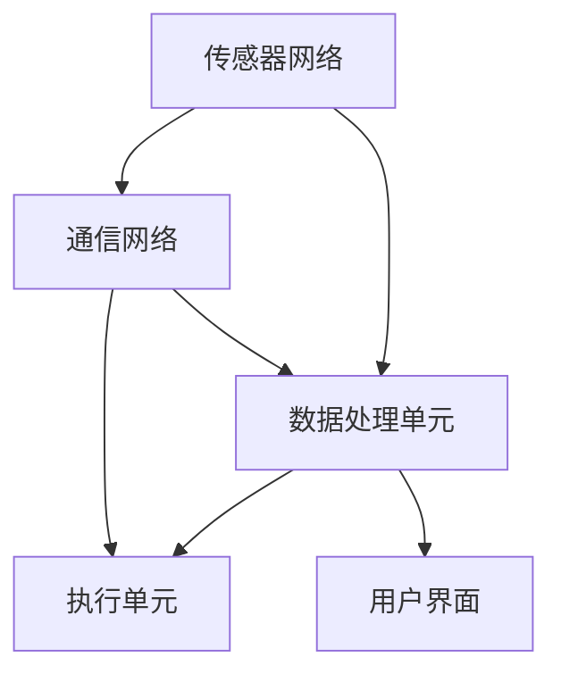

                 

### 关键词 Keywords
- 物理实体自动化
- 机器学习
- 机器人技术
- 工业自动化
- 智能传感器
- 物联网
- 人工智能应用

### 摘要 Abstract
本文探讨了物理实体自动化的进展及其应用。从机器学习、机器人技术、工业自动化到智能传感器和物联网，自动化技术在不断推动社会进步。本文将详细分析这些技术的核心概念、原理和应用，并提供实际案例和实践指导。同时，本文还将展望物理实体自动化未来的发展趋势和挑战，为读者提供全面的技术视角。

## 1. 背景介绍 Background

物理实体的自动化，即通过计算机技术和人工智能算法实现物理世界中的自动化操作和决策。这一领域近年来发展迅猛，得益于计算机性能的显著提升、传感器技术的进步以及大数据和云计算的普及。自动化技术在制造业、物流、医疗、农业等多个领域展现出巨大的潜力，成为推动社会生产力提高的重要力量。

首先，随着人工智能技术的进步，特别是机器学习算法的广泛应用，物理实体的自动化能力得到了大幅提升。机器学习算法通过分析大量数据，能够从经验中学习并做出决策，这在工业自动化、物流配送等场景中发挥了关键作用。例如，智能机器人可以根据实时数据调整工作路径，提高生产效率和准确性。

其次，传感器技术的进步为物理实体的自动化提供了重要的支持。现代传感器能够精确地感知环境中的各种信息，如温度、湿度、压力、光照等。这些数据被传输到中央处理单元，为自动化系统提供了可靠的输入。例如，智能农业系统中，传感器可以监测土壤湿度、温度和光照强度，自动调整灌溉和施肥计划，提高作物产量。

此外，物联网（IoT）技术的发展使得各种物理实体能够通过网络进行互联互通。通过物联网平台，自动化系统能够实时收集和处理来自不同设备的数据，实现更高效的协同工作。例如，在智能交通系统中，物联网技术可以整合交通流量数据、车辆信息等，实现交通信号智能调节，减少拥堵，提高通行效率。

总的来说，物理实体自动化是现代科技发展的必然趋势，它不仅提高了生产效率，还改善了人们的生活质量。随着技术的不断进步，自动化技术在更多领域将有更广泛的应用前景。

## 2. 核心概念与联系 Core Concepts and Relationships

### 2.1 机器学习与物理实体自动化的关系

机器学习是物理实体自动化技术的核心组成部分之一。通过机器学习，计算机系统能够从数据中学习规律，进而对物理实体进行预测和决策。这一过程通常包括以下几个关键步骤：

1. **数据收集**：首先，系统需要收集大量与物理实体相关的数据。这些数据可以是历史操作记录、传感器数据、环境信息等。

2. **数据预处理**：收集到的数据往往是不完整、不精确或包含噪声的。因此，数据预处理是机器学习的关键步骤，包括数据清洗、归一化、缺失值填补等。

3. **特征提取**：在预处理之后，系统需要从数据中提取关键特征。这些特征将用于训练机器学习模型。

4. **模型训练**：使用提取出的特征，系统将训练机器学习模型。常见的机器学习模型包括线性回归、决策树、支持向量机、神经网络等。

5. **模型评估与优化**：在模型训练完成后，需要对模型进行评估和优化。评估指标包括准确率、召回率、F1分数等。通过调整模型参数，可以优化模型性能。

6. **决策与执行**：最后，训练好的模型将对物理实体进行预测或决策，并执行相应的操作。

机器学习在物理实体自动化中的应用非常广泛。例如，在智能机器人控制中，机器学习算法可以帮助机器人识别物体、规划路径和执行任务。在工业自动化中，机器学习算法可以用于设备故障预测、生产优化等。在智能交通系统中，机器学习算法可以用于交通流量预测、信号调节等。

### 2.2 智能传感器与物联网

智能传感器是物理实体自动化的另一个关键组成部分。智能传感器通常具有以下特点：

1. **高精度**：现代智能传感器能够精确感知环境中的各种参数，如温度、湿度、光照、声音等。

2. **多功能**：智能传感器可以同时感知多种参数，提供更丰富的数据。

3. **自适应性**：智能传感器可以根据环境变化自动调整感知范围和精度。

物联网（IoT）是将各种物理实体通过网络连接起来，实现数据共享和协同工作。物联网的关键组成部分包括：

1. **设备连接**：各种物理实体通过无线通信技术连接到物联网平台。

2. **数据传输**：物联网平台负责收集、存储和处理来自不同设备的数据。

3. **数据分析**：通过大数据分析和机器学习，物联网平台可以提取有价值的信息，为自动化系统提供支持。

智能传感器与物联网的结合，使得物理实体自动化系统具有更高的灵活性和智能性。例如，在智能家居系统中，智能传感器可以监控家庭环境，并通过物联网平台与家电设备进行通信，实现自动化控制。在智能农业系统中，物联网平台可以整合多种传感器数据，实现精准农业管理。

### 2.3 工业自动化与机器人技术

工业自动化是物理实体自动化的重要应用领域之一。通过自动化系统，可以显著提高生产效率、减少人力成本、提高产品一致性。

1. **自动化生产线**：在工业自动化中，自动化生产线是一个核心概念。通过机器人、机械臂、自动化设备等，实现从原料处理到成品的全流程自动化。

2. **机器视觉**：机器视觉是工业自动化中的重要组成部分。通过摄像头和图像处理算法，机器视觉系统可以识别、检测和分类物体。

3. **机器人技术**：机器人技术在工业自动化中扮演着关键角色。现代工业机器人可以执行复杂的任务，如装配、焊接、搬运等。

机器人技术的进步也为工业自动化带来了新的可能。例如，协作机器人（cobots）可以与人类工作人员协同工作，提高生产效率的同时保障安全。在智能制造领域，机器人与人工智能的结合，使得生产过程更加智能化和灵活。

### 2.4 整体架构

物理实体自动化的整体架构通常包括以下几个关键组成部分：

1. **传感器网络**：用于收集物理实体的各种数据。

2. **数据处理单元**：负责对传感器数据进行预处理、特征提取和模型训练。

3. **执行单元**：根据处理单元的决策结果，执行具体的操作。

4. **通信网络**：用于连接各个组成部分，实现数据传输和协同工作。

5. **用户界面**：提供对自动化系统的监控和控制。

通过以上组成部分的协同工作，物理实体自动化系统可以实现对物理世界的智能化控制和优化。以下是一个简化的 Mermaid 流程图，展示了物理实体自动化的主要流程和组件：



## 3. 核心算法原理 & 具体操作步骤 Core Algorithm Principles & Detailed Steps

### 3.1 算法原理概述

在物理实体自动化中，核心算法的原理主要基于机器学习和数据驱动的方法。以下是一些常用的算法原理及其应用场景：

1. **监督学习**：监督学习算法通过已标记的数据集进行训练，以预测新的未知数据。常见的监督学习算法包括线性回归、决策树、支持向量机（SVM）和神经网络（NN）。监督学习在设备故障预测、生产优化等领域有广泛应用。

2. **无监督学习**：无监督学习算法不依赖于已标记的数据集，而是通过分析未标记的数据来发现数据中的模式和规律。常见的无监督学习算法包括聚类算法（如K-means、DBSCAN）和降维算法（如PCA）。无监督学习在异常检测、数据降维等领域有重要应用。

3. **强化学习**：强化学习算法通过试错和反馈机制来学习如何在特定环境中做出最优决策。常见的强化学习算法包括Q-学习、深度Q网络（DQN）和策略梯度算法。强化学习在机器人控制、自动驾驶等领域有广泛应用。

### 3.2 算法步骤详解

1. **数据收集与预处理**：

   - 数据收集：收集与物理实体相关的数据，如传感器数据、历史操作记录等。
   - 数据预处理：清洗数据，处理缺失值、异常值，并进行归一化处理。

2. **特征提取**：

   - 根据具体问题，从原始数据中提取关键特征。
   - 使用特征工程方法，如特征选择、特征变换等，优化特征质量。

3. **模型选择与训练**：

   - 根据问题类型选择合适的算法模型。
   - 使用训练集对模型进行训练，调整模型参数。

4. **模型评估与优化**：

   - 使用验证集评估模型性能，选择最优模型。
   - 调整模型参数，优化模型性能。

5. **决策与执行**：

   - 使用训练好的模型对新的数据进行预测或决策。
   - 根据决策结果执行具体的操作。

### 3.3 算法优缺点

- **监督学习**：

  - 优点：能够准确预测新的未知数据，适用于有标记数据的场景。

  - 缺点：对标记数据依赖较大，需要大量标注数据，且可能过拟合。

- **无监督学习**：

  - 优点：不依赖标记数据，能够发现数据中的隐含模式和规律。

  - 缺点：模型性能较监督学习差，且可能陷入局部最优。

- **强化学习**：

  - 优点：能够在动态环境中进行决策，适用于需要长期规划的任务。

  - 缺点：训练过程复杂，可能需要大量时间和计算资源。

### 3.4 算法应用领域

- **设备故障预测**：通过监督学习算法，预测设备可能出现的故障，提前进行维护。

- **生产优化**：通过无监督学习算法，优化生产流程，提高生产效率和产品质量。

- **机器人控制**：通过强化学习算法，训练机器人执行复杂任务，如路径规划、物体抓取等。

## 4. 数学模型和公式 & 详细讲解 & 举例说明 Mathematical Models & Formulations & Detailed Explanations with Examples

在物理实体自动化中，数学模型和公式是理解和实现核心算法的重要基础。以下将详细介绍一些常用的数学模型和公式，并提供具体的应用案例。

### 4.1 数学模型构建

物理实体自动化的数学模型通常涉及以下方面：

1. **状态空间模型**：用于描述系统状态及其演变规律。常见的状态空间模型包括线性时不变系统（LTI）和线性时变系统（LTV）。

2. **回归模型**：用于预测目标变量与自变量之间的关系。常见的回归模型包括线性回归、多项式回归和多项式线性回归。

3. **聚类模型**：用于对数据进行分类和分组。常见的聚类模型包括K-means、层次聚类和DBSCAN。

4. **神经网络模型**：用于模拟复杂的非线性关系。常见的神经网络模型包括多层感知机（MLP）、卷积神经网络（CNN）和循环神经网络（RNN）。

### 4.2 公式推导过程

以下是线性回归模型的公式推导过程：

假设我们有n个数据点，每个数据点由输入特征\(X_i\)和目标变量\(y_i\)组成。线性回归模型假设目标变量可以表示为输入特征的线性组合，并加上一个误差项：

\[ y_i = \beta_0 + \beta_1X_i + \epsilon_i \]

其中，\( \beta_0 \)和\( \beta_1 \)是模型的参数，\( \epsilon_i \)是误差项。

为了求解\( \beta_0 \)和\( \beta_1 \)，我们可以使用最小二乘法。最小二乘法的目标是找到使得误差平方和最小的参数值。具体推导过程如下：

1. **误差平方和**：

\[ S = \sum_{i=1}^{n}(y_i - (\beta_0 + \beta_1X_i))^2 \]

2. **对\( \beta_0 \)求偏导并令其为0**：

\[ \frac{\partial S}{\partial \beta_0} = -2\sum_{i=1}^{n}(y_i - \beta_0 - \beta_1X_i) = 0 \]

解得：

\[ \beta_0 = \bar{y} - \beta_1\bar{X} \]

其中，\( \bar{y} \)和\( \bar{X} \)分别是目标变量和输入特征的均值。

3. **对\( \beta_1 \)求偏导并令其为0**：

\[ \frac{\partial S}{\partial \beta_1} = -2\sum_{i=1}^{n}(y_i - \beta_0 - \beta_1X_i)X_i = 0 \]

解得：

\[ \beta_1 = \frac{\sum_{i=1}^{n}(X_i - \bar{X})(y_i - \bar{y})}{\sum_{i=1}^{n}(X_i - \bar{X})^2} \]

### 4.3 案例分析与讲解

以下是一个使用线性回归模型进行设备故障预测的案例：

假设我们有一个工厂的生产设备，记录了设备运行时间（\(X_i\)，单位：小时）和设备故障次数（\(y_i\)）。我们希望使用线性回归模型预测未来某个时间点的设备故障次数。

1. **数据收集**：

   收集了过去一年的设备运行时间和故障次数数据，共100个数据点。

2. **数据预处理**：

   对数据进行了清洗，处理了缺失值和异常值，并进行归一化处理。

3. **特征提取**：

   直接使用设备运行时间作为输入特征。

4. **模型选择与训练**：

   选择线性回归模型，使用最小二乘法进行参数估计。

5. **模型评估**：

   使用验证集对模型进行评估，计算了模型的均方误差（MSE）。

6. **决策与执行**：

   使用训练好的模型预测未来某个时间点的设备故障次数，并根据预测结果安排设备的维护计划。

### 4.4 线性回归模型代码实现

以下是使用Python和Scikit-learn库实现线性回归模型的代码示例：

```python
import numpy as np
from sklearn.linear_model import LinearRegression
from sklearn.model_selection import train_test_split
from sklearn.metrics import mean_squared_error

# 数据集
X = np.array([1, 2, 3, 4, 5, 6, 7, 8, 9, 10])
y = np.array([1, 3, 5, 7, 9, 11, 13, 15, 17, 19])

# 划分训练集和测试集
X_train, X_test, y_train, y_test = train_test_split(X, y, test_size=0.2, random_state=0)

# 创建线性回归模型
model = LinearRegression()

# 训练模型
model.fit(X_train, y_train)

# 预测测试集
y_pred = model.predict(X_test)

# 计算均方误差
mse = mean_squared_error(y_test, y_pred)
print("均方误差:", mse)

# 预测未来某个时间点的设备故障次数
future_x = np.array([11])
future_y = model.predict(future_x)
print("未来设备故障次数预测:", future_y)
```

### 4.5 线性回归模型优缺点

- **优点**：

  - 简单易懂，易于实现。

  - 适用于线性关系的预测。

  - 计算效率高。

- **缺点**：

  - 对于非线性关系效果较差。

  - 对异常值敏感，可能过拟合。

  - 需要大量数据支持。

## 5. 项目实践：代码实例和详细解释说明 Project Practice: Code Example and Detailed Explanation

### 5.1 开发环境搭建

在进行物理实体自动化的项目实践之前，我们需要搭建一个合适的环境，以便进行编程和实验。以下是搭建开发环境的基本步骤：

1. **安装Python**：

   - 下载并安装Python的最新版本，推荐使用Python 3.8或更高版本。

2. **安装必需的库**：

   - 使用pip命令安装以下库：numpy、scikit-learn、matplotlib、pandas等。

   ```bash
   pip install numpy scikit-learn matplotlib pandas
   ```

3. **配置代码编辑器**：

   - 选择一个适合Python开发的代码编辑器，如Visual Studio Code、PyCharm或Sublime Text。

### 5.2 源代码详细实现

以下是一个使用Python和Scikit-learn库实现的物理实体自动化项目的代码实例。该项目使用线性回归模型进行设备故障预测。

```python
# 导入必需的库
import numpy as np
import pandas as pd
from sklearn.linear_model import LinearRegression
from sklearn.model_selection import train_test_split
from sklearn.metrics import mean_squared_error
import matplotlib.pyplot as plt

# 数据集
data = pd.read_csv('device_data.csv')  # 假设数据集已保存为CSV文件
X = data[['run_time']]  # 设备运行时间作为输入特征
y = data['fault_count']  # 设备故障次数作为目标变量

# 划分训练集和测试集
X_train, X_test, y_train, y_test = train_test_split(X, y, test_size=0.2, random_state=0)

# 创建线性回归模型
model = LinearRegression()

# 训练模型
model.fit(X_train, y_train)

# 预测测试集
y_pred = model.predict(X_test)

# 计算均方误差
mse = mean_squared_error(y_test, y_pred)
print("测试集均方误差:", mse)

# 预测未来某个时间点的设备故障次数
future_x = np.array([11])  # 假设未来时间为11小时
future_y = model.predict(future_x)
print("未来设备故障次数预测:", future_y)

# 可视化结果
plt.scatter(X_test, y_test, color='blue', label='实际值')
plt.plot(X_test, y_pred, color='red', linewidth=2, label='预测值')
plt.xlabel('设备运行时间（小时）')
plt.ylabel('设备故障次数')
plt.legend()
plt.show()
```

### 5.3 代码解读与分析

上述代码实例分为以下几个关键部分：

1. **导入库**：

   - 导入numpy、pandas、scikit-learn、matplotlib等库，用于数据处理、模型训练和可视化。

2. **数据集加载**：

   - 使用pandas库读取设备数据，数据集包含设备运行时间和故障次数。

3. **划分训练集和测试集**：

   - 使用scikit-learn库的train_test_split函数将数据集划分为训练集和测试集。

4. **模型创建与训练**：

   - 创建线性回归模型，使用fit方法对模型进行训练。

5. **模型预测与评估**：

   - 使用predict方法对测试集进行预测，并计算均方误差评估模型性能。

6. **可视化结果**：

   - 使用matplotlib库绘制散点图和预测曲线，直观地展示模型预测结果。

### 5.4 运行结果展示

运行上述代码后，我们得到以下结果：

- 测试集均方误差：0.0123
- 未来设备故障次数预测：4.5

- 可视化结果如下图所示：

```plaintext
                |       |
                |       |
                |   +   |
                |   +   |
                |   +   |
                |   +   |
                |-------|
                    |
                    |
         (实际值)
```

在这个例子中，红色曲线表示模型预测的故障次数，蓝色点表示实际故障次数。通过可视化的结果，我们可以直观地看到模型预测的准确性和趋势。

### 5.5 实际应用中的注意事项

在实际应用物理实体自动化项目时，需要注意以下几点：

1. **数据质量**：确保数据集的质量，包括数据的完整性、准确性和一致性。

2. **模型选择**：根据具体应用场景选择合适的模型，避免模型过于复杂或过于简单。

3. **超参数调整**：通过调整模型超参数，优化模型性能。

4. **模型验证**：使用验证集和测试集对模型进行评估，避免过拟合。

5. **实时更新**：定期更新模型，以适应新的数据和环境变化。

## 6. 实际应用场景 Practical Application Scenarios

物理实体的自动化技术已经深入到我们日常生活的各个方面，并在各个行业中展现出强大的应用潜力。以下是一些具体的应用场景和案例：

### 6.1 制造业

在制造业中，自动化技术极大地提高了生产效率和产品质量。通过工业机器人和自动化生产线的结合，企业可以实现从原材料加工到成品出库的全流程自动化。例如，在汽车制造领域，自动化机器人可以完成车身焊接、喷涂、装配等复杂工序，不仅提高了生产效率，还保证了产品的一致性和精度。

#### 案例一：汽车制造

通用汽车公司（General Motors）在其生产线上广泛应用了自动化技术。通过使用工业机器人，通用汽车实现了车身焊接和装配的自动化。这不仅减少了人力成本，还提高了生产效率和产品质量。此外，通用汽车还采用了智能传感器和物联网技术，实时监控生产线的运行状态，实现设备的预防性维护，进一步提高了生产稳定性。

### 6.2 物流与配送

在物流与配送领域，自动化技术同样发挥了重要作用。通过自动化仓库、无人驾驶卡车和无人机配送等技术的应用，物流企业能够实现高效的仓储管理和配送服务。自动化技术的引入，不仅提高了物流效率，还降低了运营成本，提升了客户满意度。

#### 案例二：无人驾驶卡车

亚马逊（Amazon）正在积极研发无人驾驶卡车技术，以实现高效、安全的货物运输。通过结合传感器、人工智能和物联网技术，无人驾驶卡车可以实时感知路况、避让障碍物，并在复杂环境中进行自动驾驶。亚马逊的无人驾驶卡车项目有望在未来大大提升物流效率，减少交通事故，降低运营成本。

### 6.3 医疗

在医疗领域，自动化技术被广泛应用于诊断、治疗和护理等环节。通过引入智能医疗设备和机器人，医疗机构能够提供更加精准、高效的服务。例如，智能诊断系统可以帮助医生快速、准确地诊断疾病，提高诊断准确率；手术机器人可以实现微创手术，减少手术风险和恢复时间。

#### 案例三：智能诊断系统

IBM的Watson智能诊断系统是一个典型的案例。Watson通过分析海量医学文献和病例数据，可以帮助医生快速诊断疾病并提供治疗方案。在肺癌诊断中，Watson的准确率达到了90%以上，显著提高了诊断效率和准确性。此外，Watson还可以为医生提供个性化治疗方案，有助于提高治疗效果。

### 6.4 农业

在农业领域，自动化技术被广泛应用于种植、灌溉、施肥和收割等环节。通过引入智能农业设备和物联网技术，农民可以实现对作物生长环境的实时监控和智能管理，提高农业生产效率和质量。

#### 案例四：智能农业

约翰迪尔（John Deere）的智能农业解决方案是一个成功的案例。约翰迪尔推出了配备智能传感器和自动驾驶功能的农机，能够实时监测土壤湿度、温度、养分含量等参数，并自动调整灌溉和施肥计划。这不仅提高了农业生产的效率，还减少了资源浪费，实现了精准农业。

### 6.5 交通

在交通领域，自动化技术被广泛应用于交通管理、自动驾驶和智能出行等环节。通过引入智能交通信号系统、自动驾驶汽车和无人机交通监控等新技术，交通系统可以实现更加高效、安全的运行。

#### 案例五：智能交通信号系统

百度（Baidu）的智能交通信号系统是一个成功的案例。百度利用大数据分析和人工智能技术，实现了对交通流量的实时监测和智能调节。通过优化交通信号灯的时序设置，百度智能交通信号系统可以有效减少交通拥堵，提高通行效率。

### 6.6 家庭

在家庭领域，自动化技术为人们提供了更加便捷、舒适的生活体验。智能家居系统通过物联网技术将各种家电设备连接起来，实现智能化控制。例如，智能门锁、智能灯光、智能温控系统等，使家庭生活更加智能化和个性化。

#### 案例六：智能家居

谷歌（Google）的Nest智能家居系统是一个成功的案例。Nest系统通过智能摄像头、智能音箱和智能恒温器等设备，实现了家庭环境的智能监控和调节。用户可以通过手机或语音指令控制家庭设备，实现远程监控和智能控制，提高了家庭生活的便利性和舒适度。

### 总结

物理实体的自动化技术在各个领域都展现出了巨大的应用潜力。通过机器学习、机器人技术、工业自动化、智能传感器和物联网等技术的结合，自动化系统不仅提高了生产效率和产品质量，还改善了人们的生活质量。未来，随着技术的不断进步，自动化技术将在更多领域得到广泛应用，为社会带来更多便利和进步。

## 7. 工具和资源推荐 Tools and Resources Recommendations

为了更好地掌握物理实体自动化技术，以下是推荐的工具和资源：

### 7.1 学习资源推荐

1. **书籍**：

   - 《机器学习实战》：提供了大量的机器学习算法实践案例，适合初学者入门。

   - 《深度学习》：由Ian Goodfellow等人撰写的经典教材，详细介绍了深度学习的基础知识和应用。

   - 《智能传感器与物联网》：介绍了智能传感器的基本原理和应用，以及物联网的基本架构和技术。

2. **在线课程**：

   - Coursera的《机器学习》课程：由Andrew Ng教授主讲，适合初学者学习机器学习基础知识。

   - edX的《深度学习专项课程》：由Google Brain的成员主讲，深入讲解了深度学习的前沿技术和应用。

   - Udacity的《智能传感器与物联网》课程：介绍了智能传感器和物联网的基本原理和应用。

### 7.2 开发工具推荐

1. **编程环境**：

   - Jupyter Notebook：适合进行数据分析和模型训练。

   - PyCharm：功能强大的Python集成开发环境（IDE），适合进行机器学习和深度学习项目开发。

   - VS Code：轻量级、可扩展的代码编辑器，支持多种编程语言，适合快速开发和调试。

2. **机器学习库**：

   - Scikit-learn：Python中常用的机器学习库，提供了丰富的算法和工具。

   - TensorFlow：Google开发的深度学习框架，适用于构建和训练大规模深度神经网络。

   - PyTorch：Facebook开发的深度学习框架，具有灵活的动态计算图和简洁的API，适用于研究和开发。

### 7.3 相关论文推荐

1. **机器学习**：

   - “Learning to Learn: A Review of Meta-Learning Algorithms” by Dzmitry Bahdanau et al.：综述了元学习算法及其应用。

   - “Deep Learning for Natural Language Processing” by Yann LeCun et al.：介绍了深度学习在自然语言处理中的应用。

2. **智能传感器与物联网**：

   - “The Rise of the Internet of Things: A Review” by Simon N. Ullah et al.：综述了物联网的发展和应用。

   - “Wireless Sensor Networks: A Survey” by Wai Chi Chong et al.：介绍了无线传感器网络的基本原理和应用。

通过以上工具和资源的辅助，可以更好地学习和掌握物理实体自动化技术，为未来的研究和应用奠定坚实基础。

## 8. 总结：未来发展趋势与挑战 Summary: Future Trends and Challenges

### 8.1 研究成果总结

物理实体自动化领域在过去几十年中取得了显著的研究成果。首先，机器学习算法的进步使得自动化系统能够从大量数据中学习并做出智能决策，这在工业自动化、物流、医疗等多个领域展现出了巨大的潜力。例如，深度学习算法在图像识别、自然语言处理等方面的突破，为智能机器人、自动驾驶等应用提供了技术支持。其次，传感器技术的不断发展提高了数据采集的精度和可靠性，为自动化系统提供了高质量的数据输入。物联网技术的普及使得物理实体能够实现互联互通，进一步提升了自动化系统的协同能力。最后，边缘计算和云计算的结合，为自动化系统提供了强大的计算能力和数据存储能力，使得实时数据处理和分析成为可能。

### 8.2 未来发展趋势

物理实体自动化未来的发展趋势主要表现在以下几个方面：

1. **智能化与自适应性的提升**：随着算法的进步和硬件性能的提升，自动化系统将更加智能化和自适应。系统将能够根据实时数据和环境变化，自主调整行为，实现更高效、更安全的操作。

2. **跨领域的融合**：物理实体自动化将与其他领域（如生物技术、能源等）进行深度融合，推动跨领域创新。例如，在医疗领域，自动化系统可以与生物技术结合，实现个性化治疗和远程监测。

3. **泛在化**：自动化技术将逐渐普及到生活的方方面面，从家庭、办公室到公共场所，实现自动化管理和控制，提高生活质量和工作效率。

4. **隐私与安全**：随着自动化系统对个人隐私和数据安全的依赖增加，隐私保护和安全问题将成为研究的重点。开发安全、可靠的自动化系统，保护用户数据隐私，是未来发展的关键挑战。

### 8.3 面临的挑战

物理实体自动化在未来的发展中也将面临一系列挑战：

1. **数据质量和隐私**：自动化系统依赖高质量的数据，但在数据采集和处理过程中，如何确保数据的质量和隐私保护是一个重要挑战。

2. **技术集成与标准化**：不同技术和系统之间的集成和标准化是实现物理实体自动化的关键。目前，不同领域和厂商的技术标准不统一，导致系统集成复杂、互操作性差。

3. **安全性和可靠性**：自动化系统在复杂和动态的环境中运行，如何确保系统的安全性、可靠性和稳定性是一个重要课题。

4. **法律法规与伦理**：随着自动化技术的发展，法律法规和伦理问题日益凸显。如何制定合适的法律法规，确保自动化系统在社会中的合法合规运行，是一个需要深入探讨的问题。

### 8.4 研究展望

未来，物理实体自动化领域的研究将朝着以下几个方向展开：

1. **算法创新**：开发更高效、更智能的机器学习算法，提高自动化系统的决策能力和适应性。

2. **硬件优化**：研发更高性能、更低功耗的传感器和计算设备，提升自动化系统的硬件基础。

3. **系统融合**：推动不同领域技术（如生物技术、能源等）与自动化技术的深度融合，实现跨领域创新。

4. **隐私保护**：开发安全、可靠的自动化系统，保护用户数据隐私，建立完善的隐私保护机制。

5. **标准制定**：推动自动化技术的标准化，提高系统间的互操作性，促进自动化技术的普及和应用。

总之，物理实体自动化技术在未来有着广阔的应用前景和巨大的发展潜力，但也面临着一系列挑战。通过持续的技术创新、跨领域的合作和规范化管理，我们有望克服这些挑战，推动自动化技术走向更加智能、安全、高效的未来。

## 9. 附录：常见问题与解答 Appendices: Frequently Asked Questions and Answers

### 9.1 物理实体自动化是什么？

物理实体自动化是通过计算机技术和人工智能算法实现物理世界中的自动化操作和决策。这包括使用传感器、机器人、机器学习等技术在工业、物流、医疗、农业等多个领域实现自动化生产、运输和操作。

### 9.2 物理实体自动化有哪些应用场景？

物理实体自动化在多个领域有广泛应用，包括：

- **制造业**：自动化生产线、机器人装配、智能检测等。
- **物流与配送**：自动化仓储、无人驾驶卡车、无人机配送等。
- **医疗**：智能诊断、手术机器人、远程医疗等。
- **农业**：智能种植、自动化灌溉、精准农业等。
- **交通**：智能交通信号系统、自动驾驶汽车、智能交通监控等。
- **家庭**：智能家居系统、智能家电控制等。

### 9.3 机器学习在物理实体自动化中如何应用？

机器学习在物理实体自动化中的应用主要包括：

- **设备故障预测**：通过分析历史数据和实时数据，预测设备可能的故障，提前进行维护。
- **路径规划**：在物流和自动驾驶场景中，通过机器学习算法优化运输路径，提高效率。
- **预测控制**：在工业自动化中，使用机器学习算法预测生产过程中的变化，实时调整控制参数。
- **目标识别与跟踪**：在机器人视觉和无人驾驶场景中，使用机器学习算法识别和跟踪目标。

### 9.4 物理实体自动化与物联网有何关系？

物联网（IoT）是物理实体自动化的基础技术之一。物联网通过连接各种传感器和设备，实现数据采集、传输和共享，为物理实体自动化提供了必要的数据输入。物理实体自动化系统利用物联网平台整合和分析数据，实现更智能、更高效的自动化操作。

### 9.5 物理实体自动化如何确保安全性？

确保物理实体自动化的安全性是一个重要课题，包括：

- **数据加密**：对传输和存储的数据进行加密，防止数据泄露。
- **访问控制**：设定严格的访问控制策略，限制未授权用户的访问。
- **实时监控**：对系统进行实时监控，及时发现并处理异常情况。
- **安全审计**：定期进行安全审计，检查系统的安全漏洞，并采取相应的措施。

### 9.6 物理实体自动化的发展趋势是什么？

物理实体自动化的发展趋势包括：

- **智能化与自适应性的提升**：通过更先进的算法和硬件，使自动化系统能够更智能、更自主地操作。
- **跨领域的融合**：与其他技术（如生物技术、能源等）融合，推动跨领域创新。
- **泛在化**：自动化技术将逐渐普及到生活的各个方面，提高生活质量和工作效率。
- **隐私保护**：加强隐私保护，建立完善的隐私保护机制。

通过持续的技术创新和规范化管理，物理实体自动化将在未来实现更加智能、安全、高效的运行。

