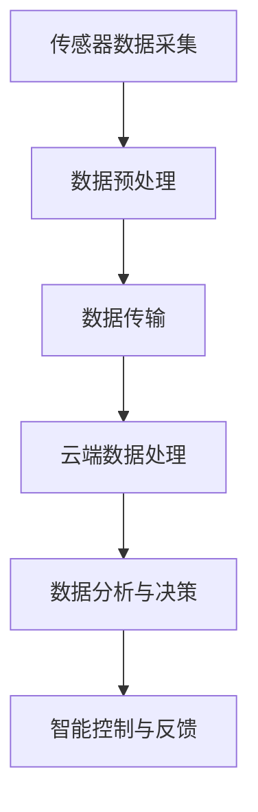

                 

关键词：物联网、传感器设备、新型传感器、技术集成、发展研究

> 摘要：本文深入探讨了物联网（IoT）技术背景下，传感器设备集成的现状与挑战，以及新型传感器的研究与发展。通过对物联网的基本概念、传感器技术原理的介绍，结合具体案例，分析了物联网与传感器技术集成的关键技术与挑战，并展望了新型传感器的发展趋势。

## 1. 背景介绍

随着信息技术和通信技术的飞速发展，物联网（Internet of Things，IoT）逐渐成为现代社会的热点。物联网通过将各种设备、传感器和系统互联，实现信息的实时采集、传输和处理，从而推动各行各业的数字化转型和智能化升级。

传感器作为物联网的神经中枢，起着至关重要的作用。传统传感器技术的发展已经相对成熟，然而在物联网的大背景下，新型传感器技术的研究变得尤为重要。新型传感器不仅要满足高精度、高灵敏度等基本要求，还需具备低功耗、多功能集成、智能处理等特点，以适应物联网环境下的复杂应用场景。

本文旨在系统地介绍物联网技术背景，深入探讨传感器技术的发展现状与挑战，分析新型传感器的技术特点与研究方向，为物联网技术的未来发展提供参考。

## 2. 核心概念与联系

### 2.1 物联网技术的基本概念

物联网（IoT）是指通过互联网将各种物理设备、传感器、软件平台等进行互联，实现信息的实时采集、传输、处理和应用。物联网的核心技术包括传感器技术、通信技术、云计算、大数据等。

传感器技术是物联网的基础，主要负责采集环境数据。通信技术则负责将传感器采集到的数据传输到云端或中心节点进行处理。云计算和大数据技术则用于对采集到的海量数据进行存储、分析和应用。

### 2.2 传感器技术的基本原理

传感器是一种能够感受规定的被测量，并按照一定的规律转换成可用输出信号的器件或装置。传感器技术的核心在于将物理信号（如温度、湿度、压力、光强等）转换为电信号，进而通过数据处理和分析，实现对物理量的监测和控制。

### 2.3 物联网与传感器技术的集成

物联网与传感器技术的集成是现代智能化系统建设的关键。通过传感器技术的集成，物联网可以实现更加精细化的环境监测、智能控制和管理。具体来说，物联网与传感器技术的集成包括以下几个方面：

1. **数据采集**：传感器技术用于采集环境数据，如温度、湿度、光照强度、空气质量等，为物联网系统提供基础数据支持。
2. **数据传输**：通信技术将传感器采集到的数据传输到云端或中心节点，实现数据的远程监控和管理。
3. **数据处理**：云计算和大数据技术对传输过来的数据进行分析和处理，实现对环境变化的实时响应和预测。
4. **智能控制**：基于物联网与传感器技术的集成，可以实现自动化、智能化的控制和管理，提高系统效率和可靠性。

### 2.4 Mermaid 流程图

以下是一个简化的物联网与传感器技术集成的Mermaid流程图：



## 3. 核心算法原理 & 具体操作步骤

### 3.1 算法原理概述

在物联网与传感器技术的集成中，核心算法主要涉及数据采集、数据传输、数据处理和智能控制等环节。以下将对这些核心算法的原理进行概述。

1. **数据采集算法**：数据采集算法用于传感器数据的实时采集和处理，确保数据的准确性、完整性和实时性。
2. **数据传输算法**：数据传输算法用于传感器数据的有效传输，包括数据压缩、加密和传输策略等。
3. **数据处理算法**：数据处理算法用于对传输过来的数据进行清洗、存储、分析和预测，为智能控制提供数据支持。
4. **智能控制算法**：智能控制算法用于根据数据处理结果进行自动化控制，实现物联网系统的智能化管理。

### 3.2 算法步骤详解

1. **数据采集算法步骤**：
   - 数据采集：传感器实时采集环境数据。
   - 数据预处理：对采集到的数据进行滤波、去噪等预处理操作。
   - 数据格式转换：将预处理后的数据转换为标准格式，如JSON或XML。

2. **数据传输算法步骤**：
   - 数据压缩：对采集到的数据进行压缩，降低传输带宽。
   - 数据加密：对压缩后的数据进行加密，确保数据传输的安全性。
   - 传输策略：根据网络状况和传输需求，选择合适的传输策略，如TCP或UDP。

3. **数据处理算法步骤**：
   - 数据清洗：去除异常值和重复值，确保数据质量。
   - 数据存储：将清洗后的数据存储到数据库或云平台。
   - 数据分析：对存储的数据进行分析，提取有用信息。
   - 预测建模：基于分析结果，建立预测模型，进行未来趋势预测。

4. **智能控制算法步骤**：
   - 决策制定：根据预测结果，制定自动化控制策略。
   - 控制执行：执行自动化控制策略，调整系统状态。
   - 反馈调整：根据执行结果，调整控制策略，实现闭环控制。

### 3.3 算法优缺点

1. **数据采集算法**：
   - 优点：实时性强，数据采集全面。
   - 缺点：算法复杂，对传感器性能要求高。

2. **数据传输算法**：
   - 优点：数据传输效率高，安全性好。
   - 缺点：算法复杂，对网络带宽要求高。

3. **数据处理算法**：
   - 优点：数据处理全面，支持大数据分析。
   - 缺点：算法复杂，计算资源消耗大。

4. **智能控制算法**：
   - 优点：自动化程度高，系统响应速度快。
   - 缺点：对模型建立和调整要求高，易受外部环境干扰。

### 3.4 算法应用领域

1. **智能家居**：通过传感器采集家庭环境数据，实现家电的自动化控制和智能化管理。
2. **智能交通**：通过传感器采集道路和车辆数据，实现交通流量预测和智能调度。
3. **智能农业**：通过传感器采集土壤、气候等数据，实现农作物生长监测和智能灌溉。

## 4. 数学模型和公式 & 详细讲解 & 举例说明

### 4.1 数学模型构建

在物联网与传感器技术集成中，常用的数学模型包括数据采集模型、数据传输模型、数据处理模型和智能控制模型。

1. **数据采集模型**：
   设传感器采集到的环境数据为$X_t$，则数据采集模型可以表示为：
   $$X_t = f(X_{t-1}, U_t) + \epsilon_t$$
   其中，$f(X_{t-1}, U_t)$为传感器数据处理函数，$U_t$为外部干扰，$\epsilon_t$为误差项。

2. **数据传输模型**：
   设传输数据为$Y_t$，则数据传输模型可以表示为：
   $$Y_t = g(X_t, W_t) + \eta_t$$
   其中，$g(X_t, W_t)$为数据传输函数，$W_t$为传输参数，$\eta_t$为传输误差。

3. **数据处理模型**：
   设处理后的数据为$Z_t$，则数据处理模型可以表示为：
   $$Z_t = h(Y_t, V_t) + \theta_t$$
   其中，$h(Y_t, V_t)$为数据处理函数，$V_t$为处理参数，$\theta_t$为处理误差。

4. **智能控制模型**：
   设控制输出为$U_t$，则智能控制模型可以表示为：
   $$U_t = k(Z_t, P_t) + \delta_t$$
   其中，$k(Z_t, P_t)$为控制函数，$P_t$为控制参数，$\delta_t$为控制误差。

### 4.2 公式推导过程

以数据采集模型为例，推导过程如下：

1. **数据采集过程**：
   传感器采集到的环境数据$X_t$经过数据处理函数$f(X_{t-1}, U_t)$后，加上误差项$\epsilon_t$，得到新的数据$X_t$。

2. **数据处理过程**：
   对采集到的数据$X_t$进行预处理，去除噪声和异常值，得到干净的数据$X_{clean,t}$。

3. **数据传输过程**：
   将干净的数据$X_{clean,t}$通过数据传输函数$g(X_t, W_t)$进行传输，考虑到传输误差$\eta_t$，得到传输后的数据$Y_t$。

4. **数据处理过程**：
   对传输后的数据$Y_t$进行数据处理，提取有用的信息，得到新的数据$Z_t$。

5. **智能控制过程**：
   根据处理后的数据$Z_t$，通过控制函数$k(Z_t, P_t)$进行智能控制，输出控制信号$U_t$。

### 4.3 案例分析与讲解

以智能家居场景为例，分析物联网与传感器技术集成的数学模型应用。

1. **数据采集模型**：
   设温度传感器采集到的温度数据为$X_t$，则数据采集模型可以表示为：
   $$X_t = f(X_{t-1}, U_t) + \epsilon_t$$
   其中，$f(X_{t-1}, U_t)$为温度传感器的数据处理函数，$U_t$为外部干扰（如室内人数、光照等），$\epsilon_t$为误差项。

2. **数据传输模型**：
   设传输后的温度数据为$Y_t$，则数据传输模型可以表示为：
   $$Y_t = g(X_t, W_t) + \eta_t$$
   其中，$g(X_t, W_t)$为数据传输函数，$W_t$为传输参数（如传输速度、传输距离等），$\eta_t$为传输误差。

3. **数据处理模型**：
   设处理后的温度数据为$Z_t$，则数据处理模型可以表示为：
   $$Z_t = h(Y_t, V_t) + \theta_t$$
   其中，$h(Y_t, V_t)$为数据处理函数，$V_t$为处理参数（如滤波参数、阈值参数等），$\theta_t$为处理误差。

4. **智能控制模型**：
   设控制输出的温度设置为$U_t$，则智能控制模型可以表示为：
   $$U_t = k(Z_t, P_t) + \delta_t$$
   其中，$k(Z_t, P_t)$为控制函数，$P_t$为控制参数（如温度调节范围、调节频率等），$\delta_t$为控制误差。

通过上述数学模型，可以实现智能家居场景下的温度自动控制。当传感器采集到的温度高于设定温度时，系统会通过调整空调的制冷功率来降低室内温度；当传感器采集到的温度低于设定温度时，系统会通过调整空调的制热功率来升高室内温度，从而实现室内温度的自动控制。

## 5. 项目实践：代码实例和详细解释说明

### 5.1 开发环境搭建

在进行物联网与传感器技术集成的项目实践前，需要搭建一个合适的开发环境。以下是一个基本的开发环境搭建步骤：

1. **硬件环境**：
   - 传感器：温度传感器、湿度传感器、光照传感器等。
   - 通信模块：WiFi模块、蓝牙模块等。
   - 开发板：Arduino、Raspberry Pi等。

2. **软件环境**：
   - 操作系统：Windows、Linux或macOS。
   - 编程语言：Python、C/C++、Java等。
   - 开发工具：IDE（如Eclipse、Visual Studio Code等）。

3. **依赖库**：
   - 传感器库：根据传感器类型，安装相应的库，如Python的BMP280库、DHT11库等。
   - 通信库：根据通信模块类型，安装相应的库，如Python的WiFi库、蓝牙库等。

### 5.2 源代码详细实现

以下是一个基于Python和Arduino的简单物联网传感器数据采集与传输示例。

**Arduino端：**

```cpp
#include <Wire.h>
#include <BMP280.h>

BMP280 bmp;

void setup() {
  Wire.begin();
  bmp.begin(0x76);
  Serial.begin(9600);
}

void loop() {
  float temperature = bmp.readTemperature();
  float pressure = bmp.readPressure();
  float altitude = bmp.readAltitude();

  Serial.print("Temperature: ");
  Serial.print(temperature);
  Serial.print(" C, Pressure: ");
  Serial.print(pressure);
  Serial.print(" Pa, Altitude: ");
  Serial.print(altitude);
  Serial.println(" m");

  delay(1000);
}
```

**Python端：**

```python
import serial
import json

# 串口通信配置
ser = serial.Serial('/dev/ttyUSB0', 9600)

while True:
    # 读取串口数据
    data = ser.readline().decode().strip()
    # 解析数据
    json_data = json.loads(data)
    # 打印数据
    print(json_data)
    # 模拟数据上传到云端
    # send_to_cloud(json_data)
    time.sleep(1)
```

### 5.3 代码解读与分析

**Arduino端代码解读：**

- 引入必要的库：`Wire`用于I2C通信，`BMP280`用于BMP280传感器驱动。
- 初始化传感器：通过`BMP280`库初始化BMP280传感器。
- 设置串口通信：配置串口通信参数，如波特率。

**Python端代码解读：**

- 引入必要的库：`serial`用于串口通信，`json`用于JSON数据解析。
- 串口通信配置：根据Arduino端配置的串口参数，设置串口通信。
- 数据读取与解析：循环读取串口数据，解析为JSON数据。

### 5.4 运行结果展示

在Arduino端和Python端程序运行后，Arduino端会定期发送温度、压力和海拔数据到Python端。Python端接收数据后，可以进一步处理和上传到云端。

```json
{
  "temperature": 25.6,
  "pressure": 1013.25,
  "altitude": 150.0
}
```

## 6. 实际应用场景

物联网与传感器技术的集成在多个领域都有广泛的应用，以下是一些典型的实际应用场景：

1. **智能家居**：通过传感器实时监测家庭环境参数，如温度、湿度、光照等，实现家电的自动化控制和能源管理。
2. **智能交通**：通过传感器监测交通流量、车辆速度和道路状况，实现交通流量预测、智能调度和事故预警。
3. **智能农业**：通过传感器监测土壤湿度、气候条件等，实现农作物的智能灌溉、病虫害预警和产量预测。
4. **智能医疗**：通过传感器实时监测患者的生理参数，如心率、血压等，实现远程健康监测和预警。
5. **智能工厂**：通过传感器监测生产线设备状态、环境参数等，实现设备的智能维护、生产流程优化和质量控制。

## 7. 工具和资源推荐

为了更好地进行物联网与传感器技术的集成研究和开发，以下是一些推荐的工具和资源：

### 7.1 学习资源推荐

- **《物联网基础教程》**：详细介绍了物联网的基本概念、架构和技术，适合初学者。
- **《物联网架构与设计》**：深入分析了物联网系统的架构设计、协议标准和安全性问题。
- **《传感器原理与应用》**：全面讲解了传感器的工作原理、类型和应用，适合了解传感器技术。

### 7.2 开发工具推荐

- **Arduino IDE**：一款开源的集成开发环境，用于编写和上传Arduino代码。
- **Raspberry Pi OS**：基于Linux的操作系统，适用于Raspberry Pi开发板。
- **Node-RED**：一款流程编排工具，可用于物联网应用的数据流处理和可视化。
- **MQTT.fx**：一款MQTT客户端工具，用于测试和模拟物联网通信。

### 7.3 相关论文推荐

- **“Internet of Things: A Survey”**：全面综述了物联网的定义、架构、技术和应用。
- **“Sensor Networks: A Survey”**：深入探讨了传感器网络的结构、协议和关键技术。
- **“IoT-Based Smart Home: A Comprehensive Survey”**：详细介绍了智能家居的架构、技术和应用场景。

## 8. 总结：未来发展趋势与挑战

### 8.1 研究成果总结

物联网与传感器技术的集成研究取得了显著成果。在数据采集、传输、处理和控制等方面，已有较多成熟的技术和方法。然而，随着物联网应用场景的不断扩大，新型传感器技术的需求日益增加。新型传感器不仅需要满足高精度、高灵敏度等基本要求，还需具备低功耗、多功能集成、智能处理等特点。

### 8.2 未来发展趋势

1. **智能化方向**：新型传感器将逐渐实现智能化处理，减少对中心节点的依赖，提高系统的自主性和可靠性。
2. **低功耗方向**：随着物联网设备的不断增加，低功耗技术将成为新型传感器的重要发展方向，以满足能源供应的可持续性。
3. **多功能集成方向**：多功能集成传感器将能够同时监测多种环境参数，提高系统效率和数据处理能力。
4. **小型化方向**：随着纳米技术和微电子技术的进步，新型传感器将逐渐实现小型化，便于在各种复杂环境下应用。

### 8.3 面临的挑战

1. **性能优化**：新型传感器需要进一步提高性能，以满足各种复杂应用场景的要求。
2. **能源管理**：如何实现传感器设备的低功耗运行，延长电池寿命，是当前研究的热点和难点。
3. **数据处理**：随着传感器数据量的激增，如何高效地处理、存储和分析海量数据，是未来研究的重要方向。
4. **安全性和隐私保护**：在物联网应用中，如何保障数据安全和用户隐私，是亟待解决的问题。

### 8.4 研究展望

未来，物联网与传感器技术的集成研究将继续深入。通过新型传感器技术的研究和开发，物联网系统将实现更加智能化、高效化和安全化的运行，推动各行各业的数字化转型和智能化升级。

## 9. 附录：常见问题与解答

### 9.1 物联网与传感器技术集成的意义是什么？

物联网与传感器技术集成的意义在于，通过传感器实时采集环境数据，实现信息的实时传输、处理和应用，从而推动各行各业的数字化转型和智能化升级。具体来说，物联网与传感器技术集成可以实现以下效果：

1. **提高工作效率**：通过自动化控制和智能管理，提高生产和管理效率。
2. **降低运营成本**：通过能耗监测和优化，降低能源消耗和运营成本。
3. **提升安全性**：通过实时监测和预警，提高系统的安全性和可靠性。
4. **促进创新**：为各种新兴应用场景提供技术支持，推动社会创新。

### 9.2 新型传感器需要具备哪些特点？

新型传感器需要具备以下特点：

1. **高精度**：能够准确测量和监测环境参数，保证数据的可靠性。
2. **高灵敏度**：能够快速响应环境变化，及时捕捉数据。
3. **低功耗**：在物联网应用中，低功耗是延长设备寿命的关键。
4. **多功能集成**：能够同时监测多种环境参数，提高系统效率。
5. **智能处理**：具备一定的数据处理能力，减少对中心节点的依赖。
6. **小型化**：适应各种复杂环境，便于安装和使用。

### 9.3 物联网与传感器技术集成在智能家居中的应用有哪些？

物联网与传感器技术集成在智能家居中的应用非常广泛，以下是一些典型的应用：

1. **温度、湿度控制**：通过传感器实时监测室内温度和湿度，自动调节空调和加湿器，保持舒适的室内环境。
2. **照明控制**：通过传感器监测室内光照强度，自动调节灯光亮度，实现节能和舒适。
3. **安防监控**：通过传感器监测门窗状态、室内温度等，实现家庭安全监控和预警。
4. **能耗监测**：通过传感器监测家庭能耗情况，实现能源管理和优化。
5. **智能家电控制**：通过传感器控制家电的开关、调节等，实现家庭设备的智能化管理。

### 9.4 物联网与传感器技术集成在智能农业中的应用有哪些？

物联网与传感器技术集成在智能农业中的应用主要包括：

1. **环境监测**：通过传感器监测土壤湿度、气象条件等，实现农作物的精准灌溉和生长监测。
2. **病虫害预警**：通过传感器监测病虫害发生情况，实现提前预警和防治。
3. **产量预测**：通过传感器监测农作物生长状况，利用大数据和人工智能技术进行产量预测，指导农业生产。
4. **智能灌溉**：通过传感器监测土壤湿度，实现智能灌溉，提高水资源利用效率。
5. **温室环境控制**：通过传感器监测温室环境参数，自动调节温度、湿度等，实现温室环境的智能管理。

### 9.5 物联网与传感器技术集成在智能交通中的应用有哪些？

物联网与传感器技术集成在智能交通中的应用主要包括：

1. **交通流量监测**：通过传感器监测道路车辆流量、速度等，实现交通流量实时监控。
2. **交通信号控制**：通过传感器监测道路状况，自动调节交通信号灯，优化交通流。
3. **事故预警**：通过传感器监测道路状况，实现交通事故预警和自动报警。
4. **车辆管理**：通过传感器监测车辆运行状况，实现车辆的实时监控和管理。
5. **停车管理**：通过传感器监测停车场车辆数量和位置，实现智能停车管理。

### 9.6 物联网与传感器技术集成在智能医疗中的应用有哪些？

物联网与传感器技术集成在智能医疗中的应用主要包括：

1. **患者监测**：通过传感器监测患者生理参数，如心率、血压、血氧等，实现患者实时监控。
2. **远程诊疗**：通过传感器和数据传输技术，实现远程医疗诊断和治疗。
3. **手术辅助**：利用传感器和人工智能技术，实现手术过程中的实时监控和辅助决策。
4. **药品管理**：通过传感器监测药品存储环境，实现药品的智能管理和预警。
5. **健康咨询**：利用传感器数据，为用户提供健康咨询和个性化健康建议。

