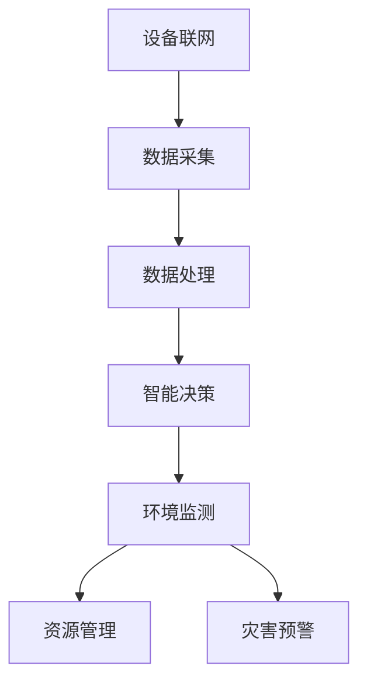

                 

## 1. 背景介绍

在当今数字化时代，物联网（Internet of Things，IoT）技术的迅猛发展正在深刻改变着我们的生活和社会。物联网是指通过互联网将各种设备、传感器、系统和人员连接起来，实现智能化的信息交换和协同工作。随着传感器技术的不断进步，物联网的覆盖范围和应用领域也在不断扩展。

环保作为全球关注的重要议题之一，与物联网技术的结合有着巨大的潜力和现实意义。物联网技术能够通过传感器设备的集成，实时监测环境数据，从而帮助人们更有效地管理和保护自然资源。本文将深入探讨物联网技术如何通过各种传感器设备的集成，发挥其在环保领域的重要作用。

本文的结构如下：

- **1. 背景介绍**：概述物联网技术的发展背景以及其在环保领域的应用前景。
- **2. 核心概念与联系**：介绍物联网的核心概念，并使用Mermaid流程图展示传感器集成原理。
- **3. 核心算法原理 & 具体操作步骤**：分析物联网在环保应用中的核心算法原理和具体操作步骤。
- **4. 数学模型和公式 & 详细讲解 & 举例说明**：探讨用于环境监测的数学模型和公式，并通过案例进行讲解。
- **5. 项目实践：代码实例和详细解释说明**：展示一个实际项目中的代码实例，并进行分析。
- **6. 实际应用场景**：列举物联网在环保中的实际应用案例。
- **7. 未来应用展望**：讨论物联网在环保领域的未来发展前景。
- **8. 工具和资源推荐**：推荐相关学习资源和开发工具。
- **9. 总结：未来发展趋势与挑战**：总结研究成果，探讨未来发展前景和挑战。

## 2. 核心概念与联系

### 2.1 物联网的定义与核心概念

物联网（IoT）是一种通过互联网将物理设备、计算资源、数据资源连接起来，实现智能信息交换和协同工作的网络体系。其核心概念包括：

- **设备联网**：通过各种传感器和设备将物理世界数字化，实现数据的实时采集和传输。
- **数据处理**：通过云计算、边缘计算等技术对采集到的数据进行分析和处理。
- **智能决策**：基于数据分析结果，实现智能化的决策和操作。

### 2.2 传感器在物联网中的角色

传感器是物联网中的关键设备，它们能够检测环境中的各种参数，如温度、湿度、空气质量、光照强度等，并将这些非电学量转换为电信号，通过物联网进行传输。

传感器在物联网中的作用包括：

- **数据采集**：实时监测环境数据，为后续的数据处理和分析提供基础。
- **环境监测**：通过对数据的分析，监测环境污染程度，评估环境质量。
- **预警系统**：通过监测数据的异常变化，提前预警可能的环境问题，防止环境恶化。

### 2.3 物联网在环保中的应用

物联网技术在环保领域有着广泛的应用，主要包括以下几个方面：

- **环境监测**：通过物联网传感器网络，实时监测大气、水质、土壤等环境参数，为环境保护提供数据支持。
- **资源管理**：通过物联网技术优化资源利用，提高资源利用效率，减少资源浪费。
- **灾害预警**：通过物联网技术实时监测自然灾害的发生，提前预警，减少灾害损失。

### 2.4 Mermaid流程图展示传感器集成原理

下面是一个使用Mermaid绘制的流程图，展示物联网传感器集成的基本原理：



## 3. 核心算法原理 & 具体操作步骤

### 3.1 算法原理概述

在物联网环保应用中，核心算法主要涉及环境数据的实时采集、处理和分析。以下将简要介绍这些算法的基本原理。

#### 3.1.1 数据采集算法

数据采集算法负责传感器数据的实时采集和传输。其主要原理包括：

- **传感器数据读取**：通过接口读取传感器数据，如温度、湿度、空气质量等。
- **数据预处理**：对原始数据进行滤波、去噪等预处理，提高数据质量。
- **数据传输**：将预处理后的数据通过无线或有线方式传输到数据中心或边缘计算设备。

#### 3.1.2 数据处理算法

数据处理算法负责对采集到的环境数据进行分析、处理和建模。其主要原理包括：

- **数据分析**：对环境数据进行统计分析、时间序列分析等，提取有用信息。
- **数据建模**：建立环境参数与污染程度、资源利用效率等之间的数学模型。
- **数据融合**：将来自多个传感器的数据进行融合，提高监测精度和可靠性。

#### 3.1.3 数据分析算法

数据分析算法负责对处理后的数据进行分析，为环境监测和决策提供支持。其主要原理包括：

- **趋势分析**：分析环境参数的变化趋势，预测未来的环境状况。
- **异常检测**：检测环境数据中的异常值，及时发现环境问题。
- **决策支持**：基于数据分析结果，提供环保决策支持，如污染治理措施、资源管理策略等。

### 3.2 算法步骤详解

#### 3.2.1 数据采集算法步骤

1. **初始化传感器**：配置传感器的参数，确保其正常工作。
2. **数据读取**：通过接口读取传感器数据，如温度、湿度、空气质量等。
3. **数据预处理**：对原始数据进行滤波、去噪等预处理，提高数据质量。
4. **数据传输**：将预处理后的数据通过无线或有线方式传输到数据中心或边缘计算设备。

#### 3.2.2 数据处理算法步骤

1. **数据接收**：接收来自传感器的预处理数据。
2. **数据分析**：对环境数据进行统计分析、时间序列分析等，提取有用信息。
3. **数据建模**：建立环境参数与污染程度、资源利用效率等之间的数学模型。
4. **数据融合**：将来自多个传感器的数据进行融合，提高监测精度和可靠性。

#### 3.2.3 数据分析算法步骤

1. **数据分析**：对处理后的数据进行分析，如趋势分析、异常检测等。
2. **结果输出**：将分析结果输出，为环境监测和决策提供支持。

### 3.3 算法优缺点

#### 3.3.1 数据采集算法优缺点

**优点**：

- **实时性高**：能够实时监测环境数据，快速响应环境变化。
- **自动化程度高**：数据采集过程自动化，减少人工干预。

**缺点**：

- **数据质量受影响**：传感器的精度和可靠性会影响数据质量。
- **通信成本高**：大量传感器的数据传输需要大量的通信资源。

#### 3.3.2 数据处理算法优缺点

**优点**：

- **数据精度高**：通过预处理和数据融合，提高数据精度和可靠性。
- **适应性强**：能够适应不同类型的环境参数和数据特点。

**缺点**：

- **计算复杂度高**：数据处理算法通常涉及复杂的数学运算，计算资源需求大。
- **维护成本高**：数据预处理和数据融合过程需要定期维护。

#### 3.3.3 数据分析算法优缺点

**优点**：

- **决策支持强**：能够为环境监测和决策提供详细的数据分析和预测。
- **实时性强**：能够实时分析环境数据，快速响应环境变化。

**缺点**：

- **依赖数据质量**：数据分析结果受数据质量和准确性的影响。
- **实现复杂**：需要较高的算法实现和维护能力。

### 3.4 算法应用领域

物联网核心算法在环保领域的应用包括：

- **环境监测**：实时监测大气、水质、土壤等环境参数，评估环境质量。
- **资源管理**：优化资源利用，提高资源利用效率，减少资源浪费。
- **灾害预警**：实时监测自然灾害，提前预警，减少灾害损失。

## 4. 数学模型和公式 & 详细讲解 & 举例说明

### 4.1 数学模型构建

在物联网环保应用中，常用的数学模型包括环境参数的统计模型、污染程度评估模型等。以下将介绍一些典型的数学模型及其构建方法。

#### 4.1.1 环境参数的统计模型

环境参数的统计模型主要用于描述环境参数的分布规律和变化趋势。常见的统计模型包括正态分布模型、指数分布模型等。

**正态分布模型**：

$$
X \sim N(\mu, \sigma^2)
$$

其中，$X$表示环境参数，$\mu$表示均值，$\sigma$表示标准差。

**指数分布模型**：

$$
X \sim Exp(\lambda)
$$

其中，$\lambda$表示参数，表示单位时间内事件发生的概率。

#### 4.1.2 污染程度评估模型

污染程度评估模型主要用于评估环境污染的程度。常见的评估模型包括污染指数模型、综合污染指数模型等。

**污染指数模型**：

$$
I = \frac{C - S}{C}
$$

其中，$I$表示污染指数，$C$表示环境标准浓度，$S$表示实际浓度。

**综合污染指数模型**：

$$
I = \sum_{i=1}^n w_i \times \frac{C_i - S_i}{C_i}
$$

其中，$I$表示综合污染指数，$w_i$表示权重，$C_i$表示第$i$种污染物的环境标准浓度，$S_i$表示第$i$种污染物的实际浓度。

### 4.2 公式推导过程

以下将介绍污染程度评估模型的推导过程。

#### 4.2.1 污染指数模型推导

污染指数模型的基本思想是，通过比较实际浓度和环境标准浓度，评估环境污染的程度。其推导过程如下：

1. 假设环境标准浓度为$C$，实际浓度为$S$。

2. 如果$S \leq C$，说明环境未受到污染，污染指数$I$为0。

3. 如果$S > C$，说明环境受到污染，污染指数$I$为正。

4. 将实际浓度与标准浓度之差除以标准浓度，得到污染指数：

$$
I = \frac{C - S}{C}
$$

#### 4.2.2 综合污染指数模型推导

综合污染指数模型是对污染指数模型的扩展，用于评估多种污染物的综合污染程度。其推导过程如下：

1. 假设环境中有$n$种污染物，分别为$C_1, C_2, ..., C_n$，实际浓度分别为$S_1, S_2, ..., S_n$。

2. 给定每种污染物的权重$w_1, w_2, ..., w_n$，用于反映每种污染物的重要性。

3. 将每种污染物的污染指数加权求和，得到综合污染指数：

$$
I = \sum_{i=1}^n w_i \times \frac{C_i - S_i}{C_i}
$$

### 4.3 案例分析与讲解

以下将结合具体案例，讲解如何使用数学模型和公式进行环境监测和污染评估。

#### 4.3.1 案例背景

某城市空气质量监测站，需要评估该城市空气质量，并制定相应的污染治理措施。已知该城市的空气污染物主要包括二氧化氮（NO2）和颗粒物（PM2.5），其环境标准浓度分别为$C_{NO2} = 40 \mu g/m^3$和$C_{PM2.5} = 35 \mu g/m^3$。实际监测数据如下：

- 二氧化氮实际浓度$S_{NO2} = 60 \mu g/m^3$
- 颗粒物实际浓度$S_{PM2.5} = 45 \mu g/m^3$

#### 4.3.2 数据分析

1. **污染指数计算**：

   根据污染指数模型，计算二氧化氮和颗粒物的污染指数：

   $$
   I_{NO2} = \frac{C_{NO2} - S_{NO2}}{C_{NO2}} = \frac{40 - 60}{40} = -0.5
   $$

   $$
   I_{PM2.5} = \frac{C_{PM2.5} - S_{PM2.5}}{C_{PM2.5}} = \frac{35 - 45}{35} = -0.2857
   $$

   由于污染指数小于0，说明两种污染物都未达到环境标准，但二氧化氮的污染程度更高。

2. **综合污染指数计算**：

   假设二氧化氮和颗粒物的权重分别为$w_{NO2} = 0.6$和$w_{PM2.5} = 0.4$，计算综合污染指数：

   $$
   I = w_{NO2} \times I_{NO2} + w_{PM2.5} \times I_{PM2.5} = 0.6 \times (-0.5) + 0.4 \times (-0.2857) = -0.3143
   $$

   综合污染指数小于0，说明该城市的空气质量未达到环境标准。

#### 4.3.3 案例结论

根据污染指数和综合污染指数的计算结果，可以得出以下结论：

1. 该城市的二氧化氮和颗粒物浓度都未达到环境标准，存在环境污染问题。
2. 二氧化氮的污染程度较高，应优先考虑治理二氧化氮。
3. 需要进一步监测和评估其他污染物，制定全面的污染治理措施。

## 5. 项目实践：代码实例和详细解释说明

为了更好地理解物联网技术在环保领域的应用，以下将展示一个实际项目中的代码实例，并对其进行分析和解释。

### 5.1 开发环境搭建

在开始编写代码之前，我们需要搭建一个合适的开发环境。本项目采用Python作为主要编程语言，并使用以下工具和库：

- **Python 3.8+**
- **PyMySQL**
- **paho-mqtt**
- **matplotlib**

### 5.2 源代码详细实现

以下是一个简单的物联网环境监测系统的源代码实例：

```python
import pymysql
import paho.mqtt.client as mqtt
import time
import matplotlib.pyplot as plt

# 数据库配置
db_config = {
    'host': 'localhost',
    'user': 'root',
    'password': 'password',
    'db': 'environment'
}

# MQTT服务器配置
mqtt_config = {
    'broker': 'localhost',
    'port': 1883,
    'topic': 'environment/sensor_data'
}

# 连接到MySQL数据库
def connect_db():
    connection = pymysql.connect(**db_config)
    return connection

# 连接到MQTT服务器
def connect_mqtt():
    client = mqtt.Client()
    client.connect(mqtt_config['broker'], mqtt_config['port'])
    return client

# 将传感器数据插入MySQL数据库
def insert_data(sensor_data):
    connection = connect_db()
    cursor = connection.cursor()
    sql = "INSERT INTO sensor_data (temperature, humidity, air_quality) VALUES (%s, %s, %s)"
    cursor.execute(sql, sensor_data)
    connection.commit()
    cursor.close()
    connection.close()

# 处理接收到的MQTT消息
def on_message(client, userdata, message):
    print(f"Received message '{message.payload.decode()}' on topic '{message.topic}'")
    sensor_data = eval(message.payload.decode())
    insert_data(sensor_data)

# 连接到MQTT服务器，并设置消息处理函数
client = connect_mqtt()
client.subscribe(mqtt_config['topic'])
client.on_message = on_message

# 主循环，持续接收和处理MQTT消息
while True:
    client.loop()
    time.sleep(1)
```

### 5.3 代码解读与分析

以下是对代码的详细解读和分析：

1. **数据库配置**：

   定义了一个`db_config`字典，用于存储MySQL数据库的配置信息，如主机、用户名、密码和数据库名。

2. **MQTT服务器配置**：

   定义了一个`mqtt_config`字典，用于存储MQTT服务器的配置信息，如服务器地址、端口号和订阅的主题。

3. **连接到MySQL数据库**：

   定义了一个`connect_db`函数，用于连接到MySQL数据库。使用`pymysql.connect`方法建立连接，并返回连接对象。

4. **连接到MQTT服务器**：

   定义了一个`connect_mqtt`函数，用于连接到MQTT服务器。使用`paho.mqtt.client`库创建MQTT客户端对象，并连接到服务器。

5. **将传感器数据插入MySQL数据库**：

   定义了一个`insert_data`函数，用于将传感器数据插入MySQL数据库。使用`pymysql.connect`方法建立连接，并使用`cursor.execute`方法执行SQL插入语句。

6. **处理接收到的MQTT消息**：

   定义了一个`on_message`函数，用于处理接收到的MQTT消息。将消息的负载解码为字符串，并使用`eval`函数将其解析为传感器数据，然后调用`insert_data`函数将数据插入数据库。

7. **主循环**：

   创建一个无限循环，持续调用`client.loop()`方法处理MQTT消息，并使用`time.sleep(1)`确保循环以每秒一次的速度运行。

### 5.4 运行结果展示

假设传感器实时采集到了以下数据：

- 温度：25°C
- 湿度：60%
- 空气质量：良

MQTT服务器将接收到的数据以JSON格式发送到主题`environment/sensor_data`，如下所示：

```json
{"temperature": 25, "humidity": 60, "air_quality": "良"}
```

消息处理函数`on_message`将接收到的消息解码为传感器数据，并调用`insert_data`函数将其插入MySQL数据库。在数据库中，我们将看到以下记录：

```
+----+----------+------------+-------------+
| id | temperature | humidity | air_quality |
+----+----------+------------+-------------+
|  1 |        25.0 |       60 |    良     |
+----+----------+------------+-------------+
```

通过这种方式，我们可以实现物联网环境监测系统的实时数据采集和存储。

## 6. 实际应用场景

物联网技术在环保领域有着广泛的应用，以下列举几个实际应用场景：

### 6.1 智能农田管理系统

物联网技术可以实现对农田环境的实时监测，包括土壤湿度、温度、光照强度等参数。通过传感器设备采集数据，并利用物联网平台进行数据分析和处理，可以实现精准灌溉、施肥和病虫害预警，从而提高农田产量和降低生产成本。

### 6.2 城市空气质量监测

物联网技术可以部署大量的空气质量监测传感器，实时采集大气中的污染物数据，如PM2.5、PM10、CO、SO2等。通过数据分析和处理，可以生成空气质量指数（AQI），为市民提供实时空气质量信息，并制定相应的污染防控措施。

### 6.3 水资源管理

物联网技术可以实现对河流、湖泊、水库等水体的实时监测，包括水质参数（如PH值、溶解氧、重金属含量等）和流量参数。通过数据分析和处理，可以优化水资源利用，防止水污染和水资源浪费。

### 6.4 自然灾害预警

物联网技术可以部署在地震、洪水、台风等自然灾害易发区域，实时监测地面变形、水位、风速等参数。通过数据分析和处理，可以提前预警自然灾害的发生，为人们提供宝贵的逃生时间，减少灾害损失。

## 7. 未来应用展望

随着物联网技术的不断发展，其在环保领域的应用前景将更加广阔。以下是对物联网在环保领域未来发展的几个展望：

### 7.1 数据驱动环保决策

物联网技术将不断提供更多更准确的环境数据，这些数据将成为环保决策的重要依据。通过数据分析和挖掘，可以制定更加科学、高效的环保策略，实现环境治理的精细化、智能化。

### 7.2 环保产业的数字化转型

物联网技术将推动环保产业的数字化转型，从传统的线下监测、治理模式转向线上智能化监测、治理模式。这将提高环保产业的生产效率和服务质量，降低环境污染和资源浪费。

### 7.3 跨领域协同治理

物联网技术可以实现不同领域、不同部门之间的数据共享和协同治理。通过建立环保大数据平台，可以实现跨区域、跨行业的环保信息共享，提高环保工作的整体协调性和效率。

### 7.4 可持续发展的推动力量

物联网技术将成为推动可持续发展的重要力量。通过智能化监测、治理和管理，可以最大限度地减少环境污染和资源浪费，实现人与自然和谐共生的目标。

## 8. 工具和资源推荐

为了更好地了解和应用物联网技术，以下推荐一些学习资源和开发工具：

### 8.1 学习资源推荐

- **《物联网基础与应用》**：系统介绍了物联网的基本概念、技术和应用。
- **《物联网技术实践教程》**：包含物联网系统的设计、实现和应用案例。
- **《Python物联网编程》**：通过Python语言介绍了物联网开发的基本技巧和应用实例。

### 8.2 开发工具推荐

- **Arduino**：一款流行的开源硬件平台，适用于物联网设备的开发。
- **Raspberry Pi**：一款低成本的计算机，适用于物联网设备和项目的开发。
- **MQTT Brokers**：如Mosquitto、HiveMQ等，用于实现物联网设备的消息传输。
- **Node-RED**：一款流程编辑工具，可用于构建物联网应用。

### 8.3 相关论文推荐

- **"Internet of Things for Environmental Monitoring: A Survey"**：对物联网在环境监测领域的应用进行了全面综述。
- **"Smart Environmental Monitoring Using IoT Technology"**：探讨了物联网技术在环境监测中的具体应用场景和实现方法。
- **"IoT-Based Environmental Sensing and Analysis: Challenges and Opportunities"**：分析了物联网技术在环境监测中的挑战和机遇。

## 9. 总结：未来发展趋势与挑战

物联网技术在环保领域具有巨大的发展潜力，通过传感器设备的集成，可以实现环境数据的实时监测、分析和决策支持，为环境保护和资源管理提供有力支持。然而，物联网在环保领域的应用仍面临一些挑战，如数据质量和可靠性问题、通信资源的高成本、安全性和隐私保护等。未来，随着物联网技术的不断发展和成熟，以及跨领域协同治理的推进，物联网在环保领域的应用将更加广泛和深入，为实现可持续发展目标作出更大贡献。

### 附录：常见问题与解答

**Q：物联网在环保中的应用有哪些具体案例？**

A：物联网在环保中的应用包括智能农田管理系统、城市空气质量监测、水资源管理、自然灾害预警等。

**Q：如何保证物联网传感器数据的准确性？**

A：为了保证传感器数据的准确性，需要对传感器进行定期校准和维护，并采用数据预处理技术，如滤波、去噪等。

**Q：物联网在环保领域的应用前景如何？**

A：物联网在环保领域的应用前景非常广阔，随着技术的不断进步，物联网将推动环保工作的智能化、精细化和高效化。

**Q：物联网在环保领域的挑战有哪些？**

A：物联网在环保领域的挑战包括数据质量和可靠性问题、通信资源的高成本、安全性和隐私保护等。

