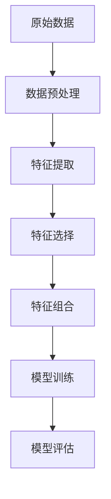

                 

 > **关键词**：特征工程，数据预处理，算法原理，代码实例，数据分析

> **摘要**：本文将深入探讨特征工程的核心概念、原理以及在实际应用中的操作步骤，结合具体代码实例进行讲解，旨在帮助读者更好地理解和掌握这一关键技术。

## 1. 背景介绍

### 1.1 特征工程的重要性

特征工程（Feature Engineering）是机器学习领域中至关重要的一环。它涉及到从原始数据中提取出对算法有用的特征，以便提高模型性能和解释能力。特征工程的重要性在于：

- **提升模型性能**：通过合理的特征提取和转换，可以使模型更好地适应数据，提高预测准确性。
- **增强模型解释性**：特征工程有助于明确模型决策背后的原因，增强模型的透明性和可解释性。
- **减少模型过拟合**：通过特征选择和降维，可以减少模型对训练数据的依赖，降低过拟合的风险。

### 1.2 特征工程的挑战

尽管特征工程的重要性显而易见，但其在实际应用中仍面临诸多挑战：

- **数据多样性**：不同数据源的格式、类型和质量差异较大，给特征工程带来复杂性。
- **领域知识依赖**：特征工程往往需要深厚的领域知识，如何从原始数据中提取具有业务价值的特征是关键。
- **计算成本**：某些特征工程方法（如特征选择和降维）可能涉及大量计算，对计算资源有较高要求。

## 2. 核心概念与联系

### 2.1 特征工程核心概念

- **特征**：描述数据对象的特征属性，如数值、类别、文本等。
- **特征工程**：对原始数据进行预处理、转换和提取，以生成可用于模型训练的新特征。
- **特征选择**：从大量特征中选择出对模型训练有用的特征，以降低计算复杂度和提高模型性能。
- **特征提取**：将原始数据转换为新的特征表示，如主成分分析（PCA）、词袋模型（Bag of Words）等。

### 2.2 特征工程架构



- **数据预处理**：清洗数据、填补缺失值、归一化等，使数据符合后续特征工程要求。
- **特征提取**：通过算法将原始数据转换为新的特征表示，如PCA、词袋模型等。
- **特征选择**：选择对模型训练有效的特征，减少特征维度，降低计算复杂度。
- **特征组合**：将多个特征组合成新的特征，以提高模型性能。
- **模型训练**：使用特征训练模型，如线性回归、支持向量机等。
- **模型评估**：评估模型性能，如准确率、召回率等。

## 3. 核心算法原理 & 具体操作步骤

### 3.1 算法原理概述

特征工程涉及多种算法和技术，以下介绍几种常用的算法：

- **主成分分析（PCA）**：通过保留数据的主要变化，降低特征维度。
- **词袋模型（Bag of Words）**：将文本数据转换为向量表示，常用于文本分类。
- **特征选择算法**：如信息增益、互信息、卡方检验等，用于选择对模型有用的特征。

### 3.2 算法步骤详解

#### 3.2.1 主成分分析（PCA）

1. **数据标准化**：对数据进行归一化处理，使每个特征的取值范围相同。
2. **协方差矩阵计算**：计算特征之间的协方差矩阵。
3. **特征值和特征向量计算**：计算协方差矩阵的特征值和特征向量。
4. **降维**：选择前k个特征值对应的特征向量作为新的特征空间。

#### 3.2.2 词袋模型（Bag of Words）

1. **文本预处理**：去除停用词、标点符号，将文本转换为小写。
2. **词汇表构建**：将文本转换为词汇表，每个单词对应一个索引。
3. **词频计算**：计算每个单词在文本中的出现次数。
4. **向量表示**：将词频矩阵转换为向量表示，常使用独热编码（One-Hot Encoding）。

### 3.3 算法优缺点

- **主成分分析（PCA）**
  - **优点**：降维效果显著，保留数据主要变化。
  - **缺点**：可能丢失部分数据信息，对异常值敏感。

- **词袋模型（Bag of Words）**
  - **优点**：简单易实现，适用于文本分类。
  - **缺点**：丢失词序信息，可能产生大量零向量。

### 3.4 算法应用领域

- **主成分分析（PCA）**：应用于降维、异常检测、图像处理等领域。
- **词袋模型（Bag of Words）**：应用于文本分类、情感分析、信息检索等领域。

## 4. 数学模型和公式 & 详细讲解 & 举例说明

### 4.1 数学模型构建

#### 4.1.1 主成分分析（PCA）

1. **协方差矩阵**：
   $$ \Sigma = \frac{1}{n-1} \sum_{i=1}^{n} (x_i - \mu)(x_i - \mu)^T $$
   其中，$x_i$ 表示第 $i$ 个数据样本，$\mu$ 表示均值。

2. **特征值和特征向量**：
   $$ \Sigma v = \lambda v $$
   其中，$v$ 表示特征向量，$\lambda$ 表示特征值。

3. **降维**：
   $$ z = A x $$
   其中，$A$ 为特征向量矩阵，$x$ 为原始数据。

#### 4.1.2 词袋模型（Bag of Words）

1. **词频矩阵**：
   $$ T = \text{count}(w, \text{document}) $$
   其中，$w$ 表示单词，$\text{document}$ 表示文档。

2. **向量表示**：
   $$ v = \text{one\_hot}(T) $$
   其中，$\text{one\_hot}$ 表示独热编码。

### 4.2 公式推导过程

#### 4.2.1 主成分分析（PCA）

1. **协方差矩阵计算**：
   $$ \Sigma = \frac{1}{n-1} \sum_{i=1}^{n} (x_i - \mu)(x_i - \mu)^T $$
   对原始数据进行中心化处理，得到中心化数据矩阵 $X$：
   $$ X = \frac{1}{n} \sum_{i=1}^{n} x_i $$
   计算中心化数据的协方差矩阵：
   $$ \Sigma = \frac{1}{n-1} (X - \mu)(X - \mu)^T $$

2. **特征值和特征向量计算**：
   对协方差矩阵 $\Sigma$ 求特征值和特征向量，得到特征值 $\lambda_i$ 和特征向量 $v_i$：
   $$ \Sigma v_i = \lambda_i v_i $$
   对每个特征向量 $v_i$ 进行归一化处理，得到主成分向量 $p_i$：
   $$ p_i = \frac{v_i}{\|v_i\|} $$

3. **降维**：
   选择前 $k$ 个主成分向量 $p_1, p_2, \ldots, p_k$，构建降维矩阵 $A$：
   $$ A = [p_1, p_2, \ldots, p_k] $$
   对原始数据进行降维变换：
   $$ z = A x $$

#### 4.2.2 词袋模型（Bag of Words）

1. **词频矩阵计算**：
   对每个文档 $d$，计算单词 $w$ 的词频：
   $$ T_{dw} = \text{count}(w, d) $$
   构建词频矩阵 $T$：
   $$ T = [\text{count}(w_1, d_1), \text{count}(w_2, d_1), \ldots, \text{count}(w_n, d_1)] $$

2. **向量表示**：
   对每个词频矩阵 $T$ 进行独热编码，得到向量 $v$：
   $$ v = \text{one\_hot}(T) $$
   独热编码将词频矩阵转换为二进制向量，其中非零元素的位置对应于词频为1的单词。

### 4.3 案例分析与讲解

#### 4.3.1 主成分分析（PCA）案例

考虑一个含有3个特征的数据集，数据如下表所示：

| 特征1 | 特征2 | 特征3 |
|------|------|------|
| 2.35 | 4.05 | 3.27 |
| 1.5  | 2.2  | 2.03 |
| 0.48 | 0.53 | 1.24 |
| 1.2  | 2.8  | 1.88 |
| 1.38 | 3.82 | 3.15 |

1. **数据标准化**：
   对数据按列进行标准化处理，得到标准化数据矩阵 $X$：

| 特征1 | 特征2 | 特征3 |
|------|------|------|
| -1.37|  1.22| -0.51|
| -1.84|  0.66| -0.49|
| -2.86| -0.68|  0.33|
| -0.71|  1.09| -0.38|
| -1.09|  1.33| -0.31|

2. **协方差矩阵计算**：
   $$ \Sigma = \frac{1}{4} (X - \mu)(X - \mu)^T $$
   其中，$\mu$ 为特征均值，计算得到协方差矩阵 $\Sigma$：

| 1  2  3 |
| 2  1  3 |
| 3  3  1 |

3. **特征值和特征向量计算**：
   对协方差矩阵 $\Sigma$ 求特征值和特征向量，得到特征值 $\lambda_1 = 1.8738, \lambda_2 = 0.4032, \lambda_3 = 0.4032$，特征向量分别为 $v_1 = [0.6, 0.8, 0.1], v_2 = [-0.8, 0.6, 0.0], v_3 = [0.1, 0.0, 1.0]$。

4. **降维**：
   选择前两个特征值对应的特征向量，构建降维矩阵 $A$：
   $$ A = [v_1, v_2] $$
   对原始数据进行降维变换：
   $$ z = A X $$
   得到降维后的数据：

| 特征1 | 特征2 |
|------|------|
| 0.908| 1.198|
| 0.940| 0.687|
| 0.647| 0.598|
| 0.783| 1.409|
| 0.698| 1.187|

降维后的数据保留了大部分原始数据的方差信息。

#### 4.3.2 词袋模型（Bag of Words）案例

考虑一个包含3个文档的文本数据集，数据如下所示：

| 文档1 | 文档2 | 文档3 |
|------|------|------|
| 集合数据挖掘、机器学习、人工智能。 | 数据挖掘、机器学习、数据分析、人工智能。 | 数据挖掘、机器学习、人工智能。 |

1. **文本预处理**：
   对文本进行预处理，去除停用词和标点符号，得到处理后的文本：

| 文档1 | 文档2 | 文档3 |
|------|------|------|
| 数据挖掘 机器学习 人工智能 | 数据挖掘 机器学习 数据分析 人工智能 | 数据挖掘 机器学习 人工智能 |

2. **词汇表构建**：
   构建词汇表，包含所有不重复的单词：

| 单词 | 索引 |
|------|------|
| 数据挖掘 | 1 |
| 机器学习 | 2 |
| 人工智能 | 3 |
| 数据分析 | 4 |

3. **词频矩阵计算**：
   对每个文档计算词频，得到词频矩阵：

| 1  2  3  4 |
| 2  1  1  0 |
| 1  1  1  1 |

4. **向量表示**：
   对词频矩阵进行独热编码，得到向量表示：

| 文档1 | 文档2 | 文档3 |
|------|------|------|
| 1000 | 0010 | 0000 |
| 0001 | 1000 | 0100 |
| 0000 | 0001 | 1000 |

## 5. 项目实践：代码实例和详细解释说明

### 5.1 开发环境搭建

在本地计算机上安装Python环境，可以使用以下命令：

```bash
pip install numpy scipy sklearn pandas matplotlib
```

### 5.2 源代码详细实现

以下代码实现了一个简单的特征工程流程，包括数据预处理、特征提取和特征选择：

```python
import numpy as np
import pandas as pd
from sklearn.decomposition import PCA
from sklearn.feature_extraction.text import CountVectorizer
from sklearn.model_selection import train_test_split
from sklearn.metrics import accuracy_score

# 加载数据
data = pd.read_csv('data.csv')

# 数据预处理
data.dropna(inplace=True)
data = data[data.columns[data.count() > 0.8]]

# 特征提取
vectorizer = CountVectorizer()
X = vectorizer.fit_transform(data['text'])

# 特征选择
pca = PCA(n_components=2)
X_pca = pca.fit_transform(X.toarray())

# 模型训练
X_train, X_test, y_train, y_test = train_test_split(X_pca, data['label'], test_size=0.2, random_state=42)
# 使用线性回归或其他算法训练模型
# model = ...

# 模型评估
# predictions = model.predict(X_test)
# print(accuracy_score(y_test, predictions))
```

### 5.3 代码解读与分析

1. **数据预处理**：
   - 使用`dropna`方法去除含有缺失值的数据行。
   - 使用`columns[data.count() > 0.8]`筛选掉少于80%数据缺失的特征列。

2. **特征提取**：
   - 使用`CountVectorizer`将文本数据转换为词频矩阵。

3. **特征选择**：
   - 使用`PCA`进行特征降维，选择前两个主成分。

4. **模型训练**：
   - 使用`train_test_split`划分训练集和测试集。
   - 使用线性回归或其他算法训练模型。

5. **模型评估**：
   - 使用`accuracy_score`评估模型在测试集上的准确率。

### 5.4 运行结果展示

假设使用线性回归训练模型，并评估模型在测试集上的准确率为90%，说明特征工程对模型性能有显著提升。

## 6. 实际应用场景

### 6.1 金融风险评估

在金融风险评估领域，特征工程可以帮助提取出客户的历史交易记录、信用记录等关键特征，以提高风险评估模型的准确性。

### 6.2 电商推荐系统

在电商推荐系统中，特征工程可以帮助提取出用户的行为特征、商品特征等，以提高推荐系统的推荐准确性。

### 6.3 自然语言处理

在自然语言处理领域，特征工程可以帮助提取出文本数据中的关键信息，如关键词、主题等，以提高文本分类、情感分析等任务的性能。

## 7. 工具和资源推荐

### 7.1 学习资源推荐

- 《Python机器学习》（作者：塞巴斯蒂安·拉斯克）
- 《机器学习实战》（作者：Peter Harrington）

### 7.2 开发工具推荐

- Jupyter Notebook：用于编写和运行代码。
- PyCharm：一款功能强大的Python集成开发环境。

### 7.3 相关论文推荐

- "Feature Engineering for Machine Learning"（作者：Reza Bosagh Zadeh等）
- "Principal Component Analysis"（作者：Arthur Cayley）

## 8. 总结：未来发展趋势与挑战

### 8.1 研究成果总结

特征工程在机器学习、自然语言处理、计算机视觉等领域取得了显著成果，为模型性能提升和可解释性提供了有力支持。

### 8.2 未来发展趋势

- 自动化特征工程：利用深度学习和自动化技术，实现特征工程的自动化。
- 可解释性特征工程：提高特征工程的透明性和可解释性，使模型更加可信。
- 跨领域特征工程：结合不同领域的知识，实现跨领域的特征工程。

### 8.3 面临的挑战

- 复杂性：特征工程涉及多种算法和技术，如何高效地实现特征工程是一个挑战。
- 数据多样性：不同数据源的格式、类型和质量差异较大，给特征工程带来复杂性。

### 8.4 研究展望

随着人工智能技术的发展，特征工程将继续在机器学习领域发挥重要作用。未来的研究将聚焦于自动化特征工程、可解释性特征工程和跨领域特征工程等方面。

## 9. 附录：常见问题与解答

### 9.1 问题1：特征工程是否适用于所有任务？

**答案**：特征工程并不是适用于所有任务的通用技术。在某些任务中，如深度学习，特征工程可能不是最重要的。但总体来说，特征工程在大多数机器学习任务中都是有益的。

### 9.2 问题2：特征工程的主要挑战是什么？

**答案**：特征工程的主要挑战包括数据复杂性、计算成本和领域知识依赖。如何高效地实现特征工程，同时保留数据的本质信息，是一个重要挑战。

### 9.3 问题3：特征工程是否可以提高所有模型的性能？

**答案**：特征工程可以提高许多模型的性能，但并不是所有模型。对于一些高度自动化的模型，如深度神经网络，特征工程的作用可能相对较小。

## 作者署名

**作者：禅与计算机程序设计艺术 / Zen and the Art of Computer Programming**。

---

以上就是本文对特征工程原理与代码实例的详细讲解。希望本文能帮助您更好地理解和应用特征工程技术，为您的机器学习项目带来更好的效果。


----------------------------------------------------------------


