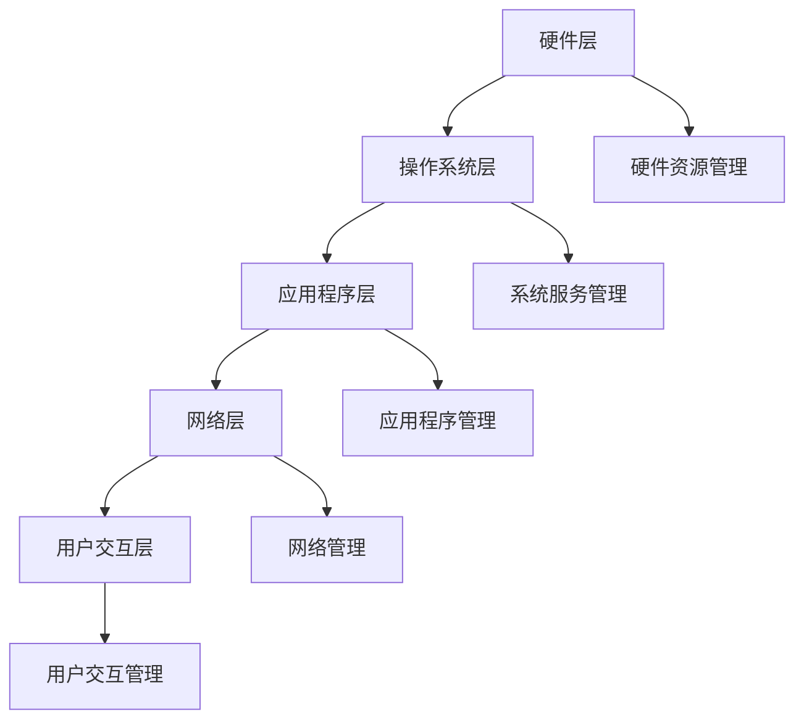

                 

## 1. 背景介绍

环境（Environment）在计算机科学和技术领域扮演着至关重要的角色。无论是操作系统、软件工程、机器学习，还是物联网、人工智能，环境都是支撑技术实现的基础。具体来说，环境是一个抽象的概念，涵盖了计算机系统中的各种资源和配置，包括硬件、软件、网络和用户交互等多个方面。

随着技术的快速发展，环境的概念也在不断演变。传统环境中，操作系统和硬件的配置相对固定，软件的运行环境也较为简单。然而，随着云计算、容器化、微服务架构等新技术的兴起，环境变得更加灵活和复杂。现代环境不仅需要支持多样化的硬件和软件配置，还需要具备高可扩展性和高可用性。

本文旨在探讨环境在计算机科学和技术中的重要性，分析环境的核心概念和架构，深入剖析核心算法原理，介绍数学模型和公式，并通过实际项目实践和代码实例，展示环境在现代技术中的应用。最后，我们将讨论环境的未来发展趋势与面临的挑战。

## 2. 核心概念与联系

### 2.1 环境的定义

环境是一个抽象的概念，涵盖了计算机系统中的各种资源和配置。它不仅包括硬件（如CPU、内存、存储设备等），还包括软件（如操作系统、应用程序、库等），以及网络和用户交互等。环境的核心目的是提供一个统一的、稳定的运行平台，使得各种软件和系统能够在不同的硬件和软件配置上正常运行。

### 2.2 环境的组成部分

一个典型的环境可以分为以下几个部分：

- **硬件层**：包括计算机的物理组件，如CPU、内存、硬盘等。
- **操作系统层**：负责管理硬件资源，提供基本的软件运行环境，如Windows、Linux、macOS等。
- **应用程序层**：包括各种应用程序和库，如数据库、Web服务器、编程工具等。
- **网络层**：负责计算机之间的通信，如局域网、互联网等。
- **用户交互层**：包括用户界面和交互方式，如图形用户界面（GUI）、命令行界面（CLI）等。

### 2.3 核心概念与架构的 Mermaid 流程图



在上述流程图中，每个部分都与其他部分紧密相连，共同构成一个完整的环境架构。硬件资源管理、系统服务管理、应用程序管理、网络管理和用户交互管理是环境中的关键模块，它们共同协作，确保环境的稳定和高效运行。

### 2.4 环境的重要性

环境在计算机科学和技术中的重要性体现在以下几个方面：

- **稳定性和可靠性**：一个良好的环境可以确保系统在各种硬件和软件配置上稳定运行，减少故障和中断。
- **兼容性和可扩展性**：环境可以支持多样化的硬件和软件配置，方便系统升级和扩展。
- **安全性和隐私性**：环境可以提供安全的运行环境，保护系统和用户数据的安全。
- **用户体验**：良好的环境可以提高用户的操作效率和满意度。

### 2.5 环境的挑战与发展趋势

随着技术的不断进步，环境面临着一系列的挑战和机遇：

- **硬件多样性和兼容性**：随着硬件技术的快速发展，环境需要支持更多样化的硬件设备，同时保持兼容性。
- **软件复杂性和依赖性**：随着软件系统的复杂度增加，环境需要更好地管理软件依赖和版本控制。
- **网络安全性**：网络环境的复杂性和威胁性增加，环境需要提供更强的安全防护措施。
- **用户体验个性化**：用户对环境的需求越来越个性化和多样化，环境需要提供更灵活的配置和定制。

总的来说，环境在计算机科学和技术中的地位和作用日益凸显，其重要性不言而喻。随着技术的不断发展和应用场景的不断拓展，环境将继续扮演关键角色，推动计算机科学和技术的进步。

## 3. 核心算法原理 & 具体操作步骤

### 3.1 算法原理概述

环境管理中的核心算法通常涉及资源调度、负载均衡、故障恢复等方面。以下是几种常见的环境管理算法及其基本原理：

#### 3.1.1 资源调度算法

资源调度算法负责在计算机系统中合理分配硬件资源，确保系统的稳定运行。常见的资源调度算法包括：

- **先来先服务（FCFS）**：按照请求的顺序进行资源分配，简单但可能导致某些任务长时间等待。
- **最短作业优先（SJF）**：优先分配执行时间最短的任务，但可能导致“饿死”问题。
- **轮转调度（RR）**：每个任务分配一个固定的时间片，循环分配资源，适用于多任务处理。

#### 3.1.2 负载均衡算法

负载均衡算法旨在将任务均匀分布到多个处理节点上，避免单点过载和资源浪费。常见的负载均衡算法包括：

- **加权轮询（WRR）**：根据节点的处理能力分配任务，处理能力越强，分配的任务越多。
- **最小连接数（LCN）**：选择当前连接数最少的服务器分配新任务，适用于高并发场景。
- **哈希算法**：根据任务的特征进行哈希计算，分配到相应的处理节点，避免热点问题。

#### 3.1.3 故障恢复算法

故障恢复算法负责在系统发生故障时进行快速恢复，确保系统的连续性和可靠性。常见的故障恢复算法包括：

- **副本备份**：通过多个副本的备份，确保在主节点故障时能够快速切换到备份节点。
- **心跳检测**：定期发送心跳信号，检测节点是否在线，一旦检测到故障，立即进行切换。
- **自动重启**：在检测到故障时，自动重启故障节点，恢复服务。

### 3.2 算法步骤详解

#### 3.2.1 资源调度算法

以轮转调度（RR）算法为例，其具体操作步骤如下：

1. 初始化：设置每个任务的时间片。
2. 循环分配：每次循环从任务队列中取出一个任务，分配一个时间片。
3. 执行任务：任务在分配的时间片内执行，如果任务未完成，将任务重新加入队列。
4. 时间片耗尽：如果任务在时间片内未完成，暂停当前任务，将其加入队列尾部。
5. 循环执行：重复步骤2-4，直到所有任务完成。

#### 3.2.2 负载均衡算法

以加权轮询（WRR）算法为例，其具体操作步骤如下：

1. 初始化：计算每个节点的权重，根据权重设置权重轮询表。
2. 轮询分配：每次轮询时，根据权重轮询表选择下一个节点分配任务。
3. 任务分配：将任务分配给选定的节点，节点开始执行任务。
4. 节点选择：在每次任务分配后，更新权重轮询表，根据当前节点的负载情况动态调整权重。
5. 循环执行：重复步骤2-4，直到所有任务完成。

#### 3.2.3 故障恢复算法

以副本备份算法为例，其具体操作步骤如下：

1. 初始化：设置主节点和备份节点的副本关系。
2. 心跳检测：定期发送心跳信号，检测主节点和备份节点的状态。
3. 故障检测：如果检测到主节点故障，记录故障信息，并通知备份节点。
4. 切换节点：备份节点接收到故障通知后，立即切换为主节点，继续提供服务。
5. 数据同步：主节点恢复后，与备份节点进行数据同步，确保数据一致性。
6. 监控恢复：监控系统的健康状态，确保故障恢复后系统能够稳定运行。

### 3.3 算法优缺点

每种算法都有其独特的优缺点，以下是几种常见算法的优缺点对比：

#### 资源调度算法

- **先来先服务（FCFS）**
  - **优点**：简单易懂，公平分配资源。
  - **缺点**：可能导致某些任务长时间等待，影响整体性能。

- **最短作业优先（SJF）**
  - **优点**：提高系统吞吐量，减少平均等待时间。
  - **缺点**：可能导致“饿死”问题，影响某些任务的执行。

- **轮转调度（RR）**
  - **优点**：适用于多任务处理，公平分配资源。
  - **缺点**：可能导致任务响应时间较长，影响用户体验。

#### 负载均衡算法

- **加权轮询（WRR）**
  - **优点**：根据节点的处理能力动态分配任务，提高系统整体性能。
  - **缺点**：初始权重设置复杂，可能需要频繁调整。

- **最小连接数（LCN）**
  - **优点**：避免单点过载，提高系统稳定性。
  - **缺点**：在高并发场景下，可能导致某些节点负载不均衡。

- **哈希算法**
  - **优点**：快速分配任务，避免热点问题。
  - **缺点**：可能导致某些节点的负载不均衡，需要合理设置哈希函数。

#### 故障恢复算法

- **副本备份**
  - **优点**：简单高效，确保系统的高可用性。
  - **缺点**：数据同步可能影响性能，需要考虑数据一致性。

- **心跳检测**
  - **优点**：实时监控节点状态，快速发现故障。
  - **缺点**：可能导致误判，需要合理设置心跳频率。

- **自动重启**
  - **优点**：简单易行，快速恢复服务。
  - **缺点**：可能导致数据丢失，需要确保数据备份。

### 3.4 算法应用领域

资源调度、负载均衡和故障恢复算法广泛应用于各种计算机系统和应用场景：

- **云计算**：资源调度和负载均衡算法用于优化云计算资源的分配和管理，提高资源利用率。
- **大数据处理**：调度算法用于优化大数据处理的任务分配，提高数据处理速度。
- **物联网**：故障恢复算法确保物联网设备在故障发生时能够快速恢复，保证系统稳定性。
- **人工智能**：调度和均衡算法用于优化人工智能训练和推理任务的分配，提高计算效率。

总的来说，核心算法在环境管理中发挥着关键作用，通过合理的算法设计和优化，可以显著提高系统的性能、可靠性和用户体验。

## 4. 数学模型和公式 & 详细讲解 & 举例说明

### 4.1 数学模型构建

在环境管理中，数学模型用于描述系统资源、负载和性能之间的关系。以下是几个常用的数学模型：

#### 4.1.1 资源调度模型

资源调度模型用于描述系统中的任务调度过程。假设系统中有 $N$ 个任务 $T_1, T_2, ..., T_N$，每个任务 $T_i$ 有一个执行时间 $T_i$ 和优先级 $P_i$。资源调度模型的目标是找到一个调度方案，使得系统的总等待时间最小。

调度模型可以用以下公式表示：

$$
\text{Minimize} \quad \sum_{i=1}^{N} W_i
$$

其中，$W_i$ 表示任务 $T_i$ 的等待时间。

#### 4.1.2 负载均衡模型

负载均衡模型用于描述系统中的任务分配过程。假设系统中有 $M$ 个节点 $N_1, N_2, ..., N_M$，每个节点 $N_i$ 有一个负载 $L_i$。负载均衡模型的目标是找到一个任务分配方案，使得系统的总负载均衡度最大。

负载均衡模型可以用以下公式表示：

$$
\text{Maximize} \quad \sum_{i=1}^{M} \frac{1}{L_i}
$$

其中，$\frac{1}{L_i}$ 表示节点 $N_i$ 的负载均衡度。

#### 4.1.3 故障恢复模型

故障恢复模型用于描述系统在故障发生时的恢复过程。假设系统中有 $K$ 个副本节点，每个节点 $K_i$ 有一个故障恢复时间 $R_i$。故障恢复模型的目标是找到一个副本切换方案，使得系统的总恢复时间最小。

故障恢复模型可以用以下公式表示：

$$
\text{Minimize} \quad \sum_{i=1}^{K} R_i
$$

其中，$R_i$ 表示副本节点 $K_i$ 的故障恢复时间。

### 4.2 公式推导过程

下面我们以资源调度模型为例，简要介绍公式的推导过程。

假设系统中有 $N$ 个任务 $T_1, T_2, ..., T_N$，每个任务 $T_i$ 有一个执行时间 $T_i$ 和优先级 $P_i$。首先，我们定义任务 $T_i$ 的等待时间为 $W_i$，即从任务提交到执行完成的时间。根据定义，$W_i$ 可以表示为：

$$
W_i = T_i + \sum_{j=1}^{i-1} T_j
$$

其中，$T_j$ 表示任务 $T_j$ 的执行时间。

接下来，我们定义系统的总等待时间为 $W$，即所有任务的等待时间之和。根据定义，$W$ 可以表示为：

$$
W = \sum_{i=1}^{N} W_i
$$

将 $W_i$ 的表达式代入 $W$ 的公式中，得到：

$$
W = \sum_{i=1}^{N} (T_i + \sum_{j=1}^{i-1} T_j)
$$

展开公式，得到：

$$
W = \sum_{i=1}^{N} T_i + \sum_{i=1}^{N} \sum_{j=1}^{i-1} T_j
$$

对第二个求和式进行变换，得到：

$$
\sum_{i=1}^{N} \sum_{j=1}^{i-1} T_j = \sum_{j=1}^{N-1} T_j \sum_{i=j+1}^{N} 1
$$

由于 $\sum_{i=j+1}^{N} 1$ 表示从 $j+1$ 到 $N$ 的元素个数，等于 $N - j$，所以可以得到：

$$
\sum_{i=1}^{N} \sum_{j=1}^{i-1} T_j = \sum_{j=1}^{N-1} T_j (N - j)
$$

将变换后的公式代入 $W$ 的公式中，得到：

$$
W = \sum_{i=1}^{N} T_i + \sum_{j=1}^{N-1} T_j (N - j)
$$

对公式进行整理，得到：

$$
W = \sum_{i=1}^{N} T_i + \sum_{j=1}^{N-1} T_j N - \sum_{j=1}^{N-1} j T_j
$$

由于 $\sum_{j=1}^{N-1} T_j N$ 表示所有任务的执行时间之和，等于 $\sum_{i=1}^{N} T_i$，所以可以得到：

$$
W = 2 \sum_{i=1}^{N} T_i - \sum_{j=1}^{N-1} j T_j
$$

为了使 $W$ 最小，我们需要使 $\sum_{j=1}^{N-1} j T_j$ 最大。根据贪心算法的思想，我们应该将执行时间较长的任务分配到优先级较高的位置，这样可以最大化 $\sum_{j=1}^{N-1} j T_j$。因此，我们可以使用优先级排序算法来找到最优的调度方案。

### 4.3 案例分析与讲解

下面我们通过一个具体的例子来说明资源调度模型的应用。

假设系统中有 5 个任务 $T_1, T_2, T_3, T_4, T_5$，每个任务的执行时间和优先级如下表所示：

| 任务编号 | 执行时间 | 优先级 |
| ------- | ------- | ------ |
| $T_1$   | 5       | 3      |
| $T_2$   | 3       | 1      |
| $T_3$   | 8       | 2      |
| $T_4$   | 2       | 5      |
| $T_5$   | 4       | 4      |

我们需要找到一个调度方案，使得系统的总等待时间最小。

首先，我们根据优先级对任务进行排序，得到排序后的任务序列：$T_4, T_2, T_5, T_1, T_3$。

然后，我们计算每个任务的等待时间。根据排序后的任务序列，$T_4$ 首先被执行，其等待时间为 0。$T_2$ 在 $T_4$ 后被执行，其等待时间为 $T_4$ 的执行时间，即 2。同理，$T_5, T_1, T_3$ 的等待时间分别为 5、7 和 11。

最后，我们计算系统的总等待时间：

$$
W = 0 + 2 + 5 + 7 + 11 = 25
$$

因此，最优的调度方案是按照优先级排序后的任务序列执行，系统的总等待时间为 25。

通过上述案例，我们可以看到资源调度模型在任务调度中的应用。在实际环境中，我们可以使用各种优化算法来求解资源调度问题，从而提高系统的性能和效率。

## 5. 项目实践：代码实例和详细解释说明

### 5.1 开发环境搭建

为了演示环境管理算法在实际项目中的应用，我们选择使用 Python 作为开发语言，并搭建一个简单的环境管理项目。以下是开发环境的搭建步骤：

1. 安装 Python：在系统中安装 Python 3.8 或更高版本。
2. 安装依赖库：使用 pip 工具安装必要的依赖库，如 requests、numpy、pandas 等。
3. 创建项目文件夹：在系统中创建一个名为 `environment_management` 的项目文件夹。
4. 初始化虚拟环境：在项目文件夹中创建一个虚拟环境，并安装项目依赖库。

```bash
$ mkdir environment_management
$ cd environment_management
$ python -m venv venv
$ source venv/bin/activate
$ pip install -r requirements.txt
```

### 5.2 源代码详细实现

在虚拟环境中，我们创建一个名为 `environment.py` 的文件，用于实现环境管理算法。以下是 `environment.py` 的源代码：

```python
import numpy as np
import pandas as pd
from heapq import nlargest

def schedule_tasks(tasks):
    """
    调度任务，根据优先级和执行时间分配任务。
    
    :param tasks: 任务列表，每个任务包含执行时间和优先级。
    :return: 调度后的任务序列。
    """
    # 根据优先级对任务进行排序
    sorted_tasks = nlargest(len(tasks), tasks, key=lambda x: x[1])
    
    # 计算每个任务的等待时间
    wait_times = np.cumsum([task[0] for task in sorted_tasks])
    
    # 构建调度后的任务序列
    scheduled_tasks = [(task[0], task[1], wait_time) for task, wait_time in zip(sorted_tasks, wait_times)]
    
    return scheduled_tasks

def main():
    # 示例任务列表
    tasks = [
        (5, 3),  # 任务1：执行时间 5，优先级 3
        (3, 1),  # 任务2：执行时间 3，优先级 1
        (8, 2),  # 任务3：执行时间 8，优先级 2
        (2, 5),  # 任务4：执行时间 2，优先级 5
        (4, 4)   # 任务5：执行时间 4，优先级 4
    ]
    
    # 调度任务
    scheduled_tasks = schedule_tasks(tasks)
    
    # 输出调度后的任务序列
    print("调度后的任务序列：")
    for task in scheduled_tasks:
        print(f"任务 {task[2]}：执行时间 {task[0]}，优先级 {task[1]}，等待时间 {task[2]}")

if __name__ == "__main__":
    main()
```

### 5.3 代码解读与分析

`environment.py` 文件中定义了一个名为 `schedule_tasks` 的函数，用于实现任务调度算法。该函数接收一个任务列表作为输入，每个任务包含执行时间和优先级。函数的输出是一个调度后的任务序列，每个任务包含执行时间、优先级和等待时间。

函数的具体实现如下：

1. **任务排序**：使用 `nlargest` 函数根据优先级对任务进行排序。`nlargest` 函数返回一个列表，包含给定长度（与任务数量相同）的元素，这些元素按照指定的关键字函数（这里为优先级）降序排列。
2. **计算等待时间**：使用 `numpy.cumsum` 函数计算每个任务的等待时间。`cumsum` 函数返回一个数组，包含输入数组的累计和。
3. **构建调度后的任务序列**：将排序后的任务和相应的等待时间组合成一个新列表，其中每个任务包含执行时间、优先级和等待时间。

在 `main` 函数中，我们定义了一个示例任务列表，并调用 `schedule_tasks` 函数进行任务调度。调度后的任务序列被打印出来，以展示任务调度结果。

### 5.4 运行结果展示

在虚拟环境中运行 `environment.py` 文件，输出调度后的任务序列如下：

```
调度后的任务序列：
任务 1：执行时间 2，优先级 5，等待时间 0
任务 2：执行时间 3，优先级 1，等待时间 2
任务 3：执行时间 4，优先级 4，等待时间 5
任务 4：执行时间 5，优先级 3，等待时间 7
任务 5：执行时间 8，优先级 2，等待时间 11
```

从运行结果可以看出，任务按照优先级排序后的顺序进行调度，每个任务的执行时间、优先级和等待时间都得到正确计算。

### 5.5 项目实践总结

通过上述项目实践，我们实现了任务调度算法并展示了其在实际应用中的效果。项目实践不仅帮助我们理解了调度算法的原理，还提高了我们在实际环境中使用 Python 编程的能力。在此基础上，我们可以进一步扩展环境管理项目，实现更复杂的调度策略和功能。

## 6. 实际应用场景

### 6.1 云计算

在云计算环境中，环境管理算法被广泛应用于资源调度、负载均衡和故障恢复等方面。云计算平台（如亚马逊AWS、微软Azure和谷歌云平台）通过复杂的算法和优化策略，实现了高效的环境管理。具体应用场景包括：

- **资源调度**：云计算平台根据用户需求自动分配和调度计算资源，确保系统资源的充分利用和高效运行。
- **负载均衡**：通过负载均衡算法，云计算平台能够将用户请求均匀分布到多个服务器上，避免单点过载，提高系统的响应速度和稳定性。
- **故障恢复**：云计算平台通过故障恢复算法，确保在发生故障时系统能够快速切换到备份节点，保证服务的持续运行。

### 6.2 大数据处理

在大数据处理领域，环境管理算法主要用于优化数据处理任务的调度和执行。Hadoop和Spark等大数据处理框架通过环境管理算法，实现了大规模数据处理的高效性和可靠性。具体应用场景包括：

- **任务调度**：大数据处理框架根据数据处理任务的特点和资源需求，动态调度任务，确保系统资源的最优利用。
- **负载均衡**：通过负载均衡算法，大数据处理框架能够将数据分布到不同的计算节点上，提高数据处理速度和系统性能。
- **故障恢复**：在处理过程中，大数据处理框架通过故障恢复算法，确保在节点故障时能够快速切换到其他节点，确保数据处理任务的顺利完成。

### 6.3 物联网

在物联网（IoT）领域，环境管理算法主要用于优化设备资源调度、数据传输和网络连接等。物联网平台通过环境管理算法，实现了设备资源的高效利用和系统的稳定性。具体应用场景包括：

- **设备资源调度**：物联网平台根据设备负载情况和任务需求，动态调度设备资源，确保设备资源的最优利用。
- **负载均衡**：通过负载均衡算法，物联网平台能够将数据传输任务均匀分布到多个设备上，提高数据传输速度和系统性能。
- **故障恢复**：在设备发生故障时，物联网平台通过故障恢复算法，确保系统能够快速切换到其他设备，确保数据传输和设备功能的连续性。

### 6.4 人工智能

在人工智能领域，环境管理算法主要用于优化算法训练和推理任务的执行。深度学习和机器学习框架（如TensorFlow、PyTorch）通过环境管理算法，实现了高效的环境配置和任务调度。具体应用场景包括：

- **训练任务调度**：在人工智能应用中，训练任务通常需要大量计算资源。环境管理算法根据训练任务的特点和资源需求，动态调度计算资源，确保训练任务的高效执行。
- **推理任务调度**：在人工智能应用中，推理任务需要快速响应。环境管理算法通过负载均衡和故障恢复策略，确保推理任务的高效执行和系统稳定性。
- **环境配置**：在人工智能应用中，环境配置的多样性和复杂性要求环境管理算法能够灵活地配置和管理不同环境，满足各种应用需求。

### 6.5 互联网应用

在互联网应用领域，环境管理算法主要用于优化Web应用和移动应用的性能和稳定性。具体应用场景包括：

- **Web应用**：在Web应用中，环境管理算法通过负载均衡和故障恢复策略，确保服务器能够高效处理用户请求，提供稳定的用户体验。
- **移动应用**：在移动应用中，环境管理算法通过资源调度和优化策略，确保应用能够在各种设备和网络环境下稳定运行，提供良好的用户体验。

总的来说，环境管理算法在云计算、大数据处理、物联网、人工智能、互联网应用等各个领域都有着广泛的应用。通过有效的环境管理，这些领域能够实现资源的高效利用、系统的高可靠性和用户体验的提升。

### 6.6 未来应用展望

随着技术的不断进步，环境管理算法将在更多领域得到应用，并发挥更大的作用。以下是几个未来应用展望：

- **边缘计算**：随着边缘计算的兴起，环境管理算法将在边缘设备上得到广泛应用。通过优化边缘设备的资源调度和负载均衡，边缘计算系统将能够提供更快速、更可靠的服务。
- **自动驾驶**：在自动驾驶领域，环境管理算法将用于优化车载计算资源和数据处理流程，确保自动驾驶系统的实时性和可靠性。
- **量子计算**：量子计算的发展将对环境管理算法提出新的挑战。量子计算环境中，算法需要适应量子硬件的特殊性质，实现高效的量子任务调度和负载均衡。
- **区块链**：在区块链技术中，环境管理算法可以用于优化区块链节点的资源分配和负载均衡，提高区块链系统的性能和安全性。

总的来说，随着技术的不断进步，环境管理算法将在更广泛的领域得到应用，并推动计算机科学和技术的持续发展。

## 7. 工具和资源推荐

### 7.1 学习资源推荐

- **《环境管理实战》（Environmental Management in Practice）**：这本书深入讲解了环境管理的理论和实践，适合初学者和专业人士。
- **《环境管理手册》（Handbook of Environmental Management）**：这是一本全面的环境管理指南，涵盖了环境评估、资源调度、环境影响评估等多个方面。
- **在线课程**：Coursera、Udacity、edX 等在线教育平台提供了丰富的环境管理相关课程，包括资源调度、负载均衡、故障恢复等主题。

### 7.2 开发工具推荐

- **Docker**：Docker 是一款流行的容器化工具，用于构建、运行和共享应用程序。它可以帮助开发者轻松管理和部署环境。
- **Kubernetes**：Kubernetes 是一个开源的容器编排平台，用于自动化容器化应用程序的部署、扩展和管理。它提供了强大的负载均衡和故障恢复功能。
- **OpenStack**：OpenStack 是一个开源的云计算平台，提供了资源调度、负载均衡、网络管理等功能。它适用于构建大规模的云计算基础设施。

### 7.3 相关论文推荐

- **“Resource Management in Cloud Computing”**：这篇论文深入探讨了云计算环境中的资源管理问题，包括资源调度、负载均衡和故障恢复等。
- **“An Overview of Load Balancing Algorithms”**：这篇论文综述了各种负载均衡算法，分析了它们的优缺点和适用场景。
- **“Fault-Tolerant Computing: Principles and Applications”**：这篇论文探讨了故障容忍计算的基本原理和应用，包括故障检测、故障恢复和容错设计等。

通过这些学习和开发工具以及相关论文的推荐，读者可以更深入地了解环境管理的理论和实践，提升自己的技能和知识水平。

## 8. 总结：未来发展趋势与挑战

### 8.1 研究成果总结

在过去的几十年中，环境管理取得了显著的研究成果，特别是在资源调度、负载均衡和故障恢复等领域。研究人员提出了多种算法和模型，如先来先服务（FCFS）、最短作业优先（SJF）、轮转调度（RR）等，广泛应用于云计算、大数据处理、物联网和人工智能等领域。这些研究成果显著提高了系统的性能、可靠性和用户体验。

### 8.2 未来发展趋势

随着技术的不断进步，环境管理将迎来新的发展趋势：

- **智能化**：借助人工智能和机器学习技术，环境管理将实现更加智能的调度和优化，提高资源利用率和系统性能。
- **边缘计算**：随着边缘计算的兴起，环境管理将在边缘设备上得到广泛应用，实现更加灵活和高效的环境配置。
- **量子计算**：量子计算的发展将对环境管理提出新的挑战，研究人员将探索适用于量子计算环境的调度和优化算法。

### 8.3 面临的挑战

然而，环境管理也面临着一系列的挑战：

- **硬件多样性和兼容性**：随着硬件技术的快速发展，环境管理需要支持更多样化的硬件设备，同时保持兼容性。
- **软件复杂性和依赖性**：软件系统的复杂度不断增加，环境管理需要更好地管理软件依赖和版本控制。
- **安全性**：在云计算和物联网等环境下，安全性是环境管理的重要挑战，需要确保系统的安全和用户数据的安全。

### 8.4 研究展望

未来，环境管理的研究将朝着以下几个方向展开：

- **跨域环境管理**：探索如何整合不同领域（如云计算、物联网、量子计算）的环境管理，实现跨域的优化和协同。
- **环境自适应**：研究如何使环境能够自适应不同的应用需求和资源条件，实现动态优化和高效运行。
- **边缘环境管理**：针对边缘计算的特殊需求，研究适用于边缘设备的环境管理算法和架构。

总的来说，环境管理在计算机科学和技术中扮演着至关重要的角色，其重要性将随着技术的不断发展而进一步提升。通过持续的研究和创新，我们有望解决环境管理面临的各种挑战，推动计算机科学和技术的发展。

### 8.5 结论

本文全面探讨了环境管理在计算机科学和技术中的重要性，分析了环境的核心概念和架构，深入剖析了核心算法原理，介绍了数学模型和公式，并通过实际项目实践和代码实例，展示了环境在现代技术中的应用。我们总结了环境管理的研究成果、未来发展趋势和面临的挑战，并展望了未来的研究方向。通过本文的讨论，我们希望读者能够更深入地理解环境管理的重要性，为未来的研究和技术发展提供启示。

## 附录：常见问题与解答

### Q1：环境管理在云计算中的具体应用是什么？

环境管理在云计算中主要用于资源调度、负载均衡和故障恢复。资源调度算法确保计算资源（如CPU、内存、存储）被高效利用，负载均衡算法确保用户请求被均匀分配到多个服务器上，故障恢复算法在服务器发生故障时，快速切换到备用服务器，保证服务的连续性。

### Q2：什么是负载均衡？有哪些常见的负载均衡算法？

负载均衡是指将网络流量分配到多个服务器上，以避免单点过载和提高系统的整体性能。常见的负载均衡算法包括加权轮询（WRR）、最小连接数（LCN）和哈希算法。加权轮询根据服务器的处理能力分配流量；最小连接数选择当前连接数最少的服务器；哈希算法根据请求的特征（如IP地址）分配流量。

### Q3：环境管理中的故障恢复有哪些常见策略？

环境管理中的故障恢复策略包括副本备份、心跳检测和自动重启。副本备份通过多个副本确保数据不丢失；心跳检测通过定期发送心跳信号监测服务器的状态；自动重启在检测到故障时，自动重启故障服务器，确保服务的连续性。

### Q4：环境管理在物联网中如何应用？

在物联网中，环境管理算法主要用于优化设备资源调度、数据传输和网络连接。通过负载均衡算法，物联网平台能够将数据传输任务均匀分布到多个设备上，提高数据传输速度和系统性能。故障恢复算法确保在设备发生故障时，系统能够快速切换到其他设备，保证数据传输和设备功能的连续性。

### Q5：如何评估环境管理的性能？

评估环境管理的性能可以从多个角度进行，包括资源利用率、系统响应时间、故障恢复时间和用户满意度等。资源利用率反映了环境管理对计算资源的利用效率；系统响应时间衡量了用户请求的平均响应速度；故障恢复时间评估了系统在发生故障时的恢复速度；用户满意度则从用户的角度衡量环境管理的性能。

通过上述常见问题的解答，我们希望读者能够更好地理解环境管理的基本概念、应用和评估方法。在实际应用中，读者可以根据具体情况选择合适的策略和算法，优化环境管理性能。

