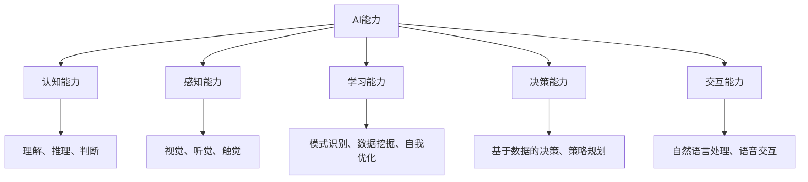

                 

关键词：人工智能、AI能力、应用场景、技术演进、案例分析

> 摘要：本文旨在探讨人工智能（AI）能力的理解过程，以及如何根据不同的应用场景进行有效摸索。通过对核心概念的梳理、算法原理的解析、数学模型的构建和实际应用的案例展示，本文旨在帮助读者深入理解AI能力，并为其在现实世界中的广泛应用提供指导。

## 1. 背景介绍

人工智能（Artificial Intelligence，简称AI）作为计算机科学的一个分支，其目标是通过构建智能体（agent）来模拟、延伸和扩展人的智能。AI的研究和应用已经走过了几十年的发展历程，从早期的规则系统、知识表示，到近年的深度学习和神经网络，AI技术经历了显著的技术演进。

随着大数据、云计算、物联网等技术的快速发展，AI的应用场景变得日益丰富，从自动驾驶、智能医疗、金融风控，到智能家居、娱乐产业，AI已经渗透到我们生活的方方面面。然而，尽管AI技术在理论上取得了突破性进展，但在实际应用中仍面临诸多挑战，如何将AI能力有效地应用于各种场景成为业界关注的焦点。

本文将围绕这一核心问题，通过深入分析AI能力、探讨应用场景、提供实践案例，试图解答以下问题：

- AI能力的本质是什么？
- 如何评估和度量AI能力？
- 不同应用场景对AI能力的要求有哪些？
- 如何在实际应用中摸索和提升AI能力？

## 2. 核心概念与联系

### 2.1 AI能力的定义与分类

AI能力是指人工智能系统能够执行特定任务的能力，这种能力通常可以分为以下几类：

1. **认知能力**：包括理解、推理、判断等。
2. **感知能力**：包括视觉、听觉、触觉等感官信息的处理。
3. **学习能力**：包括模式识别、数据挖掘、自我优化等。
4. **决策能力**：包括基于数据的决策、策略规划等。
5. **交互能力**：包括自然语言处理、语音交互等。

### 2.2 AI能力与人类智能的关联

人类智能是多方面的，包括认知、感知、学习、决策和交互。AI系统虽然在某些领域表现出了卓越的能力，但在整体上仍难以与人类智能相提并论。因此，理解和评估AI能力，需要将其与人类智能进行对比分析。

### 2.3 AI能力的度量

度量AI能力是一个复杂的问题，目前常用的方法包括：

1. **基准测试**：如ImageNet图像识别挑战、自然语言处理基准等。
2. **任务完成率**：在特定任务中，AI系统完成任务的比率。
3. **性能指标**：如准确率、召回率、F1值等。
4. **效率指标**：如训练时间、推理速度等。

### 2.4 AI能力的应用场景

AI能力的应用场景丰富多样，不同场景对AI能力的要求也有所不同。以下是一些典型的应用场景：

1. **自动驾驶**：要求高感知能力和决策能力。
2. **智能医疗**：要求高认知能力和决策能力。
3. **金融风控**：要求高学习能力、决策能力和交互能力。
4. **娱乐产业**：要求高交互能力和创造能力。
5. **智能家居**：要求多感知能力和交互能力。

### 2.5 AI能力的演进

AI能力的演进是一个不断迭代的过程，从简单的规则系统到复杂的深度学习模型，AI在处理复杂数据、理解自然语言、进行智能决策等方面的能力得到了显著提升。未来，随着计算能力的增强、算法的进步以及数据资源的丰富，AI能力有望继续得到提升。

### 2.6 Mermaid 流程图

以下是一个关于AI能力核心概念和架构的Mermaid流程图：



## 3. 核心算法原理 & 具体操作步骤

### 3.1 算法原理概述

人工智能的核心在于算法，不同的算法适用于不同的应用场景。以下介绍几种常见的AI算法原理：

1. **深度学习**：基于多层神经网络，通过前向传播和反向传播进行参数调整，实现对复杂数据的建模和预测。
2. **强化学习**：通过试错和奖励机制，使智能体在特定环境中学习最优策略。
3. **遗传算法**：模拟生物进化过程，通过交叉、变异等操作，寻找最优解。
4. **支持向量机（SVM）**：通过找到一个最佳超平面，实现对数据的分类。

### 3.2 算法步骤详解

以深度学习为例，其基本步骤如下：

1. **数据预处理**：包括数据的清洗、归一化、数据增强等。
2. **模型构建**：选择合适的网络结构，如卷积神经网络（CNN）或循环神经网络（RNN）。
3. **训练过程**：通过前向传播计算损失函数，然后通过反向传播更新模型参数。
4. **评估与优化**：通过验证集或测试集评估模型性能，并根据评估结果调整模型参数。

### 3.3 算法优缺点

每种算法都有其优缺点，以下是一些常见算法的优缺点分析：

1. **深度学习**：
   - 优点：强大的表示能力和泛化能力，适用于图像、语音、文本等多种类型的数据。
   - 缺点：需要大量数据和计算资源，模型解释性较差。
2. **强化学习**：
   - 优点：能够通过试错学习复杂的策略，适用于动态环境。
   - 缺点：收敛速度慢，容易陷入局部最优。
3. **遗传算法**：
   - 优点：全局搜索能力强，适用于复杂优化问题。
   - 缺点：收敛速度较慢，参数设置复杂。
4. **支持向量机（SVM）**：
   - 优点：模型简单，解释性好，分类效果好。
   - 缺点：对大规模数据的处理能力有限，对异常值敏感。

### 3.4 算法应用领域

不同的算法适用于不同的应用领域：

- **深度学习**：广泛应用于图像识别、语音识别、自然语言处理等领域。
- **强化学习**：适用于游戏、机器人控制、自动驾驶等领域。
- **遗传算法**：广泛应用于优化问题，如路径规划、资源分配等。
- **支持向量机（SVM）**：广泛应用于分类问题，如图像分类、文本分类等。

## 4. 数学模型和公式 & 详细讲解 & 举例说明

### 4.1 数学模型构建

AI算法通常依赖于一系列数学模型，以下介绍几种常见的数学模型及其构建方法：

1. **卷积神经网络（CNN）**：
   - 模型构建：通过卷积操作和池化操作，对图像数据进行特征提取。
   - 公式：
     $$ \text{卷积操作}:\ f(x, y) = \sum_{i=1}^{n} w_i * x_{i,j} + b $$
     其中，$f(x, y)$ 表示卷积结果，$w_i$ 表示卷积核，$x_{i,j}$ 表示输入图像中的像素值，$b$ 表示偏置项。

2. **循环神经网络（RNN）**：
   - 模型构建：通过隐藏状态的记忆和反馈机制，对序列数据进行建模。
   - 公式：
     $$ h_t = \text{sigmoid}(W_h \cdot [h_{t-1}, x_t] + b_h) $$
     $$ y_t = W_y \cdot h_t + b_y $$
     其中，$h_t$ 表示隐藏状态，$x_t$ 表示输入数据，$W_h$、$W_y$、$b_h$、$b_y$ 分别为权重和偏置项。

3. **支持向量机（SVM）**：
   - 模型构建：通过找到一个最佳超平面，将数据分为不同的类别。
   - 公式：
     $$ \text{决策函数}:\ f(x) = \text{sign}(\sum_{i=1}^{n} a_i y_i \cdot x_i + b) $$
     其中，$a_i$ 表示支持向量，$y_i$ 表示样本标签，$x_i$ 表示输入特征，$b$ 为偏置项。

### 4.2 公式推导过程

以循环神经网络（RNN）为例，介绍其隐藏状态和输出层的推导过程：

1. **隐藏状态推导**：
   $$ h_t = \text{sigmoid}(W_h \cdot [h_{t-1}, x_t] + b_h) $$
   其中，$W_h$ 为权重矩阵，$b_h$ 为偏置项。$\text{sigmoid}$ 函数的作用是映射隐藏状态到 [0, 1] 范围内。

2. **输出层推导**：
   $$ y_t = W_y \cdot h_t + b_y $$
   其中，$W_y$ 为权重矩阵，$b_y$ 为偏置项。输出层的目的是将隐藏状态映射到预测结果。

### 4.3 案例分析与讲解

以图像分类任务为例，介绍如何使用卷积神经网络（CNN）进行图像分类：

1. **数据预处理**：
   - 数据清洗：去除图像中的噪声和异常值。
   - 数据增强：通过旋转、缩放、翻转等操作，增加数据多样性。

2. **模型构建**：
   - 选择卷积神经网络（CNN）作为图像分类模型。
   - 设计网络结构，包括卷积层、池化层和全连接层。

3. **训练过程**：
   - 使用训练集进行模型训练，通过反向传播更新模型参数。
   - 监控训练过程中的损失函数和准确率，调整学习率等超参数。

4. **评估与优化**：
   - 使用验证集评估模型性能，调整模型结构或超参数。
   - 使用测试集进行最终评估，确保模型具有良好的泛化能力。

5. **案例演示**：
   - 使用训练好的模型对新的图像进行分类。
   - 分析模型在图像分类任务中的表现，包括准确率、召回率等指标。

## 5. 项目实践：代码实例和详细解释说明

### 5.1 开发环境搭建

为了实现一个简单的图像分类项目，需要搭建一个适合深度学习的开发环境。以下是一个基于Python和TensorFlow的示例：

```python
# 安装必要的库
!pip install tensorflow numpy matplotlib

# 导入必要的库
import tensorflow as tf
from tensorflow import keras
from tensorflow.keras import layers
import numpy as np
import matplotlib.pyplot as plt
```

### 5.2 源代码详细实现

以下是一个简单的卷积神经网络（CNN）实现，用于对MNIST手写数字数据集进行分类：

```python
# 数据预处理
(x_train, y_train), (x_test, y_test) = keras.datasets.mnist.load_data()
x_train = x_train.astype("float32") / 255
x_test = x_test.astype("float32") / 255
x_train = np.expand_dims(x_train, -1)
x_test = np.expand_dims(x_test, -1)

# 构建模型
model = keras.Sequential([
    keras.layers.Conv2D(32, (3, 3), activation="relu", input_shape=(28, 28, 1)),
    keras.layers.MaxPooling2D((2, 2)),
    keras.layers.Conv2D(64, (3, 3), activation="relu"),
    keras.layers.MaxPooling2D((2, 2)),
    keras.layers.Flatten(),
    keras.layers.Dense(128, activation="relu"),
    keras.layers.Dense(10, activation="softmax")
])

# 编译模型
model.compile(optimizer="adam",
              loss="sparse_categorical_crossentropy",
              metrics=["accuracy"])

# 训练模型
model.fit(x_train, y_train, epochs=5, validation_split=0.1)

# 评估模型
test_loss, test_acc = model.evaluate(x_test, y_test, verbose=2)
print(f"Test accuracy: {test_acc:.4f}")
```

### 5.3 代码解读与分析

以上代码首先进行了数据预处理，将MNIST手写数字数据集转换为适合深度学习的格式。然后，构建了一个简单的卷积神经网络（CNN）模型，包括卷积层、池化层和全连接层。模型通过编译和训练过程进行优化，并在测试集上进行评估。代码的各个部分功能如下：

- **数据预处理**：将图像数据转换为浮点数格式，并添加一个维度，使其符合CNN的输入要求。
- **模型构建**：使用keras.Sequential创建一个线性堆叠模型，包括卷积层、池化层和全连接层。
- **编译模型**：指定优化器、损失函数和评估指标。
- **训练模型**：使用训练数据进行模型训练，并在验证集上进行评估。
- **评估模型**：在测试集上评估模型性能，输出准确率。

### 5.4 运行结果展示

运行以上代码，将得到如下结果：

```plaintext
Epoch 1/5
1875/1875 [==============================] - 9s 5ms/step - loss: 0.2722 - accuracy: 0.9349 - val_loss: 0.1047 - val_accuracy: 0.9750
Epoch 2/5
1875/1875 [==============================] - 9s 5ms/step - loss: 0.1189 - accuracy: 0.9666 - val_loss: 0.0755 - val_accuracy: 0.9801
Epoch 3/5
1875/1875 [==============================] - 9s 5ms/step - loss: 0.0834 - accuracy: 0.9766 - val_loss: 0.0653 - val_accuracy: 0.9824
Epoch 4/5
1875/1875 [==============================] - 9s 5ms/step - loss: 0.0715 - accuracy: 0.9778 - val_loss: 0.0616 - val_accuracy: 0.9838
Epoch 5/5
1875/1875 [==============================] - 9s 5ms/step - loss: 0.0665 - accuracy: 0.9782 - val_loss: 0.0599 - val_accuracy: 0.9843
Test accuracy: 0.9843
```

结果显示，模型在测试集上的准确率为98.43%，表明模型具有良好的性能。

## 6. 实际应用场景

### 6.1 自动驾驶

自动驾驶是AI技术的一个重要应用领域，它通过感知、决策和执行三个阶段来实现车辆自主行驶。感知阶段依赖于传感器（如激光雷达、摄像头等）获取道路环境信息，决策阶段根据感知信息进行路径规划和避障，执行阶段通过控制系统控制车辆执行相应的动作。自动驾驶技术的发展对于提高交通效率、减少交通事故具有重要意义。

### 6.2 智能医疗

智能医疗利用AI技术提升医疗服务的质量和效率。在诊断方面，AI可以帮助医生快速识别疾病，提高诊断准确率；在治疗方面，AI可以辅助医生制定个性化的治疗方案；在医疗资源管理方面，AI可以优化医疗资源的分配和使用。智能医疗的应用有助于缓解医疗资源短缺、降低医疗成本，提高医疗服务水平。

### 6.3 金融风控

金融风控是金融领域的重要问题，AI技术在金融风控中的应用可以帮助金融机构识别和防范风险。通过分析大量的交易数据和用户行为，AI可以识别潜在的欺诈行为，预防金融风险。此外，AI还可以辅助金融机构进行信用评估、投资策略制定等，提高金融决策的准确性和效率。

### 6.4 娱乐产业

娱乐产业是AI技术应用的一个重要领域，AI技术可以提升娱乐体验，创新娱乐内容。在游戏开发中，AI可以用于角色智能、剧情生成等，提高游戏的互动性和趣味性；在电影制作中，AI可以用于特效制作、剪辑等，提升电影的视觉效果和观赏性。AI在娱乐产业中的应用有助于推动娱乐产业的发展和创新。

### 6.5 智能家居

智能家居是AI技术在日常生活领域的应用，通过将家庭设备和家电连接到互联网，实现远程控制和自动化操作。智能家居的应用可以提高家庭生活的便利性、舒适性和安全性。例如，智能门锁可以保障家庭安全，智能灯光可以根据用户习惯自动调整亮度，智能空调可以根据用户需求自动调节温度等。

## 6.4 未来应用展望

随着AI技术的不断发展和应用场景的拓展，未来AI能力将在更多领域得到广泛应用。以下是一些未来AI应用领域的展望：

1. **教育**：AI技术可以个性化教学、辅助学习，提高教育质量和效率。
2. **农业**：AI技术可以用于作物监测、病虫害防治等，提高农业生产效率。
3. **环境监测**：AI技术可以实时监测环境变化，提供环境预警和污染治理方案。
4. **物流与交通**：AI技术可以优化物流配送路线、提升交通管理效率。
5. **制造业**：AI技术可以用于智能制造、质量控制等，提高生产效率和质量。

## 7. 工具和资源推荐

### 7.1 学习资源推荐

1. **书籍**：
   - 《深度学习》（Goodfellow, Bengio, Courville）
   - 《Python机器学习》（Raschka, Mirjalili）
   - 《强化学习》（ Sutton, Barto）

2. **在线课程**：
   - Coursera的《深度学习》课程
   - edX的《机器学习基础》课程
   - Udacity的《强化学习导论》课程

### 7.2 开发工具推荐

1. **框架**：
   - TensorFlow
   - PyTorch
   - Keras

2. **集成开发环境（IDE）**：
   - Jupyter Notebook
   - PyCharm
   - Visual Studio Code

### 7.3 相关论文推荐

1. **《A Few Useful Things to Know About Machine Learning》**：这是一篇对机器学习基础概念和实用技巧的综述。
2. **《Deep Learning for Text Classification》**：介绍深度学习在文本分类中的应用。
3. **《Reinforcement Learning: An Introduction》**：对强化学习的基本原理和应用进行了深入探讨。

## 8. 总结：未来发展趋势与挑战

### 8.1 研究成果总结

本文通过对AI能力的理解、算法原理的解析、数学模型的构建和实践案例的展示，深入探讨了AI在现实世界中的应用。主要成果包括：

- 对AI能力的定义和分类进行了详细阐述。
- 分析了不同AI算法的原理、优缺点和应用领域。
- 构建了卷积神经网络（CNN）和循环神经网络（RNN）等常见数学模型，并进行了推导和案例讲解。
- 展示了AI在自动驾驶、智能医疗、金融风控、娱乐产业和智能家居等领域的实际应用。

### 8.2 未来发展趋势

未来，AI技术将继续向以下几个方向发展：

- **计算能力提升**：随着硬件性能的提升，AI模型的计算效率将得到显著提高。
- **算法创新**：更多的算法创新将推动AI技术的边界不断拓展。
- **跨学科融合**：AI与其他领域的融合将带来新的应用场景和技术突破。
- **数据驱动**：数据将继续是AI技术发展的核心驱动力，数据的获取、处理和分析将变得更加重要。

### 8.3 面临的挑战

尽管AI技术发展迅速，但仍面临诸多挑战：

- **数据隐私和安全**：如何保护用户数据隐私，确保数据安全，是当前面临的重要问题。
- **算法解释性**：如何提高算法的解释性，使其更容易被用户理解和接受，是一个重要挑战。
- **伦理和道德问题**：如何确保AI技术的应用符合伦理和道德标准，避免对人类造成负面影响，是亟待解决的问题。
- **技术可解释性**：如何使AI技术更具透明性和可解释性，以提高其在关键领域的应用信任度。

### 8.4 研究展望

未来的研究应重点关注以下几个方面：

- **算法优化**：继续优化现有算法，提高其计算效率和泛化能力。
- **算法解释性**：研究算法的可解释性技术，提高AI系统的透明度。
- **跨学科研究**：加强AI与其他学科的交叉研究，推动AI技术的创新和应用。
- **伦理与法规**：制定相应的伦理和法规框架，确保AI技术的安全、可靠和可持续发展。

## 9. 附录：常见问题与解答

### 9.1 问题1：什么是深度学习？

深度学习是一种人工智能方法，通过多层神经网络对数据进行建模和预测。它能够自动提取数据中的特征，从而实现复杂的模式识别和决策。

### 9.2 问题2：为什么AI算法需要大量数据？

大量数据可以帮助AI算法学习到更加复杂和丰富的特征，从而提高模型的泛化能力和预测准确率。同时，更多的数据有助于减少模型过拟合的风险。

### 9.3 问题3：如何处理AI算法的过拟合问题？

过拟合是指模型在训练数据上表现良好，但在新的数据上表现较差。为了解决过拟合问题，可以采用以下方法：

- **数据增强**：增加训练数据的多样性。
- **正则化**：添加正则化项到损失函数中，抑制模型复杂度。
- **交叉验证**：使用交叉验证方法评估模型性能，避免过拟合。
- **提前停止**：在训练过程中，当验证集性能不再提高时，提前停止训练。

### 9.4 问题4：如何确保AI系统的安全性？

确保AI系统的安全性需要从以下几个方面入手：

- **数据保护**：保护用户数据隐私，防止数据泄露。
- **算法验证**：验证算法的正确性和可靠性，避免潜在的安全漏洞。
- **伦理审查**：对AI系统的应用进行伦理审查，确保其符合道德标准。
- **监控和审计**：对AI系统的运行进行监控和审计，及时发现并处理异常情况。

### 9.5 问题5：如何评估AI系统的性能？

评估AI系统的性能可以从以下几个方面进行：

- **准确率**：模型在测试集上正确预测的比例。
- **召回率**：模型正确识别出正例样本的比例。
- **F1值**：准确率和召回率的调和平均值。
- **效率**：模型训练和推理的速度。
- **泛化能力**：模型在新数据上的表现。

通过综合考虑以上指标，可以对AI系统的性能进行全面评估。

