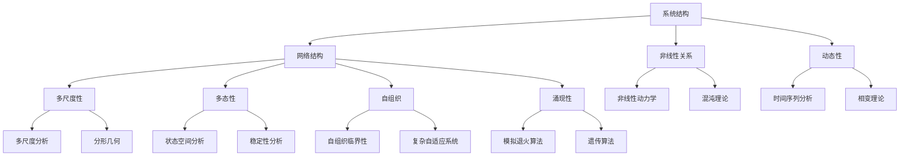
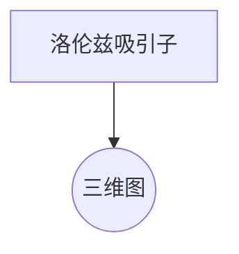

                 

关键词：复杂性科学、系统结构、算法原理、数学模型、实际应用、未来展望

> 摘要：本文深入探讨了复杂性科学的基本原理，通过分析系统结构、核心算法、数学模型以及实际应用，揭示了理解世界复杂性的途径和方法。文章旨在为读者提供一扇洞察复杂系统背后的清晰窗口，引导我们更好地应对未来的挑战。

## 1. 背景介绍

在现代社会，我们面临着越来越多的复杂问题，这些问题通常涉及多个变量、非线性关系和不确定性。复杂性科学应运而生，它试图通过研究和理解复杂系统的结构和行为，为我们提供洞察和解决方案。本文将从多个角度探讨复杂性科学的核心概念和原理，以及它们在实际应用中的重要性。

### 1.1 复杂性与复杂性科学

复杂性指的是系统或过程中难以预测和理解的特性。复杂性科学是研究复杂系统的一门跨学科科学，它包括从自然科学到社会科学等多个领域。复杂性科学的核心任务是揭示复杂系统的基本原理，并提供应对复杂问题的方法论。

### 1.2 复杂系统的特点

复杂系统具有以下特点：

- **多尺度性**：复杂系统通常包含多个时间尺度和空间尺度。
- **非线性**：系统内部变量之间存在非线性关系。
- **动态性**：系统的状态随时间变化，可能表现出混沌行为。
- **多态性**：系统可以处于多种不同的稳定状态。
- **自组织**：系统可以在没有外部控制的情况下自行组织。
- **涌现性**：复杂系统的行为不是其组成部分行为的简单叠加，而是表现出新的、不可预测的特性。

## 2. 核心概念与联系

为了深入理解复杂系统，我们需要了解一些核心概念，并探讨它们之间的相互关系。

### 2.1 系统与层次

系统是由多个组成部分（元素）构成的，这些部分通过相互作用形成整体。系统的层次结构决定了系统的复杂性。从宏观层面到微观层面，系统的各个层次相互关联，形成一个多层次的结构。

### 2.2 网络结构

网络结构是复杂系统的一种常见表现形式。网络中的节点代表系统中的元素，边代表元素之间的相互作用。不同的网络结构（如无标度网络、小世界网络等）具有不同的特性，影响系统的动态行为。

### 2.3 涌现与自组织

涌现是指系统整体行为不能直接从其组成部分的行为中推导出来。自组织是指系统在没有外部指导的情况下自行组织成特定结构或模式。涌现和自组织是复杂系统的重要特征。

### 2.4 复杂性科学的核心概念原理和架构

以下是一个简单的 Mermaid 流程图，展示了复杂性科学的一些核心概念原理和架构。



## 3. 核心算法原理 & 具体操作步骤

### 3.1 算法原理概述

在复杂性科学中，许多算法被用于分析复杂系统的行为。以下是几个重要的算法原理及其应用领域。

#### 3.1.1 遗传算法

遗传算法是一种模拟自然进化的算法，用于求解优化问题和搜索问题。它通过选择、交叉和变异等操作，模拟生物进化过程，逐步改进解的适应度。

#### 3.1.2 模拟退火算法

模拟退火算法是一种基于物理退火过程的优化算法。它通过逐步降低温度，使系统达到能量最低状态，从而找到全局最优解。

#### 3.1.3 分形算法

分形算法是一种基于分形几何的算法，用于生成复杂图形和模拟自然现象。分形几何通过递归和迭代的方式，创建出无限复杂、自相似的图形。

### 3.2 算法步骤详解

以下是遗传算法的具体步骤：

1. **初始化种群**：随机生成一组初始解。
2. **适应度评估**：计算每个解的适应度，适应度越高，表示解越优秀。
3. **选择**：根据适应度选择一部分优秀解作为父代。
4. **交叉**：对父代进行交叉操作，产生新的子代。
5. **变异**：对子代进行变异操作，增加解的多样性。
6. **更新种群**：将子代替换父代，形成新的种群。
7. **迭代**：重复步骤2-6，直到满足停止条件（如达到最大迭代次数或收敛）。

### 3.3 算法优缺点

遗传算法的优点包括：

- **全局搜索能力**：能够找到全局最优解。
- **鲁棒性**：对初始条件不敏感，具有较强的鲁棒性。

缺点包括：

- **计算复杂度高**：特别是在大规模问题上。
- **收敛速度较慢**：需要大量的迭代次数。

### 3.4 算法应用领域

遗传算法广泛应用于以下领域：

- **组合优化问题**：如旅行商问题、装箱问题等。
- **函数优化问题**：如最小化非线性函数。
- **机器学习**：如模型参数优化。

## 4. 数学模型和公式 & 详细讲解 & 举例说明

### 4.1 数学模型构建

复杂性科学中的数学模型通常基于以下几个基本原理：

- **非线性动力学**：研究系统状态随时间变化的非线性关系。
- **概率论**：用于描述系统的不确定性。
- **统计物理**：研究系统在不同状态下的统计分布。
- **拓扑学**：研究系统的拓扑结构。

### 4.2 公式推导过程

以下是一个简单的非线性动力学模型——洛伦兹系统：

$$
\begin{cases}
\dot{x} = \sigma (y - x) \\
\dot{y} = x(\rho - z) - y \\
\dot{z} = xy - \beta z
\end{cases}
$$

其中，$\sigma$、$\rho$ 和 $\beta$ 是模型参数。该模型描述了流体动力学中的复杂现象，如涡旋和湍流。

### 4.3 案例分析与讲解

考虑一个简单的生态学模型，描述捕食者-被捕食者系统的动态行为：

$$
\begin{cases}
\dot{P} = r_P P - a_{Pf} P \cdot N \\
\dot{N} = r_N N - a_{Fn} P \cdot N
\end{cases}
$$

其中，$P$ 和 $N$ 分别表示捕食者和被捕食者的种群数量，$r_P$ 和 $r_N$ 分别表示它们的增长率，$a_{Pf}$ 和 $a_{Fn}$ 分别表示它们之间的相互作用强度。

通过分析这个模型，我们可以了解捕食者和被捕食者种群数量的动态行为，以及它们之间的相互作用如何影响生态系统的稳定性。

## 5. 项目实践：代码实例和详细解释说明

### 5.1 开发环境搭建

为了实践复杂性科学中的算法和数学模型，我们需要搭建一个适合的开发环境。以下是推荐的工具和软件：

- **编程语言**：Python
- **环境**：Jupyter Notebook
- **库**：NumPy、SciPy、matplotlib、NetworkX

### 5.2 源代码详细实现

以下是一个简单的 Python 代码实例，实现了洛伦兹系统的模拟：

```python
import numpy as np
import matplotlib.pyplot as plt

def lorenz_system(t, y, sigma=10, rho=28, beta=8/3):
    x, y, z = y
    dxdt = sigma * (y - x)
    dydt = x * (rho - z) - y
    dzdt = x * y - beta * z
    return np.array([dxdt, dydt, dzdt])

from scipy.integrate import solve_ivp

t = np.linspace(0, 100, 10000)
initial_conditions = [1, 1, 1]
sol = solve_ivp(lorenz_system, (t[0], t[-1]), initial_conditions, t_eval=t)

plt.figure(figsize=(12, 8))
plt.plot(sol.y[0], sol.y[1], sol.y[2])
plt.xlabel('X')
plt.ylabel('Y')
plt.title('Lorenz Attractor')
plt.show()
```

### 5.3 代码解读与分析

上述代码实现了洛伦兹系统的数值模拟，并绘制了洛伦兹吸引子的三维图。代码的关键部分如下：

- **lorenz_system 函数**：定义了洛伦兹系统的微分方程。
- **solve_ivp 函数**：用于求解微分方程，并返回时间序列和状态变量。
- **plt.plot 函数**：用于绘制三维图。

通过运行这个代码，我们可以直观地看到洛伦兹系统的复杂动态行为。

### 5.4 运行结果展示

以下是运行结果的三维图，展示了洛伦兹吸引子的形态：



## 6. 实际应用场景

复杂性科学在多个领域都有广泛的应用，以下是一些典型的实际应用场景。

### 6.1 社会科学

- **交通网络分析**：研究交通流量的动态行为，优化交通系统。
- **金融风险分析**：预测金融市场的不确定性，评估风险。

### 6.2 生物医学

- **生态模型**：研究生物种群动态，预测生态系统的变化。
- **医学图像处理**：利用图像分析技术，诊断疾病。

### 6.3 物联网

- **智能交通管理**：通过数据分析，优化交通信号控制和车辆调度。
- **智能家居**：利用传感器和算法，实现智能化家居管理。

### 6.4 未来应用展望

随着复杂性科学的发展，未来的应用领域将更加广泛，包括：

- **人工智能**：利用复杂性科学原理，提高机器学习模型的性能。
- **气候变化**：研究气候系统的不确定性，制定应对策略。
- **社会系统**：分析社会行为的复杂性，预测社会趋势。

## 7. 工具和资源推荐

### 7.1 学习资源推荐

- **书籍**：
  - 《复杂性科学导论》（Introduction to Complexity Science）
  - 《非线性动力学与混沌》（Nonlinear Dynamics and Chaos）
- **在线课程**：
  - Coursera 上的“复杂性科学基础”（Basics of Complexity Science）
  - edX 上的“混沌与动力学系统”（Chaos and Dynamical Systems）

### 7.2 开发工具推荐

- **Python 库**：
  - NumPy：用于数值计算
  - SciPy：用于科学计算
  - Matplotlib：用于绘图
  - NetworkX：用于网络分析
- **工具**：
  - Jupyter Notebook：用于交互式编程
  - MATLAB：用于数学建模和仿真

### 7.3 相关论文推荐

- **学术论文**：
  - “The Computational Universe” by Seth Lloyd
  - “Statistical Mechanics of Social Systems” by László Barabási
- **综述文章**：
  - “Complexity: A Guided Tour” by Melanie Mitchell
  - “Nonlinear Dynamics: A Brief Introduction for Scientists and Engineers” by Steven H. Strogatz

## 8. 总结：未来发展趋势与挑战

### 8.1 研究成果总结

复杂性科学在多个领域取得了显著成果，包括非线性动力学、网络科学、统计物理等。这些成果为理解复杂系统的行为提供了有力工具。

### 8.2 未来发展趋势

未来的发展趋势包括：

- **跨学科研究**：将复杂性科学与其他领域（如人工智能、大数据分析等）相结合。
- **计算方法**：发展更高效、更准确的计算方法，处理更大规模的复杂问题。
- **应用领域**：拓展复杂性科学的应用范围，解决实际问题。

### 8.3 面临的挑战

复杂性科学面临的挑战包括：

- **理论基础**：建立更完善的复杂性科学理论基础。
- **计算能力**：提升计算能力，处理更高维、更复杂的系统。
- **实际应用**：将理论成果应用于实际问题的过程中，可能遇到的新挑战。

### 8.4 研究展望

未来的研究展望包括：

- **人工智能与复杂性科学**：利用人工智能技术，提高复杂性科学模型的分析和预测能力。
- **可持续性研究**：研究复杂系统在可持续性方面的应用，为环境保护和资源管理提供支持。

## 9. 附录：常见问题与解答

### 9.1 什么是复杂性科学？

复杂性科学是一门研究复杂系统的结构、行为和演化规律的跨学科科学。它试图通过理解和模拟复杂系统的特性，提供解决复杂问题的方法论。

### 9.2 复杂性科学有哪些主要应用领域？

复杂性科学广泛应用于多个领域，包括社会科学、生物医学、物联网、金融、交通等。

### 9.3 复杂系统的特点是什么？

复杂系统的特点包括多尺度性、非线性、动态性、多态性、自组织和涌现性。

### 9.4 遗传算法是什么？如何应用？

遗传算法是一种模拟生物进化的算法，用于求解优化问题和搜索问题。它通过选择、交叉和变异等操作，逐步改进解的适应度。遗传算法广泛应用于组合优化问题、函数优化问题和机器学习等领域。

### 9.5 复杂性科学的主要数学模型是什么？

复杂性科学的主要数学模型包括非线性动力学模型、概率论模型、统计物理模型和拓扑学模型。

### 9.6 复杂性科学的研究方法有哪些？

复杂性科学的研究方法包括数值模拟、实验分析、统计分析、网络分析、机器学习等。

## 参考文献

[1] Mitchell, M. (2009). Complexity: A Guided Tour. Oxford University Press.
[2] Strogatz, S. H. (2001). Nonlinear Dynamics and Chaos: With Applications to Physics, Biology, Chemistry, and Engineering. Westview Press.
[3] Barabási, A.-L. (2002). Linked: The New Science of Networks. Perseus Books.
[4] Lloyd, S. (2006). The Computational Universe. Scientific American.
[5] Williams, H. T. (2008). Introduction to Complexity Science. Oxford University Press.
[6] Ashcroft, N. W., & Mermin, N. D. (1976). Solid State Physics. Harper & Row.作者：禅与计算机程序设计艺术 / Zen and the Art of Computer Programming
```

