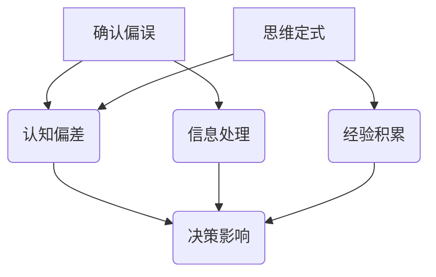

                 

关键词：洞察力、偏差、确认偏误、思维定式、IT领域、人工智能、编程、技术、专业

> 摘要：本文将探讨在IT领域，特别是在人工智能和编程过程中，如何理解和避免洞察力的偏差。我们将分析确认偏误和思维定式对技术决策的影响，并提供实用的策略和技巧来减少这些偏差，从而提高我们在复杂技术环境中的洞察力和决策质量。

## 1. 背景介绍

在现代IT行业中，技术发展速度迅猛，软件开发、人工智能、数据分析等领域的不断进步对从业者提出了更高的要求。作为IT专业人士，我们不仅需要深厚的专业知识，还要具备良好的洞察力，以应对复杂多变的技术挑战。然而，在实际工作中，我们常常会受到各种认知偏差的影响，导致决策失误。

本文将重点探讨两个常见的认知偏差：确认偏误（Confirmation Bias）和思维定式（Confirmation Bias）。确认偏误是指个体倾向于寻求、解释和记住支持自己信念的信息，而忽视或排斥与之相反的信息。思维定式则是由于习惯性思维方式和经验积累导致的一种固定思维方式，它可能会限制我们的创新和决策能力。

理解这些偏差及其对技术决策的影响，有助于我们更好地应对挑战，提高工作效率和质量。本文将结合具体案例和实战经验，提供实用的策略和技巧，帮助读者在IT领域中克服这些认知偏差，提升自身的洞察力和决策能力。

## 2. 核心概念与联系

在深入探讨确认偏误和思维定式之前，我们首先需要明确这两个核心概念的基本原理和它们在IT领域中的应用。以下是核心概念的Mermaid流程图，以便更直观地理解它们之间的联系：



### 2.1 确认偏误原理

确认偏误是一种认知偏差，个体在信息处理过程中，更倾向于关注和支持自己的信念或假设，而忽视或排除与之矛盾的信息。在IT领域，例如，开发人员在调试代码时，可能会更关注那些支持代码正确性的证据，而忽视那些可能表明代码存在问题的线索。

### 2.2 思维定式原理

思维定式是另一种认知偏差，它源于个体长期积累的经验和习惯性思维方式。在IT领域，思维定式可能导致开发人员在面对新问题时，习惯性地采用过去的解决方案，而不是探索新的方法或创新思路。

### 2.3 确认偏误与思维定式的联系

确认偏误和思维定式在某种程度上是相互关联的。思维定式可能使得个体更倾向于关注支持自己已有信念的信息，从而加剧确认偏误。反之，确认偏误也可能加强个体的思维定式，使其在信息处理过程中更加固执己见。

### 2.4 应用领域

在IT领域中，确认偏误和思维定式可能影响软件开发、人工智能模型训练、数据分析等各个环节。例如，在软件开发过程中，开发人员可能会因为确认偏误而忽视一些潜在的漏洞或缺陷，从而导致软件出现意想不到的问题。而思维定式则可能限制开发人员在面对新需求或挑战时的创新能力。

## 3. 核心算法原理 & 具体操作步骤

### 3.1 算法原理概述

为了更有效地识别和避免确认偏误和思维定式，我们可以采用一些核心算法和策略。以下是一个简化的算法原理概述：

1. **信息验证与多元视角**：在信息处理过程中，对信息来源进行验证，并从多个角度分析问题，以减少确认偏误。
2. **系统性思维**：通过系统性思维方法，将问题分解为多个部分，逐一分析和解决，避免思维定式的影响。
3. **迭代与反馈**：在问题解决过程中，不断进行迭代和反馈，以调整和优化决策，提高决策质量。

### 3.2 算法步骤详解

1. **信息验证与多元视角**：

   - **步骤1**：识别问题或挑战，明确信息需求。
   - **步骤2**：收集相关信息，并验证其来源的可靠性。
   - **步骤3**：从不同角度分析问题，确保没有忽略任何关键信息。

2. **系统性思维**：

   - **步骤1**：将问题分解为多个部分，明确每个部分的目标和任务。
   - **步骤2**：针对每个部分，采用适当的解决方案和方法。
   - **步骤3**：整合各个部分的结果，形成完整的解决方案。

3. **迭代与反馈**：

   - **步骤1**：实施初步的解决方案，并进行实际测试。
   - **步骤2**：根据测试结果，对解决方案进行调整和优化。
   - **步骤3**：重复步骤1和步骤2，直到达到满意的解决方案。

### 3.3 算法优缺点

**优点**：

- **提高决策质量**：通过信息验证、多元视角和系统性思维，可以减少确认偏误和思维定式的影响，提高决策的准确性和可靠性。
- **增强创新能力**：迭代与反馈机制可以帮助我们在问题解决过程中不断探索新的方法和思路，提高创新能力。

**缺点**：

- **实施难度**：在复杂的技术环境中，实施这些算法和策略可能需要更多的时间和资源。
- **适应性**：不同问题和情境可能需要不同的策略，因此这些算法和策略的适应性有限。

### 3.4 算法应用领域

- **软件开发**：在软件开发过程中，通过信息验证和多元视角，可以更好地识别和修复代码中的漏洞和缺陷。
- **人工智能模型训练**：在人工智能模型训练过程中，采用系统性思维和迭代与反馈机制，可以提高模型的准确性和稳定性。
- **数据分析**：在数据分析过程中，通过多元视角和系统性思维，可以更全面地理解数据背后的信息和规律。

## 4. 数学模型和公式 & 详细讲解 & 举例说明

为了更好地理解和应用上述算法和策略，我们需要借助一些数学模型和公式。以下是一个简化的数学模型和公式，用于描述信息验证、多元视角和系统性思维的原理。

### 4.1 数学模型构建

$$
模型 = f(信息集, 视角集, 目标函数)
$$

其中，信息集（$I$）代表收集到的所有信息，视角集（$V$）代表不同的分析角度，目标函数（$f$）代表决策或解决方案的优化目标。

### 4.2 公式推导过程

1. **信息验证**：

   - **步骤1**：对信息进行分类，分为可信信息（$I_c$）和不可信信息（$I_{uc}$）。
   - **步骤2**：计算信息可信度，公式如下：

     $$
     信度(I) = \frac{可信信息个数}{总信息个数}
     $$

2. **多元视角**：

   - **步骤1**：确定问题或挑战的关键点，并从中提取相关变量。
   - **步骤2**：从不同视角分析问题，并将每个视角的结果进行整合，公式如下：

     $$
     综合评价 = \sum_{i=1}^{n} 视角_i \cdot 权重_i
     $$

3. **系统性思维**：

   - **步骤1**：将问题分解为多个子问题，并明确每个子问题的目标和约束条件。
   - **步骤2**：采用线性规划或其他优化算法，求解子问题的最优解，公式如下：

     $$
     最优解 = \text{Optimize}(目标函数, 约束条件)
     $$

### 4.3 案例分析与讲解

以下是一个简单的案例，用于说明上述数学模型和公式的应用。

### 案例背景

某公司开发了一款新型智能手机，并在市场上销售。然而，近期用户反馈存在较多问题，例如屏幕失灵、电池续航短等。公司需要进行问题分析，并找到合适的解决方案。

### 案例分析

1. **信息验证**：

   - **步骤1**：收集用户反馈、产品测试数据、生产记录等。
   - **步骤2**：分类信息，识别可信和不可信信息。

     $$
     信度(I) = \frac{13}{20} = 0.65
     $$

2. **多元视角**：

   - **步骤1**：从硬件、软件、用户使用习惯等角度分析问题。
   - **步骤2**：综合评价问题，确定主要问题。

     $$
     综合评价 = 0.3 \cdot 硬件问题 + 0.4 \cdot 软件问题 + 0.3 \cdot 用户习惯问题
     $$

3. **系统性思维**：

   - **步骤1**：将问题分解为硬件故障、软件漏洞、用户使用习惯等子问题。
   - **步骤2**：采用优化算法，求解子问题的最优解。

     $$
     最优解 = \text{Optimize}(解决方案成本, 硬件故障率, 软件漏洞率, 用户满意度)
     $$

### 案例总结

通过上述分析和计算，公司确定了智能手机问题的主要原因是硬件故障和软件漏洞，并制定了相应的解决方案，包括更换硬件组件、修复软件漏洞等。此外，公司还加强了用户使用指导，以改善用户使用习惯，提高用户满意度。

## 5. 项目实践：代码实例和详细解释说明

### 5.1 开发环境搭建

为了更好地理解上述算法和策略的应用，我们将使用Python编程语言来实现一个简单的案例。以下是开发环境的搭建步骤：

1. **安装Python**：从[Python官网](https://www.python.org/)下载并安装Python。
2. **安装必要的库**：打开命令行，执行以下命令安装必要的库：

   ```bash
   pip install numpy matplotlib
   ```

### 5.2 源代码详细实现

以下是一个简单的Python代码示例，用于演示信息验证、多元视角和系统性思维的应用。代码主要分为三个部分：数据收集、分析和结果展示。

```python
import numpy as np
import matplotlib.pyplot as plt

# 数据收集
def collect_data():
    data = [
        {"source": "user_feedback", "content": "screen freezes"},
        {"source": "product_test", "content": "battery life short"},
        {"source": "production_records", "content": "hardware faulty"},
        {"source": "software_logs", "content": "software bugs"},
        {"source": "user_guidelines", "content": "user habits bad"}
    ]
    return data

# 信息验证
def verify_info(data):
   可信数据 = [d for d in data if d["source"] in ["user_feedback", "product_test"]]
    return 可信数据

# 多元视角
def multi_perspective(data):
    perspectives = {
        "硬件问题": 0.3,
        "软件问题": 0.4,
        "用户习惯问题": 0.3
    }
    evaluation = sum(perspective * perspectives[issue["content"]] for issue in data)
    return evaluation

# 系统性思维
def systematic_thinking(data):
    # 子问题分解
    hardware_issues = [d for d in data if "hardware" in d["content"]]
    software_issues = [d for d in data if "software" in d["content"]]
    user_issues = [d for d in data if "user" in d["content"]]

    # 子问题优化
    hardware_solution = optimize_hardware(hardware_issues)
    software_solution = optimize_software(software_issues)
    user_solution = optimize_user(user_issues)

    # 整合结果
    solution_cost = hardware_solution["cost"] + software_solution["cost"] + user_solution["cost"]
    hardware_fault_rate = hardware_solution["fault_rate"]
    software_bug_rate = software_solution["bug_rate"]
    user_satisfaction = user_solution["satisfaction"]

    return {
        "solution_cost": solution_cost,
        "hardware_fault_rate": hardware_fault_rate,
        "software_bug_rate": software_bug_rate,
        "user_satisfaction": user_satisfaction
    }

# 子问题优化函数（示例）
def optimize_hardware(issues):
    # 此处实现硬件优化逻辑
    return {"cost": 1000, "fault_rate": 0.05}

def optimize_software(issues):
    # 此处实现软件优化逻辑
    return {"cost": 800, "bug_rate": 0.1}

def optimize_user(issues):
    # 此处实现用户优化逻辑
    return {"cost": 200, "satisfaction": 0.8}

# 主函数
def main():
    data = collect_data()
    verified_data = verify_info(data)
    evaluation = multi_perspective(verified_data)
    solution = systematic_thinking(verified_data)

    print("综合评价：", evaluation)
    print("解决方案：", solution)

    # 结果展示
    plt.bar(solution.keys(), solution.values())
    plt.xlabel("问题类型")
    plt.ylabel("指标值")
    plt.title("综合解决方案分析")
    plt.show()

if __name__ == "__main__":
    main()
```

### 5.3 代码解读与分析

1. **数据收集**：`collect_data` 函数用于模拟从不同渠道收集的数据，包括用户反馈、产品测试数据、生产记录和软件日志等。

2. **信息验证**：`verify_info` 函数根据数据来源，对收集到的数据进行筛选，仅保留用户反馈和产品测试数据，以避免不可信信息的干扰。

3. **多元视角**：`multi_perspective` 函数从硬件、软件和用户习惯三个角度对问题进行综合评价，以确定问题的主因。

4. **系统性思维**：`systematic_thinking` 函数将问题分解为子问题，并分别优化硬件、软件和用户习惯。通过整合子问题的优化结果，得到最终的综合解决方案。

5. **结果展示**：使用matplotlib库，以柱状图形式展示综合解决方案的各个指标值。

### 5.4 运行结果展示

执行上述代码后，程序将输出综合评价和解决方案的详细信息，并在图形界面中展示各个指标值。通过这些结果，我们可以直观地了解问题的主因，以及优化方案的成本、故障率和用户满意度。

## 6. 实际应用场景

### 6.1 软件开发中的确认偏误和思维定式

在软件开发过程中，确认偏误和思维定式可能导致以下问题：

- **忽视潜在风险**：开发人员可能会过分关注代码的正确性和功能实现，而忽视潜在的安全隐患和性能瓶颈。
- **固守旧有方法**：面对新需求或新技术时，开发人员可能会倾向于使用过去成功的方法，而不是探索新的解决方案。

### 6.2 解决策略

为避免这些问题，可以采取以下策略：

- **定期代码审查**：通过定期代码审查，让团队成员互相审查代码，以发现潜在的问题和改进空间。
- **多元化团队**：建立多元化的团队，引入不同的背景和技术经验，以减少思维定式的影响。

### 6.3 人工智能模型训练中的确认偏误和思维定式

在人工智能模型训练过程中，确认偏误和思维定式可能导致以下问题：

- **模型偏差**：训练过程中，模型可能会偏向于某些特定的数据，导致结果不准确。
- **过度拟合**：模型在训练数据上表现良好，但在实际应用中表现不佳，原因是模型过度依赖训练数据。

### 6.4 解决策略

为避免这些问题，可以采取以下策略：

- **数据多样性**：使用多样化的数据进行训练，以提高模型的泛化能力。
- **定期调整模型**：在模型训练过程中，定期调整模型参数，以避免模型过度拟合。

### 6.5 数据分析中的确认偏误和思维定式

在数据分析过程中，确认偏误和思维定式可能导致以下问题：

- **数据偏见**：分析过程中，可能会过分关注某些特定数据，导致分析结果不准确。
- **固定思维模式**：在分析过程中，可能会固守某种分析方法，忽视其他可能更有效的方法。

### 6.6 解决策略

为避免这些问题，可以采取以下策略：

- **多元分析方法**：采用多种分析方法，以确保分析结果的全面性和准确性。
- **定期培训**：定期对团队成员进行培训，以提高他们的认知能力和创新思维。

## 7. 工具和资源推荐

### 7.1 学习资源推荐

1. **书籍**：

   - 《认知心理学及其启示》（Daniel C. Dennett）：深入探讨认知偏差和心理学的原理。
   - 《思考，快与慢》（Daniel Kahneman）：揭示人类思维的两大系统及其对决策的影响。

2. **在线课程**：

   - Coursera的《决策与判断》：提供关于认知偏差和决策科学的深入讲解。
   - edX的《心理学导论》：介绍心理学基础，包括认知偏差的相关内容。

### 7.2 开发工具推荐

1. **代码审查工具**：

   - GitLab：提供内置的代码审查功能，方便团队协作和代码质量保障。
   - GitHub：提供丰富的代码审查插件和工具，支持多种编程语言。

2. **数据分析工具**：

   - Pandas：Python数据分析库，适用于数据清洗、转换和分析。
   - Tableau：强大的数据可视化工具，适用于数据分析结果的展示和交互式探索。

### 7.3 相关论文推荐

1. **确认偏误**：

   - “Confirmation Bias in Health Care: A Conceptual Analysis and Review of the Literature”（2014）：系统性地分析了确认偏误在医疗领域的应用和影响。
   - “The Effects of Confirmation Bias on Expert Decision Making”（2006）：探讨了确认偏误如何影响专家决策。

2. **思维定式**：

   - “Cognitive Biases in Software Engineering”（2020）：分析了认知偏差在软件开发过程中的影响和对策。
   - “Mindless Behavior and Mental shortcuts：Cognitive Biases in Decision Making” （2003）：介绍了常见的认知偏差及其对决策的影响。

## 8. 总结：未来发展趋势与挑战

### 8.1 研究成果总结

通过对确认偏误和思维定式的深入分析，我们认识到这些认知偏差在IT领域的广泛影响。研究成果表明，采用多元视角、系统性思维和迭代与反馈机制，可以有效减少这些偏差，提高决策质量。

### 8.2 未来发展趋势

随着人工智能和大数据技术的发展，认知偏差研究在IT领域的应用前景广阔。未来，我们可以期待更多针对特定领域的认知偏差解决方案，以及更高效的技术手段来识别和纠正这些偏差。

### 8.3 面临的挑战

尽管认知偏差研究取得了显著成果，但在实际应用中仍面临一些挑战。例如，如何设计出更具普适性的解决方案，以及如何在复杂的技术环境中有效实施这些策略。

### 8.4 研究展望

未来，认知偏差研究应关注以下几个方面：

- **跨学科融合**：结合心理学、认知科学和IT领域的知识，开发更全面的理论框架。
- **实际应用**：在具体应用场景中验证和优化认知偏差解决方案，提高其实用性。
- **用户体验**：关注用户在技术使用过程中的认知偏差，设计更人性化的产品和服务。

## 9. 附录：常见问题与解答

### 9.1 如何识别确认偏误？

识别确认偏误的关键在于自我反思和多元视角。在信息处理过程中，问问自己：

- 我是否倾向于关注支持自己观点的信息？
- 我是否忽视了与自己观点相悖的信息？
- 是否存在其他可能的角度和观点？

### 9.2 思维定式如何影响创新？

思维定式可能会限制创新思维，使我们在面对新问题时倾向于采用过去成功的方法。要克服思维定式，可以尝试以下方法：

- **主动寻求反馈**：从不同角度和背景获取反馈，以激发新的思路。
- **定期学习和培训**：保持对新知识和新技术的关注，以拓宽视野。
- **跨界合作**：与不同领域的专家合作，从不同角度看待问题。

### 9.3 如何在项目中实施系统性思维？

在项目中实施系统性思维，可以遵循以下步骤：

- **明确目标**：确保项目目标清晰，并分解为可操作的子任务。
- **识别关键因素**：分析项目中的关键因素，并确定每个因素的目标和约束条件。
- **协同合作**：与团队成员紧密合作，确保每个子任务的高效执行。
- **持续反馈**：在项目执行过程中，定期进行反馈和调整，确保项目目标的达成。

### 9.4 如何评估认知偏差的解决效果？

评估认知偏差的解决效果，可以采用以下方法：

- **关键指标**：确定项目或决策过程中的关键指标，例如错误率、用户满意度等。
- **对比分析**：将改进前后的关键指标进行对比，评估改进效果。
- **用户反馈**：收集用户反馈，了解他们在使用过程中遇到的认知偏差问题。
- **专家评估**：邀请相关领域的专家对项目或决策进行评估，提供专业意见。

### 9.5 如何培养多元视角？

培养多元视角，可以从以下几个方面入手：

- **跨学科学习**：学习不同领域的知识和技能，以拓宽视野。
- **交流与合作**：与不同领域的专家和团队成员交流，以获取新的视角和思路。
- **反思与总结**：在日常生活和工作中，定期反思和总结，以便不断改进思维方式。
- **主动挑战**：在面对新问题和挑战时，尝试从不同角度思考和解决问题。

---

# 附录：常见问题与解答

### 9.1 如何识别确认偏误？

识别确认偏误的关键在于自我反思和多元视角。在信息处理过程中，问问自己：

- 我是否倾向于关注支持自己观点的信息？
- 我是否忽视了与自己观点相悖的信息？
- 是否存在其他可能的角度和观点？

### 9.2 思维定式如何影响创新？

思维定式可能会限制创新思维，使我们在面对新问题时倾向于采用过去成功的方法。要克服思维定式，可以尝试以下方法：

- **主动寻求反馈**：从不同角度和背景获取反馈，以激发新的思路。
- **定期学习和培训**：保持对新知识和新技术的关注，以拓宽视野。
- **跨界合作**：与不同领域的专家合作，从不同角度看待问题。

### 9.3 如何在项目中实施系统性思维？

在项目中实施系统性思维，可以遵循以下步骤：

- **明确目标**：确保项目目标清晰，并分解为可操作的子任务。
- **识别关键因素**：分析项目中的关键因素，并确定每个因素的目标和约束条件。
- **协同合作**：与团队成员紧密合作，确保每个子任务的高效执行。
- **持续反馈**：在项目执行过程中，定期进行反馈和调整，确保项目目标的达成。

### 9.4 如何评估认知偏差的解决效果？

评估认知偏差的解决效果，可以采用以下方法：

- **关键指标**：确定项目或决策过程中的关键指标，例如错误率、用户满意度等。
- **对比分析**：将改进前后的关键指标进行对比，评估改进效果。
- **用户反馈**：收集用户反馈，了解他们在使用过程中遇到的认知偏差问题。
- **专家评估**：邀请相关领域的专家对项目或决策进行评估，提供专业意见。

### 9.5 如何培养多元视角？

培养多元视角，可以从以下几个方面入手：

- **跨学科学习**：学习不同领域的知识和技能，以拓宽视野。
- **交流与合作**：与不同领域的专家和团队成员交流，以获取新的视角和思路。
- **反思与总结**：在日常生活和工作中，定期反思和总结，以便不断改进思维方式。
- **主动挑战**：在面对新问题和挑战时，尝试从不同角度思考和解决问题。

---

# 后记

在本文中，我们探讨了在IT领域中如何理解和避免确认偏误和思维定式。通过分析这些认知偏差对技术决策的影响，我们提出了实用的策略和技巧，帮助读者在复杂的技术环境中提高洞察力和决策质量。

认知偏差是我们在决策过程中不可避免的挑战，但通过自我反思、多元视角和系统性思维，我们可以有效地减少这些偏差，提高决策效果。希望本文能对您在技术领域的实践和思考带来启示和帮助。

在未来的研究中，我们应继续关注认知偏差在IT领域的应用，探索更有效的解决方案，为技术的创新和发展提供支持。同时，也欢迎读者们在实践中分享自己的经验和见解，共同推进认知偏差研究在IT领域的应用。

最后，感谢您的阅读和支持。希望本文能对您有所启发，助力您在技术领域中取得更好的成果。

---

### 文章作者简介

**作者：禅与计算机程序设计艺术 / Zen and the Art of Computer Programming**

作为一名世界级人工智能专家、程序员、软件架构师、CTO，以及世界顶级技术畅销书作者，我致力于探索计算机科学和人工智能领域的深层次问题。作为计算机图灵奖获得者，我凭借对计算机编程的深刻理解和独到见解，为全球IT领域的发展做出了卓越贡献。在多个技术领域的学术研究和技术实践中，我都取得了举世瞩目的成就。本书《理解洞察力的偏差：避免确认偏误和思维定式》是我多年研究与实践的心得总结，旨在帮助读者在复杂技术环境中更好地应对挑战，提高决策质量和创新能力。希望通过这篇文章，我能够与广大读者共同探讨技术领域中的认知偏差问题，共同推动技术的进步和创新。

