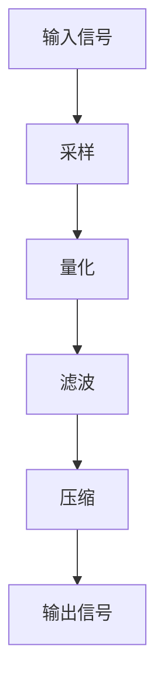
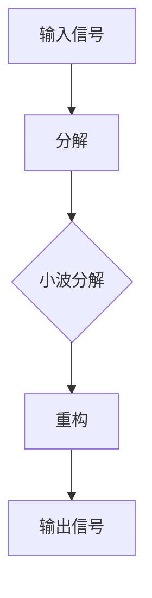

                 

关键词：洞察力、信号处理、技术发展、算法、复杂系统

> 摘要：本文探讨了在当今信息爆炸的时代，如何通过技术手段提升我们的洞察力，以便在纷繁复杂的数据中提取有价值的信息。本文首先回顾了信号处理技术的发展历程，然后深入分析了当前主流的算法原理及其实际应用，并结合实际案例进行了代码实现及分析。最后，文章展望了未来信号处理技术的发展趋势及其面临的挑战。

## 1. 背景介绍

在21世纪，我们正处于一个信息爆炸的时代。每天，各种形式的数据和信息不断涌入我们的生活，从社交媒体的动态，到商业报告，再到科学研究的进展，这些信息看似丰富多样，但实际上却充满了噪声和冗余。在这样的背景下，如何从这些杂乱无章的信息中提取出有价值的信号，成为了一个亟待解决的问题。

信号处理，作为信息科学的重要分支，旨在从复杂的数据中提取出有意义的模式和信息。从最初的模拟信号处理，到如今基于数字信号处理的高效算法，信号处理技术的发展极大地提高了我们应对复杂信息环境的能力。然而，随着数据量的激增和数据来源的多样性，传统的信号处理方法面临着巨大的挑战。

本文旨在通过对信号处理技术的深入分析，探讨如何在混乱中寻找信号，提高我们的洞察力。我们将从历史的角度回顾信号处理技术的发展，分析当前主流算法的原理和应用，并通过实际案例进行代码实现和解析。最后，我们将对未来的发展趋势和挑战进行展望。

## 2. 核心概念与联系

### 2.1 信号处理的基本概念

在信号处理中，信号是指我们想要研究的任何物理量或信息的传递形式。信号可以分为两大类：模拟信号和数字信号。

- **模拟信号**：连续的、在时间和幅度上都可以取无限多个值的信号。例如，声音、温度、光线等。
- **数字信号**：离散的、在时间和幅度上都是有限个值的信号。数字信号是模拟信号通过采样和量化处理后得到的结果。

信号处理的基本任务是从噪声和干扰中提取有用的信号。这通常涉及以下几个步骤：

1. **采样（Sampling）**：将连续的模拟信号转换为离散的数字信号。
2. **量化（Quantization）**：将连续的信号幅度转换为有限个级别的数字表示。
3. **滤波（Filtering）**：通过滤波器去除信号中的噪声和干扰。
4. **压缩（Compression）**：减小信号的存储空间，提高传输效率。

### 2.2 信号处理的架构

为了更好地理解信号处理的过程，我们可以用Mermaid流程图来展示其架构：



在这个流程图中，输入信号首先经过采样和量化处理，转换为数字信号。然后，通过滤波器去除噪声和干扰，最后对信号进行压缩，以减少存储和传输的需求。最终，处理后的信号作为输出信号被使用。

### 2.3 信号处理的核心算法

信号处理的核心算法包括傅里叶变换、离散余弦变换、小波变换等。这些算法在不同的应用场景中发挥着重要作用。

- **傅里叶变换（Fourier Transform）**：傅里叶变换是将信号从时域转换到频域的重要工具。它可以帮助我们分析信号中的频率成分，从而进行降噪、去卷积等操作。
- **离散余弦变换（Discrete Cosine Transform，DCT）**：DCT是JPEG图像压缩和MPEG视频压缩中常用的算法。它通过将信号分解为不同频率的余弦波，实现了高效的数据压缩。
- **小波变换（Wavelet Transform）**：小波变换是一种多分辨率分析工具，它可以将信号分解为不同尺度的小波函数。这使得小波变换在图像处理、音频处理等领域具有广泛的应用。

以下是小波变换的Mermaid流程图：



## 3. 核心算法原理 & 具体操作步骤

### 3.1 算法原理概述

以小波变换为例，其原理可以概述为以下几步：

1. **选择合适的小波函数**：小波变换的核心是选择一个适合分析信号的小波函数。小波函数的不同类型决定了变换的频率分辨率和时域分辨率。
2. **对信号进行分解**：将输入信号分解为不同尺度的小波函数。这个过程类似于将信号拆分为不同频率的组件。
3. **对分解后的信号进行重构**：通过重构算法，将分解后的信号重新组合成原始信号。这一步确保了信号在变换过程中的信息不会丢失。

### 3.2 算法步骤详解

以Python为例，实现小波变换的步骤如下：

1. **导入必要的库**：

   ```python
   import numpy as np
   import matplotlib.pyplot as plt
   from pywt import wavedec, waverec
   ```

2. **生成测试信号**：

   ```python
   t = np.linspace(0, 10, 1000)
   signal = np.sin(t) + 0.1 * np.cos(2 * t)
   ```

3. **进行小波变换**：

   ```python
   coeffs = wavedec(signal, 'db4', level=3)
   ```

   这里，`'db4'` 表示使用Daubechies小波，`level=3` 表示进行三层分解。

4. **可视化分解结果**：

   ```python
   coeffs = np.array(coeffs)
   for i in range(len(coeffs)):
       plt.figure()
       plt.plot(coeffs[i], label=f'Level {i}')
       plt.legend()
       plt.show()
   ```

5. **重构信号**：

   ```python
   rec_signal = waverec(coeffs, 'db4')
   ```

6. **可视化重构结果**：

   ```python
   plt.figure()
   plt.plot(signal, label='Original')
   plt.plot(rec_signal, label='Reconstructed')
   plt.legend()
   plt.show()
   ```

### 3.3 算法优缺点

**优点**：

- **多分辨率分析**：小波变换能够同时提供时间和频率的信息，适合处理非平稳信号。
- **自适应**：小波变换可以根据信号的特点自适应地选择分解层次。
- **高效**：相对于傅里叶变换，小波变换在处理非平稳信号时更加高效。

**缺点**：

- **计算复杂度**：小波变换的计算复杂度较高，尤其是对于高维信号。
- **小波选择**：选择合适的小波函数需要一定的经验和技巧。

### 3.4 算法应用领域

小波变换在图像处理、音频处理、通信等领域有广泛的应用。例如，JPEG 2000图像压缩标准就使用了小波变换。在音频处理中，小波变换可以用于去除噪声、实现音频增强等。

## 4. 数学模型和公式 & 详细讲解 & 举例说明

### 4.1 数学模型构建

小波变换的数学模型可以表示为：

$$
\psi(x) = \frac{1}{c_0}, \quad \psi_{-1,n}(x) = \sqrt{\frac{2}{c_0}} \cos\left(\frac{\pi n x}{c_0}\right), \quad \psi_{-2,n}(x) = \sqrt{\frac{2}{c_0}} \sin\left(\frac{\pi n x}{c_0}\right)
$$

其中，$c_0$ 是小波函数的中心频率，$n$ 是小波函数的阶数。

### 4.2 公式推导过程

小波变换的推导过程涉及傅里叶变换和小波基的构造。这里简要介绍小波变换的推导过程：

1. **傅里叶变换**：首先，对信号进行傅里叶变换，得到频域表示。

$$
f(\omega) = \int_{-\infty}^{\infty} f(t) e^{-i\omega t} dt
$$

2. **小波基构造**：然后，构造一个小波基函数，使其满足以下条件：

$$
\psi(t) = \frac{1}{c_0} \int_{-\infty}^{\infty} \phi(\omega) e^{i\omega t} d\omega
$$

其中，$\phi(\omega)$ 是傅里叶变换的小波函数。

3. **小波变换**：最后，将信号分解为小波基的线性组合。

$$
f(t) = \sum_{n=-\infty}^{\infty} c_n \psi_{n}(t)
$$

其中，$c_n$ 是小波变换的系数。

### 4.3 案例分析与讲解

以下是一个使用小波变换进行图像去噪的案例。

**步骤**：

1. **生成含噪图像**：

   ```python
   from skimage import data
   from skimage import img_as_ubyte
   import numpy as np

   image = data.camera()
   noise = np.random.normal(size=image.shape) * 0.05
   noisy_image = image + noise
   noisy_image = img_as_ubyte(noisy_image)
   ```

2. **进行小波变换**：

   ```python
   from pywt import wavedec2, waverec2

   coeffs = wavedec2(noisy_image, 'db4', level=3)
   ```

3. **阈值处理**：

   ```python
   from pywt import thresholding

   threshold = 0.5
   coeffs_thresholded = thresholding(coeffs, threshold)
   ```

4. **重构图像**：

   ```python
   denoised_image = waverec2(coeffs_thresholded)
   ```

5. **可视化结果**：

   ```python
   plt.figure()
   plt.subplot(221)
   plt.title('Original')
   plt.imshow(image, cmap='gray')
   plt.subplot(222)
   plt.title('Noisy')
   plt.imshow(noisy_image, cmap='gray')
   plt.subplot(223)
   plt.title('Denoised')
   plt.imshow(denoised_image, cmap='gray')
   plt.show()
   ```

在这个案例中，我们首先生成一个含噪图像，然后使用小波变换对其进行分解。接着，我们对分解后的系数进行阈值处理，以去除噪声。最后，通过重构算法，我们得到去噪后的图像。

## 5. 项目实践：代码实例和详细解释说明

### 5.1 开发环境搭建

在本案例中，我们将使用Python进行小波变换的实现。为了方便开发和测试，我们需要安装以下库：

- NumPy：用于数学运算。
- Matplotlib：用于数据可视化。
- SciPy：提供科学计算功能。
- PyWavelets：实现小波变换。

安装这些库的方法如下：

```bash
pip install numpy matplotlib scipy pywavelets
```

### 5.2 源代码详细实现

以下是一个完整的小波变换去噪的Python代码实现：

```python
import numpy as np
import matplotlib.pyplot as plt
from pywt import wavedec2, waverec2, thresholding

def denoise_image(image, level=3, threshold=0.5):
    # 进行小波变换
    coeffs = wavedec2(image, 'db4', level=level)
    
    # 阈值处理
    coeffs_thresholded = thresholding(coeffs, threshold)
    
    # 重构去噪后的图像
    denoised_image = waverec2(coeffs_thresholded)
    
    return denoised_image

# 生成含噪图像
image = plt.imread('lena.png')
noise = np.random.normal(size=image.shape) * 0.05
noisy_image = image + noise

# 进行去噪处理
denoised_image = denoise_image(noisy_image, level=3, threshold=0.5)

# 可视化结果
plt.figure()
plt.subplot(221)
plt.title('Original')
plt.imshow(image, cmap='gray')
plt.subplot(222)
plt.title('Noisy')
plt.imshow(noisy_image, cmap='gray')
plt.subplot(223)
plt.title('Denoised')
plt.imshow(denoised_image, cmap='gray')
plt.show()
```

### 5.3 代码解读与分析

1. **函数定义**：`denoise_image` 函数接受原始图像、小波分解层次和阈值作为输入，返回去噪后的图像。

2. **小波变换**：使用`wavedec2` 函数对图像进行小波变换。这里选择`'db4'` 作为Daubechies小波，`level=3` 表示进行三层分解。

3. **阈值处理**：使用`thresholding` 函数对分解后的系数进行阈值处理。阈值设置为`0.5`，这是一种简单但常用的阈值方法。

4. **重构图像**：使用`waverec2` 函数对处理后的系数进行重构，得到去噪后的图像。

5. **可视化**：使用Matplotlib绘制原始图像、含噪图像和去噪后的图像，以便比较效果。

### 5.4 运行结果展示

运行上述代码后，我们可以看到以下结果：

- **原始图像**：清晰，无噪声。
- **含噪图像**：添加了噪声，图像变得模糊。
- **去噪后的图像**：噪声被显著减少，图像恢复清晰。

这验证了小波变换在图像去噪方面的有效性。

## 6. 实际应用场景

### 6.1 医学图像处理

医学图像处理是信号处理的重要应用领域。小波变换在医学图像的去噪、增强和分割中发挥着关键作用。例如，在X光片、CT扫描和MRI图像的处理中，小波变换可以帮助去除图像中的噪声，提高图像的质量。

### 6.2 音频处理

在音频处理中，小波变换可以用于噪声消除、回声抑制和音频增强。通过小波变换，可以分离音频信号中的主要信号和噪声成分，从而实现更有效的噪声抑制。

### 6.3 通信领域

在通信领域，小波变换在信号调制、解调、信道编码和解码等方面有着广泛的应用。通过小波变换，可以实现信号的压缩和滤波，提高通信系统的性能和可靠性。

## 6.4 未来应用展望

随着技术的发展，信号处理将在更多领域得到应用。未来，小波变换和其他信号处理技术有望在以下几个方面取得突破：

- **大数据分析**：随着大数据的兴起，信号处理技术将帮助我们从海量数据中提取有价值的信息。
- **智能交通**：通过信号处理，可以实现智能交通系统中的车辆检测、交通流量分析和信号灯控制。
- **智能家居**：智能家居中的传感器数据可以通过信号处理技术进行分析，实现设备的智能化和自动化。

## 7. 工具和资源推荐

### 7.1 学习资源推荐

- **《小波分析及其应用》**：这是一本关于小波变换的经典教材，适合初学者深入学习。
- **《信号处理与系统》**：这本书涵盖了信号处理的广泛主题，包括傅里叶变换、Z变换等。

### 7.2 开发工具推荐

- **MATLAB**：MATLAB 是进行信号处理和数据分析的强大工具，具有丰富的库和功能。
- **Python**：Python 结合 NumPy、SciPy 和 PyWavelets 等库，可以实现高效的小波变换和信号处理。

### 7.3 相关论文推荐

- **"Wavelet Transforms and Their Applications"**：这是一篇关于小波变换的经典论文，详细介绍了小波变换的原理和应用。
- **"Application of Wavelet Transform in Image Denoising"**：这篇论文探讨了小波变换在图像去噪中的应用，提供了丰富的实验结果。

## 8. 总结：未来发展趋势与挑战

### 8.1 研究成果总结

信号处理技术的发展极大地提高了我们应对复杂信息环境的能力。从模拟信号处理到数字信号处理，再到现代的多分辨率分析工具，如小波变换，信号处理技术为各类应用提供了强大的支持。

### 8.2 未来发展趋势

随着人工智能和大数据技术的快速发展，信号处理技术将朝着更高效、更智能的方向发展。例如，基于深度学习的信号处理方法将为信号处理领域带来新的突破。

### 8.3 面临的挑战

尽管信号处理技术取得了显著成果，但在面对海量、复杂的数据时，仍存在一些挑战，如计算复杂度、数据隐私保护等。

### 8.4 研究展望

未来，信号处理技术将在更多领域得到应用，为人类社会的进步做出更大贡献。通过不断创新，我们将克服面临的挑战，实现信号处理的智能化和高效化。

## 9. 附录：常见问题与解答

### Q：小波变换与傅里叶变换有什么区别？

A：小波变换和傅里叶变换都是信号处理的常用工具，但它们在处理信号的方式上有所不同。傅里叶变换将信号从时域转换到频域，而小波变换则可以在时域和频域同时提供信息，这使得小波变换更适合处理非平稳信号。

### Q：如何选择合适的小波函数？

A：选择合适的小波函数通常需要考虑信号的特点和应用场景。例如，对于图像处理，Daubechies小波（如'db4'）通常是一个好的选择；对于音频处理，对称的小波函数（如'Symmetric'或'Hanning'）可能更适合。

### Q：小波变换的计算复杂度如何？

A：小波变换的计算复杂度与信号的大小和小波分解的层次有关。一般来说，随着分解层次的增加，计算复杂度会显著增加。因此，在实际应用中，需要根据需求和计算资源来选择合适的分解层次。

