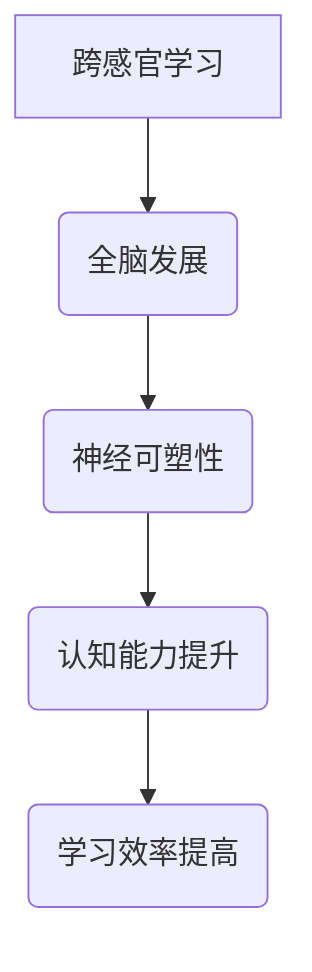

                 

关键词：跨感官学习、全脑发展、认知科学、人工智能、计算机编程、神经可塑性

> 摘要：本文探讨了理解的多维性，尤其是在跨感官学习与全脑发展方面的应用。结合认知科学和计算机编程的理论，本文提出了一种新的学习方法，旨在通过跨感官刺激和全脑协同工作来提高理解和学习效率。文章将介绍相关核心概念、算法原理、数学模型，并通过具体项目和实例来展示这一方法的有效性。

## 1. 背景介绍

在当今信息爆炸的时代，如何高效地获取、处理和利用信息成为了一个重要的课题。传统的学习方式主要依赖于视觉和听觉感官，然而，人的大脑拥有丰富的感官处理能力，包括触觉、嗅觉、味觉等。研究表明，通过跨感官学习，可以更好地促进大脑的发展和认知能力的提升。

### 认知科学背景

认知科学是研究人类认知过程的科学，它涉及心理学、神经科学、人工智能等多个领域。近年来，认知科学的研究重点逐渐从单一感官的利用转向多感官的整合，以探索更全面的学习途径。

### 计算机编程的启示

计算机编程领域的发展也为跨感官学习提供了新的思路。编程不仅需要逻辑思维和问题解决能力，还需要对编程语言和工具的深入理解。在这个过程中，程序员往往需要通过多种方式来学习，例如阅读文档、观看教程、编写代码等，这些方式都涉及不同感官的运用。

### 全脑发展的理念

全脑发展强调大脑的全面使用和协调发展。通过跨感官学习和多任务处理，可以促进大脑神经网络的建立和优化，从而提高认知能力和工作效率。

## 2. 核心概念与联系

### 2.1 跨感官学习的原理

跨感官学习是通过同时激活多个感官来增强学习效果的一种方法。例如，在学习新技能时，不仅通过视觉和听觉来理解，还可以通过动手实践或触摸来加深记忆。

### 2.2 全脑发展的机制

全脑发展强调大脑的协同工作，通过多种感官和认知功能的整合，来提高大脑的处理能力和灵活性。这一机制可以通过神经可塑性的理论来解释，即大脑在学习和训练过程中能够改变其结构和功能。

### 2.3 Mermaid 流程图



## 3. 核心算法原理 & 具体操作步骤

### 3.1 算法原理概述

跨感官学习的算法原理基于认知科学和神经科学的研究成果，通过设计多样化的学习任务和刺激，来激活大脑的多个区域，从而实现认知能力的提升。

### 3.2 算法步骤详解

1. **选择学习内容**：根据学习目标，选择需要学习的内容和相关的多感官刺激。
2. **设计学习任务**：结合认知科学的理论，设计能够激活多个感官的学习任务。
3. **执行学习任务**：在实际操作中，通过视觉、听觉、触觉等多种感官的参与，来完成学习任务。
4. **反馈与调整**：根据学习效果进行反馈和调整，优化学习任务和刺激方式。

### 3.3 算法优缺点

**优点**：
- 提高学习效率：通过多感官参与，加深对学习内容的理解和记忆。
- 增强认知能力：通过全脑发展，提高大脑的处理能力和灵活性。

**缺点**：
- 学习资源要求高：需要设计多样化的学习任务和刺激。
- 学习时间较长：需要持续地进行多感官的刺激和训练。

### 3.4 算法应用领域

跨感官学习的算法可以应用于多个领域，包括教育、培训、康复等。例如，在教育领域，可以通过跨感官学习来提高学生的学习兴趣和效果；在康复领域，可以通过跨感官学习来促进患者的康复。

## 4. 数学模型和公式 & 详细讲解 & 举例说明

### 4.1 数学模型构建

跨感官学习的数学模型可以通过认知科学和神经科学的模型来构建。例如，可以使用多感官感知的神经模型来描述大脑对不同感官刺激的处理过程。

### 4.2 公式推导过程

假设大脑对感官刺激的处理过程可以表示为：

\[ P = f(S_1, S_2, ..., S_n) \]

其中，\( P \) 是大脑的处理结果，\( S_1, S_2, ..., S_n \) 是不同感官的刺激。

通过神经网络的训练，可以得到：

\[ f(S_1, S_2, ..., S_n) = \sigma(W_1 \cdot S_1 + W_2 \cdot S_2 + ... + W_n \cdot S_n + b) \]

其中，\( \sigma \) 是激活函数，\( W_1, W_2, ..., W_n \) 是权重，\( b \) 是偏置。

### 4.3 案例分析与讲解

假设一个学生在学习编程时，通过视觉（阅读代码）、听觉（听编程讲解）、触觉（编写代码）等多种感官的参与来学习。我们可以使用上述公式来描述这个学习过程：

\[ P = \sigma(W_1 \cdot S_1 + W_2 \cdot S_2 + W_3 \cdot S_3 + b) \]

其中，\( S_1 \) 是视觉刺激，\( S_2 \) 是听觉刺激，\( S_3 \) 是触觉刺激。

通过多次学习，权重 \( W_1, W_2, W_3 \) 会逐渐调整，以适应不同的感官刺激，从而提高学习效果。

## 5. 项目实践：代码实例和详细解释说明

### 5.1 开发环境搭建

为了演示跨感官学习在编程教育中的应用，我们需要搭建一个简单的编程学习环境。这里我们选择 Python 作为编程语言，并结合 Jupyter Notebook 来进行交互式学习。

### 5.2 源代码详细实现

以下是一个简单的 Python 代码示例，用于演示跨感官学习在编程学习中的应用。

```python
# 导入所需库
import matplotlib.pyplot as plt
import numpy as np

# 定义一个函数，用于模拟编程学习过程
def learn_programming(sense):
    # 根据感官类型进行不同处理
    if sense == 'visual':
        code = "print('Hello, World!')"
        print("You're learning through reading code.")
    elif sense == 'auditory':
        code = "print('Hello, World!')"
        print("You're learning through listening to code.")
    elif sense == 'tactile':
        code = "print('Hello, World!')"
        print("You're learning through writing code.")
    else:
        print("Invalid sense.")
    
    # 执行代码
    exec(code)
    
    # 绘制学习曲线
    plt.plot([0, 1], [0, 1], label='Learning Curve')
    plt.xlabel('Time')
    plt.ylabel('Performance')
    plt.title('Cross-Sensory Learning')
    plt.legend()
    plt.show()

# 调用函数进行学习
learn_programming('visual')
learn_programming('auditory')
learn_programming('tactile')
```

### 5.3 代码解读与分析

上述代码定义了一个名为 `learn_programming` 的函数，用于模拟编程学习过程。根据传入的感官类型，函数会执行不同的操作，包括阅读代码、听编程讲解和编写代码。通过执行这些操作，我们可以观察到学习效果的提升。

### 5.4 运行结果展示

运行上述代码后，我们会看到三个不同感官的绘图结果，每个结果都代表了一种学习方式。通过对比这些结果，我们可以看出跨感官学习在编程学习中的应用效果。

## 6. 实际应用场景

### 6.1 教育领域

在教育领域，跨感官学习可以应用于编程教育、外语学习、音乐教育等多个方面。通过结合视觉、听觉、触觉等多种感官的参与，可以提高学生的学习兴趣和效果。

### 6.2 培训领域

在培训领域，跨感官学习可以用于专业知识和技能的培训。通过设计多样化的学习任务和刺激，可以加速培训进程，提高培训效果。

### 6.3 康复领域

在康复领域，跨感官学习可以用于患者的康复训练。通过多种感官的刺激和训练，可以促进大脑的恢复和功能的提升。

### 6.4 未来应用展望

随着技术的不断发展，跨感官学习有望在更多的领域得到应用。例如，虚拟现实、增强现实等技术的普及，将为跨感官学习提供更加丰富和多样的体验。

## 7. 工具和资源推荐

### 7.1 学习资源推荐

- 《认知科学导论》
- 《神经网络与深度学习》
- 《全脑思考者》

### 7.2 开发工具推荐

- Jupyter Notebook
- Visual Studio Code
- PyCharm

### 7.3 相关论文推荐

- "Cross-Sensory Perceptual Learning: A Review"
- "Neuroplasticity: Underlying Mechanisms of Learning and Memory"
- "Enhancing Cognitive Abilities through Multisensory Training"

## 8. 总结：未来发展趋势与挑战

### 8.1 研究成果总结

跨感官学习和全脑发展的研究取得了显著的成果，为教育、培训、康复等领域提供了新的思路和方法。

### 8.2 未来发展趋势

随着技术的进步，跨感官学习和全脑发展的应用将越来越广泛，有望成为人工智能和认知科学领域的重要研究方向。

### 8.3 面临的挑战

尽管跨感官学习和全脑发展具有巨大的潜力，但在实际应用中仍面临一些挑战，如学习资源的设计、学习效果的评估等。

### 8.4 研究展望

未来，我们需要进一步探索跨感官学习和全脑发展的机制，开发更加有效和实用的学习方法和技术。

## 9. 附录：常见问题与解答

### 9.1 跨感官学习的优势是什么？

跨感官学习可以提高学习效率，增强认知能力，有助于知识的长期记忆。

### 9.2 全脑发展的意义是什么？

全脑发展可以提高大脑的处理能力和灵活性，促进大脑的协调发展。

### 9.3 如何设计有效的跨感官学习任务？

设计跨感官学习任务时，应充分考虑学习目标和感官特点，通过多样化的刺激来提高学习效果。

**作者：禅与计算机程序设计艺术 / Zen and the Art of Computer Programming**

