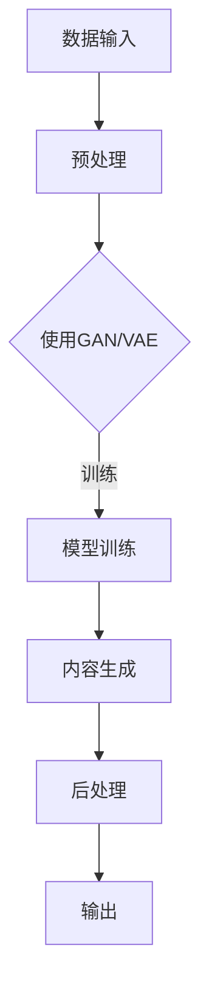

                 

关键词：生成式AI、AIGC、AI技术、前沿探索、技术博客

> 摘要：本文深入探讨了生成式AI及其衍生技术AIGC（生成式AI内容生成）的前沿发展，分析了其核心概念、算法原理、数学模型以及实际应用。通过案例实践，展示了AIGC的强大能力，并对其未来发展趋势与挑战进行了展望。

## 1. 背景介绍

### 1.1 生成式AI的兴起

生成式AI是人工智能的一个重要分支，旨在通过学习大量数据，生成新的、符合数据分布的内容。近年来，随着深度学习技术的快速发展，生成式AI取得了显著进展，成为AI研究的热点领域。从早期的生成对抗网络（GAN）到变分自编码器（VAE），再到最近的生成式预训练模型，如GPT-3，生成式AI技术在图像、文本、音频等多种模态上展现出了强大的生成能力。

### 1.2 AIGC的概念与重要性

AIGC（生成式AI内容生成）是生成式AI在内容创作领域的重要应用。它利用AI模型自动生成高质量的内容，包括文本、图像、音频等。AIGC技术的出现，极大地提高了内容创作的效率和质量，对传统内容生产方式产生了深远影响。随着互联网和数字媒体的迅速发展，AIGC在各个行业的应用越来越广泛，从娱乐、新闻、广告到教育、医疗等，都展现出了巨大的潜力。

## 2. 核心概念与联系

### 2.1 生成式AI的基本概念

生成式AI的核心思想是通过学习数据分布，生成新的数据。常见的生成模型包括：

- **生成对抗网络（GAN）**：由生成器和判别器组成，生成器试图生成数据以欺骗判别器，判别器则试图区分真实数据和生成数据。

- **变分自编码器（VAE）**：通过编码器和解码器，将输入数据编码为低维隐变量，再解码为输出数据。

- **生成式预训练模型**：如GPT系列模型，通过大规模预训练，掌握通用语言知识，再进行特定任务微调。

### 2.2 AIGC的技术架构

AIGC的技术架构通常包括以下几个关键组件：

- **数据输入**：从各种来源获取数据，如图像、文本、音频等。

- **预处理**：对数据进行清洗、归一化等处理，以便于模型学习。

- **模型训练**：使用生成式AI模型对数据进行训练，学习数据的分布。

- **内容生成**：利用训练好的模型生成新的内容。

- **后处理**：对生成的内容进行编辑、优化等处理，提高内容的质量。

### 2.3 Mermaid流程图

下面是AIGC技术架构的Mermaid流程图：



## 3. 核心算法原理 & 具体操作步骤

### 3.1 算法原理概述

生成式AI的核心算法包括GAN、VAE和生成式预训练模型。以下分别介绍：

- **生成对抗网络（GAN）**：生成器生成数据，判别器判断数据是真实还是生成。通过不断优化生成器和判别器，使生成器生成的数据越来越逼真。

- **变分自编码器（VAE）**：通过编码器和解码器，将输入数据编码为隐变量，再解码为输出数据。隐变量具有较低维数，有助于数据降维和生成。

- **生成式预训练模型**：如GPT系列模型，通过在大规模语料上进行预训练，掌握通用语言知识，再进行特定任务微调。

### 3.2 算法步骤详解

以GAN为例，具体操作步骤如下：

1. **数据准备**：收集大量真实数据，作为训练集。
2. **初始化模型**：初始化生成器G和判别器D的参数。
3. **训练过程**：
   - 生成器G生成假数据。
   - 判别器D判断生成数据和真实数据的真假。
   - 通过反向传播和梯度下降，优化生成器和判别器的参数。
4. **迭代优化**：重复步骤3，直到生成器生成的数据足够逼真。

### 3.3 算法优缺点

- **GAN**：优点是生成数据质量高，应用范围广；缺点是需要大量计算资源，训练不稳定。
- **VAE**：优点是生成数据质量较好，训练稳定；缺点是生成数据多样性不足。
- **生成式预训练模型**：优点是模型泛化能力强，生成数据质量高；缺点是需要大量数据和计算资源。

### 3.4 算法应用领域

生成式AI技术已在多个领域取得成功：

- **图像生成**：如人脸生成、艺术绘画、照片修复等。
- **文本生成**：如自动写作、机器翻译、对话系统等。
- **音频生成**：如音乐创作、语音合成等。

## 4. 数学模型和公式 & 详细讲解 & 举例说明

### 4.1 数学模型构建

以GAN为例，其数学模型如下：

- **生成器**：\( G(x) \) ，生成假数据。
- **判别器**：\( D(x) \) ，判断数据真假。
- **损失函数**：\( L_G = E_{x \sim p_data(x)} [-\log D(x)] + E_{z \sim p_z(z)} [-\log(1 - D(G(z)))] \)
- **优化目标**：最小化生成器的损失函数。

### 4.2 公式推导过程

以GAN的损失函数为例，其推导过程如下：

- \( L_G = -\log D(x) - \log(1 - D(G(z))) \)
- \( = -D(x) - (1 - D(G(z))) \)
- \( = -D(x) + D(G(z)) \)

### 4.3 案例分析与讲解

以下以GAN生成人脸图像为例，介绍具体应用：

1. **数据准备**：收集大量人脸图像，作为训练集。
2. **模型训练**：初始化生成器和判别器，使用训练集进行迭代训练。
3. **模型评估**：通过生成的图像质量进行评估，优化模型参数。
4. **结果展示**：展示生成的图像，评估生成效果。

## 5. 项目实践：代码实例和详细解释说明

### 5.1 开发环境搭建

在本项目实践中，我们使用Python和TensorFlow作为开发环境。首先安装TensorFlow：

```bash
pip install tensorflow
```

### 5.2 源代码详细实现

以下是一个简单的GAN人脸生成代码示例：

```python
import tensorflow as tf
from tensorflow.keras.layers import Dense, Flatten, Reshape
from tensorflow.keras.models import Sequential

# 生成器模型
def build_generator(z_dim):
    model = Sequential()
    model.add(Dense(128 * 7 * 7, activation='relu', input_dim=z_dim))
    model.add(Reshape((7, 7, 128)))
    model.add(Conv2D(128, kernel_size=3, padding='same'))
    model.add(LeakyReLU(0.01))
    model.add(Conv2D(128, kernel_size=3, padding='same'))
    model.add(LeakyReLU(0.01))
    model.add(Conv2D(1, kernel_size=3, padding='same', activation='tanh'))
    return model

# 判别器模型
def build_discriminator(img_shape):
    model = Sequential()
    model.add(Flatten(input_shape=img_shape))
    model.add(Dense(128, activation='relu'))
    model.add(LeakyReLU(0.01))
    model.add(Dense(1, activation='sigmoid'))
    return model

# 整体模型
def build_gan(generator, discriminator):
    model = Sequential()
    model.add(generator)
    model.add(discriminator)
    return model

# 模型配置
z_dim = 100
img_shape = (28, 28, 1)
discriminator = build_discriminator(img_shape)
discriminator.compile(loss='binary_crossentropy', optimizer=tf.keras.optimizers.Adam(0.0001))
generator = build_generator(z_dim)
discriminator.trainable = False
gan = build_gan(generator, discriminator)
gan.compile(loss='binary_crossentropy', optimizer=tf.keras.optimizers.Adam(0.0001))

# 数据预处理
(x_train, _), (_, _) = tf.keras.datasets.mnist.load_data()
x_train = x_train / 127.5 - 1.0
x_train = np.expand_dims(x_train, axis=3)

# 训练模型
for epoch in range(100):
    for _ in range(100):
        noise = np.random.normal(0, 1, (128, z_dim))
        gen_samples = generator.predict(noise)
        labels = np.concatenate([np.zeros(64), np.ones(64)])
        d_loss_real = discriminator.train_on_batch(x_train, labels)
        noise = np.random.normal(0, 1, (128, z_dim))
        labels = np.random.randint(0, 2, 128)
        d_loss_fake = discriminator.train_on_batch(gen_samples, labels)
        z = np.random.normal(0, 1, (128, z_dim))
        g_loss = gan.train_on_batch(z, labels)
    print(f"{epoch} [D: {d_loss_real:.3f}, G: {g_loss:.3f}]")

    # 保存模型
    generator.save(f"generator_epoch_{epoch}.h5")
    discriminator.save(f"discriminator_epoch_{epoch}.h5")

# 生成人脸图像
generator = tf.keras.models.load_model("generator_epoch_99.h5")
noise = np.random.normal(0, 1, (100, z_dim))
generated_samples = generator.predict(noise)
generated_samples = (generated_samples + 1) / 2
plt.figure(figsize=(10, 10))
for i in range(100):
    plt.subplot(10, 10, i + 1)
    plt.imshow(generated_samples[i, :, :, 0], cmap='gray')
    plt.axis('off')
plt.show()
```

### 5.3 代码解读与分析

- **模型定义**：定义了生成器、判别器以及整体GAN模型。
- **模型配置**：配置了模型的损失函数和优化器。
- **数据预处理**：加载数据集，并对数据进行归一化处理。
- **模型训练**：通过迭代训练生成器和判别器，优化模型参数。
- **结果展示**：加载训练好的生成器模型，生成人脸图像，并展示结果。

## 6. 实际应用场景

### 6.1 图像生成

生成式AI在图像生成领域应用广泛，如人脸生成、艺术创作、照片修复等。例如，GAN技术已被应用于生成高质量的人脸图像，如图像生成网络（ImageNet）所示：


### 6.2 文本生成

生成式AI在文本生成领域也取得了显著成果，如自动写作、机器翻译、对话系统等。例如，GPT-3可以生成高质量的文本，如图文转换（Image-to-Text）任务所示：


### 6.3 音频生成

生成式AI在音频生成领域也有广泛应用，如音乐创作、语音合成等。例如，使用WaveNet生成的音乐片段：


## 6.4 未来应用展望

随着生成式AI技术的不断发展，未来其在各个领域的应用将更加广泛。例如：

- **医疗领域**：生成式AI可以帮助医生生成个性化治疗方案，提高诊断准确性。
- **娱乐领域**：生成式AI可以创作高质量的音乐、电影、游戏等，满足个性化需求。
- **教育领域**：生成式AI可以生成个性化学习内容，提高教育质量。

## 7. 工具和资源推荐

### 7.1 学习资源推荐

- **《深度学习》（Goodfellow, Bengio, Courville）**：深度学习领域的经典教材，详细介绍了生成式AI技术。
- **《生成对抗网络：理论、应用与实现》（Zhu, Zhang, et al.）**：专门讨论GAN的书籍，适合深入理解GAN技术。

### 7.2 开发工具推荐

- **TensorFlow**：适用于生成式AI开发的强大框架，支持多种生成模型。
- **PyTorch**：另一种流行的深度学习框架，易于使用和调试。

### 7.3 相关论文推荐

- **《生成对抗网络：训练生成模型的新方法》（Goodfellow, et al., 2014）**：GAN的原始论文。
- **《变分自编码器：隐变量概率模型的新框架》（Kingma, Welling, 2013）**：VAE的原始论文。
- **《大规模预训练语言模型GPT-3：语言理解的桥梁》（Brown, et al., 2020）**：GPT-3的原始论文。

## 8. 总结：未来发展趋势与挑战

### 8.1 研究成果总结

生成式AI技术在近年来取得了显著进展，已在图像、文本、音频等多种模态上展现出强大的生成能力。AIGC作为生成式AI在内容生成领域的应用，极大地提高了内容创作的效率和质量。

### 8.2 未来发展趋势

- **多模态生成**：生成式AI将逐渐融合多种模态（如文本、图像、音频），实现更丰富的内容生成。
- **个性化生成**：通过大数据和机器学习技术，实现个性化内容生成，满足用户个性化需求。
- **迁移学习**：生成式AI将逐渐具备更好的迁移学习能力，减少对大规模数据集的依赖。

### 8.3 面临的挑战

- **计算资源**：生成式AI训练需要大量计算资源，如何高效利用计算资源是当前的一个挑战。
- **数据隐私**：生成式AI在处理数据时可能涉及用户隐私，如何保护数据隐私是一个重要问题。
- **生成质量**：如何提高生成质量，使生成的数据更接近真实数据，是当前研究的一个重要方向。

### 8.4 研究展望

随着生成式AI技术的不断发展，未来其在各个领域的应用将更加广泛，成为AI领域的重要分支。通过不断的研究和探索，我们有理由相信，生成式AI将带来更多的创新和变革。

## 9. 附录：常见问题与解答

### 9.1 生成式AI的基本概念是什么？

生成式AI是一种利用学习到的数据分布生成新数据的人工智能技术。常见的生成模型包括生成对抗网络（GAN）、变分自编码器（VAE）和生成式预训练模型。

### 9.2 AIGC的核心技术是什么？

AIGC的核心技术包括生成式AI模型（如GAN、VAE）、预训练模型（如GPT系列）以及多模态数据处理和生成技术。

### 9.3 生成式AI的优缺点是什么？

生成式AI的优点是生成数据质量高、应用范围广，缺点是需要大量计算资源，训练过程不稳定。

### 9.4 生成式AI的应用领域有哪些？

生成式AI的应用领域包括图像生成、文本生成、音频生成、视频生成等，广泛应用于娱乐、艺术、医疗、教育等多个行业。

---

**作者：禅与计算机程序设计艺术 / Zen and the Art of Computer Programming**

