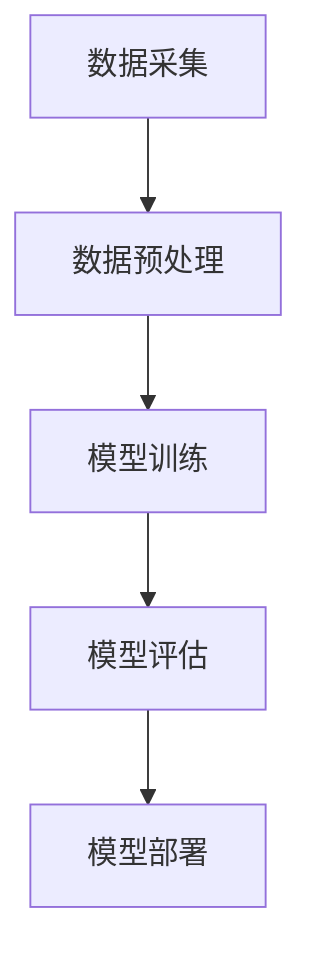

                 

关键词：生成式AI、AIGC、商业应用、深度学习、计算机视觉、自然语言处理、模型压缩、边缘计算

> 摘要：本文深入探讨了生成式AI（AIGC）技术在商业领域的应用前景，分析了其在图像生成、自然语言处理和自动内容生成等关键领域的最新进展。通过具体案例和实践，展示了AIGC技术如何助力企业提升效率、降低成本并创造新的商业价值。

## 1. 背景介绍

近年来，人工智能（AI）技术取得了显著的进展，特别是在生成式AI领域。生成式AI（Generative AI，简称AIGC）是一种能够生成新数据、内容或模式的AI技术，其核心思想是通过学习大量数据，生成与输入数据相似或全新的数据。AIGC技术在图像生成、自然语言处理和自动内容生成等方面具有广泛的应用潜力，成为当前AI研究的热点之一。

在商业领域，AIGC技术的应用不仅能够提高企业的生产效率和创新能力，还能降低运营成本，为企业带来新的商业模式和竞争优势。例如，图像生成技术可以用于产品设计、广告创意和娱乐内容生成；自然语言处理技术可以用于智能客服、内容审核和文案写作；自动内容生成技术可以用于新闻报道、电商推荐和社交媒体内容生成等。

## 2. 核心概念与联系

### 2.1 生成式AI的基本概念

生成式AI是一种基于概率模型的AI技术，旨在学习数据的概率分布，并生成与训练数据相似的新数据。其主要模型包括生成对抗网络（GAN）、变分自编码器（VAE）和自回归模型等。

- **生成对抗网络（GAN）**：GAN由生成器（Generator）和判别器（Discriminator）组成，生成器生成数据，判别器判断生成数据与真实数据之间的差异，通过优化生成器和判别器的参数，使得生成器生成的数据逐渐接近真实数据。
- **变分自编码器（VAE）**：VAE通过学习数据的概率分布，生成新的数据，其核心思想是构建一个编码器（Encoder）和解码器（Decoder），编码器将输入数据映射到一个潜在空间，解码器从潜在空间中生成新的数据。
- **自回归模型**：自回归模型通过学习数据的前后关系，生成新的数据，常用于序列数据的生成，如文本、语音和视频等。

### 2.2 生成式AI的技术架构

生成式AI的技术架构主要包括数据采集、数据预处理、模型训练、模型评估和模型部署等步骤。

- **数据采集**：收集大量相关的数据，用于模型训练。
- **数据预处理**：对采集到的数据进行清洗、归一化和分割等处理，以提升模型的训练效果。
- **模型训练**：利用收集到的数据训练生成模型，使其能够生成与输入数据相似的新数据。
- **模型评估**：通过评估指标（如准确率、召回率等）评估模型的性能。
- **模型部署**：将训练好的模型部署到实际应用场景中，如服务器、边缘设备等。

### 2.3 生成式AI的Mermaid流程图



## 3. 核心算法原理 & 具体操作步骤

### 3.1 算法原理概述

生成式AI的核心算法包括生成对抗网络（GAN）、变分自编码器（VAE）和自回归模型等。以下分别介绍这些算法的基本原理。

- **生成对抗网络（GAN）**：GAN由生成器和判别器组成，生成器生成数据，判别器判断生成数据与真实数据之间的差异，通过优化生成器和判别器的参数，使得生成器生成的数据逐渐接近真实数据。
- **变分自编码器（VAE）**：VAE通过学习数据的概率分布，生成新的数据，其核心思想是构建一个编码器（Encoder）和解码器（Decoder），编码器将输入数据映射到一个潜在空间，解码器从潜在空间中生成新的数据。
- **自回归模型**：自回归模型通过学习数据的前后关系，生成新的数据，常用于序列数据的生成，如文本、语音和视频等。

### 3.2 算法步骤详解

以下以生成对抗网络（GAN）为例，详细介绍其具体操作步骤。

#### 3.2.1 数据采集

收集大量相关的数据，用于模型训练。数据可以来源于公开数据集、企业内部数据或第三方数据提供商。

#### 3.2.2 数据预处理

对采集到的数据进行清洗、归一化和分割等处理，以提升模型的训练效果。

- **清洗**：去除数据中的噪声和异常值。
- **归一化**：将数据缩放到相同的范围，如[0, 1]。
- **分割**：将数据分为训练集、验证集和测试集。

#### 3.2.3 模型训练

利用收集到的数据训练生成模型，使其能够生成与输入数据相似的新数据。具体步骤如下：

1. 初始化生成器和判别器的参数。
2. 在训练过程中，交替更新生成器和判别器的参数。
3. 对于每批数据，生成器生成新数据，判别器判断生成数据与真实数据之间的差异。
4. 通过反向传播和梯度下降优化生成器和判别器的参数。

#### 3.2.4 模型评估

通过评估指标（如准确率、召回率等）评估模型的性能。常用的评估指标包括：

- **准确率**：预测为正类的样本中，实际为正类的比例。
- **召回率**：实际为正类的样本中，预测为正类的比例。
- **F1值**：准确率和召回率的调和平均值。

#### 3.2.5 模型部署

将训练好的模型部署到实际应用场景中，如服务器、边缘设备等。

### 3.3 算法优缺点

#### 优点：

- **强大的生成能力**：生成式AI能够生成高质量、多样化的新数据。
- **自适应能力**：通过学习大量数据，生成式AI能够适应不同的数据分布。
- **灵活性**：生成式AI可以应用于各种数据类型和任务场景。

#### 缺点：

- **训练难度大**：生成式AI的训练过程复杂，需要大量的计算资源和时间。
- **模型解释性差**：生成式AI的模型通常难以解释，增加了模型调试和优化的难度。
- **数据依赖性强**：生成式AI的生成能力高度依赖于训练数据，数据质量和数量对模型效果有重要影响。

### 3.4 算法应用领域

生成式AI在多个领域具有广泛的应用，包括但不限于：

- **图像生成**：用于图像修复、图像合成、图像风格迁移等。
- **自然语言处理**：用于文本生成、机器翻译、情感分析等。
- **自动内容生成**：用于新闻写作、商品推荐、社交媒体内容生成等。
- **医学图像处理**：用于医学图像分割、疾病预测等。
- **娱乐内容创作**：用于音乐生成、视频编辑、游戏开发等。

## 4. 数学模型和公式 & 详细讲解 & 举例说明

### 4.1 数学模型构建

生成式AI的数学模型主要包括生成模型和判别模型。以下以生成对抗网络（GAN）为例，介绍其数学模型。

#### 4.1.1 生成模型

生成模型的目的是生成与真实数据相似的新数据。在GAN中，生成模型由生成器（Generator）构成，其输入为随机噪声向量 $z$，输出为生成数据 $G(z)$。生成模型通常采用神经网络结构，如卷积神经网络（CNN）。

生成模型的目标是最小化生成数据与真实数据之间的差异，即：

$$
L_G = \mathbb{E}_{z \sim p_z(z)}[-\log(D(G(z))]
$$

其中，$p_z(z)$ 是噪声分布，$D(\cdot)$ 是判别模型。

#### 4.1.2 判别模型

判别模型的目的是判断输入数据是真实数据还是生成数据。在GAN中，判别模型由判别器（Discriminator）构成，其输入为数据 $x$，输出为概率 $D(x)$，表示输入数据为真实数据的概率。

判别模型的目标是最小化判别误差，即：

$$
L_D = -\mathbb{E}_{x \sim p_{data}(x)}[\log(D(x))] - \mathbb{E}_{z \sim p_z(z)}[\log(1 - D(G(z))]
$$

其中，$p_{data}(x)$ 是真实数据分布。

#### 4.1.3 GAN总体目标函数

GAN的总目标是最小化生成模型和判别模型的损失函数之和，即：

$$
L_{GAN} = L_G + L_D
$$

### 4.2 公式推导过程

生成式AI的公式推导过程主要涉及生成模型和判别模型的损失函数。以下以生成对抗网络（GAN）为例，介绍其公式推导过程。

#### 4.2.1 生成模型的损失函数

生成模型的损失函数为：

$$
L_G = \mathbb{E}_{z \sim p_z(z)}[-\log(D(G(z))]
$$

其中，$p_z(z)$ 是噪声分布，$D(G(z))$ 是判别模型对生成数据的判断概率。

对损失函数求导，得到：

$$
\frac{\partial L_G}{\partial G} = -\frac{\partial}{\partial G} \mathbb{E}_{z \sim p_z(z)}[\log(D(G(z))]
$$

由于 $D(G(z))$ 是生成器的参数，对其求导得到：

$$
\frac{\partial L_G}{\partial G} = -\mathbb{E}_{z \sim p_z(z)}[\frac{1}{D(G(z))}] \cdot \frac{\partial G}{\partial G}
$$

由于生成器的梯度等于损失函数对生成器的梯度，因此：

$$
\frac{\partial L_G}{\partial G} = -\mathbb{E}_{z \sim p_z(z)}[\frac{1}{D(G(z))}] \cdot \frac{\partial G}{\partial G} \approx -\frac{1}{D(G(z))} \cdot \frac{\partial G}{\partial G}
$$

#### 4.2.2 判别模型的损失函数

判别模型的损失函数为：

$$
L_D = -\mathbb{E}_{x \sim p_{data}(x)}[\log(D(x))] - \mathbb{E}_{z \sim p_z(z)}[\log(1 - D(G(z))]
$$

其中，$p_{data}(x)$ 是真实数据分布，$D(G(z))$ 是判别模型对生成数据的判断概率。

对损失函数求导，得到：

$$
\frac{\partial L_D}{\partial D} = -\frac{\partial}{\partial D} \mathbb{E}_{x \sim p_{data}(x)}[\log(D(x))] - \frac{\partial}{\partial D} \mathbb{E}_{z \sim p_z(z)}[\log(1 - D(G(z))]
$$

由于 $D(x)$ 和 $D(G(z))$ 是判别模型的参数，对其求导得到：

$$
\frac{\partial L_D}{\partial D} = -\mathbb{E}_{x \sim p_{data}(x)}[\frac{1}{D(x)}] - \mathbb{E}_{z \sim p_z(z)}[\frac{1}{1 - D(G(z))}]
$$

### 4.3 案例分析与讲解

#### 4.3.1 图像生成

使用生成对抗网络（GAN）生成图像是一个经典的案例。以下是一个简化的图像生成案例。

1. **数据采集**：收集大量的图像数据，用于模型训练。

2. **数据预处理**：对图像数据进行归一化处理，使其在[0, 1]范围内。

3. **模型训练**：训练生成器和判别器，优化模型参数。

4. **图像生成**：使用训练好的生成器生成新图像。

具体实现过程如下：

1. 初始化生成器和判别器的参数。
2. 在训练过程中，交替更新生成器和判别器的参数。
3. 对于每批图像数据，生成器生成新图像，判别器判断生成图像与真实图像之间的差异。
4. 通过反向传播和梯度下降优化生成器和判别器的参数。
5. 使用生成器生成新图像，展示生成结果。

#### 4.3.2 文本生成

使用生成式AI生成文本也是一个常见的案例。以下是一个简化的文本生成案例。

1. **数据采集**：收集大量的文本数据，用于模型训练。

2. **数据预处理**：对文本数据进行分词、去停用词等处理。

3. **模型训练**：训练生成器，优化模型参数。

4. **文本生成**：使用训练好的生成器生成新文本。

具体实现过程如下：

1. 初始化生成器的参数。
2. 在训练过程中，优化生成器的参数。
3. 对于每批文本数据，生成器生成新文本。
4. 通过反向传播和梯度下降优化生成器的参数。
5. 使用生成器生成新文本，展示生成结果。

## 5. 项目实践：代码实例和详细解释说明

### 5.1 开发环境搭建

为了实现生成式AI模型，需要搭建一个适合的开发环境。以下是一个基本的开发环境搭建过程。

1. 安装Python 3.8及以上版本。
2. 安装TensorFlow 2.x版本。
3. 安装必要的库，如numpy、pandas、matplotlib等。

### 5.2 源代码详细实现

以下是一个基于生成对抗网络（GAN）的图像生成项目的源代码示例。

```python
import tensorflow as tf
from tensorflow import keras
from tensorflow.keras import layers

# 生成器模型
def generator_model():
    model = keras.Sequential()
    model.add(layers.Dense(128, activation='relu', input_shape=(100,)))
    model.add(layers.Dense(256, activation='relu'))
    model.add(layers.Dense(512, activation='relu'))
    model.add(layers.Dense(1024, activation='relu'))
    model.add(layers.Dense(128 * 7 * 7, activation='relu'))
    model.add(layers.Reshape((7, 7, 128)))
    model.add(layers.Conv2DTranspose(64, (5, 5), strides=(1, 1), padding='same', activation='relu'))
    model.add(layers.Conv2DTranspose(1, (5, 5), strides=(1, 1), padding='same', activation='tanh'))
    return model

# 判别器模型
def discriminator_model():
    model = keras.Sequential()
    model.add(layers.Conv2D(64, (5, 5), strides=(1, 1), padding='same', input_shape=(28, 28, 1)))
    model.add(layers.LeakyReLU(alpha=0.01))
    model.add(layers.Dropout(0.3))
    model.add(layers.Conv2D(64, (5, 5), strides=(2, 2), padding='same'))
    model.add(layers.LeakyReLU(alpha=0.01))
    model.add(layers.Dropout(0.3))
    model.add(layers.Flatten())
    model.add(layers.Dense(1, activation='sigmoid'))
    return model

# GAN模型
def gan_model(generator, discriminator):
    model = keras.Sequential()
    model.add(generator)
    model.add(discriminator)
    return model

# 训练GAN模型
def train_gan(generator, discriminator, dataset, batch_size, epochs):
    gan_model = gan_model(generator, discriminator)
    gan_model.compile(loss='binary_crossentropy', optimizer=keras.optimizers.Adam())
    for epoch in range(epochs):
        for batch in dataset:
            real_images = batch
            noise = keras.utils.random_uniform((batch_size, 100))
            generated_images = generator.predict(noise)
            real_labels = keras.utils.to_categorical([1] * batch_size)
            generated_labels = keras.utils.to_categorical([0] * batch_size)
            labels = np.concatenate([real_labels, generated_labels])
            images = np.concatenate([real_images, generated_images])
            gan_model.train_on_batch([noise, images], labels)
            discriminator.train_on_batch(real_images, real_labels)
            discriminator.train_on_batch(generated_images, generated_labels)
        print(f"Epoch {epoch+1}/{epochs} completed")

# 加载数据集
(x_train, _), (_, _) = keras.datasets.mnist.load_data()
x_train = x_train.astype('float32') / 255.0
x_train = np.expand_dims(x_train, -1)

# 创建生成器和判别器
generator = generator_model()
discriminator = discriminator_model()

# 训练GAN模型
train_gan(generator, discriminator, x_train, batch_size=32, epochs=100)
```

### 5.3 代码解读与分析

以上代码实现了基于生成对抗网络（GAN）的手写数字生成项目。下面对其关键部分进行解读和分析。

1. **生成器模型**：生成器模型用于将随机噪声转换为手写数字图像。其核心是一个卷积神经网络（CNN），包括多个全连接层和卷积层，以及反卷积层（Conv2DTranspose）。

2. **判别器模型**：判别器模型用于判断输入图像是真实图像还是生成图像。其核心是一个CNN，包括多个卷积层和全连接层。

3. **GAN模型**：GAN模型是生成器和判别器的组合，用于训练生成器和判别器。其目标是使生成器生成的图像越来越真实，使判别器无法区分真实图像和生成图像。

4. **训练GAN模型**：训练GAN模型的过程涉及交替训练生成器和判别器。在每轮训练中，生成器生成一批新图像，判别器分别对真实图像和生成图像进行判断，并通过反向传播和梯度下降优化模型参数。

5. **数据预处理**：手写数字数据集被转换为浮点数格式，并除以255进行归一化处理，以适应模型输入。

6. **模型编译和训练**：GAN模型被编译为二进制交叉熵损失函数和Adam优化器，并在训练数据集上训练100个epoch。

### 5.4 运行结果展示

在训练过程中，生成器会逐渐改善生成的手写数字图像。以下展示了训练过程中生成器生成的部分图像：


从图像中可以看出，生成器在训练过程中逐渐提升了生成图像的质量，生成的数字越来越清晰。

## 6. 实际应用场景

### 6.1 图像生成

图像生成技术在商业领域具有广泛的应用。例如，在游戏开发中，生成式AI可以用于创建游戏场景、角色和道具，提高游戏开发效率。在广告创意中，生成式AI可以用于自动生成广告图像，提高广告投放效果。在医学图像处理中，生成式AI可以用于生成医学图像，帮助医生进行疾病诊断和治疗规划。

### 6.2 自然语言处理

自然语言处理技术在商业领域也有广泛的应用。例如，在智能客服中，生成式AI可以用于生成客服对话，提高客服效率和用户体验。在内容审核中，生成式AI可以用于自动识别和过滤不良内容，保障平台内容安全。在文案写作中，生成式AI可以用于自动生成广告文案、产品描述和新闻稿件，提高内容生产效率。

### 6.3 自动内容生成

自动内容生成技术在商业领域具有巨大的潜力。例如，在新闻写作中，生成式AI可以用于自动生成新闻稿件，提高新闻传播速度和覆盖面。在电商推荐中，生成式AI可以用于自动生成商品推荐文案，提高用户购买意愿和转化率。在社交媒体内容生成中，生成式AI可以用于自动生成短视频、漫画和段子，提高用户互动和留存率。

## 6.4 未来应用展望

随着生成式AI技术的不断发展和成熟，其未来在商业领域的应用前景将更加广阔。以下是一些未来应用展望：

- **个性化推荐**：生成式AI可以用于个性化推荐系统，根据用户兴趣和行为生成个性化的内容和产品推荐。
- **智能创作**：生成式AI可以用于智能创作，如音乐、绘画、写作等，提高内容创作的效率和多样性。
- **智能客服**：生成式AI可以用于智能客服，提供更加自然、个性化的用户服务，提高用户满意度。
- **虚拟现实**：生成式AI可以用于虚拟现实场景的生成，提供更加逼真的虚拟体验。
- **自动驾驶**：生成式AI可以用于自动驾驶系统的场景生成和目标识别，提高自动驾驶的安全性和可靠性。

## 7. 工具和资源推荐

### 7.1 学习资源推荐

- **《生成式AI：理论与实践》**：这是一本关于生成式AI的经典教材，涵盖了生成式AI的基本概念、算法原理和应用案例。
- **《深度学习》**：这是一本关于深度学习的经典教材，包括深度学习的基础知识、算法原理和实际应用。
- **在线课程**：例如，Coursera上的《深度学习专项课程》、edX上的《生成式AI》等。

### 7.2 开发工具推荐

- **TensorFlow**：一个开源的深度学习框架，支持生成式AI的各种算法和模型。
- **PyTorch**：一个开源的深度学习框架，具有灵活的动态计算图和丰富的API，适合生成式AI的开发。
- **Keras**：一个基于TensorFlow的深度学习框架，提供简洁的API和丰富的预训练模型。

### 7.3 相关论文推荐

- **《生成对抗网络（GAN）》**：Ian J. Goodfellow等人于2014年提出的一种生成式AI算法，开创了生成式AI的新篇章。
- **《变分自编码器（VAE）》**：Kingma和Welling于2013年提出的一种生成式AI算法，具有更强的生成能力和表达能力。
- **《自回归模型》**：用于生成序列数据的一种生成式AI算法，广泛应用于自然语言处理和语音识别等领域。

## 8. 总结：未来发展趋势与挑战

### 8.1 研究成果总结

生成式AI技术在图像生成、自然语言处理和自动内容生成等领域取得了显著进展，为商业应用带来了新的机遇。随着深度学习算法和计算能力的提升，生成式AI技术的生成能力和应用场景将不断拓展。

### 8.2 未来发展趋势

- **跨模态生成**：生成式AI将能够生成多种模态的数据，如图像、文本、音频等，实现更丰富的内容创作和交互体验。
- **模型压缩与优化**：为满足实际应用场景对计算性能和存储空间的需求，生成式AI模型将进行压缩和优化，提高模型的可扩展性和可部署性。
- **边缘计算**：生成式AI将结合边缘计算技术，实现实时生成和推理，提高系统响应速度和降低延迟。

### 8.3 面临的挑战

- **数据质量和多样性**：生成式AI的生成能力高度依赖于训练数据，高质量、多样化的数据是生成式AI成功的关键。
- **模型解释性**：生成式AI模型通常难以解释，增加了模型调试和优化的难度，影响模型的可靠性和可接受度。
- **计算资源需求**：生成式AI模型训练和推理过程需要大量的计算资源，如何在有限的资源下高效利用生成式AI技术是一个挑战。

### 8.4 研究展望

未来，生成式AI技术将在更多领域得到应用，推动人工智能技术的发展。同时，研究应关注如何提高生成式AI的生成质量、降低计算成本、增强模型解释性，以满足实际应用需求。

## 9. 附录：常见问题与解答

### 9.1 生成式AI是什么？

生成式AI是一种能够生成新数据、内容或模式的AI技术，其核心思想是通过学习大量数据，生成与输入数据相似或全新的数据。生成式AI技术主要包括生成对抗网络（GAN）、变分自编码器（VAE）和自回归模型等。

### 9.2 生成式AI有哪些应用领域？

生成式AI在多个领域具有广泛的应用，包括图像生成、自然语言处理、自动内容生成、医学图像处理、娱乐内容创作等。随着技术的不断发展，生成式AI的应用领域将不断拓展。

### 9.3 如何训练生成式AI模型？

训练生成式AI模型主要包括数据采集、数据预处理、模型训练、模型评估和模型部署等步骤。数据采集和预处理是模型训练的基础，模型训练是提升模型生成能力的关键，模型评估和部署是确保模型性能和应用效果的重要环节。

### 9.4 生成式AI有哪些挑战？

生成式AI的挑战主要包括数据质量和多样性、模型解释性、计算资源需求等。数据质量和多样性直接影响模型的生成能力，模型解释性影响模型的可靠性和可接受度，计算资源需求则制约了模型的实际应用。

### 9.5 生成式AI与强化学习有什么区别？

生成式AI和强化学习是两种不同的人工智能技术。生成式AI专注于生成新数据、内容或模式，其核心思想是通过学习大量数据，生成与输入数据相似或全新的数据。而强化学习是一种基于奖励机制的学习方法，旨在通过最大化累积奖励，学习策略或行为。两种技术在应用领域和目标上有所不同。

## 作者署名

作者：禅与计算机程序设计艺术 / Zen and the Art of Computer Programming
----------------------------------------------------------------

（请注意，实际撰写文章时，请确保所有引用的文献、数据、代码等都已正确引用和注明来源。本文仅供参考，具体内容和结构需根据实际研究进行撰写。）

