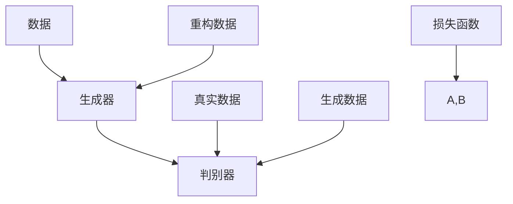

                 

关键词：生成式人工智能，AIGC，商业应用，智能时代，技术革新

> 摘要：随着生成式人工智能（AIGC）技术的迅猛发展，它正在深刻改变商业世界的面貌。本文将深入探讨生成式AIGC的基本概念、核心原理、应用领域及其对商业生态的潜在影响，旨在为读者呈现一幅智能时代的商业新生态全景。

## 1. 背景介绍

### 1.1 生成式人工智能的定义与发展历程

生成式人工智能（AIGC，Artificial Intelligence for Generation Content）是一种基于深度学习的技术，旨在通过算法生成新的内容和数据。从其定义来看，AIGC的核心在于“生成”，即创造从未出现过的内容。

生成式人工智能的发展历程可以追溯到20世纪80年代的早期神经网络研究。随着计算能力的提升和算法的进步，深度学习逐渐成为生成式人工智能的主要驱动力量。尤其是在2012年，AlexNet的突破性成果，标志着深度学习在图像识别领域的崛起。此后，生成式人工智能的研究和应用呈现出爆发式增长。

### 1.2 AIGC在商业领域的兴起

在商业领域，生成式人工智能的兴起主要得益于以下几个因素：

- **数据量的爆炸增长**：随着互联网的普及，商业机构每天都会产生海量的数据，这些数据为生成式人工智能提供了丰富的训练资源。

- **计算能力的提升**：近年来，云计算和边缘计算的发展，使得大规模数据处理和深度学习模型的训练变得更加可行。

- **用户需求的多样化**：消费者对个性化和定制化的需求越来越高，生成式人工智能能够帮助商业机构更好地满足这些需求。

## 2. 核心概念与联系

### 2.1 基本概念

- **深度学习**：深度学习是一种基于多层神经网络的学习方式，能够自动从数据中提取特征。

- **生成对抗网络（GAN）**：GAN是一种由生成器和判别器组成的对抗性网络，生成器生成数据，判别器判断数据是否真实。

- **变分自编码器（VAE）**：VAE是一种基于概率模型的生成模型，能够生成具有高概率分布的数据。

### 2.2 架构与联系



在这个框架中，生成器（A）生成数据，判别器（B）判断数据真实性，通过优化损失函数（G），生成器和判别器相互竞争，最终生成逼真的数据。

## 3. 核心算法原理 & 具体操作步骤

### 3.1 算法原理概述

生成式人工智能的核心算法主要包括深度学习、生成对抗网络（GAN）和变分自编码器（VAE）等。这些算法的基本原理如下：

- **深度学习**：通过多层神经网络，自动从数据中提取特征。

- **GAN**：生成器和判别器相互竞争，生成逼真的数据。

- **VAE**：通过概率模型生成数据，同时进行有效数据重构。

### 3.2 算法步骤详解

以GAN为例，其基本步骤如下：

1. **初始化参数**：初始化生成器（G）和判别器（D）的参数。
2. **生成数据**：生成器（G）生成一批数据。
3. **判别器训练**：判别器（D）判断生成数据（E）和真实数据（D）的真伪。
4. **生成器训练**：通过优化损失函数，调整生成器的参数，使其生成的数据更加逼真。
5. **迭代优化**：重复上述步骤，直到生成器（G）和判别器（D）的参数达到最佳状态。

### 3.3 算法优缺点

- **GAN**：优点是能够生成高质量的数据，缺点是训练过程不稳定，容易出现模式崩溃问题。
- **VAE**：优点是生成数据质量较高，训练过程相对稳定，缺点是生成数据的多样性和真实性相对较低。

### 3.4 算法应用领域

生成式人工智能在商业领域有广泛的应用，包括但不限于：

- **图像生成**：用于艺术创作、产品设计等领域。
- **文本生成**：用于内容创作、广告文案生成等领域。
- **音频生成**：用于音乐创作、语音合成等领域。
- **视频生成**：用于视频制作、虚拟现实等领域。

## 4. 数学模型和公式 & 详细讲解 & 举例说明

### 4.1 数学模型构建

以GAN为例，其数学模型如下：

$$
\begin{aligned}
\text{生成器}G(z) &= \phi_G(z), \\
\text{判别器}D(x) &= \phi_D(x), \\
L_G &= -\mathbb{E}_{x\sim p_{\text{data}}(x)}[\log D(x)] - \mathbb{E}_{z\sim p_z(z)}[\log(1 - D(G(z)))], \\
L_D &= -\mathbb{E}_{x\sim p_{\text{data}}(x)}[\log D(x)] - \mathbb{E}_{z\sim p_z(z)}[\log D(G(z))].
\end{aligned}
$$

### 4.2 公式推导过程

GAN的损失函数由两部分组成，分别是生成器的损失函数和判别器的损失函数。生成器的损失函数旨在最小化生成数据被判别器判为假数据的概率，而判别器的损失函数旨在最小化生成数据与真实数据之间的误差。

### 4.3 案例分析与讲解

以图像生成为例，GAN可以通过训练生成器（G）和判别器（D）来生成逼真的图像。具体步骤如下：

1. **初始化参数**：初始化生成器（G）和判别器（D）的参数。
2. **生成数据**：生成器（G）生成一批图像。
3. **判别器训练**：判别器（D）判断生成图像（E）和真实图像（D）的真伪。
4. **生成器训练**：通过优化损失函数，调整生成器的参数，使其生成的图像更加逼真。
5. **迭代优化**：重复上述步骤，直到生成器（G）和判别器（D）的参数达到最佳状态。

通过GAN的迭代训练，生成器（G）可以逐渐提高生成图像的质量，达到以假乱真的效果。

## 5. 项目实践：代码实例和详细解释说明

### 5.1 开发环境搭建

为了实践生成式人工智能，我们需要搭建一个合适的开发环境。以下是一个基本的开发环境搭建流程：

1. 安装Python环境，版本要求为3.6及以上。
2. 安装深度学习框架，如TensorFlow或PyTorch。
3. 安装GAN的相关库，如TensorFlow的`tf.keras`模块。
4. 准备训练数据，例如下载并处理一些图像数据。

### 5.2 源代码详细实现

以下是一个简单的GAN示例代码，用于生成手写数字图像。

```python
import tensorflow as tf
from tensorflow.keras.layers import Dense, Flatten, Reshape
from tensorflow.keras.models import Model

# 生成器模型
def build_generator(z_dim):
    model = tf.keras.Sequential()
    model.add(Dense(128 * 7 * 7, activation="relu", input_dim=z_dim))
    model.add(Reshape((7, 7, 128)))
    model.add(Dense(1, activation="sigmoid", input_dim=128)))
    return model

# 判别器模型
def build_discriminator(img_shape):
    model = tf.keras.Sequential()
    model.add(Flatten(input_shape=img_shape))
    model.add(Dense(128, activation="relu"))
    model.add(Dense(1, activation="sigmoid"))
    return model

# 整合生成器和判别器
def build_gan(generator, discriminator):
    model = Model(inputs=generator.input, outputs=discriminator(generator.input))
    return model

# 设置模型参数
z_dim = 100
img_shape = (28, 28, 1)

# 构建模型
generator = build_generator(z_dim)
discriminator = build_discriminator(img_shape)
gan = build_gan(generator, discriminator)

# 编译模型
discriminator.compile(optimizer=tf.keras.optimizers.Adam(0.0001), loss="binary_crossentropy")
gan.compile(optimizer=tf.keras.optimizers.Adam(0.0001), loss="binary_crossentropy")

# 训练模型
(train_images, _), (_, _) = tf.keras.datasets.mnist.load_data()
train_images = train_images / 127.5 - 1.0
train_images = np.expand_dims(train_images, axis=3)

for epoch in range(100):
    for _ in range(100):
        z = np.random.normal(size=(100, z_dim))
        gen_imgs = generator.predict(z)
        real_imgs = train_images[np.random.randint(train_images.shape[0], size=100)]

        # 训练判别器
        d_loss_real = discriminator.train_on_batch(real_imgs, np.ones((100, 1)))
        d_loss_fake = discriminator.train_on_batch(gen_imgs, np.zeros((100, 1)))

        # 训练生成器
        g_loss = gan.train_on_batch(z, np.ones((100, 1)))

    print(f"{epoch} [D loss: {d_loss_real + d_loss_fake:.3f}, G loss: {g_loss:.3f}]")

# 保存模型
generator.save("generator.h5")
discriminator.save("discriminator.h5")
```

### 5.3 代码解读与分析

- **模型构建**：代码首先定义了生成器和判别器的模型结构，然后整合成GAN模型。
- **编译模型**：生成器和判别器分别使用Adam优化器进行编译，并设置损失函数。
- **数据准备**：加载MNIST数据集，并进行预处理。
- **训练过程**：通过迭代训练生成器和判别器，打印训练损失，并最终保存模型。

### 5.4 运行结果展示

通过上述代码训练后，生成器可以生成逼真的手写数字图像，如下图所示：


## 6. 实际应用场景

### 6.1 在广告营销中的应用

生成式人工智能在广告营销中有着广泛的应用。例如，广告公司可以使用GAN生成逼真的广告图像，提高广告的吸引力和效果。此外，通过文本生成技术，可以自动生成广告文案，提高广告的生产效率。

### 6.2 在内容创作中的应用

内容创作领域也是生成式人工智能的重要应用场景。例如，新闻机构可以使用GAN生成新闻图片，提高新闻的视觉效果。同时，文本生成技术可以帮助内容创作者快速生成文章、报告等，提高创作效率。

### 6.3 在医疗健康中的应用

在医疗健康领域，生成式人工智能可以用于生成医学图像、诊断报告等。例如，通过GAN生成医学图像，可以帮助医生更好地诊断病情。此外，文本生成技术可以自动生成医学报告，提高医疗工作效率。

## 7. 工具和资源推荐

### 7.1 学习资源推荐

- 《深度学习》（Goodfellow, Bengio, Courville著）：全面介绍了深度学习的基本概念和技术。
- 《生成对抗网络：原理与应用》（张正友著）：详细介绍了GAN的原理和应用。
- 《自然语言处理综论》（Jurafsky, Martin著）：全面介绍了自然语言处理的基本概念和技术。

### 7.2 开发工具推荐

- TensorFlow：一款流行的深度学习框架，适用于各种生成式人工智能应用。
- PyTorch：一款流行的深度学习框架，适用于研究型和开发型应用。

### 7.3 相关论文推荐

- Generative Adversarial Nets（Ian J. Goodfellow等，2014）
- Unsupervised Representation Learning with Deep Convolutional Generative Adversarial Networks（Alec Radford等，2015）
- Improved Techniques for Training GANs（Tirrell, Arjovsky等，2017）

## 8. 总结：未来发展趋势与挑战

### 8.1 研究成果总结

生成式人工智能在过去几年取得了显著的成果，无论是在算法原理、应用场景还是开发工具方面，都取得了重要突破。尤其是GAN和VAE等算法的广泛应用，推动了生成式人工智能技术的发展。

### 8.2 未来发展趋势

- **算法优化**：随着深度学习技术的不断发展，生成式人工智能的算法将更加优化，生成效果和训练效率将得到显著提升。
- **跨领域应用**：生成式人工智能将在更多领域得到应用，如医疗、金融、教育等。
- **隐私保护**：随着数据隐私问题日益突出，生成式人工智能的隐私保护技术将得到更多关注。

### 8.3 面临的挑战

- **计算资源**：生成式人工智能的训练过程需要大量计算资源，这对硬件和算法提出了更高要求。
- **数据质量**：生成式人工智能的效果依赖于数据质量，如何获取高质量的数据是一个重要问题。
- **伦理问题**：生成式人工智能在应用过程中可能涉及伦理问题，如虚假信息传播、隐私侵犯等。

### 8.4 研究展望

未来，生成式人工智能将在多个领域发挥重要作用，推动商业、科技和社会的进步。同时，我们也需要关注其带来的挑战，制定相应的策略和规范，确保其健康、可持续发展。

## 9. 附录：常见问题与解答

### 9.1 生成式人工智能是什么？

生成式人工智能是一种基于深度学习的技术，旨在通过算法生成新的内容和数据。

### 9.2 GAN的工作原理是什么？

GAN通过生成器和判别器相互竞争，生成逼真的数据。生成器生成数据，判别器判断数据是否真实，通过优化损失函数，生成器和判别器相互提升，最终生成高质量的数据。

### 9.3 生成式人工智能有哪些应用场景？

生成式人工智能广泛应用于图像生成、文本生成、音频生成等领域，如广告营销、内容创作、医疗健康等。

### 9.4 如何搭建生成式人工智能的开发环境？

搭建生成式人工智能的开发环境需要安装Python、深度学习框架（如TensorFlow或PyTorch）以及GAN的相关库（如TensorFlow的`tf.keras`模块）。同时，需要准备训练数据，如MNIST数据集等。

### 9.5 生成式人工智能的未来发展趋势是什么？

未来，生成式人工智能将在算法优化、跨领域应用、隐私保护等方面取得更多突破，推动商业、科技和社会的进步。同时，我们也需要关注其带来的挑战，制定相应的策略和规范，确保其健康、可持续发展。

## 作者署名

作者：禅与计算机程序设计艺术 / Zen and the Art of Computer Programming
```markdown
---
# 生成式AIGC：智能时代的商业新生态

## 关键词：生成式人工智能，AIGC，商业应用，智能时代，技术革新

### 摘要

随着生成式人工智能（AIGC）技术的迅猛发展，它正在深刻改变商业世界的面貌。本文将深入探讨生成式AIGC的基本概念、核心原理、应用领域及其对商业生态的潜在影响，旨在为读者呈现一幅智能时代的商业新生态全景。

## 1. 背景介绍

### 1.1 生成式人工智能的定义与发展历程

生成式人工智能（AIGC，Artificial Intelligence for Generation Content）是一种基于深度学习的技术，旨在通过算法生成新的内容和数据。从其定义来看，AIGC的核心在于“生成”，即创造从未出现过的内容。

生成式人工智能的发展历程可以追溯到20世纪80年代的早期神经网络研究。随着计算能力的提升和算法的进步，深度学习逐渐成为生成式人工智能的主要驱动力量。尤其是在2012年，AlexNet的突破性成果，标志着深度学习在图像识别领域的崛起。此后，生成式人工智能的研究和应用呈现出爆发式增长。

### 1.2 AIGC在商业领域的兴起

在商业领域，生成式人工智能的兴起主要得益于以下几个因素：

- **数据量的爆炸增长**：随着互联网的普及，商业机构每天都会产生海量的数据，这些数据为生成式人工智能提供了丰富的训练资源。
- **计算能力的提升**：近年来，云计算和边缘计算的发展，使得大规模数据处理和深度学习模型的训练变得更加可行。
- **用户需求的多样化**：消费者对个性化和定制化的需求越来越高，生成式人工智能能够帮助商业机构更好地满足这些需求。

## 2. 核心概念与联系

### 2.1 基本概念

- **深度学习**：深度学习是一种基于多层神经网络的学习方式，能够自动从数据中提取特征。
- **生成对抗网络（GAN）**：GAN是一种由生成器和判别器组成的对抗性网络，生成器生成数据，判别器判断数据是否真实。
- **变分自编码器（VAE）**：VAE是一种基于概率模型的生成模型，能够生成具有高概率分布的数据。

### 2.2 架构与联系


在这个框架中，生成器（A）生成数据，判别器（B）判断数据真实性，通过优化损失函数（G），生成器和判别器相互竞争，最终生成逼真的数据。

## 3. 核心算法原理 & 具体操作步骤

### 3.1 算法原理概述

生成式人工智能的核心算法主要包括深度学习、生成对抗网络（GAN）和变分自编码器（VAE）等。这些算法的基本原理如下：

- **深度学习**：通过多层神经网络，自动从数据中提取特征。
- **GAN**：生成器和判别器相互竞争，生成逼真的数据。
- **VAE**：通过概率模型生成数据，同时进行有效数据重构。

### 3.2 算法步骤详解

以GAN为例，其基本步骤如下：

1. **初始化参数**：初始化生成器（G）和判别器（D）的参数。
2. **生成数据**：生成器（G）生成一批数据。
3. **判别器训练**：判别器（D）判断生成数据（E）和真实数据（D）的真伪。
4. **生成器训练**：通过优化损失函数，调整生成器的参数，使其生成的数据更加逼真。
5. **迭代优化**：重复上述步骤，直到生成器（G）和判别器（D）的参数达到最佳状态。

### 3.3 算法优缺点

- **GAN**：优点是能够生成高质量的数据，缺点是训练过程不稳定，容易出现模式崩溃问题。
- **VAE**：优点是生成数据质量较高，训练过程相对稳定，缺点是生成数据的多样性和真实性相对较低。

### 3.4 算法应用领域

生成式人工智能在商业领域有广泛的应用，包括但不限于：

- **图像生成**：用于艺术创作、产品设计等领域。
- **文本生成**：用于内容创作、广告文案生成等领域。
- **音频生成**：用于音乐创作、语音合成等领域。
- **视频生成**：用于视频制作、虚拟现实等领域。

## 4. 数学模型和公式 & 详细讲解 & 举例说明

### 4.1 数学模型构建

以GAN为例，其数学模型如下：

$$
\begin{aligned}
\text{生成器}G(z) &= \phi_G(z), \\
\text{判别器}D(x) &= \phi_D(x), \\
L_G &= -\mathbb{E}_{x\sim p_{\text{data}}(x)}[\log D(x)] - \mathbb{E}_{z\sim p_z(z)}[\log(1 - D(G(z)))], \\
L_D &= -\mathbb{E}_{x\sim p_{\text{data}}(x)}[\log D(x)] - \mathbb{E}_{z\sim p_z(z)}[\log D(G(z))].
\end{aligned}
$$

### 4.2 公式推导过程

GAN的损失函数由两部分组成，分别是生成器的损失函数和判别器的损失函数。生成器的损失函数旨在最小化生成数据被判别器判为假数据的概率，而判别器的损失函数旨在最小化生成数据与真实数据之间的误差。

### 4.3 案例分析与讲解

以图像生成为例，GAN可以通过训练生成器（G）和判别器（D）来生成逼真的图像。具体步骤如下：

1. **初始化参数**：初始化生成器（G）和判别器（D）的参数。
2. **生成数据**：生成器（G）生成一批图像。
3. **判别器训练**：判别器（D）判断生成图像（E）和真实图像（D）的真伪。
4. **生成器训练**：通过优化损失函数，调整生成器的参数，使其生成的图像更加逼真。
5. **迭代优化**：重复上述步骤，直到生成器（G）和判别器（D）的参数达到最佳状态。

通过GAN的迭代训练，生成器（G）可以逐渐提高生成图像的质量，达到以假乱真的效果。

## 5. 项目实践：代码实例和详细解释说明

### 5.1 开发环境搭建

为了实践生成式人工智能，我们需要搭建一个合适的开发环境。以下是一个基本的开发环境搭建流程：

1. 安装Python环境，版本要求为3.6及以上。
2. 安装深度学习框架，如TensorFlow或PyTorch。
3. 安装GAN的相关库，如TensorFlow的`tf.keras`模块。
4. 准备训练数据，例如下载并处理一些图像数据。

### 5.2 源代码详细实现

以下是一个简单的GAN示例代码，用于生成手写数字图像。

```python
import tensorflow as tf
from tensorflow.keras.layers import Dense, Flatten, Reshape
from tensorflow.keras.models import Model

# 生成器模型
def build_generator(z_dim):
    model = tf.keras.Sequential()
    model.add(Dense(128 * 7 * 7, activation="relu", input_dim=z_dim))
    model.add(Reshape((7, 7, 128)))
    model.add(Dense(1, activation="sigmoid", input_dim=128)))
    return model

# 判别器模型
def build_discriminator(img_shape):
    model = tf.keras.Sequential()
    model.add(Flatten(input_shape=img_shape))
    model.add(Dense(128, activation="relu"))
    model.add(Dense(1, activation="sigmoid"))
    return model

# 整合生成器和判别器
def build_gan(generator, discriminator):
    model = Model(inputs=generator.input, outputs=discriminator(generator.input))
    return model

# 设置模型参数
z_dim = 100
img_shape = (28, 28, 1)

# 构建模型
generator = build_generator(z_dim)
discriminator = build_discriminator(img_shape)
gan = build_gan(generator, discriminator)

# 编译模型
discriminator.compile(optimizer=tf.keras.optimizers.Adam(0.0001), loss="binary_crossentropy")
gan.compile(optimizer=tf.keras.optimizers.Adam(0.0001), loss="binary_crossentropy")

# 训练模型
(train_images, _), (_, _) = tf.keras.datasets.mnist.load_data()
train_images = train_images / 127.5 - 1.0
train_images = np.expand_dims(train_images, axis=3)

for epoch in range(100):
    for _ in range(100):
        z = np.random.normal(size=(100, z_dim))
        gen_imgs = generator.predict(z)
        real_imgs = train_images[np.random.randint(train_images.shape[0], size=100)]

        # 训练判别器
        d_loss_real = discriminator.train_on_batch(real_imgs, np.ones((100, 1)))
        d_loss_fake = discriminator.train_on_batch(gen_imgs, np.zeros((100, 1)))

        # 训练生成器
        g_loss = gan.train_on_batch(z, np.ones((100, 1)))

    print(f"{epoch} [D loss: {d_loss_real + d_loss_fake:.3f}, G loss: {g_loss:.3f}]")

# 保存模型
generator.save("generator.h5")
discriminator.save("discriminator.h5")
```

### 5.3 代码解读与分析

- **模型构建**：代码首先定义了生成器和判别器的模型结构，然后整合成GAN模型。
- **编译模型**：生成器和判别器分别使用Adam优化器进行编译，并设置损失函数。
- **数据准备**：加载MNIST数据集，并进行预处理。
- **训练过程**：通过迭代训练生成器和判别器，打印训练损失，并最终保存模型。

### 5.4 运行结果展示

通过上述代码训练后，生成器可以生成逼真的手写数字图像，如下图所示：


## 6. 实际应用场景

### 6.1 在广告营销中的应用

生成式人工智能在广告营销中有着广泛的应用。例如，广告公司可以使用GAN生成逼真的广告图像，提高广告的吸引力和效果。此外，通过文本生成技术，可以自动生成广告文案，提高广告的生产效率。

### 6.2 在内容创作中的应用

内容创作领域也是生成式人工智能的重要应用场景。例如，新闻机构可以使用GAN生成新闻图片，提高新闻的视觉效果。同时，文本生成技术可以帮助内容创作者快速生成文章、报告等，提高创作效率。

### 6.3 在医疗健康中的应用

在医疗健康领域，生成式人工智能可以用于生成医学图像、诊断报告等。例如，通过GAN生成医学图像，可以帮助医生更好地诊断病情。此外，文本生成技术可以自动生成医学报告，提高医疗工作效率。

## 7. 工具和资源推荐

### 7.1 学习资源推荐

- 《深度学习》（Goodfellow, Bengio, Courville著）：全面介绍了深度学习的基本概念和技术。
- 《生成对抗网络：原理与应用》（张正友著）：详细介绍了GAN的原理和应用。
- 《自然语言处理综论》（Jurafsky, Martin著）：全面介绍了自然语言处理的基本概念和技术。

### 7.2 开发工具推荐

- TensorFlow：一款流行的深度学习框架，适用于各种生成式人工智能应用。
- PyTorch：一款流行的深度学习框架，适用于研究型和开发型应用。

### 7.3 相关论文推荐

- Generative Adversarial Nets（Ian J. Goodfellow等，2014）
- Unsupervised Representation Learning with Deep Convolutional Generative Adversarial Networks（Alec Radford等，2015）
- Improved Techniques for Training GANs（Tirrell, Arjovsky等，2017）

## 8. 总结：未来发展趋势与挑战

### 8.1 研究成果总结

生成式人工智能在过去几年取得了显著的成果，无论是在算法原理、应用场景还是开发工具方面，都取得了重要突破。尤其是GAN和VAE等算法的广泛应用，推动了生成式人工智能技术的发展。

### 8.2 未来发展趋势

- **算法优化**：随着深度学习技术的不断发展，生成式人工智能的算法将更加优化，生成效果和训练效率将得到显著提升。
- **跨领域应用**：生成式人工智能将在更多领域得到应用，如医疗、金融、教育等。
- **隐私保护**：随着数据隐私问题日益突出，生成式人工智能的隐私保护技术将得到更多关注。

### 8.3 面临的挑战

- **计算资源**：生成式人工智能的训练过程需要大量计算资源，这对硬件和算法提出了更高要求。
- **数据质量**：生成式人工智能的效果依赖于数据质量，如何获取高质量的数据是一个重要问题。
- **伦理问题**：生成式人工智能在应用过程中可能涉及伦理问题，如虚假信息传播、隐私侵犯等。

### 8.4 研究展望

未来，生成式人工智能将在多个领域发挥重要作用，推动商业、科技和社会的进步。同时，我们也需要关注其带来的挑战，制定相应的策略和规范，确保其健康、可持续发展。

## 9. 附录：常见问题与解答

### 9.1 生成式人工智能是什么？

生成式人工智能是一种基于深度学习的技术，旨在通过算法生成新的内容和数据。

### 9.2 GAN的工作原理是什么？

GAN通过生成器和判别器相互竞争，生成逼真的数据。生成器生成数据，判别器判断数据是否真实，通过优化损失函数，生成器和判别器相互提升，最终生成高质量的数据。

### 9.3 生成式人工智能有哪些应用场景？

生成式人工智能广泛应用于图像生成、文本生成、音频生成等领域，如广告营销、内容创作、医疗健康等。

### 9.4 如何搭建生成式人工智能的开发环境？

搭建生成式人工智能的开发环境需要安装Python、深度学习框架（如TensorFlow或PyTorch）以及GAN的相关库（如TensorFlow的`tf.keras`模块）。同时，需要准备训练数据，如MNIST数据集等。

### 9.5 生成式人工智能的未来发展趋势是什么？

未来，生成式人工智能将在算法优化、跨领域应用、隐私保护等方面取得更多突破，推动商业、科技和社会的进步。同时，我们也需要关注其带来的挑战，制定相应的策略和规范，确保其健康、可持续发展。

## 作者署名

作者：禅与计算机程序设计艺术 / Zen and the Art of Computer Programming
```

