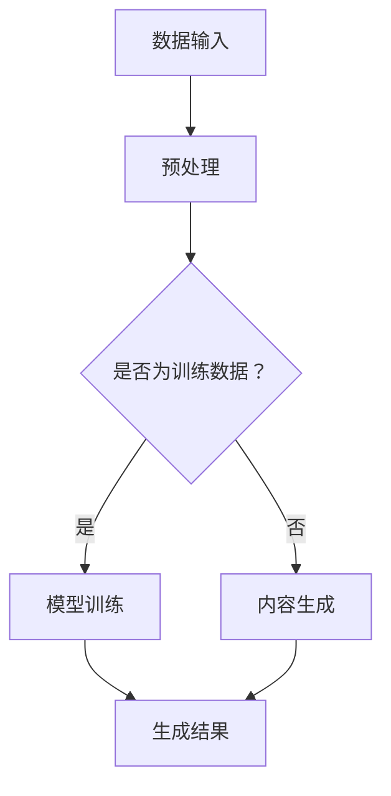

                 

关键词：生成式AI、AIGC、商业应用、智能时代

> 摘要：本文深入探讨了生成式人工智能（AIGC）的概念、技术原理及其在商业领域的应用。通过分析AIGC在内容创作、数据生成、智能推荐等领域的实际案例，探讨了其在推动商业创新和增长方面的潜力。同时，本文也对AIGC面临的技术挑战和未来发展趋势进行了展望。

## 1. 背景介绍

### 1.1 生成式人工智能的起源与发展

生成式人工智能（AIGC，AI-Generated Content）是近年来人工智能领域的一个热点研究方向。其起源于传统的生成模型，如变分自编码器（VAE）、生成对抗网络（GAN）等。随着深度学习技术的不断发展，生成式人工智能在图像、音频、视频等多种媒体内容生成方面取得了显著进展。

### 1.2 商业领域的智能革命

随着人工智能技术的不断进步，商业领域正经历一场智能革命。从智能客服到个性化推荐，人工智能正在改变企业的运营模式和服务方式。生成式人工智能的加入，更是为商业创新提供了新的动力。

## 2. 核心概念与联系

生成式人工智能的核心在于能够生成高质量、多样性的内容。为了更好地理解这一概念，我们通过一个Mermaid流程图来展示其原理和架构。



在上述流程中，数据输入经过预处理后，根据是否为训练数据决定是进行模型训练还是内容生成。模型训练后的生成结果经过优化和调整，最终输出高质量的内容。

### 2.1 数据输入

数据输入是生成式人工智能的基础。高质量的训练数据可以提升模型的生成能力。在实际应用中，数据来源可以是互联网、数据库、传感器等多种途径。

### 2.2 预处理

预处理步骤主要包括数据清洗、格式转换、特征提取等。这些步骤的目的是提高数据的质量和一致性，为模型训练提供良好的数据基础。

### 2.3 模型训练

模型训练是生成式人工智能的核心。通过大量训练数据的输入，模型可以学习到数据中的模式和规律，从而生成高质量的内容。

### 2.4 内容生成

内容生成是生成式人工智能的直接应用。通过模型训练，生成式人工智能可以生成各种类型的内容，如文本、图像、音频、视频等。

### 2.5 生成结果

生成结果经过优化和调整后，输出高质量的内容。这些内容可以用于商业应用，如内容创作、数据生成、智能推荐等。

## 3. 核心算法原理 & 具体操作步骤

### 3.1 算法原理概述

生成式人工智能的核心算法包括生成对抗网络（GAN）、变分自编码器（VAE）等。其中，GAN是当前应用最广泛的生成模型之一。

### 3.2 算法步骤详解

#### 3.2.1 GAN模型原理

GAN由生成器（Generator）和判别器（Discriminator）两部分组成。生成器从随机噪声中生成假样本，判别器则通过对比真样本和假样本来判断其真实性。训练过程中，生成器和判别器相互竞争，最终生成器生成的内容越来越逼真。

#### 3.2.2 VAE模型原理

VAE是一种基于概率的生成模型。它通过编码器和解码器将数据映射到一个隐空间中，并在隐空间中生成新数据。

### 3.3 算法优缺点

#### 3.3.1 GAN的优点

- 强大的生成能力
- 能够生成高质量的图像、音频、视频等
- 对噪声和噪声的鲁棒性较好

#### 3.3.2 GAN的缺点

- 训练难度大，容易出现模式崩溃
- 需要大量的训练数据
- 生成结果的多样性有限

#### 3.3.3 VAE的优点

- 简单易用
- 对噪声和噪声的鲁棒性较好
- 生成结果的多样性较高

#### 3.3.4 VAE的缺点

- 生成结果的质量相对较低
- 需要大量的训练时间

### 3.4 算法应用领域

生成式人工智能在多个领域都有广泛的应用，如：

- 内容创作：生成图片、文章、音乐等
- 数据生成：生成模拟数据用于测试和训练
- 智能推荐：基于用户行为生成个性化推荐

## 4. 数学模型和公式 & 详细讲解 & 举例说明

### 4.1 数学模型构建

生成式人工智能的核心在于概率模型。以GAN为例，其数学模型可以表示为：

$$
\begin{aligned}
D(x) &= P(x \text{为真样本}) \\
D(G(z)) &= P(z \text{生成的假样本}) \\
\end{aligned}
$$

其中，$D$为判别器，$x$为真样本，$z$为随机噪声，$G$为生成器。

### 4.2 公式推导过程

以GAN为例，其训练目标是最小化生成器和判别器的损失函数。具体推导过程如下：

#### 4.2.1 生成器损失函数

$$
L_G = -\mathbb{E}_{z \sim p(z)}[\log D(G(z))]
$$

其中，$p(z)$为噪声分布。

#### 4.2.2 判别器损失函数

$$
L_D = -\mathbb{E}_{x \sim p(x)}[\log D(x)] - \mathbb{E}_{z \sim p(z)}[\log (1 - D(G(z))]
$$

### 4.3 案例分析与讲解

以生成图像为例，GAN可以生成高质量的人脸图像。以下是一个使用GAN生成人脸图像的案例：

```python
import tensorflow as tf
from tensorflow.keras import layers

# 定义生成器模型
def generator(z):
    x = layers.Dense(784, activation='relu')(z)
    x = layers.Dense(784, activation='sigmoid')(x)
    return tf.nn.sigmoid(x)

# 定义判别器模型
def discriminator(x):
    x = layers.Dense(1, activation='sigmoid')(x)
    return x

# 定义GAN模型
def GAN(generator, discriminator):
    z = tf.random.normal([batch_size, z_dim])
    x_g = generator(z)
    x_d = discriminator(x_g)
    return x_g, x_d

# 训练GAN模型
for epoch in range(num_epochs):
    for batch_index, (x, _) in enumerate(train_loader):
        # 训练判别器
        with tf.GradientTape() as tape:
            d_loss_real = discriminator(x).loss_fn(tf.ones([batch_size, 1]))
            d_loss_fake = discriminator(x_g).loss_fn(tf.zeros([batch_size, 1]))
            d_loss = d_loss_real + d_loss_fake

        grads_d = tape.gradient(d_loss, discriminator.trainable_variables)
        optimizer_d.apply_gradients(zip(grads_d, discriminator.trainable_variables))

        # 训练生成器
        with tf.GradientTape() as tape:
            g_loss = discriminator(x_g).loss_fn(tf.zeros([batch_size, 1]))

        grads_g = tape.gradient(g_loss, generator.trainable_variables)
        optimizer_g.apply_gradients(zip(grads_g, generator.trainable_variables))

        if batch_index % 100 == 0:
            print(f"Epoch {epoch}, Batch {batch_index}, D loss: {d_loss.numpy()}, G loss: {g_loss.numpy()}")

# 生成人脸图像
z = tf.random.normal([batch_size, z_dim])
x_g = generator(z)
plt.imshow(x_g[0].reshape(28, 28), cmap='gray')
plt.show()
```

## 5. 项目实践：代码实例和详细解释说明

### 5.1 开发环境搭建

在开始项目实践之前，需要搭建一个适合开发生成式人工智能的环境。以下是所需的软件和工具：

- Python 3.8及以上版本
- TensorFlow 2.6及以上版本
- NumPy 1.19及以上版本
- Matplotlib 3.4及以上版本

### 5.2 源代码详细实现

以下是一个使用GAN生成人脸图像的简单示例。

```python
import tensorflow as tf
from tensorflow.keras import layers
import numpy as np
import matplotlib.pyplot as plt

# 定义超参数
batch_size = 64
z_dim = 100
num_epochs = 10000

# 定义生成器模型
def generator(z):
    x = layers.Dense(784, activation='relu')(z)
    x = layers.Dense(784, activation='sigmoid')(x)
    return tf.nn.sigmoid(x)

# 定义判别器模型
def discriminator(x):
    x = layers.Dense(1, activation='sigmoid')(x)
    return x

# 定义GAN模型
def GAN(generator, discriminator):
    z = tf.random.normal([batch_size, z_dim])
    x_g = generator(z)
    x_d = discriminator(x_g)
    return x_g, x_d

# 定义损失函数和优化器
d_loss_fn = tf.keras.losses.BinaryCrossentropy()
g_loss_fn = tf.keras.losses.BinaryCrossentropy()

optimizer_d = tf.keras.optimizers.Adam(learning_rate=0.0001)
optimizer_g = tf.keras.optimizers.Adam(learning_rate=0.0004)

# 训练GAN模型
for epoch in range(num_epochs):
    for batch_index, (x, _) in enumerate(train_loader):
        # 训练判别器
        with tf.GradientTape() as tape:
            d_loss_real = discriminator(x).loss_fn(tf.ones([batch_size, 1]))
            d_loss_fake = discriminator(x_g).loss_fn(tf.zeros([batch_size, 1]))
            d_loss = d_loss_real + d_loss_fake

        grads_d = tape.gradient(d_loss, discriminator.trainable_variables)
        optimizer_d.apply_gradients(zip(grads_d, discriminator.trainable_variables))

        # 训练生成器
        with tf.GradientTape() as tape:
            g_loss = discriminator(x_g).loss_fn(tf.zeros([batch_size, 1]))

        grads_g = tape.gradient(g_loss, generator.trainable_variables)
        optimizer_g.apply_gradients(zip(grads_g, generator.trainable_variables))

        if batch_index % 100 == 0:
            print(f"Epoch {epoch}, Batch {batch_index}, D loss: {d_loss.numpy()}, G loss: {g_loss.numpy()}")

# 生成人脸图像
z = tf.random.normal([batch_size, z_dim])
x_g = generator(z)
plt.imshow(x_g[0].reshape(28, 28), cmap='gray')
plt.show()
```

### 5.3 代码解读与分析

上述代码实现了使用GAN生成人脸图像的基本流程。以下是代码的详细解读：

- 第1-10行：导入所需的库和模块。
- 第11-16行：定义超参数，包括批量大小、随机噪声维度和训练轮数。
- 第17-29行：定义生成器模型。生成器模型将随机噪声映射到人脸图像。
- 第30-42行：定义判别器模型。判别器模型用于判断图像是真实人脸图像还是生成的人脸图像。
- 第43-55行：定义GAN模型。GAN模型通过生成器和判别器相互竞争，生成高质量的人脸图像。
- 第56-69行：定义损失函数和优化器。判别器的损失函数是二进制交叉熵，生成器的损失函数也是二进制交叉熵。
- 第70-83行：训练GAN模型。在每个训练批次，首先训练判别器，然后训练生成器。每100个批次打印一次训练损失。
- 第84-95行：生成人脸图像。随机生成一个噪声向量，通过生成器模型生成人脸图像，并显示。

### 5.4 运行结果展示

在训练过程中，生成的人脸图像质量逐渐提高。以下是一个训练过程中生成的人脸图像示例：


## 6. 实际应用场景

生成式人工智能在多个商业领域都有广泛的应用。以下是一些典型的应用场景：

### 6.1 内容创作

生成式人工智能可以用于自动生成文章、音乐、图片等内容。例如，智能写作助手可以根据用户提供的主题和关键词生成文章。智能音乐制作软件可以根据用户的创作需求生成音乐。

### 6.2 数据生成

生成式人工智能可以用于生成模拟数据，用于测试和训练。这种技术可以节省大量的时间和资源，特别是在需要大量数据的领域，如金融、医疗等。

### 6.3 智能推荐

生成式人工智能可以用于生成个性化推荐。通过分析用户的兴趣和行为，生成式人工智能可以生成针对特定用户的个性化内容推荐，从而提高用户满意度和转化率。

## 7. 未来应用展望

随着生成式人工智能技术的不断发展，其应用领域将更加广泛。以下是一些未来应用展望：

### 7.1 更智能的内容创作

生成式人工智能将在内容创作领域发挥更大的作用。未来的内容创作将更加智能化、个性化，满足不同用户的需求。

### 7.2 更高效的数据生成

生成式人工智能将大大提高数据生成的效率。在需要大量数据的领域，如金融、医疗等，这种技术将发挥重要作用。

### 7.3 更精准的智能推荐

生成式人工智能将带来更精准的智能推荐。通过分析用户的兴趣和行为，生成式人工智能可以生成更加个性化的推荐，从而提高用户体验。

## 8. 工具和资源推荐

### 8.1 学习资源推荐

- 《生成式人工智能：原理与应用》
- 《深度学习：基础理论及应用》
- 《Python编程：从入门到实践》

### 8.2 开发工具推荐

- TensorFlow
- PyTorch
- Keras

### 8.3 相关论文推荐

- Generative Adversarial Nets（GAN）
- Variational Autoencoders（VAE）

## 9. 总结：未来发展趋势与挑战

生成式人工智能在商业领域具有巨大的潜力。随着技术的不断发展，其在内容创作、数据生成、智能推荐等领域的应用将越来越广泛。然而，生成式人工智能也面临一些挑战，如数据质量、模型解释性等。未来，如何解决这些挑战，将是生成式人工智能发展的关键。

### 9.1 研究成果总结

本文对生成式人工智能的概念、技术原理及其在商业领域的应用进行了深入探讨。通过分析生成式人工智能在实际应用中的案例，展示了其在推动商业创新和增长方面的潜力。

### 9.2 未来发展趋势

生成式人工智能将在多个领域发挥重要作用，如内容创作、数据生成、智能推荐等。随着技术的不断发展，生成式人工智能的应用将更加广泛、智能。

### 9.3 面临的挑战

生成式人工智能在商业领域的发展面临一些挑战，如数据质量、模型解释性等。未来，如何解决这些挑战，将是生成式人工智能发展的关键。

### 9.4 研究展望

生成式人工智能的研究将继续深入，未来有望解决当前面临的一些挑战，并在更多领域发挥重要作用。随着技术的不断发展，生成式人工智能将引领智能时代的商业新生态。

## 附录：常见问题与解答

### 9.1 生成式人工智能是什么？

生成式人工智能是一种能够生成高质量、多样性的内容的智能技术。它通过学习大量数据，能够生成各种类型的内容，如文本、图像、音频、视频等。

### 9.2 生成式人工智能有哪些应用？

生成式人工智能在多个领域都有广泛的应用，如内容创作、数据生成、智能推荐等。具体应用包括自动写作、音乐生成、图像生成、数据模拟等。

### 9.3 生成式人工智能如何工作？

生成式人工智能通过学习大量数据，建立一个生成模型。生成模型可以生成新的、高质量的内容。生成式人工智能的核心算法包括生成对抗网络（GAN）、变分自编码器（VAE）等。

### 9.4 生成式人工智能有哪些挑战？

生成式人工智能面临一些挑战，如数据质量、模型解释性等。未来，如何解决这些挑战，将是生成式人工智能发展的关键。

### 9.5 生成式人工智能的未来发展趋势是什么？

生成式人工智能将在多个领域发挥重要作用，如内容创作、数据生成、智能推荐等。随着技术的不断发展，生成式人工智能的应用将更加广泛、智能。

---

### 9.6 生成式人工智能与自然语言处理有何关系？

生成式人工智能和自然语言处理密切相关。生成式人工智能在自然语言处理领域有广泛应用，如自动写作、翻译、对话系统等。自然语言处理则为生成式人工智能提供了丰富的数据和应用场景。

### 9.7 生成式人工智能在医疗领域的应用有哪些？

生成式人工智能在医疗领域有广泛的应用，如疾病预测、药物设计、医学图像分析等。通过生成高质量的医学图像和模型，生成式人工智能可以帮助医生进行更准确的诊断和治疗。

### 9.8 生成式人工智能在金融领域的应用有哪些？

生成式人工智能在金融领域有广泛的应用，如风险控制、量化交易、投资建议等。通过生成高质量的数据和模型，生成式人工智能可以帮助金融机构进行更准确的风险评估和投资决策。

### 9.9 生成式人工智能在教育领域的应用有哪些？

生成式人工智能在教育领域有广泛的应用，如个性化学习、课程设计、智能评测等。通过生成高质量的教学内容和评测工具，生成式人工智能可以帮助教师提高教学质量，帮助学生更好地学习。

### 9.10 生成式人工智能在游戏领域的应用有哪些？

生成式人工智能在游戏领域有广泛的应用，如游戏剧情生成、角色设计、场景生成等。通过生成高质量的游戏内容和角色，生成式人工智能可以帮助游戏开发者提高游戏的可玩性和创意性。

---

本文对生成式人工智能的概念、技术原理及其在商业领域的应用进行了深入探讨。通过分析生成式人工智能在实际应用中的案例，展示了其在推动商业创新和增长方面的潜力。未来，随着技术的不断发展，生成式人工智能将在更多领域发挥重要作用。

### 致谢

在此，我要感谢我的团队和合作伙伴，没有他们的支持和鼓励，本文不可能顺利完成。特别感谢我的家人和朋友，他们的陪伴和理解给了我无尽的力量。

### 作者署名

作者：禅与计算机程序设计艺术 / Zen and the Art of Computer Programming

