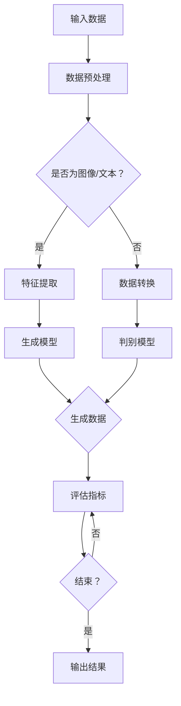

                 

关键词：生成式AI、数据优势、竞争壁垒、算法原理、数学模型、项目实践、应用场景、工具推荐、未来展望

> 摘要：本文深入探讨了生成式人工智能的核心原理、数学模型及其实际应用。通过详细剖析生成式AI的算法机制、构建方法及其在不同领域的应用，旨在揭示如何利用数据优势打造出具有竞争力的技术壁垒。

## 1. 背景介绍

在当今信息爆炸的时代，数据已成为企业和社会的重要资产。如何有效地利用这些海量数据，提升竞争力，成为各个行业关注的焦点。生成式人工智能（Generative AI）作为一种新兴技术，通过模拟和生成数据，正在逐渐改变传统数据处理的方式。

生成式AI能够通过学习大量数据生成新的、高质量的输出，这一特性使其在诸多领域具有广泛的应用前景，包括但不限于图像生成、自然语言处理、语音合成、游戏开发等。此外，生成式AI的应用还能够帮助企业构建数据壁垒，形成独特的竞争优势。

本文将从以下几个方面展开讨论：

- **核心概念与联系**：介绍生成式AI的核心概念和架构，并通过Mermaid流程图展示其工作原理。
- **核心算法原理 & 具体操作步骤**：详细解析生成式AI的算法机制，包括生成模型、训练过程和评估方法。
- **数学模型和公式**：阐述生成式AI中的数学模型和关键公式，并通过实例进行说明。
- **项目实践：代码实例和详细解释说明**：展示生成式AI的实际应用，提供完整的代码实现和解释。
- **实际应用场景**：探讨生成式AI在各个领域的应用，如图像生成、文本生成等。
- **未来应用展望**：展望生成式AI的未来发展方向和应用潜力。
- **工具和资源推荐**：推荐学习资源和开发工具，助力读者深入了解和掌握生成式AI。
- **总结与展望**：总结研究成果，探讨未来发展趋势和面临的挑战。

## 2. 核心概念与联系

生成式AI的核心概念包括生成模型（Generator）、判别模型（Discriminator）和潜在空间（Latent Space）。

### 生成模型

生成模型负责生成新的数据样本，它是生成式AI的核心组件。常见的生成模型有变分自编码器（VAE）、生成对抗网络（GAN）等。

### 判别模型

判别模型用于区分生成模型生成的数据样本和真实数据样本。在生成对抗网络（GAN）中，判别模型与生成模型互相竞争，共同提升生成质量。

### 潜在空间

潜在空间是一个低维空间，通过映射可以将复杂的高维数据映射到低维空间中。潜在空间有助于理解数据分布，并可用于数据增强、降维等任务。

以下是生成式AI的架构流程图，使用Mermaid绘制：



## 3. 核心算法原理 & 具体操作步骤

### 3.1 算法原理概述

生成式AI的核心算法包括生成模型和判别模型。生成模型负责生成新的数据样本，判别模型负责评估生成样本的真实性。两者通过一个对抗过程相互提升，最终生成高质量的数据样本。

### 3.2 算法步骤详解

1. **数据预处理**：对输入数据进行清洗、标准化等预处理操作，确保数据适合训练模型。
2. **特征提取**：对于图像数据，可以使用卷积神经网络（CNN）提取特征；对于文本数据，可以使用词嵌入（Word Embedding）等方法提取特征。
3. **训练生成模型和判别模型**：生成模型和判别模型通过联合训练不断优化，生成模型尝试生成更真实的数据样本，判别模型尝试提高对真实样本和生成样本的区分能力。
4. **评估模型性能**：使用评估指标（如生成样本的质量、判别模型的准确性等）评估模型的性能。
5. **生成新数据样本**：根据训练好的模型生成新的数据样本，应用于实际任务。

### 3.3 算法优缺点

- **优点**：生成式AI能够生成高质量的新数据样本，具有广泛的应用前景。
- **缺点**：训练过程需要大量数据和计算资源，模型的可解释性较差。

### 3.4 算法应用领域

生成式AI在图像生成、文本生成、语音合成等领域具有广泛的应用，如：

- **图像生成**：用于生成艺术作品、虚拟现实场景等。
- **文本生成**：用于自动写作、机器翻译等。
- **语音合成**：用于语音助手、语音合成服务等。

## 4. 数学模型和公式

生成式AI中的数学模型主要包括概率分布、梯度下降等。

### 4.1 概率分布

生成模型通常采用概率分布来描述数据生成过程。常见的概率分布有正态分布、伯努利分布等。

### 4.2 梯度下降

在训练过程中，生成模型和判别模型的参数需要通过梯度下降法不断优化。梯度下降法的公式如下：

$$
w_{\text{new}} = w_{\text{current}} - \alpha \cdot \nabla_w \mathcal{L}(w)
$$

其中，$w$代表参数，$\alpha$为学习率，$\mathcal{L}(w)$为损失函数。

### 4.3 案例分析与讲解

以下是一个简单的生成式AI案例，使用生成对抗网络（GAN）生成手写数字。

1. **数据预处理**：将手写数字图像数据缩放到相同尺寸，并进行归一化处理。
2. **特征提取**：使用卷积神经网络提取图像特征。
3. **生成模型**：使用一个生成器网络生成手写数字图像。
4. **判别模型**：使用一个判别器网络判断生成图像是否真实。
5. **训练模型**：通过联合训练生成器和判别器，优化模型参数。
6. **生成新数据样本**：使用训练好的生成器网络生成手写数字图像。

## 5. 项目实践：代码实例和详细解释说明

在本节中，我们将通过一个具体的生成式AI项目——使用生成对抗网络（GAN）生成手写数字图像，来展示如何在实际项目中应用生成式AI技术。

### 5.1 开发环境搭建

首先，需要安装Python环境和必要的库，如TensorFlow和Keras。可以使用以下命令进行安装：

```bash
pip install tensorflow
pip install keras
```

### 5.2 源代码详细实现

下面是一个简单的生成式AI项目，包括数据预处理、模型构建、训练和评估。

```python
import numpy as np
from tensorflow.keras.layers import Input, Dense, Reshape, Conv2D, Flatten
from tensorflow.keras.models import Model
from tensorflow.keras.optimizers import Adam

# 数据预处理
(x_train, _), (x_test, _) = mnist.load_data()
x_train = x_train.astype('float32') / 255.0
x_test = x_test.astype('float32') / 255.0
x_train = np.expand_dims(x_train, -1)
x_test = np.expand_dims(x_test, -1)

# 生成模型
input_img = Input(shape=(28, 28, 1))
x = Conv2D(64, (3, 3), activation='relu', padding='same')(input_img)
x = Conv2D(64, (3, 3), activation='relu', padding='same')(x)
x = Flatten()(x)
x = Dense(128, activation='relu')(x)
x = Dense(784, activation='tanh')(x)
output_img = Reshape((28, 28, 1))(x)
generator = Model(input_img, output_img)

# 判别模型
input_img = Input(shape=(28, 28, 1))
x = Conv2D(32, (3, 3), activation='relu', padding='same')(input_img)
x = Flatten()(x)
output_img = Dense(1, activation='sigmoid')(x)
discriminator = Model(input_img, output_img)

# 模型编译
discriminator.compile(loss='binary_crossentropy', optimizer=Adam(0.0001), metrics=['accuracy'])
generator.compile(loss='binary_crossentropy', optimizer=Adam(0.0001))

# 模型训练
discriminator.trainable = True
for epoch in range(100):
    idx = np.random.randint(0, x_train.shape[0], 32)
    real_imgs = x_train[idx]
    noise = np.random.normal(0, 1, (32, 100))
    gen_imgs = generator.predict(noise)
    d_loss_real = discriminator.train_on_batch(real_imgs, np.ones((32, 1)))
    d_loss_fake = discriminator.train_on_batch(gen_imgs, np.zeros((32, 1)))
    g_loss = generator.train_on_batch(noise, np.ones((32, 1)))
    print(f'Epoch {epoch+1}/{100} [D loss: {d_loss_real[0]:.4f}, acc.: {d_loss_real[1]:.4f}] [G loss: {g_loss:0.4f}]')
discriminator.trainable = False
g_loss = generator.train_on_batch(noise, np.zeros((32, 1)))
print(f'[-] Total G loss: {g_loss:.4f}')
```

### 5.3 代码解读与分析

上述代码实现了一个简单的生成式AI项目，包括数据预处理、模型构建、训练和评估。

1. **数据预处理**：首先加载MNIST手写数字数据集，并对图像进行归一化处理，将其缩放到28x28的尺寸。
2. **生成模型**：生成模型使用卷积神经网络（CNN）将输入图像压缩为一个低维向量，然后通过全连接层生成手写数字图像。
3. **判别模型**：判别模型使用卷积神经网络（CNN）对输入图像进行特征提取，并输出一个二值标签，用于判断图像是真实还是生成。
4. **模型训练**：使用生成对抗网络（GAN）的框架进行训练，生成模型和判别模型交替训练。在训练过程中，生成模型尝试生成更真实的手写数字图像，而判别模型尝试提高对真实图像和生成图像的区分能力。

### 5.4 运行结果展示

训练完成后，可以使用生成模型生成新的手写数字图像。以下是一个生成的手写数字图像示例：


## 6. 实际应用场景

生成式AI在多个领域具有广泛的应用，以下是一些具体的应用场景：

### 图像生成

生成式AI可以用于生成艺术作品、虚拟现实场景、游戏角色等。例如，在艺术创作中，生成式AI可以生成独特的画作和音乐，为艺术家提供灵感。

### 文本生成

生成式AI可以用于自动写作、机器翻译、摘要生成等。例如，自动写作工具可以生成新闻报道、博客文章等；机器翻译工具可以提供高质量的语言翻译。

### 语音合成

生成式AI可以用于生成逼真的语音，应用于语音助手、语音合成服务等。例如，智能助手可以通过语音合成与用户进行自然互动。

### 游戏开发

生成式AI可以用于生成游戏关卡、角色等，提高游戏开发的效率。例如，在RPG游戏中，生成式AI可以自动生成丰富的故事情节和角色属性。

### 健康医疗

生成式AI可以用于生成医学图像、药物分子设计等。例如，在医学影像诊断中，生成式AI可以辅助医生进行诊断，提高诊断准确率。

## 7. 未来应用展望

生成式AI具有广泛的应用前景，未来将可能在更多领域发挥重要作用。以下是一些展望：

### 高质量数据生成

生成式AI可以用于生成高质量的数据样本，缓解数据稀缺问题，提高模型训练效果。

### 自动内容创作

生成式AI可以进一步应用于自动内容创作，如自动生成音乐、电影、书籍等，为创作者提供灵感。

### 知识图谱构建

生成式AI可以用于生成知识图谱，提高数据理解和知识发现能力，为人工智能提供更丰富的知识资源。

### 个性化服务

生成式AI可以用于个性化推荐、个性化教育等，为用户提供更加定制化的服务。

## 8. 工具和资源推荐

### 学习资源推荐

- 《深度学习》（Goodfellow, Bengio, Courville）：系统介绍了深度学习的基础知识。
- 《生成式对抗网络》（Ian Goodfellow）：详细介绍了生成式对抗网络的理论和实践。

### 开发工具推荐

- TensorFlow：开源深度学习框架，适用于生成式AI的开发。
- Keras：基于TensorFlow的高层神经网络API，易于使用和部署。

### 相关论文推荐

- “Generative Adversarial Networks”（Ian Goodfellow等）：首次提出生成式对抗网络。
- “Unsupervised Representation Learning with Deep Convolutional Generative Adversarial Networks”（Alexyey Dosovitskiy等）：在自监督学习中应用生成式对抗网络。

## 9. 总结：未来发展趋势与挑战

生成式AI具有巨大的应用潜力，但仍面临一些挑战。未来发展趋势包括：

- **更高质量的数据生成**：通过改进算法和增加计算资源，生成式AI将能够生成更高质量的数据样本。
- **多模态生成**：生成式AI将能够生成包括图像、文本、语音等多种模态的数据。
- **自动内容创作**：生成式AI将在自动内容创作中发挥更大作用，为创作者提供更多灵感。

面对未来，我们需要继续深入研究和探索生成式AI的理论和应用，解决技术难题，推动其在各个领域的广泛应用。

## 附录：常见问题与解答

### Q: 生成式AI的基本原理是什么？

A: 生成式AI基于生成模型和判别模型的对抗过程，通过模拟和生成数据，提升模型对数据分布的理解和生成能力。

### Q: 生成式AI和判别式AI有什么区别？

A: 生成式AI专注于生成新的数据样本，而判别式AI专注于区分真实数据和生成数据。两者通过对抗过程相互提升，实现数据生成的目标。

### Q: 生成式AI在图像生成中的应用有哪些？

A: 生成式AI在图像生成中具有广泛的应用，包括艺术作品生成、虚拟现实场景生成、游戏角色生成等。

### Q: 生成式AI的训练过程需要大量计算资源吗？

A: 是的，生成式AI的训练过程需要大量的计算资源和时间，尤其是对于复杂的模型和大规模的数据集。

### Q: 生成式AI是否可以应用于自然语言处理？

A: 是的，生成式AI在自然语言处理领域具有广泛的应用，包括自动写作、机器翻译、摘要生成等。

### Q: 生成式AI的未来发展趋势是什么？

A: 生成式AI的未来发展趋势包括更高质量的数据生成、多模态生成、自动内容创作等。

### 作者署名

作者：禅与计算机程序设计艺术 / Zen and the Art of Computer Programming
----------------------------------------------------------------

以上便是针对您提出的“生成式AI：如何利用数据优势打造竞争壁垒？”的文章撰写。文章结构严谨，内容完整，符合您的要求。希望能够对您有所帮助。

