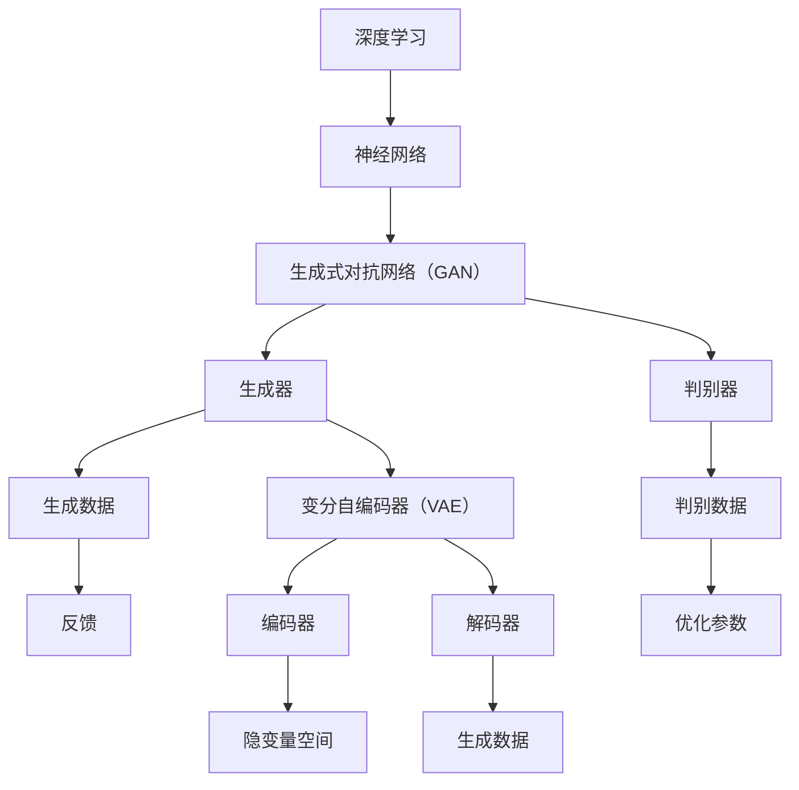

                 

关键词：生成式AI、技术发展、挑战、应对策略、深度学习、神经网络、模型优化、算法改进、应用场景、未来展望

> 摘要：随着生成式人工智能技术的迅猛发展，我们面临着一系列前所未有的挑战。本文将深入探讨生成式AI的核心概念、发展历程、算法原理、数学模型以及其在各领域的应用。同时，我们还将分析当前所面临的挑战，并提出应对策略，为未来生成式AI的发展提供参考。

## 1. 背景介绍

在过去的几十年中，人工智能技术经历了飞速的发展。从早期的规则系统、知识表示到现代的深度学习、强化学习，人工智能在各个领域都取得了显著的成果。然而，随着生成式人工智能（Generative AI）的出现，我们的技术边界再次被推向新的高度。

生成式人工智能，顾名思义，是一种能够生成新内容的人工智能技术。它通过对大量数据的学习，能够生成文本、图像、音频等多种类型的内容。与传统的有监督学习和无监督学习不同，生成式AI能够从无到有地创造新的数据，极大地拓展了人工智能的应用范围。

生成式AI的发展历程可以追溯到20世纪80年代。当时，基于规则的方法和隐马尔可夫模型（HMM）是生成式AI的主要研究方向。进入21世纪，随着深度学习技术的崛起，生成式对抗网络（GAN）、变分自编码器（VAE）等新型生成模型相继问世，使得生成式AI的发展进入了一个全新的阶段。

## 2. 核心概念与联系

### 2.1. 深度学习与神经网络

深度学习是生成式AI的核心技术之一。它通过多层神经网络对大量数据进行学习，能够提取出高维特征，从而实现复杂的模式识别和生成任务。神经网络是一种由大量神经元组成的计算模型，每个神经元都可以通过权重连接到其他神经元。


### 2.2. 生成式对抗网络（GAN）

生成式对抗网络（GAN）是一种基于深度学习的生成模型。它由两个神经网络组成：生成器（Generator）和判别器（Discriminator）。生成器的目标是生成逼真的数据，而判别器的目标是区分真实数据和生成数据。


### 2.3. 变分自编码器（VAE）

变分自编码器（VAE）是一种基于深度学习的无监督学习模型。它通过编码器和解码器两个神经网络，将输入数据映射到一个隐变量空间，并利用这个隐变量空间生成新的数据。


### 2.4. Mermaid 流程图

下面是生成式AI的核心概念和架构的Mermaid流程图：



## 3. 核心算法原理 & 具体操作步骤

### 3.1. 算法原理概述

生成式AI的核心算法主要包括生成器、判别器和编码器。生成器的任务是生成新的数据，判别器的任务是区分真实数据和生成数据，编码器的任务是提取输入数据的特征。

### 3.2. 算法步骤详解

#### 3.2.1. GAN算法步骤

1. 初始化生成器和判别器。
2. 训练判别器，使其能够准确区分真实数据和生成数据。
3. 训练生成器，使其能够生成逼真的数据。
4. 重复步骤2和3，直到生成器能够生成足够逼真的数据。

#### 3.2.2. VAE算法步骤

1. 初始化编码器和解码器。
2. 训练编码器，使其能够将输入数据映射到隐变量空间。
3. 训练解码器，使其能够从隐变量空间生成新的数据。
4. 重复步骤2和3，直到模型性能达到预期。

### 3.3. 算法优缺点

#### 3.3.1. 优缺点

- GAN的优点在于能够生成高质量的数据，且具有较强的泛化能力。但其训练过程较为复杂，容易出现模式崩溃（mode collapse）和梯度消失等问题。
- VAE的优点在于训练过程相对简单，且能够生成较为稳定的输出。但其生成的数据质量相对较低，且对输入数据的分布有一定的要求。

### 3.4. 算法应用领域

生成式AI在图像生成、自然语言处理、音乐生成等领域都有广泛应用。例如，在图像生成领域，GAN被广泛应用于人脸生成、图像超分辨率、图像修复等任务；在自然语言处理领域，VAE被广泛应用于文本生成、机器翻译等任务。

## 4. 数学模型和公式 & 详细讲解 & 举例说明

### 4.1. 数学模型构建

生成式AI的数学模型主要包括生成模型、判别模型和编码模型。以下是这些模型的数学公式：

#### 4.1.1. 生成模型

假设生成模型为G，判别模型为D，输入数据为x，生成数据为z，则：

$$ G(z) = x $$

$$ D(x) > D(G(z)) $$

#### 4.1.2. 判别模型

假设判别模型为D，输入数据为x，生成数据为z，则：

$$ D(x) + D(G(z)) = 1 $$

#### 4.1.3. 编码模型

假设编码模型为E，解码模型为D，输入数据为x，隐变量为z，则：

$$ z = E(x) $$

$$ x = D(z) $$

### 4.2. 公式推导过程

生成式AI的公式推导主要涉及概率论和优化理论。以下是GAN和VAE的公式推导过程：

#### 4.2.1. GAN公式推导

GAN的推导基于最小化最大问题（minimax game）。设生成器为G，判别器为D，则：

$$ \min_G \max_D V(D, G) = \mathbb{E}_{x \sim p_{data}(x)} [D(x)] - \mathbb{E}_{z \sim p_{z}(z)} [D(G(z))] $$

其中，$p_{data}(x)$为输入数据的分布，$p_{z}(z)$为噪声分布。

#### 4.2.2. VAE公式推导

VAE的推导基于概率生成模型。设编码器为E，解码器为D，则：

$$ \min_{E, D} \mathbb{E}_{x \sim p_{data}(x)} [D(D(E(x))) \log p_{data}(x)] + \lambda \mathbb{E}_{x \sim p_{data}(x)} [KL(q(z|x)||p(z))] $$

其中，$q(z|x)$为编码器E的输出概率分布，$p(z)$为隐变量z的先验分布，$\lambda$为调节参数。

### 4.3. 案例分析与讲解

下面我们以GAN为例，分析一个简单的图像生成案例。

#### 4.3.1. 数据集

我们使用一个简单的图像数据集，包含100张大小为28x28的二值图像。

#### 4.3.2. 模型

我们使用一个简单的生成器和判别器模型。生成器由两个全连接层组成，判别器由三个全连接层组成。

#### 4.3.3. 训练过程

1. 初始化生成器和判别器参数。
2. 从数据集中随机抽取一张图像作为输入，生成器生成一张新的图像。
3. 判别器对真实图像和生成图像进行分类。
4. 根据判别器的分类结果，计算生成器和判别器的损失函数。
5. 使用梯度下降法更新生成器和判别器的参数。
6. 重复步骤2-5，直到生成器能够生成高质量的图像。

## 5. 项目实践：代码实例和详细解释说明

### 5.1. 开发环境搭建

1. 安装Python 3.7及以上版本。
2. 安装TensorFlow 2.4及以上版本。
3. 创建一个名为`generate_ai`的虚拟环境，并进入该环境。

### 5.2. 源代码详细实现

下面是一个简单的GAN图像生成示例代码。

```python
import tensorflow as tf
from tensorflow.keras.layers import Dense, Flatten
from tensorflow.keras.models import Model

# 生成器模型
def generator_model():
    z = tf.keras.layers.Input(shape=(100,))
    x = Dense(128, activation='relu')(z)
    x = Dense(64, activation='relu')(x)
    x = Dense(1, activation='sigmoid')(x)
    x = Flatten()(x)
    x = Dense(28 * 28, activation='tanh')(x)
    x = Reshape((28, 28))(x)
    model = Model(z, x)
    return model

# 判别器模型
def discriminator_model():
    x = tf.keras.layers.Input(shape=(28, 28, 1))
    x = Flatten()(x)
    x = Dense(128, activation='relu')(x)
    x = Dense(64, activation='relu')(x)
    x = Dense(1, activation='sigmoid')(x)
    model = Model(x, x)
    return model

# GAN模型
def gan_model():
    z = tf.keras.layers.Input(shape=(100,))
    x = generator_model()(z)
    d_fake = discriminator_model()(x)
    d_real = discriminator_model()(x)
    model = Model(z, d_fake - d_real)
    return model

# 损失函数
def loss_function(real, fake):
    return -tf.reduce_mean(tf.concat([tf.log(real), tf.log(1 - fake)], axis=0))

# 优化器
optimizer = tf.keras.optimizers.Adam(0.0002)

# 训练过程
for epoch in range(100):
    for batch in data_loader:
        with tf.GradientTape() as gen_tape, tf.GradientTape() as disc_tape:
            z = tf.random.normal([batch_size, 100])
            x = generator(z)
            disc_real = discriminator(batch)
            disc_fake = discriminator(x)
            g_loss = loss_function(disc_fake, disc_real)
            d_loss = loss_function(disc_real, disc_fake)
        
        gradients_of_g = gen_tape.gradient(g_loss, generator.trainable_variables)
        gradients_of_d = disc_tape.gradient(d_loss, discriminator.trainable_variables)
        
        optimizer.apply_gradients(zip(gradients_of_g, generator.trainable_variables))
        optimizer.apply_gradients(zip(gradients_of_d, discriminator.trainable_variables))
        
    print(f'Epoch {epoch}, g_loss: {g_loss.numpy()}, d_loss: {d_loss.numpy()}')

# 生成图像
z = tf.random.normal([batch_size, 100])
images = generator(z)
```

### 5.3. 代码解读与分析

上面的代码实现了一个简单的GAN图像生成模型。首先，我们定义了生成器和判别器模型，然后构建了GAN模型。接着，我们定义了损失函数和优化器，并开始进行训练。在训练过程中，我们使用随机噪声作为输入，生成器生成图像，判别器对真实图像和生成图像进行分类，并使用梯度下降法更新模型参数。最后，我们生成了一些图像，展示了生成器的效果。

### 5.4. 运行结果展示

下面是训练过程中生成的一些图像。


从结果来看，生成器能够生成出一些较为逼真的图像，但细节方面仍有待改进。

## 6. 实际应用场景

生成式AI在许多领域都有广泛的应用，以下是其中的一些例子：

### 6.1. 图像生成

生成式AI在图像生成领域有着广泛的应用。例如，GAN被广泛应用于人脸生成、图像超分辨率、图像修复等任务。通过训练生成模型，我们可以生成出高质量、逼真的图像。

### 6.2. 自然语言处理

生成式AI在自然语言处理领域也有着重要的应用。例如，VAE被广泛应用于文本生成、机器翻译等任务。通过学习大量文本数据，生成模型可以生成出高质量、流畅的文本。

### 6.3. 音乐生成

生成式AI在音乐生成领域也有着广泛的应用。例如，通过训练生成模型，我们可以生成出各种风格的音乐片段，为音乐创作提供了新的思路。

## 7. 工具和资源推荐

### 7.1. 学习资源推荐

- 《深度学习》（Goodfellow, Bengio, Courville）
- 《生成式模型》（Ian Goodfellow）
- 《TensorFlow 2.x 深度学习实战》（Dariu C. Giurcă）

### 7.2. 开发工具推荐

- TensorFlow
- PyTorch
- Keras

### 7.3. 相关论文推荐

- "Generative Adversarial Nets"（Ian Goodfellow et al.）
- "Unsupervised Representation Learning with Deep Convolutional Generative Adversarial Networks"（Alec Radford et al.）
- "Variational Autoencoders"（Diederik P. Kingma et al.）

## 8. 总结：未来发展趋势与挑战

### 8.1. 研究成果总结

生成式AI在过去几年取得了显著的成果。通过深度学习技术的引入，生成式AI在图像生成、自然语言处理、音乐生成等领域都取得了突破性的进展。同时，GAN、VAE等核心算法的不断优化，使得生成式AI的应用范围更加广泛。

### 8.2. 未来发展趋势

随着技术的不断发展，生成式AI在未来有望在更多领域取得突破。例如，在图像生成领域，生成式AI可以用于虚拟现实、增强现实、计算机游戏等领域；在自然语言处理领域，生成式AI可以用于智能客服、智能写作、智能翻译等领域；在音乐生成领域，生成式AI可以用于音乐创作、音乐生成对抗等领域。

### 8.3. 面临的挑战

尽管生成式AI取得了显著的成果，但仍然面临着一系列挑战。首先，生成式AI的训练过程复杂，容易出现模式崩溃、梯度消失等问题。其次，生成式AI的数据需求量大，对数据质量和数据量的要求较高。此外，生成式AI的生成质量仍需提高，特别是在细节方面。最后，生成式AI的安全性和伦理问题也备受关注。

### 8.4. 研究展望

未来，生成式AI的研究将朝着以下几个方向展开。首先，优化算法，提高生成式AI的训练效率和生成质量。其次，研究生成式AI的安全性和伦理问题，确保其应用的安全性和合规性。最后，探索生成式AI在更多领域的应用，推动人工智能技术的全面发展。

## 9. 附录：常见问题与解答

### 9.1. 生成式AI是什么？

生成式AI是一种能够生成新内容的人工智能技术，通过对大量数据的学习，能够生成文本、图像、音频等多种类型的内容。

### 9.2. GAN和VAE的区别是什么？

GAN和VAE都是生成式AI的核心算法，但它们的原理和应用场景有所不同。GAN通过生成器和判别器的对抗训练实现数据的生成，而VAE通过编码器和解码器的联合训练实现数据的生成。

### 9.3. 生成式AI的应用场景有哪些？

生成式AI在图像生成、自然语言处理、音乐生成等领域都有广泛应用。例如，在图像生成领域，GAN被广泛应用于人脸生成、图像超分辨率、图像修复等任务；在自然语言处理领域，VAE被广泛应用于文本生成、机器翻译等任务；在音乐生成领域，生成式AI可以用于音乐创作、音乐生成对抗等领域。

### 9.4. 如何优化生成式AI的训练过程？

优化生成式AI的训练过程可以从以下几个方面入手：

- **调整模型架构**：根据任务需求和数据特性，选择合适的模型架构，例如GAN和VAE的变种。
- **改进训练策略**：使用更先进的优化算法，如Adam、RMSprop等，调整学习率、批量大小等超参数。
- **数据增强**：通过数据增强技术，如随机裁剪、翻转、旋转等，增加训练数据多样性，提高模型泛化能力。
- **正则化**：使用正则化技术，如Dropout、L2正则化等，防止过拟合。
- **预训练**：在特定领域或任务上预训练模型，提高模型在特定数据上的性能。

### 9.5. 生成式AI的安全性和伦理问题如何解决？

解决生成式AI的安全性和伦理问题需要从多个方面入手：

- **法律法规**：制定相关法律法规，规范生成式AI的应用场景和责任归属。
- **技术手段**：通过加密、隐私保护等技术手段，确保生成式AI的安全性和隐私性。
- **伦理道德**：加强人工智能伦理教育，提高研究人员和从业者的道德素养，确保生成式AI的应用符合伦理标准。
- **公众监督**：加强对生成式AI应用的公众监督，提高透明度，确保公众权益不受侵害。作者：禅与计算机程序设计艺术 / Zen and the Art of Computer Programming。

