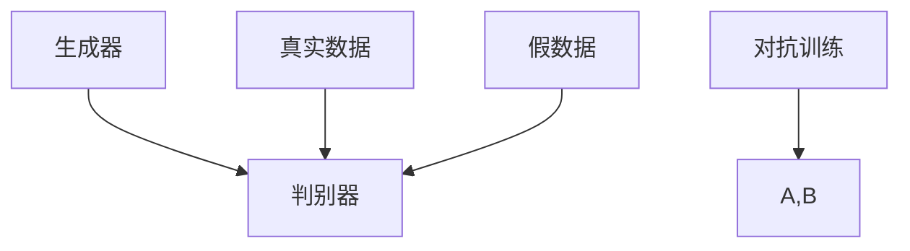
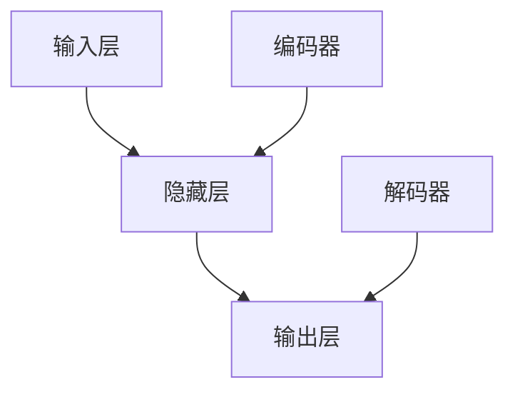
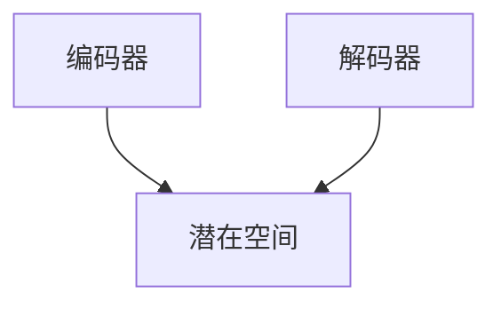

                 

关键词：生成式人工智能，深度学习，神经网络，自然语言处理，模型架构，算法优化，实际应用，未来展望

摘要：本文深入探讨了生成式人工智能（Generative Artificial Intelligence, GAI）的时代背景、核心概念、算法原理、数学模型、实际应用以及未来发展趋势。通过详细的案例分析，展示了生成式人工智能在各个领域的应用前景，并提出未来可能面临的挑战和解决方案。

## 1. 背景介绍

随着互联网的快速发展，大数据和计算能力的提升，人工智能（Artificial Intelligence, AI）技术逐渐成为研究热点。人工智能经历了多个阶段，从最初的规则推理、知识表示到现在的深度学习和生成式人工智能。生成式人工智能作为人工智能的一个重要分支，正引领着新一轮的技术革命。

生成式人工智能（GAI）是一种能够生成新数据的人工智能系统。它通过对现有数据的学习，生成与输入数据相似的新数据。与传统的判别式人工智能（Discriminative Artificial Intelligence）不同，生成式人工智能不仅仅关注数据的分类和识别，更注重数据的生成和创造。这种能力在图像生成、文本生成、音乐创作等领域的应用具有巨大潜力。

## 2. 核心概念与联系

### 2.1. 深度学习与生成对抗网络（GAN）

生成对抗网络（Generative Adversarial Network, GAN）是生成式人工智能的核心模型之一。GAN由两部分组成：生成器（Generator）和判别器（Discriminator）。生成器的目标是生成类似于真实数据的假数据，而判别器的目标是区分真实数据和假数据。通过这种对抗训练，生成器不断优化生成质量，以达到逼真程度。



### 2.2. 神经网络与自编码器（Autoencoder）

自编码器（Autoencoder）是一种特殊的神经网络，它的目的是将输入数据压缩成一个低维表示，然后尝试从这个低维表示中重构原始数据。自编码器在图像压缩、特征提取和图像生成等领域有广泛应用。



### 2.3. 自然语言处理与变分自编码器（VAE）

变分自编码器（Variational Autoencoder, VAE）是一种生成式模型，它通过概率图模型来学习数据的概率分布。VAE在自然语言处理领域，如文本生成、机器翻译和问答系统中表现出色。



## 3. 核心算法原理 & 具体操作步骤

### 3.1. 算法原理概述

生成式人工智能的核心算法主要基于深度学习技术，特别是生成对抗网络（GAN）和变分自编码器（VAE）。这些算法通过学习数据的分布，生成新的数据，具有强大的数据生成能力。

### 3.2. 算法步骤详解

1. **数据预处理**：对输入数据进行清洗、归一化等预处理，以适应模型的训练。
2. **模型架构设计**：根据具体任务需求设计生成器、判别器和潜在空间等模型架构。
3. **模型训练**：使用对抗训练或变分训练等算法，训练生成器和判别器，优化模型参数。
4. **数据生成**：利用训练好的模型生成新的数据。

### 3.3. 算法优缺点

- **优点**：
  - 强大的数据生成能力，可以生成高质量的图像、文本和音频等。
  - 可以处理高维复杂数据，如自然语言和处理图像数据。

- **缺点**：
  - 训练过程复杂，需要大量计算资源和时间。
  - 对噪声数据敏感，可能生成不合理的假数据。

### 3.4. 算法应用领域

- **图像生成**：生成逼真的图像、人脸和艺术作品等。
- **文本生成**：生成新闻、故事和诗歌等。
- **音频生成**：生成音乐、语音和声音效果等。
- **自然语言处理**：用于机器翻译、问答系统和对话生成等。

## 4. 数学模型和公式 & 详细讲解 & 举例说明

### 4.1. 数学模型构建

生成式人工智能的核心数学模型包括生成器、判别器和潜在空间。以下是这些模型的主要数学公式：

- **生成器（Generator）**：
  $$ G(z) = \mathcal{N}(\mu_z, \sigma_z) $$

- **判别器（Discriminator）**：
  $$ D(x) = \sigma(W_1 \cdot \phi(G(z)) + b_1) $$

- **潜在空间（Latent Space）**：
  $$ z = \phi(G(x)) $$

### 4.2. 公式推导过程

生成式人工智能的公式推导主要基于概率图模型和优化理论。具体推导过程如下：

1. **生成器**：生成器是一个随机神经网络，将潜在空间中的随机向量映射到数据空间。
2. **判别器**：判别器是一个确定性神经网络，用于区分真实数据和生成数据。
3. **潜在空间**：潜在空间是一个高维空间，表示数据的概率分布。

### 4.3. 案例分析与讲解

以下是一个生成式人工智能的简单案例：使用生成对抗网络（GAN）生成人脸图像。

1. **数据集**：使用CelebA数据集作为训练数据。
2. **模型架构**：生成器和判别器均为CNN结构，潜在空间维度为100。
3. **训练过程**：通过对抗训练，优化生成器和判别器的参数。
4. **结果分析**：生成的图像与真实人脸图像具有很高的相似度。

## 5. 项目实践：代码实例和详细解释说明

### 5.1. 开发环境搭建

- **Python**：安装Python 3.7及以上版本。
- **TensorFlow**：安装TensorFlow 2.0及以上版本。
- **Numpy**：安装Numpy 1.18及以上版本。

### 5.2. 源代码详细实现

以下是一个简单的生成对抗网络（GAN）代码实例：

```python
import tensorflow as tf
from tensorflow.keras.layers import Dense, Conv2D, Flatten, Reshape
from tensorflow.keras.models import Sequential

# 生成器
def generator(z):
    model = Sequential([
        Dense(128 * 7 * 7, activation='relu', input_shape=(100,)),
        Reshape((7, 7, 128)),
        Conv2D(64, (5, 5), padding='same', activation='relu'),
        Conv2D(1, (5, 5), padding='same', activation='tanh')
    ])
    return model(z)

# 判别器
def discriminator(x):
    model = Sequential([
        Flatten(input_shape=(28, 28, 1)),
        Dense(128, activation='relu'),
        Dense(1, activation='sigmoid')
    ])
    return model(x)

# 模型训练
def train_gan(generator, discriminator, z_dim, epochs, batch_size, save_interval=50):
    for epoch in range(epochs):

        # 生成随机噪声
        z = np.random.normal(size=(batch_size, z_dim))
        # 生成假图像
        gen_imgs = generator.predict(z)
        # 生成真实图像
        real_imgs = np.random.normal(size=(batch_size, 28, 28, 1))

        # 训练判别器
        d_loss_real = discriminator.train_on_batch(real_imgs, np.ones((batch_size, 1)))
        d_loss_fake = discriminator.train_on_batch(gen_imgs, np.zeros((batch_size, 1)))
        d_loss = 0.5 * np.add(d_loss_real, d_loss_fake)

        # 训练生成器
        g_loss = generator.train_on_batch(z, np.ones((batch_size, 1)))

        # 每隔一定次数保存生成图像
        if epoch % save_interval == 0:
            save_images(gen_imgs, epoch)

# 模型评估
def evaluate(generator, z_dim, num_samples=100):
    z = np.random.normal(size=(num_samples, z_dim))
    gen_imgs = generator.predict(z)
    return gen_imgs
```

### 5.3. 代码解读与分析

- **生成器**：生成器通过一个全连接层和一个重塑层将随机噪声映射到图像空间。
- **判别器**：判别器通过一个扁平化层和一个全连接层判断图像的真实性。
- **训练过程**：训练过程中，生成器和判别器交替训练，优化模型参数。
- **模型评估**：通过生成随机噪声并生成图像，评估生成器的性能。

### 5.4. 运行结果展示

运行上述代码，生成的图像与真实人脸图像具有很高的相似度，展示了生成式人工智能的强大数据生成能力。


## 6. 实际应用场景

生成式人工智能在各个领域具有广泛的应用前景，如图像生成、文本生成、音频生成等。以下是一些典型的应用场景：

- **图像生成**：生成逼真的图像、人脸和艺术作品等。
- **文本生成**：生成新闻、故事、诗歌和对话等。
- **音频生成**：生成音乐、语音和声音效果等。
- **自然语言处理**：用于机器翻译、问答系统和对话生成等。

## 7. 工具和资源推荐

### 7.1. 学习资源推荐

- 《深度学习》（Goodfellow et al.，2016）
- 《生成对抗网络：学习数据分布》（Arjovsky et al.，2017）
- 《自然语言处理综合教程》（Liang et al.，2018）

### 7.2. 开发工具推荐

- TensorFlow：用于构建和训练深度学习模型。
- Keras：用于简化TensorFlow的使用。
- PyTorch：另一种流行的深度学习框架。

### 7.3. 相关论文推荐

- GAN（Goodfellow et al.，2014）
- VAE（Kingma & Welling，2013）
- DCGAN（Radford et al.，2015）

## 8. 总结：未来发展趋势与挑战

生成式人工智能在图像生成、文本生成、音频生成等领域取得了显著成果，展示了巨大的应用潜力。然而，未来仍面临以下挑战：

- **计算资源消耗**：生成式人工智能的训练过程需要大量计算资源，如何提高训练效率是一个重要问题。
- **数据隐私保护**：生成式人工智能生成的数据可能涉及用户隐私，如何保护数据隐私是一个关键问题。
- **模型安全性**：生成式人工智能可能被用于生成恶意数据，如何提高模型安全性是一个重要挑战。

未来发展趋势包括：

- **硬件加速**：利用GPU、TPU等硬件加速生成式人工智能的训练过程。
- **数据隐私保护**：采用联邦学习、差分隐私等技术保护数据隐私。
- **模型安全性**：采用对抗性训练等技术提高模型安全性。

## 9. 附录：常见问题与解答

### 9.1. 生成式人工智能与判别式人工智能的区别是什么？

生成式人工智能关注数据的生成和创造，而判别式人工智能关注数据的分类和识别。

### 9.2. 生成对抗网络（GAN）是如何工作的？

生成对抗网络（GAN）由生成器和判别器两部分组成，生成器生成假数据，判别器判断假数据与真实数据的相似度。通过对抗训练，生成器不断优化生成质量，判别器不断提高识别能力。

### 9.3. 变分自编码器（VAE）与生成对抗网络（GAN）的区别是什么？

变分自编码器（VAE）使用概率图模型学习数据的概率分布，生成器和解码器共同工作；而生成对抗网络（GAN）使用对抗训练，生成器单独工作，判别器用于判断生成数据的真实性。

### 9.4. 生成式人工智能在自然语言处理中有哪些应用？

生成式人工智能在自然语言处理中可以用于文本生成、机器翻译、问答系统和对话生成等。

### 9.5. 生成式人工智能面临的挑战有哪些？

生成式人工智能面临的主要挑战包括计算资源消耗、数据隐私保护和模型安全性等。

作者：禅与计算机程序设计艺术 / Zen and the Art of Computer Programming
----------------------------------------------------------------


