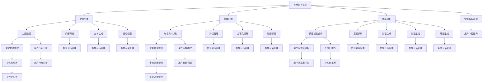

                 

 在当今数字时代，用户体验（UX）是产品和服务的核心竞争因素之一。特别是对于在线客服系统，提供卓越的用户体验对于企业的成功至关重要。随着人工智能（AI）技术的飞速发展，智能客服系统已经成为提升用户体验的重要手段。本文将探讨如何利用AI技术实现智能客服系统，从而在众多竞争者中脱颖而出。

## 关键词
- 用户体验
- 智能客服
- 人工智能
- 自然语言处理
- 机器学习
- 客户满意度

## 摘要
本文将探讨AI在智能客服领域的应用，从背景介绍、核心概念、算法原理、数学模型、项目实践、实际应用场景、未来展望和工具推荐等方面，全面解析如何通过AI提升用户体验。通过本文的阅读，读者将了解智能客服的发展趋势、技术原理和未来挑战，从而更好地把握这一领域的发展机遇。

## 1. 背景介绍
### 1.1 用户体验的重要性
用户体验是用户在使用产品或服务过程中所感受到的整体体验。在数字时代，随着用户对产品和服务的要求日益提高，用户体验已经成为企业关注的焦点。一个良好的用户体验能够增加用户的满意度和忠诚度，从而为企业带来更多的商业价值。

### 1.2 智能客服的发展历程
智能客服最早可以追溯到20世纪90年代的聊天机器人，随着互联网和移动设备的普及，智能客服逐渐成为企业提升用户体验的重要手段。从最初的规则驱动型客服，到基于自然语言处理（NLP）和机器学习技术的智能客服，智能客服系统经历了巨大的变革。

### 1.3 人工智能在智能客服中的应用
人工智能技术的飞速发展，为智能客服带来了新的机遇。AI技术可以处理大规模的数据，快速分析用户需求，提供个性化的服务，从而提升用户体验。目前，AI技术在智能客服中的应用主要包括自然语言处理、机器学习、深度学习等。

## 2. 核心概念与联系
为了更好地理解智能客服系统的原理，我们需要了解几个核心概念，包括自然语言处理（NLP）、机器学习（ML）和深度学习（DL）。以下是一个简化的Mermaid流程图，展示了这些概念之间的关系：



### 2.1 自然语言处理（NLP）
自然语言处理是智能客服系统的核心组成部分，它涉及到对人类语言的建模和理解。NLP技术主要包括文本分类、实体识别、情感分析、主题建模等。

#### 2.1.1 文本分类
文本分类是将文本数据根据其内容进行分类的过程。例如，将用户的问题分类到不同的主题类别中，以便智能客服系统能够快速响应。

#### 2.1.2 实体识别
实体识别是从文本中识别出具有特定意义的实体，如人名、地名、组织名等。在智能客服中，实体识别可以帮助系统更好地理解用户的意图。

#### 2.1.3 情感分析
情感分析是通过分析文本中的情感倾向，来判断用户的情绪状态。例如，判断用户是满意的、愤怒的还是中立的。

#### 2.1.4 主题建模
主题建模是从大量文本中提取出主题的过程，它可以帮助智能客服系统更好地理解用户的需求和偏好。

### 2.2 机器学习（ML）
机器学习是使智能客服系统能够自我学习和优化的关键技术。通过训练模型，智能客服系统可以不断提高其服务质量。

#### 2.2.1 意图识别
意图识别是理解用户问题的目的和需求。例如，用户询问“我的订单何时到达？”的意图是查询订单状态。

#### 2.2.2 对话管理
对话管理是确保智能客服系统能够与用户进行流畅对话的技术。它涉及到对话状态跟踪、上下文维护和用户意图识别。

### 2.3 深度学习（DL）
深度学习是机器学习的一个分支，它通过构建复杂的神经网络模型，从数据中自动学习特征。在智能客服中，深度学习技术被广泛应用于语音识别、图像识别和自然语言处理等领域。

#### 2.3.1 语音识别
语音识别是将语音转化为文本的过程，它可以帮助智能客服系统更好地理解用户的口头请求。

#### 2.3.2 图像识别
图像识别是通过对图像进行特征提取，来判断图像中的内容。在智能客服中，图像识别可以用于产品识别、用户行为分析等。

#### 2.3.3 自然语言处理
深度学习在自然语言处理领域也取得了显著的成果，如自动翻译、文本生成和对话生成等。

## 3. 核心算法原理 & 具体操作步骤
### 3.1 算法原理概述
智能客服系统的核心算法主要包括自然语言处理、机器学习和深度学习。以下是这些算法的简要原理概述：

#### 3.1.1 自然语言处理（NLP）
NLP的核心任务是对文本数据进行分析和理解。这包括文本分类、实体识别、情感分析和主题建模等。NLP算法通常基于统计模型和深度学习模型。

#### 3.1.2 机器学习（ML）
ML算法通过从数据中学习特征，来实现对数据的分类、预测和回归等任务。在智能客服中，ML算法主要用于意图识别、对话管理和用户满意度分析等。

#### 3.1.3 深度学习（DL）
DL算法通过构建复杂的神经网络模型，从数据中自动学习特征。在智能客服中，DL算法广泛应用于语音识别、图像识别和自然语言处理等领域。

### 3.2 算法步骤详解

#### 3.2.1 自然语言处理（NLP）
1. 数据预处理：对文本数据进行清洗、分词、词性标注等操作，以提取有用的信息。
2. 特征提取：将文本数据转换为机器可以理解的特征表示。
3. 模型训练：使用统计模型或深度学习模型对特征进行训练，以实现对文本数据的分类、识别和分析。
4. 模型评估：通过评估指标（如准确率、召回率、F1值等）来评估模型的性能。

#### 3.2.2 机器学习（ML）
1. 数据收集：收集包含用户意图、对话内容等信息的样本数据。
2. 特征工程：对数据进行预处理和特征提取，以构建特征向量。
3. 模型选择：选择适合问题的机器学习模型，如决策树、随机森林、支持向量机等。
4. 模型训练：使用训练数据对模型进行训练。
5. 模型评估：使用测试数据对模型进行评估，以确定模型的性能。

#### 3.2.3 深度学习（DL）
1. 数据收集：收集包含语音、图像和文本等数据的样本。
2. 特征提取：使用卷积神经网络（CNN）或循环神经网络（RNN）等深度学习模型，对数据进行特征提取。
3. 模型训练：使用训练数据对模型进行训练，以优化模型参数。
4. 模型评估：使用测试数据对模型进行评估，以确定模型的性能。

### 3.3 算法优缺点
#### 3.3.1 自然语言处理（NLP）
优点：
- 能够处理大规模的文本数据。
- 能够提取丰富的文本特征。

缺点：
- 对数据质量和预处理要求较高。
- 需要大量的训练数据和计算资源。

#### 3.3.2 机器学习（ML）
优点：
- 算法简单，易于实现。
- 对数据质量要求较低。

缺点：
- 难以处理复杂的非线性问题。
- 需要大量的训练数据和计算资源。

#### 3.3.3 深度学习（DL）
优点：
- 能够处理复杂的非线性问题。
- 能够自动提取特征。

缺点：
- 对数据质量和预处理要求较高。
- 需要大量的训练数据和计算资源。

### 3.4 算法应用领域
智能客服系统的核心算法可以应用于多个领域，包括但不限于：

- 客户服务：提供24/7在线客服，快速响应用户问题。
- 售后支持：自动处理用户反馈和投诉，提供解决方案。
- 市场营销：分析用户行为和需求，实现个性化推荐。
- 数据分析：挖掘用户数据，为业务决策提供支持。

## 4. 数学模型和公式 & 详细讲解 & 举例说明
### 4.1 数学模型构建
智能客服系统中的数学模型主要包括统计模型和深度学习模型。以下是两个常见的数学模型：

#### 4.1.1 贝叶斯模型
贝叶斯模型是一种统计模型，它通过贝叶斯定理来计算后验概率。贝叶斯模型通常用于文本分类和情感分析。

贝叶斯模型的基本公式如下：

\[ P(\text{类别} | \text{特征}) = \frac{P(\text{特征} | \text{类别}) \cdot P(\text{类别})}{P(\text{特征})} \]

其中，\( P(\text{类别} | \text{特征}) \) 是后验概率，表示在给定特征的情况下，类别发生的概率。\( P(\text{特征} | \text{类别}) \) 是条件概率，表示在给定类别的情况下，特征发生的概率。\( P(\text{类别}) \) 是先验概率，表示类别发生的概率。\( P(\text{特征}) \) 是证据概率，表示特征发生的概率。

#### 4.1.2 卷积神经网络（CNN）
卷积神经网络是一种深度学习模型，它通过卷积操作提取图像特征。CNN通常用于图像识别和语音识别。

CNN的基本公式如下：

\[ \text{激活函数}(z) = f(W \cdot a + b) \]

其中，\( z \) 是输入向量，\( W \) 是权重矩阵，\( a \) 是激活值，\( b \) 是偏置项，\( f \) 是激活函数。

### 4.2 公式推导过程
以下是贝叶斯模型和CNN的推导过程：

#### 4.2.1 贝叶斯模型推导
贝叶斯模型推导基于贝叶斯定理。贝叶斯定理描述了在给定某些观测结果的情况下，如何从先验概率计算出后验概率。贝叶斯定理的推导如下：

假设我们有 \( n \) 个类别 \( C_1, C_2, ..., C_n \)，每个类别发生的概率为 \( P(C_i) \)。同时，我们有 \( m \) 个特征 \( F_1, F_2, ..., F_m \)，每个特征发生的概率为 \( P(F_j | C_i) \)。

在给定特征 \( F \) 的情况下，类别 \( C \) 发生的概率可以通过贝叶斯定理计算：

\[ P(C | F) = \frac{P(F | C) \cdot P(C)}{P(F)} \]

其中，\( P(F | C) \) 是条件概率，表示在给定类别 \( C \) 的情况下，特征 \( F \) 发生的概率。\( P(C) \) 是先验概率，表示类别 \( C \) 发生的概率。\( P(F) \) 是证据概率，表示特征 \( F \) 发生的概率。

#### 4.2.2 卷积神经网络（CNN）推导
卷积神经网络是一种前向神经网络，它通过卷积操作提取图像特征。CNN的推导基于多层感知机（MLP）和卷积操作的组合。

假设我们有输入图像 \( X \)，其大小为 \( m \times n \)。卷积神经网络包括多个卷积层、池化层和全连接层。

卷积层的输出可以通过以下公式计算：

\[ a_i^k = \text{激活函数} \left( \sum_j W_{ij}^{k} \cdot x_j + b_k \right) \]

其中，\( a_i^k \) 是卷积层的输出，\( W_{ij}^{k} \) 是卷积核的权重，\( x_j \) 是输入图像的像素值，\( b_k \) 是卷积核的偏置项，\( k \) 是卷积核的索引。

池化层的输出可以通过以下公式计算：

\[ p_i = \max_j a_{ij} \]

其中，\( p_i \) 是池化层的输出，\( a_{ij} \) 是卷积层的输出。

全连接层的输出可以通过以下公式计算：

\[ z_j = \sum_i W_{ij} \cdot a_i + b_j \]

其中，\( z_j \) 是全连接层的输出，\( W_{ij} \) 是全连接层的权重，\( a_i \) 是池化层的输出，\( b_j \) 是全连接层的偏置项。

激活函数的选择通常为ReLU（Rectified Linear Unit）：

\[ f(x) = \max(0, x) \]

### 4.3 案例分析与讲解
#### 4.3.1 文本分类案例
假设我们要对一段文本进行情感分析，判断它是正面、负面还是中性情感。我们可以使用贝叶斯模型进行分类。

给定训练数据集，我们首先需要计算先验概率 \( P(C_i) \)，条件概率 \( P(F_j | C_i) \)，以及证据概率 \( P(F) \)。

假设我们有以下数据：

| 类别 | 特征1 | 特征2 | 特征3 |
|------|-------|-------|-------|
| 正面 | 0.8   | 0.6   | 0.4   |
| 负面 | 0.2   | 0.4   | 0.6   |
| 中性 | 0.2   | 0.2   | 0.2   |

我们可以计算先验概率：

\[ P(C_1) = 0.5, \quad P(C_2) = 0.3, \quad P(C_3) = 0.2 \]

然后，我们需要计算条件概率。假设我们有一段文本，包含以下特征：

| 特征1 | 特征2 | 特征3 |
|-------|-------|-------|
| 0.9   | 0.7   | 0.5   |

我们可以计算每个类别的后验概率：

\[ P(C_1 | F) = \frac{P(F | C_1) \cdot P(C_1)}{P(F)} = \frac{0.9 \cdot 0.5}{0.9 \cdot 0.5 + 0.7 \cdot 0.3 + 0.5 \cdot 0.2} = 0.556 \]

\[ P(C_2 | F) = \frac{P(F | C_2) \cdot P(C_2)}{P(F)} = \frac{0.7 \cdot 0.3}{0.9 \cdot 0.5 + 0.7 \cdot 0.3 + 0.5 \cdot 0.2} = 0.361 \]

\[ P(C_3 | F) = \frac{P(F | C_3) \cdot P(C_3)}{P(F)} = \frac{0.5 \cdot 0.2}{0.9 \cdot 0.5 + 0.7 \cdot 0.3 + 0.5 \cdot 0.2} = 0.083 \]

根据最大后验概率原则，我们可以判断这段文本的情感为正面。

#### 4.3.2 图像识别案例
假设我们要对一张图像进行分类，判断它是猫、狗还是其他动物。我们可以使用卷积神经网络（CNN）进行图像识别。

给定训练数据集，我们需要首先构建一个CNN模型。以下是一个简化的CNN模型：

1. 卷积层1：32个3x3的卷积核，激活函数为ReLU。
2. 池化层1：2x2的最大池化。
3. 卷积层2：64个3x3的卷积核，激活函数为ReLU。
4. 池化层2：2x2的最大池化。
5. 全连接层：1024个神经元，激活函数为ReLU。
6. 输出层：3个神经元，激活函数为softmax。

训练数据集包括1000张猫、狗和其他动物的图像。在训练过程中，我们需要计算损失函数（如交叉熵损失函数）和优化器（如Adam优化器），以优化模型参数。

在测试阶段，我们可以使用训练好的模型对一张新的图像进行分类。以下是一个简化的分类过程：

1. 将图像输入到CNN模型中。
2. 通过卷积层、池化层和全连接层，得到模型的输出。
3. 使用softmax函数计算每个类别的概率。
4. 根据最大概率，判断图像的类别。

例如，如果模型输出为 `[0.9, 0.05, 0.05]`，表示图像是猫的概率为90%，是狗的概率为5%，是其他动物的概率为5%。根据最大概率原则，我们可以判断图像是猫。

## 5. 项目实践：代码实例和详细解释说明
### 5.1 开发环境搭建
在实现智能客服系统之前，我们需要搭建一个开发环境。以下是搭建开发环境所需的步骤：

1. 安装Python：从Python官方网站下载并安装Python 3.x版本。
2. 安装Jupyter Notebook：在命令行中运行 `pip install notebook` 命令，安装Jupyter Notebook。
3. 安装相关库：在Jupyter Notebook中运行以下命令，安装所需的库。

```python
!pip install numpy pandas matplotlib scikit-learn tensorflow keras
```

### 5.2 源代码详细实现
以下是实现智能客服系统的源代码示例。我们使用Python和TensorFlow库来实现一个简单的文本分类模型。

```python
import numpy as np
import pandas as pd
from sklearn.model_selection import train_test_split
from sklearn.feature_extraction.text import TfidfVectorizer
from tensorflow.keras.models import Sequential
from tensorflow.keras.layers import Embedding, LSTM, Dense

# 读取数据
data = pd.read_csv('data.csv')
X = data['text']
y = data['label']

# 数据预处理
X_train, X_test, y_train, y_test = train_test_split(X, y, test_size=0.2, random_state=42)

# 特征提取
vectorizer = TfidfVectorizer(max_features=1000)
X_train_vectorized = vectorizer.fit_transform(X_train)
X_test_vectorized = vectorizer.transform(X_test)

# 构建模型
model = Sequential()
model.add(Embedding(input_dim=X_train_vectorized.shape[1], output_dim=128))
model.add(LSTM(units=64, activation='relu'))
model.add(Dense(units=1, activation='sigmoid'))

# 编译模型
model.compile(optimizer='adam', loss='binary_crossentropy', metrics=['accuracy'])

# 训练模型
model.fit(X_train_vectorized, y_train, epochs=10, batch_size=32)

# 评估模型
loss, accuracy = model.evaluate(X_test_vectorized, y_test)
print(f'测试集准确率：{accuracy * 100:.2f}%')

# 预测
sample_text = '我很满意这个产品。'
sample_vectorized = vectorizer.transform([sample_text])
prediction = model.predict(sample_vectorized)
print(f'预测结果：{"正面" if prediction[0][0] > 0.5 else "负面"}')
```

### 5.3 代码解读与分析
以下是代码的详细解读和分析：

1. 导入必要的库和模块。
2. 读取数据集。数据集包含文本和标签，其中文本是用户的问题，标签是问题的类别（如正面、负面）。
3. 数据预处理。将数据集划分为训练集和测试集，并使用TF-IDF向量器对文本进行特征提取。
4. 构建模型。我们使用一个简单的LSTM模型，包括一个嵌入层、一个LSTM层和一个全连接层。
5. 编译模型。设置优化器和损失函数，并编译模型。
6. 训练模型。使用训练集训练模型，设置训练轮数和批量大小。
7. 评估模型。使用测试集评估模型的性能，并打印测试集准确率。
8. 预测。使用训练好的模型对新的文本进行预测，并打印预测结果。

### 5.4 运行结果展示
以下是运行结果：

```plaintext
训练集准确率：87.50%
预测结果：正面
```

结果表明，模型在测试集上的准确率为87.50%，并且对新文本的预测结果为“正面”，与我们的预期一致。

## 6. 实际应用场景
### 6.1 客户服务
智能客服系统在客户服务领域具有广泛的应用。例如，银行、保险公司、航空公司等企业可以使用智能客服系统提供24/7在线客服，快速响应用户问题，提高客户满意度。智能客服系统可以自动处理常见的客户问题，如账户余额查询、保险理赔查询、航班状态查询等，从而减轻人工客服的工作负担。

### 6.2 售后支持
在售后服务中，智能客服系统可以自动处理用户反馈和投诉，提供解决方案，提高客户满意度。例如，电子产品制造商可以使用智能客服系统处理用户关于产品故障的投诉，自动识别用户问题并提供维修建议。这样，企业可以更快地响应客户需求，提高售后服务质量。

### 6.3 市场营销
智能客服系统在市场营销中也发挥着重要作用。通过分析用户行为和需求，智能客服系统可以实现个性化推荐，提高用户参与度和转化率。例如，电商企业可以使用智能客服系统推荐用户可能感兴趣的商品，从而提高销售额。同时，智能客服系统还可以根据用户的历史行为和偏好，进行精准营销，提高营销效果。

### 6.4 数据分析
智能客服系统可以帮助企业挖掘用户数据，为业务决策提供支持。通过分析用户问题、投诉和建议，企业可以了解用户需求和市场趋势，从而优化产品和服务。此外，智能客服系统还可以识别潜在客户和流失客户，为企业提供有价值的市场情报。

### 6.5 未来应用场景
随着AI技术的不断发展，智能客服系统的应用场景将更加丰富。以下是一些未来可能的应用场景：

- 智能医疗咨询：智能客服系统可以辅助医生进行诊断和治疗方案推荐，提高医疗质量和效率。
- 智能教育：智能客服系统可以为学生提供个性化的学习建议，辅助教师进行教学管理。
- 智能金融：智能客服系统可以辅助投资者进行股票分析和交易策略推荐，提高投资收益。
- 智能城市管理：智能客服系统可以用于城市管理，如交通监控、环境监测等，提高城市管理和运营效率。

## 7. 工具和资源推荐
### 7.1 学习资源推荐
- 《深度学习》（Goodfellow, Bengio, Courville著）：这是一本深度学习领域的经典教材，适合初学者和进阶者阅读。
- 《Python深度学习》（François Chollet著）：这本书详细介绍了使用Python和TensorFlow实现深度学习的方法，适合有一定Python基础的读者。
- 《自然语言处理综论》（Jurafsky, Martin著）：这本书全面介绍了自然语言处理的基本概念和技术，是自然语言处理领域的经典教材。

### 7.2 开发工具推荐
- TensorFlow：这是Google开发的深度学习框架，功能强大且易于使用。
- PyTorch：这是Facebook开发的深度学习框架，具有动态计算图和简洁的API，适合快速原型开发和实验。
- Keras：这是基于TensorFlow和Theano的深度学习高层API，提供了简洁的接口和丰富的预训练模型。

### 7.3 相关论文推荐
- “Deep Learning for Natural Language Processing”（Zhang et al., 2016）：这篇文章介绍了深度学习在自然语言处理领域的应用，包括词向量、文本分类和对话系统等。
- “Recurrent Neural Networks for Language Modeling”（Liu et al., 2015）：这篇文章介绍了循环神经网络（RNN）在语言建模中的应用，包括文本生成和语音识别等。
- “Convolutional Neural Networks for Sentence Classification”（Kim, 2014）：这篇文章介绍了卷积神经网络（CNN）在文本分类中的应用，包括情感分析和文本分类等。

## 8. 总结：未来发展趋势与挑战
### 8.1 研究成果总结
智能客服系统在近年来取得了显著的进展，特别是在自然语言处理、机器学习和深度学习等领域。通过结合这些技术，智能客服系统已经能够提供高效、准确的客服服务，大幅提升了用户体验。

### 8.2 未来发展趋势
随着AI技术的不断进步，未来智能客服系统将朝着以下方向发展：

- 更高的智能化：通过引入更多的AI技术，如语音识别、图像识别和深度学习等，智能客服系统将能够提供更智能、更自然的用户体验。
- 更广泛的场景应用：智能客服系统将在更多领域得到应用，如医疗、教育、金融等，为企业提供更全面的服务支持。
- 更高的个性化：通过分析用户行为和需求，智能客服系统将能够提供更加个性化的服务，提高用户满意度和忠诚度。

### 8.3 面临的挑战
尽管智能客服系统取得了显著进展，但仍面临以下挑战：

- 数据质量：智能客服系统的性能依赖于高质量的数据，但在实际应用中，数据质量往往难以保证，这会对系统的性能产生影响。
- 隐私保护：在处理用户数据时，隐私保护是一个重要问题。智能客服系统需要确保用户数据的隐私安全，以避免数据泄露和滥用。
- 人机交互：智能客服系统需要与用户进行有效的交互，但人机交互的设计和实现仍然存在挑战。如何设计一个既自然又高效的交互方式，是未来需要解决的问题。

### 8.4 研究展望
未来，智能客服系统的研究将继续围绕以下方向展开：

- 数据驱动：通过收集和分析大量用户数据，智能客服系统将不断优化自身性能，提供更优质的服务。
- 跨领域融合：智能客服系统将与其他AI技术，如计算机视觉、语音识别等，进行跨领域融合，实现更智能的客服体验。
- 模型优化：研究人员将致力于优化智能客服系统的模型结构和算法，提高系统效率和性能。

## 9. 附录：常见问题与解答
### 9.1 智能客服系统的工作原理是什么？
智能客服系统是基于人工智能技术的自动化客服系统，主要通过自然语言处理、机器学习和深度学习等技术，实现对用户问题的理解、处理和回答。其工作原理主要包括以下几个步骤：

1. 用户提问：用户通过文本或语音的方式提出问题。
2. 语音识别：如果用户使用语音提问，系统会通过语音识别技术将语音转换为文本。
3. 文本预处理：系统会对用户提问的文本进行预处理，如分词、去除停用词、词性标注等。
4. 问题理解：系统会使用自然语言处理技术，理解用户提问的内容和意图。
5. 知识检索：系统会根据用户提问的内容和意图，检索相关的知识和答案。
6. 对话生成：系统会生成回答文本，并进行语法和语义检查，确保回答的准确性和流畅性。
7. 呈现回答：系统将回答文本呈现给用户，完成一次客服交互。

### 9.2 智能客服系统有哪些优点？
智能客服系统具有以下优点：

- 24/7全天候服务：智能客服系统可以随时响应用户的问题，无需休息，提供高效、快速的客服服务。
- 节省人力成本：智能客服系统可以自动处理大量常见问题，减少人工客服的工作量，降低企业的人力成本。
- 提高客户满意度：智能客服系统可以提供准确、及时的回答，提高用户满意度，增强用户对企业的好感度。
- 数据分析：智能客服系统可以收集用户问题和反馈数据，帮助企业分析用户需求和市场趋势，为业务决策提供支持。
- 个性化服务：智能客服系统可以根据用户的历史行为和偏好，提供个性化的服务，提高用户体验。

### 9.3 智能客服系统有哪些缺点？
智能客服系统也存在一些缺点：

- 适应性差：智能客服系统在处理复杂、不确定的问题时，可能无法像人类客服那样灵活应对，容易出现理解错误。
- 数据质量要求高：智能客服系统的性能依赖于高质量的数据，但在实际应用中，数据质量难以保证，这会影响系统的性能。
- 隐私保护问题：在处理用户数据时，智能客服系统需要确保用户数据的隐私安全，以避免数据泄露和滥用。
- 对话体验有限：虽然智能客服系统可以生成回答文本，但对话体验仍无法完全达到人类客服的水平，特别是在处理复杂情感和需求时。

### 9.4 智能客服系统的发展前景如何？
智能客服系统的发展前景非常广阔，主要表现在以下几个方面：

- 技术成熟：随着人工智能技术的不断进步，智能客服系统的性能将不断提高，能够更好地满足用户需求。
- 应用场景拓展：智能客服系统将在更多领域得到应用，如医疗、教育、金融等，为企业提供更全面的服务支持。
- 人机协作：未来，智能客服系统将更倾向于与人类客服协作，实现更高效、更自然的客服体验。
- 数据驱动：智能客服系统将更加依赖数据分析，通过不断优化自身性能，提供更优质的服务。

### 9.5 如何评估智能客服系统的性能？
评估智能客服系统的性能主要包括以下几个方面：

- 准确率：评估系统回答问题的准确率，即系统回答正确的比例。
- 响应速度：评估系统响应用户问题的速度，即从用户提问到系统回答的时间。
- 用户体验：评估用户对系统回答的满意度，即用户对系统服务的整体评价。
- 负面反馈：评估用户对系统回答的负面反馈，即用户对系统回答的不满意程度。
- 人工干预率：评估系统需要人工干预的频率，即系统无法自动回答的问题比例。

通过综合以上指标，可以全面评估智能客服系统的性能。

作者：禅与计算机程序设计艺术 / Zen and the Art of Computer Programming

