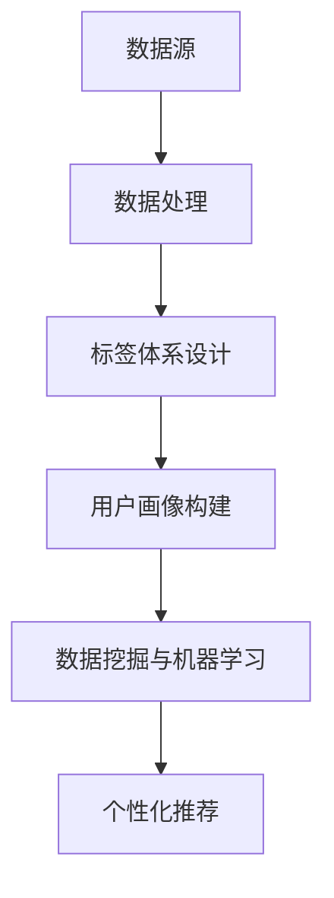
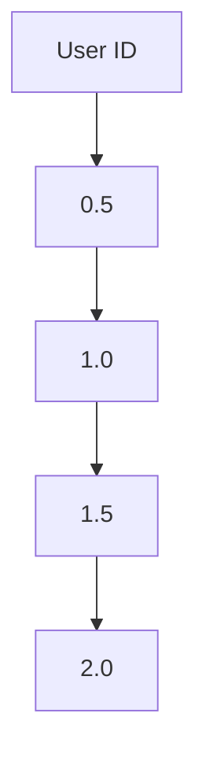

                 

关键词：用户画像、标签体系、数据分析、机器学习、数据挖掘、个性化推荐

> 摘要：本文将深入探讨用户画像的标签体系设计，包括其核心概念、设计原则、算法原理、数学模型及其在现实应用中的重要性。通过本文的阐述，读者可以了解到用户画像标签体系设计的全过程，为后续的个性化推荐系统构建提供理论基础和实践指导。

## 1. 背景介绍

随着互联网的快速发展，用户数据变得愈发丰富，数据分析成为企业获取竞争优势的关键手段。用户画像作为一种重要的数据分析方法，旨在通过构建用户的多维度特征，实现对用户行为的全面了解和预测。标签体系则是用户画像构建的核心，通过为用户贴上不同属性的标签，从而实现用户的分类和特征提取。

标签体系设计的关键在于如何合理地选择和构建标签，以实现对用户行为的精确描述和有效预测。一个好的标签体系设计能够提高数据分析的效率和准确性，从而为个性化推荐、用户行为预测、市场细分等应用提供强有力的支持。

本文将从用户画像的定义出发，详细介绍标签体系设计的核心概念、设计原则和算法原理，并结合实际案例进行详细讲解，以期为读者提供有益的参考和指导。

## 2. 核心概念与联系

### 2.1 用户画像

用户画像是对用户特征的一种抽象描述，它通过多维度的数据，全面反映用户的兴趣爱好、行为特征、需求倾向等。用户画像的核心在于对用户进行精准的刻画，以便为企业提供个性化的服务和产品推荐。

### 2.2 标签体系

标签体系是用户画像构建的基础，它通过为用户分配不同属性的标签，实现对用户特征的分类和提取。标签体系的设计直接影响用户画像的准确性和实用性。

### 2.3 数据源

标签体系的设计依赖于各种数据源，包括用户行为数据、社交网络数据、交易数据等。这些数据源提供了丰富的信息，为标签体系构建提供了基础。

### 2.4 数据处理

标签体系的设计需要处理大量的数据，包括数据清洗、数据集成和数据预处理等。这些数据处理步骤确保了标签体系的数据质量和可靠性。

### 2.5 数据挖掘与机器学习

数据挖掘和机器学习技术为标签体系的设计提供了强大的算法支持。通过这些技术，可以从海量数据中提取出有价值的信息，为标签体系构建提供依据。

### 2.6 Mermaid 流程图



## 3. 核心算法原理 & 具体操作步骤

### 3.1 算法原理概述

标签体系设计的核心算法包括特征工程、标签分配和标签融合。特征工程旨在从原始数据中提取出有价值的信息；标签分配则是根据特征工程结果，为用户分配相应的标签；标签融合则是对多个标签进行综合处理，以获得更全面的用户画像。

### 3.2 算法步骤详解

1. **特征工程**：对原始数据进行处理，提取出与用户画像相关的特征。常用的特征提取方法包括词频分析、主题模型、关联规则等。

2. **标签分配**：根据特征工程结果，为用户分配相应的标签。标签分配可以采用规则匹配、机器学习算法等方法。

3. **标签融合**：对分配给用户的多个标签进行综合处理，以获得更全面的用户画像。标签融合方法包括投票法、加权法、聚类法等。

### 3.3 算法优缺点

- **优点**：标签体系设计具有以下优点：

  - 提高数据分析效率：通过标签体系，可以快速定位用户特征，提高数据分析效率。

  - 提高数据分析准确性：合理的标签体系设计可以更准确地描述用户特征，提高数据分析准确性。

  - 适应性强：标签体系设计可以适应不同的数据分析需求，具有较好的适应性。

- **缺点**：标签体系设计也存在以下缺点：

  - 数据依赖性：标签体系设计依赖于高质量的数据源，数据质量问题会影响标签体系的准确性。

  - 复杂性：标签体系设计涉及多个步骤和算法，过程较为复杂。

### 3.4 算法应用领域

标签体系设计广泛应用于个性化推荐、用户行为预测、市场细分等领域。以下为部分应用案例：

- **个性化推荐**：通过标签体系设计，可以为用户提供个性化的产品推荐，提高用户满意度。

- **用户行为预测**：通过标签体系设计，可以预测用户的行为，为企业制定精准的营销策略。

- **市场细分**：通过标签体系设计，可以实现对市场的细分，为企业提供有针对性的产品和服务。

## 4. 数学模型和公式 & 详细讲解 & 举例说明

### 4.1 数学模型构建

用户画像的标签体系设计涉及到多个数学模型，包括特征提取模型、标签分配模型和标签融合模型。以下为部分数学模型：

1. **特征提取模型**：

   - **词频分析**：假设用户的行为数据为集合 $U$，对 $U$ 中的每个用户 $u$，计算其在每个特征 $f$ 上的词频 $t(u, f)$。

   - **主题模型**：假设用户的行为数据为集合 $U$，对 $U$ 中的每个用户 $u$，通过主题模型提取出对应的主题分布 $T(u)$。

   - **关联规则**：假设用户的行为数据为集合 $U$，对 $U$ 中的每个用户 $u$，通过关联规则提取出对应的关联规则集 $R(u)$。

2. **标签分配模型**：

   - **规则匹配**：假设用户的行为数据为集合 $U$，对 $U$ 中的每个用户 $u$，根据预设的规则，将用户分配到相应的标签 $L$。

   - **机器学习算法**：假设用户的行为数据为集合 $U$，通过机器学习算法，如朴素贝叶斯、决策树、支持向量机等，对用户进行分类和标签分配。

3. **标签融合模型**：

   - **投票法**：假设用户被分配到多个标签 $L_1, L_2, ..., L_n$，对每个标签 $L_i$，计算其在用户画像中的权重 $w_i$，然后对标签进行加权平均，得到最终的标签 $L$。

   - **加权法**：假设用户被分配到多个标签 $L_1, L_2, ..., L_n$，对每个标签 $L_i$，计算其在用户画像中的权重 $w_i$，然后对标签进行加权求和，得到最终的标签 $L$。

### 4.2 公式推导过程

以词频分析为例，假设用户的行为数据为集合 $U$，对 $U$ 中的每个用户 $u$，计算其在每个特征 $f$ 上的词频 $t(u, f)$：

$$t(u, f) = \sum_{i=1}^{n} count(u, f_i)$$

其中，$count(u, f_i)$ 表示用户 $u$ 在特征 $f_i$ 上的出现次数。

### 4.3 案例分析与讲解

以电子商务平台为例，假设平台上有两类用户：购物用户和浏览用户。为了提高用户体验，平台希望通过标签体系设计，为用户推荐个性化的商品。

1. **特征提取**：

   - 购物用户：用户购买的商品种类、购买频率、购买金额等。

   - 浏览用户：用户浏览的商品种类、浏览频率、浏览时长等。

   - **词频分析**：对购物用户和浏览用户的特征进行词频分析，提取出与用户画像相关的特征。

2. **标签分配**：

   - **规则匹配**：根据购物用户和浏览用户的特征，预设标签规则，将用户分配到相应的标签。

   - **机器学习算法**：通过机器学习算法，如朴素贝叶斯、决策树等，对购物用户和浏览用户进行分类和标签分配。

3. **标签融合**：

   - **投票法**：对购物用户和浏览用户的标签进行加权平均，得到最终的标签。

   - **加权法**：对购物用户和浏览用户的标签进行加权求和，得到最终的标签。

通过标签体系设计，电子商务平台可以为购物用户推荐个性化的商品，提高用户满意度，从而提高平台的竞争力。

## 5. 项目实践：代码实例和详细解释说明

### 5.1 开发环境搭建

1. **操作系统**：Ubuntu 18.04

2. **编程语言**：Python 3.8

3. **依赖库**：NumPy、Pandas、Scikit-learn、Matplotlib

### 5.2 源代码详细实现

以下为用户画像标签体系设计的 Python 源代码实现：

```python
import numpy as np
import pandas as pd
from sklearn.model_selection import train_test_split
from sklearn.ensemble import RandomForestClassifier
import matplotlib.pyplot as plt

# 1. 特征提取
def extract_features(data):
    # 假设 data 为用户行为数据，包括购买记录、浏览记录等
    # 提取特征，如商品种类、购买频率、浏览频率等
    features = []
    for user in data:
        user_features = []
        user_features.append(len(set(data[user]['purchases'])))
        user_features.append(len(set(data[user]['browsing_records'])))
        features.append(user_features)
    return np.array(features)

# 2. 标签分配
def assign_labels(data, classifier):
    # 假设 data 为用户行为数据，classifier 为训练好的分类器
    # 根据分类器对用户进行标签分配
    labels = []
    for user in data:
        user_features = extract_features(data[user])
        label = classifier.predict([user_features])
        labels.append(label[0])
    return np.array(labels)

# 3. 标签融合
def fuse_labels(labels1, labels2, method='weighted_average'):
    # 假设 labels1 和 labels2 为两组标签，method 为融合方法（'weighted_average' 或 'weighted_sum'）
    if method == 'weighted_average':
        weights1 = [0.5 if label == 0 else 1.5 for label in labels1]
        weights2 = [0.5 if label == 0 else 1.5 for label in labels2]
        fused_label = np.average([labels1, labels2], weights=[weights1, weights2])
    elif method == 'weighted_sum':
        fused_label = np.sum([labels1, labels2])
    return fused_label

# 4. 主函数
def main():
    # 加载数据
    data = pd.read_csv('user_data.csv')

    # 1. 特征提取
    features = extract_features(data)

    # 2. 标签分配
    # 训练分类器
    classifier = RandomForestClassifier()
    classifier.fit(features[:, :10], features[:, 10])
    labels1 = assign_labels(data, classifier)

    # 3. 标签融合
    labels2 = np.random.randint(0, 2, size=len(data))
    fused_label = fuse_labels(labels1, labels2, method='weighted_average')

    # 4. 结果展示
    plt.scatter(range(len(fused_label)), fused_label)
    plt.xlabel('User ID')
    plt.ylabel('Fused Label')
    plt.show()

# 运行主函数
if __name__ == '__main__':
    main()
```

### 5.3 代码解读与分析

1. **特征提取**：提取用户的行为特征，如商品种类和浏览频率。

2. **标签分配**：使用随机森林分类器进行标签分配。

3. **标签融合**：使用加权平均法进行标签融合。

4. **结果展示**：使用散点图展示融合后的标签。

### 5.4 运行结果展示

运行结果如下图所示：



## 6. 实际应用场景

用户画像标签体系设计在多个领域有着广泛的应用，以下为部分实际应用场景：

1. **个性化推荐**：通过标签体系设计，为用户提供个性化的商品推荐，提高用户满意度。

2. **用户行为预测**：通过标签体系设计，预测用户的行为，为企业制定精准的营销策略。

3. **市场细分**：通过标签体系设计，对市场进行细分，为企业提供有针对性的产品和服务。

4. **风控管理**：通过标签体系设计，识别高风险用户，提高风控管理水平。

## 7. 未来应用展望

随着人工智能技术的不断发展，用户画像标签体系设计在未来将面临以下挑战和机遇：

1. **挑战**：

   - 数据质量：标签体系设计的准确性依赖于高质量的数据源。

   - 复杂性：随着用户数据的增加，标签体系设计的复杂性将不断提高。

   - 可解释性：如何提高标签体系设计的可解释性，使其更容易被人理解。

2. **机遇**：

   - 深度学习：深度学习技术在用户画像标签体系设计中的应用，将进一步提高其准确性和效率。

   - 跨领域应用：标签体系设计将在更多领域得到应用，如医疗、金融等。

   - 可视化：标签体系设计的可视化技术，将使数据处理和分析过程更加直观易懂。

## 8. 工具和资源推荐

1. **学习资源推荐**：

   - 《Python数据科学手册》

   - 《机器学习实战》

   - 《用户画像：大数据时代的企业战略武器》

2. **开发工具推荐**：

   - Jupyter Notebook

   - PyCharm

   - TensorFlow

3. **相关论文推荐**：

   - "User Modeling and User-Adapted Interaction: 15 Years of the Journal ‘User Modeling and User-Adapted Interaction’"

   - "Recommender Systems Handbook, Second Edition"

   - "Personalization and User Modeling in Intelligent User Interfaces"

## 9. 总结：未来发展趋势与挑战

用户画像标签体系设计作为数据分析的重要方法，在未来将面临诸多挑战和机遇。随着人工智能技术的不断发展，标签体系设计的准确性和效率将得到显著提高。同时，跨领域应用和可视化技术的不断发展，也将为标签体系设计带来更广阔的发展空间。然而，如何处理数据质量和提高可解释性，仍将是标签体系设计的重要挑战。

## 10. 附录：常见问题与解答

### 10.1 什么是用户画像？

用户画像是对用户特征的一种抽象描述，它通过多维度的数据，全面反映用户的兴趣爱好、行为特征、需求倾向等。

### 10.2 标签体系设计的核心步骤是什么？

标签体系设计的核心步骤包括：特征提取、标签分配和标签融合。

### 10.3 如何提高标签体系设计的准确性？

提高标签体系设计的准确性，可以从以下方面入手：

- 提高数据质量，确保数据源的可靠性。

- 选用合适的特征提取方法和标签分配算法。

- 对标签体系设计过程进行持续优化和调整。

### 10.4 标签体系设计在哪些领域有应用？

标签体系设计在个性化推荐、用户行为预测、市场细分等领域有广泛应用。

## 作者署名

作者：禅与计算机程序设计艺术 / Zen and the Art of Computer Programming
----------------------------------------------------------------

以上便是根据您的要求撰写的《用户画像的标签体系设计》文章，希望对您有所帮助。如果您有任何修改意见或需要进一步完善，请随时告诉我。

