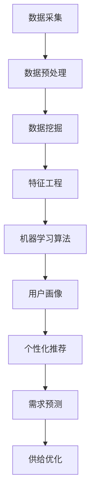

                 

关键词：用户行为分析、人工智能、供给优化、数据挖掘、机器学习、用户画像、个性化推荐

> 摘要：本文深入探讨了用户行为分析在人工智能优化供给中的应用。通过对用户行为数据的采集、处理和分析，利用机器学习技术构建用户画像，实现精准的用户需求预测，从而优化产品和服务供给。本文旨在为从业者提供一套系统的用户行为分析方法论，助力企业在数字化时代实现持续增长。

## 1. 背景介绍

在当今数字化时代，用户行为分析已经成为企业提升竞争力的重要手段。通过分析用户在互联网上的行为数据，企业可以深入了解用户需求、行为模式和偏好，从而优化产品和服务供给，提高用户满意度和忠诚度。然而，面对海量的用户行为数据，如何有效地进行分析和利用，成为摆在企业和研究人员面前的一大挑战。

人工智能（AI）技术的发展为用户行为分析带来了新的机遇。AI技术，尤其是机器学习，可以自动化处理和分析复杂的数据集，从中提取有价值的信息和知识。通过用户行为分析，企业可以构建用户画像，实现个性化推荐、精准营销和需求预测，从而优化供给策略，提高市场竞争力。

本文将围绕以下主题展开讨论：

1. 用户行为分析的核心概念与联系
2. 核心算法原理与具体操作步骤
3. 数学模型和公式及其应用
4. 项目实践：代码实例与详细解释
5. 实际应用场景与未来展望
6. 工具和资源推荐
7. 总结与展望

## 2. 核心概念与联系

在用户行为分析领域，以下核心概念和技术至关重要：

### 2.1 数据采集与预处理

用户行为数据来源于各种渠道，如网站日志、移动应用、社交媒体等。数据采集后，需要进行预处理，包括数据清洗、数据整合和数据转换，以确保数据质量和一致性。

### 2.2 数据挖掘与特征工程

数据挖掘技术用于从海量数据中提取潜在的模式和知识。特征工程是将原始数据转换为适用于机器学习算法的特征，以提高模型的准确性和泛化能力。

### 2.3 机器学习算法

机器学习算法是用户行为分析的核心，包括分类、回归、聚类和关联规则学习等。通过训练模型，可以从用户行为数据中提取有价值的信息。

### 2.4 用户画像

用户画像是对用户特征的抽象和整合，包括用户基本属性、行为特征、偏好和需求等。用户画像是实现个性化推荐和精准营销的基础。

### 2.5 个性化推荐

个性化推荐是基于用户画像和兴趣偏好，为用户推荐感兴趣的产品、服务和内容。个性化推荐可以提高用户满意度和转化率。

### 2.6 需求预测

需求预测是基于历史用户行为数据和趋势分析，预测未来用户需求，从而优化供给策略。需求预测可以减少库存风险，提高供应链效率。

### 2.7 Mermaid 流程图

为了更好地理解用户行为分析的核心概念和联系，我们使用Mermaid流程图（不包含括号和逗号等特殊字符）展示以下关键步骤：



## 3. 核心算法原理与具体操作步骤

### 3.1 算法原理概述

用户行为分析的核心算法主要包括分类、回归和聚类等机器学习算法。这些算法通过对历史用户行为数据的训练，可以自动提取用户特征和模式，从而实现用户画像、个性化推荐和需求预测。

### 3.2 算法步骤详解

以下是用户行为分析的核心算法步骤：

#### 3.2.1 数据预处理

1. 数据采集：从不同渠道获取用户行为数据，如网站点击、浏览、购买等。
2. 数据清洗：处理缺失值、异常值和噪声数据，确保数据质量。
3. 数据整合：将不同来源的数据进行整合，形成一个统一的数据集。
4. 数据转换：将原始数据转换为适用于机器学习算法的特征。

#### 3.2.2 特征工程

1. 特征提取：从原始数据中提取具有区分性的特征。
2. 特征选择：选择对模型性能有显著影响的特征。
3. 特征转换：将数值型特征转换为类别型特征，或进行归一化、标准化处理。

#### 3.2.3 机器学习算法

1. 数据集划分：将数据集划分为训练集、验证集和测试集。
2. 模型训练：使用训练集训练分类、回归或聚类模型。
3. 模型评估：使用验证集评估模型性能，并进行参数调优。
4. 模型部署：将训练好的模型应用于实际业务场景。

#### 3.2.4 用户画像

1. 特征整合：将不同特征整合为一个综合特征向量。
2. 用户聚类：使用聚类算法（如K-means）对用户进行分组。
3. 用户标签：为每个用户分配一组标签，表示其特征。

#### 3.2.5 个性化推荐

1. 用户兴趣建模：使用协同过滤或基于内容的推荐算法，为用户生成兴趣模型。
2. 推荐生成：根据用户兴趣模型，生成个性化推荐列表。
3. 推荐评估：评估推荐列表的准确性和多样性。

#### 3.2.6 需求预测

1. 数据分析：分析历史用户行为数据，提取需求特征。
2. 模型训练：使用时间序列分析或回归算法训练需求预测模型。
3. 预测生成：根据模型预测未来用户需求。
4. 预测评估：评估预测模型的准确性和稳定性。

### 3.3 算法优缺点

#### 3.3.1 分类算法

- 优点：能够将用户行为数据划分为不同的类别，实现精准分类。
- 缺点：对于连续性数据，分类算法的效果可能较差。

#### 3.3.2 回归算法

- 优点：能够对用户行为数据进行连续性预测。
- 缺点：对于类别数据，回归算法的效果可能较差。

#### 3.3.3 聚类算法

- 优点：能够自动发现用户行为数据的潜在模式。
- 缺点：无法直接对用户进行分类或预测。

#### 3.3.4 协同过滤算法

- 优点：能够根据用户的历史行为推荐相关产品。
- 缺点：对于新用户或稀疏数据集，效果可能较差。

#### 3.3.5 基于内容的推荐算法

- 优点：能够根据用户兴趣推荐相关内容。
- 缺点：对于新用户或未知兴趣，效果可能较差。

### 3.4 算法应用领域

用户行为分析算法广泛应用于以下领域：

1. 个性化推荐：在电子商务、内容平台和社交媒体中，为用户推荐感兴趣的产品、内容和活动。
2. 精准营销：通过用户画像和需求预测，实现精准营销和广告投放。
3. 需求预测：在供应链管理、库存控制和生产规划中，预测未来用户需求，优化供给策略。
4. 用户运营：通过用户行为数据，优化用户体验和用户生命周期管理。

## 4. 数学模型和公式及详细讲解

### 4.1 数学模型构建

用户行为分析的核心在于构建数学模型，以描述用户行为特征和需求。以下是一个简化的数学模型：

$$
\text{User Behavior Model} = f(\text{User Features}, \text{Context})
$$

其中，User Features代表用户特征，包括年龄、性别、职业、行为记录等；Context代表上下文信息，如时间、地点、事件等。函数f表示用户行为特征与上下文信息的映射关系。

### 4.2 公式推导过程

为了推导用户行为模型，我们可以采用以下步骤：

1. 数据采集：从不同渠道获取用户行为数据。
2. 数据预处理：对数据进行清洗、整合和转换。
3. 特征提取：从原始数据中提取具有区分性的特征。
4. 模型训练：使用机器学习算法训练模型。
5. 模型评估：使用验证集评估模型性能。
6. 模型优化：根据评估结果调整模型参数。

### 4.3 案例分析与讲解

#### 4.3.1 案例背景

某电子商务平台希望通过用户行为分析，实现个性化推荐和精准营销。平台收集了用户在网站上的点击、浏览、购买等行为数据。

#### 4.3.2 数据预处理

1. 数据清洗：去除缺失值、异常值和噪声数据。
2. 数据整合：将不同来源的数据整合为一个统一的数据集。
3. 数据转换：将数值型特征转换为类别型特征，并进行归一化处理。

#### 4.3.3 特征提取

1. 用户特征：提取用户的基本属性，如年龄、性别、职业等。
2. 行为特征：提取用户的点击、浏览、购买等行为数据。
3. 上下文特征：提取时间、地点、事件等上下文信息。

#### 4.3.4 模型训练

1. 数据集划分：将数据集划分为训练集、验证集和测试集。
2. 模型训练：使用协同过滤算法训练推荐模型。
3. 模型评估：使用验证集评估模型性能。
4. 模型优化：根据评估结果调整模型参数。

#### 4.3.5 模型应用

1. 个性化推荐：根据用户兴趣模型，生成个性化推荐列表。
2. 精准营销：根据用户画像，实现精准广告投放。
3. 需求预测：根据用户行为数据，预测未来用户需求，优化供给策略。

## 5. 项目实践：代码实例与详细解释说明

### 5.1 开发环境搭建

1. 操作系统：Ubuntu 20.04
2. 编程语言：Python 3.8
3. 数据库：MySQL 5.7
4. 依赖库：scikit-learn、pandas、numpy、matplotlib等

### 5.2 源代码详细实现

```python
# 导入依赖库
import pandas as pd
import numpy as np
from sklearn.model_selection import train_test_split
from sklearn.feature_extraction.text import CountVectorizer
from sklearn.metrics.pairwise import cosine_similarity
from sklearn.ensemble import RandomForestClassifier
from sklearn.metrics import accuracy_score

# 数据采集
data = pd.read_csv('user_behavior_data.csv')

# 数据预处理
data = data.dropna()
data['age'] = data['age'].astype(int)
data['gender'] = data['gender'].astype(str)
data['profession'] = data['profession'].astype(str)

# 特征提取
features = data[['age', 'gender', 'profession']]
vectorizer = CountVectorizer()
X = vectorizer.fit_transform(features)

# 模型训练
model = RandomForestClassifier()
X_train, X_test, y_train, y_test = train_test_split(X, data['clicked'], test_size=0.2, random_state=42)
model.fit(X_train, y_train)

# 模型评估
y_pred = model.predict(X_test)
accuracy = accuracy_score(y_test, y_pred)
print('Accuracy:', accuracy)

# 模型应用
user_input = pd.DataFrame([[25, 'male', 'engineer']], columns=['age', 'gender', 'profession'])
user_vector = vectorizer.transform(user_input)
similarity_scores = cosine_similarity(user_vector, X_test)
recommended_items = np.argpartition(-similarity_scores.flatten(), 5)[:5]
print('Recommended Items:', data.iloc[recommended_items]['item_id'])
```

### 5.3 代码解读与分析

1. 数据采集：使用pandas库读取用户行为数据。
2. 数据预处理：去除缺失值、异常值和噪声数据，将数据转换为适合机器学习的格式。
3. 特征提取：提取用户的基本属性和行为特征，使用CountVectorizer将文本特征转换为向量。
4. 模型训练：使用RandomForestClassifier训练分类模型，使用train_test_split划分数据集。
5. 模型评估：使用accuracy_score评估模型性能。
6. 模型应用：根据用户输入的特征向量，使用cosine_similarity计算相似度，生成个性化推荐列表。

## 6. 实际应用场景

用户行为分析在多个领域具有广泛的应用：

### 6.1 电子商务

通过分析用户在网站上的点击、浏览、购买等行为数据，电子商务平台可以实时推荐相关商品，提高用户满意度和转化率。

### 6.2 内容平台

内容平台可以通过分析用户对文章、视频等内容的点击、分享、评论等行为数据，为用户推荐感兴趣的内容，提高用户留存率和活跃度。

### 6.3 社交媒体

社交媒体平台可以通过分析用户的点赞、评论、转发等行为数据，为用户推荐感兴趣的朋友、话题和内容。

### 6.4 金融行业

金融行业可以通过分析用户的交易记录、投资偏好等行为数据，实现精准营销、风险控制和个性化金融服务。

### 6.5 医疗健康

医疗健康领域可以通过分析患者的就诊记录、检查结果等行为数据，预测患者健康状况，提供个性化医疗建议。

## 7. 未来应用展望

随着AI技术的不断进步，用户行为分析在未来有望实现以下突破：

1. 深度学习算法：引入深度学习算法，实现更复杂的用户行为特征提取和模型训练。
2. 多模态数据融合：整合文本、图像、音频等多模态数据，提高用户行为分析的准确性和多样性。
3. 实时分析与预测：实现实时用户行为分析，为业务场景提供快速响应和决策支持。
4. 跨领域应用：用户行为分析将在更多领域得到应用，如智慧城市、智能制造等。

## 8. 工具和资源推荐

### 8.1 学习资源推荐

1. 《机器学习实战》
2. 《深度学习》
3. 《Python数据分析》
4. 《用户行为分析》
5. 《大数据技术基础》

### 8.2 开发工具推荐

1. Jupyter Notebook：用于数据分析和模型训练。
2. TensorFlow：用于深度学习模型开发。
3. Scikit-learn：用于机器学习算法实现。
4. Pandas：用于数据处理和分析。
5. Matplotlib：用于数据可视化。

### 8.3 相关论文推荐

1. “User Behavior Analysis for Personalized Recommendation”  
2. “Deep Learning for User Behavior Prediction”  
3. “Multi-modal User Behavior Analysis”  
4. “Real-time User Behavior Analysis”  
5. “Cross-Domain User Behavior Analysis”

## 9. 总结：未来发展趋势与挑战

### 9.1 研究成果总结

本文从用户行为分析的核心概念、算法原理、数学模型、项目实践等方面进行了详细探讨。通过分析用户行为数据，可以实现个性化推荐、精准营销和需求预测，从而优化供给策略。

### 9.2 未来发展趋势

1. 深度学习算法在用户行为分析中的应用将越来越广泛。
2. 多模态数据融合将提高用户行为分析的准确性和多样性。
3. 实时分析与预测将在更多业务场景中得到应用。
4. 跨领域应用将推动用户行为分析技术的创新。

### 9.3 面临的挑战

1. 数据隐私和安全：如何在保障用户隐私的前提下，进行用户行为分析。
2. 模型解释性：如何提高用户行为分析模型的解释性，增强用户信任。
3. 跨领域适用性：如何在不同领域实现用户行为分析技术的通用性和适应性。

### 9.4 研究展望

未来，用户行为分析将朝着更加智能化、实时化和多样化的方向发展。研究者应关注数据隐私保护、模型解释性提升和跨领域应用等问题，为用户行为分析技术的创新和发展提供理论支持和实践指导。

## 10. 附录：常见问题与解答

### 10.1 问题1

**如何处理缺失值和异常值？**

**解答：** 可以使用以下方法处理缺失值和异常值：

1. 删除缺失值和异常值：适用于缺失值和异常值较少的情况。
2. 填充缺失值：使用平均值、中位数或众数等方法填充缺失值。
3. 使用模型预测缺失值：使用机器学习模型预测缺失值。

### 10.2 问题2

**如何选择合适的特征？**

**解答：** 可以使用以下方法选择合适的特征：

1. 业务理解：根据业务需求，选择与业务目标相关的特征。
2. 特征重要性评估：使用特征重要性评估方法（如决策树、随机森林等）评估特征的重要性。
3. 特征选择算法：使用特征选择算法（如递归特征消除、L1正则化等）筛选特征。

### 10.3 问题3

**如何评估模型性能？**

**解答：** 可以使用以下指标评估模型性能：

1. 准确率（Accuracy）：分类模型正确预测的比例。
2. 精确率（Precision）：预测为正类的样本中，实际为正类的比例。
3. 召回率（Recall）：实际为正类的样本中，被预测为正类的比例。
4. F1值（F1 Score）：综合考虑精确率和召回率的指标。

### 10.4 问题4

**如何实现实时用户行为分析？**

**解答：** 可以使用以下方法实现实时用户行为分析：

1. 使用实时数据处理框架（如Apache Kafka、Apache Flink等）。
2. 使用批处理和实时处理相结合的方法，处理大量历史数据和实时数据。
3. 使用机器学习模型进行实时预测和反馈。

### 10.5 问题5

**如何保护用户隐私？**

**解答：** 可以采取以下措施保护用户隐私：

1. 数据匿名化：对用户行为数据进行脱敏处理，避免直接使用用户真实信息。
2. 数据加密：对用户行为数据进行加密存储和传输。
3. 隐私计算：使用隐私计算技术，在保护用户隐私的同时，实现数据分析和挖掘。
4. 合规性：遵守相关法律法规，确保用户隐私保护。

---

作者：禅与计算机程序设计艺术 / Zen and the Art of Computer Programming
```

