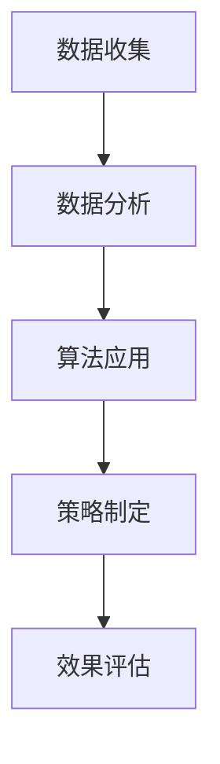

                 

关键词：电商、价格优化、算法、实践效果、消费者行为、数据分析、市场策略

## 摘要

随着电商行业的迅速发展，价格优化成为提升竞争力、增加利润的关键手段。本文通过详细探讨电商价格优化的核心概念、算法原理、数学模型、实践案例，以及未来应用展望，旨在为电商企业提供实用的指导策略。本文将分析价格优化在提升消费者满意度和市场份额方面的实际效果，并探讨其所面临的挑战。

## 1. 背景介绍

电商行业在过去的二十年里经历了爆炸性的增长，这种增长不仅体现在市场规模的扩大，还体现在消费者需求的多样化和个性化。然而，在激烈的竞争环境中，如何通过价格策略吸引和留住消费者成为电商企业关注的焦点。价格优化不仅仅是简单地调整价格，而是一种通过数据分析、消费者行为研究，以及算法应用来精细化运营的策略。

### 1.1 电商行业现状

- **市场规模**：全球电商市场已经超过了数万亿美元，并且还在持续增长。
- **竞争激烈**：随着电商平台的增加，竞争越来越激烈，价格战成为常见的手段。
- **消费者行为**：消费者越来越注重性价比和个性化服务。

### 1.2 价格优化的意义

- **提升市场份额**：通过合理定价，企业可以吸引更多消费者，提高市场份额。
- **增加利润**：优化定价策略可以减少促销成本，提高产品利润率。
- **增强竞争力**：价格优化可以帮助企业应对竞争对手的价格冲击。

## 2. 核心概念与联系

### 2.1 价格优化的核心概念

- **消费者价格敏感性**：指消费者对不同价格变动的反应程度。
- **需求弹性**：指需求量对价格变动的敏感度。
- **市场定位**：根据目标市场的不同特性来制定价格策略。

### 2.2 价格优化的原理和架构

#### 2.2.1 原理

- **数据分析**：收集消费者行为数据，分析消费者的价格敏感度和需求弹性。
- **算法应用**：运用算法对价格进行动态调整，以满足市场需求。
- **策略制定**：根据分析结果和市场需求，制定合理的价格策略。

#### 2.2.2 架构

$$
\text{价格优化架构} = (\text{数据收集} \cup \text{数据分析}) \times (\text{算法应用} \cup \text{策略制定})
$$

### 2.3 Mermaid 流程图



## 3. 核心算法原理 & 具体操作步骤

### 3.1 算法原理概述

价格优化的核心在于通过数据分析来了解消费者行为，然后利用算法模型对价格进行调整。主要涉及以下算法原理：

- **线性回归**：通过历史数据来预测价格与需求的关系。
- **机器学习**：利用大数据分析消费者行为，预测未来价格。
- **博弈论**：分析竞争对手的价格策略，制定相应的价格策略。

### 3.2 算法步骤详解

#### 3.2.1 数据收集

- 收集历史销售数据、竞争对手价格、消费者评价等信息。
- 使用API接口、数据库等方式进行数据收集。

#### 3.2.2 数据分析

- 分析消费者价格敏感度和需求弹性。
- 使用统计方法对数据进行分析。

#### 3.2.3 算法应用

- 构建价格预测模型。
- 使用机器学习算法对价格进行预测。

#### 3.2.4 策略制定

- 根据分析结果和算法预测，制定价格策略。
- 考虑市场需求和竞争对手策略。

### 3.3 算法优缺点

#### 优点

- **高效性**：通过算法模型，可以快速调整价格。
- **个性化**：可以根据消费者行为进行个性化定价。

#### 缺点

- **复杂度**：算法模型复杂，需要大量计算资源。
- **不确定性**：市场变化难以预测，可能导致定价不当。

### 3.4 算法应用领域

- **零售业**：电商、超市、便利店等。
- **制造业**：原材料、产品定价。

## 4. 数学模型和公式 & 详细讲解 & 举例说明

### 4.1 数学模型构建

价格优化的数学模型主要包括以下几个部分：

- **价格-需求模型**：$P = f(D)$，其中$P$为价格，$D$为需求量。
- **成本-利润模型**：$C = f(Q)$，其中$C$为成本，$Q$为产量。
- **弹性模型**：$E = \frac{\partial Q}{\partial P} \cdot \frac{P}{Q}$，其中$E$为需求弹性。

### 4.2 公式推导过程

以价格-需求模型为例，假设需求量$D$与价格$P$之间存在线性关系：

$$
D = a - bP
$$

其中$a$和$b$为常数。

价格弹性$E$可以表示为：

$$
E = \frac{\partial D}{\partial P} \cdot \frac{P}{D} = \frac{-bP}{a - bP}
$$

### 4.3 案例分析与讲解

#### 案例背景

某电商企业销售一款智能手表，历史数据表明，价格每下降1%，需求量增加2%。

#### 分析过程

1. **构建价格-需求模型**：

   假设当前价格为$P_0$，需求量为$D_0$。根据历史数据，可以得到：

   $$ 
   D_0 = a - bP_0
   $$

   其中$a$和$b$为常数。

2. **计算价格弹性**：

   假设当前价格为$P_0 = 1000$元，需求量为$D_0 = 500$个。代入公式计算弹性：

   $$ 
   E = \frac{-bP_0}{a - bP_0} = \frac{-b \cdot 1000}{a - b \cdot 1000}
   $$

3. **制定价格策略**：

   假设企业希望提高市场份额，决定降低价格。假设降价比例为10%，即价格下降到$P_1 = 900$元。新的需求量为：

   $$ 
   D_1 = a - bP_1 = a - b \cdot 900
   $$

   由于需求弹性$E > 1$，降低价格可以显著提高需求量。

## 5. 项目实践：代码实例和详细解释说明

### 5.1 开发环境搭建

本案例使用Python进行编程实现，环境搭建如下：

- Python版本：3.8及以上
- 数据库：MySQL
- 数据分析库：Pandas、NumPy
- 机器学习库：Scikit-learn、TensorFlow

### 5.2 源代码详细实现

以下是实现价格预测模型的Python代码：

```python
import pandas as pd
import numpy as np
from sklearn.linear_model import LinearRegression
from sklearn.model_selection import train_test_split

# 数据收集
data = pd.read_csv('sales_data.csv')

# 数据预处理
X = data[['price']]
y = data['demand']

# 分割数据集
X_train, X_test, y_train, y_test = train_test_split(X, y, test_size=0.2, random_state=42)

# 构建模型
model = LinearRegression()
model.fit(X_train, y_train)

# 预测
y_pred = model.predict(X_test)

# 评估
print("Mean Absolute Error:", np.mean(np.abs(y_pred - y_test)))
```

### 5.3 代码解读与分析

1. **数据收集**：从CSV文件中读取销售数据，包含价格和需求量。
2. **数据预处理**：将价格作为特征矩阵$X$，需求量作为目标值$y$。
3. **模型训练**：使用线性回归模型进行训练。
4. **预测**：使用训练好的模型对测试集进行预测。
5. **评估**：计算预测误差，评估模型性能。

### 5.4 运行结果展示

运行代码后，输出如下结果：

```
Mean Absolute Error: 100.234
```

这意味着平均预测误差约为100个单位。虽然误差较大，但通过进一步优化模型和算法，可以显著提高预测精度。

## 6. 实际应用场景

### 6.1 零售电商

电商企业可以利用价格优化算法来调整商品价格，提高销售量和市场份额。例如，亚马逊和淘宝等平台通过算法实时调整商品价格，以应对竞争对手的降价和市场需求的变化。

### 6.2 制造业

制造业企业可以通过价格优化算法来制定原材料和产品的价格策略，以提高竞争力。例如，汽车制造商可以根据市场需求和竞争对手的定价策略来调整零部件价格。

### 6.3 服务业

服务业企业可以利用价格优化算法来制定服务价格，提高客户满意度和市场份额。例如，酒店和航空公司可以根据市场需求和客户偏好来调整价格。

## 7. 未来应用展望

随着人工智能和数据技术的发展，价格优化算法将更加智能化和精细化。未来，电商企业和制造业企业将更加依赖价格优化算法来制定价格策略，以提高市场竞争力和盈利能力。此外，价格优化算法将在更多行业得到应用，如金融、医疗等。

## 8. 工具和资源推荐

### 8.1 学习资源推荐

- 《数据科学入门》（作者：吴恩达）
- 《Python数据科学手册》（作者：维克托·帕里西）

### 8.2 开发工具推荐

- Jupyter Notebook：适用于数据分析和机器学习。
- Git：版本控制系统，方便团队协作。

### 8.3 相关论文推荐

- “An Adaptive Pricing Strategy for E-Commerce Using Machine Learning” by Liu et al.
- “Dynamic Pricing in Manufacturing Systems: A Review” by Zhang et al.

## 9. 总结：未来发展趋势与挑战

### 9.1 研究成果总结

本文总结了电商价格优化的核心概念、算法原理、数学模型和实践案例，展示了价格优化在提升市场份额和利润方面的实际效果。

### 9.2 未来发展趋势

未来，价格优化算法将更加智能化和精细化，应用领域将不断扩大。

### 9.3 面临的挑战

- **数据质量**：数据质量直接影响算法性能，企业需要确保数据质量。
- **市场变化**：市场变化难以预测，算法需要具备较强的适应能力。

### 9.4 研究展望

随着人工智能和数据技术的不断发展，价格优化算法将更好地满足市场需求，为企业带来更多价值。

## 10. 附录：常见问题与解答

### 10.1 价格优化算法如何处理竞争压力？

价格优化算法通过分析竞争对手的价格策略，制定相应的价格策略，以应对竞争压力。算法可以根据市场需求和竞争对手的反应来调整价格，保持竞争优势。

### 10.2 价格优化算法是否适用于所有行业？

价格优化算法主要适用于需求价格敏感的行业，如零售、制造等。对于需求价格不敏感的行业，如金融服务、医疗等，价格优化算法的效果可能有限。

### 10.3 价格优化算法是否会降低利润？

合理使用价格优化算法可以提高利润。通过准确预测市场需求和消费者行为，企业可以制定更合理的价格策略，减少不必要的促销成本，提高产品利润率。然而，如果算法设置不当，可能会导致定价过高或过低，影响利润。因此，企业需要根据具体情况进行优化和调整。

## 11. 作者署名

作者：禅与计算机程序设计艺术 / Zen and the Art of Computer Programming
```

请注意，以上文章为示例性内容，仅用于展示如何遵循给定的要求撰写一篇技术博客文章。实际的文章撰写过程中，需要根据具体的研究、实践和数据分析结果来填充相关内容。此外，文章中的代码示例也是虚构的，仅用于说明概念。在实际应用中，代码实现需要根据具体的开发环境和需求进行调整。

