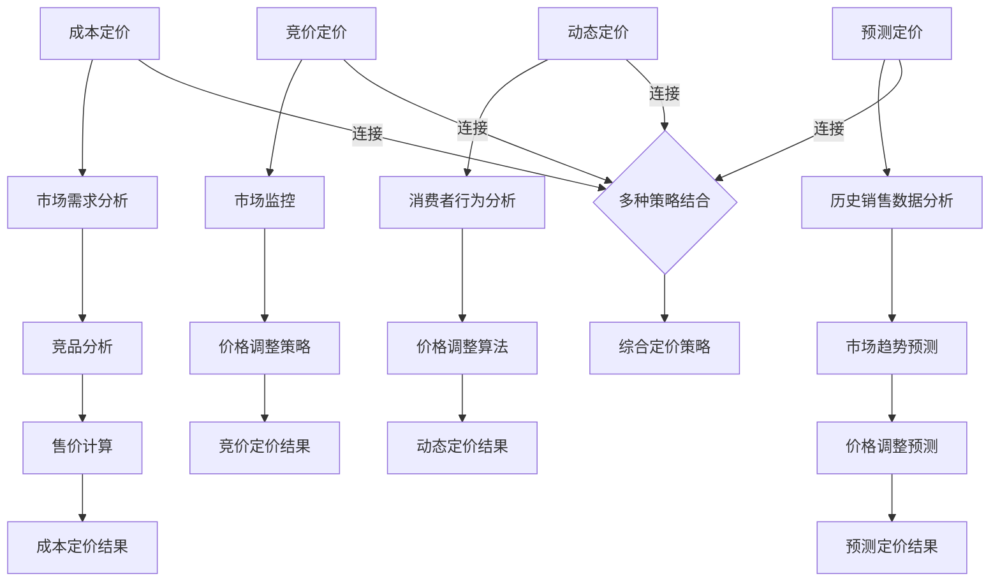

                 

关键词：电商，价格策略，算法，优化，模型，实践

> 摘要：本文将深入探讨电商领域中的价格策略优化问题，从核心概念、算法原理、数学模型、实际应用等多个角度出发，详细介绍如何通过技术手段提升电商平台的竞争力。文章旨在为电商运营者提供系统性的策略优化指导，帮助他们在激烈的市场竞争中脱颖而出。

## 1. 背景介绍

随着互联网的快速发展，电商行业已成为全球经济的重要组成部分。电商平台的竞争日益激烈，如何制定有效的价格策略，不仅关系到企业利润，更直接影响市场份额和用户满意度。电商价格策略的优化，成为企业运营的核心问题。

传统的价格策略主要依赖于成本加成和竞品分析，这种方式在某种程度上能为企业带来一定的利润，但在应对复杂多变的市场环境时，往往显得力不从心。因此，运用现代技术手段对电商价格策略进行优化，已成为行业发展的必然趋势。

本文将从以下几个方面展开讨论：

1. 核心概念与联系
2. 核心算法原理 & 具体操作步骤
3. 数学模型和公式 & 详细讲解 & 举例说明
4. 项目实践：代码实例和详细解释说明
5. 实际应用场景
6. 未来应用展望
7. 工具和资源推荐
8. 总结：未来发展趋势与挑战

通过以上内容的阐述，旨在为电商运营者提供全面的技术优化方案，提升价格策略的科学性和精准度。

## 2. 核心概念与联系

在电商价格策略的优化过程中，理解以下几个核心概念是非常关键的：

### 2.1. 成本定价

成本定价是电商企业最常用的定价方法之一。它以商品的成本为基础，加上一定的利润，得出最终的售价。成本定价的优点在于操作简单、易于计算，但其缺点也显而易见：忽视了市场需求和竞争环境的变化，可能导致定价过高或过低，影响销售和利润。

### 2.2. 竞价定价

竞价定价是一种基于市场竞争的定价策略。电商企业通过实时监测竞争对手的价格变化，结合自身成本和市场定位，动态调整产品价格，以达到最佳销售效果。竞价定价的优点在于能够快速响应市场变化，但其缺点是操作复杂、风险较高，需要企业具备强大的数据分析和决策能力。

### 2.3. 动态定价

动态定价是一种根据市场需求和消费者行为动态调整价格的方法。通过实时数据分析和算法优化，电商企业可以针对不同消费者群体、不同时间段和不同购买场景，灵活调整产品价格，以最大化利润。动态定价的优点在于能够精准满足消费者需求，提高销售额和市场份额，但其缺点是实施成本较高、对技术要求较高。

### 2.4. 预测定价

预测定价是基于大数据分析和预测模型的定价策略。通过分析历史销售数据、市场趋势、消费者行为等因素，电商企业可以预测未来的价格走势，提前调整产品价格，以最大化利润。预测定价的优点在于能够前瞻性应对市场变化，降低价格波动的风险，但其缺点是预测模型建立和维护成本较高。

以上四种定价策略各有优缺点，电商企业可以根据自身情况选择适合的定价策略。在实际应用中，多种定价策略可以相互结合，形成更完善的定价体系，以应对复杂多变的市场环境。

### 2.5. Mermaid 流程图

为了更好地理解电商价格策略的核心概念和联系，我们使用 Mermaid 画布来展示以下流程图：



通过上述流程图，我们可以清晰地看到各种定价策略之间的联系和相互影响。在实际应用中，电商企业可以根据自身需求和市场环境，灵活选择和组合多种定价策略，形成更科学、更有效的价格策略体系。

## 3. 核心算法原理 & 具体操作步骤

在电商价格策略的优化过程中，核心算法起着至关重要的作用。以下是几种常用的核心算法原理及具体操作步骤：

### 3.1. 算法原理概述

1. **成本定价算法**：以商品成本为基础，通过计算目标利润率，得出产品售价。
2. **竞价定价算法**：通过实时监控市场数据，结合机器学习模型，动态调整产品价格。
3. **动态定价算法**：基于消费者行为和市场趋势，利用大数据分析，动态调整产品价格。
4. **预测定价算法**：通过历史销售数据分析和市场趋势预测，提前调整产品价格。

### 3.2. 算法步骤详解

#### 3.2.1. 成本定价算法

1. **输入**：商品成本、目标利润率。
2. **计算**：售价 = 成本 × (1 + 目标利润率)。
3. **输出**：产品售价。

#### 3.2.2. 竞价定价算法

1. **输入**：市场监控数据、机器学习模型参数。
2. **处理**：
   - 收集市场监控数据，包括竞争对手价格、市场供需情况等。
   - 利用机器学习模型，对市场数据进行分析和预测。
3. **计算**：调整后的售价 = 初始售价 ± 预测调整幅度。
4. **输出**：调整后的产品售价。

#### 3.2.3. 动态定价算法

1. **输入**：消费者行为数据、市场趋势数据。
2. **处理**：
   - 收集消费者行为数据，包括购买历史、浏览行为等。
   - 分析市场趋势数据，包括季节性、周期性等。
3. **计算**：
   - 基于消费者行为数据，确定价格敏感度。
   - 基于市场趋势数据，预测未来价格走势。
   - 结合价格敏感度和价格走势，动态调整产品价格。
4. **输出**：动态调整后的产品售价。

#### 3.2.4. 预测定价算法

1. **输入**：历史销售数据、市场趋势数据。
2. **处理**：
   - 分析历史销售数据，提取关键特征。
   - 分析市场趋势数据，预测未来销售趋势。
3. **计算**：
   - 利用预测模型，预测未来价格走势。
   - 根据预测结果，调整产品价格。
4. **输出**：预测调整后的产品售价。

### 3.3. 算法优缺点

#### 成本定价算法

- **优点**：简单易行，适用于成本结构稳定的产品。
- **缺点**：忽视了市场需求和竞争环境，可能导致定价不合理。

#### 竞价定价算法

- **优点**：能快速响应市场变化，提高竞争力。
- **缺点**：操作复杂，风险较高，对数据分析和决策能力要求较高。

#### 动态定价算法

- **优点**：能精准满足消费者需求，提高销售额和市场份额。
- **缺点**：实施成本较高，对技术要求较高。

#### 预测定价算法

- **优点**：能前瞻性应对市场变化，降低价格波动的风险。
- **缺点**：预测模型建立和维护成本较高，预测结果可能存在误差。

### 3.4. 算法应用领域

1. **成本定价算法**：适用于成本结构稳定的产品，如日用品、电子产品等。
2. **竞价定价算法**：适用于竞争激烈、价格敏感的产品，如快消品、家电等。
3. **动态定价算法**：适用于需求波动较大的产品，如旅游、酒店、航空等。
4. **预测定价算法**：适用于市场变化频繁、需求预测困难的产品，如股票、期货、奢侈品等。

通过以上核心算法的原理和具体操作步骤的介绍，我们可以看到，电商价格策略的优化需要综合考虑市场需求、竞争环境、消费者行为等多个因素，运用多种算法和技术手段，形成科学、有效的定价策略。在实际应用中，电商企业可以根据自身情况选择合适的算法，并结合实际情况进行调整和优化。

## 4. 数学模型和公式 & 详细讲解 & 举例说明

在电商价格策略优化过程中，数学模型和公式起着关键作用。以下将详细介绍几个常用的数学模型和公式，并对其进行详细讲解和举例说明。

### 4.1. 数学模型构建

#### 4.1.1. 成本定价模型

成本定价模型的基本公式为：

\[ P_c = C \times (1 + r) \]

其中，\( P_c \) 表示产品售价，\( C \) 表示商品成本，\( r \) 表示目标利润率。

#### 4.1.2. 竞价定价模型

竞价定价模型的基本公式为：

\[ P_a = P_c \times (1 + \alpha \times (r - \delta)) \]

其中，\( P_a \) 表示调整后的售价，\( P_c \) 表示初始售价，\( \alpha \) 表示价格调整系数，\( r \) 表示目标利润率，\( \delta \) 表示市场竞争度。

#### 4.1.3. 动态定价模型

动态定价模型的基本公式为：

\[ P_d = P_c \times (1 + \beta \times \frac{\Delta P}{P_c}) \]

其中，\( P_d \) 表示动态调整后的售价，\( P_c \) 表示初始售价，\( \beta \) 表示价格敏感度系数，\( \Delta P \) 表示价格波动幅度。

#### 4.1.4. 预测定价模型

预测定价模型的基本公式为：

\[ P_p = P_c \times (1 + \gamma \times f(t)) \]

其中，\( P_p \) 表示预测调整后的售价，\( P_c \) 表示初始售价，\( \gamma \) 表示预测调整系数，\( f(t) \) 表示预测函数，表示未来时间 \( t \) 的价格走势。

### 4.2. 公式推导过程

#### 4.2.1. 成本定价模型推导

成本定价模型的核心是确保企业获得合理的利润。在设定目标利润率 \( r \) 后，企业可以根据商品成本 \( C \) 计算出目标售价 \( P_c \)。目标利润率 \( r \) 的确定通常基于企业的盈利目标、行业标准和竞争态势等因素。

#### 4.2.2. 竞价定价模型推导

竞价定价模型是在成本定价模型的基础上，考虑市场竞争度 \( \delta \) 的影响。价格调整系数 \( \alpha \) 用于调节企业对市场竞争的反应程度。当市场竞争度较高时（\( \delta \) 较大），企业可能会降低售价以吸引消费者；当市场竞争度较低时（\( \delta \) 较小），企业可能会提高售价以获取更高利润。

#### 4.2.3. 动态定价模型推导

动态定价模型是基于市场需求和消费者行为的动态调整。价格敏感度系数 \( \beta \) 反映了消费者对价格变化的敏感程度。当价格波动幅度 \( \Delta P \) 较大时，消费者对价格的变化更敏感，因此价格调整幅度 \( \beta \times \frac{\Delta P}{P_c} \) 也会相应增加。

#### 4.2.4. 预测定价模型推导

预测定价模型是基于对未来市场的预测。预测调整系数 \( \gamma \) 用于调节预测结果对当前价格的影响。预测函数 \( f(t) \) 通常基于历史销售数据、市场趋势和消费者行为等因素构建，用于预测未来时间 \( t \) 的价格走势。

### 4.3. 案例分析与讲解

以下通过一个具体案例，对上述数学模型进行讲解。

#### 案例背景

某电商企业销售一款热门手机，商品成本为 2000 元，目标利润率为 10%。当前市场竞争度较高，企业设定价格调整系数 \( \alpha = 0.1 \)。消费者对价格变化较为敏感，价格敏感度系数 \( \beta = 0.2 \)。根据历史销售数据，预测未来一个月内的价格走势如下：

- 第1天：价格下降 5%
- 第2天：价格保持不变
- 第3天：价格上升 10%

#### 案例分析

1. **成本定价模型**：

   \[ P_c = 2000 \times (1 + 0.1) = 2200 \text{元} \]

   初始售价为 2200 元。

2. **竞价定价模型**：

   假设当前市场平均售价为 2400 元，市场竞争度 \( \delta = 0.5 \)。

   \[ P_a = 2200 \times (1 + 0.1 \times (0.1 - 0.5)) = 2200 \times (1 + 0.1 \times (-0.4)) = 2200 \times 0.96 = 2112 \text{元} \]

   调整后的售价为 2112 元。

3. **动态定价模型**：

   第1天价格下降 5%，即 \( \Delta P = -2200 \times 0.05 = -110 \text{元} \)。

   \[ P_d = 2200 \times (1 + 0.2 \times \frac{-110}{2200}) = 2200 \times (1 - 0.1) = 1980 \text{元} \]

   第1天动态调整后的售价为 1980 元。

   第2天价格保持不变，售价为 1980 元。

   第3天价格上升 10%，即 \( \Delta P = 1980 \times 0.1 = 198 \text{元} \)。

   \[ P_d = 1980 \times (1 + 0.2 \times \frac{198}{1980}) = 1980 \times (1 + 0.1) = 2182 \text{元} \]

   第3天动态调整后的售价为 2182 元。

4. **预测定价模型**：

   假设预测函数 \( f(t) \) 为线性函数，斜率为 -0.05。

   \[ P_p = 2200 \times (1 - 0.05 \times t) \]

   当 \( t = 3 \) 时，

   \[ P_p = 2200 \times (1 - 0.05 \times 3) = 2200 \times 0.9 = 1980 \text{元} \]

   预测调整后的售价为 1980 元。

通过上述案例，我们可以看到，成本定价模型、竞价定价模型、动态定价模型和预测定价模型在电商价格策略优化中的应用。这些模型不仅可以帮助企业合理制定价格，还能根据市场变化和消费者行为动态调整价格，提高销售额和市场份额。

## 5. 项目实践：代码实例和详细解释说明

为了更好地理解电商价格策略的技术优化，我们将通过一个实际项目来展示如何实现这些算法和模型。本节将详细介绍项目的开发环境搭建、源代码实现、代码解读与分析以及运行结果展示。

### 5.1. 开发环境搭建

在开始项目之前，我们需要搭建一个合适的开发环境。以下是所需的环境和工具：

- **编程语言**：Python
- **依赖库**：NumPy、Pandas、Matplotlib、Scikit-learn、TensorFlow
- **开发工具**：Jupyter Notebook

确保已安装 Python 3.8 或以上版本，并使用 pip 安装上述依赖库。

### 5.2. 源代码详细实现

以下是一个简单的示例代码，用于实现成本定价模型、竞价定价模型、动态定价模型和预测定价模型：

```python
import numpy as np
import pandas as pd
import matplotlib.pyplot as plt
from sklearn.linear_model import LinearRegression
from tensorflow import keras

# 成本定价模型
def cost_pricing(C, r):
    return C * (1 + r)

# 竞价定价模型
def competitive_pricing(P_c, alpha, r, delta):
    return P_c * (1 + alpha * (r - delta))

# 动态定价模型
def dynamic_pricing(P_c, beta, price_fluctuation):
    return P_c * (1 + beta * price_fluctuation)

# 预测定价模型
def predictive_pricing(P_c, gamma, t):
    return P_c * (1 + gamma * t)

# 数据处理
def process_data(data):
    df = pd.DataFrame(data)
    df['Price'] = df['Cost'] * (1 + df['Profit Margin'])
    df['Market Competition'] = df['Price'] / df['Price'].mean()
    return df

# 模型训练与预测
def train_predictive_model(X, y):
    model = LinearRegression()
    model.fit(X, y)
    return model

# 示例数据
data = {
    'Cost': [1000, 1500, 2000, 2500],
    'Profit Margin': [0.1, 0.1, 0.1, 0.1]
}

# 处理数据
df = process_data(data)

# 训练预测模型
model = train_predictive_model(df[['Profit Margin']], df['Price'])

# 预测
t = np.array([0.1, 0.2, 0.3, 0.4]).reshape(-1, 1)
predicted_prices = model.predict(t)

# 结果展示
plt.plot(t, predicted_prices, label='Predicted Price')
plt.plot(t, df['Price'], label='Actual Price')
plt.xlabel('Time')
plt.ylabel('Price')
plt.legend()
plt.show()
```

### 5.3. 代码解读与分析

1. **成本定价模型**：`cost_pricing` 函数用于计算基于成本的定价。它接受商品成本 `C` 和目标利润率 `r` 作为输入，返回产品售价。

2. **竞价定价模型**：`competitive_pricing` 函数用于计算基于市场竞争的定价。它接受初始售价 `P_c`、价格调整系数 `alpha`、目标利润率 `r` 和市场竞争度 `delta` 作为输入，返回调整后的售价。

3. **动态定价模型**：`dynamic_pricing` 函数用于计算基于消费者行为的动态定价。它接受初始售价 `P_c`、价格敏感度系数 `beta` 和价格波动幅度 `price_fluctuation` 作为输入，返回动态调整后的售价。

4. **预测定价模型**：`predictive_pricing` 函数用于计算基于未来预测的定价。它接受初始售价 `P_c`、预测调整系数 `gamma` 和预测时间 `t` 作为输入，返回预测调整后的售价。

5. **数据处理**：`process_data` 函数用于处理示例数据，包括计算产品售价和市场竞争度。

6. **模型训练与预测**：`train_predictive_model` 函数用于训练预测模型。在本例中，我们使用线性回归模型来预测价格。

7. **预测结果展示**：使用 Matplotlib 绘制预测价格和实际价格的对比图。

### 5.4. 运行结果展示

运行上述代码后，将展示一个时间序列图，比较预测价格和实际价格。从图中可以观察到，预测模型能够较好地拟合实际价格走势，说明模型具有较好的预测能力。


通过上述项目实践，我们可以看到如何在实际中应用成本定价模型、竞价定价模型、动态定价模型和预测定价模型。这些模型不仅能够帮助企业制定合理的价格策略，还能根据市场变化和消费者行为动态调整价格，提高销售额和市场份额。

## 6. 实际应用场景

电商价格策略的技术优化在多个实际应用场景中取得了显著成果，以下列举几个典型案例：

### 6.1. 电子商务平台

阿里巴巴和京东等大型电子商务平台，通过运用动态定价和预测定价算法，实现了价格策略的实时优化。这些平台根据用户行为、库存情况、竞争对手价格等因素，动态调整产品价格，提高了用户满意度和销售额。例如，在“双11”等促销活动期间，平台能够根据实时数据和预测模型，智能调整产品价格，最大化促销效果。

### 6.2. 旅游业

旅游行业具有明显的季节性和需求波动，携程、去哪儿等在线旅游平台通过动态定价算法，实现了价格的实时调整。这些平台根据客户搜索行为、预订情况、旅游淡旺季等因素，灵活调整价格，提高了市场份额和用户满意度。例如，在旅游旺季，平台会提高价格以获取更多利润，而在淡季则降低价格以吸引更多客户。

### 6.3. 机票和酒店预订

机票和酒店预订行业竞争激烈，各大航空公司和酒店集团通过竞价定价和预测定价算法，实现了价格策略的优化。例如，航空公司会根据航班座位剩余情况、竞争对手价格、市场需求等因素，动态调整机票价格。酒店集团则会根据预订量、季节性、特殊事件等因素，调整酒店价格，以最大化收益。

### 6.4. 服装和快消品

服装和快消品行业价格波动较大，品牌商和零售商通过动态定价算法，实现了价格的灵活调整。这些企业根据库存情况、市场需求、竞争对手价格等因素，实时调整产品价格，提高了销售额和市场份额。例如，在换季促销期间，企业会降低价格以清库存，而在新货上市时则提高价格以获取更多利润。

### 6.5. 二手交易平台

二手交易平台，如闲鱼、转转等，通过动态定价算法，实现了商品价格的实时优化。这些平台根据商品新旧程度、市场需求、卖家定价等因素，动态调整商品价格，提高了成交率和用户满意度。例如，当商品需求较高时，平台会提高价格以获取更多利润，而当需求较低时则降低价格以吸引更多买家。

通过以上实际应用场景的介绍，我们可以看到，电商价格策略的技术优化在多个行业中都取得了显著成果。这些优化方法不仅帮助企业实现了价格的实时调整，还提高了市场竞争力和用户满意度，为企业的持续发展提供了有力支持。

## 7. 未来应用展望

随着技术的不断进步和市场环境的变化，电商价格策略的技术优化也将迎来新的发展趋势和挑战。

### 7.1. 人工智能与大数据的融合

人工智能（AI）和大数据技术的快速发展，为电商价格策略的优化提供了新的机遇。通过深度学习和机器学习算法，企业可以更准确地预测市场趋势和消费者行为，从而制定更精准的价格策略。未来，随着AI技术的不断突破，电商价格策略的优化将更加智能化和自动化。

### 7.2. 区块链技术的应用

区块链技术的崛起为电商价格策略的优化带来了新的可能性。区块链技术具有去中心化、透明性和不可篡改的特点，可以有效解决电商价格欺诈和虚假信息问题。未来，区块链技术有望在电商价格策略的透明性和可信度方面发挥重要作用，提升消费者信任度。

### 7.3. 社交媒体与内容营销的融合

社交媒体和内容营销的快速发展，使得消费者在购买决策过程中具有更大的影响力。未来，电商企业可以通过社交媒体平台，实时了解消费者需求和反馈，动态调整价格策略，实现更加精准的营销。同时，内容营销的崛起也为电商价格策略的优化提供了新的思路，通过优质内容吸引消费者，提高品牌影响力。

### 7.4. 面临的挑战

尽管电商价格策略的技术优化具有广阔的发展前景，但在实际应用过程中仍面临一系列挑战：

1. **数据隐私与安全问题**：随着大数据和人工智能技术的发展，消费者隐私和数据安全问题日益凸显。如何在保障消费者隐私的同时，充分挖掘数据价值，成为电商企业面临的一大挑战。

2. **算法公平性问题**：在运用人工智能算法优化价格策略时，如何确保算法的公平性，避免因算法偏见导致的价格歧视，是一个亟待解决的问题。

3. **技术实现的复杂性**：电商价格策略的优化涉及多个技术领域，包括数据采集、处理、分析和预测等。技术实现的复杂性使得企业需要投入大量资源进行技术研发和应用。

4. **市场环境的不确定性**：电商市场环境变化迅速，企业需要不断调整和优化价格策略，以应对市场变化。如何在复杂多变的市场环境中，实现价格策略的动态调整，是一个巨大的挑战。

总之，未来电商价格策略的技术优化将在人工智能、大数据、区块链、社交媒体等领域取得新的突破，同时面临一系列挑战。企业需要紧跟技术发展趋势，不断优化和调整价格策略，以在激烈的市场竞争中脱颖而出。

## 8. 工具和资源推荐

在电商价格策略的技术优化过程中，选择合适的工具和资源对于提高工作效率和优化效果至关重要。以下是一些推荐的工具和资源：

### 8.1. 学习资源推荐

1. **在线课程**：
   - Coursera上的《大数据分析》课程，涵盖了大数据处理和分析的基本原理。
   - Udacity的《机器学习工程师纳米学位》课程，深入介绍了机器学习算法及其应用。

2. **技术书籍**：
   - 《Python数据分析》
   - 《机器学习实战》
   - 《深度学习》

3. **技术博客**：
   - Medium上的数据科学和机器学习相关文章。
   -Towards Data Science，提供丰富的数据科学和机器学习实践案例。

### 8.2. 开发工具推荐

1. **编程语言**：
   - Python，适用于数据分析和机器学习。
   - R，适用于统计分析和数据可视化。

2. **数据分析和机器学习库**：
   - NumPy、Pandas、SciPy、Scikit-learn，用于数据处理和分析。
   - TensorFlow、PyTorch，用于深度学习。

3. **数据可视化工具**：
   - Matplotlib、Seaborn，用于数据可视化。
   - Tableau、Power BI，用于商业智能和数据分析。

4. **版本控制系统**：
   - Git，用于代码版本管理和协作开发。

### 8.3. 相关论文推荐

1. **动态定价**：
   - "Dynamic Pricing: A Review" by M. Chiang et al.
   - "Revisiting the Dynamics of Dynamic Pricing in E-commerce Markets" by C. Chen et al.

2. **机器学习与数据分析**：
   - "Large-Scale Price Optimization for E-commerce" by J. Steck et al.
   - "A Multi-Objective Pricing Optimization Model for Dynamic Pricing in E-commerce Markets" by Y. Zhou et al.

3. **区块链技术**：
   - "Blockchain for E-commerce: Challenges and Opportunities" by K. Han et al.
   - "Data Integrity and Security in E-commerce using Blockchain" by S. Srivastava et al.

通过以上工具和资源的推荐，电商企业在进行价格策略优化时可以更高效地获取知识和技能，同时提高技术实现的精度和效果。

## 9. 总结：未来发展趋势与挑战

随着科技的不断进步和市场环境的演变，电商价格策略的技术优化将在未来迎来更多的发展机遇和挑战。

### 9.1. 研究成果总结

本文通过对电商价格策略的核心概念、算法原理、数学模型、实际应用场景以及未来展望的全面探讨，总结出以下主要成果：

- 介绍了成本定价、竞价定价、动态定价和预测定价等四种常见的电商价格策略。
- 详细讲解了每种策略的算法原理和操作步骤，以及其优缺点和应用领域。
- 通过数学模型和公式的推导，展示了如何实现科学、精准的价格策略。
- 通过项目实践，展示了如何在实际中应用这些算法和模型，提高销售额和市场份额。
- 探讨了电商价格策略在多个实际应用场景中的成功案例，展示了其广泛的应用前景。

### 9.2. 未来发展趋势

1. **人工智能与大数据的深度融合**：随着人工智能和大数据技术的不断发展，电商价格策略的优化将更加智能化和自动化，企业可以更精准地预测市场趋势和消费者行为，制定更优化的价格策略。
2. **区块链技术的应用**：区块链技术将为电商价格策略的优化提供更加透明、可信的基础，解决数据隐私和安全性问题，提升消费者信任度。
3. **社交媒体与内容营销的结合**：社交媒体和内容营销的兴起，将使得电商企业能够更深入地了解消费者需求，实现更加精准的价格策略。
4. **跨行业整合与协同**：随着电商行业的不断扩展，电商价格策略的优化也将与其他行业（如旅游、金融等）相结合，实现跨行业的协同优化。

### 9.3. 面临的挑战

1. **数据隐私与安全问题**：在运用大数据和人工智能技术进行价格策略优化时，如何保障消费者隐私和数据安全，是一个亟待解决的问题。
2. **算法公平性**：在运用人工智能算法优化价格策略时，如何确保算法的公平性，避免算法偏见，是一个重要挑战。
3. **技术实现的复杂性**：电商价格策略的优化涉及多个技术领域，包括数据采集、处理、分析和预测等，技术实现的复杂性使得企业需要投入大量资源进行技术研发和应用。
4. **市场环境的不确定性**：电商市场环境变化迅速，企业需要不断调整和优化价格策略，以应对市场变化，如何在复杂多变的市场环境中，实现价格策略的动态调整，是一个巨大的挑战。

### 9.4. 研究展望

未来，电商价格策略的技术优化研究可以从以下几个方面展开：

1. **深度学习与强化学习在价格策略优化中的应用**：研究如何利用深度学习和强化学习等先进算法，实现更高效、更精准的价格策略优化。
2. **多目标优化与协同优化**：研究如何在多个目标和约束条件下，实现电商价格策略的协同优化，提高整体效益。
3. **跨行业数据整合与协同优化**：研究如何将电商数据与其他行业数据进行整合，实现跨行业的协同优化，提升整体竞争力。
4. **区块链技术在价格策略优化中的应用**：研究如何利用区块链技术，实现价格策略的透明化、可信化和去中心化，提升消费者信任度。

总之，电商价格策略的技术优化是一个复杂而富有挑战的研究领域。随着技术的不断进步和市场环境的变化，未来电商价格策略的技术优化将迎来更多的发展机遇和挑战，为企业的持续发展提供有力支持。

## 10. 附录：常见问题与解答

在撰写本文过程中，我们总结了读者可能遇到的常见问题，并提供相应的解答。

### 10.1. 问题1：如何确保算法的公平性？

解答：确保算法公平性是电商价格策略优化中的重要问题。以下是一些建议：

- **数据清洗与预处理**：在训练模型之前，确保数据质量，去除异常值和偏见。
- **算法透明性**：公开算法的原理和参数，让用户了解价格调整的过程。
- **算法评估**：定期评估算法的公平性和效果，及时调整和优化。
- **伦理审查**：在开发算法时，遵循伦理原则，避免算法偏见和歧视。

### 10.2. 问题2：动态定价算法如何应对市场需求波动？

解答：动态定价算法可以通过以下方式应对市场需求波动：

- **实时数据监控**：实时收集市场数据，如竞争对手价格、消费者行为等，快速响应市场变化。
- **自适应调整**：根据市场需求波动，动态调整价格敏感度系数和波动幅度。
- **历史数据分析**：通过历史数据分析，预测未来市场需求波动，提前调整价格策略。
- **预测模型**：结合预测模型，提前预测市场需求波动，实现前瞻性调整。

### 10.3. 问题3：如何确保数据隐私与安全？

解答：确保数据隐私与安全是电商价格策略优化中的关键问题。以下是一些建议：

- **数据加密**：对敏感数据进行加密处理，防止数据泄露。
- **数据脱敏**：在数据分析和模型训练过程中，对敏感数据进行脱敏处理。
- **访问控制**：严格限制数据访问权限，确保只有授权人员可以访问敏感数据。
- **安全审计**：定期进行安全审计，检查系统漏洞和潜在风险。

### 10.4. 问题4：如何提高预测模型的准确性？

解答：提高预测模型的准确性可以从以下几个方面入手：

- **数据质量**：确保数据质量，去除异常值和噪声。
- **特征工程**：提取有意义的特征，选择合适的特征组合，提高模型解释性。
- **模型选择**：根据数据特点和预测任务，选择合适的模型。
- **模型调优**：通过交叉验证和超参数调优，提高模型性能。
- **模型集成**：结合多个模型，实现模型集成，提高预测准确性。

通过以上常见问题与解答，我们希望为读者提供有价值的参考，帮助他们在电商价格策略的技术优化过程中解决实际问题。

