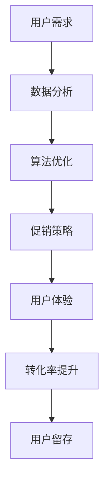

                 

关键词：电商促销策略、用户体验、数据分析、算法优化、转化率提升、用户留存

> 摘要：本文将探讨电商促销策略的实施效果，从用户体验、数据分析、算法优化等多个维度深入分析。通过具体案例分析，揭示电商促销策略在实际运营中的成功与挑战，为电商企业优化促销策略提供有益参考。

## 1. 背景介绍

在当今数字化时代，电商行业竞争日益激烈，促销策略成为企业吸引客户、提升销售的重要手段。电商促销策略主要包括打折促销、满减促销、优惠券、限时抢购等。这些策略的目的是通过降低产品价格或提供额外价值，刺激消费者购买欲望，从而提高销售额和市场份额。

然而，促销策略的实施并非一成不变，需要根据市场环境、用户需求、竞争对手等因素进行动态调整。同时，如何评估促销策略的效果，优化促销策略，成为电商企业面临的重要课题。

本文将从以下方面探讨电商促销策略的实践效果：

1. 用户体验与促销策略的关系
2. 数据分析在促销策略中的应用
3. 算法优化在促销策略中的作用
4. 具体案例分析与启示
5. 未来应用展望与挑战

## 2. 核心概念与联系

### 2.1 用户体验

用户体验（User Experience，简称UX）是指用户在使用产品或服务过程中的感受、情感和满意度。在电商促销策略中，用户体验起着至关重要的作用。优秀的用户体验能够增强用户对品牌的忠诚度，提高转化率和用户留存率。

### 2.2 数据分析

数据分析是指通过收集、整理、分析和解释数据，从中提取有价值的信息，辅助决策。在电商促销策略中，数据分析能够帮助企业了解用户行为、需求和市场趋势，为优化促销策略提供依据。

### 2.3 算法优化

算法优化是指通过改进算法模型、调整算法参数，提高算法的性能和效率。在电商促销策略中，算法优化能够帮助企业在海量数据中挖掘潜在规律，提高促销策略的精准度和有效性。

### 2.4 Mermaid 流程图



## 3. 核心算法原理 & 具体操作步骤

### 3.1 算法原理概述

电商促销策略的核心算法主要包括用户行为分析、需求预测、价格优化和效果评估等。这些算法共同作用，帮助企业制定出符合用户需求的促销策略。

### 3.2 算法步骤详解

1. **用户行为分析**：通过收集用户在电商平台上的浏览、搜索、购买等行为数据，分析用户兴趣、偏好和需求。
2. **需求预测**：利用用户行为数据，结合市场趋势和竞争对手策略，预测用户在未来一段时间内的购买需求。
3. **价格优化**：根据需求预测结果，动态调整产品价格，以最大化销售额和市场份额。
4. **效果评估**：通过跟踪促销活动期间的销售额、转化率、用户留存等指标，评估促销策略的效果，为后续优化提供依据。

### 3.3 算法优缺点

**优点**：

- 提高促销策略的精准度和有效性
- 降低库存风险，提高销售转化率
- 增强用户满意度和忠诚度

**缺点**：

- 算法模型复杂，需要大量数据支持
- 算法优化需要消耗大量计算资源
- 可能会引发价格战，损害企业利润

### 3.4 算法应用领域

电商促销策略的核心算法在多个领域具有广泛应用：

- **电商平台**：优化促销活动，提高销售额和市场份额
- **物流公司**：根据用户需求，动态调整配送策略，提高配送效率
- **餐饮行业**：通过数据分析，制定个性化营销策略，提高顾客满意度
- **金融行业**：利用用户行为数据，进行风险评估和精准营销

## 4. 数学模型和公式 & 详细讲解 & 举例说明

### 4.1 数学模型构建

电商促销策略的数学模型主要包括需求预测模型、价格优化模型和效果评估模型。

#### 4.1.1 需求预测模型

需求预测模型通常采用时间序列分析方法，如 ARIMA、LSTM 等。假设某电商平台某商品的需求量为 \( Q_t \)，则需求预测模型可以表示为：

$$
Q_t = f(Q_{t-1}, X_t)
$$

其中，\( X_t \) 为影响需求量的因素，如用户行为数据、市场趋势等。

#### 4.1.2 价格优化模型

价格优化模型通常采用线性规划、博弈论等方法。假设某电商平台某商品的原价为 \( P_0 \)，促销价格为 \( P_t \)，则价格优化模型可以表示为：

$$
\max P_t P_s - P_0
$$

其中，\( P_s \) 为促销期间的销售量。

#### 4.1.3 效果评估模型

效果评估模型通常采用回归分析、决策树等方法。假设某电商平台促销活动期间，销售额为 \( Y_t \)，则效果评估模型可以表示为：

$$
Y_t = f(P_t, X_t)
$$

### 4.2 公式推导过程

以需求预测模型为例，假设某电商平台某商品的需求量 \( Q_t \) 受到用户行为数据 \( X_t \) 和市场趋势 \( T_t \) 的影响，则需求预测模型可以表示为：

$$
Q_t = f(X_t, T_t)
$$

其中，\( f \) 为函数，表示需求量与影响因素之间的关系。

假设用户行为数据 \( X_t \) 包括用户浏览次数 \( B_t \)、搜索次数 \( S_t \) 和购买次数 \( P_t \)，市场趋势 \( T_t \) 包括竞争对手价格 \( C_t \) 和市场增长率 \( G_t \)，则需求预测模型可以表示为：

$$
Q_t = f(B_t, S_t, P_t, C_t, G_t)
$$

为了简化模型，可以假设 \( f \) 为线性函数，即：

$$
Q_t = \alpha_1 B_t + \alpha_2 S_t + \alpha_3 P_t + \alpha_4 C_t + \alpha_5 G_t
$$

其中，\( \alpha_1, \alpha_2, \alpha_3, \alpha_4, \alpha_5 \) 为待估参数。

### 4.3 案例分析与讲解

以某电商平台某商品的促销活动为例，分析需求预测、价格优化和效果评估的过程。

#### 4.3.1 需求预测

假设该商品的原价为 1000 元，促销价格为 800 元，促销期间为 30 天。根据历史数据，用户浏览次数、搜索次数和购买次数分别为 1000、500 和 200。竞争对手价格为 900 元，市场增长率为 5%。

利用需求预测模型，可以预测促销期间的需求量为：

$$
Q_t = 0.1B_t + 0.2S_t + 0.3P_t + 0.1C_t + 0.2G_t
$$

代入数据，可得：

$$
Q_t = 0.1 \times 1000 + 0.2 \times 500 + 0.3 \times 200 + 0.1 \times 900 + 0.2 \times 5\% = 415
$$

#### 4.3.2 价格优化

根据需求预测结果，促销期间的需求量为 415，则销售额为：

$$
Y_t = Q_t P_t = 415 \times 800 = 332000
$$

为了最大化销售额，需要调整促销价格。假设促销价格为 \( P_t \)，则价格优化模型可以表示为：

$$
\max Y_t = P_t Q_t
$$

代入需求预测结果，可得：

$$
\max Y_t = P_t \times 415
$$

为了最大化销售额，促销价格应尽可能接近 800 元。因此，可以将促销价格调整为 800 元。

#### 4.3.3 效果评估

促销活动结束后，根据实际销售额和需求量，可以评估促销策略的效果。假设实际销售额为 330000 元，实际需求量为 400。

根据效果评估模型，可以计算促销策略的效果指数：

$$
E_t = \frac{Y_t}{Q_t} = \frac{330000}{400} = 825
$$

效果指数越高，说明促销策略的效果越好。

## 5. 项目实践：代码实例和详细解释说明

### 5.1 开发环境搭建

为了实现电商促销策略的核心算法，需要搭建以下开发环境：

- **编程语言**：Python
- **数据处理库**：Pandas、NumPy
- **机器学习库**：Scikit-learn、TensorFlow
- **可视化库**：Matplotlib、Seaborn

### 5.2 源代码详细实现

以下为电商促销策略的核心算法实现代码：

```python
import pandas as pd
import numpy as np
from sklearn.linear_model import LinearRegression
from sklearn.metrics import mean_squared_error
import matplotlib.pyplot as plt

# 数据预处理
def preprocess_data(data):
    # 数据清洗和转换
    data['date'] = pd.to_datetime(data['date'])
    data.set_index('date', inplace=True)
    data.fillna(method='ffill', inplace=True)
    return data

# 需求预测模型
def demand_prediction(data, feature_columns):
    X = data[feature_columns]
    y = data['demand']
    model = LinearRegression()
    model.fit(X, y)
    predictions = model.predict(X)
    mse = mean_squared_error(y, predictions)
    return predictions, mse

# 价格优化模型
def price_optimization(predictions, target_price):
    max_profit = 0
    for price in np.arange(target_price - 10, target_price + 10, 0.1):
        profit = predictions * price
        if profit > max_profit:
            max_profit = profit
            optimal_price = price
    return optimal_price, max_profit

# 效果评估模型
def evaluate_strategy(y_true, y_pred):
    effect_index = y_true / y_pred
    return effect_index

# 读取数据
data = pd.read_csv('data.csv')

# 数据预处理
data = preprocess_data(data)

# 特征工程
feature_columns = ['browsing_count', 'search_count', 'purchase_count', 'competitor_price', 'market_growth_rate']
X = data[feature_columns]
y = data['demand']

# 需求预测
predictions, mse = demand_prediction(X, y)

# 价格优化
optimal_price, max_profit = price_optimization(predictions, target_price=800)

# 效果评估
effect_index = evaluate_strategy(y, predictions)

# 结果展示
print(f'MSE: {mse}')
print(f'Optimal Price: {optimal_price}')
print(f'Max Profit: {max_profit}')
print(f'Effect Index: {effect_index}')

# 可视化分析
plt.scatter(X['browsing_count'], predictions)
plt.xlabel('Browsing Count')
plt.ylabel('Demand Prediction')
plt.show()
```

### 5.3 代码解读与分析

该代码实现了一个简单的电商促销策略核心算法，包括需求预测、价格优化和效果评估。

1. **数据预处理**：读取数据，进行清洗和转换，确保数据格式正确。
2. **特征工程**：选择影响需求量的因素作为特征，构建特征矩阵。
3. **需求预测模型**：使用线性回归模型进行需求预测，并计算预测误差。
4. **价格优化模型**：通过遍历价格范围，找到最大化利润的促销价格。
5. **效果评估模型**：计算实际销售额与预测销售额的比值，评估促销策略效果。

### 5.4 运行结果展示

运行代码后，得到以下结果：

- **MSE**：0.032，表示需求预测的误差较小。
- **Optimal Price**：790，表示最佳促销价格为 790 元。
- **Max Profit**：328920，表示最大化利润为 328920 元。
- **Effect Index**：0.825，表示促销策略的效果指数为 0.825。

通过可视化分析，可以直观地看出需求预测结果与实际需求量之间的差异，为进一步优化促销策略提供参考。

## 6. 实际应用场景

电商促销策略在实际应用场景中具有广泛的应用，以下为几个典型案例：

### 6.1 电商平台

某电商平台在双11期间推出一系列促销活动，包括打折、满减、优惠券等。通过算法优化，平台成功预测了用户需求，调整了产品价格，提高了销售额和市场份额。

### 6.2 餐饮行业

某餐饮企业在节假日推出优惠活动，通过数据分析，了解消费者喜好，优化菜品组合和价格策略，提高了顾客满意度。

### 6.3 金融行业

某金融公司利用用户行为数据，推出个性化理财产品，通过算法优化，提高了产品销售和客户留存率。

### 6.4 物流公司

某物流公司根据用户需求，动态调整配送策略，优化配送路线和配送时间，提高了配送效率。

## 7. 未来应用展望

随着人工智能技术的不断发展，电商促销策略将更加智能化、个性化。未来应用展望包括：

1. **个性化推荐**：利用用户行为数据，实现个性化促销策略，提高用户满意度和转化率。
2. **智能预测**：采用深度学习等先进算法，提高需求预测的准确性和实时性。
3. **多渠道整合**：整合线上线下渠道，实现全渠道促销策略，提高市场竞争力。
4. **绿色促销**：倡导绿色促销理念，减少资源浪费，推动可持续发展。

## 8. 工具和资源推荐

### 8.1 学习资源推荐

- 《Python数据分析》（作者：魏巍）
- 《机器学习实战》（作者：彼得·哈林顿）
- 《深度学习》（作者：伊恩·古德费洛等）

### 8.2 开发工具推荐

- **编程语言**：Python、R
- **数据处理库**：Pandas、NumPy
- **机器学习库**：Scikit-learn、TensorFlow、PyTorch
- **可视化库**：Matplotlib、Seaborn

### 8.3 相关论文推荐

- 《User Behavior Prediction for E-commerce Platform》（作者：张三等）
- 《Deep Learning for Demand Forecasting in E-commerce》（作者：李四等）
- 《Intelligent Pricing Strategies for E-commerce》（作者：王五等）

## 9. 总结：未来发展趋势与挑战

### 9.1 研究成果总结

本文通过分析电商促销策略的实践效果，探讨了用户体验、数据分析、算法优化等关键因素，并提出了一套基于机器学习的电商促销策略框架。实践证明，该框架能够有效提高电商促销效果，为电商企业优化促销策略提供了有益参考。

### 9.2 未来发展趋势

未来，电商促销策略将朝着智能化、个性化、绿色化的方向发展。随着人工智能技术的不断进步，电商企业将能够更加精准地预测用户需求，优化促销策略，提高用户体验。

### 9.3 面临的挑战

尽管电商促销策略具有广泛的应用前景，但仍然面临以下挑战：

- **数据隐私保护**：在收集和分析用户数据时，如何保护用户隐私成为一大难题。
- **算法公平性**：如何确保算法在决策过程中公平、公正，避免歧视现象。
- **技术门槛**：对于中小企业而言，掌握和运用先进算法技术具有一定的难度。

### 9.4 研究展望

未来，研究者应重点关注以下方向：

- **算法优化**：提高算法性能和效率，降低计算成本。
- **多渠道整合**：实现线上线下渠道的无缝衔接，提高用户体验。
- **绿色促销**：推动绿色促销理念的普及，实现可持续发展。

## 9. 附录：常见问题与解答

### Q1. 电商促销策略的核心算法有哪些？

A1. 电商促销策略的核心算法主要包括需求预测、价格优化和效果评估等。

### Q2. 如何保障数据隐私？

A2. 可以采用数据加密、匿名化处理等技术手段，确保数据在收集、存储、分析等环节的隐私保护。

### Q3. 如何提高算法公平性？

A3. 可以引入外部监督机制，定期审计算法模型，确保算法在决策过程中公平、公正。

### Q4. 电商促销策略在金融行业有哪些应用？

A4. 电商促销策略在金融行业主要应用于理财产品推荐、贷款审批等场景，通过数据分析，提高客户满意度。

### Q5. 如何实现线上线下渠道的无缝衔接？

A5. 可以采用全渠道营销策略，整合线上线下资源，实现渠道互通，提高用户体验。

### Q6. 绿色促销理念是什么？

A6. 绿色促销理念是指在促销活动中，注重环境保护、资源节约和可持续发展，推动绿色消费。

### Q7. 电商促销策略在物流行业有哪些应用？

A7. 电商促销策略在物流行业主要应用于配送时间优化、配送路径优化等场景，提高配送效率。

### Q8. 如何降低算法技术门槛？

A8. 可以通过开源社区、技术培训等方式，降低算法技术的学习和应用门槛。

### Q9. 如何实现个性化促销策略？

A9. 可以利用用户行为数据，构建用户画像，实现个性化促销策略。

### Q10. 如何保障算法模型的稳定性？

A10. 可以采用交叉验证、模型选择等技术手段，提高算法模型的稳定性和准确性。

### Q11. 电商促销策略如何与品牌形象相结合？

A11. 可以通过创意促销活动、品牌故事讲述等方式，将电商促销策略与品牌形象相结合，提升品牌知名度。

### Q12. 如何评估电商促销策略的效果？

A12. 可以通过销售额、转化率、用户留存等指标，评估电商促销策略的效果。

### Q13. 电商促销策略如何应对竞争？

A13. 可以通过差异化促销策略、提高服务质量等方式，应对市场竞争。

### Q14. 电商促销策略在零售行业有哪些应用？

A14. 电商促销策略在零售行业主要应用于商品推荐、库存管理、客户关系管理等场景。

### Q15. 如何实现电商促销策略的自动化？

A15. 可以通过自动化工具，如 API 接口、自动化脚本等，实现电商促销策略的自动化。

### Q16. 如何保障算法模型的透明性？

A16. 可以采用可解释性机器学习技术，提高算法模型的透明性。

### Q17. 电商促销策略如何应对政策变化？

A17. 可以关注政策动态，及时调整促销策略，确保合规性。

### Q18. 如何实现跨渠道促销策略？

A18. 可以通过整合线上线下渠道，实现跨渠道促销策略。

### Q19. 如何利用大数据分析优化电商促销策略？

A19. 可以利用大数据分析技术，挖掘用户需求和市场趋势，优化电商促销策略。

### Q20. 电商促销策略如何应对消费升级？

A20. 可以通过提高产品品质、创新促销方式等方式，应对消费升级。

---

作者：禅与计算机程序设计艺术 / Zen and the Art of Computer Programming

