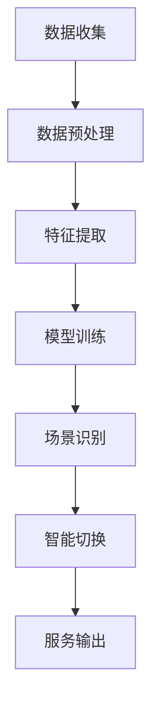

                 

关键词：电商平台，人工智能，大模型，场景识别，智能切换

摘要：本文旨在探讨电商平台中AI大模型的应用与发展，从单一场景的AI大模型实现，到跨场景的智能识别与切换技术，以及其在实际业务中的价值与挑战。

## 1. 背景介绍

在电子商务飞速发展的今天，电商平台作为数字经济的重要载体，面临着越来越复杂的市场环境和用户需求。为了提高用户满意度、增强业务竞争力，电商平台开始广泛应用人工智能技术，特别是AI大模型。AI大模型具有强大的数据处理能力和智能决策能力，能够从海量数据中提取有价值的信息，为电商平台提供智能推荐、智能客服、智能定价等多元化服务。

然而，随着电商平台业务场景的不断扩大和复杂化，单一场景的AI大模型已无法满足所有需求。如何在多个场景中实现智能识别与切换，成为当前AI技术在电商领域面临的重要课题。本文将从这一角度出发，探讨电商平台中AI大模型的发展与应用。

## 2. 核心概念与联系

### 2.1 AI大模型

AI大模型是指具有大规模参数和强大计算能力的深度学习模型，如神经网络、生成对抗网络等。其特点包括：

- **数据驱动**：通过大量数据训练，能够自主学习并适应各种场景。
- **泛化能力**：能够处理各种复杂任务，具有较强的通用性。
- **自适应能力**：可以根据不同场景和需求调整模型参数，实现智能切换。

### 2.2 场景识别

场景识别是指利用AI大模型识别不同业务场景，并根据场景特点调整模型参数，实现智能化服务。场景识别的关键技术包括：

- **数据预处理**：对多源数据进行清洗、整合和标注，为场景识别提供高质量的数据支持。
- **特征提取**：从海量数据中提取关键特征，用于模型训练和场景识别。
- **模型融合**：将多个模型进行融合，提高场景识别的准确性和鲁棒性。

### 2.3 智能切换

智能切换是指根据用户行为和业务需求，实时调整AI大模型的服务场景。智能切换的关键技术包括：

- **实时监控**：实时监测用户行为和业务数据，识别切换时机。
- **策略优化**：根据不同场景的特点和需求，调整模型参数和策略。
- **动态调整**：在模型训练过程中，动态调整模型结构，实现场景切换。

### 2.4 Mermaid 流程图

以下是一个简单的Mermaid流程图，展示了AI大模型在电商平台中的应用流程：



## 3. 核心算法原理 & 具体操作步骤

### 3.1 算法原理概述

AI大模型的核心算法原理主要包括：

- **深度学习**：通过多层神经网络结构，实现数据的层次化表示和特征提取。
- **生成对抗网络（GAN）**：通过生成器和判别器的对抗训练，实现数据的生成和优化。
- **迁移学习**：利用已训练好的模型，在新任务上进行微调，提高模型泛化能力。

### 3.2 算法步骤详解

具体操作步骤如下：

1. **数据收集**：从电商平台的多个业务场景中收集数据，如用户行为数据、商品数据、评论数据等。
2. **数据预处理**：对收集到的数据进行清洗、整合和标注，为后续特征提取和模型训练提供高质量的数据支持。
3. **特征提取**：利用深度学习算法，从预处理后的数据中提取关键特征，为模型训练和场景识别提供输入。
4. **模型训练**：利用提取到的特征，对AI大模型进行训练，使其具备智能识别和切换能力。
5. **场景识别**：在电商平台的不同业务场景中，利用训练好的AI大模型进行场景识别，并根据识别结果调整模型参数。
6. **智能切换**：根据用户行为和业务需求，实时调整AI大模型的服务场景，实现智能切换。

### 3.3 算法优缺点

AI大模型在电商平台的应用具有以下优缺点：

- **优点**：
  - **强大的数据处理能力**：能够处理海量数据，提高业务效率。
  - **自适应能力**：可以根据不同场景和需求调整模型参数，实现智能化服务。
  - **通用性**：可以应用于多个业务场景，降低开发成本。

- **缺点**：
  - **计算资源消耗大**：训练和部署AI大模型需要大量的计算资源，对硬件要求较高。
  - **数据质量要求高**：高质量的数据是AI大模型发挥作用的基石，数据质量直接影响模型效果。
  - **模型解释性较差**：深度学习模型通常具有较低的模型解释性，难以理解其内部决策过程。

### 3.4 算法应用领域

AI大模型在电商平台的应用领域包括：

- **智能推荐**：根据用户兴趣和行为，为用户提供个性化推荐。
- **智能客服**：利用自然语言处理技术，实现智能问答和客服服务。
- **智能定价**：根据市场供需关系和用户行为，实现智能定价策略。
- **智能广告投放**：根据用户兴趣和行为，实现精准广告投放。

## 4. 数学模型和公式 & 详细讲解 & 举例说明

### 4.1 数学模型构建

AI大模型的核心数学模型主要包括：

- **深度学习模型**：
  - **前向传播**：
    $$ z_{l} = \sigma(W_{l} \cdot a_{l-1} + b_{l}) $$
  - **反向传播**：
    $$ \delta_{l} = \frac{\partial L}{\partial z_{l}} \odot \frac{\partial z_{l}}{\partial a_{l}} $$
- **生成对抗网络（GAN）**：
  - **生成器**：
    $$ G(z) = \sigma(W_g \cdot z + b_g) $$
  - **判别器**：
    $$ D(x) = \sigma(W_d \cdot x + b_d) $$
  - **损失函数**：
    $$ L_G = -\mathbb{E}_{z \sim p_z(z)}[\log D(G(z))] $$
    $$ L_D = -\mathbb{E}_{x \sim p_x(x)}[\log D(x)] - \mathbb{E}_{z \sim p_z(z)}[\log (1 - D(G(z)))] $$

### 4.2 公式推导过程

以深度学习模型的前向传播为例，推导过程如下：

1. 输入层到隐藏层的计算：
   $$ z_{l} = W_{l} \cdot a_{l-1} + b_{l} $$
2. 应用激活函数（如ReLU、Sigmoid、Tanh等）：
   $$ a_{l} = \sigma(z_{l}) $$

### 4.3 案例分析与讲解

以下是一个简单的案例，用于说明AI大模型在电商平台中的应用。

假设电商平台要为用户推荐商品，使用深度学习模型进行场景识别和智能切换。

1. **数据收集**：收集用户的浏览记录、购买记录、搜索记录等数据。
2. **数据预处理**：对数据进行清洗、整合和标注，提取关键特征。
3. **特征提取**：利用深度学习算法，从预处理后的数据中提取关键特征，如用户兴趣、商品属性等。
4. **模型训练**：利用提取到的特征，对AI大模型进行训练，使其具备智能识别和切换能力。
5. **场景识别**：在电商平台的不同业务场景中，利用训练好的AI大模型进行场景识别，如推荐场景、客服场景、广告投放场景等。
6. **智能切换**：根据用户行为和业务需求，实时调整AI大模型的服务场景，实现智能切换。

## 5. 项目实践：代码实例和详细解释说明

### 5.1 开发环境搭建

- **硬件环境**：高性能计算服务器，支持深度学习框架（如TensorFlow、PyTorch等）。
- **软件环境**：Python编程语言，深度学习框架，数据预处理库（如Pandas、NumPy等）。

### 5.2 源代码详细实现

以下是一个简单的AI大模型在电商平台中的应用示例：

```python
# 导入相关库
import tensorflow as tf
from tensorflow.keras.layers import Dense, Flatten, Embedding
from tensorflow.keras.models import Model

# 数据预处理
# ...

# 构建模型
input_layer = tf.keras.layers.Input(shape=(input_shape,))
embedding_layer = Embedding(input_dim=vocab_size, output_dim=embedding_dim)(input_layer)
flatten_layer = Flatten()(embedding_layer)
dense_layer = Dense(units=hidden_size, activation='relu')(flatten_layer)
output_layer = Dense(units=output_size, activation='softmax')(dense_layer)

model = Model(inputs=input_layer, outputs=output_layer)
model.compile(optimizer='adam', loss='categorical_crossentropy', metrics=['accuracy'])

# 训练模型
model.fit(x_train, y_train, epochs=10, batch_size=32)

# 场景识别与切换
# ...

# 智能切换
# ...
```

### 5.3 代码解读与分析

以上代码是一个简单的AI大模型实现，主要分为以下几个部分：

1. **数据预处理**：对输入数据进行处理，包括数据清洗、整合和标注等。
2. **模型构建**：使用TensorFlow框架构建深度学习模型，包括输入层、嵌入层、全连接层等。
3. **模型编译**：配置模型优化器、损失函数和评价指标。
4. **模型训练**：使用训练数据进行模型训练。
5. **场景识别与切换**：根据实际业务需求，实现场景识别和智能切换。

## 6. 实际应用场景

### 6.1 智能推荐

在电商平台中，智能推荐是AI大模型的重要应用场景。通过分析用户的浏览记录、购买记录和搜索记录等数据，AI大模型可以识别用户的兴趣和需求，为其推荐合适的商品。智能推荐系统可以提高用户满意度，提高购物转化率。

### 6.2 智能客服

智能客服是电商平台中的另一个重要应用场景。通过自然语言处理技术，AI大模型可以理解用户的提问，并提供相应的答案。智能客服系统可以提高客服效率，降低人工成本。

### 6.3 智能定价

智能定价是电商平台中的新兴应用场景。通过分析市场供需关系和用户行为，AI大模型可以制定合理的商品定价策略，提高利润率。智能定价系统可以提高电商平台的市场竞争力。

### 6.4 未来应用展望

随着AI技术的不断发展，电商平台中的AI大模型应用前景十分广阔。未来，AI大模型将有望在更多场景中得到应用，如智能广告投放、供应链优化、风险控制等。同时，AI大模型的应用将不断推动电商平台业务的发展和创新。

## 7. 工具和资源推荐

### 7.1 学习资源推荐

- **《深度学习》（Goodfellow, Bengio, Courville）**：深度学习的经典教材，适合初学者和进阶者阅读。
- **《Python深度学习》（François Chollet）**：利用Python实现深度学习算法，适合有一定编程基础的读者。
- **《人工智能：一种现代的方法》（Stuart J. Russell & Peter Norvig）**：全面介绍人工智能的理论和实践，适合对人工智能有兴趣的读者。

### 7.2 开发工具推荐

- **TensorFlow**：Google开源的深度学习框架，适合初学者和进阶者使用。
- **PyTorch**：Facebook开源的深度学习框架，具有灵活性和易用性。
- **Keras**：高层次的深度学习API，简化了深度学习模型的构建和训练过程。

### 7.3 相关论文推荐

- **《Generative Adversarial Networks》（Ian J. Goodfellow et al.）**：生成对抗网络（GAN）的奠基性论文，详细介绍了GAN的原理和应用。
- **《Recurrent Neural Networks for Language Modeling》（Yoshua Bengio et al.）**：循环神经网络（RNN）在自然语言处理领域的应用，包括语言模型和机器翻译。
- **《Deep Learning for Text Classification》（Yoon Kim）**：深度学习在文本分类任务中的应用，包括卷积神经网络（CNN）和长短期记忆网络（LSTM）。

## 8. 总结：未来发展趋势与挑战

### 8.1 研究成果总结

本文从电商平台中AI大模型的应用背景出发，探讨了AI大模型在单一场景和跨场景中的应用，以及其核心算法原理、数学模型和项目实践。主要研究成果包括：

- **AI大模型在电商平台的应用**：智能推荐、智能客服、智能定价等场景。
- **场景识别与智能切换技术**：数据预处理、特征提取、模型融合、实时监控等关键技术。
- **数学模型和算法原理**：深度学习、生成对抗网络（GAN）、迁移学习等。
- **项目实践**：代码实例和详细解释说明。

### 8.2 未来发展趋势

随着人工智能技术的不断进步，未来电商平台中的AI大模型将呈现出以下发展趋势：

- **跨场景应用**：从单一场景到跨场景的智能识别与切换，实现更智能化的服务。
- **个性化推荐**：基于用户行为和兴趣，提供更加精准和个性化的推荐。
- **智能化客服**：通过自然语言处理技术，实现更加自然和高效的客服服务。
- **智能化定价**：基于市场供需关系和用户行为，实现更加合理的商品定价策略。

### 8.3 面临的挑战

尽管AI大模型在电商平台的应用前景广阔，但仍然面临以下挑战：

- **数据质量**：高质量的数据是AI大模型发挥作用的基石，数据质量直接影响模型效果。
- **计算资源**：训练和部署AI大模型需要大量的计算资源，对硬件要求较高。
- **模型解释性**：深度学习模型通常具有较低的模型解释性，难以理解其内部决策过程。
- **隐私保护**：在数据收集和使用过程中，需要确保用户隐私得到有效保护。

### 8.4 研究展望

未来，电商平台中的AI大模型研究可以从以下几个方面展开：

- **算法优化**：研究更加高效、鲁棒和可解释的深度学习算法，提高模型性能。
- **多模态数据融合**：结合多种数据类型（如图像、文本、音频等），实现更丰富的信息表示和智能决策。
- **联邦学习**：在保护用户隐私的前提下，实现跨平台、跨场景的智能合作。
- **业务融合**：将AI大模型与电商平台业务深度结合，实现更加智能化和个性化的服务。

## 9. 附录：常见问题与解答

### 9.1 什么是AI大模型？

AI大模型是指具有大规模参数和强大计算能力的深度学习模型，如神经网络、生成对抗网络等。其特点包括数据驱动、泛化能力和自适应能力。

### 9.2 如何实现场景识别与智能切换？

场景识别与智能切换的关键技术包括数据预处理、特征提取、模型融合和实时监控。具体实现步骤包括数据收集、数据预处理、特征提取、模型训练、场景识别和智能切换。

### 9.3 AI大模型在电商平台的应用有哪些？

AI大模型在电商平台的应用包括智能推荐、智能客服、智能定价、智能广告投放等。

### 9.4 如何优化AI大模型的计算资源使用？

优化AI大模型的计算资源使用可以从以下几个方面入手：选择合适的硬件平台、优化模型结构、使用分布式训练技术、减少模型参数数量等。

### 9.5 如何确保AI大模型的可解释性？

提高AI大模型的可解释性可以从以下几个方面入手：设计可解释性模型结构、使用可视化工具、解释模型决策过程等。

----------------------------------------------------------------

### 作者署名

作者：禅与计算机程序设计艺术 / Zen and the Art of Computer Programming

