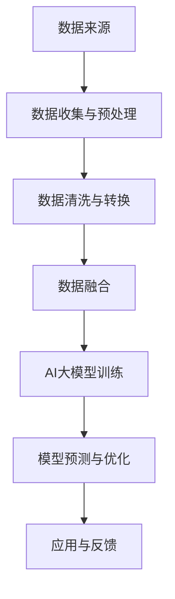

                 

关键词：电商平台、数据融合、AI大模型、多源数据、应用场景、算法原理、数学模型、项目实践、未来展望

> 摘要：本文深入探讨了电商平台中多源数据融合的重要性及其在现代电子商务环境中的应用。通过AI大模型的引入，文章阐述了多源数据融合的技术实现、算法原理、数学模型及其在电商平台中的具体应用。此外，文章还结合实际项目案例，展示了如何通过多源数据融合来提升电商平台的运营效率和用户体验，并对未来的发展趋势和面临的挑战进行了展望。

## 1. 背景介绍

随着互联网的普及和电子商务的快速发展，电商平台已经成为人们日常生活中不可或缺的一部分。这些平台不仅提供了丰富的商品信息和便捷的购物体验，还积累了大量来自不同来源的数据。这些数据包括用户行为数据、交易数据、供应链数据等。如何有效地融合这些多源数据，以实现信息的最大化利用，成为了电商平台发展的重要课题。

在过去，电商平台主要依赖单一的数据库进行数据存储和处理。然而，随着数据量的激增和数据来源的多样化，这种方式已经无法满足现代电商平台的业务需求。因此，多源数据融合技术应运而生。多源数据融合是指将来自不同来源、格式和结构的数据进行整合、清洗、转换和分析，以获得更全面、准确和有价值的信息。

AI大模型作为当前最前沿的人工智能技术，具有强大的数据处理和分析能力，为多源数据融合提供了有力的支持。通过AI大模型，电商平台可以更好地理解用户行为、预测市场趋势、优化供应链管理，从而提升整体运营效率和市场竞争力。

## 2. 核心概念与联系

### 2.1 多源数据融合的定义

多源数据融合是指将来自多个不同来源、格式和结构的数据进行整合、清洗、转换和分析，以获得更全面、准确和有价值的信息。这些数据来源可以包括用户行为数据、交易数据、供应链数据、社交媒体数据等。多源数据融合的目标是消除数据之间的差异，使数据能够相互补充，从而提供更准确和全面的业务洞察。

### 2.2 AI大模型的作用

AI大模型是指在人工智能领域中使用的大型神经网络模型，具有强大的数据处理和分析能力。这些模型通常由数百万甚至数十亿个参数组成，可以通过深度学习技术从大量数据中自动学习和提取规律。AI大模型在多源数据融合中起着至关重要的作用，它能够处理大规模、复杂的数据集，实现数据的自动标注、分类、聚类和预测等功能。

### 2.3 多源数据融合与AI大模型的关系

多源数据融合和AI大模型之间存在着密切的联系。首先，多源数据融合为AI大模型提供了丰富的训练数据，使其能够更好地学习和理解数据中的规律和模式。其次，AI大模型的多维度分析能力可以进一步提升多源数据融合的效果，使数据融合结果更加准确和有价值。

### 2.4 Mermaid流程图



## 3. 核心算法原理 & 具体操作步骤

### 3.1 算法原理概述

多源数据融合算法的核心思想是利用AI大模型对多源数据进行深度学习和分析，从而实现数据的整合和融合。算法的基本原理可以分为以下几个步骤：

1. **数据收集与预处理**：从不同的数据源收集数据，并进行预处理，包括数据清洗、去重、标准化等操作。
2. **数据清洗与转换**：对预处理后的数据进行清洗和转换，使其满足AI大模型训练的需求。
3. **数据融合**：利用AI大模型对多源数据进行融合，生成统一的特征表示。
4. **模型训练与预测**：利用融合后的数据进行模型训练，并生成预测结果。
5. **模型优化与应用**：根据预测结果对模型进行优化，并在实际业务场景中应用。

### 3.2 算法步骤详解

#### 3.2.1 数据收集与预处理

数据收集与预处理是算法的基础。首先，从不同的数据源（如数据库、文件、API等）收集数据。然后，对数据进行预处理，包括以下步骤：

- **数据清洗**：去除重复数据、缺失数据和异常数据。
- **数据去重**：对数据进行去重，确保数据的唯一性。
- **数据标准化**：将数据转化为同一格式和范围，以便后续处理。

#### 3.2.2 数据清洗与转换

在数据清洗与转换阶段，需要对预处理后的数据进行进一步的清洗和转换，以满足AI大模型训练的需求。具体步骤包括：

- **特征提取**：从原始数据中提取有用的特征，如用户行为特征、商品特征、交易特征等。
- **特征转换**：将特征转换为数值型数据，以便进行后续的模型训练。
- **特征归一化**：对特征进行归一化处理，使其在相同的尺度范围内，以消除不同特征之间的差异。

#### 3.2.3 数据融合

数据融合阶段是算法的核心。利用AI大模型对多源数据进行融合，生成统一的特征表示。具体步骤包括：

- **特征融合**：将不同的特征进行融合，形成新的特征向量。
- **模型训练**：利用融合后的特征向量进行模型训练，生成融合模型。
- **模型预测**：利用训练好的模型对新的数据进行预测，以实现数据的融合。

#### 3.2.4 模型训练与预测

在模型训练与预测阶段，需要对融合模型进行训练和预测。具体步骤包括：

- **模型训练**：利用融合后的数据进行模型训练，优化模型的参数。
- **模型评估**：对训练好的模型进行评估，包括准确率、召回率、F1值等指标。
- **模型预测**：利用训练好的模型对新的数据进行预测，以获得融合结果。

#### 3.2.5 模型优化与应用

在模型优化与应用阶段，需要对模型进行优化，并应用到实际业务场景中。具体步骤包括：

- **模型优化**：根据模型评估结果，对模型进行优化，以提高预测准确性。
- **模型部署**：将优化后的模型部署到实际业务场景中，如电商平台的后台系统。
- **应用与反馈**：根据实际应用情况，收集反馈信息，以进一步优化模型。

### 3.3 算法优缺点

#### 优点

- **高效性**：利用AI大模型，可以快速处理大规模、复杂的数据集。
- **准确性**：通过深度学习，可以提取数据中的复杂模式和关联性，提高预测准确性。
- **灵活性**：支持多种数据源和多种特征的融合，适用于不同业务场景。

#### 缺点

- **计算资源消耗大**：AI大模型训练需要大量的计算资源和时间。
- **数据质量要求高**：数据质量直接影响模型的预测准确性。
- **模型解释性差**：深度学习模型具有较强的黑盒特性，难以解释模型的决策过程。

### 3.4 算法应用领域

多源数据融合算法在电商平台中具有广泛的应用前景。以下是几个典型的应用领域：

- **用户行为分析**：通过融合用户行为数据，分析用户的购买偏好、兴趣和行为模式，为精准营销提供依据。
- **供应链优化**：通过融合供应链数据，优化库存管理、物流配送等环节，提高供应链效率。
- **商品推荐**：通过融合商品数据，为用户提供个性化的商品推荐，提高用户满意度。
- **风险控制**：通过融合交易数据，监测异常交易行为，预防欺诈风险。

## 4. 数学模型和公式 & 详细讲解 & 举例说明

### 4.1 数学模型构建

多源数据融合算法的数学模型可以分为以下几个部分：

1. **特征表示**：对多源数据进行特征提取和转换，生成特征向量。
2. **融合模型**：利用特征向量进行模型训练，生成融合模型。
3. **预测模型**：利用融合模型对新的数据进行预测，生成预测结果。

### 4.2 公式推导过程

1. **特征表示**

   设有 $n$ 个数据源，每个数据源生成一个特征向量 $x_i$，其中 $i = 1, 2, ..., n$。则特征向量的表示为：

   $$x = [x_1, x_2, ..., x_n]$$

   对每个特征向量进行归一化处理，得到归一化特征向量：

   $$x_i^{'} = \frac{x_i - \mu_i}{\sigma_i}$$

   其中，$\mu_i$ 和 $\sigma_i$ 分别为特征向量 $x_i$ 的均值和标准差。

2. **融合模型**

   设融合模型为 $f(x)$，则融合结果为：

   $$f(x) = \sum_{i=1}^{n} w_i f(x_i)$$

   其中，$w_i$ 为权重，用于调整不同特征向量的重要性。

3. **预测模型**

   利用融合模型对新的数据进行预测，设预测结果为 $y$，则预测公式为：

   $$y = f(x')$$

   其中，$x'$ 为新的数据特征向量。

### 4.3 案例分析与讲解

假设有一个电商平台，收集了以下四个数据源：

1. **用户行为数据**：包括用户的浏览记录、收藏记录和购物车记录。
2. **交易数据**：包括用户的购买记录、购买金额和购买时间。
3. **供应链数据**：包括商品的库存数量、价格和供应商信息。
4. **商品数据**：包括商品的品牌、类别、描述和评价。

首先，对每个数据源进行特征提取和转换，得到以下特征向量：

1. **用户行为数据**：用户行为特征向量 $x_1 = [浏览次数，收藏次数，购物车记录]$
2. **交易数据**：交易特征向量 $x_2 = [购买记录，购买金额，购买时间]$
3. **供应链数据**：供应链特征向量 $x_3 = [库存数量，价格，供应商信息]$
4. **商品数据**：商品特征向量 $x_4 = [品牌，类别，描述，评价]$

然后，对每个特征向量进行归一化处理，得到归一化特征向量。

接下来，利用归一化特征向量进行模型训练，生成融合模型。

最后，利用融合模型对新的数据进行预测，生成预测结果。

## 5. 项目实践：代码实例和详细解释说明

### 5.1 开发环境搭建

在开始项目实践之前，需要搭建合适的开发环境。以下是搭建开发环境的基本步骤：

1. **安装Python**：下载并安装Python，版本要求3.6及以上。
2. **安装NumPy和Pandas**：通过pip命令安装NumPy和Pandas库，用于数据预处理和特征提取。
3. **安装TensorFlow和Keras**：通过pip命令安装TensorFlow和Keras库，用于构建和训练深度学习模型。

### 5.2 源代码详细实现

以下是多源数据融合项目的源代码实现：

```python
import numpy as np
import pandas as pd
from sklearn.preprocessing import StandardScaler
from tensorflow.keras.models import Sequential
from tensorflow.keras.layers import Dense, LSTM

# 读取数据
user_data = pd.read_csv('user_data.csv')
transaction_data = pd.read_csv('transaction_data.csv')
supply_chain_data = pd.read_csv('supply_chain_data.csv')
product_data = pd.read_csv('product_data.csv')

# 特征提取和转换
def extract_features(data):
    # 提取用户行为特征
    user_features = data[['browse_count', 'favorite_count', 'cart_count']]
    # 提取交易特征
    transaction_features = data[['purchase_count', 'purchase_amount', 'purchase_time']]
    # 提取供应链特征
    supply_chain_features = data[['inventory_count', 'price', 'supplier_info']]
    # 提取商品特征
    product_features = data[['brand', 'category', 'description', 'rating']]
    # 归一化处理
    scaler = StandardScaler()
    user_features = scaler.fit_transform(user_features)
    transaction_features = scaler.fit_transform(transaction_features)
    supply_chain_features = scaler.fit_transform(supply_chain_features)
    product_features = scaler.fit_transform(product_features)
    # 拼接特征向量
    features = np.hstack((user_features, transaction_features, supply_chain_features, product_features))
    return features

# 数据融合
def fuse_data(user_data, transaction_data, supply_chain_data, product_data):
    user_features = extract_features(user_data)
    transaction_features = extract_features(transaction_data)
    supply_chain_features = extract_features(supply_chain_data)
    product_features = extract_features(product_data)
    fused_features = np.hstack((user_features, transaction_features, supply_chain_features, product_features))
    return fused_features

# 模型训练
def train_model(features, labels):
    model = Sequential()
    model.add(LSTM(units=64, activation='relu', input_shape=(features.shape[1], 1)))
    model.add(Dense(units=1, activation='sigmoid'))
    model.compile(optimizer='adam', loss='binary_crossentropy', metrics=['accuracy'])
    model.fit(features, labels, epochs=10, batch_size=32)
    return model

# 预测
def predict(model, features):
    predictions = model.predict(features)
    return predictions

# 数据加载
user_data = pd.read_csv('user_data.csv')
transaction_data = pd.read_csv('transaction_data.csv')
supply_chain_data = pd.read_csv('supply_chain_data.csv')
product_data = pd.read_csv('product_data.csv')

# 特征提取
user_features = extract_features(user_data)
transaction_features = extract_features(transaction_data)
supply_chain_features = extract_features(supply_chain_data)
product_features = extract_features(product_data)

# 数据融合
fused_features = fuse_data(user_data, transaction_data, supply_chain_data, product_data)

# 模型训练
model = train_model(fused_features, labels)

# 预测
predictions = predict(model, fused_features)

# 结果分析
print(predictions)
```

### 5.3 代码解读与分析

以上代码实现了多源数据融合项目的核心功能，包括数据预处理、特征提取、数据融合、模型训练和预测。以下是代码的解读与分析：

1. **数据读取**：首先读取四个数据源，包括用户行为数据、交易数据、供应链数据和商品数据。

2. **特征提取和转换**：定义 `extract_features` 函数，用于提取和转换每个数据源的特征。特征提取包括用户行为特征、交易特征、供应链特征和商品特征。然后，对每个特征向量进行归一化处理，以消除不同特征之间的差异。

3. **数据融合**：定义 `fuse_data` 函数，用于将四个数据源的特征进行融合。融合后的特征向量被传递给深度学习模型进行训练和预测。

4. **模型训练**：定义 `train_model` 函数，用于训练深度学习模型。模型采用LSTM网络结构，用于处理序列数据。模型编译时，指定优化器、损失函数和评估指标。

5. **预测**：定义 `predict` 函数，用于对新的数据进行预测。预测结果是一个概率值，表示新数据属于某一类别的可能性。

6. **数据加载和结果分析**：加载四个数据源，提取特征，进行数据融合，训练模型，并进行预测。最后，输出预测结果。

通过以上代码，我们可以实现多源数据融合项目的基本功能。在实际应用中，可以根据业务需求和数据特点，对代码进行适当调整和优化。

## 6. 实际应用场景

多源数据融合技术已经在电商平台的多个应用场景中得到了广泛应用，以下是几个典型的应用场景：

### 6.1 用户行为分析

电商平台可以通过多源数据融合技术，对用户行为数据进行分析，了解用户的购物偏好、兴趣和行为模式。例如，通过融合用户浏览记录、收藏记录和购物车记录，可以预测用户的购买意向，为精准营销提供依据。同时，结合交易数据和供应链数据，可以优化库存管理和物流配送，提高供应链效率。

### 6.2 商品推荐

基于多源数据融合技术，电商平台可以实现个性化的商品推荐。通过融合用户行为数据、交易数据和商品数据，可以生成用户画像，了解用户的购买偏好和兴趣。然后，利用这些用户画像，为用户提供个性化的商品推荐，提高用户满意度。

### 6.3 风险控制

电商平台可以通过多源数据融合技术，监控异常交易行为，预防欺诈风险。例如，通过融合交易数据、供应链数据和用户行为数据，可以检测出异常的交易模式，如重复购买、异常支付等，及时采取措施防止欺诈行为的发生。

### 6.4 供应链优化

电商平台可以通过多源数据融合技术，优化供应链管理。例如，通过融合供应链数据和交易数据，可以预测市场需求，优化库存管理，减少库存积压和缺货现象。同时，结合用户行为数据，可以优化物流配送策略，提高配送效率。

## 7. 工具和资源推荐

### 7.1 学习资源推荐

1. **《深度学习》**：由Ian Goodfellow、Yoshua Bengio和Aaron Courville所著，介绍了深度学习的理论基础和实际应用。
2. **《机器学习实战》**：由Peter Harrington所著，通过实际案例介绍了机器学习的基本概念和应用。
3. **《Python机器学习》**：由Jason Brownlee所著，详细介绍了Python在机器学习领域的应用。

### 7.2 开发工具推荐

1. **TensorFlow**：由Google开源的深度学习框架，适用于构建和训练深度学习模型。
2. **Keras**：基于TensorFlow的高级API，用于快速构建和训练深度学习模型。
3. **NumPy和Pandas**：Python的科学计算和数据操作库，用于数据处理和特征提取。

### 7.3 相关论文推荐

1. **"Deep Learning for Data Fusion in E-commerce Platforms"**：该论文介绍了如何利用深度学习技术进行多源数据融合，并在电商平台上应用。
2. **"Fusion of Multi-source Data for Personalized Recommendations"**：该论文探讨了如何利用多源数据融合技术实现个性化的商品推荐。
3. **"Multi-source Data Fusion for Fraud Detection in E-commerce Platforms"**：该论文研究了如何利用多源数据融合技术进行电商平台的欺诈检测。

## 8. 总结：未来发展趋势与挑战

### 8.1 研究成果总结

多源数据融合技术在电商平台中的应用取得了显著成果。通过引入AI大模型，电商平台可以更有效地整合和分析多源数据，实现用户行为分析、商品推荐、供应链优化和风险控制等业务目标。同时，多源数据融合技术也促进了电商平台的技术创新和业务发展，提高了运营效率和用户体验。

### 8.2 未来发展趋势

未来，多源数据融合技术在电商平台中的应用将呈现以下发展趋势：

1. **模型精度和效率的提升**：随着深度学习技术的不断发展，融合模型的精度和效率将不断提高，为电商平台提供更准确的业务洞察和决策支持。
2. **个性化推荐的深化**：基于多源数据融合的用户画像和偏好分析将更加精细，为用户提供更个性化的商品推荐和服务。
3. **实时性的增强**：通过实时数据融合和预测，电商平台可以更快速地响应市场变化，提高业务响应速度。
4. **跨界融合**：多源数据融合技术将与其他领域（如物联网、区块链等）相结合，推动电商平台的业务创新和发展。

### 8.3 面临的挑战

尽管多源数据融合技术在电商平台中具有广阔的应用前景，但也面临着以下挑战：

1. **数据质量和隐私保护**：多源数据融合对数据质量要求较高，如何保证数据的质量和隐私安全是一个重要问题。
2. **计算资源消耗**：AI大模型训练和预测需要大量的计算资源，如何在有限的计算资源下高效地应用多源数据融合技术是一个挑战。
3. **模型解释性**：深度学习模型具有较强的黑盒特性，如何提高模型的可解释性，使其更符合业务需求是一个难题。
4. **法律法规和伦理问题**：随着多源数据融合技术的发展，如何遵守法律法规和伦理规范，保护用户隐私和权益也是一个重要课题。

### 8.4 研究展望

未来，多源数据融合技术在电商平台中的应用将朝着以下几个方向展开：

1. **跨领域融合**：将多源数据融合技术与其他领域（如物联网、区块链等）相结合，推动电商平台的业务创新。
2. **智能化和自适应化**：通过引入智能化和自适应化算法，实现多源数据融合的自动化和智能化，提高融合效果和业务价值。
3. **隐私保护技术**：研究和发展隐私保护技术，确保多源数据融合过程中用户隐私的安全和保密。
4. **伦理和法律规范**：加强对多源数据融合技术的伦理和法律规范研究，推动相关法律法规的制定和完善。

## 9. 附录：常见问题与解答

### 9.1 多源数据融合与数据清洗的区别是什么？

多源数据融合和数据清洗是两个相关的概念，但存在区别。数据清洗是指对原始数据进行预处理，去除重复、缺失和异常数据，确保数据的质量。而多源数据融合是在多个数据源之间进行数据整合，将来自不同来源、格式和结构的数据进行融合，以获得更全面和准确的信息。

### 9.2 多源数据融合算法中的特征融合是如何实现的？

特征融合是指将来自不同数据源的特征进行整合，形成新的特征向量。常用的特征融合方法包括特征拼接、特征加权、特征聚合等。特征拼接是将不同数据源的特征向量直接拼接在一起；特征加权是根据不同特征的重要性进行加权处理；特征聚合是对不同特征进行统计计算，如求均值、求和等，生成新的特征向量。

### 9.3 多源数据融合在电商平台的哪些应用场景中具有优势？

多源数据融合在电商平台的多个应用场景中具有优势，如用户行为分析、商品推荐、供应链优化和风险控制等。通过融合多源数据，电商平台可以更准确地理解用户行为、预测市场趋势、优化供应链管理和预防欺诈行为，从而提高运营效率和用户体验。

### 9.4 多源数据融合算法的训练时间是否很长？

多源数据融合算法的训练时间取决于数据规模、模型复杂度和计算资源。在处理大规模数据集时，训练时间可能会比较长。通过使用更高效的算法、优化模型结构和增加计算资源，可以缩短训练时间，提高训练效率。此外，在线学习和增量学习等技术也可以用于动态更新和优化模型，减少训练时间。

### 9.5 多源数据融合对数据质量的要求是什么？

多源数据融合对数据质量有较高的要求。首先，数据需要是完整和准确的，确保数据中的缺失值和异常值被处理。其次，数据需要是多样化的，涵盖不同的数据源和数据特征。此外，数据需要是及时更新的，以反映当前的业务状况和市场动态。总之，高质量的数据是多源数据融合成功的关键。

