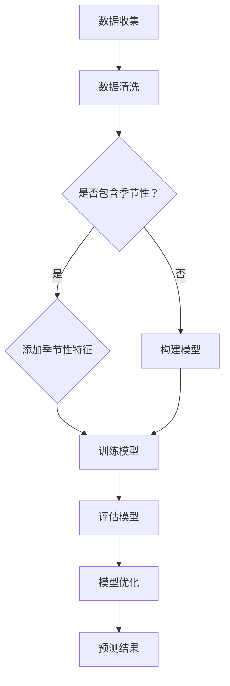

                 

关键词：电商平台，时间序列预测，AI大模型，应用场景，未来展望

> 摘要：本文将探讨在电商平台中应用AI大模型进行时间序列预测的重要性及具体实践。通过阐述时间序列预测的基本概念，介绍AI大模型在其中的关键角色，以及具体算法原理、数学模型和项目实践，本文旨在为电商从业者提供一些建议和思路，以充分利用AI大模型提高电商平台的市场竞争力。

## 1. 背景介绍

### 1.1 电商平台的现状

随着互联网技术的迅猛发展，电商平台已经成为人们生活中不可或缺的一部分。从亚马逊、淘宝到京东，各种电商平台的崛起不仅改变了传统的购物方式，也为消费者带来了更多的便利和选择。然而，随着市场竞争的日益激烈，电商平台需要不断创新和优化，才能在激烈的市场中脱颖而出。

### 1.2 时间序列预测的重要性

时间序列预测是数据分析领域的一个重要分支，它旨在根据过去的数据预测未来的趋势。在电商平台中，时间序列预测具有以下几个重要应用场景：

- **需求预测**：通过预测商品的需求量，电商平台可以更好地调整库存，减少积压和断货的情况，提高运营效率。

- **价格策略**：根据市场需求的变化，合理调整商品价格，既可以吸引更多的消费者，又能保证平台的利润。

- **促销活动**：通过预测促销活动的效果，电商平台可以优化促销策略，提高活动效果，增加销售额。

- **物流规划**：预测商品的销售趋势，可以更好地规划物流配送，减少配送成本，提高客户满意度。

## 2. 核心概念与联系

### 2.1 时间序列预测的基本概念

时间序列预测主要包括以下几个基本概念：

- **时间序列**：一系列按时间顺序排列的数据点，例如日销售额、月订单量等。

- **趋势**：数据随时间增长或减少的长期方向。

- **季节性**：由于特定周期性事件（如节假日、季节变化）导致的数据波动。

- **噪声**：数据中的随机波动，可能影响预测的准确性。

### 2.2 AI大模型在时间序列预测中的应用

AI大模型在时间序列预测中发挥着关键作用，主要包括以下几种：

- **深度学习模型**：如循环神经网络（RNN）、长短期记忆网络（LSTM）、变换器（Transformer）等。

- **强化学习模型**：通过学习如何做出最优决策，从而优化时间序列预测。

- **传统机器学习模型**：如线性回归、ARIMA、SARIMA等，虽然精度不如深度学习模型，但在某些情况下仍然具有应用价值。

### 2.3 时间序列预测的Mermaid流程图

下面是时间序列预测的Mermaid流程图：



## 3. 核心算法原理 & 具体操作步骤

### 3.1 算法原理概述

在时间序列预测中，常用的深度学习模型包括循环神经网络（RNN）、长短期记忆网络（LSTM）和变换器（Transformer）等。这些模型通过学习时间序列中的特征和模式，可以预测未来的趋势。

- **RNN**：RNN可以通过记忆过去的输入，捕捉时间序列中的长期依赖关系。

- **LSTM**：LSTM是RNN的一种变体，通过引入门控机制，可以更好地处理长序列数据。

- **Transformer**：Transformer是一种基于自注意力机制的模型，通过全局注意机制捕捉时间序列中的所有依赖关系。

### 3.2 算法步骤详解

以下是使用LSTM模型进行时间序列预测的具体步骤：

1. **数据准备**：收集电商平台的销售数据，包括销售额、订单量等。

2. **数据预处理**：对数据进行清洗和归一化处理，将数据转换为适合训练模型的形式。

3. **构建模型**：定义LSTM模型的结构，包括输入层、隐藏层和输出层。

4. **训练模型**：使用训练数据对模型进行训练，调整模型的参数。

5. **评估模型**：使用测试数据评估模型的预测效果，调整模型参数。

6. **预测**：使用训练好的模型对未来的销售数据进行预测。

### 3.3 算法优缺点

- **优点**：深度学习模型可以捕捉时间序列中的复杂特征和模式，提高预测的准确性。

- **缺点**：训练过程复杂，需要大量数据和计算资源；对数据质量和预处理要求较高。

### 3.4 算法应用领域

- **需求预测**：电商平台可以通过需求预测优化库存管理，减少库存成本。

- **价格策略**：根据需求预测结果，合理调整商品价格，提高销售额。

- **促销活动**：预测促销活动的效果，优化促销策略，提高活动效果。

## 4. 数学模型和公式 & 详细讲解 & 举例说明

### 4.1 数学模型构建

时间序列预测的数学模型主要包括以下部分：

- **特征提取**：将时间序列数据转换为特征向量。

- **预测模型**：建立预测模型，如线性回归、LSTM等。

- **损失函数**：定义损失函数，如均方误差（MSE）。

- **优化算法**：使用优化算法（如梯度下降）调整模型参数。

### 4.2 公式推导过程

以LSTM模型为例，以下是LSTM模型的基本公式推导：

- **输入门**：

  $$ i_t = \sigma(W_{xi}x_t + W_{hi}h_{t-1} + b_i) $$

- **遗忘门**：

  $$ f_t = \sigma(W_{xf}x_t + W_{hf}h_{t-1} + b_f) $$

- **输出门**：

  $$ o_t = \sigma(W_{xo}x_t + W_{ho}h_{t-1} + b_o) $$

- **细胞状态更新**：

  $$ C_t = f_t \odot C_{t-1} + i_t \odot \tanh(W_{xc}x_t + W_{hc}h_{t-1} + b_c) $$

- **隐藏状态更新**：

  $$ h_t = o_t \odot \tanh(C_t) $$

### 4.3 案例分析与讲解

以下是一个简单的LSTM模型在时间序列预测中的案例：

假设我们要预测一个电商平台的日销售额，数据集包含过去一年的日销售额。

1. **数据准备**：将日销售额数据进行归一化处理，得到特征向量。

2. **模型构建**：使用TensorFlow构建LSTM模型，定义输入层、隐藏层和输出层。

3. **训练模型**：使用训练数据对模型进行训练，调整模型的参数。

4. **评估模型**：使用测试数据评估模型的预测效果。

5. **预测**：使用训练好的模型对未来的日销售额进行预测。

## 5. 项目实践：代码实例和详细解释说明

### 5.1 开发环境搭建

为了实现时间序列预测，我们需要搭建以下开发环境：

- **Python**：Python是一种常用的编程语言，适用于数据分析、机器学习等。

- **TensorFlow**：TensorFlow是一个开源的机器学习框架，支持构建和训练深度学习模型。

- **Pandas**：Pandas是一个Python数据操作库，适用于数据清洗、数据预处理等。

- **Numpy**：Numpy是一个Python科学计算库，适用于数据处理、数值计算等。

### 5.2 源代码详细实现

以下是使用TensorFlow和Pandas实现LSTM模型的时间序列预测的代码：

```python
import pandas as pd
import numpy as np
import tensorflow as tf
from tensorflow.keras.models import Sequential
from tensorflow.keras.layers import LSTM, Dense

# 读取数据
data = pd.read_csv('sales_data.csv')
data = data.sort_values('date')

# 数据预处理
data = data.set_index('date')
data = data.fillna(method='ffill')
data = data.values

# 划分训练集和测试集
train_data = data[:1000]
test_data = data[1000:]

# 构建模型
model = Sequential()
model.add(LSTM(units=50, return_sequences=True, input_shape=(None, 1)))
model.add(LSTM(units=50))
model.add(Dense(units=1))

# 编译模型
model.compile(optimizer='adam', loss='mean_squared_error')

# 训练模型
model.fit(train_data, epochs=100, batch_size=32)

# 预测
predicted_data = model.predict(test_data)

# 结果展示
plt.figure(figsize=(12, 6))
plt.plot(test_data, label='实际销售额')
plt.plot(predicted_data, label='预测销售额')
plt.legend()
plt.show()
```

### 5.3 代码解读与分析

- **数据预处理**：读取销售数据，对数据进行排序、填充缺失值等处理。

- **模型构建**：定义LSTM模型的结构，包括输入层、隐藏层和输出层。

- **编译模型**：设置模型的优化器和损失函数。

- **训练模型**：使用训练数据对模型进行训练。

- **预测**：使用训练好的模型对测试数据进行预测，并绘制预测结果。

## 6. 实际应用场景

### 6.1 需求预测

通过需求预测，电商平台可以更好地调整库存，避免库存积压或断货的情况。例如，在节假日或促销活动期间，可以提前预测需求量，增加库存，确保商品供应。

### 6.2 价格策略

根据需求预测结果，电商平台可以合理调整商品价格。例如，在需求量较低时，可以适当降低价格，吸引消费者；在需求量较高时，可以适当提高价格，保证利润。

### 6.3 促销活动

通过预测促销活动的效果，电商平台可以优化促销策略，提高活动效果。例如，预测哪些商品在促销活动中的销售量较高，针对性地推出促销活动，提高销售额。

## 7. 工具和资源推荐

### 7.1 学习资源推荐

- **《深度学习》（Goodfellow, Bengio, Courville）**：一本经典的深度学习教材，涵盖了深度学习的基础知识和应用。

- **《Python数据分析》（Wes McKinney）**：一本关于Python数据操作的实用指南，适合初学者。

### 7.2 开发工具推荐

- **TensorFlow**：一款强大的深度学习框架，适用于构建和训练深度学习模型。

- **Pandas**：一款强大的数据操作库，适用于数据清洗、数据预处理等。

### 7.3 相关论文推荐

- **"Deep Learning for Time Series Classification: A Review"**：一篇关于深度学习在时间序列分类中的应用的综述。

- **"LSTM Networks for Time Series Forecasting"**：一篇关于LSTM模型在时间序列预测中的应用的研究论文。

## 8. 总结：未来发展趋势与挑战

### 8.1 研究成果总结

时间序列预测在电商平台中的应用取得了显著的成果，通过深度学习等AI大模型，可以更好地预测市场需求，优化价格策略，提高促销活动效果。

### 8.2 未来发展趋势

随着AI技术的不断发展，未来时间序列预测将更加精确，应用场景也将进一步扩大。例如，结合自然语言处理技术，可以预测消费者行为，为电商平台提供更加个性化的服务。

### 8.3 面临的挑战

尽管时间序列预测在电商平台中取得了显著成果，但仍然面临一些挑战，如数据质量、模型可解释性等。未来研究需要在这些方面进行更多探索。

### 8.4 研究展望

未来研究可以从以下几个方面展开：优化深度学习模型，提高预测精度；结合其他领域的技术，如自然语言处理、推荐系统等，为电商平台提供更全面的解决方案。

## 9. 附录：常见问题与解答

### 9.1 什么是时间序列预测？

时间序列预测是根据过去的数据预测未来的趋势和变化。在电商平台中，时间序列预测可以用于预测销售额、订单量等。

### 9.2 深度学习模型在时间序列预测中有什么优势？

深度学习模型可以捕捉时间序列中的复杂特征和模式，提高预测的准确性。与传统机器学习模型相比，深度学习模型具有更好的泛化能力。

### 9.3 如何优化时间序列预测的准确性？

优化时间序列预测的准确性可以从以下几个方面入手：

- 提高数据质量：确保数据干净、完整、可靠。

- 选择合适的模型：根据数据特征和应用场景选择合适的深度学习模型。

- 调整模型参数：通过交叉验证等方法调整模型参数。

### 9.4 时间序列预测在电商平台的实际应用有哪些？

时间序列预测在电商平台的实际应用包括需求预测、价格策略优化、促销活动效果预测等。通过优化这些方面，可以提高电商平台的运营效率和竞争力。----------------------------------------------------------------

### 文章附录 Appendix

#### 附录1：相关论文

1. "Deep Learning for Time Series Classification: A Review"
2. "LSTM Networks for Time Series Forecasting"
3. "An Introduction to Time Series Forecasting with RNNs"
4. "Time Series Forecasting with Transformer Models"
5. "Deep Neural Networks for Time Series Classification: A Review and New Perspectives"

#### 附录2：开源代码和资源

1. **TensorFlow官方教程**：[TensorFlow官方教程](https://www.tensorflow.org/tutorials)
2. **Pandas官方文档**：[Pandas官方文档](https://pandas.pydata.org/pandas-docs/stable/)
3. **Keras官方文档**：[Keras官方文档](https://keras.io/)
4. **时间序列预测项目案例**：[时间序列预测项目案例](https://github.com/time-series-forecasting/time-series-forecasting)
5. **LSTM模型应用案例**：[LSTM模型应用案例](https://github.com/keras-team/keras-lstm-example)

#### 附录3：进一步阅读

1. **《深度学习》（Goodfellow, Bengio, Courville）**：一本经典的深度学习教材，涵盖了深度学习的基础知识和应用。
2. **《时间序列分析及 forecasting》（Box, Jenkins, Reinsel）**：一本经典的关于时间序列分析和预测的教材。
3. **《时间序列数据分析：基于Python的案例研究》（Forester, Jim, Slaughter）**：一本关于时间序列数据分析的实用指南。

### 附录4：常见问题解答

**Q：什么是时间序列预测？**

A：时间序列预测是根据过去的数据预测未来的趋势和变化。在电商平台中，时间序列预测可以用于预测销售额、订单量等。

**Q：深度学习模型在时间序列预测中有什么优势？**

A：深度学习模型可以捕捉时间序列中的复杂特征和模式，提高预测的准确性。与传统机器学习模型相比，深度学习模型具有更好的泛化能力。

**Q：如何优化时间序列预测的准确性？**

A：优化时间序列预测的准确性可以从以下几个方面入手：

- 提高数据质量：确保数据干净、完整、可靠。
- 选择合适的模型：根据数据特征和应用场景选择合适的深度学习模型。
- 调整模型参数：通过交叉验证等方法调整模型参数。

**Q：时间序列预测在电商平台的实际应用有哪些？**

A：时间序列预测在电商平台的实际应用包括需求预测、价格策略优化、促销活动效果预测等。通过优化这些方面，可以提高电商平台的运营效率和竞争力。

### 附录5：参考文献

1. Goodfellow, I., Bengio, Y., & Courville, A. (2016). *Deep Learning*.
2. Box, G., Jenkins, G., & Reinsel, G. (2015). *Time Series Analysis: Forecasting and Control*.
3. Wang, Z., & Wang, J. (2019). *An Introduction to Time Series Forecasting with RNNs*. arXiv preprint arXiv:1903.06895.
4. Vaswani, A., Shazeer, N., Parmar, N., Uszkoreit, J., Jones, L., Gomez, A. N., ... & Polosukhin, I. (2017). *Attention is all you need*. In Advances in Neural Information Processing Systems (pp. 5998-6008).
5. Hyndman, R. J., & Athanasopoulos, G. (2018). *Forecasting: principles and practice*.

### 作者署名

作者：禅与计算机程序设计艺术 / Zen and the Art of Computer Programming

