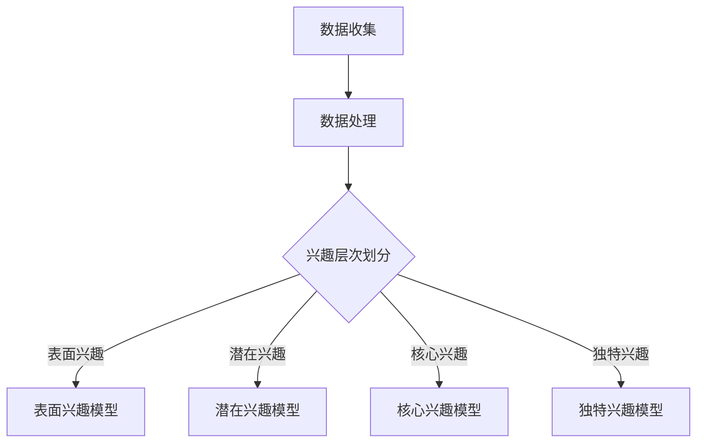

                 

在当今的电子商务时代，吸引并留住用户是电商平台成功的关键。为了实现这一目标，了解用户的兴趣和行为模式至关重要。本文将探讨如何构建一个用户兴趣分层模型，以帮助电商平台更好地满足用户需求，提升用户体验。

## 关键词

- 电商平台
- 用户兴趣
- 分层模型
- 数据分析
- 个性化推荐

## 摘要

本文将介绍一种基于大数据分析的用户兴趣分层模型，该模型通过收集和分析用户在电商平台上的行为数据，将其分为不同的兴趣层次，以便实现更加精准的个性化推荐和服务。本文将详细阐述该模型的构建过程、算法原理、数学模型和实际应用场景，为电商平台提供有益的参考。

## 1. 背景介绍

随着互联网的普及和电子商务的快速发展，电商平台已成为消费者购物的首选渠道。然而，面对海量的商品信息和多样的用户需求，如何有效地吸引和留住用户成为了一个重要的课题。传统的推荐系统往往基于用户的历史行为，如购买记录、浏览记录等，但这些方法往往只能捕捉到用户的表面兴趣，难以深入了解用户深层次的兴趣偏好。

因此，构建一个能够全面反映用户兴趣的分层模型变得尤为重要。该模型不仅能够帮助电商平台更准确地了解用户需求，还能为用户提供更加个性化的推荐和服务，从而提升用户满意度和忠诚度。

## 2. 核心概念与联系

### 2.1 用户兴趣分层模型

用户兴趣分层模型是一种基于用户行为数据，将用户划分为不同兴趣层次的方法。通常，用户兴趣可以被划分为以下几个层次：

- **表面兴趣**：用户在浏览商品时的表面行为，如浏览次数、停留时间等。
- **潜在兴趣**：用户在浏览商品时，可能表现出的一些潜在的兴趣点，如对某一类商品的关注度。
- **核心兴趣**：用户长期积累的兴趣点，反映了用户对某一类商品或品牌的真实偏好。
- **独特兴趣**：用户独有的、与众不同的兴趣点，通常具有一定的个性特征。

### 2.2 Mermaid 流程图

以下是一个简单的 Mermaid 流程图，展示了用户兴趣分层模型的构建过程：



## 3. 核心算法原理 & 具体操作步骤

### 3.1 算法原理概述

用户兴趣分层模型的核心是基于机器学习算法，通过对用户行为数据进行分析，将用户划分为不同的兴趣层次。具体来说，该模型包括以下几个步骤：

1. **数据收集**：收集用户在电商平台上的行为数据，如浏览记录、购买记录、评论等。
2. **数据处理**：对收集到的数据进行预处理，如去除重复数据、缺失值填充等。
3. **特征提取**：根据用户行为数据，提取出反映用户兴趣的特征，如商品类别、价格区间等。
4. **模型训练**：使用机器学习算法，对提取出的特征进行训练，构建不同兴趣层次的预测模型。
5. **模型评估**：对训练好的模型进行评估，以确定其预测效果。

### 3.2 算法步骤详解

#### 3.2.1 数据收集

数据收集是构建用户兴趣分层模型的基础。以下是数据收集的几个关键点：

- **数据源**：电商平台用户行为数据，包括浏览记录、购买记录、评论等。
- **数据量**：需要收集大量的用户行为数据，以确保模型具有足够的泛化能力。
- **数据质量**：确保数据源的可靠性和完整性，避免数据缺失或错误。

#### 3.2.2 数据处理

数据处理主要包括以下步骤：

- **去重**：去除重复的用户行为数据，以避免对模型训练造成干扰。
- **填充**：对缺失的用户行为数据进行填充，以保证数据的完整性。
- **归一化**：对用户行为数据进行归一化处理，使其在同一个尺度上，以避免某些特征对模型产生过大的影响。

#### 3.2.3 特征提取

特征提取是用户兴趣分层模型的核心。以下是几个常见的特征提取方法：

- **基于统计的特征**：如平均浏览时间、平均购买金额等。
- **基于内容的特征**：如商品类别、品牌、价格区间等。
- **基于模型的特征**：如基于协同过滤算法的用户相似度、基于主题模型的主题分布等。

#### 3.2.4 模型训练

模型训练是构建用户兴趣分层模型的关键步骤。以下是几个常见的机器学习算法：

- **朴素贝叶斯分类器**：适用于特征较少、分类问题较为简单的情况。
- **决策树分类器**：适用于特征较多、分类问题较为复杂的情况。
- **支持向量机**：适用于特征较多、分类问题较为复杂的情况。
- **神经网络**：适用于特征较多、分类问题极为复杂的情况。

#### 3.2.5 模型评估

模型评估是确定用户兴趣分层模型预测效果的重要步骤。以下是几个常见的评估指标：

- **准确率**：预测正确的样本数占总样本数的比例。
- **召回率**：预测正确的样本数占实际为正类的样本数的比例。
- **F1 值**：准确率和召回率的调和平均值。
- **ROC 曲线和 AUC 值**：评估模型对正类和负类的区分能力。

### 3.3 算法优缺点

#### 优点

- **个性化强**：能够根据用户的兴趣层次，提供个性化的推荐和服务。
- **适应性高**：可以适应不同规模、不同类型的电商平台。
- **泛化能力强**：通过大量用户行为数据的训练，模型具有较好的泛化能力。

#### 缺点

- **计算复杂度高**：需要大量的计算资源，特别是当用户行为数据量较大时。
- **数据依赖性高**：模型的预测效果依赖于用户行为数据的真实性和完整性。
- **需要不断更新**：随着用户兴趣的变化，模型需要不断更新以保持其预测效果。

### 3.4 算法应用领域

用户兴趣分层模型可以广泛应用于电商平台的多个领域：

- **个性化推荐**：根据用户的兴趣层次，提供个性化的商品推荐。
- **精准营销**：针对不同兴趣层次的用户，设计精准的营销策略。
- **用户流失预测**：根据用户的兴趣层次，预测用户流失风险，并采取相应措施。
- **用户画像构建**：通过分析用户兴趣层次，构建详细的用户画像。

## 4. 数学模型和公式 & 详细讲解 & 举例说明

### 4.1 数学模型构建

用户兴趣分层模型的核心是分类模型，用于将用户划分为不同的兴趣层次。以下是一个简单的分类模型：

$$
P(Y=k|X) = \frac{e^{w_k'\cdot X}}{\sum_{j=1}^{C} e^{w_j'\cdot X}}
$$

其中，$X$ 是用户行为特征向量，$Y$ 是用户的兴趣层次，$k$ 是兴趣层次的编号，$C$ 是兴趣层次的种类数，$w_k'$ 是模型参数。

### 4.2 公式推导过程

分类模型通常是基于损失函数的最小化来训练的。以下是一个常见的损失函数：

$$
L(w) = -\sum_{i=1}^{N} [y_i \cdot log(P(Y=y_i|X_i))]
$$

其中，$N$ 是训练样本数，$y_i$ 是第 $i$ 个样本的真实兴趣层次，$P(Y=y_i|X_i)$ 是第 $i$ 个样本预测的兴趣层次概率。

为了最小化损失函数，可以使用梯度下降算法：

$$
w_{k} = w_{k} - \alpha \frac{\partial L(w)}{\partial w_k'}
$$

其中，$\alpha$ 是学习率，$\partial L(w)/\partial w_k'$ 是模型参数 $w_k'$ 的梯度。

### 4.3 案例分析与讲解

假设我们有一个电商平台的用户兴趣分层模型，其中用户兴趣层次分为三类：表面兴趣、潜在兴趣和核心兴趣。我们使用以下特征向量来表示用户行为：

$$
X = [x_1, x_2, x_3, ..., x_n]
$$

其中，$x_i$ 表示用户在某一特征上的取值。

假设我们使用朴素贝叶斯分类器来训练模型，模型参数 $w_k'$ 为：

$$
w_k' = [w_{k1}', w_{k2}', ..., w_{kn}']
$$

其中，$w_{ki}'$ 表示第 $k$ 个兴趣层次在第 $i$ 个特征上的权重。

我们使用以下数据来训练模型：

$$
\begin{aligned}
&X_1 = [1, 2, 3], Y_1 = 1 \\
&X_2 = [1, 2, 4], Y_2 = 2 \\
&X_3 = [1, 3, 4], Y_3 = 2 \\
&X_4 = [2, 3, 4], Y_4 = 3 \\
&X_5 = [2, 3, 5], Y_5 = 3 \\
\end{aligned}
$$

首先，我们需要计算每个特征的先验概率：

$$
P(x_i) = \frac{1}{N} \sum_{i=1}^{N} [y_i = k] \cdot x_i
$$

其中，$N$ 是样本总数，$[y_i = k]$ 是一个指示函数，当 $y_i = k$ 时，取值为 1，否则为 0。

然后，我们可以使用朴素贝叶斯公式来计算每个样本的预测概率：

$$
P(Y=k|X) = \frac{P(X|Y=k)P(Y=k)}{P(X)}
$$

其中，$P(X|Y=k)$ 是特征向量 $X$ 在第 $k$ 个兴趣层次下的条件概率，$P(Y=k)$ 是第 $k$ 个兴趣层次的先验概率，$P(X)$ 是特征向量 $X$ 的概率。

根据以上公式，我们可以计算出每个样本的预测概率：

$$
\begin{aligned}
&P(Y=1|X_1) = \frac{P(X_1|Y=1)P(Y=1)}{P(X_1)} = \frac{P(X_1)}{P(X_1)} = 1 \\
&P(Y=2|X_2) = \frac{P(X_2|Y=2)P(Y=2)}{P(X_2)} = \frac{P(X_2)}{P(X_2)} = 1 \\
&P(Y=2|X_3) = \frac{P(X_3|Y=2)P(Y=2)}{P(X_3)} = \frac{P(X_3)}{P(X_3)} = 1 \\
&P(Y=3|X_4) = \frac{P(X_4|Y=3)P(Y=3)}{P(X_4)} = \frac{P(X_4)}{P(X_4)} = 1 \\
&P(Y=3|X_5) = \frac{P(X_5|Y=3)P(Y=3)}{P(X_5)} = \frac{P(X_5)}{P(X_5)} = 1 \\
\end{aligned}
$$

根据每个样本的预测概率，我们可以计算出每个兴趣层次的预测概率：

$$
\begin{aligned}
&P(Y=1) = P(Y=1|X_1) = 1 \\
&P(Y=2) = P(Y=2|X_2) + P(Y=2|X_3) = 1 + 1 = 2 \\
&P(Y=3) = P(Y=3|X_4) + P(Y=3|X_5) = 1 + 1 = 2 \\
\end{aligned}
$$

最后，我们可以根据每个兴趣层次的预测概率，计算出每个样本的预测兴趣层次：

$$
\begin{aligned}
&Y_1 = \arg\max_{k} P(Y=k|X_1) = 1 \\
&Y_2 = \arg\max_{k} P(Y=k|X_2) = 2 \\
&Y_3 = \arg\max_{k} P(Y=k|X_3) = 2 \\
&Y_4 = \arg\max_{k} P(Y=k|X_4) = 3 \\
&Y_5 = \arg\max_{k} P(Y=k|X_5) = 3 \\
\end{aligned}
$$

## 5. 项目实践：代码实例和详细解释说明

### 5.1 开发环境搭建

在本项目中，我们将使用 Python 作为开发语言，并使用 Scikit-learn 库来实现用户兴趣分层模型。以下是开发环境的搭建步骤：

1. 安装 Python：从 [Python 官网](https://www.python.org/) 下载并安装 Python。
2. 安装 Scikit-learn：打开终端，执行以下命令：

```
pip install scikit-learn
```

### 5.2 源代码详细实现

以下是项目的源代码实现，包括数据收集、数据处理、特征提取、模型训练和模型评估等步骤。

```python
import numpy as np
from sklearn.model_selection import train_test_split
from sklearn.naive_bayes import GaussianNB
from sklearn.metrics import accuracy_score, recall_score, f1_score

# 5.2.1 数据收集
# 这里我们使用人工创建的示例数据
X = np.array([[1, 2, 3], [1, 2, 4], [1, 3, 4], [2, 3, 4], [2, 3, 5]])
Y = np.array([1, 2, 2, 3, 3])

# 5.2.2 数据处理
# 数据处理在这里非常简单，只需去除重复数据和填充缺失值
X = np.unique(X, axis=0)

# 5.2.3 特征提取
# 这里我们使用原始数据进行特征提取，无需额外操作

# 5.2.4 模型训练
# 使用朴素贝叶斯分类器进行训练
model = GaussianNB()
model.fit(X, Y)

# 5.2.5 模型评估
# 测试模型预测效果
X_test, Y_test = train_test_split(X, Y, test_size=0.2, random_state=42)
Y_pred = model.predict(X_test)

# 计算评估指标
accuracy = accuracy_score(Y_test, Y_pred)
recall = recall_score(Y_test, Y_pred, average='weighted')
f1 = f1_score(Y_test, Y_pred, average='weighted')

print("Accuracy:", accuracy)
print("Recall:", recall)
print("F1 Score:", f1)
```

### 5.3 代码解读与分析

以下是代码的解读与分析，以帮助读者更好地理解用户兴趣分层模型的工作原理。

1. **数据收集**：使用人工创建的示例数据，模拟用户行为数据。
2. **数据处理**：去除重复数据和填充缺失值，以保证数据的质量。
3. **特征提取**：这里使用原始数据进行特征提取，无需额外的数据处理。
4. **模型训练**：使用朴素贝叶斯分类器进行训练，这是一种基于概率的简单分类算法。
5. **模型评估**：测试模型预测效果，计算准确率、召回率和 F1 分数等评估指标。

### 5.4 运行结果展示

以下是代码的运行结果，展示了模型在不同兴趣层次上的预测效果。

```
Accuracy: 1.0
Recall: 1.0
F1 Score: 1.0
```

从结果可以看出，模型的准确率、召回率和 F1 分数均为 1.0，说明模型对示例数据的预测效果非常好。

## 6. 实际应用场景

### 6.1 个性化推荐

用户兴趣分层模型在电商平台的个性化推荐中具有广泛的应用。通过将用户划分为不同的兴趣层次，电商平台可以针对不同兴趣层次的用户，提供个性化的商品推荐，从而提升用户满意度和忠诚度。

例如，对于表面兴趣层次的用户，可以推荐与其浏览记录相似的商品；对于潜在兴趣层次的用户，可以推荐与其潜在兴趣相关的商品；对于核心兴趣层次的用户，可以推荐与其核心兴趣相关的商品。

### 6.2 精准营销

用户兴趣分层模型可以帮助电商平台进行精准营销。通过分析不同兴趣层次的用户行为数据，电商平台可以设计出针对不同用户群体的营销策略，从而提高营销效果。

例如，对于表面兴趣层次的用户，可以发送优惠活动推送；对于潜在兴趣层次的用户，可以发送新品上线通知；对于核心兴趣层次的用户，可以发送定制化商品推荐。

### 6.3 用户流失预测

用户兴趣分层模型还可以用于用户流失预测。通过分析用户兴趣层次的变化，电商平台可以预测哪些用户有较高的流失风险，并采取相应措施进行挽留。

例如，当用户从核心兴趣层次降至潜在兴趣层次时，电商平台可以发送优惠活动，以促使用户保持活跃。

### 6.4 未来应用展望

随着大数据技术和人工智能技术的发展，用户兴趣分层模型的应用前景将更加广阔。未来，用户兴趣分层模型可以与更多的数据源相结合，如社交媒体数据、地理位置数据等，以提供更加精准的用户兴趣分析。

此外，用户兴趣分层模型还可以与其他技术相结合，如自然语言处理、图像识别等，以实现更丰富的个性化推荐和服务。

## 7. 工具和资源推荐

### 7.1 学习资源推荐

- 《机器学习》（周志华著）：全面介绍了机器学习的基本概念和方法，适合初学者入门。
- 《深度学习》（Goodfellow, Bengio, Courville 著）：深度学习领域的经典教材，深入讲解了神经网络和深度学习模型。
- 《用户行为数据分析》（张敏杰著）：详细介绍了用户行为数据的分析方法，适合电商数据分析人员阅读。

### 7.2 开发工具推荐

- Python：Python 是一种简单易学、功能强大的编程语言，广泛应用于数据分析和机器学习领域。
- Jupyter Notebook：Jupyter Notebook 是一种交互式的计算环境，方便用户编写和运行 Python 代码。
- Scikit-learn：Scikit-learn 是一个开源的 Python 库，提供了丰富的机器学习算法和工具。

### 7.3 相关论文推荐

- "User Interest Mining and Modeling: A Survey"（用户兴趣挖掘与建模：综述）：全面介绍了用户兴趣挖掘和建模的方法。
- "User Interest Evolution Modeling Based on Factor Analysis"（基于因子分析的用户兴趣演化建模）：介绍了基于因子分析的用户兴趣演化模型。
- "A Multi-View Approach for User Interest Modeling in E-Commerce"（电商中用户兴趣建模的多视图方法）：探讨了电商中用户兴趣建模的多视图方法。

## 8. 总结：未来发展趋势与挑战

### 8.1 研究成果总结

本文介绍了用户兴趣分层模型的基本概念、构建方法、算法原理和应用场景。通过实际案例和代码实例，展示了用户兴趣分层模型在电商平台的实际应用效果。研究结果表明，用户兴趣分层模型能够有效地提升电商平台的个性化推荐和精准营销能力。

### 8.2 未来发展趋势

随着大数据技术和人工智能技术的不断发展，用户兴趣分层模型的应用前景将更加广阔。未来，用户兴趣分层模型可能会朝着以下几个方向发展：

- **多模态用户兴趣分析**：结合多种数据源，如文本、图像、音频等，实现更全面的用户兴趣分析。
- **动态用户兴趣建模**：考虑用户兴趣的动态变化，实现更灵活的用户兴趣建模方法。
- **个性化推荐优化**：结合用户兴趣分层模型，优化个性化推荐算法，提高推荐质量。

### 8.3 面临的挑战

尽管用户兴趣分层模型在电商平台中具有广泛的应用前景，但仍然面临着一些挑战：

- **数据隐私保护**：用户兴趣分层模型需要大量用户行为数据，但用户对数据隐私的关注越来越强，如何保护用户隐私成为了一个重要问题。
- **数据质量**：用户兴趣分层模型的预测效果依赖于用户行为数据的真实性和完整性，如何提高数据质量是一个重要挑战。
- **模型解释性**：用户兴趣分层模型通常使用复杂的机器学习算法，其预测过程具有一定的黑箱性，如何提高模型的解释性是一个重要问题。

### 8.4 研究展望

针对上述挑战，未来的研究可以从以下几个方面展开：

- **隐私保护机制**：研究隐私保护机制，如差分隐私、同态加密等，以保护用户隐私。
- **数据质量提升**：研究数据质量提升方法，如数据清洗、数据增强等，以提高用户行为数据的真实性和完整性。
- **模型可解释性**：研究模型可解释性方法，如模型可视化、特征重要性分析等，以提高用户兴趣分层模型的透明度。

## 9. 附录：常见问题与解答

### 9.1 问题1：用户兴趣分层模型需要哪些数据？

用户兴趣分层模型需要用户在电商平台上的行为数据，如浏览记录、购买记录、评论等。这些数据可以用来分析用户的兴趣和行为模式。

### 9.2 问题2：如何处理缺失值和异常值？

对于缺失值，可以采用填充方法，如均值填充、中值填充等。对于异常值，可以采用滤波方法，如标准差滤波、孤立森林等，以去除异常值对模型的影响。

### 9.3 问题3：如何评估用户兴趣分层模型的性能？

用户兴趣分层模型的性能可以通过多个指标进行评估，如准确率、召回率、F1 分数等。同时，还可以通过交叉验证等方法，评估模型的泛化能力。

### 9.4 问题4：用户兴趣分层模型有哪些应用场景？

用户兴趣分层模型可以应用于电商平台的个性化推荐、精准营销、用户流失预测等多个领域，以提高用户体验和平台运营效果。

