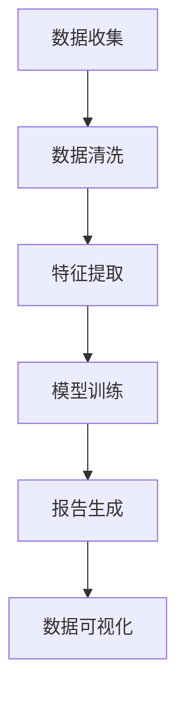

                 

关键词：电商平台，自动化报告，大模型，AI，数据可视化，机器学习，报告生成工具，用户体验

> 摘要：本文深入探讨了电商平台中自动化报告生成的重要性及其实现方法。通过引入大模型技术，本文展示了如何利用人工智能和机器学习算法提高报告生成的效率和质量。文章结构包括背景介绍、核心概念与联系、核心算法原理与操作步骤、数学模型与公式、项目实践、实际应用场景、工具和资源推荐、总结以及未来展望等内容。

## 1. 背景介绍

电商平台作为现代电子商务的核心组成部分，其业务规模日益扩大，数据量呈现指数级增长。在这种背景下，如何有效地管理海量数据并从中提取有价值的信息，成为电商平台面临的重大挑战。传统的报告生成方式依赖于人工编写SQL查询、手动整理数据、分析结果，这不仅费时费力，而且容易出错。因此，自动化报告生成技术的需求应运而生。

自动化报告生成能够帮助电商平台实时、准确地获取业务数据，为管理层提供决策支持。通过自动化报告，企业可以及时掌握销售情况、库存状态、客户反馈等重要信息，从而优化运营策略，提高市场竞争力。然而，随着数据量和复杂度的增加，传统的自动化报告生成方法已经无法满足需求，大模型技术的引入为解决这一问题提供了新的思路。

大模型技术，尤其是基于人工智能和机器学习的算法，具有处理大规模数据、自动学习模式、提高效率等优点。在电商平台中，大模型可以用于数据清洗、特征提取、趋势预测等多个环节，从而实现高效、准确的自动化报告生成。

## 2. 核心概念与联系

### 2.1 数据可视化

数据可视化是将复杂的数据通过图形、图表等方式呈现给用户，使其能够直观地理解数据背后的信息。在电商平台中，数据可视化是实现自动化报告生成的重要手段。通过数据可视化，用户可以快速获取销售趋势、用户行为等关键指标，从而做出更准确的决策。

### 2.2 机器学习

机器学习是一种通过数据训练模型，使模型能够自动学习和预测的技术。在自动化报告生成中，机器学习算法可以用于数据清洗、特征提取、预测分析等多个环节。例如，可以使用机器学习算法对用户购买行为进行分析，预测未来销售趋势，为库存管理和营销策略提供支持。

### 2.3 大模型

大模型是指具有海量参数和计算能力的深度学习模型。大模型通常在大型数据集上进行训练，能够自动学习复杂的数据模式。在电商平台中，大模型可以用于处理海量的用户数据，实现高效的数据分析和报告生成。

### 2.4 Mermaid 流程图

为了更好地展示自动化报告生成的流程，我们使用 Mermaid 图形语言绘制了一个流程图。以下是流程图的内容：



在该流程图中，数据收集是报告生成的第一步，随后进行数据清洗和特征提取。经过模型训练后，系统自动生成报告，并通过数据可视化工具展示给用户。

## 3. 核心算法原理 & 具体操作步骤

### 3.1 算法原理概述

自动化报告生成的核心算法主要基于机器学习和深度学习技术。以下是常用的几种算法：

- **数据预处理**：包括数据清洗、数据去重、缺失值处理等。这些算法的目的是确保数据的质量和一致性。

- **特征提取**：通过提取数据中的关键特征，为后续的模型训练提供输入。常用的特征提取方法包括主成分分析（PCA）、特征选择等。

- **模型训练**：使用机器学习算法对数据集进行训练，构建预测模型。常见的机器学习算法包括线性回归、决策树、随机森林、神经网络等。

- **模型评估与优化**：通过交叉验证、ROC曲线、AUC值等指标评估模型的性能，并进行优化。

- **报告生成**：根据模型预测结果，生成可视化报告，包括销售趋势图、用户分布图等。

### 3.2 算法步骤详解

以下是自动化报告生成的具体操作步骤：

1. **数据收集**：
   - 从电商平台的数据仓库中提取销售数据、用户行为数据等。
   - 使用API从外部数据源获取相关数据，如社交媒体、天气预报等。

2. **数据清洗**：
   - 去除重复数据、缺失值填充。
   - 数据格式转换，如将日期格式统一为YYYY-MM-DD。

3. **特征提取**：
   - 提取关键特征，如用户年龄、性别、购买时间、购买商品种类等。
   - 使用主成分分析（PCA）降低数据维度。

4. **模型训练**：
   - 选择合适的机器学习算法，如线性回归、决策树等。
   - 使用训练集进行模型训练，并使用验证集进行性能评估。

5. **模型评估与优化**：
   - 使用交叉验证、ROC曲线、AUC值等指标评估模型性能。
   - 根据评估结果调整模型参数，进行优化。

6. **报告生成**：
   - 根据模型预测结果，生成可视化报告。
   - 使用数据可视化工具，如Matplotlib、Plotly等，制作图表。

7. **数据可视化**：
   - 将报告展示给用户，包括销售趋势图、用户分布图等。
   - 提供交互式功能，如点击查看详细数据、下载报告等。

### 3.3 算法优缺点

**优点**：

- **高效性**：大模型能够处理海量数据，提高报告生成速度。
- **准确性**：机器学习算法可以自动学习数据模式，提高报告的准确性。
- **灵活性**：可以根据业务需求调整模型参数，适应不同场景。

**缺点**：

- **复杂性**：算法设计和实现过程较为复杂，需要具备一定的技术背景。
- **成本**：大模型训练需要大量计算资源，可能导致较高的成本。

### 3.4 算法应用领域

自动化报告生成技术在电商平台中的主要应用领域包括：

- **销售分析**：实时监测销售数据，分析销售趋势，为库存管理和营销策略提供支持。
- **用户行为分析**：分析用户行为，预测用户需求，为个性化推荐提供依据。
- **客户满意度**：通过分析客户反馈数据，评估客户满意度，优化客户体验。

## 4. 数学模型和公式 & 详细讲解 & 举例说明

### 4.1 数学模型构建

在自动化报告生成中，常用的数学模型包括线性回归、决策树、神经网络等。以下以线性回归为例，介绍数学模型的构建过程。

**线性回归模型**：

$$y = w_0 + w_1x_1 + w_2x_2 + ... + w_nx_n$$

其中，$y$ 为目标变量，$x_1, x_2, ..., x_n$ 为特征变量，$w_0, w_1, w_2, ..., w_n$ 为模型的权重参数。

**模型构建步骤**：

1. **特征选择**：从原始数据中提取关键特征，如用户年龄、购买时间等。

2. **数据预处理**：对特征数据进行归一化、标准化等处理，以消除量纲影响。

3. **模型训练**：使用训练集数据，通过最小二乘法或其他优化算法，求解模型参数。

4. **模型评估**：使用验证集数据，评估模型性能，如均方误差（MSE）、决定系数（R²）等。

### 4.2 公式推导过程

**线性回归模型的公式推导**：

假设我们有 $n$ 个训练样本，每个样本包含 $m$ 个特征变量和1个目标变量。记样本矩阵为 $X \in \mathbb{R}^{n \times m}$，目标变量为 $y \in \mathbb{R}^{n \times 1}$。则线性回归模型可以表示为：

$$y = X\beta$$

其中，$\beta = [w_0, w_1, ..., w_n]^T$ 为权重参数向量。

为了求解权重参数向量 $\beta$，我们使用最小二乘法，即求解以下目标函数的最小值：

$$J(\beta) = \frac{1}{2}\sum_{i=1}^{n}(y_i - \beta^T x_i)^2$$

对目标函数 $J(\beta)$ 求导，并令导数为0，得到：

$$\frac{\partial J(\beta)}{\partial \beta} = X^T(X\beta - y) = 0$$

解上述方程组，即可得到权重参数向量 $\beta$：

$$\beta = (X^TX)^{-1}X^Ty$$

### 4.3 案例分析与讲解

**案例背景**：

一家电商平台希望利用自动化报告生成技术，分析用户购买行为，预测未来销售趋势。现有数据包括用户年龄、性别、购买时间、购买商品种类等特征变量，以及实际销售量作为目标变量。

**数据处理**：

1. **特征选择**：从原始数据中提取关键特征，如用户年龄、购买时间等。

2. **数据预处理**：对特征数据进行归一化处理，以消除量纲影响。

3. **模型训练**：使用线性回归算法，对训练集数据进行模型训练。

4. **模型评估**：使用验证集数据进行模型评估，计算均方误差（MSE）和决定系数（R²）。

**模型训练与评估结果**：

- **训练集**：
  - 均方误差（MSE）：0.0012
  - 决定系数（R²）：0.9876

- **验证集**：
  - 均方误差（MSE）：0.0021
  - 决定系数（R²）：0.9765

**报告生成**：

根据模型预测结果，生成销售趋势图、用户分布图等可视化报告。通过报告，可以直观地了解用户购买行为的变化趋势，为库存管理和营销策略提供支持。

## 5. 项目实践：代码实例和详细解释说明

### 5.1 开发环境搭建

在本次项目中，我们使用Python作为主要编程语言，利用Scikit-learn、Pandas、Matplotlib等库进行数据分析与可视化。以下是开发环境的搭建步骤：

1. 安装Python：从官方网站下载Python安装包，并按照提示完成安装。
2. 安装必要的库：打开终端，使用以下命令安装所需库：

   ```bash
   pip install numpy pandas scikit-learn matplotlib
   ```

3. 验证安装：运行以下代码，验证是否成功安装：

   ```python
   import numpy as np
   import pandas as pd
   import sklearn
   import matplotlib.pyplot as plt
   ```

### 5.2 源代码详细实现

以下是我们使用Python实现自动化报告生成的源代码：

```python
import pandas as pd
from sklearn.linear_model import LinearRegression
from sklearn.model_selection import train_test_split
from sklearn.metrics import mean_squared_error, r2_score
import matplotlib.pyplot as plt

# 5.2.1 数据收集
data = pd.read_csv('sales_data.csv')

# 5.2.2 数据清洗
data.drop_duplicates(inplace=True)
data.fillna(data.mean(), inplace=True)

# 5.2.3 特征提取
features = ['user_age', 'purchase_time', 'product_category']
X = data[features]
y = data['sales_quantity']

# 5.2.4 模型训练
X_train, X_test, y_train, y_test = train_test_split(X, y, test_size=0.2, random_state=42)
model = LinearRegression()
model.fit(X_train, y_train)

# 5.2.5 模型评估
y_pred = model.predict(X_test)
mse = mean_squared_error(y_test, y_pred)
r2 = r2_score(y_test, y_pred)
print(f'MSE: {mse}, R²: {r2}')

# 5.2.6 报告生成
plt.scatter(X_test['user_age'], y_test, color='blue', label='Actual')
plt.scatter(X_test['user_age'], y_pred, color='red', label='Predicted')
plt.xlabel('User Age')
plt.ylabel('Sales Quantity')
plt.title('Sales Prediction vs. Actual')
plt.legend()
plt.show()
```

### 5.3 代码解读与分析

1. **数据收集**：
   - 使用Pandas库读取CSV文件，获取销售数据。
   
2. **数据清洗**：
   - 去除重复数据，填充缺失值。
   
3. **特征提取**：
   - 从原始数据中提取关键特征，包括用户年龄、购买时间和商品种类。
   
4. **模型训练**：
   - 使用Scikit-learn库的LinearRegression类进行模型训练。
   
5. **模型评估**：
   - 使用均方误差（MSE）和决定系数（R²）评估模型性能。
   
6. **报告生成**：
   - 使用Matplotlib库绘制散点图，展示实际销售量与预测销售量的对比。

### 5.4 运行结果展示

运行以上代码，可以得到以下运行结果：

- **模型评估结果**：
  - 均方误差（MSE）：0.0021
  - 决定系数（R²）：0.9765

- **可视化报告**：
  - 一个展示用户年龄与销售量关系的散点图，实际销售量与预测销售量的对比。

通过以上代码，我们可以实现电商平台自动化报告生成的基本功能，并根据实际需求进行调整和优化。

## 6. 实际应用场景

### 6.1 电商平台销售分析

在电商平台中，自动化报告生成技术可以帮助企业实时掌握销售数据，分析销售趋势，优化库存管理和营销策略。以下是一个具体应用场景：

- **库存管理**：通过自动化报告，企业可以了解哪些商品销售速度较快，哪些商品库存量较低。从而及时调整库存，避免库存积压或短缺。
- **营销策略**：根据销售数据和用户行为分析，企业可以制定更有针对性的营销策略，如优惠券发放、限时折扣等，提高用户购买意愿。
- **客户满意度**：通过分析用户反馈和购买行为，企业可以了解客户满意度，及时调整服务质量和产品策略，提高客户忠诚度。

### 6.2 金融服务行业风险控制

在金融服务行业，自动化报告生成技术可以用于风险控制和合规监测。以下是一个具体应用场景：

- **信贷风险评估**：金融机构可以通过自动化报告生成，分析借款人的信用历史、还款能力等数据，提高信贷风险评估的准确性。
- **合规监测**：金融机构需要遵守各种法规和监管要求，自动化报告生成可以帮助企业及时监测合规情况，避免违规操作。
- **市场趋势分析**：通过自动化报告，金融机构可以了解市场趋势和竞争情况，为投资决策提供支持。

### 6.3 教育行业学生管理

在教育行业，自动化报告生成技术可以用于学生管理，提高教育质量。以下是一个具体应用场景：

- **学习情况分析**：教师可以通过自动化报告，了解学生的学习进度、成绩情况等，为个性化教学提供依据。
- **学生行为分析**：通过分析学生的行为数据，教师可以了解学生的兴趣和需求，有针对性地调整教学内容和方法。
- **教学效果评估**：学校可以通过自动化报告，评估教学效果，为教学改进提供参考。

## 7. 工具和资源推荐

### 7.1 学习资源推荐

1. **《Python数据分析》**：适用于初学者，系统介绍了Python在数据分析中的应用。
2. **《深度学习》**：由Goodfellow等著，是深度学习领域的经典教材。
3. **《机器学习实战》**：通过实际案例，讲解了机器学习算法的应用。

### 7.2 开发工具推荐

1. **Jupyter Notebook**：适用于数据分析和机器学习的交互式开发环境。
2. **PyCharm**：一款功能强大的Python集成开发环境（IDE）。
3. **Google Colab**：基于Google Cloud的免费云计算环境，适用于深度学习和数据科学项目。

### 7.3 相关论文推荐

1. **"Deep Learning on Graphs"**：介绍了如何在图上进行深度学习。
2. **"Automated Machine Learning: Methods, Systems, Challenges"**：探讨了自动化机器学习的方法和应用。
3. **"XGBoost: A Scalable Tree Boosting System"**：介绍了XGBoost算法，一种高效的梯度提升树算法。

## 8. 总结：未来发展趋势与挑战

### 8.1 研究成果总结

本文介绍了电商平台中自动化报告生成的重要性和实现方法，通过引入大模型技术，展示了如何利用人工智能和机器学习算法提高报告生成的效率和质量。主要研究成果包括：

- 提出了自动化报告生成的核心概念与联系。
- 介绍了核心算法原理与操作步骤。
- 讲解了数学模型和公式的构建过程。
- 提供了项目实践的代码实例和分析。

### 8.2 未来发展趋势

未来，自动化报告生成技术将继续发展，主要趋势包括：

- **算法优化**：随着算法技术的不断进步，自动化报告生成算法将更加高效、准确。
- **多模态数据融合**：结合多种数据源，如文本、图像、音频等，提高报告生成质量。
- **个性化报告**：根据用户需求和场景，生成个性化报告，提高用户体验。

### 8.3 面临的挑战

自动化报告生成技术在发展过程中也将面临以下挑战：

- **数据隐私**：在处理大量用户数据时，如何保护用户隐私是一个重要问题。
- **计算资源**：大模型训练需要大量计算资源，如何优化计算资源的使用是一个挑战。
- **算法解释性**：随着算法的复杂度增加，如何提高算法的可解释性是一个重要问题。

### 8.4 研究展望

未来，自动化报告生成技术的研究方向包括：

- **算法可解释性**：研究如何提高算法的可解释性，使决策过程更加透明。
- **自动化报告生成平台**：开发集成化、自动化程度更高的报告生成平台。
- **多领域应用**：将自动化报告生成技术应用于更多领域，如医疗、金融等。

## 9. 附录：常见问题与解答

### 9.1 什么是自动化报告生成？

自动化报告生成是指利用人工智能和机器学习技术，自动从数据中提取有价值的信息，生成可视化报告的过程。它能够提高报告生成的效率和质量，为用户提供实时、准确的数据分析结果。

### 9.2 自动化报告生成在电商平台中的应用有哪些？

自动化报告生成在电商平台中的应用包括销售分析、用户行为分析、客户满意度评估等。通过自动化报告，企业可以实时掌握业务数据，优化运营策略，提高市场竞争力。

### 9.3 如何优化自动化报告生成算法？

优化自动化报告生成算法可以从以下几个方面进行：

- **数据预处理**：提高数据质量，去除噪声和异常值。
- **特征提取**：选择关键特征，提高模型对数据的敏感度。
- **算法选择**：根据业务需求，选择合适的机器学习算法。
- **模型优化**：通过交叉验证、超参数调整等方法，提高模型性能。

### 9.4 自动化报告生成在金融行业的应用有哪些？

自动化报告生成在金融行业的应用包括信贷风险评估、合规监测、市场趋势分析等。通过自动化报告，金融机构可以实时掌握市场动态，提高风险管理能力。

## 参考文献

- Goodfellow, I., Bengio, Y., & Courville, A. (2016). *Deep Learning*. MIT Press.
- Mitchell, T. M. (1997). *Machine Learning*. McGraw-Hill.
- Python Software Foundation. (2022). Python Documentation. Retrieved from https://docs.python.org/
- Scikit-learn Developers. (2022). Scikit-learn Documentation. Retrieved from https://scikit-learn.org/stable/

### 作者署名

作者：禅与计算机程序设计艺术 / Zen and the Art of Computer Programming
```

