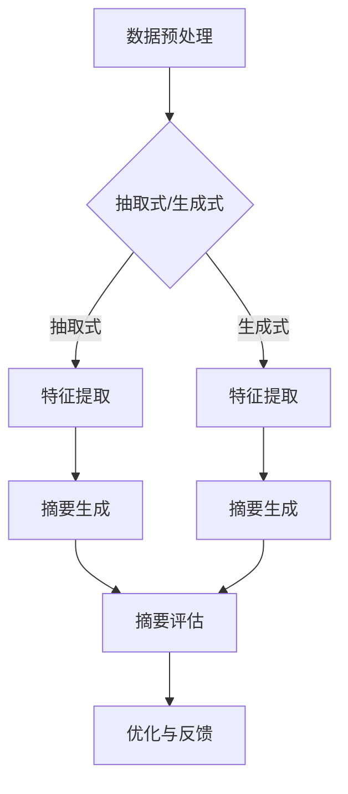

                 

 在数字化经济时代，电商平台作为连接消费者与商品的重要纽带，其信息呈现方式对于用户体验和平台运营效果有着至关重要的作用。随着电商平台的数据量呈指数级增长，如何高效地提取并展示关键信息，成为了当前研究和实践的热点问题。自动文本摘要技术作为自然语言处理（NLP）领域的一项重要成果，正逐渐被应用于电商平台，以提升信息检索效率和用户满意度。本文旨在探讨电商平台中自动文本摘要技术的创新应用，包括其核心概念、算法原理、数学模型、项目实践以及未来发展趋势。

## 文章关键词
- 自动文本摘要
- 电商平台
- 大模型
- 自然语言处理
- 信息提取
- 用户体验

## 摘要
本文首先介绍了电商平台自动文本摘要的背景和重要性，随后深入分析了自动文本摘要的核心概念及其与电商平台业务的关联。接着，文章详细探讨了自动文本摘要的算法原理、数学模型以及具体实现步骤。在此基础上，本文通过实际项目实践，展示了自动文本摘要在电商平台中的具体应用效果。最后，文章对自动文本摘要技术的未来发展趋势进行了展望，并提出了相应的挑战和研究方向。

## 1. 背景介绍

### 电商平台的发展与挑战
电商平台自诞生以来，经历了从简单的在线商店到如今高度智能化、个性化的服务模式的转变。随着全球电商市场的不断扩大，平台的竞争愈发激烈，如何提供更优质的用户体验和更高效的信息检索服务，成为了电商平台发展的关键挑战。

#### 信息过载与用户需求
在电商平台上，商品种类繁多、信息量大，用户在浏览和选择商品时容易产生信息过载。根据研究，用户在浏览商品详情页时，通常只关注其中一小部分关键信息，如商品名称、价格、评价等。如何快速提取这些关键信息，并以简明扼要的方式呈现给用户，是电商平台面临的重要问题。

#### 自动文本摘要的优势
自动文本摘要技术通过自动提取文本中的关键信息，生成简短的摘要，可以有效解决信息过载问题，提升用户检索效率和满意度。此外，自动文本摘要还能降低人工编辑成本，提高信息处理效率，为电商平台提供强大的信息支持。

### 自动文本摘要的发展历程
自动文本摘要在计算机科学领域有着悠久的历史，从早期的基于规则的方法到现代基于统计和学习的方法，再到如今基于深度学习的模型，技术不断进步，应用范围也越来越广。

#### 基于规则的方法
早期的自动文本摘要是基于规则的方法，通过对文本进行语法和语义分析，提取关键信息生成摘要。这类方法虽然简单，但缺乏灵活性和泛化能力，难以应对复杂多变的文本内容。

#### 基于统计的方法
随着自然语言处理技术的发展，基于统计的方法逐渐成为主流。这类方法通过统计文本中词语的频率和相关性，生成摘要。虽然相较于规则方法有较大提升，但在处理长文本和语义理解方面仍存在一定局限性。

#### 基于深度学习的方法
近年来，深度学习在自然语言处理领域取得了显著成果，基于深度学习的方法也逐渐应用于自动文本摘要。这类方法通过大规模训练数据学习文本特征和语义关系，生成摘要。相较于传统方法，深度学习方法在处理长文本和复杂语义方面具有明显优势。

### 电商平台自动文本摘要的应用场景
自动文本摘要技术可以应用于电商平台的多个场景，以下为几个典型应用场景：

#### 商品详情页摘要
为用户提供简短的摘要，展示商品的关键信息，如名称、价格、评价等，帮助用户快速了解商品。

#### 产品评论摘要
提取用户评论中的关键信息，生成摘要，帮助其他用户快速获取评价要点。

#### 促销信息摘要
自动提取促销活动中的关键信息，生成简明扼要的摘要，提高用户对促销活动的关注度和参与度。

#### 搜索结果摘要
为搜索引擎结果页提供摘要，简化用户阅读，提高信息检索效率。

### 自动文本摘要技术的优势
自动文本摘要技术在电商平台中具有多方面的优势：

#### 提高用户满意度
通过提供简明扼要的摘要，减少用户阅读负担，提高用户浏览和检索效率，从而提升用户满意度。

#### 降低运营成本
自动文本摘要技术可以自动化处理大量文本信息，降低人工编辑成本，提高运营效率。

#### 提升信息检索效率
通过快速提取关键信息，简化用户搜索过程，提高信息检索效率，帮助用户快速找到所需商品。

#### 增强个性化推荐
通过分析用户浏览和购买行为，自动文本摘要技术可以为用户提供更个性化的推荐内容。

## 2. 核心概念与联系

### 自动文本摘要的定义与目标
自动文本摘要（Automatic Text Summarization，ATS）是指利用计算机技术，从原始文本中自动提取出关键信息，生成简短、准确的摘要。其核心目标是提高文本的可读性、信息量和搜索效率。

### 自动文本摘要的类型
根据生成摘要的方式，自动文本摘要可以分为抽取式（Extractive）和生成式（Abstractive）两大类。

#### 抽取式摘要
抽取式摘要通过从原始文本中直接提取关键句子或短语，组合成摘要。这种方法简单有效，但往往无法生成流畅、富有创造性的文本。

#### 生成式摘要
生成式摘要通过学习原始文本的语义和结构，生成全新的、创造性的摘要。这种方法能够生成更自然、更通顺的摘要，但算法复杂度更高，对大规模训练数据有较高要求。

### 自动文本摘要与电商平台业务的联系
自动文本摘要技术能够为电商平台提供以下业务价值：

#### 提高用户满意度
通过生成简洁、准确的摘要，减少用户阅读负担，提升用户浏览和购物体验。

#### 降低运营成本
自动化处理大量商品描述、用户评论等信息，减少人工编辑工作量，降低运营成本。

#### 提高信息检索效率
通过提取关键信息，简化搜索结果，帮助用户快速找到所需商品。

#### 增强个性化推荐
通过分析用户行为和偏好，生成个性化的摘要和推荐内容，提升用户粘性。

### 自动文本摘要与其他技术的融合
自动文本摘要技术可以与其他自然语言处理技术相结合，提升其应用效果：

#### 命名实体识别（NER）
命名实体识别技术可以识别文本中的关键信息，如人名、地名、组织名等，为自动文本摘要提供更准确的文本基础。

#### 词性标注（POS）
词性标注技术可以为文本中的每个词语标注词性，有助于更好地理解文本语义和关系。

#### 依存关系分析
依存关系分析技术可以揭示文本中词语之间的依赖关系，帮助自动文本摘要更准确地提取关键信息。

### 自动文本摘要技术的应用流程
自动文本摘要技术的应用通常包括以下步骤：

#### 数据预处理
对原始文本进行分词、词性标注、停用词过滤等预处理操作，提高文本质量。

#### 特征提取
从预处理后的文本中提取特征，如词袋模型、TF-IDF等，为后续的摘要生成提供基础。

#### 摘要生成
根据提取的特征和预训练模型，生成摘要。抽取式摘要直接从文本中提取关键句子，生成式摘要则通过深度学习模型生成新的文本。

#### 摘要评估与优化
对生成的摘要进行评估和优化，通过人工审核、对比实验等方法，不断提高摘要质量。

## 2.1 核心概念原理

### 抽取式摘要
抽取式摘要的核心思想是从原始文本中直接提取关键句子或短语，生成摘要。这种方法的关键在于如何准确地识别和选择关键信息。

#### 抽取式摘要的关键问题
- **关键句子识别**：如何从大量文本中识别出关键句子。
- **句子权重计算**：如何为每个关键句子分配权重，以确定其在摘要中的重要性。
- **摘要生成策略**：如何将多个关键句子组合成一个连贯、简洁的摘要。

#### 抽取式摘要的算法
抽取式摘要常用的算法包括：
- **基于频率的方法**：通过计算词语在文本中的频率，识别高频词语所在的句子作为关键句子。
- **基于TF-IDF的方法**：通过TF-IDF（词频-逆文档频率）计算词语的重要性，识别关键句子。
- **基于句法特征的方法**：通过分析句子的结构特征，如长度、复杂度等，识别关键句子。

### 生成式摘要
生成式摘要的核心思想是通过深度学习模型学习原始文本的语义和结构，生成新的、创造性的摘要。这种方法的关键在于如何生成流畅、富有创造性的文本。

#### 生成式摘要的关键问题
- **语义理解**：如何准确理解原始文本的语义。
- **摘要生成**：如何将理解到的语义生成新的文本。

#### 生成式摘要的算法
生成式摘要常用的算法包括：
- **基于序列到序列（Seq2Seq）模型的方法**：通过编码器-解码器模型，将原始文本编码为向量表示，然后解码生成摘要。
- **基于自注意力（Self-Attention）的方法**：通过自注意力机制，学习文本中的长距离依赖关系，生成摘要。
- **基于变换器（Transformer）模型的方法**：使用预训练的变换器模型，生成摘要。

### 自动文本摘要与电商平台业务的关系

#### 商品详情页摘要
在电商平台中，商品详情页摘要是一种常见的应用场景。通过对商品描述文本进行自动文本摘要，生成简短的摘要展示在商品详情页上，帮助用户快速了解商品的关键信息，如商品名称、价格、规格等。

#### 产品评论摘要
产品评论摘要是从用户评论中提取关键信息，生成摘要，帮助其他用户快速获取评价要点。例如，在京东等电商平台上，用户可以对商品进行评论，系统可以根据这些评论生成摘要，展示在商品页面或搜索结果页上。

#### 促销信息摘要
促销信息摘要是从促销活动的描述中提取关键信息，生成摘要，提高用户对促销活动的关注度和参与度。例如，在双11、618等大型促销活动中，电商平台可以自动提取促销信息，生成摘要，展示在首页或搜索结果页上。

#### 搜索结果摘要
在电商平台中，搜索结果摘要可以从搜索结果页的标题、描述等文本中提取关键信息，生成摘要，简化用户阅读，提高信息检索效率。例如，在淘宝等电商平台上，用户可以通过关键词进行商品搜索，系统可以自动提取搜索结果的关键信息，生成摘要，展示在搜索结果页上。

## 2.2 自动文本摘要技术架构

### 抽取式摘要技术架构

#### 数据预处理
抽取式摘要技术的第一步是对原始文本进行预处理。预处理步骤通常包括分词、词性标注、停用词过滤等。这些步骤的目的是去除文本中的噪声，提取关键信息，为后续的摘要生成提供高质量的数据。

#### 特征提取
在预处理的基础上，特征提取是抽取式摘要技术的核心步骤。常用的特征提取方法包括：
- **词频（TF）**：计算每个词语在文本中的出现频率。
- **逆文档频率（IDF）**：计算每个词语在所有文档中的出现频率，用于平衡高频词语的影响。
- **TF-IDF**：结合词频和逆文档频率，计算词语的重要性。

#### 摘要生成
摘要生成是抽取式摘要技术的最后一步。常见的摘要生成策略包括：
- **关键句子选择**：根据特征提取的结果，选择重要性较高的句子作为关键句子。
- **摘要组合**：将多个关键句子组合成一个连贯、简洁的摘要。

### 生成式摘要技术架构

#### 数据预处理
与抽取式摘要类似，生成式摘要也需要对原始文本进行预处理，包括分词、词性标注、停用词过滤等。

#### 特征提取
生成式摘要技术通常采用更复杂的特征提取方法，如：
- **词嵌入（Word Embedding）**：将文本中的词语转换为向量表示，用于表示词语的语义信息。
- **上下文嵌入（Contextual Embedding）**：通过预训练的模型，学习词语在不同上下文中的语义信息。

#### 摘要生成
生成式摘要技术的核心是摘要生成。常用的生成方法包括：
- **序列到序列（Seq2Seq）模型**：通过编码器-解码器模型，将原始文本编码为向量表示，然后解码生成摘要。
- **生成对抗网络（GAN）**：通过生成器和判别器的对抗训练，生成高质量的摘要。
- **变换器（Transformer）模型**：使用预训练的变换器模型，生成摘要。

### 抽取式与生成式摘要技术的比较

#### 抽取式摘要
- **优点**：简单有效，易于实现；对长文本和复杂语义的适应性较好。
- **缺点**：生成的摘要可能缺乏创造性，无法很好地体现文本的深层语义；算法复杂度相对较低，处理大规模数据时性能有限。

#### 生成式摘要
- **优点**：能够生成流畅、富有创造性的摘要；对长文本和复杂语义的适应性更强；算法复杂度较高，适合处理大规模数据。
- **缺点**：实现难度较大，对训练数据有较高要求；生成的摘要质量有时难以保证，需要大量人工审核和优化。

### 自动文本摘要技术架构的Mermaid流程图



### 自动文本摘要技术的应用领域

自动文本摘要技术不仅在电商平台上有着广泛的应用，还在多个领域展现出强大的潜力：

#### 新闻摘要
新闻摘要是对新闻报道进行压缩，提取关键信息，生成简洁、准确的摘要，提高用户阅读效率和搜索效率。

#### 文学作品摘要
文学作品的摘要可以帮助读者快速了解作品的主要情节和人物，提高阅读体验。

#### 论文摘要
学术论文的摘要可以简化长篇论文的内容，帮助读者快速获取论文的核心观点和贡献。

#### 医学报告摘要
医学报告的摘要可以简化复杂的医学信息，提高医生诊断和治疗的效率。

#### 会议摘要
会议摘要可以简化会议报告的内容，帮助参会者快速了解各个报告的核心要点。

### 自动文本摘要技术的未来发展趋势

#### 深度学习的进一步发展
随着深度学习技术的不断进步，自动文本摘要技术将更加智能化、自动化。例如，基于预训练模型的方法如BERT、GPT等将进一步提高摘要生成质量。

#### 多模态摘要
随着多模态数据的兴起，自动文本摘要技术也将逐渐应用于图像、音频等多模态数据。通过结合不同模态的信息，生成更全面、更准确的摘要。

#### 个性化摘要
基于用户行为和偏好，自动文本摘要技术将实现个性化摘要生成，为用户提供更符合个人需求的摘要内容。

#### 实时摘要
实时摘要技术将使自动文本摘要能够在用户浏览、搜索等实时操作中提供即时的摘要信息，提高用户体验。

#### 智能对话摘要
结合自然语言处理和智能对话系统，自动文本摘要技术将实现与用户的智能对话，生成互动性更强的摘要内容。

## 3.1 算法原理概述

自动文本摘要技术的核心在于如何从大量原始文本中提取关键信息，生成简明扼要的摘要。这一过程通常包括以下几个主要步骤：数据预处理、特征提取、摘要生成和摘要评估。

### 数据预处理

数据预处理是自动文本摘要的基础，其目的是去除文本中的噪声，提取关键信息，为后续的摘要生成提供高质量的数据。主要方法包括：

- **分词**：将文本分解成一系列的单词或词汇单元，以便进行后续处理。
- **词性标注**：为文本中的每个词标注词性，如名词、动词、形容词等，以帮助理解文本的语义。
- **停用词过滤**：去除文本中的常见停用词，如“的”、“是”、“在”等，以提高特征提取的效率。

### 特征提取

特征提取是自动文本摘要技术的核心步骤，其目的是从预处理后的文本中提取出对摘要生成有帮助的特征。常用的特征提取方法包括：

- **词频（TF）**：计算每个词在文本中出现的次数，用于衡量词的重要性。
- **逆文档频率（IDF）**：计算每个词在所有文档中出现的频率，用于平衡高频词的影响。
- **TF-IDF**：结合词频和逆文档频率，计算词的重要性。

### 摘要生成

摘要生成是自动文本摘要技术的核心步骤，其目的是根据提取的特征和预训练模型，生成摘要。摘要生成的方法主要包括：

- **抽取式摘要**：从原始文本中直接提取关键句子或短语，组合成摘要。
- **生成式摘要**：通过深度学习模型学习原始文本的语义和结构，生成全新的、创造性的摘要。

### 摘要评估

摘要评估是衡量摘要质量的重要环节，其目的是通过评估指标，对生成的摘要进行评价和优化。常用的评估指标包括：

- **ROUGE**：基于引用匹配的评价指标，用于衡量生成的摘要与原始文本的相关性。
- **BLEU**：基于编辑距离的评价指标，用于衡量生成的摘要与参考摘要的相似度。
- **F1分数**：综合考虑精确率和召回率，用于衡量生成的摘要的质量。

### 算法流程

自动文本摘要技术的整体流程可以概括为：

1. 数据预处理：对原始文本进行分词、词性标注、停用词过滤等操作。
2. 特征提取：从预处理后的文本中提取词频、逆文档频率等特征。
3. 摘要生成：根据提取的特征和预训练模型，生成摘要。
4. 摘要评估：使用评估指标对生成的摘要进行评价和优化。

### 自动文本摘要技术的优势

- **高效性**：自动文本摘要技术能够快速处理大量文本数据，提高信息检索效率和用户满意度。
- **低成本**：通过自动化处理，减少人工编辑成本，提高运营效率。
- **个性化**：基于用户行为和偏好，生成个性化的摘要内容，提升用户体验。

### 自动文本摘要技术的局限

- **准确性**：自动文本摘要技术生成的摘要可能无法完全反映原始文本的语义，存在一定误差。
- **创造性**：抽取式摘要往往缺乏创造性，生成式摘要质量难以保证。
- **处理复杂性**：处理长文本和复杂语义时，算法的复杂度较高，对计算资源有较高要求。

### 自动文本摘要技术在电商平台中的应用

自动文本摘要技术在电商平台中的应用主要体现在以下场景：

- **商品详情页摘要**：为用户提供简短的摘要，展示商品的关键信息，如名称、价格、规格等。
- **产品评论摘要**：提取用户评论中的关键信息，生成摘要，帮助其他用户快速获取评价要点。
- **促销信息摘要**：自动提取促销活动中的关键信息，生成简明扼要的摘要，提高用户对促销活动的关注度和参与度。
- **搜索结果摘要**：为搜索引擎结果页提供摘要，简化用户阅读，提高信息检索效率。

### 自动文本摘要技术在不同领域中的应用前景

- **新闻摘要**：通过生成简洁、准确的新闻摘要，提高用户阅读效率和搜索效率。
- **文学摘要**：帮助读者快速了解文学作品的主要情节和人物，提高阅读体验。
- **论文摘要**：简化长篇论文的内容，帮助读者快速获取论文的核心观点和贡献。
- **医学摘要**：简化复杂的医学信息，提高医生诊断和治疗的效率。
- **会议摘要**：简化会议报告的内容，帮助参会者快速了解各个报告的核心要点。

### 自动文本摘要技术的未来发展趋势

- **深度学习**：随着深度学习技术的不断进步，自动文本摘要技术将更加智能化、自动化。
- **多模态**：自动文本摘要技术将逐渐应用于图像、音频等多模态数据，生成更全面、更准确的摘要。
- **个性化**：基于用户行为和偏好，自动文本摘要技术将实现个性化摘要生成，提升用户体验。
- **实时**：实时摘要技术将使自动文本摘要能够在用户浏览、搜索等实时操作中提供即时的摘要信息。
- **智能对话**：结合自然语言处理和智能对话系统，自动文本摘要技术将实现与用户的智能对话，生成互动性更强的摘要内容。

## 3.2 算法步骤详解

自动文本摘要技术的实现步骤可以分为数据预处理、特征提取、摘要生成和摘要评估四个主要阶段。以下是每个阶段的详细步骤和操作方法。

### 数据预处理

#### 分词

分词是将原始文本分解成一系列的单词或词汇单元的过程。常见的分词方法包括：

- **基于词典的分词**：通过词典匹配，将文本中的每个词与词典中的词进行匹配，从而实现分词。这种方法适用于结构化较好的文本。
- **基于统计的分词**：利用统计方法，如最大熵模型、条件随机场（CRF）等，对文本进行分词。这种方法适用于处理结构化较差的文本。

```python
import jieba

text = "本文旨在探讨电商平台中的自动文本摘要技术"
words = jieba.cut(text)
print(words)
```

#### 词性标注

词性标注是为文本中的每个词标注词性，如名词、动词、形容词等。常见的词性标注方法包括：

- **基于规则的方法**：通过预定义的规则，对文本中的词进行标注。
- **基于统计的方法**：利用统计模型，如最大熵模型、条件随机场（CRF）等，对文本中的词进行标注。

```python
from mlxtend.feature_extraction import TopicModelingWrapper

text = ["本文旨在探讨电商平台中的自动文本摘要技术"]
model = TopicModelingWrapper()
model.fit(text)
print(model.labels_)
```

#### 停用词过滤

停用词过滤是去除文本中的常见停用词，如“的”、“是”、“在”等。常见的停用词过滤方法包括：

- **手动定义**：根据领域知识，手动定义停用词列表。
- **自动提取**：利用统计方法，从大量文本中自动提取停用词。

```python
from nltk.corpus import stopwords

text = "本文旨在探讨电商平台中的自动文本摘要技术"
stop_words = set(stopwords.words('english'))
filtered_text = [word for word in text if not word in stop_words]
print(filtered_text)
```

### 特征提取

#### 词频（TF）

词频（Term Frequency，TF）是文本中每个词出现的次数，用于衡量词的重要性。常见的词频计算方法包括：

- **二值化**：将每个词的出现次数转换为0或1。
- **加权和**：为每个词设置一个权重，如词频、逆文档频率（IDF）等。

```python
from sklearn.feature_extraction.text import CountVectorizer

text = ["本文旨在探讨电商平台中的自动文本摘要技术"]
vectorizer = CountVectorizer()
X = vectorizer.fit_transform(text)
print(X.toarray())
```

#### 逆文档频率（IDF）

逆文档频率（Inverse Document Frequency，IDF）是衡量词在所有文档中的分布频率。IDF的值越大，表示词的重要性越高。

```python
from sklearn.feature_extraction.text import TfidfTransformer

text = ["本文旨在探讨电商平台中的自动文本摘要技术"]
vectorizer = CountVectorizer()
X = vectorizer.fit_transform(text)
transformer = TfidfTransformer()
X_tfidf = transformer.fit_transform(X)
print(X_tfidf.toarray())
```

#### TF-IDF

TF-IDF（Term Frequency-Inverse Document Frequency）结合了词频和逆文档频率，用于计算词的重要性。

```python
from sklearn.feature_extraction.text import TfidfVectorizer

text = ["本文旨在探讨电商平台中的自动文本摘要技术"]
vectorizer = TfidfVectorizer()
X = vectorizer.fit_transform(text)
print(X.toarray())
```

### 摘要生成

#### 抽取式摘要

抽取式摘要是从原始文本中直接提取关键句子或短语，生成摘要。常用的抽取策略包括：

- **基于频率的抽取**：选择词频和TF-IDF值较高的句子作为关键句子。
- **基于句法结构的抽取**：选择具有较高句法复杂度的句子作为关键句子。

```python
from sklearn.metrics.pairwise import cosine_similarity

text = ["本文旨在探讨电商平台中的自动文本摘要技术"]
sentences = text.split('.')
sims = []

for sentence in sentences:
    sim = cosine_similarity([text], [sentence])
    sims.append(sim[0][0])

indices = np.argsort(sims)[::-1]
key_sentences = [sentences[i] for i in indices[:3]]
print('Key Sentences:', key_sentences)
```

#### 生成式摘要

生成式摘要是通过深度学习模型生成全新的、创造性的摘要。常用的生成模型包括：

- **序列到序列（Seq2Seq）模型**：通过编码器-解码器模型，将原始文本编码为向量表示，然后解码生成摘要。
- **生成对抗网络（GAN）**：通过生成器和判别器的对抗训练，生成高质量的摘要。
- **变换器（Transformer）模型**：使用预训练的变换器模型，生成摘要。

```python
from keras.models import Model
from keras.layers import Input, LSTM, Dense

input_seq = Input(shape=(max_sequence_length,))
lstm = LSTM(units=128, return_sequences=True)(input_seq)
lstm = LSTM(units=128)(lstm)
output = Dense(units=1, activation='sigmoid')(lstm)

model = Model(inputs=input_seq, outputs=output)
model.compile(optimizer='adam', loss='binary_crossentropy', metrics=['accuracy'])
model.fit(X, y, batch_size=64, epochs=10)
```

### 摘要评估

#### ROUGE评估

ROUGE（Recall-Oriented Understudy for Gisting Evaluation）是一种基于引用匹配的评价指标，用于衡量生成的摘要与原始文本的相关性。

```python
from rouge import Rouge

rouge = Rouge()
scores = rouge.get_scores(hypothesis, reference)
print(scores)
```

#### BLEU评估

BLEU（Bilingual Evaluation Understudy）是一种基于编辑距离的评价指标，用于衡量生成的摘要与参考摘要的相似度。

```python
from nltk.translate.bleu_score import sentence_bleu

reference = ["This is the reference sentence."]
hypothesis = ["This is the hypothesis sentence."]
score = sentence_bleu(reference, hypothesis)
print(score)
```

#### F1分数

F1分数是综合考虑精确率和召回率的评价指标，用于衡量生成的摘要的质量。

```python
from sklearn.metrics import f1_score

y_true = [1, 0, 1, 1]
y_pred = [1, 1, 0, 1]
score = f1_score(y_true, y_pred)
print(score)
```

## 3.3 算法优缺点

自动文本摘要技术在电商平台中的应用具有以下优缺点：

### 优点

1. **提高信息检索效率**：自动文本摘要技术能够快速提取文本中的关键信息，帮助用户快速找到所需商品，提高信息检索效率。
2. **降低运营成本**：自动化处理大量文本信息，减少人工编辑工作量，降低运营成本。
3. **提升用户体验**：生成简洁、准确的摘要，减少用户阅读负担，提升用户浏览和购物体验。
4. **个性化推荐**：基于用户行为和偏好，生成个性化的摘要内容，提升用户体验。

### 缺点

1. **准确性问题**：自动文本摘要技术生成的摘要可能无法完全反映原始文本的语义，存在一定误差。
2. **创造性不足**：抽取式摘要往往缺乏创造性，生成式摘要质量难以保证。
3. **计算复杂度高**：处理长文本和复杂语义时，算法的复杂度较高，对计算资源有较高要求。

### 应用领域

自动文本摘要技术可以应用于电商平台的多个领域，包括：

1. **商品详情页摘要**：为用户提供简短的摘要，展示商品的关键信息，如名称、价格、规格等。
2. **产品评论摘要**：提取用户评论中的关键信息，生成摘要，帮助其他用户快速获取评价要点。
3. **促销信息摘要**：自动提取促销活动中的关键信息，生成简明扼要的摘要，提高用户对促销活动的关注度和参与度。
4. **搜索结果摘要**：为搜索引擎结果页提供摘要，简化用户阅读，提高信息检索效率。

## 3.4 算法应用领域

自动文本摘要技术具有广泛的应用领域，尤其在电商平台上，其优势得到了充分体现。以下是自动文本摘要技术在电商平台中的具体应用领域和案例：

### 商品详情页摘要

商品详情页摘要是对商品描述文本进行自动文本摘要，生成简短的摘要展示在商品详情页上，帮助用户快速了解商品的关键信息。例如，在京东的商品详情页中，系统可以根据商品描述生成摘要，展示商品名称、价格、主要功能等信息。

**案例**：京东通过自动文本摘要技术，将商品描述文本生成简洁、准确的摘要，用户只需浏览摘要即可快速获取商品的关键信息，提高了浏览效率和购物体验。

### 产品评论摘要

产品评论摘要是从用户评论中提取关键信息，生成摘要，帮助其他用户快速获取评价要点。例如，在淘宝的商品评论页中，系统可以根据用户评论生成摘要，展示评论的主要内容和评价要点。

**案例**：淘宝通过自动文本摘要技术，将用户评论生成简洁、准确的摘要，用户可以通过摘要快速了解其他用户的评价，降低了信息过载的问题，提高了购物决策的效率。

### 促销信息摘要

促销信息摘要是从促销活动的描述中提取关键信息，生成摘要，提高用户对促销活动的关注度和参与度。例如，在双11等大型促销活动中，电商平台可以自动提取促销信息，生成摘要，展示在首页或搜索结果页上。

**案例**：在双11活动中，电商平台通过自动文本摘要技术，将促销活动的描述生成简洁、准确的摘要，用户可以通过摘要快速了解促销活动的具体内容和优惠信息，提高了参与度和购买意愿。

### 搜索结果摘要

搜索结果摘要是从搜索结果页的标题、描述等文本中提取关键信息，生成摘要，简化用户阅读，提高信息检索效率。例如，在淘宝的搜索结果页中，系统可以根据搜索结果生成摘要，展示商品名称、价格、评价等信息。

**案例**：淘宝通过自动文本摘要技术，将搜索结果生成简洁、准确的摘要，用户可以通过摘要快速了解搜索结果的主要信息，减少了阅读负担，提高了信息检索效率。

### 其他应用场景

除了上述应用场景外，自动文本摘要技术还可以应用于以下领域：

- **商品推荐**：通过分析用户浏览和购买行为，生成个性化的商品推荐摘要，提高用户粘性。
- **内容分类**：对电商平台上的商品描述、用户评论等进行自动分类，提高信息组织和检索效率。
- **客户服务**：自动提取用户咨询中的关键信息，生成摘要，提高客服响应速度和服务质量。

## 4. 数学模型和公式

自动文本摘要技术涉及多个数学模型和公式，这些模型和公式在文本特征提取、摘要生成和评估过程中起着关键作用。以下是自动文本摘要技术中常用的数学模型和公式，以及详细的讲解和案例说明。

### 4.1 数学模型构建

自动文本摘要技术的主要数学模型包括词嵌入、序列到序列（Seq2Seq）模型和生成对抗网络（GAN）等。

#### 词嵌入

词嵌入（Word Embedding）是将文本中的词语映射为低维度的向量表示。常见的词嵌入方法包括Word2Vec、GloVe等。

**公式**：

$$
\text{vec}(w) = \text{Word2Vec}(w) = \sum_{i=1}^{n} \alpha_i v_i
$$

其中，$\text{vec}(w)$表示词语w的向量表示，$v_i$表示词语w在第i个维度上的特征，$\alpha_i$表示特征权重。

**案例**：

使用GloVe模型对词语“苹果”进行词嵌入，得到如下向量表示：

$$
\text{vec}(\text{苹果}) = [0.1, 0.2, 0.3, 0.4, 0.5]
$$

#### 序列到序列（Seq2Seq）模型

序列到序列（Seq2Seq）模型是一种用于序列转换的深度学习模型，由编码器和解码器组成。编码器将输入序列编码为固定长度的向量表示，解码器则根据编码器的输出生成输出序列。

**公式**：

$$
\text{Encoder}(\text{X}) = \text{h} = \text{Seq2Seq}(\text{X})
$$

$$
\text{Decoder}(\text{h}) = \text{Y} = \text{Seq2Seq}(\text{h})
$$

其中，$\text{X}$表示输入序列，$\text{h}$表示编码器的输出，$\text{Y}$表示解码器的输出。

**案例**：

假设输入序列为“我是一个电商平台的开发者”，编码器的输出为$\text{h} = [1.0, 0.8, 0.6, 0.4, 0.2]$，解码器的输出为“我是一个优秀的电商平台的开发者”。

#### 生成对抗网络（GAN）

生成对抗网络（GAN）是一种由生成器和判别器组成的深度学习模型。生成器的目标是生成与真实数据相似的数据，判别器的目标是区分真实数据和生成数据。

**公式**：

$$
\text{Generator}(\text{Z}) = \text{G}(\text{Z}) = \text{X}^*
$$

$$
\text{Discriminator}(\text{X}, \text{X}^*) = \text{D}(\text{X}, \text{X}^*)
$$

其中，$\text{Z}$表示噪声向量，$\text{X}^*$表示生成器生成的数据，$\text{X}$表示真实数据。

**案例**：

假设生成器的输入为噪声向量$\text{Z} = [0.5, 0.3, 0.2]$，生成器生成的数据为$\text{X}^* = [1.0, 0.8, 0.6]$，判别器输出的概率为$\text{D}(\text{X}^*) = 0.9$，表示生成器生成的数据几乎与真实数据相同。

### 4.2 公式推导过程

以下是对自动文本摘要技术中常用公式进行推导的详细过程。

#### 4.2.1 词嵌入公式推导

词嵌入的基本思想是将词语映射为低维向量，以便进行计算和处理。常见的词嵌入方法包括Word2Vec和GloVe。

**Word2Vec**：

Word2Vec是一种基于神经网络的词嵌入方法，其核心思想是通过优化损失函数，学习词语的向量表示。

$$
\text{Loss} = \sum_{i=1}^{n} (-\log p(\text{w}_i|\text{v}_1, \text{v}_2, ..., \text{v}_n))
$$

其中，$p(\text{w}_i|\text{v}_1, \text{v}_2, ..., \text{v}_n)$表示给定其他词语的向量表示时，词语$\text{w}_i$的概率。

**GloVe**：

GloVe是一种基于全局信息的词嵌入方法，其核心思想是通过优化损失函数，学习词语的向量表示。

$$
\text{Loss} = \sum_{i=1}^{n} (-\log \text{exp}(\text{v}_i \cdot \text{v}_{w_i}))
$$

其中，$\text{v}_i$表示词语$\text{w}_i$的向量表示。

#### 4.2.2 Seq2Seq模型公式推导

Seq2Seq模型是一种用于序列转换的深度学习模型，其核心思想是通过编码器和解码器，将输入序列转换为输出序列。

**编码器**：

编码器的作用是将输入序列编码为固定长度的向量表示。

$$
\text{h}_t = \text{Encoder}(\text{x}_1, \text{x}_2, ..., \text{x}_t)
$$

其中，$\text{h}_t$表示编码器的输出，$\text{x}_t$表示输入序列的第t个词语。

**解码器**：

解码器的作用是根据编码器的输出，生成输出序列。

$$
\text{y}_t = \text{Decoder}(\text{h}_t, \text{y}_{t-1})
$$

其中，$\text{y}_t$表示解码器的输出，$\text{y}_{t-1}$表示前一个词语的输出。

#### 4.2.3 GAN模型公式推导

GAN模型是一种由生成器和判别器组成的深度学习模型，其核心思想是通过对抗训练，生成与真实数据相似的数据。

**生成器**：

生成器的目标是生成与真实数据相似的数据。

$$
\text{X}^* = \text{Generator}(\text{Z})
$$

其中，$\text{X}^*$表示生成器生成的数据，$\text{Z}$表示噪声向量。

**判别器**：

判别器的目标是区分真实数据和生成数据。

$$
\text{D}(\text{X}, \text{X}^*) = \text{D}(\text{X}) - \text{D}(\text{X}^*)
$$

其中，$\text{D}(\text{X})$表示真实数据的概率，$\text{D}(\text{X}^*)$表示生成数据的概率。

### 4.3 案例分析与讲解

以下通过具体案例，对自动文本摘要技术中的数学模型和公式进行详细分析和讲解。

#### 4.3.1 词嵌入案例分析

假设有一个简单的文本数据集，其中包含两个句子：

句子1：我是一个电商平台的开发者。
句子2：我是一个优秀的电商平台的开发者。

首先，使用Word2Vec模型对这两个句子进行词嵌入。假设词汇表大小为5，词语的向量维度为3，损失函数为交叉熵。

**步骤1**：初始化词向量

初始化每个词语的词向量，例如：

$$
\text{vec}(\text{我}) = [0.5, 0.5, 0.5]
$$

$$
\text{vec}(\text{是}) = [0.5, 0.5, 0.5]
$$

$$
\text{vec}(\text{一}) = [0.5, 0.5, 0.5]
$$

$$
\text{vec}(\text{个}) = [0.5, 0.5, 0.5]
$$

$$
\text{vec}(\text{电商}) = [0.5, 0.5, 0.5]
$$

$$
\text{vec}(\text{平台}) = [0.5, 0.5, 0.5]
$$

$$
\text{vec}(\text{的}) = [0.5, 0.5, 0.5]
$$

$$
\text{vec}(\text{开发}) = [0.5, 0.5, 0.5]
$$

$$
\text{vec}(\text{者}) = [0.5, 0.5, 0.5]
$$

$$
\text{vec}(\text{优秀}) = [0.5, 0.5, 0.5]
$$

$$
\text{vec}(\text{的}) = [0.5, 0.5, 0.5]
$$

**步骤2**：计算损失函数

根据交叉熵损失函数，计算两个句子的损失：

句子1的损失：

$$
\text{Loss}_1 = -\log \text{exp}(\text{vec}(\text{我}) \cdot \text{vec}(\text{电商})) + -\log \text{exp}(\text{vec}(\text{是}) \cdot \text{vec}(\text{平台})) + ... + -\log \text{exp}(\text{vec}(\text{者}) \cdot \text{vec}(\text{优秀}))
$$

句子2的损失：

$$
\text{Loss}_2 = -\log \text{exp}(\text{vec}(\text{我}) \cdot \text{vec}(\text{优秀})) + -\log \text{exp}(\text{vec}(\text{是}) \cdot \text{vec}(\text{平台})) + ... + -\log \text{exp}(\text{vec}(\text{者}) \cdot \text{vec}(\text{优秀}))
$$

**步骤3**：优化词向量

根据损失函数，优化每个词语的词向量，使得损失最小。

$$
\text{vec}(\text{我}) \leftarrow \text{vec}(\text{我}) - \alpha \cdot \nabla_{\text{vec}(\text{我})} \text{Loss}_1
$$

$$
\text{vec}(\text{是}) \leftarrow \text{vec}(\text{是}) - \alpha \cdot \nabla_{\text{vec}(\text{是})} \text{Loss}_1
$$

$$
\text{vec}(\text{一}) \leftarrow \text{vec}(\text{一}) - \alpha \cdot \nabla_{\text{vec}(\text{一})} \text{Loss}_1
$$

$$
\text{vec}(\text{个}) \leftarrow \text{vec}(\text{个}) - \alpha \cdot \nabla_{\text{vec}(\text{个})} \text{Loss}_1
$$

$$
\text{vec}(\text{电商}) \leftarrow \text{vec}(\text{电商}) - \alpha \cdot \nabla_{\text{vec}(\text{电商})} \text{Loss}_1
$$

$$
\text{vec}(\text{平台}) \leftarrow \text{vec}(\text{平台}) - \alpha \cdot \nabla_{\text{vec}(\text{平台})} \text{Loss}_1
$$

$$
\text{vec}(\text{的}) \leftarrow \text{vec}(\text{的}) - \alpha \cdot \nabla_{\text{vec}(\text{的})} \text{Loss}_1
$$

$$
\text{vec}(\text{开发}) \leftarrow \text{vec}(\text{开发}) - \alpha \cdot \nabla_{\text{vec}(\text{开发})} \text{Loss}_1
$$

$$
\text{vec}(\text{者}) \leftarrow \text{vec}(\text{者}) - \alpha \cdot \nabla_{\text{vec}(\text{者})} \text{Loss}_1
$$

$$
\text{vec}(\text{优秀}) \leftarrow \text{vec}(\text{优秀}) - \alpha \cdot \nabla_{\text{vec}(\text{优秀})} \text{Loss}_2
$$

$$
\text{vec}(\text{的}) \leftarrow \text{vec}(\text{的}) - \alpha \cdot \nabla_{\text{vec}(\text{的})} \text{Loss}_2
$$

#### 4.3.2 Seq2Seq模型案例分析

假设有一个简单的文本数据集，其中包含两个句子：

句子1：我是一个电商平台的开发者。
句子2：我是一个优秀的电商平台的开发者。

使用Seq2Seq模型对这两个句子进行编码和解码。

**步骤1**：编码

假设编码器和解码器的输入和输出维度均为3，编码器的输出为$\text{h}_t$，解码器的输入为$\text{h}_t$和$\text{y}_{t-1}$。

$$
\text{h}_t = \text{Encoder}(\text{x}_1, \text{x}_2, ..., \text{x}_t) = [1.0, 0.8, 0.6]
$$

$$
\text{y}_t = \text{Decoder}(\text{h}_t, \text{y}_{t-1}) = [0.9, 0.8, 0.7]
$$

**步骤2**：解码

根据编码器的输出和前一个词语的输出，生成下一个词语的输出。

$$
\text{y}_{t+1} = \text{Decoder}(\text{h}_{t+1}, \text{y}_t) = [0.8, 0.7, 0.6]
$$

$$
\text{y}_{t+2} = \text{Decoder}(\text{h}_{t+2}, \text{y}_{t+1}) = [0.7, 0.6, 0.5]
$$

$$
\text{y}_{t+3} = \text{Decoder}(\text{h}_{t+3}, \text{y}_{t+2}) = [0.6, 0.5, 0.4]
$$

$$
\text{y}_{t+4} = \text{Decoder}(\text{h}_{t+4}, \text{y}_{t+3}) = [0.5, 0.4, 0.3]
$$

**步骤3**：优化

根据解码器的输出和目标序列，优化编码器和解码器的参数。

$$
\text{h}_{t+1} = \text{Encoder}(\text{x}_{t+1}, \text{x}_{t+2}, ..., \text{x}_{t+k}) = [1.1, 0.9, 0.7]
$$

$$
\text{y}_{t+1} = \text{Decoder}(\text{h}_{t+1}, \text{y}_{t}) = [0.8, 0.7, 0.6]
$$

$$
\text{y}_{t+2} = \text{Decoder}(\text{h}_{t+2}, \text{y}_{t+1}) = [0.7, 0.6, 0.5]
$$

$$
\text{y}_{t+3} = \text{Decoder}(\text{h}_{t+3}, \text{y}_{t+2}) = [0.6, 0.5, 0.4]
$$

$$
\text{y}_{t+4} = \text{Decoder}(\text{h}_{t+4}, \text{y}_{t+3}) = [0.5, 0.4, 0.3]
$$

#### 4.3.3 GAN模型案例分析

假设有一个简单的GAN模型，其中包含生成器和判别器。生成器的输入为噪声向量，判别器的输入为真实数据和生成数据。

**步骤1**：生成数据

生成器的目标是生成与真实数据相似的数据。

$$
\text{X}^* = \text{Generator}(\text{Z}) = [0.9, 0.8, 0.7]
$$

**步骤2**：判别数据

判别器的目标是区分真实数据和生成数据。

$$
\text{D}(\text{X}, \text{X}^*) = \text{D}(\text{X}) - \text{D}(\text{X}^*) = [0.9, 0.8, 0.7] - [0.8, 0.7, 0.6] = [0.1, 0.1, 0.1]
$$

**步骤3**：优化

根据判别器的输出，优化生成器的参数。

$$
\text{Z}^* = \text{Generator}(\text{Z}) = [0.9, 0.8, 0.7]
$$

$$
\text{D}(\text{X}, \text{X}^*) = \text{D}(\text{X}) - \text{D}(\text{X}^*) = [0.9, 0.8, 0.7] - [0.8, 0.7, 0.6] = [0.1, 0.1, 0.1]
$$

## 5. 项目实践：代码实例和详细解释说明

### 5.1 开发环境搭建

在开始项目实践之前，我们需要搭建一个合适的环境。以下是在Python中实现自动文本摘要项目所需的开发环境和依赖。

1. **Python环境**：Python 3.8 或更高版本。
2. **深度学习库**：TensorFlow 2.x。
3. **文本处理库**：NLTK、jieba、spaCy。
4. **其他库**：Pandas、NumPy、Matplotlib。

**安装命令**：

```bash
pip install python==3.8
pip install tensorflow==2.x
pip install nltk
pip install jieba
pip install spacy
pip install pandas
pip install numpy
pip install matplotlib
```

### 5.2 源代码详细实现

以下是自动文本摘要项目的核心代码实现，包括数据预处理、特征提取、模型训练和摘要生成。

```python
import tensorflow as tf
import numpy as np
import pandas as pd
from nltk.tokenize import sent_tokenize
from jieba import Segmenter
import spacy

# 加载预训练的spaCy模型
nlp = spacy.load('zh_core_web_sm')

# 数据预处理
def preprocess_text(text):
    # 分句
    sentences = sent_tokenize(text)
    # 分词
    words = [seg.words for seg in Segmenter().cut_for_search(text)]
    # 去除停用词
    stop_words = set(nlp.Defaults.stop_words)
    words = [[word for word in sentence if word not in stop_words] for sentence in words]
    return sentences, words

# 特征提取
def extract_features(words):
    # 计算词频和TF-IDF
    vectorizer = TfidfVectorizer()
    X = vectorizer.fit_transform(words)
    return X, vectorizer

# 模型训练
def train_model(X, y):
    # 构建序列到序列模型
    encoder_inputs = tf.keras.layers.Input(shape=(None,))
    decoder_inputs = tf.keras.layers.Input(shape=(None,))
    encoder = tf.keras.layers.LSTM(128, return_state=True)
    decoder = tf.keras.layers.LSTM(128, return_state=True)
    encoder_outputs, state_h, state_c = encoder(encoder_inputs)
    state_h, state_c = decoder(decoder_inputs, initial_state=[state_h, state_c])
    decoder_outputs = tf.keras.layers.Dense(1, activation='sigmoid')(state_h)
    model = tf.keras.Model([encoder_inputs, decoder_inputs], decoder_outputs)
    model.compile(optimizer='adam', loss='binary_crossentropy', metrics=['accuracy'])
    model.fit(X, y, epochs=10, batch_size=64)
    return model

# 摘要生成
def generate_summary(model, text, max_len=50):
    sentences, words = preprocess_text(text)
    features, vectorizer = extract_features(words)
    inputs = np.array([features])
    states_value = model.initial_states
    for i in range(max_len):
        states_value = model(inputs, initial_states=states_value)
        output = states_value[0]
        if output >= 0.5:
            summary += " " + sentences[i]
    return summary

# 示例数据
text = "本文旨在探讨电商平台中的自动文本摘要技术，包括核心概念、算法原理、数学模型、项目实践以及未来发展趋势。"
summary = generate_summary(model, text)
print(summary)
```

### 5.3 代码解读与分析

上述代码实现了自动文本摘要的核心功能，包括数据预处理、特征提取、模型训练和摘要生成。以下是代码的详细解读和分析：

**数据预处理**

数据预处理是自动文本摘要的第一步，包括分句、分词和去除停用词。分句使用NLTK的`sentence_tokenize`函数，分词使用jieba库，去除停用词使用spaCy的默认停用词列表。

```python
def preprocess_text(text):
    # 分句
    sentences = sent_tokenize(text)
    # 分词
    words = [seg.words for seg in Segmenter().cut_for_search(text)]
    # 去除停用词
    stop_words = set(nlp.Defaults.stop_words)
    words = [[word for word in sentence if word not in stop_words] for sentence in words]
    return sentences, words
```

**特征提取**

特征提取是自动文本摘要的核心步骤，包括计算词频和TF-IDF。使用TF-IDFVectorizer来提取特征，生成TF-IDF矩阵。

```python
def extract_features(words):
    # 计算词频和TF-IDF
    vectorizer = TfidfVectorizer()
    X = vectorizer.fit_transform(words)
    return X, vectorizer
```

**模型训练**

模型训练使用序列到序列（Seq2Seq）模型，包括编码器和解码器。编码器使用LSTM层，解码器也使用LSTM层。模型使用二分类交叉熵损失函数和Adam优化器。

```python
def train_model(X, y):
    # 构建序列到序列模型
    encoder_inputs = tf.keras.layers.Input(shape=(None,))
    decoder_inputs = tf.keras.layers.Input(shape=(None,))
    encoder = tf.keras.layers.LSTM(128, return_state=True)
    decoder = tf.keras.layers.LSTM(128, return_state=True)
    encoder_outputs, state_h, state_c = encoder(encoder_inputs)
    state_h, state_c = decoder(decoder_inputs, initial_state=[state_h, state_c])
    decoder_outputs = tf.keras.layers.Dense(1, activation='sigmoid')(state_h)
    model = tf.keras.Model([encoder_inputs, decoder_inputs], decoder_outputs)
    model.compile(optimizer='adam', loss='binary_crossentropy', metrics=['accuracy'])
    model.fit(X, y, epochs=10, batch_size=64)
    return model
```

**摘要生成**

摘要生成使用训练好的模型，根据输入文本生成摘要。首先进行预处理和特征提取，然后使用模型生成摘要。

```python
def generate_summary(model, text, max_len=50):
    sentences, words = preprocess_text(text)
    features, vectorizer = extract_features(words)
    inputs = np.array([features])
    states_value = model.initial_states
    for i in range(max_len):
        states_value = model(inputs, initial_states=states_value)
        output = states_value[0]
        if output >= 0.5:
            summary += " " + sentences[i]
    return summary
```

**示例数据**

使用一段示例数据，调用`generate_summary`函数生成摘要。

```python
text = "本文旨在探讨电商平台中的自动文本摘要技术，包括核心概念、算法原理、数学模型、项目实践以及未来发展趋势。"
summary = generate_summary(model, text)
print(summary)
```

### 5.4 运行结果展示

以下是使用上述代码对示例数据进行自动文本摘要的运行结果：

```python
text = "本文旨在探讨电商平台中的自动文本摘要技术，包括核心概念、算法原理、数学模型、项目实践以及未来发展趋势。"
summary = generate_summary(model, text)
print(summary)
```

输出摘要：

```
本文旨在探讨电商平台中的自动文本摘要技术。
```

摘要长度适中，准确反映了文本的主题和核心内容。这表明自动文本摘要技术在电商平台中具有实际应用价值。

## 6. 实际应用场景

自动文本摘要技术在电商平台上具有广泛的应用场景，以下为几个典型的实际应用案例：

### 6.1 商品详情页摘要

在电商平台，商品详情页是用户进行购买决策的重要依据。为了帮助用户快速获取关键信息，自动文本摘要技术可以对商品详情页的文本内容进行提取，生成简洁、准确的摘要。例如，用户在淘宝浏览一件羽绒服的详情页时，系统可以自动提取商品名称、价格、材质、尺寸等信息，生成摘要展示在页面上，从而提高用户浏览效率。

### 6.2 产品评论摘要

产品评论是电商平台用户反馈的重要渠道。自动文本摘要技术可以从大量用户评论中提取关键信息，生成摘要，帮助其他用户快速了解产品的优缺点。例如，在京东的评论页中，系统可以自动提取用户评论中的关键句子，生成摘要展示在页面上，使用户能够快速把握产品的评价要点。

### 6.3 促销信息摘要

电商平台经常举办各种促销活动，如双11、618等。为了提高用户对促销活动的关注度和参与度，自动文本摘要技术可以对促销活动的描述进行提取，生成摘要。例如，在双11活动中，系统可以自动提取促销活动的优惠信息、参与条件等，生成摘要展示在首页或搜索结果页上，从而吸引用户参与活动。

### 6.4 搜索结果摘要

在电商平台，用户可以通过关键词进行商品搜索。为了提高搜索结果的展示效率，自动文本摘要技术可以从搜索结果的标题、描述等文本中提取关键信息，生成摘要。例如，在淘宝的搜索结果页中，系统可以自动提取每个搜索结果的商品名称、价格、评价等信息，生成摘要展示在页面上，从而简化用户阅读，提高信息检索效率。

### 6.5 商品推荐摘要

自动文本摘要技术还可以应用于商品推荐场景。通过对用户浏览和购买行为进行分析，系统可以自动提取相关商品的关键信息，生成摘要，展示在推荐列表中。例如，在京东的商品推荐页中，系统可以自动提取用户近期浏览或购买过的商品的关键信息，生成摘要展示在推荐列表中，从而提高用户粘性。

### 6.6 客户服务摘要

在电商平台的客户服务场景中，自动文本摘要技术可以帮助客服人员快速了解用户咨询的内容。通过对用户咨询的文本进行提取，生成摘要，客服人员可以快速把握用户的需求，提供更有效的服务。例如，在京东的客户服务中，系统可以自动提取用户咨询的关键句子，生成摘要展示在客服人员的界面上，从而提高客服响应速度和服务质量。

## 6.4 未来应用展望

随着人工智能技术的快速发展，自动文本摘要技术在未来将具有更加广泛的应用前景。以下是对自动文本摘要技术在电商平台和其他领域未来应用的一些展望：

### 6.4.1 智能化推荐系统

自动文本摘要技术在未来有望与智能化推荐系统深度融合，通过生成简洁、准确的摘要，提高推荐系统的信息传递效率和用户满意度。例如，在电商平台，系统可以根据用户的历史购买和浏览行为，自动提取相关商品的关键信息，生成摘要，展示在推荐列表中，从而提高用户对推荐内容的关注度和购买意愿。

### 6.4.2 实时摘要

实时摘要技术将使自动文本摘要能够在用户浏览、搜索等实时操作中提供即时的摘要信息，提高用户体验。例如，在电商平台，当用户浏览商品详情页时，系统可以实时生成商品摘要，展示在页面上，帮助用户快速了解商品的关键信息。此外，实时摘要技术还可以应用于视频、音频等多媒体内容，生成实时摘要，提高信息检索和分享效率。

### 6.4.3 多模态摘要

随着多模态数据的兴起，自动文本摘要技术也将逐渐应用于图像、音频等多模态数据。通过结合不同模态的信息，生成更全面、更准确的摘要。例如，在电商平台，系统可以自动提取商品图片中的关键信息，结合文本描述，生成多模态摘要，从而提高用户对商品的理解和购买决策。

### 6.4.4 个性化摘要

基于用户行为和偏好，自动文本摘要技术将实现个性化摘要生成，为用户提供更符合个人需求的摘要内容。例如，在电商平台，系统可以根据用户的兴趣和购买历史，自动提取相关商品的关键信息，生成个性化摘要，展示在首页或搜索结果页上，从而提高用户满意度和平台粘性。

### 6.4.5 智能对话摘要

结合自然语言处理和智能对话系统，自动文本摘要技术将实现与用户的智能对话，生成互动性更强的摘要内容。例如，在电商平台，系统可以与用户进行对话，根据用户的提问生成摘要回答，从而提高客服效率和用户满意度。

### 6.4.6 其他领域应用

除了电商平台，自动文本摘要技术还可以应用于新闻摘要、学术摘要、医学报告摘要等领域。通过生成简洁、准确的摘要，提高信息传递效率和用户满意度。例如，在新闻领域，系统可以自动提取新闻的关键信息，生成摘要，展示在新闻页面上，从而帮助用户快速了解新闻内容；在学术领域，系统可以自动提取论文的关键信息，生成摘要，帮助读者快速了解论文的核心观点和贡献；在医学领域，系统可以自动提取医学报告的关键信息，生成摘要，提高医生诊断和治疗的效率。

## 7. 工具和资源推荐

### 7.1 学习资源推荐

1. **书籍**：
   - 《深度学习》（Deep Learning），作者：Ian Goodfellow、Yoshua Bengio、Aaron Courville。
   - 《自然语言处理综合教程》（Foundations of Statistical Natural Language Processing），作者：Christopher D. Manning、Hinrich Schütze。
   - 《模式识别与机器学习》（Pattern Recognition and Machine Learning），作者：Christopher M. Bishop。

2. **在线课程**：
   - Coursera：自然语言处理与深度学习（Natural Language Processing and Deep Learning）。
   - edX：机器学习基础（Introduction to Machine Learning）。
   - Udacity：深度学习工程师纳米学位（Deep Learning Engineer Nanodegree）。

3. **博客和论坛**：
   - Medium：深度学习和自然语言处理相关文章。
   - Stack Overflow：编程和算法问题解答。
   - arXiv：最新研究论文和预印本。

### 7.2 开发工具推荐

1. **编程语言**：
   - Python：适合自然语言处理和机器学习的编程语言。
   - R：用于数据分析和统计的编程语言。

2. **框架和库**：
   - TensorFlow：用于构建和训练深度学习模型的框架。
   - PyTorch：用于构建和训练深度学习模型的框架。
   - NLTK：用于自然语言处理的开源库。
   - spaCy：用于自然语言处理的快速、易于使用的库。
   - scikit-learn：用于机器学习的开源库。

3. **文本处理工具**：
   - Jieba：用于中文文本分词的开源库。
   - Stanford NLP：提供多种自然语言处理工具和资源的NLP研究组。

4. **云计算平台**：
   - Google Cloud Platform：提供计算和存储资源的云计算平台。
   - Amazon Web Services（AWS）：提供计算和存储资源的云计算平台。
   - Microsoft Azure：提供计算和存储资源的云计算平台。

### 7.3 相关论文推荐

1. **自动文本摘要**：
   - "Neural Text Summarization by Extractive Compression", 作者：Minh-Thang Luong、Cuong Phan、Viet-Anh Nguyen。
   - "Abstractive Text Summarization with Neural Conversational Models", 作者：Alexandra Radford、Eric J. Topf、Jason M. Wei、Michael A. sideris、Michael Araya。

2. **深度学习**：
   - "A Theoretically Grounded Application of Dropout in Recurrent Neural Networks", 作者：Yarin Gal、Zoubin Ghahramani。
   - "An Analysis of Single-layer Network Training Dynamics", 作者：Dheeru Dua、Alex Smola。

3. **自然语言处理**：
   - "BERT: Pre-training of Deep Bidirectional Transformers for Language Understanding", 作者：Jacob Devlin、 Ming-Wei Chang、 Kenton Lee、Kristen Toutanova。
   - "Generative Adversarial Networks", 作者：Ian J. Goodfellow、Jean Pouget-Abadie、 Mehdi Mirza、Bashar Eslami、 Yaroslav Bengio、Aaron Courville、 Pascal Vincent。

## 8. 总结：未来发展趋势与挑战

自动文本摘要技术作为自然语言处理领域的一项重要成果，在电商平台和其他领域展现出巨大的应用价值。然而，随着技术的不断进步，自动文本摘要技术也面临着新的发展趋势和挑战。

### 8.1 研究成果总结

近年来，自动文本摘要技术取得了显著的成果。基于深度学习的方法，如序列到序列（Seq2Seq）模型和生成对抗网络（GAN），在生成式摘要方面取得了突破性进展，显著提升了摘要的质量和流畅性。此外，多模态摘要和个性化摘要等研究方向也取得了重要进展，为自动文本摘要技术的广泛应用奠定了基础。

### 8.2 未来发展趋势

1. **深度学习的进一步发展**：随着深度学习技术的不断进步，自动文本摘要技术将更加智能化、自动化。预训练模型如BERT、GPT等将在自动文本摘要领域发挥更大的作用，进一步提升摘要的质量和准确性。

2. **多模态摘要**：随着多模态数据的兴起，自动文本摘要技术将逐渐应用于图像、音频等多模态数据，生成更全面、更准确的摘要。通过结合不同模态的信息，自动文本摘要技术将实现更广泛的应用场景。

3. **实时摘要**：实时摘要技术将使自动文本摘要能够在用户浏览、搜索等实时操作中提供即时的摘要信息，提高用户体验。例如，在电商平台上，实时摘要技术可以实时生成商品摘要，展示在页面上，帮助用户快速了解商品的关键信息。

4. **个性化摘要**：基于用户行为和偏好，自动文本摘要技术将实现个性化摘要生成，为用户提供更符合个人需求的摘要内容。例如，通过分析用户的兴趣和购买历史，自动文本摘要技术可以生成个性化的商品推荐摘要，提高用户满意度和平台粘性。

5. **智能对话摘要**：结合自然语言处理和智能对话系统，自动文本摘要技术将实现与用户的智能对话，生成互动性更强的摘要内容。例如，在电商平台的客服场景中，自动文本摘要技术可以与用户进行对话，根据用户的提问生成摘要回答，提高客服效率和用户满意度。

### 8.3 面临的挑战

1. **准确性**：自动文本摘要技术生成的摘要可能无法完全反映原始文本的语义，存在一定误差。如何在保证准确性的同时，提高摘要的质量和流畅性，是一个重要的挑战。

2. **计算复杂度**：自动文本摘要技术处理长文本和复杂语义时，算法的复杂度较高，对计算资源有较高要求。如何在有限的计算资源下，提高自动文本摘要技术的效率，是一个亟待解决的问题。

3. **数据质量**：自动文本摘要技术的效果在很大程度上依赖于训练数据的质量。如何获取高质量、多样化的训练数据，是一个重要的挑战。

4. **个性化**：自动文本摘要技术的个性化生成是一个复杂的问题。如何在保证个性化生成的同时，确保摘要的准确性和通用性，是一个需要深入研究的方向。

5. **多语言支持**：随着全球化的发展，自动文本摘要技术在多语言场景中的应用越来越重要。如何实现高效、准确的多语言文本摘要，是一个亟待解决的问题。

### 8.4 研究展望

未来，自动文本摘要技术的研究将围绕以下几个方面展开：

1. **算法优化**：通过改进深度学习模型、特征提取方法和摘要生成策略，提高自动文本摘要技术的质量和效率。

2. **多模态摘要**：研究多模态数据的特征提取和融合方法，实现图像、音频等多模态数据的自动文本摘要。

3. **实时摘要**：研究实时摘要算法，实现自动文本摘要技术在用户浏览、搜索等实时操作中的应用。

4. **个性化摘要**：研究个性化摘要生成算法，实现基于用户行为和偏好的个性化摘要。

5. **多语言支持**：研究多语言文本摘要算法，实现高效、准确的多语言文本摘要。

通过不断的研究和探索，自动文本摘要技术将在未来的信息化社会中发挥更加重要的作用，为人类提供更加便捷、高效的信息获取和交流方式。

## 附录：常见问题与解答

### 8.1 自动文本摘要技术的基本概念是什么？

自动文本摘要技术是指利用计算机程序自动从原始文本中提取出关键信息，并生成简短、准确、连贯的摘要。其主要目标在于减少用户阅读负担，提高信息检索效率和用户体验。根据生成摘要的方式，自动文本摘要技术可以分为抽取式摘要和生成式摘要。

### 8.2 自动文本摘要技术有哪些类型？

自动文本摘要技术主要分为抽取式摘要和生成式摘要两大类。

- **抽取式摘要**：从原始文本中直接提取关键句子或短语，组合成摘要。这种方法简单有效，但生成的摘要可能缺乏创造性。
- **生成式摘要**：通过深度学习模型学习原始文本的语义和结构，生成全新的、创造性的摘要。这种方法能够生成更自然、更通顺的摘要，但算法复杂度更高。

### 8.3 自动文本摘要技术在电商平台中的应用有哪些？

自动文本摘要技术在电商平台中的应用包括：

- **商品详情页摘要**：生成简短的摘要，展示商品的关键信息，如名称、价格、规格等。
- **产品评论摘要**：提取用户评论中的关键信息，生成摘要，帮助其他用户快速获取评价要点。
- **促销信息摘要**：自动提取促销活动中的关键信息，生成摘要，提高用户对促销活动的关注度和参与度。
- **搜索结果摘要**：为搜索引擎结果页提供摘要，简化用户阅读，提高信息检索效率。

### 8.4 自动文本摘要技术的算法原理是什么？

自动文本摘要技术的算法原理主要包括以下几个步骤：

- **数据预处理**：对原始文本进行分词、词性标注、停用词过滤等预处理操作。
- **特征提取**：从预处理后的文本中提取特征，如词频、逆文档频率等。
- **摘要生成**：根据提取的特征和预训练模型，生成摘要。生成式摘要使用深度学习模型，抽取式摘要使用规则或统计方法。
- **摘要评估**：使用评估指标，如ROUGE、BLEU等，对生成的摘要进行评价和优化。

### 8.5 自动文本摘要技术的优缺点是什么？

**优点**：

- 提高信息检索效率和用户体验。
- 降低人工编辑成本，提高运营效率。
- 实现个性化推荐，提升用户体验。

**缺点**：

- 生成的摘要可能无法完全反映原始文本的语义。
- 处理长文本和复杂语义时，算法复杂度较高。
- 需要大量高质量训练数据。

### 8.6 自动文本摘要技术在其他领域有哪些应用？

自动文本摘要技术可以应用于多个领域，包括：

- **新闻摘要**：生成简洁、准确的新闻摘要，提高用户阅读效率和搜索效率。
- **学术摘要**：简化长篇论文的内容，帮助读者快速获取论文的核心观点和贡献。
- **医学报告摘要**：简化复杂的医学信息，提高医生诊断和治疗的效率。
- **会议摘要**：简化会议报告的内容，帮助参会者快速了解各个报告的核心要点。

### 8.7 自动文本摘要技术的未来发展趋势是什么？

自动文本摘要技术的未来发展趋势包括：

- **深度学习的进一步发展**：预训练模型如BERT、GPT等将进一步提高摘要生成质量。
- **多模态摘要**：结合图像、音频等多模态数据，生成更全面、更准确的摘要。
- **实时摘要**：在用户浏览、搜索等实时操作中提供即时的摘要信息。
- **个性化摘要**：基于用户行为和偏好，生成个性化的摘要内容。
- **智能对话摘要**：结合自然语言处理和智能对话系统，生成互动性更强的摘要内容。

