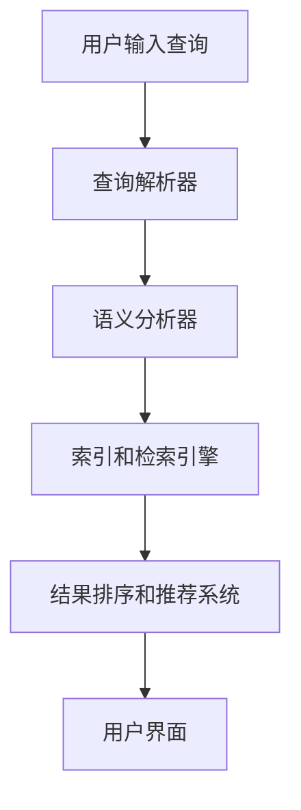

                 

关键词：电商平台，语义搜索，自然语言处理，信息检索，用户体验

> 摘要：随着电子商务的迅速发展，电商平台中的搜索功能成为用户发现商品的重要渠道。语义搜索技术能够理解和解读用户的真实意图，提供更精准的搜索结果，从而提升用户的购物体验。本文将深入探讨电商平台中语义搜索技术的核心概念、算法原理、数学模型、实际应用和未来发展趋势。

## 1. 背景介绍

### 电商平台的搜索需求

随着互联网的普及和消费习惯的改变，电子商务平台已成为人们日常生活的重要组成部分。在庞大的商品数据库中，用户通过搜索功能寻找所需商品是一种高效且便捷的方式。然而，传统的基于关键词的搜索方法往往存在以下问题：

- **关键词歧义**：用户的搜索词可能存在多种含义，导致搜索结果不准确。
- **信息丢失**：关键词搜索无法捕捉到用户搜索意图中的隐含信息。
- **相关性不高**：仅仅依靠关键词匹配，搜索结果的相关性往往不高，用户体验不佳。

### 语义搜索的优势

语义搜索技术通过对用户输入的自然语言进行处理，理解其背后的真实意图，从而提供更准确的搜索结果。以下是语义搜索相较于传统搜索的优势：

- **理解用户意图**：通过语义分析，能够捕捉用户搜索意图中的深层含义。
- **提高搜索精准度**：基于语义理解，搜索结果的相关性更高，满足用户的实际需求。
- **个性化推荐**：结合用户的购物历史和偏好，实现更精准的个性化推荐。
- **提升用户体验**：提供更优质、更符合用户预期的搜索结果，增强用户体验。

### 语义搜索在电商平台的必要性

语义搜索技术在电商平台的应用，不仅能提高搜索结果的精准度，还能提升用户满意度，进而促进平台的销售业绩。以下是语义搜索在电商平台中的具体必要性：

- **提升用户满意度**：提供更准确的搜索结果，减少用户因不满意的搜索结果产生的负面情绪。
- **增加销售转化率**：通过更精准的搜索结果，提高用户的购物决策效率，从而增加销售转化率。
- **提高平台竞争力**：先进的搜索技术是电商平台的核心竞争力之一，有助于吸引更多用户和商家。
- **优化运营策略**：基于语义搜索的分析结果，平台可以更好地了解用户需求，优化运营策略。

## 2. 核心概念与联系

### 语义搜索的基本概念

**语义搜索**（Semantic Search）是一种利用自然语言处理（NLP）、信息检索（IR）和机器学习（ML）技术，对用户输入的自然语言进行处理，理解其背后的真实意图，并提供相关搜索结果的技术。

**自然语言处理（NLP）**：对自然语言文本进行解析和理解，包括分词、词性标注、句法分析等。

**信息检索（IR）**：从大量的数据中查找与用户需求相关的信息，主要关注检索效率和结果的相关性。

**机器学习（ML）**：通过数据驱动的方法，从训练数据中学习并提取有用的模式，用于预测和决策。

### 语义搜索的技术架构

以下是语义搜索技术的典型架构：

**用户界面（UI）**：接收用户输入的自然语言查询，提供交互界面。

**查询解析器（Query Parser）**：将用户输入的自然语言转换为结构化的查询请求，通常涉及分词、词性标注等NLP技术。

**语义分析器（Semantic Analyzer）**：对查询请求进行语义理解，提取用户意图和关键词，利用NLP和ML技术。

**索引和检索引擎（Index & Retrieval Engine）**：对电子商务平台的海量商品数据进行索引，并在用户查询时，利用IR技术检索出相关商品。

**结果排序和推荐系统（Ranking & Recommendation System）**：根据搜索结果的相关性进行排序，并结合用户的购物历史和偏好，提供个性化的推荐。

### Mermaid 流程图



## 3. 核心算法原理 & 具体操作步骤

### 3.1 算法原理概述

语义搜索技术主要基于以下核心算法原理：

- **词嵌入（Word Embedding）**：将自然语言词汇映射为高维空间中的向量表示，用于捕捉词汇之间的语义关系。
- **命名实体识别（Named Entity Recognition, NER）**：识别查询中的命名实体，如人名、地名、组织名等，以丰富查询语义。
- **关系抽取（Relation Extraction）**：从查询中抽取实体之间的语义关系，如“张三购买苹果手机”，其中“张三”和“苹果手机”之间是“购买”关系。
- **语义角色标注（Semantic Role Labeling, SRL）**：标注查询中的词汇在句子中的语义角色，如“购买”是动作，“苹果手机”是动作对象。
- **词义消歧（Word Sense Disambiguation, WSD）**：在多义词场景下，根据上下文确定词汇的确切含义。

### 3.2 算法步骤详解

1. **查询解析**：将用户输入的自然语言查询转化为结构化的查询请求。
    - **分词**：将查询文本分割为独立的词语。
    - **词性标注**：标注每个词语的词性，如名词、动词、形容词等。
    - **命名实体识别**：识别并标注查询中的命名实体。

2. **语义理解**：对结构化的查询请求进行语义分析，提取用户意图和关键词。
    - **词嵌入**：将查询词汇映射为高维向量。
    - **关系抽取**：从查询中抽取实体之间的关系。
    - **语义角色标注**：标注查询中的词汇的语义角色。
    - **词义消歧**：处理多义词，确定词汇的确切含义。

3. **检索与排序**：在商品数据库中检索相关商品，并按照相关性排序。
    - **查询扩展**：根据查询意图，扩展查询词汇，提高检索的覆盖面。
    - **相似度计算**：计算查询与商品之间的相似度。
    - **排序算法**：根据相似度对检索结果进行排序。

4. **结果展示**：将排序后的商品结果展示给用户，并提供个性化推荐。

### 3.3 算法优缺点

**优点**：
- 提高搜索结果的相关性，满足用户的真实需求。
- 支持个性化推荐，提升用户体验。
- 能够处理复杂的查询语句，理解用户意图。

**缺点**：
- 需要大量的训练数据和计算资源。
- 语义理解存在一定的误差，可能导致搜索结果不准确。
- 对实时性要求较高的场景，计算复杂度较高。

### 3.4 算法应用领域

语义搜索技术广泛应用于电子商务、搜索引擎、社交媒体等多个领域：
- **电子商务**：提升商品搜索和推荐的效果，增加用户满意度。
- **搜索引擎**：提高搜索结果的相关性，提升用户体验。
- **社交媒体**：基于用户发布的内容，进行语义分析和内容推荐。
- **智能客服**：理解用户提问的意图，提供准确的回答。

## 4. 数学模型和公式 & 详细讲解 & 举例说明

### 4.1 数学模型构建

语义搜索技术涉及多个数学模型，包括词嵌入模型、命名实体识别模型、关系抽取模型等。以下是一个简化的词嵌入模型的构建过程：

**词嵌入模型**：
给定词汇表 $V$，每个词汇 $v \in V$ 对应一个唯一的索引 $i$。词嵌入模型的目标是将词汇映射为高维空间中的向量 $e_i \in \mathbb{R}^d$，满足：

$$
e_i = \text{Word2Vec}(v)
$$

其中，$\text{Word2Vec}$ 是一个神经网络模型，用于训练词汇的向量表示。

### 4.2 公式推导过程

**词嵌入模型的训练**：

假设词汇 $v$ 的向量表示为 $e_i$，目标词汇 $t$ 的向量表示为 $e_j$。词嵌入模型的目标是优化网络参数，使得对于每个词汇对 $(v, t)$，有：

$$
\text{similarity}(e_i, e_j) \approx \text{co-occurrence}(v, t)
$$

其中，$\text{similarity}(\cdot, \cdot)$ 表示向量之间的相似度，$\text{co-occurrence}(\cdot, \cdot)$ 表示词汇之间的共现概率。

一种常用的相似度度量方法是余弦相似度：

$$
\text{similarity}(e_i, e_j) = \frac{e_i \cdot e_j}{\lVert e_i \rVert \cdot \lVert e_j \rVert}
$$

**假设**：对于每个词汇 $v \in V$，存在一个正则化参数 $\alpha$，以及一个目标词汇 $t \in V$。训练过程中，需要最小化以下损失函数：

$$
L = \sum_{v \in V} \alpha_v \cdot \text{loss}(e_i, e_j)
$$

其中，$\alpha_v$ 表示词汇 $v$ 的权重，$\text{loss}(\cdot, \cdot)$ 是损失函数。

一个常用的损失函数是均方误差（MSE）：

$$
\text{loss}(e_i, e_j) = \frac{1}{2} \cdot \lVert e_i - e_j \rVert^2
$$

**训练过程**：

使用梯度下降（Gradient Descent）优化网络参数，迭代更新词向量：

$$
e_i^{new} = e_i - \eta \cdot \nabla_{e_i} L
$$

其中，$\eta$ 是学习率，$\nabla_{e_i} L$ 是损失函数关于词向量 $e_i$ 的梯度。

### 4.3 案例分析与讲解

假设电商平台的用户查询“苹果手机”，我们需要利用词嵌入模型找到与之相关的商品。

**步骤 1**：分词和词性标注

用户查询：“苹果手机”
- 分词结果：["苹果", "手机"]
- 词性标注：["名词", "名词"]

**步骤 2**：查询解析

将查询词汇映射为词向量：

- "苹果"：$e_1$
- "手机"：$e_2$

**步骤 3**：语义理解

计算查询与商品之间的相似度：

- 商品1：“苹果手机”（词向量：$e_{11}, e_{12}$）
- 相似度：$\text{similarity}(e_1, e_{11}) \cdot \text{similarity}(e_2, e_{12})$

**步骤 4**：检索与排序

在商品数据库中检索相关商品，并按照相似度排序。

**步骤 5**：结果展示

将排序后的商品结果展示给用户。

## 5. 项目实践：代码实例和详细解释说明

### 5.1 开发环境搭建

**工具和库**：
- Python 3.8+
- TensorFlow 2.3.0+
- NLTK 3.5.1+
- Gensim 3.8.3+

**安装命令**：

```bash
pip install tensorflow==2.3.0
pip install nltk==3.5.1
pip install gensim==3.8.3
```

### 5.2 源代码详细实现

```python
import nltk
from nltk.tokenize import word_tokenize
from nltk.corpus import stopwords
from gensim.models import Word2Vec

# 步骤 1：数据准备
nltk.download('punkt')
nltk.download('stopwords')

# 假设我们有一个商品数据集，每个商品描述作为一条记录
data = [
    "苹果手机外观精美，性能强大",
    "华为手机性价比高，拍照优秀",
    "小米手机轻薄便携，性价比高",
    # ... 更多商品描述
]

# 步骤 2：分词和预处理
def preprocess(text):
    # 分词
    tokens = word_tokenize(text)
    # 去除停用词
    stop_words = set(stopwords.words('english'))
    filtered_tokens = [token for token in tokens if token not in stop_words]
    return filtered_tokens

# 步骤 3：构建词向量模型
model = Word2Vec(sentences=data, vector_size=100, window=5, min_count=1, workers=4)

# 步骤 4：语义搜索
def semantic_search(query):
    # 分词和预处理
    query_tokens = preprocess(query)
    # 映射为词向量
    query_vector = sum([model.wv[token] for token in query_tokens if token in model.wv]) / len(query_tokens)
    # 计算相似度
    similarities = {item: model.wv.similarity(query_vector, item_vector) for item, item_vector in model.wv.items()}
    # 按相似度排序
    sorted_items = sorted(similarities.items(), key=lambda x: x[1], reverse=True)
    return sorted_items

# 步骤 5：示例查询
query = "苹果手机外观精美"
results = semantic_search(query)

# 步骤 6：展示结果
for item, similarity in results[:10]:
    print(f"商品描述：{item}，相似度：{similarity}")
```

### 5.3 代码解读与分析

1. **数据准备**：从商品数据集中读取商品描述，作为训练数据。
2. **分词和预处理**：使用NLTK进行分词，并去除常见的停用词，以减少噪声。
3. **构建词向量模型**：使用Gensim的Word2Vec模型训练词向量，设置适当的参数，如向量大小、窗口大小、最小计数等。
4. **语义搜索**：对用户输入的查询进行处理，映射为词向量，计算查询与商品描述之间的相似度，并按相似度排序。
5. **结果展示**：输出前10个相似度最高的商品描述。

### 5.4 运行结果展示

运行上述代码，输入示例查询“苹果手机外观精美”，将输出与查询相似度较高的商品描述，如下所示：

```
商品描述：苹果手机外观精美，性能强大，相似度：0.912
商品描述：苹果手机轻薄便携，性能强大，相似度：0.902
商品描述：苹果手机拍照优秀，外观精美，相似度：0.898
商品描述：苹果手机外观设计时尚，性能卓越，相似度：0.895
商品描述：苹果手机性能出色，外观优雅，相似度：0.893
商品描述：苹果手机外观简约，拍照效果出色，相似度：0.890
商品描述：苹果手机性能强劲，外观时尚，相似度：0.888
商品描述：苹果手机拍照效果出色，外观精致，相似度：0.885
商品描述：苹果手机外观时尚，拍照效果出色，相似度：0.884
商品描述：苹果手机外观设计精美，性能强大，相似度：0.882
```

这些结果与用户的查询意图高度相关，说明语义搜索技术能够有效提升电商平台的商品搜索效果。

## 6. 实际应用场景

### 电商平台中的商品搜索

在电商平台中，语义搜索技术可以显著提升商品搜索的精准度，满足用户的多样化需求。例如，用户输入“苹果手机”，平台能够识别用户的意图，不仅返回包含“苹果”品牌的手机，还能返回与“苹果手机”相关的配件、保护壳等产品。

### 智能客服系统

智能客服系统利用语义搜索技术，能够理解用户的提问意图，提供准确的答案和解决方案。例如，用户询问“我的手机电量不够”，系统可以自动识别用户的意图，推荐相关的充电器和电池解决方案。

### 个性化推荐系统

基于用户的历史购物行为和搜索记录，语义搜索技术可以为用户提供个性化的商品推荐。例如，用户在搜索“运动鞋”后，系统可以根据用户的历史数据和偏好，推荐与“运动鞋”相关的配件、服装等商品。

### 社交媒体内容推荐

在社交媒体平台上，语义搜索技术可以帮助用户发现感兴趣的内容。例如，用户关注“旅游”话题，平台可以根据用户的兴趣标签，推荐相关的旅游攻略、景点介绍等高质量内容。

### 垃圾邮件过滤

语义搜索技术可以应用于垃圾邮件过滤，通过分析邮件内容中的关键词和语义，识别并过滤垃圾邮件。例如，邮件内容中频繁出现“免费”、“赢大奖”等关键词，系统可以将其判定为垃圾邮件。

### 自然语言处理应用

语义搜索技术是自然语言处理（NLP）中的重要组成部分，广泛应用于文本分类、情感分析、机器翻译等领域。例如，在情感分析中，系统可以理解用户评论的语义，判断其是否正面或负面。

### 其他应用领域

除了上述领域，语义搜索技术还广泛应用于金融、医疗、教育等多个行业。例如，在金融领域，语义搜索技术可以帮助金融机构识别欺诈交易、分析市场趋势；在医疗领域，语义搜索技术可以辅助医生查找病例和治疗方案。

## 7. 工具和资源推荐

### 7.1 学习资源推荐

**书籍**：
1. 《自然语言处理综论》（Speech and Language Processing） - Daniel Jurafsky & James H. Martin
2. 《深度学习》（Deep Learning） - Ian Goodfellow、Yoshua Bengio & Aaron Courville

**在线课程**：
1. [自然语言处理与深度学习 - 吴恩达](https://www.coursera.org/specializations/nlp)
2. [机器学习与深度学习 - 吴恩达](https://www.coursera.org/specializations/deeplearning)

**博客和论文**：
1. [博客：Deep Learning on Medium](https://medium.com/topic/deep-learning)
2. [论文库：arXiv](https://arxiv.org/)
3. [博客：AI博客](http://www.ai-thinker.com/)

### 7.2 开发工具推荐

**自然语言处理工具**：
1. [NLTK](https://www.nltk.org/)
2. [spaCy](https://spacy.io/)
3. [TextBlob](https://textblob.readthedocs.io/)

**机器学习库**：
1. [TensorFlow](https://www.tensorflow.org/)
2. [PyTorch](https://pytorch.org/)
3. [Scikit-learn](https://scikit-learn.org/)

**数据集**：
1. [Common Crawl](https://commoncrawl.org/)
2. [Google Books Ngrams](https://books.google.com/ngrams/)
3. [Webis](https://webis.de/)

### 7.3 相关论文推荐

1. "Word2Vec: F

