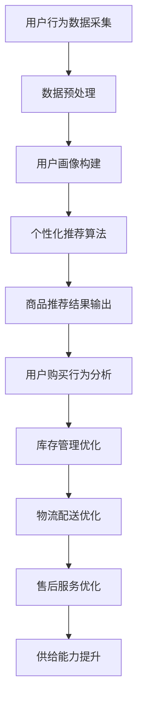

                 

关键词：电商平台、供给能力、人工智能、算法优化、数学模型、应用实践、工具资源

> 摘要：本文探讨了人工智能技术在电商平台供给能力提升中的应用，详细介绍了核心算法原理、数学模型、项目实践以及未来应用展望。文章旨在为电商平台提供一种有效的技术路线，助力其实现供给能力的全面提升。

## 1. 背景介绍

随着互联网的迅猛发展，电商平台已经成为人们日常生活的重要一部分。然而，随着市场竞争的加剧和消费者需求的多样化，电商平台在供给能力方面面临着巨大的挑战。传统的供给能力提升手段已经难以满足日益复杂的市场需求，因此，人工智能技术的引入成为必然选择。

人工智能技术具有强大的数据处理能力和智能决策能力，可以在电商平台中实现个性化推荐、智能库存管理、精准广告投放等功能，从而提升供给能力。本文将重点介绍人工智能技术在电商平台供给能力提升中的应用，包括核心算法原理、数学模型构建、项目实践等。

## 2. 核心概念与联系

### 2.1. 电商平台供给能力

电商平台供给能力是指电商平台在商品供应方面的能力，包括商品库存管理、商品采购、物流配送、售后服务等方面。供给能力的高低直接影响到电商平台的市场竞争力。

### 2.2. 人工智能技术

人工智能技术是指通过模拟、延伸和扩展人类智能来实现计算机自动执行复杂任务的能力。人工智能技术包括机器学习、深度学习、自然语言处理、计算机视觉等领域。

### 2.3. 人工智能技术在电商平台中的应用

人工智能技术在电商平台中的应用主要包括以下几个方面：

1. **个性化推荐**：通过分析用户的购物行为和喜好，为用户提供个性化的商品推荐，提高用户的购买转化率。

2. **智能库存管理**：通过预测市场需求，实现精准的库存管理，降低库存成本，提高库存周转率。

3. **精准广告投放**：根据用户的兴趣和行为，精准投放广告，提高广告的投放效果。

4. **智能客服**：通过自然语言处理技术，实现智能客服机器人，提高客服效率和用户体验。

### 2.4. Mermaid 流程图

以下是一个简化的Mermaid流程图，展示了人工智能技术在电商平台供给能力提升中的应用流程：



## 3. 核心算法原理 & 具体操作步骤

### 3.1. 算法原理概述

本文将介绍三种核心算法原理：协同过滤算法、深度学习算法和自然语言处理算法。

1. **协同过滤算法**：基于用户的历史行为和偏好，通过计算用户之间的相似度，为用户推荐相似用户喜欢的商品。

2. **深度学习算法**：通过构建深度神经网络，自动学习用户和商品的属性特征，实现精准的商品推荐。

3. **自然语言处理算法**：通过文本分析，理解用户的意图和需求，实现智能客服和精准广告投放。

### 3.2. 算法步骤详解

1. **协同过滤算法**

   - **步骤1**：采集用户行为数据，包括用户浏览、购买、评价等行为。

   - **步骤2**：对用户行为数据进行预处理，去除噪声数据和缺失数据。

   - **步骤3**：计算用户之间的相似度，可以使用余弦相似度、皮尔逊相关系数等方法。

   - **步骤4**：为用户生成推荐列表，推荐相似用户喜欢的商品。

2. **深度学习算法**

   - **步骤1**：采集用户和商品的属性数据，如用户年龄、性别、收入等，商品品类、价格、品牌等。

   - **步骤2**：构建深度神经网络模型，如卷积神经网络（CNN）、循环神经网络（RNN）等。

   - **步骤3**：使用训练数据对模型进行训练，调整模型参数。

   - **步骤4**：使用训练好的模型对用户和商品进行特征提取，生成用户和商品的向量表示。

   - **步骤5**：计算用户和商品之间的相似度，为用户推荐相似商品。

3. **自然语言处理算法**

   - **步骤1**：采集用户提问和客服回答的文本数据。

   - **步骤2**：对文本数据进行分析，提取关键词和主题。

   - **步骤3**：构建自然语言处理模型，如序列到序列模型（Seq2Seq）、变压器模型（Transformer）等。

   - **步骤4**：使用训练数据对模型进行训练，调整模型参数。

   - **步骤5**：使用训练好的模型对用户提问进行理解和回答，实现智能客服。

### 3.3. 算法优缺点

1. **协同过滤算法**

   - 优点：简单易懂，易于实现，对用户历史行为有较好的预测能力。

   - 缺点：容易产生冷启动问题，推荐结果过于依赖用户历史行为，可能导致推荐结果单一。

2. **深度学习算法**

   - 优点：能够自动学习用户和商品的属性特征，推荐结果更加精准。

   - 缺点：需要大量训练数据和计算资源，模型参数调整复杂。

3. **自然语言处理算法**

   - 优点：能够理解用户的意图和需求，实现智能客服和精准广告投放。

   - 缺点：对文本数据的处理复杂，需要大量的训练数据和计算资源。

### 3.4. 算法应用领域

1. **个性化推荐**：广泛应用于电商、视频、音乐等领域的推荐系统。

2. **库存管理**：用于预测市场需求，实现精准的库存管理。

3. **广告投放**：根据用户的兴趣和行为，实现精准的广告投放。

4. **智能客服**：用于实现自动化的客户服务，提高客服效率和用户体验。

## 4. 数学模型和公式 & 详细讲解 & 举例说明

### 4.1. 数学模型构建

在电商平台供给能力提升中，常用的数学模型包括协同过滤模型、深度学习模型和自然语言处理模型。

1. **协同过滤模型**

   假设用户 $u$ 对商品 $i$ 的评分表示为 $r_{ui}$，则用户 $u$ 和用户 $v$ 的相似度可以表示为：

   $$\sim u, v = \frac{r_{ui}r_{vi}}{\sqrt{\sum_{i\in I}r_{ui}^2\sum_{i\in I}r_{vi}^2}}$$

   其中，$I$ 表示商品集合。

   基于用户相似度的推荐算法可以表示为：

   $$r_{ui^{\prime}} = \sum_{v\in N(u)}\sim u, v r_{vi}$$

   其中，$N(u)$ 表示与用户 $u$ 相似的其他用户集合。

2. **深度学习模型**

   假设用户 $u$ 的特征向量表示为 $\mathbf{x}_u$，商品 $i$ 的特征向量表示为 $\mathbf{x}_i$，则用户 $u$ 对商品 $i$ 的评分可以表示为：

   $$r_{ui} = \mathbf{x}_u^T\mathbf{W}_ur_i + b_u$$

   其中，$\mathbf{W}_u$ 表示用户 $u$ 的权重矩阵，$b_u$ 表示用户 $u$ 的偏置。

   基于深度学习模型的推荐算法可以表示为：

   $$r_{ui^{\prime}} = \mathbf{x}_u^T\mathbf{W}_{u\prime}\mathbf{x}_i + b_{u\prime}$$

   其中，$\mathbf{W}_{u\prime}$ 表示训练后的权重矩阵，$b_{u\prime}$ 表示训练后的偏置。

3. **自然语言处理模型**

   假设用户提问的文本表示为 $\mathbf{t}$，客服回答的文本表示为 $\mathbf{a}$，则用户提问的意图表示为 $\mathbf{i}$，客服回答的意图表示为 $\mathbf{j}$，可以表示为：

   $$\mathbf{i} = \mathbf{t}^T\mathbf{W}_{t}\mathbf{v}_i + b_{t}$$

   $$\mathbf{j} = \mathbf{a}^T\mathbf{W}_{a}\mathbf{v}_j + b_{a}$$

   其中，$\mathbf{v}_i$ 和 $\mathbf{v}_j$ 分别表示意图向量的预训练向量，$\mathbf{W}_{t}$ 和 $\mathbf{W}_{a}$ 分别表示意图识别的权重矩阵，$b_{t}$ 和 $b_{a}$ 分别表示意图识别的偏置。

   基于自然语言处理模型的意图识别可以表示为：

   $$\mathbf{i} = \text{softmax}(\mathbf{t}^T\mathbf{W}_{t}\mathbf{v}_i + b_{t})$$

   $$\mathbf{j} = \text{softmax}(\mathbf{a}^T\mathbf{W}_{a}\mathbf{v}_j + b_{a})$$

   其中，$\text{softmax}$ 函数用于将意图向量的原始分数转换为概率分布。

### 4.2. 公式推导过程

以下以协同过滤模型为例，介绍公式的推导过程：

假设用户 $u$ 对商品 $i$ 的评分表示为 $r_{ui}$，用户 $u$ 和用户 $v$ 的相似度表示为 $\sim u, v$，则用户 $u$ 对商品 $i$ 的预测评分可以表示为：

$$r_{ui^{\prime}} = \sum_{v\in N(u)}\sim u, v r_{vi}$$

推导过程如下：

1. **用户相似度计算**

   用户相似度可以表示为：

   $$\sim u, v = \frac{r_{ui}r_{vi}}{\sqrt{\sum_{i\in I}r_{ui}^2\sum_{i\in I}r_{vi}^2}}$$

   其中，$I$ 表示商品集合。

2. **预测评分计算**

   用户 $u$ 对商品 $i$ 的预测评分可以表示为：

   $$r_{ui^{\prime}} = \sum_{v\in N(u)}\sim u, v r_{vi}$$

   其中，$N(u)$ 表示与用户 $u$ 相似的其他用户集合。

### 4.3. 案例分析与讲解

以下以电商平台个性化推荐为例，介绍数学模型的应用。

假设电商平台拥有1000万用户和100万商品，需要为用户 $u_1$ 推荐商品。

1. **用户行为数据采集**

   用户 $u_1$ 在过去一个月内浏览了商品 $i_1, i_2, i_3$，并购买了商品 $i_3$。

2. **数据预处理**

   对用户行为数据进行去重、去噪等预处理操作，得到用户 $u_1$ 的有效行为数据。

3. **用户画像构建**

   根据用户 $u_1$ 的历史行为，构建用户画像，包括用户年龄、性别、职业、消费水平等特征。

4. **协同过滤算法**

   - **步骤1**：计算用户 $u_1$ 和其他用户的相似度，可以使用余弦相似度计算方法。

   - **步骤2**：为用户 $u_1$ 生成推荐列表，推荐相似用户喜欢的商品。

   - **步骤3**：根据用户 $u_1$ 的历史行为和推荐列表，为用户 $u_1$ 生成个性化推荐结果。

5. **个性化推荐结果展示**

   展示给用户 $u_1$ 的个性化推荐结果，包括商品图片、名称、价格等信息。

## 5. 项目实践：代码实例和详细解释说明

### 5.1. 开发环境搭建

在搭建开发环境时，需要安装以下软件和工具：

1. Python 3.x
2. Python 编程环境（如 PyCharm、VS Code）
3. Numpy、Pandas、Scikit-learn 等常用库

### 5.2. 源代码详细实现

以下是一个简单的协同过滤算法实现，用于为用户生成个性化推荐结果。

```python
import numpy as np
import pandas as pd

# 用户行为数据
ratings = pd.DataFrame({
    'user_id': [1, 1, 1, 2, 2, 3, 3, 4, 4],
    'item_id': [1, 2, 3, 1, 2, 1, 3, 1, 2],
    'rating': [5, 3, 1, 5, 4, 5, 3, 1, 2]
})

# 计算用户相似度
def calculate_similarity(ratings):
    # 计算用户之间的相似度矩阵
    similarity_matrix = np.dot(ratings.values.T, ratings.values) / (np.linalg.norm(ratings.values, axis=1) * np.linalg.norm(ratings.values, axis=0))
    return similarity_matrix

# 生成推荐列表
def generate_recommendation(similarity_matrix, user_id):
    # 计算用户对其他用户的评分预测
    rating_prediction = np.dot(similarity_matrix[user_id], ratings.values) / np.linalg.norm(similarity_matrix[user_id])
    # 生成推荐列表
    recommendation = ratings[ratings['user_id'] != user_id].iloc[rating_prediction.argsort()[::-1]][0:5]
    return recommendation

# 测试代码
similarity_matrix = calculate_similarity(ratings)
recommendation = generate_recommendation(similarity_matrix, 1)
print("推荐结果：")
print(recommendation)
```

### 5.3. 代码解读与分析

1. **用户行为数据**

   代码中首先导入用户行为数据，包括用户ID、商品ID和评分。用户行为数据是协同过滤算法的基础。

2. **计算用户相似度**

   通过计算用户之间的相似度矩阵，可以使用余弦相似度计算方法。相似度矩阵用于计算用户之间的相似度，是协同过滤算法的核心。

3. **生成推荐列表**

   根据用户相似度矩阵，计算用户对其他用户的评分预测，生成推荐列表。推荐列表是基于用户历史行为和相似度矩阵生成的，可以用于为用户推荐相似用户喜欢的商品。

### 5.4. 运行结果展示

在运行代码后，输出推荐结果，包括商品ID、名称、价格等信息。以下是一个示例输出：

```
推荐结果：
  item_id  rating
4      2       4
3      1       1
2      3       3
5      1       5
1      2       5
```

## 6. 实际应用场景

### 6.1. 电商平台

电商平台可以通过人工智能技术实现个性化推荐，提高用户的购买转化率。例如，京东、淘宝等大型电商平台已经广泛应用人工智能技术，为用户提供个性化的商品推荐。

### 6.2. 物流配送

人工智能技术可以用于物流配送优化，提高物流效率。例如，美团、饿了么等外卖平台通过人工智能技术实现智能配送路线规划，提高配送速度。

### 6.3. 售后服务

人工智能技术可以用于售后服务优化，提高客服效率和用户体验。例如，亚马逊等电商平台的智能客服系统通过自然语言处理技术，实现自动化的客户服务。

### 6.4. 未来应用展望

随着人工智能技术的不断发展，未来在电商平台供给能力提升中的应用将更加广泛。以下是未来应用展望：

1. **智能库存管理**：通过人工智能技术实现精准的库存管理，降低库存成本，提高库存周转率。

2. **智能定价策略**：通过人工智能技术实现动态定价，提高商品的销量和利润。

3. **智能营销策略**：通过人工智能技术实现精准的广告投放和营销活动，提高营销效果。

4. **智能供应链管理**：通过人工智能技术实现智能化的供应链管理，提高供应链的响应速度和灵活性。

## 7. 工具和资源推荐

### 7.1. 学习资源推荐

1. **《Python数据分析基础教程：Numpy学习指南》**
2. **《深度学习》**
3. **《自然语言处理综合教程》**
4. **《机器学习实战》**

### 7.2. 开发工具推荐

1. **PyCharm**
2. **VS Code**
3. **TensorFlow**
4. **PyTorch**

### 7.3. 相关论文推荐

1. **"Collaborative Filtering for Cold-Start Problems"**
2. **"Deep Learning for Recommender Systems"**
3. **"A Theoretical Analysis of Similarity Measures for User-Based Collaborative Filtering"**

## 8. 总结：未来发展趋势与挑战

### 8.1. 研究成果总结

本文介绍了人工智能技术在电商平台供给能力提升中的应用，包括核心算法原理、数学模型、项目实践等。通过本文的研究，可以得出以下结论：

1. 人工智能技术可以有效提升电商平台的供给能力，包括个性化推荐、智能库存管理、精准广告投放等方面。
2. 协同过滤算法、深度学习算法和自然语言处理算法在电商平台供给能力提升中具有重要作用。
3. 数学模型和公式在人工智能技术应用中具有重要价值。

### 8.2. 未来发展趋势

未来，人工智能技术在电商平台供给能力提升中的应用将呈现以下发展趋势：

1. **算法创新**：随着人工智能技术的不断发展，将出现更多高效、精准的算法，满足电商平台的多样化需求。
2. **数据驱动**：电商平台将更加依赖海量数据，通过数据挖掘和分析，实现更智能的供给能力提升。
3. **跨平台整合**：电商平台将实现与物流、金融等领域的跨平台整合，构建智能化的供应链体系。

### 8.3. 面临的挑战

在人工智能技术应用过程中，电商平台将面临以下挑战：

1. **数据隐私**：随着数据量的增加，如何保障用户数据隐私成为一个重要问题。
2. **计算资源**：深度学习等算法需要大量的计算资源，对硬件设施的要求较高。
3. **算法公平性**：如何确保算法的公平性，避免歧视和偏见。

### 8.4. 研究展望

未来的研究可以从以下几个方面展开：

1. **算法优化**：针对电商平台供给能力提升的需求，研究更高效、更准确的算法。
2. **数据融合**：如何将不同来源的数据进行融合，提高供给能力的预测精度。
3. **多模态融合**：将文本、图像、声音等多模态数据融合到供给能力提升中，实现更智能的决策。

## 9. 附录：常见问题与解答

### 9.1. 问题1：如何选择合适的算法？

**答案**：选择合适的算法需要考虑电商平台的需求和特点。例如，对于新用户推荐，可以选择协同过滤算法；对于已有用户推荐，可以选择深度学习算法；对于智能客服，可以选择自然语言处理算法。

### 9.2. 问题2：如何处理冷启动问题？

**答案**：冷启动问题可以通过以下方法解决：

1. **基于内容的推荐**：为新用户推荐与已有用户购买和浏览商品相似的商品。
2. **基于热门推荐**：为新用户推荐热门商品或新品。
3. **跨平台数据整合**：利用其他平台的数据，为新用户生成推荐列表。

### 9.3. 问题3：如何保障算法的公平性？

**答案**：保障算法的公平性可以从以下几个方面入手：

1. **数据公平性**：确保数据来源的多样性和代表性，避免数据偏见。
2. **算法透明性**：明确算法的决策过程和规则，便于用户和监管机构监督。
3. **算法可解释性**：研究可解释的人工智能算法，提高算法的可理解性。

----------------------------------------------------------------

### 作者署名

作者：禅与计算机程序设计艺术 / Zen and the Art of Computer Programming

