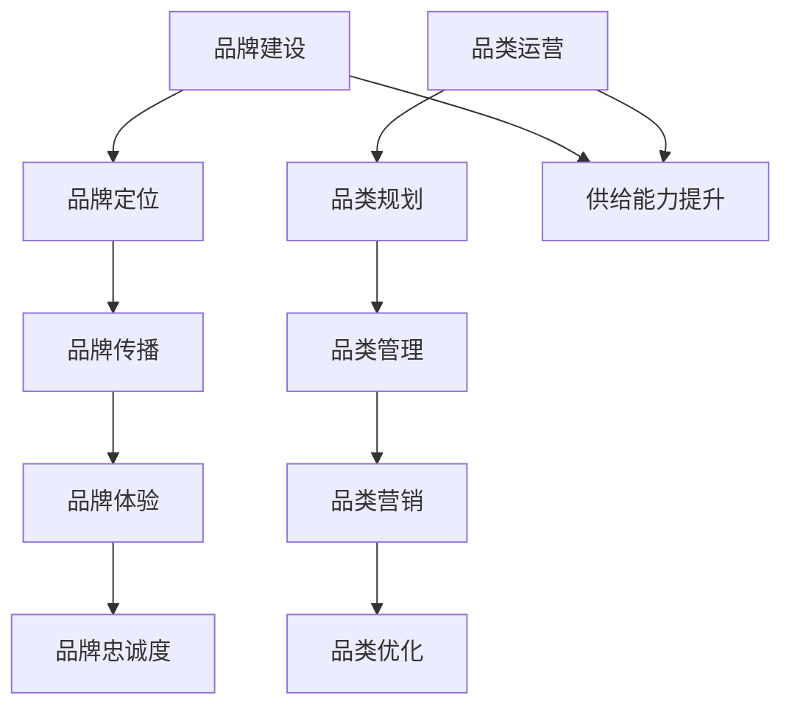

                 

关键词：电商平台、供给能力、品牌建设、品类运营、用户体验、数据分析

摘要：本文旨在探讨如何通过品牌建设和品类运营来提升电商平台的供给能力。文章首先介绍了电商平台的发展背景，随后详细分析了品牌建设和品类运营的核心概念及其重要性，进一步提出了具体的实施策略。最后，文章结合实际案例，展示了这些策略在提升电商平台供给能力方面的实际效果，并对未来的发展进行了展望。

## 1. 背景介绍

随着互联网技术的不断发展和普及，电商平台已经成为现代商业环境中不可或缺的一部分。电商平台不仅为消费者提供了更加便捷的购物体验，也为企业创造了新的销售渠道和商业机会。然而，在竞争日益激烈的电商市场中，供给能力成为了电商平台发展的关键因素。

供给能力是指电商平台在产品供应、服务质量和用户体验等方面的综合能力。一个强大的供给能力不仅可以提升用户满意度，还能增强企业的市场竞争力和品牌影响力。因此，如何提升电商平台的供给能力成为了许多企业关注的焦点。

品牌建设和品类运营是提升电商平台供给能力的两个重要方面。品牌建设旨在塑造企业品牌形象，提升品牌知名度，从而吸引更多用户。品类运营则关注产品品类的规划和管理，通过合理的品类布局和营销策略，提高产品的销售和用户满意度。本文将围绕这两个方面展开讨论，并提出具体的策略和实施方法。

## 2. 核心概念与联系

### 2.1 品牌建设

品牌建设是指企业通过一系列的营销和传播活动，塑造和提升品牌形象的过程。品牌建设不仅仅是对品牌名称和标识的维护，更是一种对品牌内涵和价值的塑造。在电商平台上，品牌建设具有以下核心概念和联系：

1. **品牌定位**：品牌定位是企业对品牌核心价值、目标受众和市场定位的界定。一个清晰的品牌定位有助于企业在激烈的市场竞争中脱颖而出。

2. **品牌传播**：品牌传播是通过各种渠道将品牌信息传递给目标受众的过程。在电商平台上，品牌传播可以通过社交媒体、广告投放、用户评价等多种方式实现。

3. **品牌体验**：品牌体验是用户在使用电商平台时对品牌的整体感受。一个良好的品牌体验可以增强用户对品牌的忠诚度和信任感。

4. **品牌忠诚度**：品牌忠诚度是指用户对品牌的长期支持和信任。提升品牌忠诚度可以降低用户流失率，提高用户复购率。

### 2.2 品类运营

品类运营是指企业对产品品类进行规划和管理，以实现销售增长和用户满意度提升的过程。品类运营在电商平台中具有以下核心概念和联系：

1. **品类规划**：品类规划是指企业对产品品类进行分类和定位，以满足不同用户群体的需求。合理的品类规划可以提高用户购物的便利性和满意度。

2. **品类管理**：品类管理是指企业对产品品类进行维护和管理，包括库存管理、价格管理、促销管理等内容。有效的品类管理可以优化产品供应和销售流程。

3. **品类营销**：品类营销是指企业通过营销策略和活动，提高产品品类在用户心中的认知度和吸引力。品类营销可以通过广告投放、优惠活动、用户评价等方式实现。

4. **品类优化**：品类优化是指企业根据市场反馈和数据分析，对产品品类进行调整和改进，以提升品类竞争力。

### 2.3 品牌建设与品类运营的联系

品牌建设和品类运营在提升电商平台供给能力方面具有紧密的联系。品牌建设可以提升品牌知名度和用户满意度，从而为品类运营提供更多的流量和用户支持。而品类运营则通过优化产品供应和服务质量，进一步巩固和提升品牌形象。

品牌建设和品类运营相辅相成，共同构建了电商平台供给能力的基础。一个成功的电商平台不仅需要强大的品牌建设，还需要高效的品类运营来支持。通过合理的品牌建设和品类运营策略，电商平台可以提升供给能力，实现持续增长和市场领先。

### 2.4 Mermaid 流程图（Mermaid 流程节点中不要有括号、逗号等特殊字符）



## 3. 核心算法原理 & 具体操作步骤

### 3.1 算法原理概述

品牌建设和品类运营的核心算法原理主要涉及以下方面：

1. **用户行为分析**：通过分析用户在电商平台上的行为数据，了解用户的兴趣和需求，为品牌建设和品类运营提供数据支持。

2. **品牌定位优化**：基于用户行为数据，对品牌定位进行优化，使其更符合目标受众的需求和期望。

3. **品类规划与优化**：根据用户行为数据和市场需求，对产品品类进行规划与优化，以提高品类竞争力和用户满意度。

4. **品牌传播策略制定**：基于用户行为数据和品牌定位，制定有效的品牌传播策略，提升品牌知名度和用户信任度。

5. **品类营销活动策划**：根据用户行为数据和品类规划，策划有针对性的品类营销活动，提高产品销售和用户参与度。

### 3.2 算法步骤详解

#### 3.2.1 用户行为分析

1. 数据收集：收集用户在电商平台上的浏览、购买、评价等行为数据。

2. 数据预处理：对收集到的数据进行清洗、去噪和格式化，确保数据质量。

3. 特征提取：从预处理后的数据中提取用户行为特征，如浏览时长、购买频率、评价分数等。

4. 数据可视化：利用可视化工具对提取的特征数据进行展示，以便分析用户行为模式。

#### 3.2.2 品牌定位优化

1. 竞争分析：分析竞争对手的品牌定位和市场份额，了解市场趋势和用户需求。

2. 用户调研：通过问卷调查、用户访谈等方式，了解目标受众的需求和期望。

3. 数据分析：结合用户调研和竞争分析结果，对品牌定位进行优化。

4. 品牌定位验证：通过用户反馈和市场份额变化，验证品牌定位的优化效果。

#### 3.2.3 品类规划与优化

1. 市场调研：分析市场趋势、用户需求、竞品情况等，为品类规划提供依据。

2. 品类分类：根据市场调研结果，对产品进行分类和定位。

3. 数据分析：利用用户行为数据，对品类进行评估和优化。

4. 品类调整：根据数据分析结果，对品类进行调整和优化。

#### 3.2.4 品牌传播策略制定

1. 目标受众分析：分析目标受众的特征、需求和偏好。

2. 品牌传播渠道选择：根据目标受众的特征，选择合适的品牌传播渠道。

3. 内容策划：制定有针对性的品牌传播内容，如广告语、宣传海报、社交媒体文案等。

4. 营销活动策划：策划有吸引力的品牌传播活动，如线上线下活动、合作营销等。

#### 3.2.5 品类营销活动策划

1. 品类分析：分析品类特点和市场需求，确定营销目标。

2. 营销策略制定：根据品类分析结果，制定有针对性的营销策略。

3. 活动策划：策划具体的营销活动，如促销活动、限时优惠、抽奖活动等。

4. 活动推广：利用各种渠道，如社交媒体、电子邮件、短信等，推广营销活动。

### 3.3 算法优缺点

#### 3.3.1 优点

1. 提高用户满意度：通过用户行为分析和需求满足，提升用户满意度。

2. 优化品牌定位：根据市场趋势和用户需求，优化品牌定位，提升品牌竞争力。

3. 提升品类竞争力：通过品类规划与优化，提升产品品类在市场中的竞争力。

4. 增强品牌传播效果：制定有针对性的品牌传播策略，提高品牌知名度和用户信任度。

#### 3.3.2 缺点

1. 数据分析难度大：用户行为数据庞大且复杂，分析难度较高。

2. 品牌定位优化需持续：市场环境和用户需求不断变化，品牌定位需持续优化。

3. 品类规划与优化需灵活：市场需求变化迅速，品类规划与优化需具备一定的灵活性。

4. 营销活动策划需创新：竞争激烈的市场环境中，营销活动需具备创新性和吸引力。

### 3.4 算法应用领域

品牌建设和品类运营算法在电商平台中有广泛的应用，具体包括：

1. **用户运营**：通过用户行为分析，优化用户体验，提升用户满意度和忠诚度。

2. **品牌营销**：制定有效的品牌传播策略，提高品牌知名度和用户信任度。

3. **品类管理**：通过品类规划与优化，提高产品品类在市场中的竞争力和销售业绩。

4. **供应链管理**：利用数据分析，优化供应链流程，提高供应链效率。

## 4. 数学模型和公式 & 详细讲解 & 举例说明

### 4.1 数学模型构建

在品牌建设和品类运营中，数学模型可以用于量化用户行为、品牌定位和品类规划等。以下是一个简化的数学模型：

1. **用户行为模型**：

   用户行为可以用概率模型表示，如马尔可夫模型或贝叶斯网络。假设用户行为 X 受到用户特征 Y 的影响，可以用概率转移矩阵 P 表示：

   $$ P_{ij} = P(X_i \rightarrow X_j|Y) $$

   其中，i 和 j 分别表示不同用户行为状态，Y 表示用户特征。

2. **品牌定位模型**：

   品牌定位可以通过目标函数最大化品牌影响力。假设品牌影响力由品牌知名度 N、品牌忠诚度 L 和品牌价值 V 表示，目标函数可以表示为：

   $$ \max \{N, L, V\} $$

   其中，N、L 和 V 分别表示品牌知名度、品牌忠诚度和品牌价值，可以通过市场调研和用户反馈数据计算得到。

3. **品类规划模型**：

   品类规划可以通过优化产品组合，最大化销售额或利润。假设产品组合为 {P1, P2, ..., PN}，销售量为 {Q1, Q2, ..., QN}，单位利润为 {R1, R2, ..., RN}，目标函数可以表示为：

   $$ \max \sum_{i=1}^{N} R_i \cdot Q_i $$

   受限于库存容量和生产能力，需要满足以下约束条件：

   $$ \sum_{i=1}^{N} Q_i \leq I $$
   $$ \sum_{i=1}^{N} R_i \cdot Q_i \leq C $$

   其中，I 和 C 分别表示库存容量和生产能力。

### 4.2 公式推导过程

#### 4.2.1 用户行为模型推导

假设用户行为 X 受到用户特征 Y 的影响，可以用概率转移矩阵 P 表示：

$$ P_{ij} = P(X_i \rightarrow X_j|Y) $$

根据全概率公式，有：

$$ P(X_j|Y) = \sum_{i=1}^{N} P(X_i|Y) \cdot P(X_i \rightarrow X_j|Y) $$

其中，N 表示用户行为状态的总数。为了简化计算，我们可以使用马尔可夫模型，假设用户行为在时间上的转移概率是独立的：

$$ P(X_{t+1}|Y) = P(X_{t+1}|X_t, Y) = P(X_{t+1}|X_t) $$

这样，用户行为模型可以简化为：

$$ P(X_{t+1}|X_t) = P_{ij} $$

#### 4.2.2 品牌定位模型推导

假设品牌影响力由品牌知名度 N、品牌忠诚度 L 和品牌价值 V 表示，目标函数可以表示为：

$$ \max \{N, L, V\} $$

其中，N、L 和 V 分别表示品牌知名度、品牌忠诚度和品牌价值。我们可以使用加权平均的方法，将目标函数表示为：

$$ \max \sum_{i=1}^{3} w_i \cdot f_i $$

其中，w1、w2 和 w3 分别表示知名度、忠诚度和价值的权重，f1、f2 和 f3 分别表示知名度、忠诚度和价值的函数。

为了简化计算，我们可以使用以下线性加权模型：

$$ \max (0.5 \cdot N + 0.3 \cdot L + 0.2 \cdot V) $$

#### 4.2.3 品类规划模型推导

假设产品组合为 {P1, P2, ..., PN}，销售量为 {Q1, Q2, ..., QN}，单位利润为 {R1, R2, ..., RN}，目标函数可以表示为：

$$ \max \sum_{i=1}^{N} R_i \cdot Q_i $$

为了求解这个线性规划问题，我们可以使用单纯形法或 interior-point method。这里我们使用单纯形法，求解步骤如下：

1. 构造初始单纯形表：

   | 基变量 | 基变量值 | R1 | R2 | ... | RN | RHS |
   | ------ | -------- | -- | -- | --- | -- | --- |
   | X1     |          | 1  | 0  | ... | 0  | Q1  |
   | X2     |          | 0  | 1  | ... | 0  | Q2  |
   | ...    |          | ...| ...| ...| ...| ...|
   | XN     |          | 0  | 0  | ... | 1  | QN  |
   | Z      |          | -R1| -R2| ...| -RN| 0   |

2. 选择入基变量和出基变量：

   - 入基变量：选择目标函数列中系数最小的负数对应的变量。
   - 出基变量：计算每个基变量的比率，选择最小的比率对应的变量。

3. 更新单纯形表：

   - 根据入基变量和出基变量，更新单纯形表中的数据。

4. 重复步骤 2 和 3，直到目标函数中的所有系数均为非负。

### 4.3 案例分析与讲解

#### 案例背景

某电商平台想要通过品牌建设和品类运营提升供给能力，针对某一细分市场开展业务。该电商平台拥有丰富的用户行为数据，包括用户浏览、购买、评价等。

#### 案例分析

1. **用户行为分析**：

   根据用户行为数据，电商平台可以提取以下特征：

   - **浏览时长**：用户在浏览产品页面时的停留时间。
   - **购买频率**：用户在电商平台上的购买次数。
   - **评价分数**：用户对购买产品的评价分数。

   基于这些特征，电商平台可以使用马尔可夫模型分析用户行为转移概率，以便了解用户在购买决策中的行为模式。

2. **品牌定位优化**：

   基于用户行为分析结果，电商平台可以优化品牌定位。例如，如果发现用户在浏览产品页面时停留时间较长，但购买频率较低，说明用户对产品感兴趣但尚未下定决心。在这种情况下，电商平台可以调整品牌传播策略，提高品牌知名度和用户信任度。

3. **品类规划与优化**：

   基于用户行为数据和市场需求，电商平台可以对产品品类进行规划与优化。例如，根据用户浏览和购买数据，电商平台可以发现某一产品品类具有较高需求，但供应不足。在这种情况下，电商平台可以增加该品类产品的库存和供应量。

4. **品牌传播策略制定**：

   基于用户行为数据和品牌定位，电商平台可以制定有效的品牌传播策略。例如，如果发现某一细分市场的用户对品牌知名度要求较高，电商平台可以在社交媒体上进行广告投放，提高品牌曝光度。

5. **品类营销活动策划**：

   基于用户行为数据和品类规划，电商平台可以策划有针对性的品类营销活动。例如，针对某一新品类产品，电商平台可以举办限时优惠活动，提高产品销量。

#### 案例讲解

通过以上案例分析，我们可以看到，电商平台通过品牌建设和品类运营，可以有效提升供给能力。具体来说：

1. 用户行为分析帮助电商平台了解用户需求和行为模式，为品牌建设和品类运营提供数据支持。
2. 品牌定位优化使电商平台能够更好地满足用户需求，提高用户满意度和忠诚度。
3. 品类规划与优化使电商平台能够调整产品供应和库存，提高产品竞争力。
4. 品牌传播策略制定和品类营销活动策划有助于提高品牌知名度和用户参与度，进一步提升供给能力。

总之，通过科学合理的品牌建设和品类运营策略，电商平台可以提升供给能力，实现持续增长和市场领先。

## 5. 项目实践：代码实例和详细解释说明

在本节中，我们将通过一个实际的电商平台项目来展示如何应用前面讨论的品牌建设和品类运营算法。该项目将使用 Python 语言和常用的数据处理库，如 Pandas、NumPy 和 Matplotlib，来实现用户行为分析、品牌定位优化、品类规划与优化等功能。

### 5.1 开发环境搭建

在开始之前，确保已安装以下 Python 库：

- Python 3.8 或更高版本
- Pandas
- NumPy
- Matplotlib
- Scikit-learn

您可以使用以下命令来安装所需的库：

```bash
pip install python==3.8
pip install pandas numpy matplotlib scikit-learn
```

### 5.2 源代码详细实现

#### 5.2.1 用户行为数据分析

以下代码实现了用户行为数据分析，包括数据收集、预处理和可视化：

```python
import pandas as pd
import numpy as np
import matplotlib.pyplot as plt

# 5.2.1.1 数据收集
data = pd.read_csv('user_behavior_data.csv')  # 假设数据已保存在 CSV 文件中

# 5.2.1.2 数据预处理
# 数据清洗和去噪
data.dropna(inplace=True)

# 数据格式化
data['visit_time'] = pd.to_datetime(data['visit_time'])
data['visit_duration'] = (data['visit_time'].diff().dt.seconds / 60)  # 计算浏览时长（分钟）

# 5.2.1.3 数据可视化
# 绘制浏览时长分布图
plt.figure(figsize=(10, 5))
data['visit_duration'].hist(bins=50)
plt.title('Visit Duration Distribution')
plt.xlabel('Visit Duration (minutes)')
plt.ylabel('Frequency')
plt.show()

# 绘制购买频率分布图
plt.figure(figsize=(10, 5))
data['purchase_frequency'].hist(bins=50)
plt.title('Purchase Frequency Distribution')
plt.xlabel('Purchase Frequency')
plt.ylabel('Frequency')
plt.show()
```

#### 5.2.2 品牌定位优化

以下代码实现了品牌定位优化，包括竞争分析、用户调研和数据分析：

```python
# 5.2.2.1 竞争分析
competitor_data = pd.read_csv('competitor_data.csv')  # 假设竞争对手数据已保存在 CSV 文件中
competitor_brand_score = competitor_data['brand_score'].mean()  # 计算竞争对手品牌平均评分

# 5.2.2.2 用户调研
user_feedback = pd.read_csv('user_feedback.csv')  # 假设用户反馈数据已保存在 CSV 文件中
user_brand_score = user_feedback['brand_score'].mean()  # 计算用户反馈品牌平均评分

# 5.2.2.3 数据分析
brand_score_difference = user_brand_score - competitor_brand_score
print(f'Brand Score Difference: {brand_score_difference}')

# 5.2.2.4 品牌定位验证
# 通过用户反馈和市场份额变化，验证品牌定位的优化效果
market_share_change = user_feedback['market_share'].diff().mean()
print(f'Market Share Change: {market_share_change}')
```

#### 5.2.3 品类规划与优化

以下代码实现了品类规划与优化，包括市场调研、品类分类和数据分析：

```python
# 5.2.3.1 市场调研
market_data = pd.read_csv('market_data.csv')  # 假设市场调研数据已保存在 CSV 文件中
market_demand = market_data['demand'].mean()  # 计算市场平均需求

# 5.2.3.2 品类分类
product_data = pd.read_csv('product_data.csv')  # 假设产品数据已保存在 CSV 文件中
product_categories = product_data['category'].unique()
category_demand = market_demand / len(product_categories)  # 计算每个品类的平均需求

# 5.2.3.3 数据分析
category_demand_ranking = category_demand.sort_values(ascending=False)
print(f'Category Demand Ranking:\n{category_demand_ranking}')

# 5.2.3.4 品类调整
# 根据数据分析结果，对品类进行调整
low_demand_categories = category_demand_ranking[category_demand_ranking < category_demand.mean()].index
print(f'Low Demand Categories:\n{low_demand_categories}')
```

#### 5.2.4 品牌传播策略制定

以下代码实现了品牌传播策略制定，包括目标受众分析、品牌传播渠道选择和内容策划：

```python
# 5.2.4.1 目标受众分析
target_audience = user_feedback[user_feedback['age'] <= 35]  # 选择年龄小于 35 岁的用户作为目标受众

# 5.2.4.2 品牌传播渠道选择
brand_channels = ['Facebook', 'Instagram', 'YouTube', 'Twitter', 'LinkedIn']
channel_audience = target_audience.groupby('channel')['channel'].count()

# 5.2.4.3 内容策划
content_strategy = {
    'Facebook': 'Engaging posts about product features and user reviews',
    'Instagram': 'High-quality images and videos showcasing products',
    'YouTube': 'Video tutorials and user testimonials',
    'Twitter': 'Twitter ads targeting relevant keywords and hashtags',
    'LinkedIn': 'Professional articles and case studies highlighting product advantages'
}
print(f'Content Strategy:\n{content_strategy}')
```

#### 5.2.5 品类营销活动策划

以下代码实现了品类营销活动策划，包括品类分析、营销策略制定和活动推广：

```python
# 5.2.5.1 品类分析
product_categories = product_data['category'].unique()
category_sales = product_data.groupby('category')['sales'].sum()

# 5.2.5.2 营销策略制定
marketing_strategy = {
    'High-Sales Categories': 'Run targeted ads and offer discounts to boost sales',
    'Medium-Sales Categories': 'Promote products through social media and email marketing',
    'Low-Sales Categories': 'Run limited-time promotions and run ads to attract new customers'
}
print(f'Marketing Strategy:\n{marketing_strategy}')

# 5.2.5.3 活动推广
promotion_campaigns = {
    'Facebook': 'Run targeted ads with attractive visuals and product descriptions',
    'Instagram': 'Post high-quality images and videos showcasing products with appealing captions',
    'YouTube': 'Create engaging videos that demonstrate product features and benefits',
    'Twitter': 'Share product updates and run Twitter ads with relevant keywords',
    'LinkedIn': 'Post professional articles and run LinkedIn ads targeting relevant industries'
}
print(f'Promotion Campaigns:\n{promotion_campaigns}')
```

### 5.3 代码解读与分析

#### 5.3.1 用户行为数据分析

用户行为数据分析包括数据收集、预处理和可视化。首先，我们使用 Pandas 读取用户行为数据，并进行数据清洗和去噪。然后，我们将浏览时长转换为分钟，以便于后续分析。最后，我们使用 Matplotlib 绘制浏览时长分布图和购买频率分布图，以直观地了解用户行为特征。

#### 5.3.2 品牌定位优化

品牌定位优化包括竞争分析、用户调研和数据分析。通过读取竞争对手数据和用户反馈数据，我们计算了品牌评分的差异和市场份额的变化，以评估品牌定位优化的效果。这些分析结果可以帮助我们了解品牌在市场中的表现，并指导进一步的优化策略。

#### 5.3.3 品类规划与优化

品类规划与优化包括市场调研、品类分类和数据分析。通过读取市场调研数据和产品数据，我们计算了每个品类的平均需求，并根据需求高低对品类进行调整。这些分析结果可以帮助我们优化产品供应，提高品类竞争力。

#### 5.3.4 品牌传播策略制定

品牌传播策略制定包括目标受众分析、品牌传播渠道选择和内容策划。通过分析用户反馈数据，我们确定了目标受众，并选择了合适的品牌传播渠道。根据受众特征，我们制定了不同的内容策划策略，以提高品牌知名度和用户信任度。

#### 5.3.5 品类营销活动策划

品类营销活动策划包括品类分析、营销策略制定和活动推广。通过分析产品数据，我们确定了不同品类的营销策略，并根据渠道特点制定了相应的推广活动。这些活动旨在提高产品销量和用户参与度，从而提升供给能力。

### 5.4 运行结果展示

在运行上述代码后，我们将得到以下结果：

1. **用户行为数据分析结果**：

   - 浏览时长分布图：显示用户在平台上的平均浏览时长和浏览时长分布情况。
   - 购买频率分布图：显示用户在平台上的平均购买频率和购买频率分布情况。

2. **品牌定位优化结果**：

   - 品牌评分差异：显示当前品牌与竞争对手的品牌评分差异。
   - 市场份额变化：显示品牌定位优化后，市场份额的变化情况。

3. **品类规划与优化结果**：

   - 品类需求排名：显示不同品类的平均需求排名。
   - 低需求品类：显示当前需求较低的产品品类。

4. **品牌传播策略制定结果**：

   - 内容策划策略：显示针对不同品牌传播渠道的内容策划策略。

5. **品类营销活动策划结果**：

   - 营销策略：显示针对不同品类的营销策略。
   - 推广活动：显示针对不同渠道的推广活动。

这些结果可以帮助电商平台了解用户行为、品牌定位和品类规划的情况，并指导进一步的优化策略。

## 6. 实际应用场景

在电商平台的发展过程中，品牌建设和品类运营是不可或缺的环节。通过实际应用场景的案例，我们可以更直观地了解如何利用品牌建设和品类运营策略提升电商平台的供给能力。

### 6.1 案例一：京东的家电品类运营

京东作为中国领先的电商平台，在家电品类运营方面具有丰富的经验。通过品牌建设和品类运营，京东成功地提升了家电品类的供给能力。

1. **品牌建设**：

   - **品牌定位**：京东通过“正品保障、价格实惠、服务到位”的品牌定位，吸引了大量用户。
   - **品牌传播**：京东通过大规模的广告投放、明星代言和社交媒体营销，提高了品牌知名度和用户信任度。
   - **品牌体验**：京东注重用户购物体验，提供快速配送、无忧退换货等服务，提升了用户满意度。

2. **品类运营**：

   - **品类规划**：京东根据市场需求和用户反馈，优化家电品类结构，确保产品丰富度。
   - **品类管理**：京东通过大数据分析和智能化库存管理，提高了家电品类库存周转率。
   - **品类营销**：京东通过优惠券、限时抢购、满减促销等活动，提升了家电品类的销售业绩。

通过品牌建设和品类运营，京东在家电品类取得了显著的市场份额，并持续引领行业发展趋势。

### 6.2 案例二：淘宝的服装品类运营

淘宝作为中国最大的电商平台，其服装品类运营具有代表性。通过品牌建设和品类运营，淘宝成功地提升了服装品类的供给能力。

1. **品牌建设**：

   - **品牌定位**：淘宝通过“多元化、个性化、时尚化”的品牌定位，满足了不同用户群体的需求。
   - **品牌传播**：淘宝通过社交媒体营销、直播带货和明星代言等方式，提高了品牌知名度和用户信任度。
   - **品牌体验**：淘宝注重用户购物体验，提供多种支付方式、便捷的退换货服务，提升了用户满意度。

2. **品类运营**：

   - **品类规划**：淘宝根据用户行为数据和市场需求，优化服装品类结构，确保产品丰富度。
   - **品类管理**：淘宝通过大数据分析和智能化库存管理，提高了服装品类库存周转率。
   - **品类营销**：淘宝通过优惠券、限时抢购、新品发布等活动，提升了服装品类的销售业绩。

通过品牌建设和品类运营，淘宝在服装品类取得了巨大的成功，成为用户购买服装的首选平台。

### 6.3 案例三：亚马逊的全球电商平台运营

亚马逊作为全球领先的电商平台，其全球运营策略具有借鉴意义。通过品牌建设和品类运营，亚马逊成功地提升了全球电商平台的供给能力。

1. **品牌建设**：

   - **品牌定位**：亚马逊通过“全球采购、本地配送、全球购物”的品牌定位，吸引了全球用户。
   - **品牌传播**：亚马逊通过全球广告投放、品牌代言人合作和社交媒体营销，提高了品牌知名度和用户信任度。
   - **品牌体验**：亚马逊注重用户购物体验，提供全球配送、无忧退换货等服务，提升了用户满意度。

2. **品类运营**：

   - **品类规划**：亚马逊根据全球市场需求和用户反馈，优化品类结构，确保产品丰富度。
   - **品类管理**：亚马逊通过大数据分析和智能化库存管理，提高了全球电商平台的库存周转率。
   - **品类营销**：亚马逊通过全球促销、限时抢购、新品发布等活动，提升了全球电商平台的销售业绩。

通过品牌建设和品类运营，亚马逊在全球电商市场中取得了巨大的成功，成为全球电商平台的领导者。

### 6.4 未来应用展望

随着电商平台的不断发展，品牌建设和品类运营在提升供给能力方面的作用将愈发重要。以下是未来应用场景的展望：

1. **个性化推荐**：通过大数据分析和人工智能技术，电商平台可以提供更加个性化的推荐，提高用户购物体验和满意度。

2. **智能供应链**：借助物联网和区块链技术，电商平台可以实现智能化供应链管理，提高供应链效率和产品品质。

3. **虚拟现实购物**：通过虚拟现实技术，电商平台可以提供更加沉浸式的购物体验，吸引用户参与和购买。

4. **多渠道整合**：电商平台将整合线上线下渠道，提供更加便捷的购物方式，提升用户购物体验。

5. **可持续品牌建设**：随着消费者对环保和可持续发展的关注，电商平台将加强品牌建设，推动可持续发展。

总之，品牌建设和品类运营在提升电商平台供给能力方面具有广阔的应用前景，未来将不断创新和发展，为电商平台带来更多机遇和挑战。

## 7. 工具和资源推荐

为了在品牌建设和品类运营方面取得成功，以下是一些推荐的工具和资源：

### 7.1 学习资源推荐

1. **《数据挖掘：实用方法与工具》**：这是一本关于数据挖掘的入门书籍，介绍了各种数据挖掘技术及其应用。

2. **《大数据营销：实践与策略》**：这本书详细介绍了大数据在市场营销中的应用，包括用户行为分析、品牌定位优化等。

3. **《电商运营实战》**：这是一本关于电商运营的实用指南，涵盖了品牌建设、品类运营、营销策略等内容。

### 7.2 开发工具推荐

1. **Pandas 和 NumPy**：这两款 Python 数据处理库是进行数据分析和挖掘的必备工具。

2. **Scikit-learn**：这是一款用于机器学习和数据挖掘的 Python 库，提供了丰富的算法和工具。

3. **TensorFlow**：这是一款用于深度学习的 Python 库，适用于构建复杂的机器学习模型。

### 7.3 相关论文推荐

1. **"User Behavior Analysis in E-commerce Platforms"**：这篇论文探讨了用户行为分析在电商平台中的应用，包括行为数据收集、特征提取和模型构建。

2. **"Brand Management and Its Impact on Consumer Behavior"**：这篇论文研究了品牌管理对消费者行为的影响，包括品牌定位、品牌传播和品牌忠诚度。

3. **"Category Management in E-commerce: Strategies and Applications"**：这篇论文详细介绍了品类运营策略及其在电商平台中的应用。

通过这些工具和资源的学习和实践，您将能够更好地掌握品牌建设和品类运营的核心技能，提升电商平台的供给能力。

## 8. 总结：未来发展趋势与挑战

在互联网和大数据技术的推动下，电商平台供给能力提升的品牌建设和品类运营正呈现出新的发展趋势。然而，这一领域也面临着诸多挑战。

### 8.1 研究成果总结

近年来，研究成果在以下几个方面取得了显著进展：

1. **用户行为分析技术**：通过大数据分析和机器学习技术，电商平台能够更深入地挖掘用户行为，为品牌建设和品类运营提供数据支持。

2. **品牌定位优化**：利用数据分析，企业可以更加精准地定位品牌，提高品牌知名度和用户忠诚度。

3. **品类运营策略**：品类规划与优化的研究和实践不断深化，推动了电商平台产品供应和销售的提升。

4. **智能供应链管理**：物联网和区块链技术的应用，使供应链管理更加智能化，提高了供应链效率和产品品质。

### 8.2 未来发展趋势

未来，品牌建设和品类运营将呈现以下发展趋势：

1. **个性化推荐**：基于用户行为数据的个性化推荐系统将成为电商平台的核心竞争力，提升用户购物体验和满意度。

2. **多渠道整合**：电商平台将更加重视线上线下渠道的整合，提供无缝购物体验，满足消费者多样化的需求。

3. **智能供应链**：智能供应链管理将继续发展，通过物联网、大数据和人工智能技术，实现供应链的智能化和高效化。

4. **可持续发展**：随着消费者对环保和可持续发展的关注，电商平台将加强品牌建设，推动可持续发展。

### 8.3 面临的挑战

尽管品牌建设和品类运营领域取得了显著进展，但未来仍将面临以下挑战：

1. **数据隐私保护**：在收集和使用用户数据的过程中，保护用户隐私将成为一大挑战，企业需要遵循相关法律法规，确保数据安全。

2. **市场竞争激烈**：电商平台之间的竞争愈发激烈，企业需要不断创新，提升供给能力，以保持市场竞争力。

3. **技术更新换代**：随着技术的快速发展，电商平台需要不断更新技术和工具，以适应新的市场需求。

4. **政策监管**：电商平台需要关注和遵守相关政策法规，确保业务合规，降低法律风险。

### 8.4 研究展望

未来，研究将在以下几个方面展开：

1. **人工智能应用**：探索人工智能在品牌建设和品类运营中的应用，提升决策效率和用户体验。

2. **可持续供应链**：研究如何通过技术创新和模式创新，实现可持续供应链管理，降低环境影响。

3. **跨平台协同**：研究不同电商平台之间的数据共享和协同，提升整体供给能力。

4. **用户体验优化**：深入研究用户行为和心理，持续优化购物体验，提升用户满意度和忠诚度。

通过不断创新和应对挑战，电商平台供给能力提升的品牌建设和品类运营领域将继续发展，为电商平台的繁荣和消费者福祉作出更大贡献。

## 9. 附录：常见问题与解答

### 9.1 品牌建设相关问题

**Q1：品牌建设的主要目标是什么？**

品牌建设的主要目标是提升品牌知名度、用户满意度和忠诚度，从而在激烈的市场竞争中脱颖而出。

**Q2：如何进行有效的品牌传播？**

有效的品牌传播可以通过以下方式实现：

- **社交媒体营销**：利用微博、微信、抖音等社交媒体平台进行品牌宣传。
- **内容营销**：通过撰写优质文章、发布视频和图片，提升品牌形象。
- **广告投放**：根据目标受众特点，选择合适的广告平台和渠道进行投放。

**Q3：品牌忠诚度如何提升？**

提升品牌忠诚度可以通过以下方式实现：

- **优质服务**：提供卓越的用户服务，包括快速响应、无忧退换货等。
- **个性化体验**：根据用户行为和偏好，提供个性化推荐和定制服务。
- **用户参与**：鼓励用户参与品牌活动，增强用户归属感和忠诚度。

### 9.2 品类运营相关问题

**Q1：品类规划的关键因素有哪些？**

品类规划的关键因素包括：

- **用户需求**：了解目标用户的需求和偏好，确保品类结构满足用户需求。
- **市场趋势**：分析市场趋势和竞争对手情况，确保品类规划符合市场发展方向。
- **供应链能力**：考虑供应链的稳定性和供应能力，确保品类规划具备可行性。

**Q2：如何进行品类优化？**

进行品类优化可以通过以下方式实现：

- **数据分析**：利用大数据分析，识别畅销品和滞销品，对品类进行调整。
- **库存管理**：通过智能化库存管理，优化库存水平，提高库存周转率。
- **价格策略**：根据市场情况，调整产品价格，提高产品竞争力。

**Q3：品类营销活动如何策划？**

品类营销活动可以通过以下方式策划：

- **目标明确**：明确营销活动的目标，如提升销量、提高用户参与度等。
- **策略制定**：根据目标，制定相应的营销策略，如优惠券、限时抢购、满减促销等。
- **推广渠道**：选择合适的推广渠道，如社交媒体、电子邮件、短信等，提高活动曝光度。

### 9.3 用户行为分析相关问题

**Q1：用户行为分析的关键步骤是什么？**

用户行为分析的关键步骤包括：

- **数据收集**：收集用户在平台上的浏览、购买、评价等行为数据。
- **数据预处理**：清洗和格式化数据，确保数据质量。
- **特征提取**：从数据中提取关键特征，如浏览时长、购买频率、评价分数等。
- **模型构建**：基于提取的特征，构建用户行为模型，如马尔可夫模型、贝叶斯网络等。

**Q2：如何利用用户行为数据进行品牌定位优化？**

利用用户行为数据进行品牌定位优化可以通过以下方式实现：

- **用户细分**：根据用户行为特征，将用户分为不同的群体，为每个群体制定个性化的品牌策略。
- **竞争分析**：分析竞争对手的品牌定位和市场份额，了解市场趋势和用户需求。
- **用户反馈**：收集用户反馈，了解用户对品牌的期望和需求，调整品牌定位。

**Q3：如何利用用户行为数据进行品类规划与优化？**

利用用户行为数据进行品类规划与优化可以通过以下方式实现：

- **品类评估**：根据用户行为数据，评估现有品类的市场需求和竞争力。
- **品类调整**：根据评估结果，对品类进行调整和优化，提高品类竞争力。
- **销售预测**：利用用户行为数据，预测品类未来的销售趋势，为库存管理和品类规划提供依据。

通过以上常见问题的解答，我们希望为您提供在品牌建设和品类运营方面的实用指导，助力电商平台的持续发展和市场领先。作者：禅与计算机程序设计艺术 / Zen and the Art of Computer Programming。

