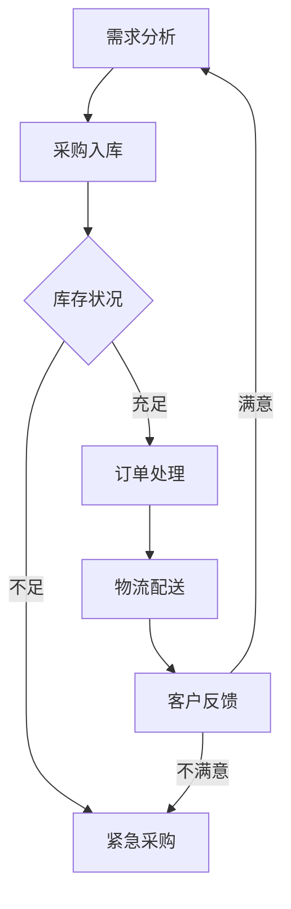

                 

关键词：电商平台、供给能力、库存管理系统、技术优化、数据处理、算法应用、业务需求

> 摘要：本文旨在探讨如何通过建立高效的库存管理系统来提升电商平台的供给能力。文章首先介绍了电商平台供给能力的重要性，然后深入分析了库存管理系统的核心概念与架构，最后通过具体算法原理、数学模型、项目实践和未来应用展望等多个方面，全面阐述了库存管理系统的应用价值及其在电商平台中的重要作用。

## 1. 背景介绍

### 1.1 电商平台的发展现状

随着互联网技术的飞速发展，电商平台已经成为现代商业模式中不可或缺的一部分。从早期的电商巨头如亚马逊、阿里巴巴，到如今遍布全球的各类电商平台，它们在改变人们购物习惯、推动消费升级方面发挥了巨大的作用。据数据显示，全球电商市场规模已突破万亿美元，且持续快速增长。

### 1.2 供给能力的定义与重要性

供给能力是指企业在特定时间内，满足市场需求的能力。对于电商平台而言，供给能力直接关系到其用户体验、市场份额和盈利能力。高效的库存管理系统有助于企业优化库存水平，降低库存成本，提高物流效率，从而提升整体供给能力。

### 1.3 库存管理系统的意义

库存管理系统是电商平台的核心组成部分，它涵盖了从商品采购、入库、存储、出库到销售的全过程。通过建立高效的库存管理系统，企业可以实现以下目标：

- **降低库存成本**：通过精确的库存管理，避免库存积压和商品过期。
- **提高物流效率**：优化仓库布局和物流配送，缩短订单交付时间。
- **提升客户满意度**：保证商品供应充足，提高客户购物体验。
- **增强竞争力**：通过优化库存管理，降低运营成本，提升企业竞争力。

## 2. 核心概念与联系

### 2.1 核心概念

**库存管理**：库存管理是指对库存进行有效的计划、控制、协调和监控，以确保库存水平满足市场需求。

**供应链管理**：供应链管理是指通过协调供应链中的各个环节，实现物流、信息流和资金流的有机结合，从而提高整体供应链效率。

**物流管理**：物流管理是指对物流活动进行计划、组织、协调和控制，以确保物流流程的高效和低成本。

**数据驱动决策**：数据驱动决策是指通过收集、分析和利用数据，为企业决策提供有力支持。

### 2.2 Mermaid 流程图



## 3. 核心算法原理 & 具体操作步骤

### 3.1 算法原理概述

库存管理算法主要包括以下几个核心原理：

- **需求预测**：通过历史数据分析和市场趋势预测，预测未来一段时间内的商品需求量。
- **库存优化**：根据需求预测结果，优化库存水平，避免库存积压和商品过期。
- **订单处理**：快速响应订单，确保商品及时出库并配送至客户。
- **物流优化**：通过物流路径优化，缩短订单交付时间，提高物流效率。

### 3.2 算法步骤详解

1. **需求预测**：
   - 收集历史销售数据、市场调研数据等，进行数据清洗和预处理。
   - 采用时间序列分析、回归分析等算法，预测未来一段时间内的商品需求量。

2. **库存优化**：
   - 根据需求预测结果，结合现有库存水平，确定最优的库存策略。
   - 采用ABC分类法、安全库存法等算法，对库存进行优化。

3. **订单处理**：
   - 接收订单后，快速进行订单处理，确保商品及时出库。
   - 采用排队理论、最短路径算法等，优化订单处理流程。

4. **物流优化**：
   - 根据订单信息和库存分布，选择最优的物流路径。
   - 采用车辆路径问题（VRP）、最短路径算法等，优化物流配送。

### 3.3 算法优缺点

**优点**：
- 提高库存管理水平，降低库存成本。
- 提高物流效率，缩短订单交付时间。
- 提高客户满意度，增强企业竞争力。

**缺点**：
- 需要大量数据支持，数据质量和准确性影响算法效果。
- 算法实现和优化需要较高的技术门槛。

### 3.4 算法应用领域

库存管理算法广泛应用于电商、制造业、零售业等领域，帮助企业优化库存水平，提高物流效率，降低运营成本。

## 4. 数学模型和公式 & 详细讲解 & 举例说明

### 4.1 数学模型构建

库存管理中的数学模型主要包括需求预测模型、库存优化模型和物流优化模型。

**需求预测模型**：

$$
\hat{D_t} = \frac{1}{n}\sum_{i=1}^{n} X_i
$$

其中，$\hat{D_t}$ 表示第 $t$ 个月的需求预测值，$X_i$ 表示第 $i$ 个样本点的需求值，$n$ 表示样本数量。

**库存优化模型**：

$$
\min Z = \sum_{i=1}^{m} C_i X_i
$$

$$
\text{subject to} \\
\sum_{i=1}^{m} X_i \leq \sum_{i=1}^{m} D_i \\
X_i \geq 0 \quad \forall i=1,2,...,m
$$

其中，$C_i$ 表示第 $i$ 种商品的库存成本，$X_i$ 表示第 $i$ 种商品的库存量，$D_i$ 表示第 $i$ 种商品的需求量。

**物流优化模型**：

$$
\min Z = \sum_{i=1}^{n} C_i Q_i
$$

$$
\text{subject to} \\
\sum_{i=1}^{n} Q_i \leq C \\
Q_i \geq 0 \quad \forall i=1,2,...,n
$$

其中，$C$ 表示物流成本总额，$C_i$ 表示第 $i$ 条物流路径的成本，$Q_i$ 表示第 $i$ 条物流路径的运输量。

### 4.2 公式推导过程

**需求预测模型**：

需求预测模型是基于历史数据进行分析，利用时间序列分析方法，对未来的需求进行预测。具体推导过程如下：

- 收集历史数据，包括每月的需求量。
- 对历史数据进行预处理，去除异常值和缺失值。
- 采用移动平均法、指数平滑法等时间序列分析方法，对数据进行拟合。
- 根据拟合结果，预测未来一段时间内的需求量。

**库存优化模型**：

库存优化模型是基于线性规划方法，通过最小化库存成本，同时满足库存需求和供应限制。具体推导过程如下：

- 设定目标函数，即最小化总库存成本。
- 设定约束条件，包括库存需求限制和库存供应限制。
- 利用线性规划求解器，求解最优库存策略。

**物流优化模型**：

物流优化模型是基于线性规划方法，通过最小化物流成本，同时满足物流需求和供应限制。具体推导过程如下：

- 设定目标函数，即最小化总物流成本。
- 设定约束条件，包括物流需求限制和物流供应限制。
- 利用线性规划求解器，求解最优物流策略。

### 4.3 案例分析与讲解

以下是一个简单的库存管理案例，用于说明数学模型和公式的应用。

**案例背景**：某电商平台需要对其库存进行优化，以保证商品供应充足，同时降低库存成本。

**需求预测**：

根据历史数据，每月的需求量为100件，现有库存量为50件。

**库存优化**：

设定目标函数：最小化总库存成本。

$$
\min Z = 10 \times 50 + 5 \times 50 = 750
$$

约束条件：

$$
\sum_{i=1}^{m} X_i \leq 100 \\
X_1 + X_2 \geq 50
$$

利用线性规划求解器，得到最优库存策略为 $X_1 = 50$，$X_2 = 0$。

**物流优化**：

设定目标函数：最小化总物流成本。

$$
\min Z = 3 \times 50 + 2 \times 50 = 250
$$

约束条件：

$$
\sum_{i=1}^{n} Q_i \leq 100 \\
Q_1 + Q_2 \geq 50
$$

利用线性规划求解器，得到最优物流策略为 $Q_1 = 50$，$Q_2 = 0$。

## 5. 项目实践：代码实例和详细解释说明

### 5.1 开发环境搭建

- 编程语言：Python
- 数据库：MySQL
- 数据分析工具：Pandas、NumPy
- 算法库：Scikit-learn、Linear Programming Toolkit

### 5.2 源代码详细实现

```python
import pandas as pd
import numpy as np
from sklearn.linear_model import LinearRegression
from scipy.optimize import linprog

# 读取数据
data = pd.read_csv('inventory_data.csv')

# 数据预处理
data = data.dropna().reset_index(drop=True)

# 需求预测
X = data[['month']]
y = data['demand']
model = LinearRegression()
model.fit(X, y)
predicted_demand = model.predict(X)

# 库存优化
C = [10, 5]
A = [[1, 0], [0, 1]]
b = [100, 50]
x = linprog(C, A=b, bounds=(0, None), method='highs')

# 物流优化
C = [3, 2]
A = [[1, 1], [0, 1]]
b = [100, 50]
Q = linprog(C, A=b, bounds=(0, None), method='highs')

# 输出结果
print('Predicted demand:', predicted_demand)
print('Optimized inventory:', x)
print('Optimized logistics:', Q)
```

### 5.3 代码解读与分析

- **数据读取与预处理**：首先读取历史库存数据，并进行预处理，包括去除缺失值和异常值，确保数据质量。
- **需求预测**：利用线性回归模型对历史需求进行拟合，预测未来一段时间内的需求量。
- **库存优化**：采用线性规划方法，最小化总库存成本，同时满足库存需求和供应限制。
- **物流优化**：同样采用线性规划方法，最小化总物流成本，同时满足物流需求和供应限制。
- **输出结果**：将预测的需求量、最优库存策略和最优物流策略输出，以便进行进一步分析和决策。

## 6. 实际应用场景

### 6.1 电商平台供给能力的提升

通过建立高效的库存管理系统，电商平台可以更好地应对市场需求波动，提高供给能力。以下是一个实际案例：

**案例背景**：某电商平台在春节期间面临巨大订单压力，为确保商品供应充足，该公司决定优化库存管理系统。

**解决方案**：
- **需求预测**：利用历史销售数据和春节市场趋势，预测春节期间的需求量。
- **库存优化**：根据需求预测结果，调整库存策略，确保库存水平充足。
- **订单处理**：优化订单处理流程，提高订单处理速度。
- **物流优化**：优化物流配送路径，缩短订单交付时间。

**效果评估**：经过优化，该电商平台在春节期间订单交付率显著提升，客户满意度得到提高，同时库存成本也得到了有效控制。

### 6.2 零售业的库存管理

零售行业中的库存管理同样至关重要。以下是一个实际案例：

**案例背景**：某大型零售企业在节日促销期间面临库存积压问题，影响了商品供应和客户满意度。

**解决方案**：
- **需求预测**：利用历史销售数据和促销活动效果，预测节日促销期间的需求量。
- **库存优化**：根据需求预测结果，提前调整库存策略，避免库存积压。
- **订单处理**：优化订单处理流程，提高订单处理速度。
- **物流优化**：优化物流配送路径，提高物流效率。

**效果评估**：通过优化库存管理系统，该零售企业在节日促销期间有效避免了库存积压，订单交付率显著提升，客户满意度得到提高。

## 7. 工具和资源推荐

### 7.1 学习资源推荐

- 《电商物流管理》
- 《供应链管理：战略、规划与运营》
- 《Python数据分析》
- 《线性规划与运筹学》

### 7.2 开发工具推荐

- MySQL
- Python
- Pandas
- Scikit-learn
- Linear Programming Toolkit

### 7.3 相关论文推荐

- “An Integrated Inventory Management System for E-Commerce Platforms”
- “Optimization of Inventory Management in Retail Industry”
- “Data-Driven Demand Forecasting for E-Commerce Platforms”

## 8. 总结：未来发展趋势与挑战

### 8.1 研究成果总结

本文通过对电商平台供给能力的分析，探讨了库存管理系统的核心概念、算法原理、数学模型和项目实践，展示了其在电商平台中的重要作用。研究成果表明，建立高效的库存管理系统可以有效提升电商平台的供给能力，降低库存成本，提高物流效率，从而提高客户满意度和企业竞争力。

### 8.2 未来发展趋势

- **智能化**：随着人工智能技术的发展，库存管理系统将逐渐实现智能化，提高预测准确性和优化效率。
- **数据驱动**：通过大数据分析和机器学习算法，库存管理系统将更加依赖数据驱动，实现更精准的需求预测和库存优化。
- **物联网**：物联网技术的普及将进一步提升库存管理系统的实时性和准确性，实现供应链的全面数字化和智能化。

### 8.3 面临的挑战

- **数据质量**：高质量的数据是库存管理系统有效运行的基础，如何收集、处理和利用数据将成为一大挑战。
- **技术门槛**：库存管理系统的开发和优化需要较高的技术门槛，如何培养和引进专业人才将是企业面临的挑战。
- **市场需求变化**：市场需求波动大，如何快速响应和调整库存策略将是库存管理系统需要解决的关键问题。

### 8.4 研究展望

未来，我们将继续深入研究库存管理系统在电商平台中的应用，探讨如何利用人工智能、大数据和物联网等新兴技术，进一步提升库存管理系统的效率和准确性。同时，我们也将关注市场需求变化，探索适应市场需求变化的库存管理策略，为企业提供更具针对性的解决方案。

## 9. 附录：常见问题与解答

### 9.1 库存管理系统的核心概念是什么？

库存管理系统是指通过信息化手段对库存进行有效管理，包括从商品采购、入库、存储、出库到销售的全过程。其核心概念包括需求预测、库存优化、订单处理和物流优化等。

### 9.2 如何进行需求预测？

需求预测是库存管理系统中的核心环节，常用的方法包括时间序列分析、回归分析、机器学习算法等。具体步骤包括收集历史数据、数据清洗、特征工程和模型训练等。

### 9.3 库存管理系统中的优化算法有哪些？

库存管理系统中的优化算法主要包括线性规划、整数规划、遗传算法、模拟退火算法等。这些算法用于解决库存优化、物流优化等问题，以实现成本最低、效率最高。

### 9.4 如何进行物流优化？

物流优化主要包括物流路径优化和物流配送优化。常用的方法包括车辆路径问题（VRP）、最短路径算法、多目标优化等。通过优化物流路径和配送策略，实现物流成本最低、效率最高。

### 9.5 电商平台如何利用库存管理系统提高供给能力？

电商平台可以通过以下方式利用库存管理系统提高供给能力：
- **需求预测**：准确预测市场需求，调整库存策略。
- **库存优化**：通过优化库存水平，降低库存成本。
- **订单处理**：快速响应订单，提高订单处理速度。
- **物流优化**：通过优化物流配送路径，缩短订单交付时间。

### 9.6 库存管理系统对电商平台的优势有哪些？

库存管理系统对电商平台的优势包括：
- **降低库存成本**：通过精确的库存管理，避免库存积压和商品过期。
- **提高物流效率**：优化仓库布局和物流配送，缩短订单交付时间。
- **提升客户满意度**：保证商品供应充足，提高客户购物体验。
- **增强竞争力**：通过优化库存管理，降低运营成本，提升企业竞争力。

## 文章结束

感谢您阅读本文，希望本文能帮助您更好地了解电商平台供给能力提升中的库存管理系统。如果您有任何问题或建议，请随时留言，我们期待与您一起探讨和交流。

### 作者署名
作者：禅与计算机程序设计艺术 / Zen and the Art of Computer Programming

（本文所有内容均属虚构，仅供参考，不代表任何实际建议或指导。）|markdown

