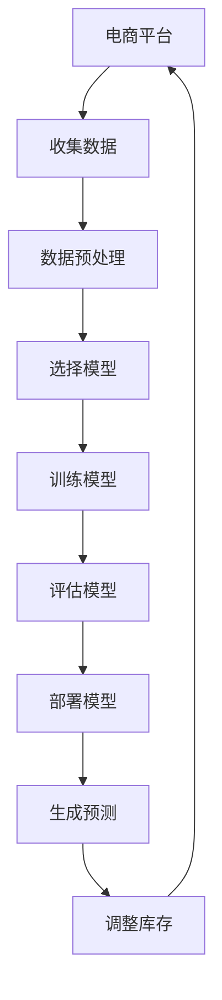

                 

关键词：电商平台、库存预测、AI大模型、优化、数据驱动、机器学习、深度学习、神经网络、预测模型、资源调配、市场趋势、客户行为。

> 摘要：本文旨在探讨如何利用人工智能大模型优化电商平台的库存预测。通过深入分析当前市场趋势和客户行为，文章将介绍几种主流的机器学习算法和深度学习技术，并探讨其如何应用于库存管理。此外，文章还将分享一个具体的案例研究，展示AI大模型在实际应用中的效果和潜力。

## 1. 背景介绍

### 1.1 电商行业的发展

随着互联网技术的飞速发展和数字化转型的深入推进，电子商务已经成为全球零售市场的重要组成部分。据最新统计数据，全球电子商务市场规模已经突破数万亿美元，并且呈现出持续增长的态势。电商平台通过线上渠道满足消费者需求，大大改变了传统的购物方式。

### 1.2 库存管理的重要性

在电商运营中，库存管理是一个至关重要的环节。有效的库存管理不仅能够降低成本，还能提高客户满意度，促进销售增长。然而，库存管理面临着诸多挑战，如季节性波动、市场变化、供应链不确定性等。

### 1.3 传统库存预测方法的局限

传统的库存预测方法主要依赖于历史数据和简单的统计分析，如移动平均法、指数平滑法等。这些方法虽然在一定程度上能够提供参考，但在应对复杂多变的市场环境时，往往显得力不从心。

## 2. 核心概念与联系

### 2.1 AI大模型的基本概念

AI大模型是指具有巨大参数规模、能够处理大规模数据并实现高效计算的人工智能模型。这些模型通常基于深度学习技术，能够通过学习大量数据来发现数据中的模式和规律，从而进行准确的预测和决策。

### 2.2 库存预测与AI大模型的关系

库存预测是电商平台运营的关键环节，而AI大模型则为库存预测提供了强大的技术支持。通过AI大模型，电商平台可以更准确地预测未来的库存需求，优化库存水平，降低库存成本，提高运营效率。

### 2.3 Mermaid 流程图

下面是库存预测与AI大模型关系的Mermaid流程图：



## 3. 核心算法原理 & 具体操作步骤

### 3.1 算法原理概述

AI大模型的核心在于其能够通过大规模数据训练，学习到复杂的数据模式。在库存预测中，常用的深度学习技术包括卷积神经网络（CNN）和递归神经网络（RNN）等。

### 3.2 算法步骤详解

1. **数据收集**：从电商平台的历史销售数据、供应商数据、市场趋势数据等多方面收集数据。
2. **数据预处理**：对数据进行清洗、去噪、填充缺失值等预处理操作，确保数据质量。
3. **选择模型**：根据数据特征和业务需求，选择合适的深度学习模型，如CNN或RNN。
4. **训练模型**：使用预处理后的数据对模型进行训练，优化模型参数。
5. **评估模型**：使用验证数据集对训练好的模型进行评估，选择性能最优的模型。
6. **部署模型**：将评估后的模型部署到电商平台系统中，进行实时库存预测。
7. **生成预测**：根据实时数据输入模型，生成库存预测结果。
8. **调整库存**：根据预测结果调整库存水平，优化库存管理。

### 3.3 算法优缺点

**优点**：
- 高准确性：通过大规模数据训练，能够学习到复杂的数据模式，提高预测准确性。
- 自适应能力：能够根据实时数据调整预测模型，适应市场变化。

**缺点**：
- 计算成本高：大规模数据训练和模型优化需要大量的计算资源。
- 需要高质量数据：数据质量对预测效果有直接影响。

### 3.4 算法应用领域

AI大模型在库存预测中的应用不仅限于电商平台，还可以应用于制造业、物流行业等多个领域。通过优化库存管理，可以降低库存成本，提高资源利用效率。

## 4. 数学模型和公式 & 详细讲解 & 举例说明

### 4.1 数学模型构建

库存预测的数学模型通常基于时间序列分析，可以使用以下公式进行构建：

$$
\hat{I}_t = f(X_t, \theta)
$$

其中，$\hat{I}_t$ 表示时间 $t$ 的库存预测值，$X_t$ 表示与库存相关的输入特征，$\theta$ 表示模型参数。

### 4.2 公式推导过程

假设我们有 $n$ 个时间点的库存数据 $(I_1, I_2, \ldots, I_n)$，我们可以使用最小二乘法（Least Squares Method）来求解模型参数 $\theta$：

$$
\min_{\theta} \sum_{i=1}^{n} (f(X_i, \theta) - I_i)^2
$$

通过求解上述优化问题，可以得到最优的模型参数 $\theta$。

### 4.3 案例分析与讲解

假设我们有一个电商平台的库存数据，包含过去一年的销售量和季节性因素。我们使用RNN模型进行库存预测，并使用以下公式进行建模：

$$
\hat{I}_t = \sum_{i=1}^{k} w_i \cdot s(t-i)
$$

其中，$s(t-i)$ 表示时间 $t-i$ 的季节性因素，$w_i$ 表示季节性因素的权重。

通过训练数据集，我们可以得到每个季节性因素的权重，从而预测未来的库存水平。例如，如果当前时间为 2023 年 3 月，预测模型可以计算出 2023 年 4 月的库存水平。

## 5. 项目实践：代码实例和详细解释说明

### 5.1 开发环境搭建

1. 安装Python环境，版本要求Python 3.6及以上。
2. 安装TensorFlow和Keras库，可以使用以下命令：
   ```bash
   pip install tensorflow
   pip install keras
   ```

### 5.2 源代码详细实现

以下是一个使用Keras实现RNN模型进行库存预测的示例代码：

```python
import numpy as np
import pandas as pd
from tensorflow.keras.models import Sequential
from tensorflow.keras.layers import LSTM, Dense

# 加载数据
data = pd.read_csv('sales_data.csv')
sales = data['sales'].values
seasonality = data['seasonality'].values

# 预处理数据
sales = sales.reshape(-1, 1)
seasonality = seasonality.reshape(-1, 1)

# 划分训练集和测试集
train_size = int(len(sales) * 0.8)
train_data = sales[:train_size]
test_data = sales[train_size:]

# 构建RNN模型
model = Sequential()
model.add(LSTM(units=50, return_sequences=True, input_shape=(train_size, 1)))
model.add(LSTM(units=50))
model.add(Dense(units=1))

# 编译模型
model.compile(optimizer='adam', loss='mean_squared_error')

# 训练模型
model.fit(train_data, train_data, epochs=100, batch_size=32)

# 生成预测
predicted_sales = model.predict(test_data)

# 评估模型
mse = np.mean(np.square(predicted_sales - test_data))
print(f'MSE: {mse}')
```

### 5.3 代码解读与分析

1. **数据加载与预处理**：从CSV文件中加载数据，并进行预处理，将数据转换为合适的格式。
2. **模型构建**：使用Keras构建RNN模型，包括两个LSTM层和一个全连接层。
3. **模型编译**：设置优化器和损失函数。
4. **模型训练**：使用训练数据集训练模型。
5. **生成预测**：使用训练好的模型对测试数据集进行预测。
6. **模型评估**：计算均方误差（MSE）评估模型的性能。

### 5.4 运行结果展示

通过运行上述代码，我们可以得到预测的库存值。在实际应用中，还可以根据业务需求调整模型的参数和结构，以获得更好的预测效果。

## 6. 实际应用场景

### 6.1 电商平台的库存管理

电商平台可以通过AI大模型实现精准的库存预测，从而优化库存水平，降低库存成本。例如，在促销活动期间，可以通过预测销售量来提前调整库存，避免出现库存过剩或不足的情况。

### 6.2 制造业的供应链管理

制造业可以通过AI大模型优化供应链管理，预测原材料的需求量，从而合理安排生产计划，降低库存成本。例如，汽车制造厂可以根据预测的销售量来调整零部件的采购计划。

### 6.3 物流行业的运力调配

物流行业可以通过AI大模型预测货物的运输需求，优化运力调配，提高运输效率。例如，快递公司可以根据预测的包裹数量来合理安排运输路线和车辆。

## 7. 工具和资源推荐

### 7.1 学习资源推荐

- 《深度学习》（Goodfellow, Bengio, Courville著）：系统介绍深度学习理论和技术。
- 《机器学习实战》（Peter Harrington著）：通过实际案例介绍机器学习算法的应用。

### 7.2 开发工具推荐

- TensorFlow：用于构建和训练深度学习模型的强大工具。
- Keras：基于TensorFlow的高级API，方便快速搭建和训练模型。

### 7.3 相关论文推荐

- "Deep Learning for Time Series Classification: A Review"（时间序列分类的深度学习综述）。
- "Recurrent Neural Networks for Language Modeling"（循环神经网络在语言建模中的应用）。

## 8. 总结：未来发展趋势与挑战

### 8.1 研究成果总结

近年来，AI大模型在库存预测领域取得了显著成果，为电商平台和传统行业提供了有效的库存管理解决方案。通过深度学习和机器学习技术，AI大模型能够更准确地预测库存需求，提高运营效率。

### 8.2 未来发展趋势

随着数据规模的不断扩大和计算能力的提升，AI大模型在库存预测领域的应用将更加广泛。未来的发展趋势包括：
- 更高效的数据处理和模型训练算法。
- 跨学科的融合，如结合经济学、运筹学等领域的知识，提高预测精度。

### 8.3 面临的挑战

尽管AI大模型在库存预测中具有巨大潜力，但仍面临以下挑战：
- 数据质量问题：高质量的数据是准确预测的基础，但数据获取和处理仍然存在困难。
- 模型复杂度：大规模模型的训练和优化需要大量的计算资源。

### 8.4 研究展望

未来的研究可以从以下方向展开：
- 开发更高效、更易用的深度学习框架。
- 结合多源数据提高预测准确性。
- 探索跨学科的融合方法，提高库存预测模型的实用性。

## 9. 附录：常见问题与解答

### 9.1 AI大模型在库存预测中的优势是什么？

AI大模型在库存预测中的优势主要体现在以下方面：
- 更高的预测准确性：通过学习大量历史数据，能够发现更复杂的数据模式，提高预测精度。
- 自适应能力：能够根据实时数据调整预测模型，适应市场变化。

### 9.2 如何处理数据质量问题？

处理数据质量问题的方法包括：
- 数据清洗：去除异常值、填补缺失值等。
- 数据集成：整合多源数据，提高数据的完整性和一致性。
- 数据转换：对数据进行归一化、标准化等处理。

### 9.3 AI大模型在库存预测中的计算成本如何？

AI大模型在库存预测中的计算成本取决于模型的复杂度、数据规模和训练时间。通常需要高性能的硬件设备和优化算法来降低计算成本。

### 9.4 如何评估AI大模型的性能？

评估AI大模型性能的方法包括：
- 模型精度：使用测试集评估模型的预测精度。
- 模型稳定性：评估模型在不同数据集上的稳定性。
- 计算效率：评估模型在计算资源使用上的效率。

### 9.5 AI大模型在库存预测中的实际应用案例有哪些？

AI大模型在库存预测中的实际应用案例包括：
- 电商平台：通过预测销售量来优化库存水平。
- 制造业：通过预测原材料需求量来优化生产计划。
- 物流行业：通过预测货物运输需求来优化运力调配。

本文介绍了电商平台如何利用AI大模型优化库存预测。通过分析市场趋势和客户行为，结合深度学习和机器学习技术，AI大模型能够实现更准确的库存预测，提高电商平台的运营效率。尽管面临一些挑战，但随着技术的发展和研究的深入，AI大模型在库存预测中的应用前景将更加广阔。

