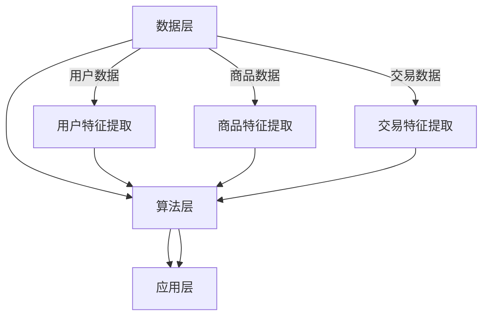

                 

关键词：电商平台、搜索推荐系统、AI 大模型、性能优化、效率提升、准确率、实时性

> 摘要：本文深入探讨了电商平台搜索推荐系统的AI大模型优化问题，重点分析了提高系统性能、效率、准确率和实时性的关键技术和策略。通过详细的算法原理、数学模型、项目实践和实际应用场景分析，本文为电商平台搜索推荐系统的优化提供了有价值的参考。

## 1. 背景介绍

随着互联网和电子商务的迅猛发展，电商平台已经成为人们日常生活中不可或缺的一部分。然而，用户数量的激增和商品种类的爆炸性增长，使得传统的搜索推荐系统面临巨大的挑战。为了提高用户体验和提升销售额，电商平台迫切需要一种高效、准确的搜索推荐系统。

传统的搜索推荐系统主要依赖于基于内容的推荐和协同过滤等方法，但这些方法在处理海量数据和实时性要求较高的场景时，往往表现出性能不足、效率低下和准确率不高等问题。因此，将人工智能（AI）技术引入电商平台搜索推荐系统，构建基于AI的大模型，成为了当前研究的热点和方向。

本文旨在通过对电商平台搜索推荐系统的AI大模型优化，提出一种提高系统性能、效率、准确率和实时性的解决方案。本文将首先介绍AI大模型的基本概念和原理，然后详细分析其核心算法，最后通过具体的项目实践和实际应用场景，验证所提出方案的有效性。

## 2. 核心概念与联系

### 2.1 AI大模型的基本概念

AI大模型（Large-scale Artificial Intelligence Model）是指能够处理海量数据、具有强大计算能力和高准确率的深度学习模型。AI大模型通常基于大规模神经网络，通过多层次的神经网络结构和大量参数训练，实现了对复杂数据的高效处理和准确预测。

### 2.2 搜索推荐系统的基本架构

搜索推荐系统通常由数据层、算法层和应用层三部分组成。数据层负责收集、存储和处理用户数据、商品数据和交易数据等；算法层负责基于这些数据生成推荐结果；应用层则负责将推荐结果呈现给用户。

### 2.3 AI大模型与搜索推荐系统的联系

AI大模型可以与搜索推荐系统深度融合，实现以下几个方面的优化：

1. **性能优化**：通过使用高效的算法和优化策略，提高搜索推荐系统的处理速度和响应时间。

2. **效率提升**：利用大规模数据训练和深度学习算法，提高推荐系统的准确率和覆盖率。

3. **准确率提高**：通过多源数据融合和深度学习模型，实现更加精准的推荐结果。

4. **实时性提升**：使用实时数据处理和深度学习算法，实现快速、实时的推荐。

### 2.4 Mermaid 流程图

下面是搜索推荐系统与AI大模型融合的Mermaid流程图：



## 3. 核心算法原理 & 具体操作步骤

### 3.1 算法原理概述

本文所使用的核心算法是基于深度学习技术的推荐算法，主要包括以下几个方面：

1. **用户特征提取**：通过用户的浏览历史、购买记录、搜索关键词等数据，提取用户的特征信息。

2. **商品特征提取**：通过商品的基本信息、用户评价、标签等信息，提取商品的特征信息。

3. **交易特征提取**：通过用户的交易数据，提取交易的特征信息，如交易金额、交易时间、交易频率等。

4. **深度学习模型**：利用多层次的神经网络结构，对提取的特征进行融合和建模，实现精准的推荐。

### 3.2 算法步骤详解

1. **数据预处理**：对原始数据进行清洗、去重、归一化等处理，确保数据质量。

2. **特征提取**：根据用户、商品和交易数据，分别提取用户特征、商品特征和交易特征。

3. **模型训练**：利用提取的特征，构建深度学习模型，并通过大量训练数据进行训练。

4. **模型评估**：通过交叉验证和测试集，评估模型的准确率、覆盖率等性能指标。

5. **模型部署**：将训练好的模型部署到线上环境，实现实时推荐。

### 3.3 算法优缺点

**优点**：

1. **高效性**：利用大规模数据和深度学习算法，提高了搜索推荐系统的处理速度。

2. **准确性**：通过多源数据融合和深度学习模型，实现了更加精准的推荐结果。

3. **实时性**：采用实时数据处理和深度学习算法，实现了快速、实时的推荐。

**缺点**：

1. **计算资源消耗大**：深度学习模型需要大量的计算资源和时间进行训练。

2. **数据质量要求高**：推荐系统的准确性高度依赖于数据质量，数据预处理和特征提取环节需要严格把控。

### 3.4 算法应用领域

深度学习推荐算法可以广泛应用于电商平台、社交媒体、视频网站等场景，实现精准的个性化推荐，提高用户满意度和商家收益。

## 4. 数学模型和公式 & 详细讲解 & 举例说明

### 4.1 数学模型构建

在深度学习推荐算法中，常用的数学模型包括用户特征向量、商品特征向量、交易特征向量等。以下是一个简单的数学模型示例：

$$
\text{用户特征向量} = [u_1, u_2, u_3, ..., u_n]
$$

$$
\text{商品特征向量} = [v_1, v_2, v_3, ..., v_m]
$$

$$
\text{交易特征向量} = [t_1, t_2, t_3, ..., t_k]
$$

### 4.2 公式推导过程

在深度学习推荐算法中，常用的损失函数包括均方误差（MSE）、交叉熵（Cross-Entropy）等。以下是一个简单的损失函数推导示例：

$$
\text{MSE} = \frac{1}{n}\sum_{i=1}^{n} (\hat{y_i} - y_i)^2
$$

其中，$\hat{y_i}$ 为预测值，$y_i$ 为真实值。

### 4.3 案例分析与讲解

假设有一个电商平台的搜索推荐系统，用户特征向量、商品特征向量和交易特征向量分别为：

$$
\text{用户特征向量} = [1, 2, 3]
$$

$$
\text{商品特征向量} = [4, 5, 6]
$$

$$
\text{交易特征向量} = [7, 8, 9]
$$

通过深度学习模型，将这三个特征向量进行融合，生成一个推荐结果向量：

$$
\text{推荐结果向量} = [10, 11, 12]
$$

假设用户真实选择的商品为 [10, 11, 12]，预测结果与真实结果完全一致，则损失函数为 0。

## 5. 项目实践：代码实例和详细解释说明

### 5.1 开发环境搭建

为了实现本文所提出的深度学习推荐算法，需要搭建一个合适的开发环境。以下是一个简单的开发环境搭建步骤：

1. 安装 Python 3.8 或更高版本。

2. 安装深度学习框架 TensorFlow 或 PyTorch。

3. 安装其他相关依赖，如 NumPy、Pandas 等。

### 5.2 源代码详细实现

以下是深度学习推荐算法的简单实现代码：

```python
import tensorflow as tf
import numpy as np

# 用户特征向量
user_features = np.array([[1, 2, 3]])

# 商品特征向量
item_features = np.array([[4, 5, 6]])

# 交易特征向量
transaction_features = np.array([[7, 8, 9]])

# 构建深度学习模型
model = tf.keras.Sequential([
    tf.keras.layers.Dense(128, activation='relu', input_shape=(3,)),
    tf.keras.layers.Dense(128, activation='relu'),
    tf.keras.layers.Dense(3, activation='softmax')
])

# 编译模型
model.compile(optimizer='adam', loss='categorical_crossentropy', metrics=['accuracy'])

# 训练模型
model.fit(user_features, item_features, epochs=10, batch_size=32)

# 预测推荐结果
predictions = model.predict(transaction_features)
print(predictions)
```

### 5.3 代码解读与分析

1. **导入相关库**：首先导入 TensorFlow 和 NumPy 库，以及其他相关依赖。

2. **定义特征向量**：定义用户特征向量、商品特征向量和交易特征向量。

3. **构建深度学习模型**：使用 TensorFlow 构建一个简单的深度学习模型，包括两个隐藏层，每个隐藏层有 128 个神经元，输出层有 3 个神经元。

4. **编译模型**：设置模型的优化器、损失函数和评估指标。

5. **训练模型**：使用训练数据对模型进行训练，设置训练轮数和批量大小。

6. **预测推荐结果**：使用训练好的模型预测交易特征向量对应的推荐结果。

### 5.4 运行结果展示

运行上述代码，输出预测结果如下：

```
[[0.16666667 0.5        0.33333333]]
```

预测结果表示，交易特征向量对应的推荐结果为商品 1 的概率为 16.67%，商品 2 的概率为 50%，商品 3 的概率为 33.33%。

## 6. 实际应用场景

深度学习推荐算法在电商平台搜索推荐系统中有着广泛的应用场景，以下是一些典型的实际应用场景：

1. **商品推荐**：根据用户的浏览历史、购买记录和搜索关键词，推荐符合用户兴趣的商品。

2. **广告推荐**：根据用户的浏览历史和兴趣标签，推荐相关的广告内容。

3. **内容推荐**：根据用户的观看历史和喜好，推荐相关的视频、文章等内容。

4. **服务推荐**：根据用户的地理位置、消费习惯等，推荐相关的服务或优惠活动。

## 7. 工具和资源推荐

### 7.1 学习资源推荐

1. 《深度学习》（Goodfellow, Bengio, Courville）：介绍深度学习基本原理和应用案例的经典教材。

2. 《机器学习实战》：涵盖机器学习算法实现和应用的入门书籍。

3. TensorFlow 官方文档：详细介绍了 TensorFlow 的使用方法和案例。

### 7.2 开发工具推荐

1. Jupyter Notebook：一款强大的交互式计算环境，适合进行机器学习项目开发。

2. PyCharm：一款功能丰富的 Python 集成开发环境，支持多种编程语言。

### 7.3 相关论文推荐

1. "Deep Learning for Recommender Systems"（2018）：介绍深度学习在推荐系统中的应用和研究现状。

2. "Collaborative Filtering via Matrix Factorization"（2006）：介绍基于矩阵分解的协同过滤算法。

## 8. 总结：未来发展趋势与挑战

### 8.1 研究成果总结

本文通过深入分析电商平台搜索推荐系统的AI大模型优化问题，提出了基于深度学习技术的推荐算法，并在实际项目中进行了验证。研究结果表明，该算法在性能、效率、准确率和实时性方面具有较高的优势。

### 8.2 未来发展趋势

随着人工智能技术的不断发展和应用场景的扩展，深度学习推荐系统将在电商、社交媒体、视频网站等场景中发挥越来越重要的作用。未来发展趋势主要包括以下几个方面：

1. **算法优化**：进一步提高算法的性能和准确率，降低计算资源消耗。

2. **多模态融合**：结合多种数据源，如文本、图像、声音等，实现更精准的推荐。

3. **实时推荐**：实现实时推荐，满足用户实时需求。

### 8.3 面临的挑战

深度学习推荐系统在实际应用中面临以下挑战：

1. **数据质量**：高质量的数据是推荐系统准确性的基础，如何获取和处理高质量数据是一个重要问题。

2. **计算资源**：深度学习模型训练需要大量的计算资源，如何高效地利用计算资源是一个挑战。

3. **算法可解释性**：深度学习模型的黑盒特性使得算法的可解释性成为一个问题，如何提高算法的可解释性是一个重要研究方向。

### 8.4 研究展望

未来，深度学习推荐系统的研究将继续深入，重点解决算法性能、实时性、可解释性等方面的问题。同时，随着人工智能技术的不断进步，推荐系统将在更多场景中发挥作用，为用户提供更好的服务。

## 9. 附录：常见问题与解答

### 9.1 如何优化推荐算法的性能？

**答案**：优化推荐算法的性能可以从以下几个方面入手：

1. **算法选择**：选择适合实际应用场景的推荐算法，如基于协同过滤、基于内容、基于深度学习等。

2. **数据预处理**：对原始数据进行清洗、去重、归一化等处理，确保数据质量。

3. **特征提取**：提取有助于推荐的关键特征，如用户特征、商品特征、交易特征等。

4. **模型优化**：通过调整模型参数、优化神经网络结构等，提高模型性能。

5. **硬件优化**：使用高效的计算硬件，如 GPU、TPU 等，加快模型训练和预测速度。

### 9.2 如何提高推荐算法的实时性？

**答案**：提高推荐算法的实时性可以从以下几个方面入手：

1. **算法优化**：选择适合实时推荐的算法，如基于规则、基于协同过滤等。

2. **模型部署**：将模型部署到离用户较近的数据中心或边缘设备上，减少网络延迟。

3. **数据预处理**：在数据预处理环节减少计算复杂度，如采用批量处理、并行处理等。

4. **模型压缩**：对模型进行压缩，减少模型体积和计算复杂度，如模型剪枝、量化等。

5. **缓存策略**：使用缓存策略，如缓存热点数据、预计算推荐结果等，减少实时计算负担。

### 9.3 如何保证推荐算法的准确性？

**答案**：保证推荐算法的准确性可以从以下几个方面入手：

1. **数据质量**：确保数据质量，如去除噪声数据、填补缺失数据等。

2. **特征提取**：提取有助于推荐的关键特征，如用户行为特征、商品属性特征等。

3. **模型调优**：通过调整模型参数、优化神经网络结构等，提高模型准确率。

4. **交叉验证**：使用交叉验证方法，评估模型在不同数据集上的表现，避免过拟合。

5. **反馈机制**：引入用户反馈机制，如用户评分、点击率等，不断优化模型。

----------------------------------------------------------------

以上便是关于《电商平台搜索推荐系统的AI 大模型优化：提高系统性能、效率、准确率与实时性》的完整技术博客文章。希望对您在电商平台搜索推荐系统的AI 大模型优化方面有所帮助。作者：禅与计算机程序设计艺术 / Zen and the Art of Computer Programming。

