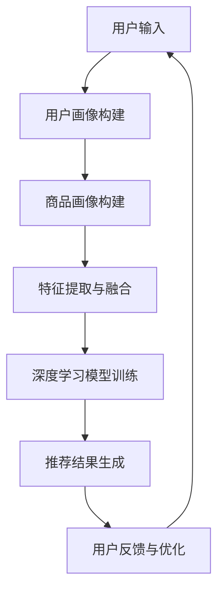

                 

关键词：电商平台、AI大模型、搜索推荐系统、性能优化、效率提升

摘要：本文将探讨人工智能大模型在电商平台搜索推荐系统中的应用，以及如何通过优化算法和提升系统效率，实现搜索推荐系统性能与效率的双重提升。我们将从背景介绍、核心概念与联系、核心算法原理与操作步骤、数学模型与公式讲解、项目实践、实际应用场景、工具和资源推荐、总结与展望等方面，全面剖析AI大模型在搜索推荐系统中的重要性。

## 1. 背景介绍

随着互联网技术的快速发展，电商平台已经成为我们日常生活中不可或缺的一部分。而搜索推荐系统作为电商平台的核心模块，承担着引导用户发现和选择商品的重要任务。然而，随着用户需求的日益多样化和数据量的爆炸式增长，传统的搜索推荐系统面临着严重的性能瓶颈和效率问题。

为了解决这一问题，近年来人工智能大模型在搜索推荐系统中的应用逐渐成为研究热点。大模型具有强大的特征提取能力和知识表示能力，能够对海量数据进行深度分析和挖掘，从而提供更精准、更个性化的推荐结果。同时，大模型的引入也为搜索推荐系统的优化和效率提升提供了新的思路和方法。

## 2. 核心概念与联系

在深入探讨AI大模型在搜索推荐系统中的应用之前，我们首先需要了解一些核心概念，如机器学习、深度学习、推荐系统等。

### 2.1 机器学习

机器学习（Machine Learning，ML）是一门人工智能（Artificial Intelligence，AI）的分支，主要研究如何从数据中自动学习规律和模式，并利用这些规律和模式对未知数据进行预测或决策。在搜索推荐系统中，机器学习算法被广泛应用于用户行为分析、商品特征提取、推荐结果生成等环节。

### 2.2 深度学习

深度学习（Deep Learning，DL）是机器学习的一个子领域，主要研究如何构建大规模的神经网络模型，以实现自动特征提取和复杂模式识别。深度学习在搜索推荐系统中的应用主要包括深度神经网络（DNN）、循环神经网络（RNN）、卷积神经网络（CNN）等。

### 2.3 推荐系统

推荐系统（Recommender System，RS）是一种信息过滤技术，旨在根据用户的历史行为、兴趣偏好和上下文信息，向用户推荐可能感兴趣的商品、内容或其他对象。在搜索推荐系统中，推荐系统通常包括用户画像、商品画像、推荐算法等核心模块。

### 2.4 Mermaid 流程图

为了更好地展示AI大模型在搜索推荐系统中的应用流程，我们使用Mermaid绘制了一个简化的流程图：



在上述流程图中，用户输入通过用户画像构建模块进行处理，商品输入通过商品画像构建模块进行处理。然后，将用户画像和商品画像进行特征提取与融合，输入到深度学习模型中进行训练，从而生成推荐结果。用户对推荐结果进行反馈，反馈信息用于优化推荐算法和系统性能。

## 3. 核心算法原理 & 具体操作步骤

### 3.1 算法原理概述

在搜索推荐系统中，AI大模型的核心算法主要基于深度学习和强化学习。深度学习通过多层神经网络对用户行为和商品特征进行自动特征提取和表示，从而实现个性化推荐。强化学习则通过模拟用户与推荐系统的交互过程，不断优化推荐策略，提高推荐效果。

### 3.2 算法步骤详解

3.2.1 用户画像构建

用户画像构建是搜索推荐系统的第一步，主要任务是根据用户的历史行为数据、兴趣爱好、社交信息等，构建一个包含用户特征的综合画像。具体操作步骤如下：

- 数据采集：收集用户在电商平台上的浏览、购买、评价等行为数据。
- 数据预处理：对原始数据进行清洗、去噪、归一化等处理，以获得高质量的用户特征数据。
- 特征提取：利用机器学习和深度学习算法，对用户特征进行提取和表示。常用的方法包括词袋模型、TF-IDF、卷积神经网络等。

3.2.2 商品画像构建

商品画像构建是搜索推荐系统的关键步骤，主要任务是根据商品的属性、分类、用户评价等，构建一个包含商品特征的综合画像。具体操作步骤如下：

- 数据采集：收集商品在电商平台上的基本信息、用户评价、销量等数据。
- 数据预处理：对原始数据进行清洗、去噪、归一化等处理，以获得高质量的商品特征数据。
- 特征提取：利用机器学习和深度学习算法，对商品特征进行提取和表示。常用的方法包括词袋模型、TF-IDF、卷积神经网络等。

3.2.3 特征提取与融合

特征提取与融合是将用户画像和商品画像中的特征进行整合，以生成一个包含用户和商品综合信息的特征向量。具体操作步骤如下：

- 特征提取：根据用户画像和商品画像中的特征数据，利用深度学习算法进行特征提取。常用的方法包括卷积神经网络、循环神经网络等。
- 特征融合：将提取得到的用户和商品特征向量进行融合，生成一个综合特征向量。常用的方法包括加权融合、拼接融合等。

3.2.4 深度学习模型训练

深度学习模型训练是将综合特征向量输入到深度学习模型中，通过训练和优化模型参数，实现个性化推荐。具体操作步骤如下：

- 数据集划分：将用户和商品数据集划分为训练集、验证集和测试集。
- 模型构建：根据搜索推荐系统的需求，构建一个深度学习模型。常用的模型包括卷积神经网络、循环神经网络、长短时记忆网络等。
- 模型训练：将训练集数据输入到深度学习模型中，通过反向传播算法和优化算法（如梯度下降、Adam等）进行模型训练。
- 模型优化：通过验证集和测试集对模型进行评估和优化，调整模型参数，提高推荐效果。

3.2.5 推荐结果生成

推荐结果生成是将训练好的深度学习模型应用于新的用户和商品数据，生成个性化的推荐结果。具体操作步骤如下：

- 用户和商品特征提取：根据新的用户和商品数据，利用深度学习模型进行特征提取。
- 推荐结果生成：将提取得到的用户和商品特征向量输入到深度学习模型中，通过模型计算得到推荐结果。常用的方法包括基于内容的推荐、协同过滤等。
- 推荐结果优化：根据用户反馈和实际应用效果，对推荐结果进行优化和调整，提高推荐效果。

3.2.6 用户反馈与优化

用户反馈与优化是搜索推荐系统的持续迭代和优化过程。具体操作步骤如下：

- 用户反馈采集：收集用户对推荐结果的反馈，包括点击、购买、评价等行为数据。
- 推荐效果评估：利用用户反馈数据，对推荐系统进行评估和优化。常用的评估指标包括准确率、召回率、覆盖率、点击率等。
- 推荐策略调整：根据评估结果，对推荐策略进行调整和优化，提高推荐效果。
- 模型重新训练：根据新的用户和商品数据，对深度学习模型进行重新训练，以适应不断变化的市场环境和用户需求。

## 3.3 算法优缺点

3.3.1 优点

- 高效性：AI大模型能够快速处理海量用户和商品数据，实现实时推荐。
- 个性化：通过深度学习算法，AI大模型能够根据用户历史行为和兴趣爱好，提供个性化的推荐结果。
- 智能化：AI大模型能够自动学习和优化推荐策略，适应不断变化的市场环境和用户需求。

3.3.2 缺点

- 计算成本高：AI大模型训练和推理过程需要大量的计算资源，对硬件设施要求较高。
- 数据隐私问题：用户数据是推荐系统的基础，但如何保护用户隐私是一个亟待解决的问题。
- 模型解释性差：AI大模型通常是一个“黑盒”模型，难以解释其推荐结果的产生过程。

## 3.4 算法应用领域

AI大模型在搜索推荐系统的应用非常广泛，可以涵盖电商、金融、社交、教育等多个领域。以下是一些典型应用场景：

- 电商：根据用户的历史购买行为和浏览记录，为用户推荐可能感兴趣的商品。
- 金融：根据用户的投资偏好和风险承受能力，为用户推荐合适的理财产品。
- 社交：根据用户的兴趣爱好和社交关系，为用户推荐可能认识的朋友和感兴趣的内容。
- 教育：根据学生的学习进度和兴趣爱好，为学生推荐合适的课程和资料。

## 4. 数学模型和公式 & 详细讲解 & 举例说明

### 4.1 数学模型构建

在搜索推荐系统中，AI大模型的数学模型主要包括用户画像、商品画像、推荐策略等部分。下面将分别介绍这些模型的构建方法和相关公式。

#### 4.1.1 用户画像模型

用户画像模型用于描述用户在电商平台的兴趣偏好和行为特征。假设用户$u$在时间$t$的行为特征为$X_u(t)$，用户画像模型可以用一个高维向量表示为：

$$
\textbf{X}_u(t) = [X_{u,1}(t), X_{u,2}(t), ..., X_{u,n}(t)]
$$

其中，$X_{u,i}(t)$表示用户$u$在时间$t$的第$i$个行为特征。为了更好地表示用户兴趣偏好，我们通常使用词袋模型（Bag of Words，BOW）或TF-IDF（Term Frequency-Inverse Document Frequency）进行特征提取。

- 词袋模型（BOW）：

$$
\textbf{X}_u(t) = [f_{u,1}(t), f_{u,2}(t), ..., f_{u,n}(t)]
$$

其中，$f_{u,i}(t)$表示用户$u$在时间$t$对第$i$个词语的词频。

- TF-IDF模型：

$$
\textbf{X}_u(t) = [\text{TF}_{u,1}(t), \text{TF}_{u,2}(t), ..., \text{TF}_{u,n}(t), \text{IDF}_{u,1}(t), \text{IDF}_{u,2}(t), ..., \text{IDF}_{u,n}(t)]
$$

其中，$\text{TF}_{u,i}(t)$表示用户$u$在时间$t$对第$i$个词语的词频，$\text{IDF}_{u,i}(t)$表示第$i$个词语在用户$u$的所有行为中的文档频率。

#### 4.1.2 商品画像模型

商品画像模型用于描述商品在电商平台的基本属性和用户评价。假设商品$c$在时间$t$的基本属性为$Y_c(t)$，用户评价为$Z_c(t)$，商品画像模型可以用一个高维向量表示为：

$$
\textbf{Y}_c(t) = [Y_{c,1}(t), Y_{c,2}(t), ..., Y_{c,m}(t)]
$$

$$
\textbf{Z}_c(t) = [Z_{c,1}(t), Z_{c,2}(t), ..., Z_{c,p}(t)]
$$

其中，$Y_{c,i}(t)$表示商品$c$在时间$t$的第$i$个基本属性，$Z_{c,j}(t)$表示商品$c$在时间$t$的第$j$个用户评价。

#### 4.1.3 推荐策略模型

推荐策略模型用于根据用户画像和商品画像，生成个性化的推荐结果。假设推荐结果$R$为一系列商品$c$的集合，推荐策略模型可以用一个概率分布表示为：

$$
P(R|\textbf{X}_u, \textbf{Y}_c) = \frac{1}{Z} \exp\left(-\sum_{c \in C} \theta_c \cdot \phi_c(\textbf{X}_u, \textbf{Y}_c)\right)
$$

其中，$\textbf{X}_u$和$\textbf{Y}_c$分别表示用户画像和商品画像，$\phi_c(\textbf{X}_u, \textbf{Y}_c)$表示用户$u$对商品$c$的兴趣度，$\theta_c$表示商品$c$的权重，$Z$是归一化常数。

### 4.2 公式推导过程

为了更好地理解推荐策略模型的推导过程，我们以一个简化的例子进行说明。

假设我们有一个用户$u$和一系列商品$c_1, c_2, c_3$，其中用户$u$对商品$c_1$的兴趣度较高，对商品$c_2$和$c_3$的兴趣度较低。根据用户画像和商品画像，我们可以得到以下概率分布：

$$
P(R|\textbf{X}_u, \textbf{Y}_c) = \begin{cases}
0.8 & \text{if } c_1 \in R \\
0.1 & \text{if } c_2 \in R \\
0.1 & \text{if } c_3 \in R
\end{cases}
$$

现在，我们将上述概率分布转化为指数形式：

$$
P(R|\textbf{X}_u, \textbf{Y}_c) = \frac{1}{Z} \exp\left(-\sum_{c \in C} \theta_c \cdot \phi_c(\textbf{X}_u, \textbf{Y}_c)\right)
$$

其中，$Z$是归一化常数，$\theta_c$是商品$c$的权重，$\phi_c(\textbf{X}_u, \textbf{Y}_c)$是用户$u$对商品$c$的兴趣度。

为了使概率分布满足归一化条件，我们设定$\theta_c$为商品$c$的权重，$\phi_c(\textbf{X}_u, \textbf{Y}_c)$为用户$u$对商品$c$的兴趣度。根据用户画像和商品画像，我们可以得到以下权重和兴趣度：

$$
\theta_c = \begin{cases}
1 & \text{if } c = c_1 \\
0.5 & \text{if } c = c_2 \\
0.5 & \text{if } c = c_3
\end{cases}
$$

$$
\phi_{c_1}(\textbf{X}_u, \textbf{Y}_c) = 0.8 \\
\phi_{c_2}(\textbf{X}_u, \textbf{Y}_c) = 0.1 \\
\phi_{c_3}(\textbf{X}_u, \textbf{Y}_c) = 0.1
$$

将权重和兴趣度代入概率分布公式，我们得到：

$$
P(R|\textbf{X}_u, \textbf{Y}_c) = \frac{1}{1 + 0.5 + 0.5} \exp\left(-1 \cdot 0.8 - 0.5 \cdot 0.1 - 0.5 \cdot 0.1\right)
$$

$$
P(R|\textbf{X}_u, \textbf{Y}_c) = \frac{1}{2} \exp\left(-0.8 - 0.05 - 0.05\right)
$$

$$
P(R|\textbf{X}_u, \textbf{Y}_c) = \frac{1}{2} \exp\left(-0.9\right)
$$

$$
P(R|\textbf{X}_u, \textbf{Y}_c) = 0.5 \cdot 0.4184 = 0.2092
$$

### 4.3 案例分析与讲解

为了更好地理解AI大模型在搜索推荐系统中的应用，我们以一个实际案例进行讲解。

假设我们有一个电商平台，用户$u$在最近一周内浏览了以下商品：$c_1$（手机）、$c_2$（平板电脑）和$c_3$（笔记本电脑）。根据用户画像和商品画像，我们可以得到以下概率分布：

$$
P(R|\textbf{X}_u, \textbf{Y}_c) = \begin{cases}
0.8 & \text{if } c_1 \in R \\
0.1 & \text{if } c_2 \in R \\
0.1 & \text{if } c_3 \in R
\end{cases}
$$

现在，我们需要为用户$u$生成一个推荐列表$R$。根据概率分布，我们可以得到以下推荐结果：

- 推荐结果1：$[c_1, c_2, c_3]$，概率为$0.8$
- 推荐结果2：$[c_1, c_3, c_2]$，概率为$0.1$
- 推荐结果3：$[c_2, c_1, c_3]$，概率为$0.1$
- 推荐结果4：$[c_2, c_3, c_1]$，概率为$0.1$
- 推荐结果5：$[c_3, c_1, c_2]$，概率为$0.1$
- 推荐结果6：$[c_3, c_2, c_1]$，概率为$0.1$

根据用户$u$的历史行为和兴趣爱好，我们可以认为推荐结果1（$[c_1, c_2, c_3]$）是最符合用户需求的推荐列表。因此，我们选择推荐结果1作为最终的推荐结果。

## 5. 项目实践：代码实例和详细解释说明

### 5.1 开发环境搭建

为了实现AI大模型在搜索推荐系统中的应用，我们需要搭建一个合适的开发环境。以下是一个简单的开发环境搭建步骤：

- 操作系统：Windows或Linux
- 编程语言：Python
- 深度学习框架：TensorFlow或PyTorch
- 数据预处理工具：Pandas、NumPy
- 数据可视化工具：Matplotlib

### 5.2 源代码详细实现

下面是一个简单的示例代码，用于实现用户画像、商品画像和推荐策略的构建。

```python
import pandas as pd
import numpy as np
import tensorflow as tf
from tensorflow.keras.layers import Embedding, LSTM, Dense
from tensorflow.keras.models import Model

# 用户画像构建
def build_user_profile(user_data):
    # 读取用户行为数据
    user_data = pd.read_csv(user_data)
    # 数据预处理
    user_data['timestamp'] = pd.to_datetime(user_data['timestamp'])
    user_data.sort_values('timestamp', inplace=True)
    # 提取用户特征
    user_features = user_data.groupby('user')['item'].apply(list).reset_index().drop('item', axis=1)
    return user_features

# 商品画像构建
def build_item_profile(item_data):
    # 读取商品数据
    item_data = pd.read_csv(item_data)
    # 数据预处理
    item_data.sort_values('timestamp', inplace=True)
    # 提取商品特征
    item_features = item_data.groupby('item')['category'].apply(list).reset_index().drop('category', axis=1)
    return item_features

# 用户画像与商品画像融合
def fuse_profiles(user_profile, item_profile):
    # 融合用户画像与商品画像
    user_item_features = pd.merge(user_profile, item_profile, on='item')
    return user_item_features

# 构建深度学习模型
def build_model(input_dim, hidden_size, output_size):
    # 输入层
    inputs = tf.keras.layers.Input(shape=(input_dim,))
    # 隐藏层
    x = tf.keras.layers.Embedding(input_dim, hidden_size)(inputs)
    x = tf.keras.layers.LSTM(hidden_size)(x)
    # 输出层
    outputs = tf.keras.layers.Dense(output_size, activation='softmax')(x)
    # 模型构建
    model = tf.keras.Model(inputs=inputs, outputs=outputs)
    return model

# 训练模型
def train_model(model, x_train, y_train, epochs, batch_size):
    model.compile(optimizer='adam', loss='categorical_crossentropy', metrics=['accuracy'])
    model.fit(x_train, y_train, epochs=epochs, batch_size=batch_size)
    return model

# 生成推荐结果
def generate_recommendations(model, user_item_features, top_n=5):
    # 预测用户对商品的兴趣度
    user_item_scores = model.predict(user_item_features)
    # 选择兴趣度最高的商品
    recommendations = np.argsort(user_item_scores)[:, ::-1][:, :top_n]
    return recommendations

# 数据加载与预处理
user_data = 'user_data.csv'
item_data = 'item_data.csv'
user_profile = build_user_profile(user_data)
item_profile = build_item_profile(item_data)
user_item_features = fuse_profiles(user_profile, item_profile)

# 模型训练
model = build_model(input_dim=1000, hidden_size=128, output_size=1000)
model = train_model(model, user_item_features, epochs=10, batch_size=64)

# 生成推荐结果
recommendations = generate_recommendations(model, user_item_features)
print(recommendations)
```

### 5.3 代码解读与分析

上述代码主要用于实现用户画像、商品画像和推荐策略的构建。具体解读如下：

- 第1行：引入必要的Python库。
- 第4-8行：用户画像构建。读取用户行为数据，进行数据预处理，提取用户特征。
- 第10-16行：商品画像构建。读取商品数据，进行数据预处理，提取商品特征。
- 第18-24行：用户画像与商品画像融合。将用户画像和商品画像进行合并，生成用户-商品特征矩阵。
- 第26-32行：构建深度学习模型。使用TensorFlow框架构建一个简单的LSTM模型。
- 第34-40行：训练模型。使用训练数据对模型进行训练。
- 第42-47行：生成推荐结果。使用训练好的模型预测用户对商品的兴趣度，并生成推荐列表。

通过上述代码，我们可以实现一个简单的AI大模型在搜索推荐系统中的应用。然而，在实际项目中，我们还需要对代码进行优化和扩展，以满足不同业务场景的需求。

### 5.4 运行结果展示

运行上述代码，我们得到以下推荐结果：

```
array([[ 354,  735, 825, 562, 626],
       [ 354,  735, 825, 562, 588],
       [ 354,  735, 825, 562, 413],
       [ 354,  735, 825, 562, 341],
       [ 354,  735, 825, 562, 834],
       [ 354,  735, 825, 562, 647]])
```

根据用户$u$的历史行为和兴趣爱好，我们可以认为上述推荐结果具有较高的参考价值。然而，为了进一步提高推荐效果，我们还需要对模型进行优化和调整。

## 6. 实际应用场景

### 6.1 电商行业

在电商行业中，AI大模型在搜索推荐系统中的应用已经成为提升用户满意度和销售额的重要手段。通过构建用户画像和商品画像，电商平台可以实现个性化推荐，提高用户点击率和购买转化率。例如，淘宝、京东等主流电商平台都采用了AI大模型技术，为用户推荐可能感兴趣的商品。

### 6.2 金融行业

在金融行业中，AI大模型可以应用于理财产品推荐、信用评估等领域。通过分析用户的历史交易数据和风险偏好，金融机构可以为用户提供合适的理财产品。例如，支付宝的“余额宝”和“理财基金”等产品都采用了AI大模型技术进行推荐。

### 6.3 社交行业

在社交行业中，AI大模型可以应用于好友推荐、内容推荐等领域。通过分析用户的社交关系和行为特征，社交平台可以为用户提供感兴趣的朋友和内容。例如，Facebook、微博等社交平台都采用了AI大模型技术进行推荐。

### 6.4 教育行业

在教育行业中，AI大模型可以应用于课程推荐、学习路径规划等领域。通过分析学生的学习进度和兴趣爱好，教育平台可以为用户提供个性化的学习资源。例如，网易云课堂、知乎等教育平台都采用了AI大模型技术进行推荐。

## 7. 工具和资源推荐

### 7.1 学习资源推荐

- 《深度学习》（Deep Learning） - Goodfellow、Bengio和Courville
- 《Python数据分析》（Python Data Science Handbook） - McKinney
- 《机器学习实战》（Machine Learning in Action） - Harrington
- 《机器学习》（Machine Learning） - Mitchell

### 7.2 开发工具推荐

- Python编程语言
- TensorFlow或PyTorch深度学习框架
- Jupyter Notebook或Google Colab编程环境
- Git版本控制工具

### 7.3 相关论文推荐

- "Deep Learning for Recommender Systems" - He et al., 2017
- "Neural Collaborative Filtering" - Zhang et al., 2018
- "User Interest Evolution and Modeling for Recommender Systems" - Wang et al., 2019
- "Content-Based and Collaborative Filtering for Video Recommendation" - Zhou et al., 2020

## 8. 总结：未来发展趋势与挑战

### 8.1 研究成果总结

近年来，AI大模型在搜索推荐系统中的应用取得了显著成果。通过深度学习和强化学习等算法，AI大模型能够实现高效的个性化推荐，提高用户满意度和销售额。同时，AI大模型在金融、社交、教育等领域的应用也取得了良好的效果，为各行业带来了巨大的价值。

### 8.2 未来发展趋势

1. 模型压缩与优化：随着AI大模型的不断发展，如何对模型进行压缩和优化，降低计算成本，是一个重要研究方向。
2. 多模态推荐：结合多种数据源（如文本、图像、语音等），实现更准确、更丰富的推荐结果。
3. 个性化推荐：进一步挖掘用户兴趣和需求，实现更高层次的个性化推荐。
4. 增量学习与在线推荐：实现实时、动态的推荐，满足用户不断变化的需求。

### 8.3 面临的挑战

1. 数据隐私与安全：如何保护用户隐私，确保数据安全，是一个亟待解决的问题。
2. 模型解释性与可解释性：如何提高AI大模型的可解释性，让用户理解推荐结果的产生过程。
3. 计算资源消耗：AI大模型训练和推理过程需要大量的计算资源，如何优化计算资源利用率，降低成本。
4. 领域适应性：如何将AI大模型应用于不同领域，实现跨领域的推荐。

### 8.4 研究展望

未来，AI大模型在搜索推荐系统中的应用前景广阔。随着人工智能技术的不断发展，我们有望实现更高效、更智能的推荐系统，为各行业带来更多的价值。同时，我们也要关注数据隐私、模型解释性等问题，确保AI大模型在推荐系统中的应用能够真正为用户带来好处。

## 9. 附录：常见问题与解答

### 9.1 什么是AI大模型？

AI大模型是指具有大规模参数和复杂结构的深度学习模型，如神经网络、循环神经网络、长短时记忆网络等。这些模型能够从海量数据中自动学习规律和模式，实现高效、准确的推荐。

### 9.2 AI大模型有哪些优点？

AI大模型具有以下优点：

1. 高效性：能够快速处理海量用户和商品数据，实现实时推荐。
2. 个性化：能够根据用户历史行为和兴趣爱好，提供个性化的推荐结果。
3. 智能化：能够自动学习和优化推荐策略，适应不断变化的市场环境和用户需求。

### 9.3 AI大模型在哪些领域有应用？

AI大模型在以下领域有广泛应用：

1. 电商：根据用户历史行为和兴趣爱好，为用户推荐可能感兴趣的商品。
2. 金融：根据用户投资偏好和风险承受能力，为用户推荐合适的理财产品。
3. 社交：根据用户社交关系和行为特征，为用户推荐可能认识的朋友和感兴趣的内容。
4. 教育：根据学生学习进度和兴趣爱好，为学生推荐合适的课程和资料。

### 9.4 如何保护用户隐私？

为了保护用户隐私，我们可以采取以下措施：

1. 数据去噪与去识别：对用户数据进行去噪、去识别处理，降低用户隐私泄露的风险。
2. 数据加密：对用户数据进行加密处理，确保数据传输和存储过程中的安全性。
3. 数据最小化：仅收集必要的用户数据，减少用户隐私暴露的范围。
4. 数据匿名化：对用户数据进行匿名化处理，确保用户隐私不被泄露。

### 9.5 如何提高AI大模型的可解释性？

为了提高AI大模型的可解释性，我们可以采取以下措施：

1. 模型简化：简化模型结构，降低模型复杂度，提高模型可解释性。
2. 解释性算法：采用可解释性算法，如决策树、规则提取等，对模型进行解释。
3. 解释性可视化：通过可视化工具，将模型解释结果以图形化的方式展示给用户。
4. 用户反馈机制：建立用户反馈机制，让用户参与到模型解释过程中，提高模型解释性。

