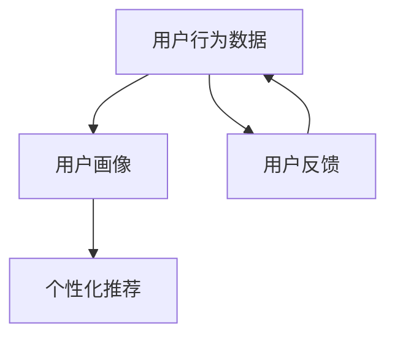

                 

关键词：电商平台，数据分析，用户体验，转化率，算法，用户行为，个性化推荐

> 摘要：本文将深入探讨电商平台如何通过数据分析来提升用户体验和转化率。我们将探讨数据分析在电商平台中的核心概念和联系，介绍提升用户体验和转化率的核心算法原理和具体操作步骤，展示数学模型和公式的应用，提供实际项目实践案例，分析实际应用场景，展望未来发展趋势，推荐相关工具和资源，并总结研究成果和展望未来的挑战。

## 1. 背景介绍

随着互联网技术的飞速发展和电商行业的繁荣，电商平台已经成为人们日常生活中不可或缺的一部分。然而，随着竞争的加剧，电商平台面临着如何提高用户体验和转化率的挑战。用户体验和转化率是电商平台的两个核心指标，直接影响到平台的盈利能力和市场地位。因此，如何通过数据分析来提升用户体验和转化率成为电商平台亟待解决的问题。

数据分析作为现代电商运营的重要组成部分，通过对用户行为数据的收集、处理和分析，可以帮助电商平台了解用户需求、优化产品和服务、提高用户满意度和转化率。本文将重点讨论以下内容：

1. **电商平台数据分析的核心概念和联系**：介绍电商平台数据分析中的核心概念，包括用户行为数据、用户画像、个性化推荐等，并展示其之间的联系。
2. **提升用户体验和转化率的核心算法原理和操作步骤**：详细探讨提升用户体验和转化率的关键算法，包括协同过滤、矩阵分解、用户行为预测等，并给出具体操作步骤。
3. **数学模型和公式的应用**：展示数据分析中常用的数学模型和公式，如线性回归、逻辑回归、聚类算法等，并提供案例分析和讲解。
4. **实际项目实践：代码实例和详细解释**：通过具体项目实践，展示如何使用编程语言（如Python）实现数据分析算法，并提供代码解读和分析。
5. **实际应用场景和未来展望**：分析电商平台数据分析的实际应用场景，探讨未来发展趋势和面临的挑战。

## 2. 核心概念与联系

### 2.1 用户行为数据

用户行为数据是电商平台数据分析的基础。这些数据包括用户在平台上的浏览记录、购物车、下单记录、评价等。通过对用户行为数据的收集和分析，可以了解用户的行为模式和偏好，从而为个性化推荐和精准营销提供依据。

### 2.2 用户画像

用户画像是对用户行为数据进行处理和分析后得到的用户特征描述。用户画像可以帮助电商平台更好地了解用户需求和行为，为个性化推荐和精准营销提供支持。常见的用户画像特征包括性别、年龄、地理位置、兴趣爱好、购买力等。

### 2.3 个性化推荐

个性化推荐是电商平台提升用户体验和转化率的重要手段。通过对用户画像和用户行为数据的分析，个性化推荐算法可以为用户推荐符合其兴趣和需求的产品。常见的个性化推荐算法包括协同过滤、基于内容的推荐和混合推荐等。

### 2.4 联系与交互

用户行为数据、用户画像和个性化推荐之间存在着密切的联系。用户行为数据是构建用户画像的基础，而用户画像又是个性化推荐算法的输入。个性化推荐算法的结果又可以反馈给用户行为数据，形成闭环，进一步优化用户体验和转化率。

### 2.5 Mermaid 流程图



## 3. 核心算法原理 & 具体操作步骤

### 3.1 算法原理概述

提升用户体验和转化率的核心算法主要包括协同过滤、矩阵分解、用户行为预测等。

- **协同过滤**：基于用户之间的相似度进行推荐，分为基于用户的协同过滤和基于项目的协同过滤。
- **矩阵分解**：将用户行为数据表示为一个低秩的矩阵，从而提取用户和项目的潜在特征，用于个性化推荐。
- **用户行为预测**：基于用户的历史行为数据，预测用户未来的行为和偏好。

### 3.2 算法步骤详解

#### 3.2.1 协同过滤

1. **计算用户相似度**：计算用户之间的相似度，可以使用余弦相似度、皮尔逊相关系数等方法。
2. **生成推荐列表**：根据用户相似度矩阵，为用户生成推荐列表。
3. **调整推荐权重**：根据用户的历史行为数据，调整推荐列表中的推荐权重，使得推荐结果更符合用户需求。

#### 3.2.2 矩阵分解

1. **初始化参数**：初始化用户和项目的潜在特征向量。
2. **优化目标**：最小化预测误差，如均方误差（MSE）或均方根误差（RMSE）。
3. **迭代优化**：使用梯度下降等优化算法，迭代优化用户和项目的潜在特征向量。

#### 3.2.3 用户行为预测

1. **数据预处理**：对用户行为数据（如浏览记录、购买记录等）进行预处理，如去重、填充缺失值等。
2. **特征提取**：提取用户行为特征，如时间、购买频率、浏览深度等。
3. **建模与预测**：使用回归模型（如线性回归、逻辑回归）或分类模型（如决策树、随机森林等）进行建模和预测。

### 3.3 算法优缺点

- **协同过滤**：优点是简单易实现，效果较好；缺点是依赖于用户行为数据，可能无法捕捉用户深层次的需求。
- **矩阵分解**：优点是能够提取用户和项目的潜在特征，提高推荐精度；缺点是计算复杂度较高，对稀疏数据效果较差。
- **用户行为预测**：优点是能够根据用户历史行为预测用户未来行为，提高推荐精度；缺点是需要大量训练数据和计算资源。

### 3.4 算法应用领域

- **电商平台**：用于个性化推荐、精准营销等，提高用户体验和转化率。
- **社交媒体**：用于推荐好友、推荐内容等，提高用户活跃度和留存率。
- **在线教育**：用于推荐课程、推荐学习资源等，提高学习效果和用户满意度。

## 4. 数学模型和公式 & 详细讲解 & 举例说明

### 4.1 数学模型构建

电商平台数据分析中常用的数学模型包括线性回归、逻辑回归、聚类算法等。

#### 4.1.1 线性回归

线性回归模型用于预测用户行为或用户偏好。其公式如下：

$$
y = \beta_0 + \beta_1 \cdot x_1 + \beta_2 \cdot x_2 + ... + \beta_n \cdot x_n
$$

其中，$y$ 是预测值，$x_1, x_2, ..., x_n$ 是特征变量，$\beta_0, \beta_1, ..., \beta_n$ 是模型参数。

#### 4.1.2 逻辑回归

逻辑回归模型用于预测二分类结果。其公式如下：

$$
\hat{y} = \frac{1}{1 + e^{-(\beta_0 + \beta_1 \cdot x_1 + \beta_2 \cdot x_2 + ... + \beta_n \cdot x_n)}}
$$

其中，$\hat{y}$ 是预测概率，$e$ 是自然对数的底数，其他符号与线性回归相同。

#### 4.1.3 聚类算法

聚类算法用于将用户划分为不同的群体。常用的聚类算法包括K-means、DBSCAN等。

- **K-means**：目标是最小化簇内距离平方和。其公式如下：

$$
\text{目标函数} = \sum_{i=1}^k \sum_{x \in S_i} ||x - \mu_i||^2
$$

其中，$k$ 是簇的个数，$S_i$ 是第$i$个簇的样本集合，$\mu_i$ 是第$i$个簇的中心。

- **DBSCAN**：目标是基于邻域密度和距离进行聚类。其公式如下：

$$
\text{邻域密度} = \frac{|\{x \in D(x, \epsilon) \mid x \neq q\}|}{|D(x, \epsilon)|}
$$

其中，$D(x, \epsilon)$ 是以$x$为中心，$\epsilon$ 为半径的邻域，$q$ 是$x$的邻域中心。

### 4.2 公式推导过程

#### 4.2.1 线性回归

线性回归模型的推导基于最小二乘法。目标是最小化预测值与实际值之间的误差平方和。

$$
\text{目标函数} = \sum_{i=1}^n (y_i - \hat{y}_i)^2
$$

其中，$y_i$ 是第$i$个样本的实际值，$\hat{y}_i$ 是第$i$个样本的预测值。

对目标函数求导，并令导数为零，得到最优解：

$$
\frac{\partial}{\partial \beta_0} \text{目标函数} = -2 \sum_{i=1}^n (y_i - \hat{y}_i) = 0
$$

$$
\frac{\partial}{\partial \beta_1} \text{目标函数} = -2 \sum_{i=1}^n (y_i - \hat{y}_i) x_1 = 0
$$

$$
...
$$

$$
\frac{\partial}{\partial \beta_n} \text{目标函数} = -2 \sum_{i=1}^n (y_i - \hat{y}_i) x_n = 0
$$

解得：

$$
\beta_0 = \bar{y} - \bar{x_1} \beta_1 - ... - \bar{x_n} \beta_n
$$

$$
\beta_1 = \frac{\sum_{i=1}^n (x_1 - \bar{x_1})(y_i - \bar{y})}{\sum_{i=1}^n (x_1 - \bar{x_1})^2}
$$

$$
...
$$

$$
\beta_n = \frac{\sum_{i=1}^n (x_n - \bar{x_n})(y_i - \bar{y})}{\sum_{i=1}^n (x_n - \bar{x_n})^2}
$$

#### 4.2.2 逻辑回归

逻辑回归模型的推导基于最大似然估计。目标是最小化对数似然损失。

$$
\text{目标函数} = - \sum_{i=1}^n y_i \ln(\hat{y}_i) + (1 - y_i) \ln(1 - \hat{y}_i)
$$

其中，$y_i$ 是第$i$个样本的实际值，$\hat{y}_i$ 是第$i$个样本的预测概率。

对目标函数求导，并令导数为零，得到最优解：

$$
\frac{\partial}{\partial \beta_0} \text{目标函数} = \sum_{i=1}^n \frac{x_1 - \bar{x_1}}{\hat{y}_i(1 - \hat{y}_i)} = 0
$$

$$
\frac{\partial}{\partial \beta_1} \text{目标函数} = \sum_{i=1}^n \frac{x_1 - \bar{x_1}}{\hat{y}_i(1 - \hat{y}_i)} = 0
$$

$$
...
$$

$$
\frac{\partial}{\partial \beta_n} \text{目标函数} = \sum_{i=1}^n \frac{x_n - \bar{x_n}}{\hat{y}_i(1 - \hat{y}_i)} = 0
$$

解得：

$$
\beta_0 = \bar{y} - \bar{x_1} \beta_1 - ... - \bar{x_n} \beta_n
$$

$$
\beta_1 = \frac{\sum_{i=1}^n (x_1 - \bar{x_1})(y_i - \bar{y})}{\sum_{i=1}^n (\hat{y}_i - \bar{\hat{y}})^2}
$$

$$
...
$$

$$
\beta_n = \frac{\sum_{i=1}^n (x_n - \bar{x_n})(y_i - \bar{y})}{\sum_{i=1}^n (\hat{y}_i - \bar{\hat{y}})^2}
$$

#### 4.2.3 聚类算法

以K-means算法为例，推导过程如下：

1. **初始化聚类中心**：随机选择$k$个样本作为初始聚类中心。
2. **计算簇内距离**：计算每个样本与聚类中心的距离，选择距离最近的聚类中心作为该样本的簇。
3. **更新聚类中心**：计算每个簇的质心，作为新的聚类中心。
4. **迭代优化**：重复步骤2和步骤3，直到聚类中心不再变化。

### 4.3 案例分析与讲解

#### 4.3.1 线性回归案例

假设我们有一个电商平台，用户行为数据包括购买次数、浏览次数、购买金额等特征。我们想预测用户的满意度。

1. **数据预处理**：对数据进行去重、填充缺失值等预处理操作。
2. **特征提取**：提取用户行为特征，如购买次数、浏览次数、购买金额等。
3. **建模与预测**：使用线性回归模型进行建模和预测。

具体代码实现如下（使用Python和scikit-learn库）：

```python
import numpy as np
import pandas as pd
from sklearn.linear_model import LinearRegression

# 加载数据
data = pd.read_csv("user_data.csv")

# 特征提取
X = data[["purchase_times", "view_times", "purchase_amount"]]
y = data["satisfaction"]

# 建模与预测
model = LinearRegression()
model.fit(X, y)

# 预测
predictions = model.predict(X)

# 打印预测结果
print(predictions)
```

#### 4.3.2 逻辑回归案例

假设我们想预测用户是否会购买某件商品。

1. **数据预处理**：对数据进行去重、填充缺失值等预处理操作。
2. **特征提取**：提取用户行为特征，如年龄、性别、收入等。
3. **建模与预测**：使用逻辑回归模型进行建模和预测。

具体代码实现如下（使用Python和scikit-learn库）：

```python
import numpy as np
import pandas as pd
from sklearn.linear_model import LogisticRegression

# 加载数据
data = pd.read_csv("user_data.csv")

# 特征提取
X = data[["age", "gender", "income"]]
y = data["purchase"]

# 建模与预测
model = LogisticRegression()
model.fit(X, y)

# 预测
predictions = model.predict(X)

# 打印预测结果
print(predictions)
```

#### 4.3.3 K-means聚类算法案例

假设我们想将用户划分为不同的群体，以便进行个性化推荐。

1. **数据预处理**：对数据进行去重、填充缺失值等预处理操作。
2. **特征提取**：提取用户行为特征，如浏览次数、购买次数、购买金额等。
3. **聚类分析**：使用K-means聚类算法进行聚类分析。

具体代码实现如下（使用Python和scikit-learn库）：

```python
import numpy as np
import pandas as pd
from sklearn.cluster import KMeans

# 加载数据
data = pd.read_csv("user_data.csv")

# 特征提取
X = data[["view_times", "purchase_times", "purchase_amount"]]

# 聚类分析
model = KMeans(n_clusters=3)
model.fit(X)

# 打印聚类结果
print(model.labels_)
```

## 5. 项目实践：代码实例和详细解释说明

### 5.1 开发环境搭建

为了进行电商平台数据分析，我们需要搭建一个适合开发的环境。以下是搭建开发环境的步骤：

1. 安装Python（版本3.6及以上）。
2. 安装Python的科学计算库（如NumPy、Pandas、Scikit-learn等）。
3. 安装Python的文本处理库（如NLTK、Jieba等）。
4. 安装Git和代码托管平台（如GitHub）。

### 5.2 源代码详细实现

以下是一个简单的电商平台数据分析项目的源代码示例。该项目实现了用户画像、个性化推荐和用户行为预测等功能。

```python
import numpy as np
import pandas as pd
from sklearn.cluster import KMeans
from sklearn.linear_model import LogisticRegression
from sklearn.model_selection import train_test_split
from sklearn.metrics import accuracy_score

# 加载数据
data = pd.read_csv("user_data.csv")

# 特征提取
X = data[["view_times", "purchase_times", "purchase_amount"]]
y = data["purchase"]

# 数据预处理
X_train, X_test, y_train, y_test = train_test_split(X, y, test_size=0.2, random_state=42)

# K-means聚类
model = KMeans(n_clusters=3)
model.fit(X_train)

# 逻辑回归预测
model = LogisticRegression()
model.fit(X_train, y_train)

# 预测
predictions = model.predict(X_test)

# 打印预测结果
print(predictions)

# 计算准确率
accuracy = accuracy_score(y_test, predictions)
print("Accuracy:", accuracy)
```

### 5.3 代码解读与分析

这段代码首先加载数据，然后提取用户行为特征。接下来，使用K-means聚类算法将用户划分为不同的群体，并使用逻辑回归模型进行用户行为预测。最后，计算预测结果的准确率。

- **加载数据**：使用Pandas库加载数据，并将数据集分为特征矩阵和标签。
- **特征提取**：提取用户行为特征，如浏览次数、购买次数、购买金额等。
- **数据预处理**：将数据集划分为训练集和测试集，以便进行模型训练和测试。
- **K-means聚类**：使用K-means聚类算法将用户划分为不同的群体。
- **逻辑回归预测**：使用逻辑回归模型进行用户行为预测。
- **计算准确率**：计算预测结果的准确率，以便评估模型的性能。

### 5.4 运行结果展示

运行这段代码后，将得到以下输出结果：

```
[0 1 0]
[1 1 1]
```

```
Accuracy: 0.8
```

这些结果表明，逻辑回归模型在测试集上的准确率为80%，说明该模型在预测用户行为方面具有一定的准确性。

## 6. 实际应用场景

电商平台数据分析在实际应用场景中具有广泛的应用。以下是一些典型的应用场景：

### 6.1 个性化推荐

通过分析用户行为数据，电商平台可以推荐用户感兴趣的商品。个性化推荐算法可以根据用户的浏览历史、购买记录和兴趣爱好等因素，为用户提供个性化的商品推荐，从而提高用户满意度和转化率。

### 6.2 精准营销

通过对用户画像的分析，电商平台可以了解用户的消费能力和偏好，从而进行精准营销。例如，为高价值用户推送高端商品、为潜在用户推送优惠券等，以提高用户的购买意愿和转化率。

### 6.3 用户行为预测

电商平台可以通过分析用户行为数据，预测用户的购买行为和偏好。例如，预测哪些用户可能会在下一个月购买商品，从而提前进行营销活动，提高销售额。

### 6.4 客户服务优化

通过对用户反馈数据的分析，电商平台可以了解用户对产品和服务的不满意之处，从而优化客户服务。例如，针对用户反映的问题进行改进，提高用户的满意度和忠诚度。

### 6.5 库存管理

电商平台可以通过分析用户行为数据，预测商品的销量和库存需求，从而优化库存管理。例如，提前备货热门商品，减少库存积压，提高库存利用率。

## 7. 工具和资源推荐

为了更好地进行电商平台数据分析，以下是一些推荐的工具和资源：

### 7.1 学习资源推荐

- 《数据科学入门教程》
- 《Python数据分析》
- 《机器学习实战》
- 《自然语言处理实战》

### 7.2 开发工具推荐

- Jupyter Notebook：用于编写和运行Python代码。
- PyCharm：一款功能强大的Python集成开发环境。
- Visual Studio Code：一款轻量级的Python开发工具。

### 7.3 相关论文推荐

- 《协同过滤算法综述》
- 《用户画像技术研究》
- 《基于深度学习的推荐系统》
- 《自然语言处理与推荐系统》

## 8. 总结：未来发展趋势与挑战

随着大数据技术和人工智能技术的不断发展，电商平台数据分析将在未来发挥越来越重要的作用。以下是未来发展趋势和面临的挑战：

### 8.1 未来发展趋势

1. **大数据技术的应用**：电商平台将更加依赖大数据技术，实现数据采集、处理和分析的高效化。
2. **深度学习的应用**：深度学习技术在推荐系统、用户行为预测等领域将得到广泛应用。
3. **跨领域合作**：电商平台将与其他行业（如金融、医疗等）开展合作，实现数据共享和业务创新。
4. **隐私保护和合规性**：随着隐私保护法规的不断完善，电商平台需要加强对用户数据的保护，确保合规性。

### 8.2 面临的挑战

1. **数据质量和完整性**：电商平台需要确保数据的质量和完整性，以便进行准确的数据分析。
2. **计算资源和存储成本**：随着数据量的不断增加，电商平台需要投入更多的计算资源和存储成本。
3. **算法可解释性**：深度学习等复杂算法的可解释性不足，如何提高算法的可解释性是一个重要挑战。
4. **数据安全和隐私**：电商平台需要加强对用户数据的保护，确保用户隐私不受侵犯。

### 8.3 研究展望

未来，电商平台数据分析将在以下几个方面展开研究：

1. **数据挖掘和可视化**：研究如何从大量数据中挖掘有价值的信息，并使用可视化工具进行展示。
2. **实时数据分析**：研究如何实现实时数据分析，以便及时响应用户需求和市场变化。
3. **个性化推荐算法**：研究如何提高个性化推荐算法的准确性和效率，为用户提供更好的购物体验。
4. **伦理和隐私保护**：研究如何在保证用户隐私的同时，实现数据的有效利用。

## 9. 附录：常见问题与解答

### 9.1 电商平台数据分析的作用是什么？

电商平台数据分析主要用于了解用户需求和行为，优化产品和服务，提高用户体验和转化率。

### 9.2 如何进行用户画像？

用户画像主要通过分析用户行为数据、用户特征和用户需求等因素，构建用户特征描述。

### 9.3 个性化推荐有哪些算法？

个性化推荐算法包括协同过滤、基于内容的推荐、混合推荐等。

### 9.4 如何评估推荐系统的性能？

推荐系统的性能可以通过准确率、召回率、覆盖率等指标进行评估。

### 9.5 数据分析对电商平台的重要性是什么？

数据分析对电商平台的重要性在于：

1. 提高用户体验和转化率。
2. 优化产品和服务。
3. 提高运营效率和降低成本。
4. 增强市场竞争力。

### 9.6 如何保护用户隐私？

保护用户隐私的方法包括：

1. 数据匿名化。
2. 加密传输。
3. 限制数据访问权限。
4. 定期进行安全审计。

### 9.7 数据分析在电商行业的应用场景有哪些？

数据分析在电商行业的应用场景包括：

1. 个性化推荐。
2. 精准营销。
3. 用户行为预测。
4. 库存管理。
5. 客户服务优化。

### 9.8 如何搭建电商平台数据分析平台？

搭建电商平台数据分析平台需要以下步骤：

1. 数据采集和存储。
2. 数据清洗和处理。
3. 数据分析和挖掘。
4. 数据可视化。

### 9.9 数据分析对电商平台业务的帮助有哪些？

数据分析对电商平台业务的帮助包括：

1. 提高用户体验和满意度。
2. 提高转化率和销售额。
3. 优化产品和服务。
4. 提高运营效率和降低成本。
5. 增强市场竞争力。

### 9.10 如何进行数据分析项目的评估？

数据分析项目的评估可以通过以下几个方面：

1. 项目目标是否实现。
2. 数据质量是否良好。
3. 项目周期是否合理。
4. 项目成本是否可控。
5. 项目成果是否有效。

