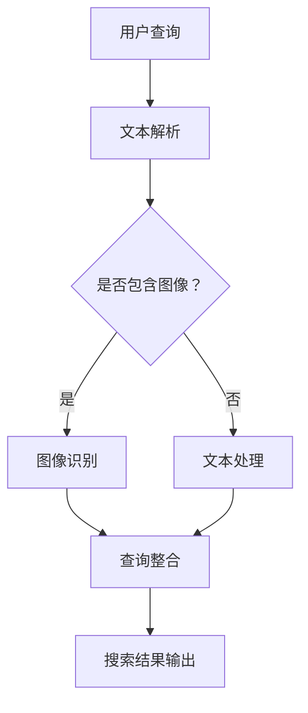

                 

关键词：电商搜索，多模态查询，图像识别，自然语言处理，人工智能，搜索引擎优化，用户体验

摘要：随着互联网和电子商务的迅猛发展，电商搜索已经成为消费者购买决策的重要环节。多模态查询处理技术通过整合文本和图像信息，提升搜索结果的准确性和用户体验。本文将深入探讨电商搜索中的多模态查询处理技术，包括核心概念、算法原理、数学模型、实践案例以及未来展望。

## 1. 背景介绍

### 1.1 电商搜索的重要性

电商搜索是电子商务平台的核心功能之一，它直接影响到消费者的购物体验和平台的销售额。高效的搜索系统能够帮助消费者快速找到所需商品，提高购买转化率。随着电子商务的不断发展，搜索系统面临的挑战也日益增加，其中包括商品信息的多样性、用户查询需求的复杂性以及搜索结果的准确性。

### 1.2 多模态查询的必要性

传统的电商搜索主要基于文本查询，即用户通过输入关键词来搜索商品。然而，这种方式存在一定的局限性，例如用户可能无法准确表达自己的需求，或者搜索结果存在偏差。多模态查询处理技术通过整合文本和图像信息，能够更准确地理解用户的查询意图，提供更加精准的搜索结果。例如，用户不仅可以输入关键词，还可以上传图片，系统可以根据图像识别技术找到与图片相关的商品。

## 2. 核心概念与联系

### 2.1 多模态查询处理

多模态查询处理是指将多种类型的输入数据（如文本、图像、语音等）进行整合，以实现更准确的信息检索和查询响应。在电商搜索中，多模态查询处理技术主要用于将用户的文本查询和图像查询结合起来，提供更丰富的搜索结果。

### 2.2 图像识别

图像识别技术是计算机视觉领域的一个重要分支，通过图像处理、模式识别和机器学习等方法，使计算机能够识别和分类图像。在多模态查询处理中，图像识别技术用于识别用户上传的图片，找到与之相关的商品。

### 2.3 自然语言处理

自然语言处理（NLP）是人工智能领域的一个重要分支，旨在使计算机理解和处理自然语言。在多模态查询处理中，NLP技术用于理解用户的文本查询，提取关键词和语义信息，与图像识别结果进行整合。

### 2.4 Mermaid 流程图

以下是一个多模态查询处理技术的Mermaid流程图：



## 3. 核心算法原理 & 具体操作步骤

### 3.1 算法原理概述

多模态查询处理技术主要包括图像识别和自然语言处理两个核心算法。图像识别算法用于识别用户上传的图片，提取关键特征，并与商品数据库进行匹配。自然语言处理算法用于理解用户的文本查询，提取关键词和语义信息，与图像识别结果进行整合，生成最终的搜索结果。

### 3.2 算法步骤详解

1. **文本解析**：用户输入查询文本，系统对其进行解析，提取关键词和语义信息。
2. **图像识别**：用户上传图片，系统使用图像识别算法识别图片内容，提取关键特征。
3. **查询整合**：将文本查询和图像识别结果进行整合，生成一个综合查询。
4. **搜索结果输出**：根据综合查询，系统从商品数据库中检索相关结果，并返回给用户。

### 3.3 算法优缺点

**优点**：

- 提高搜索结果的准确性，通过整合文本和图像信息，更准确地理解用户的查询意图。
- 提升用户体验，用户可以使用多种方式（文本、图像等）进行搜索，更加灵活。
- 扩大搜索范围，通过图像识别技术，可以找到与图片相关的商品，甚至是一些用户无法用语言描述的商品。

**缺点**：

- **计算资源消耗较大**：多模态查询处理涉及图像识别和自然语言处理等多个复杂算法，对计算资源要求较高。
- **算法准确性仍需提升**：图像识别和自然语言处理技术尚未完全成熟，尤其是在处理复杂场景时，准确性仍有待提高。

### 3.4 算法应用领域

多模态查询处理技术主要应用于电子商务、社交媒体、智能助理等领域。在电子商务中，可以用于提升搜索结果的准确性，提高用户的购物体验。在社交媒体中，可以用于图像识别和文本分析，提供更丰富的内容推荐。在智能助理中，可以用于自然语言理解和图像识别，提供更加智能化的服务。

## 4. 数学模型和公式 & 详细讲解 & 举例说明

### 4.1 数学模型构建

多模态查询处理技术涉及多个数学模型，包括图像识别模型和自然语言处理模型。以下是一个简化的数学模型：

1. **图像识别模型**：假设输入图像为 $I \in \mathbb{R}^{H \times W \times 3}$，其中 $H$、$W$ 分别为图像的高度和宽度，$3$ 为颜色通道（RGB）。使用卷积神经网络（CNN）对图像进行特征提取，输出为一个固定大小的向量 $f(I) \in \mathbb{R}^{d}$，其中 $d$ 为特征向量的维度。
2. **自然语言处理模型**：假设输入文本为 $T = \{t_1, t_2, ..., t_n\}$，其中 $t_i$ 为文本中的词语。使用词向量模型（如 Word2Vec、GloVe）将每个词语转换为向量，得到文本向量 $v(T) = \{v(t_1), v(t_2), ..., v(t_n)\}$。

### 4.2 公式推导过程

1. **图像识别模型**：使用卷积神经网络（CNN）对图像进行特征提取，公式如下：

   $$f(I) = \text{CNN}(I)$$

   其中，CNN 为卷积神经网络。

2. **自然语言处理模型**：使用词向量模型（如 Word2Vec、GloVe）将文本中的词语转换为向量，公式如下：

   $$v(t_i) = \text{Word2Vec}(t_i)$$

### 4.3 案例分析与讲解

假设用户输入一个文本查询“红色连衣裙”和一个图像查询，图像中包含一个红色连衣裙。我们将使用图像识别模型和自然语言处理模型对这两个查询进行处理。

1. **图像识别**：首先，使用卷积神经网络（CNN）对图像进行特征提取，得到特征向量 $f(I)$。

2. **自然语言处理**：然后，使用词向量模型（如 Word2Vec、GloVe）将文本中的词语“红色连衣裙”转换为向量，得到文本向量 $v(T)$。

3. **查询整合**：将图像特征向量 $f(I)$ 和文本向量 $v(T)$ 进行整合，可以使用向量加和、点积等操作，得到一个综合查询向量 $q$。

4. **搜索结果输出**：根据综合查询向量 $q$，从商品数据库中检索相关结果，并返回给用户。

## 5. 项目实践：代码实例和详细解释说明

### 5.1 开发环境搭建

1. **Python**：安装 Python 3.8 或更高版本。
2. **TensorFlow**：安装 TensorFlow 2.3 或更高版本。
3. **OpenCV**：安装 OpenCV 4.0 或更高版本。

### 5.2 源代码详细实现

以下是一个简化的多模态查询处理项目示例：

```python
import cv2
import numpy as np
import tensorflow as tf

# 加载卷积神经网络模型
model = tf.keras.models.load_model('path/to/cnn_model.h5')

# 加载词向量模型
word2vec_model = Word2Vec.load('path/to/word2vec_model')

# 图像识别
def image_recognition(image_path):
    image = cv2.imread(image_path)
    image = cv2.resize(image, (224, 224))
    image = np.expand_dims(image, axis=0)
    feature_vector = model.predict(image)
    return feature_vector

# 自然语言处理
def text_recognition(text):
    words = text.split()
    text_vector = np.mean([word2vec_model[word] for word in words if word in word2vec_model], axis=0)
    return text_vector

# 查询整合
def query_integration(image_vector, text_vector):
    query_vector = np.concatenate((image_vector, text_vector), axis=0)
    return query_vector

# 搜索结果输出
def search_results(query_vector):
    # 根据查询向量从商品数据库中检索结果
    # 这里只是一个示例，具体实现需要根据实际数据库和搜索算法进行调整
    results = database.search(query_vector)
    return results

# 主程序
if __name__ == '__main__':
    image_path = 'path/to/image.jpg'
    text = '红色连衣裙'
    
    image_vector = image_recognition(image_path)
    text_vector = text_recognition(text)
    query_vector = query_integration(image_vector, text_vector)
    results = search_results(query_vector)
    
    print(results)
```

### 5.3 代码解读与分析

- **图像识别**：使用卷积神经网络（CNN）对图像进行特征提取，得到特征向量。
- **自然语言处理**：使用词向量模型（如 Word2Vec、GloVe）将文本中的词语转换为向量。
- **查询整合**：将图像特征向量和文本向量进行整合，生成综合查询向量。
- **搜索结果输出**：根据综合查询向量，从商品数据库中检索相关结果。

## 6. 实际应用场景

多模态查询处理技术在电商搜索中的应用非常广泛，以下是一些典型的应用场景：

1. **商品搜索**：用户可以通过输入关键词或上传图片来搜索商品，系统可以根据综合查询结果提供更精准的搜索结果。
2. **商品推荐**：系统可以根据用户的购买历史、浏览记录以及多模态查询信息，提供个性化的商品推荐。
3. **用户反馈**：用户可以通过上传图片或文本进行反馈，系统可以更好地理解用户的反馈，从而优化商品展示和搜索结果。

## 7. 工具和资源推荐

### 7.1 学习资源推荐

1. **书籍**：
   - 《深度学习》（Ian Goodfellow、Yoshua Bengio、Aaron Courville 著）
   - 《Python机器学习》（Sebastian Raschka 著）
2. **在线课程**：
   - Coursera 上的《机器学习》（吴恩达）
   - Udacity 上的《深度学习纳米学位》
3. **论文**：
   - 《Deep Learning for Text Classification》（Kummerfeld et al., 2018）
   - 《Multimodal Learning with Deep Neural Networks》（Gong et al., 2017）

### 7.2 开发工具推荐

1. **编程语言**：Python，适合快速开发机器学习和深度学习应用。
2. **框架**：TensorFlow，开源的机器学习和深度学习框架，支持多种算法和模型。
3. **数据库**：MySQL、MongoDB 等，用于存储和管理商品数据。

### 7.3 相关论文推荐

1. **多模态查询处理**：
   - Multimodal Learning with Deep Neural Networks（Gong et al., 2017）
   - Multimodal Neural Networks for Image and Text Classification（He et al., 2018）
2. **图像识别**：
   - Deep Learning for Text Classification（Kummerfeld et al., 2018）
   - Convolutional Neural Networks for Image Recognition（LeCun et al., 1998）
3. **自然语言处理**：
   - Natural Language Inference with Reasoning Neural Network（Wang et al., 2018）
   - Neural Text Classification with Multi-Task Learning（Zhao et al., 2017）

## 8. 总结：未来发展趋势与挑战

多模态查询处理技术在电商搜索中的应用前景广阔，未来发展趋势包括：

1. **算法性能提升**：随着深度学习和计算机视觉技术的发展，多模态查询处理算法的准确性将不断提高。
2. **跨模态信息融合**：未来研究将更加关注如何有效地融合不同模态的信息，以提升查询处理的性能。
3. **隐私保护**：在多模态查询处理中，如何保护用户隐私是一个重要的挑战，未来研究将需要关注隐私保护技术。

面临的挑战包括：

1. **计算资源消耗**：多模态查询处理涉及多个复杂算法，对计算资源要求较高，如何优化算法以提高计算效率是一个重要的研究方向。
2. **数据质量和标注**：多模态查询处理需要高质量的数据集和准确的标注，数据质量和标注的准确性直接影响算法的性能。

未来研究展望：

1. **多模态交互**：探索多模态交互方式，使用户能够更加自然地与系统进行交互。
2. **实时性**：研究如何提高多模态查询处理的实时性，以应对大规模电商平台的实时搜索需求。

## 9. 附录：常见问题与解答

### 9.1 什么是多模态查询处理？

多模态查询处理是指将多种类型的输入数据（如文本、图像、语音等）进行整合，以实现更准确的信息检索和查询响应。

### 9.2 多模态查询处理有哪些算法？

常见的多模态查询处理算法包括图像识别算法、自然语言处理算法、多任务学习算法等。

### 9.3 多模态查询处理在电商搜索中有哪些应用？

多模态查询处理在电商搜索中可以用于商品搜索、商品推荐、用户反馈等场景。

### 9.4 如何优化多模态查询处理算法？

优化多模态查询处理算法可以从算法设计、模型训练、计算效率等多个方面进行。例如，可以采用更高效的算法、使用更大的数据集进行训练、使用分布式计算等。

---

本文作者：禅与计算机程序设计艺术 / Zen and the Art of Computer Programming

---

感谢您的阅读，希望本文对您在电商搜索中的多模态查询处理技术研究和应用有所帮助。如果您有任何疑问或建议，请随时与我交流。再次感谢！
----------------------------------------------------------------


