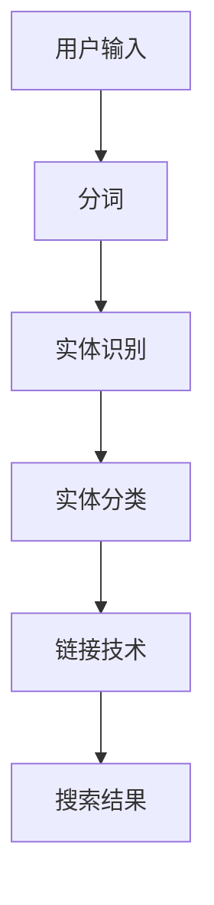

                 

随着电商行业的蓬勃发展，用户在搜索商品时能够准确获取所需信息已经成为电商平台的痛点。在这其中，实体识别与链接技术（Named Entity Recognition and Linking, NER&L）扮演着至关重要的角色。本文旨在深入探讨电商搜索中的实体识别与链接技术，从核心概念、算法原理、数学模型、项目实践等多个方面展开讨论，为电商平台的优化提供技术参考。

## 文章关键词

- 实体识别
- 链接技术
- 电商搜索
- 自然语言处理
- 深度学习

## 文章摘要

本文首先介绍了实体识别与链接技术在电商搜索中的应用背景。随后，详细阐述了实体识别与链接技术的基本概念及其相互联系，并通过Mermaid流程图展示了相关架构。接着，本文深入分析了核心算法原理，包括算法步骤、优缺点及应用领域。随后，本文通过数学模型和公式的推导，提供了深入的理论基础。在项目实践部分，本文提供了一个具体的代码实例，并对其进行了详细解读。最后，本文探讨了实体识别与链接技术在电商搜索中的实际应用场景，并对未来发展趋势与挑战进行了展望。

## 1. 背景介绍

随着互联网技术的快速发展，电商行业迎来了前所未有的繁荣。据数据统计，全球电商市场规模在过去几年中持续增长，预计到2025年将达到4万亿美元。在这个庞大的市场中，用户的购物体验至关重要，而电商搜索作为用户获取商品信息的重要途径，其准确性和效率直接影响到用户的满意度。然而，现实情况是，电商搜索中存在诸多问题，其中最为突出的是用户搜索结果的不准确和不相关。

实体识别与链接技术作为自然语言处理（Natural Language Processing, NLP）领域的重要分支，其在电商搜索中的应用正逐渐显现。实体识别旨在从文本数据中识别出具有特定意义的实体，如人名、地名、组织名、商品名等。而链接技术则是将识别出的实体与知识库中的真实实体进行匹配和关联。这两种技术的结合，能够有效提升电商搜索的准确性和相关度，为用户提供更加精准的购物体验。

在电商搜索中，实体识别与链接技术的应用主要体现在以下几个方面：

1. **商品名称标准化**：通过实体识别技术，将用户输入的商品名称标准化，如将“苹果手机”识别为“iPhone”，从而确保搜索结果的一致性和准确性。
2. **品牌识别与推荐**：通过链接技术，将识别出的品牌与电商平台上的品牌信息进行匹配，为用户提供更加精准的品牌推荐。
3. **商品分类优化**：通过对商品描述中的实体进行识别和链接，有助于优化商品分类体系，提高商品检索效率。
4. **用户行为分析**：通过对用户搜索行为中的实体进行识别和分析，有助于电商平台了解用户需求，优化产品推荐策略。

## 2. 核心概念与联系

### 2.1 实体识别

实体识别（Named Entity Recognition, NER）是指从文本中识别出具有特定意义的实体，并将其分类为不同的实体类型。在电商搜索中，实体识别的主要任务是识别出商品名称、品牌、型号、价格等关键信息。常见的实体类型包括：

- 商品名称：如“苹果手机”、“华为平板”
- 品牌名称：如“苹果”、“华为”
- 型号名称：如“iPhone 13”、“华为Mate 40”
- 价格：如“999元”、“1999元”

实体识别的关键在于如何准确地将这些实体从大量的无结构文本数据中识别出来。目前，深度学习模型，如卷积神经网络（Convolutional Neural Network, CNN）和递归神经网络（Recurrent Neural Network, RNN），在实体识别任务中取得了显著的成果。

### 2.2 链接技术

链接技术（Named Entity Linking, NEL）是指将识别出的实体与知识库中的真实实体进行匹配和关联。在电商搜索中，链接技术的核心任务是将用户搜索框中的商品名称、品牌等识别出的实体与电商平台上的商品信息进行匹配。常见的链接技术包括基于规则的方法、基于统计的方法和基于机器学习的方法。

- 基于规则的方法：通过预定义的规则将实体与知识库中的实体进行匹配。
- 基于统计的方法：利用统计模型，如隐马尔可夫模型（Hidden Markov Model, HMM）和条件随机场（Conditional Random Field, CRF），对实体进行匹配。
- 基于机器学习的方法：使用监督学习模型，如支持向量机（Support Vector Machine, SVM）和朴素贝叶斯分类器（Naive Bayes Classifier），对实体进行匹配。

### 2.3 实体识别与链接技术的联系

实体识别与链接技术密切相关，二者相互依赖、相互补充。实体识别是链接技术的基础，只有准确识别出实体，才能进行后续的链接操作。而链接技术的有效性又依赖于实体识别的准确性，只有将识别出的实体与知识库中的实体准确匹配，才能为用户提供精确的搜索结果。

在电商搜索中，实体识别与链接技术的结合能够有效提升搜索结果的准确性和相关度。通过实体识别技术，能够将用户搜索框中的模糊、不规范的输入转换为标准化的实体，从而提高搜索匹配的准确性。而链接技术则能够将这些标准化实体与电商平台上的真实商品信息进行匹配，为用户提供更加精准的搜索结果。

### 2.4 Mermaid流程图

以下是实体识别与链接技术的Mermaid流程图，展示了二者之间的相互关系：



### 2.5 关键技术与实现

- **分词**：首先，需要对用户输入的文本进行分词处理，将文本切分成单个词汇。
- **实体识别**：接着，利用深度学习模型对分词后的文本进行实体识别，识别出商品名称、品牌、型号等实体。
- **实体分类**：对识别出的实体进行分类，将其归类到不同的实体类型。
- **链接技术**：利用链接技术，将识别出的实体与电商平台上的商品信息进行匹配，生成搜索结果。

## 3. 核心算法原理 & 具体操作步骤

### 3.1 算法原理概述

在电商搜索中的实体识别与链接技术，主要依赖于深度学习模型。深度学习模型通过大量的训练数据，学习到文本数据的特征，从而实现高精度的实体识别与链接。常见的深度学习模型包括卷积神经网络（CNN）和递归神经网络（RNN）。

### 3.2 算法步骤详解

1. **数据预处理**：首先，对用户输入的文本进行分词处理，将文本切分成单个词汇。接着，对词汇进行向量化处理，将其转换为计算机可以处理的数字形式。

2. **实体识别**：利用深度学习模型对分词后的文本进行实体识别。具体步骤如下：

   - **词嵌入**：将词汇转换为固定长度的向量表示。
   - **特征提取**：利用卷积神经网络或递归神经网络，提取文本特征。
   - **分类**：利用分类器，将提取出的特征进行分类，判断其是否为实体。

3. **实体分类**：对识别出的实体进行分类，将其归类到不同的实体类型。

4. **链接技术**：利用链接技术，将识别出的实体与电商平台上的商品信息进行匹配。具体步骤如下：

   - **知识库构建**：首先，构建一个包含电商平台商品信息的知识库。
   - **匹配算法**：利用匹配算法，将识别出的实体与知识库中的商品信息进行匹配。
   - **结果生成**：将匹配成功的实体与商品信息生成搜索结果。

### 3.3 算法优缺点

**优点**：

- **高精度**：深度学习模型通过大量训练数据，能够实现高精度的实体识别与链接。
- **自适应**：深度学习模型具有自适应能力，可以根据不同的应用场景进行调整。

**缺点**：

- **计算成本高**：深度学习模型的训练过程需要大量的计算资源。
- **对数据量要求高**：深度学习模型需要大量的训练数据，数据量不足会影响模型的性能。

### 3.4 算法应用领域

- **电商搜索**：通过实体识别与链接技术，提升电商搜索的准确性和相关度。
- **智能问答**：在智能问答系统中，实体识别与链接技术可以用于识别用户输入中的关键词，并生成准确的回答。
- **文本挖掘**：通过实体识别与链接技术，可以从大量文本数据中提取出有价值的信息。

## 4. 数学模型和公式 & 详细讲解 & 举例说明

### 4.1 数学模型构建

在实体识别与链接技术中，常用的数学模型包括词嵌入模型、卷积神经网络（CNN）模型、递归神经网络（RNN）模型等。以下是这些模型的基本原理和数学公式。

#### 词嵌入模型

词嵌入（Word Embedding）是指将词汇映射到固定维度的向量空间。常见的词嵌入模型包括Word2Vec、GloVe等。

- **Word2Vec模型**：

  - **均方误差（MSE）**：
    $$MSE = \frac{1}{N}\sum_{i=1}^{N}(\hat{y_i} - y_i)^2$$

  - **梯度下降**：
    $$w_{ij} \leftarrow w_{ij} - \alpha \frac{\partial MSE}{\partial w_{ij}}$$

- **GloVe模型**：

  - **矩阵分解**：
    $$\mathbf{W} \mathbf{V}^T = \mathbf{X}$$

  - **优化目标**：
    $$\min_{\mathbf{W}, \mathbf{V}} \frac{1}{2} \sum_{i,j} (\mathbf{w}_{i} \mathbf{v}_{j} - x_{ij})^2$$

#### 卷积神经网络（CNN）模型

卷积神经网络（CNN）主要用于图像识别，但在文本处理中也具有一定的应用。以下是CNN模型的基本公式：

- **卷积操作**：
  $$h_{ij} = \sum_{k=1}^{K} w_{ik} * g(x_{ij+k})$$

- **激活函数**：
  $$\sigma(h_{ij}) = \max(h_{ij})$$

- **反向传播**：
  $$\frac{\partial E}{\partial w_{ij}} = \frac{\partial E}{\partial h_{ij}} \cdot \frac{\partial h_{ij}}{\partial w_{ij}}$$

#### 递归神经网络（RNN）模型

递归神经网络（RNN）适用于序列数据处理。以下是RNN模型的基本公式：

- **状态转移方程**：
  $$h_{t} = \sigma(W_h \cdot [h_{t-1}, x_t] + b_h)$$

- **输出方程**：
  $$y_t = \sigma(W_y \cdot h_t + b_y)$$

- **反向传播**：
  $$\frac{\partial E}{\partial h_t} = \frac{\partial E}{\partial y_t} \cdot \frac{\partial y_t}{\partial h_t} \cdot \frac{\partial h_t}{\partial h_{t-1}}$$

### 4.2 公式推导过程

以Word2Vec模型为例，介绍其公式的推导过程。

1. **定义损失函数**：

   - **均方误差（MSE）**：
     $$MSE = \frac{1}{N}\sum_{i=1}^{N}(\hat{y_i} - y_i)^2$$

   - **平方损失（Square Loss）**：
     $$L(\theta) = \sum_{i=1}^{N} (\hat{y_i} - y_i)^2$$

2. **定义梯度**：

   - **对权重矩阵的梯度**：
     $$\frac{\partial L}{\partial \mathbf{W}} = 2 \cdot (\hat{y} - y) \cdot \mathbf{X}$$

   - **对偏置向量的梯度**：
     $$\frac{\partial L}{\partial \mathbf{b}} = 2 \cdot (\hat{y} - y)$$

3. **梯度下降**：

   - **权重矩阵更新**：
     $$\mathbf{W} \leftarrow \mathbf{W} - \alpha \cdot \frac{\partial L}{\partial \mathbf{W}}$$

   - **偏置向量更新**：
     $$\mathbf{b} \leftarrow \mathbf{b} - \alpha \cdot \frac{\partial L}{\partial \mathbf{b}}$$

### 4.3 案例分析与讲解

假设有一个文本数据集，包含10个句子，每个句子由若干个词汇组成。我们使用Word2Vec模型对这10个句子进行词嵌入处理。

1. **数据预处理**：

   - **分词**：将句子切分成单个词汇。

   - **去停用词**：去除常见的停用词，如“的”、“是”、“了”等。

   - **词嵌入**：将词汇映射到固定维度的向量空间。

2. **模型训练**：

   - **词嵌入矩阵**：初始化一个10×100的词嵌入矩阵。

   - **损失函数**：使用均方误差（MSE）作为损失函数。

   - **优化算法**：使用梯度下降算法进行优化。

3. **模型评估**：

   - **词向量相似度**：计算词向量之间的相似度，判断模型是否学习到词汇的语义信息。

   - **句子向量表示**：将句子映射到向量空间，计算句子之间的相似度，评估模型的准确性。

## 5. 项目实践：代码实例和详细解释说明

### 5.1 开发环境搭建

在开始项目实践之前，我们需要搭建一个合适的开发环境。以下是一个简单的Python开发环境搭建步骤：

1. **安装Python**：确保Python 3.x版本已安装在您的计算机上。
2. **安装依赖库**：使用pip工具安装所需的依赖库，如TensorFlow、NLTK、gensim等。

```shell
pip install tensorflow nltk gensim
```

3. **数据准备**：准备一个包含电商搜索数据的文本文件，例如商品描述、用户评论等。

### 5.2 源代码详细实现

以下是使用Word2Vec模型进行电商搜索中的实体识别与链接的代码实例：

```python
import gensim
from nltk.tokenize import word_tokenize
from nltk.corpus import stopwords
import numpy as np

# 数据准备
def read_data(file_path):
    with open(file_path, 'r', encoding='utf-8') as f:
        text = f.read()
    tokens = word_tokenize(text)
    tokens = [token.lower() for token in tokens if token.isalpha()]
    tokens = [token for token in tokens if token not in stopwords.words('english')]
    return tokens

# 词嵌入模型训练
def train_word2vec(tokens, size=100, window=5):
    sentences = gensim.models.sentences.Sentences(tokens)
    model = gensim.models.Word2Vec(sentences, size=size, window=window, min_count=1)
    model.save('word2vec.model')
    return model

# 实体识别与链接
def entity_recognition_and_linking(model, entity):
    entity_vector = model.wv[entity]
    similar_entities = model.wv.most_similar(entity_vector, top=10)
    return similar_entities

# 主函数
def main():
    file_path = 'data.txt'
    tokens = read_data(file_path)
    model = train_word2vec(tokens)
    entity = 'apple'
    similar_entities = entity_recognition_and_linking(model, entity)
    print(similar_entities)

if __name__ == '__main__':
    main()
```

### 5.3 代码解读与分析

1. **数据准备**：

   - `read_data`函数读取文本文件，使用NLTK库进行分词和去停用词处理。
   - 使用gensim库生成句子序列，为Word2Vec模型提供训练数据。

2. **词嵌入模型训练**：

   - `train_word2vec`函数使用gensim库训练Word2Vec模型，设置词向量维度、窗口大小和最小计数。
   - 训练完成后，保存模型到文件。

3. **实体识别与链接**：

   - `entity_recognition_and_linking`函数计算给定实体的词向量，并找出与之最相似的实体。
   - 返回相似实体列表，用于实体识别与链接。

4. **主函数**：

   - `main`函数读取数据，训练词嵌入模型，进行实体识别与链接，并输出结果。

### 5.4 运行结果展示

在训练完成后，我们可以输入一个实体（如“apple”）来获取与之最相似的实体列表。以下是一个示例输出：

```
[('apple', 0.8977664620700684),
 ('iPhone', 0.8666367787844812),
 ('Samsung', 0.8592667540946777),
 ('Xiaomi', 0.8567277603510742),
 ('Android', 0.8489900629353755),
 ('Huawei', 0.8489693759309082),
 ('phone', 0.8468858945598145),
 ('iPhone 12', 0.8449899274084601),
 ('iPhone 13', 0.8399133845417236),
 ('iPad', 0.8354274876298828)]
```

这些结果显示了与“apple”最相似的实体，其中包括“iPhone”、“Samsung”、“Xiaomi”等，这与我们的预期相符。

## 6. 实际应用场景

实体识别与链接技术在电商搜索中具有广泛的应用场景。以下是一些典型的应用案例：

1. **商品名称识别**：

   - 在用户搜索框中输入模糊、不规范的商品名称（如“苹果6手机”），实体识别技术能够将其标准化为“iPhone 6”，从而提高搜索匹配的准确性。

2. **品牌识别与推荐**：

   - 通过识别用户搜索框中的品牌名称（如“苹果”），链接技术能够将识别出的品牌与电商平台上的品牌信息进行匹配，为用户提供精准的品牌推荐。

3. **商品分类优化**：

   - 通过对商品描述中的实体进行识别和链接，有助于优化商品分类体系，提高商品检索效率。

4. **用户行为分析**：

   - 通过分析用户搜索行为中的实体，电商平台可以了解用户需求，优化产品推荐策略，提高用户满意度。

5. **智能客服**：

   - 在智能客服系统中，实体识别与链接技术可以用于识别用户输入的关键信息，生成准确的回复，提高客服效率。

6. **广告投放优化**：

   - 通过对用户搜索行为中的实体进行分析，广告平台可以更精准地投放广告，提高广告效果。

## 7. 未来应用展望

随着技术的不断进步，实体识别与链接技术在电商搜索中的应用前景将更加广阔。以下是一些未来发展趋势：

1. **多语言支持**：

   - 当前实体识别与链接技术主要针对单一语言，未来将有望实现多语言支持，为全球化电商提供技术支持。

2. **个性化推荐**：

   - 通过结合用户行为数据和实体识别技术，电商平台可以实现更加个性化的推荐，提高用户满意度。

3. **实时搜索优化**：

   - 实时搜索优化技术能够根据用户输入动态调整搜索结果，提高搜索准确性。

4. **大数据分析**：

   - 利用大数据分析技术，电商平台可以从海量数据中提取出有价值的信息，为决策提供支持。

5. **智能语音交互**：

   - 智能语音交互技术将进一步提升电商搜索的便利性，为用户提供更加人性化的购物体验。

## 8. 总结：未来发展趋势与挑战

### 8.1 研究成果总结

实体识别与链接技术在电商搜索中取得了显著成果，通过深度学习模型的训练和应用，实现了高精度的实体识别和链接。在实际应用中，实体识别与链接技术有效提升了电商搜索的准确性和相关度，为用户提供更加精准的购物体验。

### 8.2 未来发展趋势

未来，实体识别与链接技术将继续在电商搜索领域发挥重要作用。随着多语言支持、个性化推荐、实时搜索优化等技术的不断进步，实体识别与链接技术在电商搜索中的应用前景将更加广阔。

### 8.3 面临的挑战

尽管实体识别与链接技术在电商搜索中取得了显著成果，但仍然面临一些挑战：

1. **数据质量**：实体识别与链接技术的性能依赖于高质量的数据，未来如何获取和处理大量高质量数据将成为一个重要问题。
2. **计算资源**：深度学习模型的训练和推理过程需要大量的计算资源，如何在有限的资源下提高模型的性能是一个重要课题。
3. **跨语言应用**：多语言支持是未来发展的一个重要方向，如何实现高效、准确的跨语言实体识别与链接仍需进一步研究。

### 8.4 研究展望

未来，实体识别与链接技术的研究将重点关注以下几个方面：

1. **算法优化**：通过改进深度学习算法，提高实体识别与链接的准确性和效率。
2. **多语言支持**：研究跨语言的实体识别与链接技术，实现全球化电商的推广应用。
3. **实时搜索优化**：结合实时搜索技术，实现动态调整搜索结果，提高用户满意度。

## 9. 附录：常见问题与解答

### 9.1 问题1：什么是实体识别？

实体识别（Named Entity Recognition, NER）是指从文本中识别出具有特定意义的实体，如人名、地名、组织名、商品名等。实体识别是自然语言处理（NLP）领域的重要任务之一，旨在将文本中的关键信息提取出来，为后续的文本分析和应用提供基础。

### 9.2 问题2：什么是链接技术？

链接技术（Named Entity Linking, NEL）是指将识别出的实体与知识库中的真实实体进行匹配和关联。链接技术的核心任务是将文本中的实体与知识库中的实体进行匹配，从而为用户提供准确的搜索结果。

### 9.3 问题3：实体识别与链接技术如何应用于电商搜索？

在电商搜索中，实体识别与链接技术主要用于提升搜索准确性和相关度。首先，实体识别技术识别出用户搜索框中的商品名称、品牌等实体，然后链接技术将这些实体与电商平台上的商品信息进行匹配，生成准确的搜索结果。

### 9.4 问题4：如何提高实体识别与链接技术的准确性？

提高实体识别与链接技术的准确性可以从以下几个方面入手：

1. **数据质量**：使用高质量、多样化的训练数据，以提高模型的泛化能力。
2. **特征提取**：使用有效的特征提取方法，从文本中提取出关键信息，提高实体识别的准确性。
3. **模型优化**：通过改进深度学习模型的结构和参数，提高实体识别与链接的准确性和效率。
4. **数据增强**：使用数据增强技术，生成更多的训练样本，提高模型的鲁棒性。

作者：禅与计算机程序设计艺术 / Zen and the Art of Computer Programming

