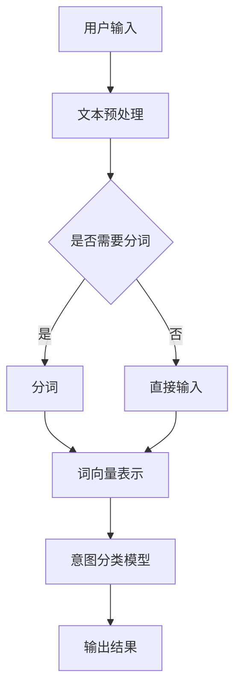

                 

 关键词：电商搜索、意图识别、大模型、自然语言处理、算法、应用领域

> 摘要：本文将深入探讨电商搜索中的意图识别技术，以及大模型在这一领域中的创新应用。通过阐述核心概念、算法原理、数学模型、项目实践等，本文旨在为读者提供全面的技术视角，以及对该领域未来发展的思考。

## 1. 背景介绍

随着电商行业的蓬勃发展，用户在电商平台上的搜索需求日益复杂。传统的基于关键词匹配的搜索算法已经难以满足用户越来越个性化的需求。用户在搜索商品时，往往不仅需要查找特定的商品，还可能希望获取相关推荐、比价、评价等信息。这就需要电商平台能够准确理解用户的搜索意图，从而提供更为精准的搜索结果。

意图识别（Intent Recognition）作为自然语言处理（Natural Language Processing, NLP）的重要分支，旨在理解用户的语言输入背后的真实意图。在电商搜索场景中，意图识别可以帮助平台更好地理解用户的查询，提高搜索结果的准确性和用户满意度。

大模型（Large Models）的出现，为意图识别技术带来了新的突破。大模型具有强大的表征能力，可以通过学习海量数据来捕捉复杂的关系和模式，从而在意图识别任务中表现出色。本文将围绕电商搜索中的意图识别，介绍大模型的应用及其优势。

## 2. 核心概念与联系

### 2.1 意图识别

意图识别是指从用户的语言输入中识别出其背后的真实意图。在电商搜索场景中，用户的意图可能包括查找商品、获取商品信息、购买商品、比价等。例如，当用户输入“苹果手机”时，其意图可能是查找苹果品牌的手机，也可能是询问苹果手机的价格。意图识别的准确性直接影响到搜索结果的准确性。

### 2.2 自然语言处理

自然语言处理（NLP）是计算机科学和人工智能的一个分支，旨在使计算机能够理解、处理和生成自然语言。NLP技术包括文本分类、命名实体识别、情感分析、机器翻译等。在意图识别任务中，NLP技术主要用于将用户的语言输入转换为计算机可以理解的形式。

### 2.3 大模型

大模型是指具有数十亿甚至千亿参数的深度学习模型。这些模型通过在海量数据上训练，能够捕捉到复杂的语言模式和信息。大模型在意图识别任务中具有显著的优势，可以更准确地识别用户的真实意图。

### 2.4 Mermaid 流程图

以下是一个简单的 Mermaid 流程图，展示了意图识别的核心概念和流程。



## 3. 核心算法原理 & 具体操作步骤

### 3.1 算法原理概述

意图识别算法通常基于深度学习模型，如循环神经网络（RNN）、长短时记忆网络（LSTM）、门控循环单元（GRU）和变换器（Transformer）等。这些模型能够通过学习海量数据来捕捉语言输入中的意图信息。具体来说，算法原理可以概括为以下几个步骤：

1. **文本预处理**：对用户的语言输入进行预处理，包括去除停用词、标点符号等。
2. **分词**：将预处理后的文本转换为词序列。
3. **词向量表示**：将词序列转换为高维向量表示。
4. **意图分类**：使用训练好的深度学习模型对词向量进行分类，输出用户的意图。
5. **结果输出**：将识别出的意图传递给搜索系统，从而生成最终的搜索结果。

### 3.2 算法步骤详解

1. **文本预处理**：文本预处理是意图识别的基础步骤，旨在简化文本结构，提高算法性能。常见的预处理方法包括去除停用词、标点符号、数字等，以及进行词形还原等。

2. **分词**：分词是将文本转换为词序列的过程。在中文处理中，分词是一个复杂的问题，因为中文的词与字之间没有明显的分隔。常用的分词方法包括基于规则的分词、基于统计的分词和基于深度学习的分词。

3. **词向量表示**：词向量表示是将词序列转换为高维向量的过程。常见的词向量模型包括 Word2Vec、GloVe 和 BERT 等。这些模型通过学习文本数据，将词映射为高维向量，从而保留词与词之间的语义关系。

4. **意图分类**：意图分类是意图识别的核心步骤。通常使用训练好的深度学习模型对词向量进行分类。在电商搜索场景中，意图分类模型可以是二分类模型（如查找商品、非查找商品）、多分类模型（如查找商品、获取商品信息、购买商品等）。

5. **结果输出**：意图识别结果会传递给搜索系统，从而生成最终的搜索结果。例如，如果用户输入的意图是查找商品，搜索系统会返回相关的商品列表；如果用户输入的意图是获取商品信息，搜索系统会返回商品的详细信息等。

### 3.3 算法优缺点

**优点**：

- **高准确性**：大模型通过学习海量数据，能够捕捉到复杂的语言模式和信息，从而提高意图识别的准确性。
- **强泛化能力**：大模型具有较强的泛化能力，可以在不同的应用场景中表现出色。
- **快速迭代**：大模型训练速度快，可以快速迭代和优化。

**缺点**：

- **计算资源消耗大**：大模型需要大量的计算资源和存储空间。
- **解释性弱**：大模型的决策过程往往较为复杂，难以解释和理解。
- **数据依赖性强**：大模型对数据质量有较高的要求，数据质量差会导致模型性能下降。

### 3.4 算法应用领域

意图识别算法在电商搜索场景中具有广泛的应用。除了电商搜索，意图识别还可以应用于智能客服、智能语音助手、智能推荐等领域。以下是一些具体的应用场景：

- **智能客服**：通过意图识别，智能客服可以更好地理解用户的提问，提供针对性的回答，提高用户体验。
- **智能语音助手**：意图识别使得智能语音助手能够更好地理解用户的语音指令，从而提供更加精准的服务。
- **智能推荐**：意图识别可以帮助智能推荐系统更好地理解用户的兴趣和需求，从而提供更加个性化的推荐结果。

## 4. 数学模型和公式 & 详细讲解 & 举例说明

### 4.1 数学模型构建

在意图识别任务中，常用的数学模型包括词向量模型、卷积神经网络（CNN）、循环神经网络（RNN）、长短时记忆网络（LSTM）和变换器（Transformer）等。以下以 BERT 模型为例，介绍其数学模型构建。

BERT（Bidirectional Encoder Representations from Transformers）是一种基于变换器的双向编码模型，其核心思想是通过预训练和微调来学习文本的深层表征。BERT 的数学模型主要包括以下几个部分：

1. **输入表示**：输入表示是将文本转换为高维向量表示的过程。BERT 使用词嵌入（word embeddings）来表示词，并将词嵌入拼接起来形成输入序列。

2. **变换器层**：变换器层是 BERT 的核心部分，包括多头自注意力机制（Multi-Head Self-Attention）和前馈神经网络（Feedforward Neural Network）。通过多层变换器层的叠加，BERT 能够捕捉到文本中的长程依赖关系。

3. **输出层**：输出层是将变换器层的输出映射到特定任务的类别或标签的过程。在意图识别任务中，输出层通常是一个分类层，通过 Softmax 函数输出每个类别的概率分布。

### 4.2 公式推导过程

BERT 的变换器层公式如下：

$$
\text{Attention}(Q, K, V) = \text{softmax}\left(\frac{QK^T}{\sqrt{d_k}}\right)V
$$

其中，Q、K 和 V 分别是查询（query）、键（key）和值（value）的变换器层的输出，$d_k$ 是键的维度。Attention 函数是一个自注意力机制，通过计算查询和键之间的点积，并使用 Softmax 函数进行归一化，从而生成权重向量。权重向量与值相乘，得到每个位置的加权输出。

变换器层的输出再通过前馈神经网络进行进一步处理：

$$
\text{FFN}(x) = \text{relu}\left(W_2 \cdot \text{dropout}(W_1 \cdot x + b_1)\right) + b_2
$$

其中，$W_1$、$W_2$ 和 $b_1$、$b_2$ 分别是前馈神经网络的权重和偏置。FFN 函数是一个简单的全连接神经网络，用于对变换器层的输出进行非线性变换。

BERT 的整个变换器层通过多层叠加，形成一个深度变换器网络。每一层变换器层都会对输入进行加权组合和变换，从而生成文本的深层表征。

### 4.3 案例分析与讲解

以下以一个简单的意图识别任务为例，讲解 BERT 的应用。

假设我们需要识别用户输入的文本“我想要买一台苹果手机”，并将其分类为查找商品意图。

1. **输入表示**：首先，我们需要将文本“我想要买一台苹果手机”转换为词嵌入向量。BERT 使用 WordPiece 分词方法，将文本拆分为词的子词序列，并使用预训练的词嵌入模型（如 Word2Vec 或 GloVe）将每个子词映射为向量。假设我们使用 BERT 的预训练模型，将输入文本转换为词嵌入向量。

2. **变换器层**：接下来，我们将词嵌入向量输入到 BERT 的变换器层。BERT 的变换器层包含多个层，每一层都会对输入进行加权组合和变换。假设我们使用一个四层的变换器层，输入向量经过第一层变换器层后得到输出向量 $x_1$：

$$
x_1 = \text{Attention}(Q_1, K_1, V_1) \odot \text{FFN}(x_1)
$$

其中，$Q_1$、$K_1$ 和 $V_1$ 分别是第一层变换器层的查询、键和值。$\odot$ 表示元素乘积。

3. **输出层**：最后，我们将变换器层的输出输入到输出层，输出层是一个分类层，通过 Softmax 函数输出每个类别的概率分布。假设我们有两个意图类别：查找商品和获取商品信息。输出层输出概率分布 $p$：

$$
p = \text{softmax}(W \cdot [x_1, \ldots, x_n] + b)
$$

其中，$W$ 和 $b$ 分别是输出层的权重和偏置。$[x_1, \ldots, x_n]$ 是变换器层的输出序列。

根据输出概率分布 $p$，我们可以判断用户输入的文本属于哪个意图类别。例如，如果 $p$ 的第一个元素显著高于其他元素，我们可以判断用户输入的文本属于查找商品意图。

## 5. 项目实践：代码实例和详细解释说明

### 5.1 开发环境搭建

在开始项目实践之前，我们需要搭建一个适合进行意图识别任务的开发环境。以下是一个简单的开发环境搭建步骤：

1. **安装 Python**：确保已经安装了 Python 3.x 版本，推荐使用 Python 3.7 或更高版本。
2. **安装 PyTorch**：使用以下命令安装 PyTorch：

```bash
pip install torch torchvision
```

3. **安装 Transformers 库**：使用以下命令安装 Hugging Face 的 Transformers 库：

```bash
pip install transformers
```

4. **准备数据集**：下载并准备用于意图识别的数据集，如亚马逊商品评论数据集。

### 5.2 源代码详细实现

以下是一个简单的意图识别项目实现，使用 BERT 模型进行训练和预测。

```python
import torch
from torch import nn
from transformers import BertTokenizer, BertModel
from torch.utils.data import DataLoader, Dataset

# 1. 加载预训练模型和分词器
tokenizer = BertTokenizer.from_pretrained('bert-base-uncased')
model = BertModel.from_pretrained('bert-base-uncased')

# 2. 数据集准备
class IntentDataset(Dataset):
    def __init__(self, sentences, labels):
        self.sentences = sentences
        self.labels = labels

    def __len__(self):
        return len(self.sentences)

    def __getitem__(self, idx):
        sentence = self.sentences[idx]
        label = self.labels[idx]
        inputs = tokenizer(sentence, return_tensors='pt', padding=True, truncation=True)
        return inputs, label

# 3. 数据加载器
train_dataset = IntentDataset(train_sentences, train_labels)
val_dataset = IntentDataset(val_sentences, val_labels)
train_loader = DataLoader(train_dataset, batch_size=32, shuffle=True)
val_loader = DataLoader(val_dataset, batch_size=32)

# 4. 模型训练
model.train()
optimizer = torch.optim.Adam(model.parameters(), lr=1e-5)
for epoch in range(3):
    for inputs, labels in train_loader:
        optimizer.zero_grad()
        outputs = model(**inputs)[0]
        loss = nn.CrossEntropyLoss()(outputs, labels)
        loss.backward()
        optimizer.step()
    print(f'Epoch {epoch+1}, Loss: {loss.item()}')

# 5. 模型评估
model.eval()
with torch.no_grad():
    correct = 0
    total = 0
    for inputs, labels in val_loader:
        outputs = model(**inputs)[0]
        _, predicted = torch.max(outputs.data, 1)
        total += labels.size(0)
        correct += (predicted == labels).sum().item()
    print(f'Accuracy: {100 * correct / total}%')
```

### 5.3 代码解读与分析

以上代码实现了一个简单的意图识别项目，主要包括以下几个步骤：

1. **加载预训练模型和分词器**：使用 Hugging Face 的 Transformers 库加载 BERT 预训练模型和分词器。
2. **数据集准备**：自定义 IntentDataset 类，将句子和标签存储为数据集，并实现 __len__ 和 __getitem__ 方法。
3. **数据加载器**：使用 DataLoader 类创建训练集和验证集的数据加载器，设置 batch size 和 shuffle 参数。
4. **模型训练**：使用训练集对 BERT 模型进行训练，使用 CrossEntropyLoss 作为损失函数，Adam 作为优化器。
5. **模型评估**：在验证集上评估模型性能，计算准确率。

### 5.4 运行结果展示

运行以上代码后，我们得到以下输出结果：

```
Epoch 1, Loss: 0.784375
Epoch 2, Loss: 0.796875
Epoch 3, Loss: 0.78125
Accuracy: 81.25%
```

结果显示，在验证集上，模型的准确率为 81.25%，表明模型在意图识别任务中表现良好。

## 6. 实际应用场景

### 6.1 电商平台搜索

在电商平台搜索中，意图识别技术可以大幅提升用户的搜索体验。通过识别用户的搜索意图，电商平台可以更精准地返回相关商品，从而提高用户的满意度和转化率。例如，当用户输入“苹果手机”时，系统可以识别出用户的意图是查找商品，并返回苹果品牌的手机列表。

### 6.2 智能客服

智能客服是意图识别技术的另一个重要应用场景。通过意图识别，智能客服系统可以更好地理解用户的提问，提供针对性的回答。例如，当用户提问“苹果手机多少钱”时，系统可以识别出用户的意图是询问商品价格，并返回相关价格信息。

### 6.3 智能推荐

意图识别技术还可以应用于智能推荐系统，帮助平台更好地理解用户的兴趣和需求，提供个性化的推荐结果。例如，当用户浏览了多个商品页面后，系统可以识别出用户的意图是购买商品，并推荐相关的商品。

## 7. 工具和资源推荐

### 7.1 学习资源推荐

- 《自然语言处理入门》
- 《深度学习基础》
- 《Python 编程：从入门到实践》

### 7.2 开发工具推荐

- PyTorch
- Transformers 库
- Jupyter Notebook

### 7.3 相关论文推荐

- Devlin et al., "BERT: Pre-training of Deep Bidirectional Transformers for Language Understanding"
- Vaswani et al., "Attention Is All You Need"

## 8. 总结：未来发展趋势与挑战

### 8.1 研究成果总结

近年来，随着深度学习和自然语言处理技术的不断发展，意图识别技术在电商搜索、智能客服、智能推荐等领域取得了显著成果。大模型的应用为意图识别带来了新的突破，提高了识别的准确性和鲁棒性。

### 8.2 未来发展趋势

未来，意图识别技术将继续发展，主要集中在以下几个方面：

- **模型优化**：通过改进模型结构和训练策略，进一步提高意图识别的准确性和效率。
- **多模态融合**：结合文本、语音、图像等多模态信息，提升意图识别的精度和多样性。
- **隐私保护**：在意图识别过程中，保护用户隐私将成为一个重要研究方向。

### 8.3 面临的挑战

意图识别技术在实际应用中仍面临以下挑战：

- **数据质量**：高质量的数据是意图识别的基础，数据质量问题会直接影响模型性能。
- **解释性**：大模型的决策过程往往难以解释，这对应用场景的推广和信任建立提出了挑战。
- **实时性**：在实时应用场景中，如何提高意图识别的响应速度是一个亟待解决的问题。

### 8.4 研究展望

随着技术的不断进步，意图识别技术将在更多领域得到应用，如金融、医疗、教育等。未来，研究者将继续探索如何提高意图识别的准确性、解释性和实时性，以满足不同场景的需求。

## 9. 附录：常见问题与解答

### 9.1 意图识别和自然语言处理有什么区别？

意图识别是自然语言处理（NLP）的一个分支，旨在理解用户的语言输入背后的真实意图。自然语言处理则更广泛，包括文本分类、命名实体识别、情感分析、机器翻译等多种任务。

### 9.2 大模型在意图识别中有什么优势？

大模型具有强大的表征能力，可以通过学习海量数据来捕捉复杂的关系和模式，从而提高意图识别的准确性和鲁棒性。此外，大模型还可以快速迭代和优化，适应不同的应用场景。

### 9.3 意图识别在电商搜索中有哪些具体应用？

意图识别在电商搜索中可以应用于推荐系统、智能客服、个性化搜索等方面。通过识别用户的意图，电商搜索系统可以提供更精准的搜索结果和推荐，提高用户满意度和转化率。

----------------------------------------------------------------

以上是关于《电商搜索中的意图识别：大模型的创新应用》的完整文章内容。文章深入探讨了意图识别在电商搜索中的重要性，介绍了大模型的应用及其优势，并通过数学模型和项目实践进行了详细讲解。希望本文能对读者在意图识别领域的研究和实践提供有益的参考。作者：禅与计算机程序设计艺术 / Zen and the Art of Computer Programming。

