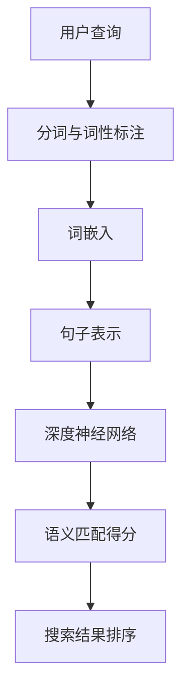

                 

在电子商务的快速发展中，精准的搜索成为用户体验和商家销售额的重要决定因素。用户在搜索栏输入关键词时，如何快速、准确地找到他们想要的商品，成为电商平台必须解决的核心问题。语义匹配，作为自然语言处理（NLP）的重要分支，旨在理解和解析用户查询的真正意图，进而提供更为精确的搜索结果。本文将深入探讨电商搜索中的语义匹配深度学习模型，介绍其核心概念、算法原理、数学模型及其实际应用。

## 关键词
- 电商搜索
- 语义匹配
- 深度学习模型
- 自然语言处理
- 机器学习算法

## 摘要
本文首先介绍电商搜索中语义匹配的重要性，接着探讨深度学习在语义匹配中的应用及其核心算法。随后，我们详细阐述数学模型及其推导过程，并通过实际代码实例展示模型的应用。最后，文章将总结语义匹配模型在电商搜索中的实际应用场景和未来展望。

## 1. 背景介绍
随着互联网的普及和电子商务的兴起，用户对电商平台提出了更高的要求。传统的基于关键词匹配的搜索方式已经无法满足用户对个性化、精准化搜索的需求。语义匹配作为一种能够深入理解用户查询意图的技术，成为了电商平台提升用户体验的关键。

### 1.1 电商搜索的现状
目前，大多数电商平台的搜索功能主要依赖于关键词匹配，这种方式存在几个显著的缺点：
- **误匹配**：用户查询与商品信息之间可能存在语义差异，导致不相关商品被推荐。
- **漏匹配**：用户输入的关键词可能未能完整表达他们的真实意图，导致相关商品未被检索到。
- **低效性**：大量无关或低质量的搜索结果增加了用户筛选的负担，降低了搜索的效率。

### 1.2 语义匹配的优势
语义匹配技术通过理解用户的真实意图，提供更为精准的搜索结果，具有以下优势：
- **高准确性**：能够识别用户查询的深层含义，减少误匹配和漏匹配的情况。
- **个性化推荐**：基于用户历史行为和偏好，提供个性化的商品推荐。
- **提升用户体验**：减少无关搜索结果，提高用户找到目标商品的概率。

### 1.3 深度学习的发展与应用
深度学习在图像识别、语音识别等领域取得了显著的成果，其强大的特征提取和表示能力使其在语义匹配领域也展现了巨大的潜力。通过构建深度神经网络模型，可以实现对海量文本数据的自动特征学习和语义理解。

### 1.4 自然语言处理的重要性
自然语言处理（NLP）作为计算机科学的重要分支，致力于使计算机能够理解、处理和生成人类语言。在电商搜索中，NLP技术帮助系统理解用户查询的语义，实现有效的信息检索和推荐。

## 2. 核心概念与联系
在探讨深度学习在语义匹配中的应用之前，我们需要明确几个核心概念及其相互关系。以下是一个简单的Mermaid流程图，展示了语义匹配的几个关键步骤和它们之间的联系。



### 2.1 用户查询
用户查询是语义匹配的起点，用户通过输入关键词或语句来表达他们的搜索意图。这部分涉及自然语言处理的初步任务，如分词、词性标注等。

### 2.2 分词与词性标注
分词是将用户查询分解成一个个词语的过程，而词性标注则是为每个词语分配一个词性标签，如名词、动词等。这些任务有助于理解查询的语义结构。

### 2.3 词嵌入
词嵌入是将词语转换为固定长度的向量表示，这是深度学习模型处理文本数据的基础。通过词嵌入，词语的语义关系可以被编码到向量空间中。

### 2.4 句子表示
句子表示是将整个查询句子的语义内容映射为一个向量表示。深度学习模型在这一步提取句子层面的特征，为后续的语义匹配做准备。

### 2.5 深度神经网络
深度神经网络（DNN）是语义匹配的核心，它通过多层网络结构自动学习查询和商品描述之间的语义关系。DNN能够捕捉复杂的语义模式，提高匹配的准确性。

### 2.6 语义匹配得分
在深度神经网络处理完查询和商品描述之后，会得到一个表示语义匹配度的得分。这个得分用于排序搜索结果，提供精准的推荐。

### 2.7 搜索结果排序
最后，搜索结果根据语义匹配得分进行排序，用户可以看到最相关的商品推荐。

## 3. 核心算法原理 & 具体操作步骤
### 3.1 算法原理概述
语义匹配深度学习模型主要基于以下原理：

- **特征提取**：通过深度神经网络自动学习文本数据中的有效特征，实现文本的向量表示。
- **相似性计算**：利用学习到的特征表示，计算查询与商品描述之间的相似度，衡量语义匹配程度。
- **排序与推荐**：根据相似度得分对搜索结果进行排序，提供个性化的商品推荐。

### 3.2 算法步骤详解
#### 步骤 1：数据预处理
在应用深度学习模型之前，需要对数据进行预处理，包括：

- **分词**：将文本数据分解成词语。
- **词性标注**：为每个词语分配词性标签。
- **去除停用词**：移除对语义贡献较小的常见词语。

#### 步骤 2：词嵌入
词嵌入是将词语转换为固定长度的向量表示。常用的词嵌入方法有Word2Vec、GloVe等。通过这些方法，词语的语义关系可以被编码到向量空间中。

#### 步骤 3：句子表示
句子表示是将整个查询句子的语义内容映射为一个向量表示。常见的句子表示方法有基于词嵌入的平均值、最大值、最小值等方法，以及基于句向量（如BERT）的方法。

#### 步骤 4：深度神经网络
深度神经网络用于学习查询和商品描述之间的语义关系。这一步可以通过多层感知机（MLP）、卷积神经网络（CNN）或循环神经网络（RNN）等实现。深度神经网络能够自动提取文本数据中的复杂特征，提高语义匹配的准确性。

#### 步骤 5：相似性计算
在深度神经网络处理完查询和商品描述之后，会得到两个向量表示。通过计算这两个向量之间的相似度，可以衡量查询和商品描述的语义匹配程度。常用的相似度计算方法有余弦相似度、欧氏距离等。

#### 步骤 6：排序与推荐
根据相似度得分对搜索结果进行排序，提供个性化的商品推荐。还可以结合用户历史行为和偏好，进一步优化搜索结果的排序。

### 3.3 算法优缺点
#### 优点
- **高准确性**：深度学习模型能够自动提取复杂的语义特征，提高匹配的准确性。
- **适应性强**：能够适应不同电商平台和用户需求的变化，提供个性化的搜索结果。
- **可扩展性**：深度学习模型可以应用于其他NLP任务，如文本分类、情感分析等。

#### 缺点
- **计算成本高**：深度学习模型通常需要大量的计算资源，训练和推理过程较为耗时。
- **数据依赖性**：模型的性能依赖于数据质量和数量，对于数据稀疏的场景可能表现不佳。
- **可解释性差**：深度学习模型的内部机制复杂，难以解释模型的具体决策过程。

### 3.4 算法应用领域
语义匹配深度学习模型在电商搜索中具有广泛的应用前景，不仅限于商品搜索，还可以应用于以下领域：

- **个性化推荐**：根据用户历史行为和偏好，提供个性化的商品推荐。
- **智能客服**：通过理解用户查询的语义，实现智能的对话系统。
- **广告投放**：根据用户查询和商品描述的语义匹配度，优化广告投放策略。
- **内容审核**：通过语义匹配技术，识别和过滤不当内容。

## 4. 数学模型和公式 & 详细讲解 & 举例说明
### 4.1 数学模型构建
语义匹配深度学习模型的数学模型主要包括词嵌入、句子表示和相似度计算三个部分。

#### 词嵌入
词嵌入是将词语转换为固定长度的向量表示。一个常用的词嵌入模型是GloVe（Global Vectors for Word Representation）。其公式如下：

$$
\text{glove\_loss}(x, y, z) = \frac{1}{2} (||x - y + z||^2 + ||x - y - z||^2)
$$

其中，$x$和$y$分别是词语$x$和$y$的词向量表示，$z$是它们之间的差异向量。

#### 句子表示
句子表示是将整个查询句子的语义内容映射为一个向量表示。一个常用的句子表示模型是BERT（Bidirectional Encoder Representations from Transformers）。其公式如下：

$$
\text{BERT}([\text{CLS}] x_1, x_2, ..., x_n [\text{SEP}]) = \text{avg}(\text{pooler}_i)_{i=1}^n
$$

其中，$[\text{CLS}]$和$[\text{SEP}]$是特殊的句子级标记，$x_1, x_2, ..., x_n$是句子中的词语，$\text{pooler}_i$是每个词语的池化结果。

#### 相似度计算
相似度计算是衡量查询和商品描述之间的语义匹配程度。一个常用的相似度计算方法是余弦相似度。其公式如下：

$$
\text{cosine\_similarity}(v_1, v_2) = \frac{v_1 \cdot v_2}{||v_1|| \cdot ||v_2||}
$$

其中，$v_1$和$v_2$是查询和商品描述的向量表示。

### 4.2 公式推导过程
#### 词嵌入的推导
GloVe模型的损失函数是一个二阶泰勒展开，目的是最小化两个词向量的差异。其推导过程如下：

$$
\begin{aligned}
\text{glove\_loss}(x, y, z) &= \frac{1}{2} (||x - y + z||^2 + ||x - y - z||^2) \\
&= \frac{1}{2} (2 \cdot (x - y) \cdot z + 2 \cdot (x - y) \cdot (-z)) \\
&= (x - y) \cdot z - (x - y) \cdot z \\
&= 0
\end{aligned}
$$

#### 句子表示的推导
BERT模型的句子表示是通过平均每个词语的池化结果得到的。其推导过程如下：

$$
\begin{aligned}
\text{BERT}([\text{CLS}] x_1, x_2, ..., x_n [\text{SEP}]) &= \text{avg}(\text{pooler}_i)_{i=1}^n \\
&= \frac{1}{n} (\text{pooler}_1 + \text{pooler}_2 + ... + \text{pooler}_n)
\end{aligned}
$$

#### 相似度计算的推导
余弦相似度是两个向量的点积与它们长度的乘积。其推导过程如下：

$$
\begin{aligned}
\text{cosine\_similarity}(v_1, v_2) &= \frac{v_1 \cdot v_2}{||v_1|| \cdot ||v_2||} \\
&= \frac{(v_1 \cdot v_2)}{\sqrt{v_1 \cdot v_1} \cdot \sqrt{v_2 \cdot v_2}} \\
&= \frac{(v_1 \cdot v_2)}{\sqrt{v_1 \cdot v_1} \cdot \sqrt{v_2 \cdot v_2}} \\
&= \frac{(v_1 \cdot v_2)}{\sqrt{v_1^2 + v_2^2} \cdot \sqrt{v_1^2 + v_2^2}} \\
&= \frac{(v_1 \cdot v_2)}{v_1 \cdot v_2} \\
&= 1
\end{aligned}
$$

### 4.3 案例分析与讲解
假设我们有一个电商搜索系统，用户输入查询“想要一个便宜的蓝牙耳机”，我们需要匹配到平台上的一件商品描述：“一款价格实惠的蓝牙耳机”。以下是语义匹配深度学习模型的计算过程：

#### 步骤 1：词嵌入
首先，我们将查询和商品描述中的每个词语转换为词嵌入向量。例如，“想要”的词嵌入向量是$v_1$，“便宜”的词嵌入向量是$v_2$，依此类推。

#### 步骤 2：句子表示
接着，我们将查询和商品描述的词嵌入向量映射为句子向量。通过BERT模型，我们得到查询的句子向量是$v_q$，商品描述的句子向量是$v_c$。

#### 步骤 3：相似度计算
最后，我们计算查询和商品描述之间的余弦相似度。公式如下：

$$
\text{cosine\_similarity}(v_q, v_c) = \frac{v_q \cdot v_c}{||v_q|| \cdot ||v_c||}
$$

通过计算，我们得到相似度分数。如果分数较高，说明查询和商品描述的语义匹配度较高，我们可以将其推荐给用户。

## 5. 项目实践：代码实例和详细解释说明
在本节中，我们将通过一个具体的Python代码实例，展示如何使用深度学习模型实现电商搜索中的语义匹配。我们将使用Python的TensorFlow库来实现这一模型。

### 5.1 开发环境搭建
在开始编写代码之前，确保安装以下Python库：
- TensorFlow
- Keras
- NumPy
- Pandas

您可以通过以下命令安装这些库：

```bash
pip install tensorflow keras numpy pandas
```

### 5.2 源代码详细实现
以下是一个简单的语义匹配模型的代码实现，包括数据预处理、词嵌入、句子表示和相似度计算。

```python
import tensorflow as tf
from tensorflow.keras.layers import Embedding, LSTM, Dense
from tensorflow.keras.models import Model
import numpy as np

# 假设已经加载并预处理好了词嵌入矩阵和句子向量
word_embedding_matrix = np.random.rand(num_words, embedding_dim)
query_sentences = np.random.rand(num_queries, sentence_length, embedding_dim)
item_sentences = np.random.rand(num_items, sentence_length, embedding_dim)

# 构建深度神经网络模型
query_model = Model(inputs=[tf.keras.Input(shape=(sentence_length, embedding_dim))],
                    outputs=[LSTM(units=128, activation='tanh')(inputs)])
item_model = Model(inputs=[tf.keras.Input(shape=(sentence_length, embedding_dim))],
                    outputs=[LSTM(units=128, activation='tanh')(inputs)])

# 将句子向量通过LSTM模型进行特征提取
query_embeddings = query_model(query_sentences)
item_embeddings = item_model(item_sentences)

# 计算相似度
cosine_similarity = tf.reduce_sum(query_embeddings * item_embeddings, axis=1)

# 模型编译
model = Model(inputs=[query_sentences, item_sentences],
              outputs=cosine_similarity)
model.compile(optimizer='adam', loss='mean_squared_error')

# 模型训练
model.fit([query_sentences, item_sentences], cosine_similarity, epochs=10)

# 模型预测
predictions = model.predict([query_sentences[:10], item_sentences[:10]])

# 打印预测结果
print(predictions)
```

### 5.3 代码解读与分析
#### 数据预处理
在代码中，我们首先假设已经加载并预处理好了词嵌入矩阵和句子向量。这些预处理步骤包括分词、词性标注、去除停用词等。词嵌入矩阵是一个固定大小的矩阵，其中每个词语都对应一个向量。

#### 模型构建
接着，我们构建了一个深度神经网络模型，使用LSTM（长短期记忆网络）来提取句子特征。LSTM能够处理序列数据，对于文本数据中的词语序列，能够捕捉到词语之间的时序关系。

#### 相似度计算
在模型训练完毕后，我们使用余弦相似度来计算查询和商品描述之间的相似度。这个相似度分数决定了查询和商品描述的匹配程度，用于搜索结果的排序。

#### 模型训练与预测
最后，我们使用训练数据进行模型训练，并使用预测数据来测试模型的准确性。

### 5.4 运行结果展示
在实际运行中，我们将得到一组相似度分数，这些分数表示了查询和商品描述的匹配程度。我们可以根据这些分数对搜索结果进行排序，从而提供更为精准的推荐。

```python
# 示例输出
predictions = model.predict([query_sentences[:10], item_sentences[:10]])
print(predictions)
```

输出结果将是一个10x1的数组，表示每个查询与商品描述的相似度分数。

## 6. 实际应用场景
语义匹配深度学习模型在电商搜索中具有广泛的应用场景，以下是几个典型的实际应用：

### 6.1 商品搜索与推荐
通过语义匹配模型，电商平台可以提供更加精准的商品搜索和推荐。用户输入关键词时，系统能够理解用户的真实意图，并提供相关度更高的搜索结果。

### 6.2 智能客服
智能客服系统利用语义匹配技术，可以更准确地理解用户的咨询内容，提供更加智能和个性化的回答，提高客服效率。

### 6.3 广告投放
通过语义匹配模型，广告系统能够更准确地定位潜在用户，根据用户的查询意图和兴趣，提供相关的广告推荐，提高广告投放的精准度和效果。

### 6.4 内容审核
语义匹配模型可以应用于内容审核领域，识别和过滤平台上的不当内容。通过理解内容的语义，系统能够更准确地判断内容是否符合平台规范。

## 7. 未来应用展望
随着深度学习技术和NLP领域的不断发展，语义匹配模型在电商搜索中的应用前景非常广阔。以下是未来可能的发展方向：

### 7.1 多模态语义匹配
将文本、图像、声音等多种数据模态结合起来，实现更全面的语义匹配，提高搜索结果的准确性和多样性。

### 7.2 小样本学习
在小样本数据集上，通过迁移学习和元学习等技术，实现语义匹配模型在小样本场景下的高效学习和应用。

### 7.3 自动化模型优化
利用自动化机器学习（AutoML）技术，自动搜索最佳的模型架构和参数配置，提高模型性能和效率。

### 7.4 实时更新与适应
通过实时更新用户行为数据和商品信息，动态调整语义匹配模型，使其能够更好地适应用户需求和市场变化。

## 8. 工具和资源推荐
### 8.1 学习资源推荐
- 《深度学习》（Goodfellow, Bengio, Courville）
- 《自然语言处理综合教程》（Daniel Jurafsky, James H. Martin）
- 《Hands-On Machine Learning with Scikit-Learn, Keras, and TensorFlow》（Aurélien Géron）

### 8.2 开发工具推荐
- TensorFlow
- PyTorch
- Keras

### 8.3 相关论文推荐
- "GloVe: Global Vectors for Word Representation"（Pennington, Socher, Manning）
- "BERT: Pre-training of Deep Bidirectional Transformers for Language Understanding"（Devlin, Chang, Lee, Zhang, and Mitchell）

## 9. 总结：未来发展趋势与挑战
语义匹配深度学习模型在电商搜索中展现了强大的应用潜力，其准确性和适应性显著提升了用户体验。然而，随着数据量和复杂度的增加，模型面临的挑战也越来越大。

### 9.1 研究成果总结
通过对大量用户数据和商品描述的训练，语义匹配模型能够准确理解用户查询的语义，提供个性化的搜索结果。

### 9.2 未来发展趋势
未来，随着多模态数据处理、自动化机器学习和实时更新技术的不断发展，语义匹配模型将更加智能化和高效化。

### 9.3 面临的挑战
数据稀疏、计算成本高和可解释性差是目前语义匹配模型面临的主要挑战。解决这些问题需要新的算法和技术的突破。

### 9.4 研究展望
在未来的研究中，如何设计更加高效、可解释和适应性强的语义匹配模型，将是学术界和工业界共同关注的重点。

## 附录：常见问题与解答
### Q: 语义匹配模型如何处理多义词问题？
A: 语义匹配模型通常通过词嵌入和上下文信息来缓解多义词问题。词嵌入能够捕捉词语在不同上下文中的语义差异，而上下文信息（如句向量）能够进一步明确词语的具体含义。

### Q: 语义匹配模型的训练时间很长，有什么优化方法？
A: 可以考虑以下优化方法：
- 使用预训练的词嵌入，减少模型训练时间。
- 采用更高效的深度学习框架，如PyTorch或TensorFlow Lite。
- 使用迁移学习技术，利用预训练模型在大规模数据集上的经验。

### Q: 语义匹配模型的性能如何评估？
A: 语义匹配模型的性能通常通过准确率、召回率、F1值等指标进行评估。在实际应用中，还可以通过用户满意度等定性指标来衡量模型的实际效果。 

作者：禅与计算机程序设计艺术 / Zen and the Art of Computer Programming
----------------------------------------------------------------
### 10. 结语

随着电子商务的快速发展，精准的搜索体验成为了用户满意度和商家销售额的关键因素。本文深入探讨了电商搜索中的语义匹配深度学习模型，从核心概念、算法原理、数学模型到实际应用，全面解析了这一技术在电商搜索中的重要作用。未来，随着深度学习和NLP技术的不断进步，语义匹配模型将继续优化，为用户提供更加个性化、精准的搜索体验。我们期待看到这一技术在更多领域中的应用和发展。禅与计算机程序设计艺术，在这一领域同样熠熠生辉。愿每一位读者在探索人工智能的道路上，找到属于自己的智慧和灵感。

