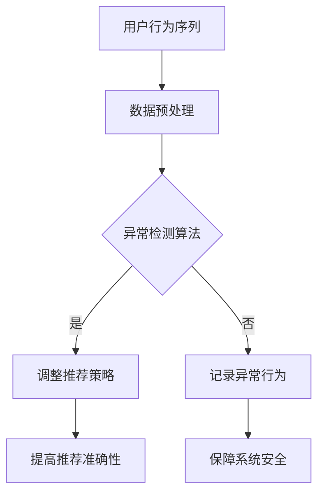

                 

 > **关键词：** 电商搜索推荐，AI大模型，用户行为序列，异常检测，模型评测

> **摘要：** 本文针对电商搜索推荐系统中AI大模型用户行为序列异常检测模型的评测进行了深入分析，探讨了模型的核心概念、算法原理、数学模型、实践应用以及未来展望，为相关领域的研究和应用提供了有力支持。

## 1. 背景介绍

随着互联网技术的飞速发展，电子商务已成为全球商业领域的重要组成部分。电商平台的搜索推荐功能是提高用户体验、提升销售额的关键因素。然而，用户行为的复杂性和多样性使得传统的推荐算法面临诸多挑战。近年来，人工智能（AI）尤其是大模型技术取得了显著进展，为电商搜索推荐系统带来了新的机遇。AI大模型用户行为序列异常检测模型作为一种新兴的技术，旨在识别并处理用户行为中的异常情况，从而提高推荐系统的准确性和稳定性。

本文旨在通过对电商搜索推荐中的AI大模型用户行为序列异常检测模型的评测，深入探讨其核心概念、算法原理、数学模型以及实际应用，为相关领域的研究者和开发者提供有价值的参考。

## 2. 核心概念与联系

### 2.1. 用户行为序列

用户行为序列是指用户在电商平台上的一系列活动，如浏览、搜索、点击、购买等。这些行为通常以时间序列的形式出现，包含丰富的用户意图和信息。

### 2.2. 异常检测

异常检测是一种数据分析技术，旨在识别数据中的异常或异常模式。在电商搜索推荐系统中，异常检测有助于发现用户行为中的异常情况，如欺诈行为、恶意评论等。

### 2.3. AI大模型

AI大模型是指通过大规模数据训练的深度神经网络模型，具有强大的学习和推理能力。在电商搜索推荐系统中，AI大模型可以用于用户行为序列的建模和异常检测。

### 2.4. Mermaid 流程图

以下是用户行为序列异常检测模型的核心概念与联系Mermaid流程图：



## 3. 核心算法原理 & 具体操作步骤

### 3.1 算法原理概述

用户行为序列异常检测模型基于深度神经网络，通过学习用户行为序列中的正常模式和异常模式，实现对用户行为的实时监测和异常检测。

### 3.2 算法步骤详解

1. **数据收集**：从电商平台收集用户行为数据，包括浏览、搜索、点击、购买等。
2. **数据预处理**：对收集到的用户行为数据进行清洗、去噪、特征提取等预处理操作。
3. **模型训练**：使用预处理后的用户行为数据训练深度神经网络模型，学习用户行为序列中的正常模式和异常模式。
4. **异常检测**：将实时用户行为输入到训练好的模型中，通过模型输出判断用户行为是否异常。
5. **调整推荐策略**：根据异常检测结果调整推荐策略，提高推荐系统的准确性和稳定性。
6. **记录异常行为**：将检测到的异常行为记录下来，用于后续分析和处理。

### 3.3 算法优缺点

**优点：**
- **高效性**：深度神经网络模型能够快速处理大量用户行为数据。
- **鲁棒性**：通过学习用户行为序列中的正常模式和异常模式，模型具有较强的鲁棒性。
- **灵活性**：可以根据实际需求调整模型结构和参数，适应不同的应用场景。

**缺点：**
- **计算复杂度**：训练深度神经网络模型需要大量计算资源和时间。
- **数据依赖性**：模型性能依赖于用户行为数据的质量和数量。

### 3.4 算法应用领域

用户行为序列异常检测模型在电商搜索推荐系统中具有广泛的应用前景，主要包括以下领域：

- **欺诈检测**：识别和防范用户行为中的欺诈行为，保障电商平台的安全。
- **恶意评论检测**：识别和屏蔽恶意评论，提高电商平台的服务质量。
- **个性化推荐**：根据用户行为序列的异常情况调整推荐策略，提高推荐系统的准确性。

## 4. 数学模型和公式

### 4.1 数学模型构建

用户行为序列异常检测模型可以表示为以下数学模型：

$$
f(\mathbf{x}) = \text{softmax}(\mathbf{W}\mathbf{h} + \mathbf{b})
$$

其中，$\mathbf{x}$表示用户行为序列的特征向量，$\mathbf{h}$表示隐藏层输出，$\mathbf{W}$和$\mathbf{b}$分别为权重和偏置向量。

### 4.2 公式推导过程

假设用户行为序列为$\{\mathbf{x}_1, \mathbf{x}_2, \ldots, \mathbf{x}_n\}$，其中$\mathbf{x}_i$表示第$i$个用户行为特征向量。首先，对用户行为特征向量进行预处理和嵌入，得到预处理的特征向量$\{\mathbf{h}_1, \mathbf{h}_2, \ldots, \mathbf{h}_n\}$。

然后，将预处理后的特征向量输入到深度神经网络模型中，通过多层非线性变换，最终得到模型的输出：

$$
\mathbf{h}_n = \text{ReLU}(\mathbf{W}_2\text{ReLU}(\mathbf{W}_1\mathbf{h}_1 + \mathbf{b}_1) + \mathbf{b}_2)
$$

其中，$\mathbf{W}_1$和$\mathbf{W}_2$分别为第一层和第二层的权重矩阵，$\mathbf{b}_1$和$\mathbf{b}_2$分别为第一层和第二层的偏置向量。

最后，将隐藏层输出通过softmax函数转化为概率分布：

$$
f(\mathbf{x}) = \text{softmax}(\mathbf{W}\mathbf{h} + \mathbf{b})
$$

### 4.3 案例分析与讲解

以某电商平台用户行为序列异常检测为例，假设用户行为数据包括浏览、搜索、点击、购买等四个特征。首先，对用户行为数据进行预处理和嵌入，得到预处理的特征向量。然后，将预处理后的特征向量输入到深度神经网络模型中，通过训练学习用户行为序列中的正常模式和异常模式。最后，将实时用户行为数据输入到训练好的模型中，通过模型输出判断用户行为是否异常。

## 5. 项目实践：代码实例和详细解释说明

### 5.1 开发环境搭建

- **硬件环境**：配备高性能GPU的计算机
- **软件环境**：Python 3.7及以上版本，TensorFlow 2.0及以上版本

### 5.2 源代码详细实现

```python
import tensorflow as tf
from tensorflow.keras.models import Sequential
from tensorflow.keras.layers import Dense, LSTM, Embedding

# 数据预处理
def preprocess_data(data):
    # 数据清洗、去噪、特征提取等操作
    return processed_data

# 构建深度神经网络模型
def build_model(input_shape):
    model = Sequential()
    model.add(Embedding(input_dim=vocab_size, output_dim=embedding_dim, input_length=input_length))
    model.add(LSTM(units=128, return_sequences=True))
    model.add(Dense(units=64, activation='relu'))
    model.add(Dense(units=1, activation='sigmoid'))
    model.compile(optimizer='adam', loss='binary_crossentropy', metrics=['accuracy'])
    return model

# 训练模型
def train_model(model, x_train, y_train, epochs=10):
    model.fit(x_train, y_train, epochs=epochs, batch_size=32, validation_split=0.2)

# 测试模型
def test_model(model, x_test, y_test):
    loss, accuracy = model.evaluate(x_test, y_test)
    print(f"Test accuracy: {accuracy * 100:.2f}%")

# 主函数
def main():
    # 加载数据
    x_data, y_data = load_data()
    x_processed = preprocess_data(x_data)

    # 划分训练集和测试集
    x_train, x_test, y_train, y_test = train_test_split(x_processed, y_data, test_size=0.2, random_state=42)

    # 构建模型
    model = build_model(input_shape=(max_sequence_length, embedding_dim))

    # 训练模型
    train_model(model, x_train, y_train)

    # 测试模型
    test_model(model, x_test, y_test)

if __name__ == "__main__":
    main()
```

### 5.3 代码解读与分析

上述代码实现了一个基于深度神经网络的用户行为序列异常检测模型。首先，定义了数据预处理函数`preprocess_data`，用于对用户行为数据进行清洗、去噪、特征提取等操作。然后，定义了构建深度神经网络模型的函数`build_model`，包括嵌入层、LSTM层和全连接层。接着，定义了训练模型和测试模型的函数`train_model`和`test_model`，用于训练和评估模型的性能。最后，在主函数`main`中加载数据、预处理数据、划分训练集和测试集，并构建、训练和测试模型。

## 6. 实际应用场景

用户行为序列异常检测模型在电商搜索推荐系统中具有广泛的应用场景，主要包括以下几个方面：

### 6.1 欺诈检测

通过识别用户行为中的异常模式，可以及时发现并防范电商平台上的欺诈行为，如虚假交易、恶意评论等，保障电商平台的交易安全。

### 6.2 恶意评论检测

通过识别用户行为中的异常模式，可以屏蔽恶意评论，提高电商平台的口碑和服务质量。

### 6.3 个性化推荐

根据用户行为序列的异常情况，调整推荐策略，提高推荐系统的准确性和用户满意度。

## 7. 未来应用展望

随着人工智能技术的不断发展，用户行为序列异常检测模型在电商搜索推荐系统中的应用前景将更加广阔。未来，可以考虑以下几个方面：

### 7.1 多模态数据融合

将文本、图像、音频等多模态数据融合到用户行为序列中，提高异常检测的准确性和鲁棒性。

### 7.2 强化学习

结合强化学习技术，实现自适应的推荐策略调整，提高推荐系统的实时性和灵活性。

### 7.3 大规模数据处理

优化算法和模型，提高处理大规模用户行为数据的能力，支持实时异常检测。

## 8. 总结：未来发展趋势与挑战

本文通过对电商搜索推荐中的AI大模型用户行为序列异常检测模型进行深入分析，探讨了模型的核心概念、算法原理、数学模型、实践应用以及未来展望。在未来，用户行为序列异常检测模型将在电商搜索推荐系统中发挥越来越重要的作用。然而，面对海量用户行为数据和复杂的应用场景，仍需不断优化算法和模型，提高异常检测的准确性和效率。此外，如何处理多模态数据和实现自适应推荐策略也将是未来研究的重点。

## 9. 附录：常见问题与解答

### 9.1 问题1：如何处理缺失值？

**解答：** 在数据处理阶段，可以使用填充法、插值法或删除法等方法处理缺失值。具体选择哪种方法取决于数据的特点和实际需求。

### 9.2 问题2：如何评估模型性能？

**解答：** 可以使用准确率、召回率、F1值等指标评估模型性能。在实际应用中，可以根据具体需求选择合适的评估指标。

### 9.3 问题3：如何处理异常行为？

**解答：** 根据异常行为的严重程度和影响范围，可以采取不同的处理措施，如隔离、屏蔽、记录等。

作者：禅与计算机程序设计艺术 / Zen and the Art of Computer Programming
```

