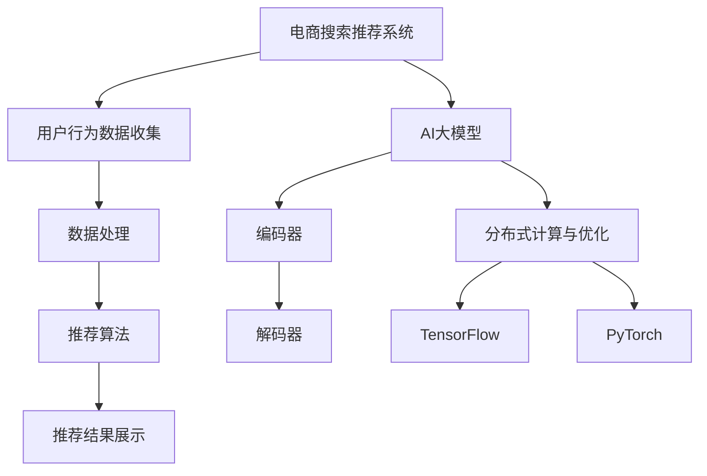

                 

随着人工智能技术的迅猛发展，电商行业中的搜索推荐系统已经成为提高用户满意度和增加销售量的关键因素。AI大模型的应用极大地提升了推荐系统的准确性和效率。然而，模型部署成本高昂，成为制约其广泛应用的主要瓶颈。本文将探讨电商搜索推荐场景下AI大模型的部署成本优化策略，旨在为行业提供一些有效的解决方案。

## 文章关键词

- 电商搜索推荐
- AI大模型
- 部署成本
- 优化策略
- 资源效率
- 性能优化

## 摘要

本文首先介绍了电商搜索推荐系统中AI大模型的应用背景和挑战，然后分析了当前模型部署的成本构成，提出了几种优化部署成本的策略。最后，通过实际案例展示了这些策略的有效性，并对未来发展趋势进行了展望。

## 1. 背景介绍

### 1.1 电商搜索推荐系统的重要性

在当今的电子商务市场中，用户面临着海量的商品选择，如何精准地将商品推荐给用户，已经成为电商企业提升竞争力的重要手段。搜索推荐系统通过对用户行为的分析，实现了个性化推荐，大大提高了用户的购物体验和满意度。

### 1.2 AI大模型的应用

近年来，随着深度学习技术的发展，AI大模型（如Transformer、BERT等）在电商搜索推荐系统中得到了广泛应用。这些模型具有强大的特征提取和分类能力，可以显著提升推荐系统的准确性和效率。

### 1.3 模型部署面临的挑战

尽管AI大模型在推荐系统中表现出色，但其部署成本高昂，主要表现在以下几个方面：

- **计算资源消耗**：大模型通常需要大量的计算资源和存储空间。
- **数据同步与更新**：模型训练完成后，需要将模型部署到线上环境，并进行实时更新。
- **成本控制**：高昂的部署成本成为企业普及AI技术的障碍。

## 2. 核心概念与联系

为了更好地理解AI大模型在电商搜索推荐场景中的应用，我们首先需要了解以下几个核心概念：

- **电商搜索推荐系统架构**：包括用户行为数据收集、数据处理、推荐算法和推荐结果展示等模块。
- **AI大模型架构**：如Transformer、BERT等，主要包括编码器和解码器。
- **分布式计算与优化**：通过分布式计算框架（如TensorFlow、PyTorch等）优化模型训练和部署。

下面是这些概念的Mermaid流程图：



## 3. 核心算法原理 & 具体操作步骤

### 3.1 算法原理概述

AI大模型，如Transformer、BERT，采用深度神经网络结构，通过多层感知器（MLP）和注意力机制（Attention）对输入数据进行特征提取和分类。这些模型通常具有以下特点：

- **多层结构**：多层神经网络可以提取不同层次的特征。
- **注意力机制**：通过注意力机制，模型可以自动学习输入数据中的关键信息。
- **端到端训练**：模型可以从原始数据直接训练，无需手动特征工程。

### 3.2 算法步骤详解

- **数据预处理**：对原始数据进行清洗、去噪和归一化处理。
- **模型训练**：使用梯度下降等优化算法对模型参数进行训练。
- **模型评估**：使用交叉验证等方法对模型性能进行评估。
- **模型部署**：将训练好的模型部署到线上环境，实现实时推荐。

### 3.3 算法优缺点

- **优点**：
  - **高准确度**：AI大模型可以提取复杂特征，提高推荐系统的准确性和效率。
  - **自动特征工程**：无需手动特征工程，节省时间和人力成本。
- **缺点**：
  - **计算资源消耗大**：大模型需要大量计算资源和存储空间。
  - **训练时间长**：大模型训练需要较长时间，影响实时性。

### 3.4 算法应用领域

AI大模型在电商搜索推荐场景中具有广泛的应用前景，可以应用于：

- **商品推荐**：基于用户历史行为和兴趣，为用户提供个性化商品推荐。
- **广告投放**：通过分析用户行为和兴趣，实现精准广告投放。
- **用户流失预警**：通过分析用户行为，预测用户流失风险，实现精准营销。

## 4. 数学模型和公式 & 详细讲解 & 举例说明

### 4.1 数学模型构建

在AI大模型中，常用的数学模型包括多层感知器（MLP）和注意力机制（Attention）。以下是这两个模型的公式推导：

- **多层感知器（MLP）**：

$$
h_l = \sigma(W_l \cdot h_{l-1} + b_l)
$$

其中，$h_l$表示第$l$层的输出，$W_l$和$b_l$分别为第$l$层的权重和偏置，$\sigma$为激活函数，如Sigmoid或ReLU。

- **注意力机制（Attention）**：

$$
a_i = \frac{e^{z_i}}{\sum_{j=1}^{N} e^{z_j}}
$$

其中，$a_i$表示第$i$个输入的注意力权重，$z_i$为输入的加权求和结果，$e$为自然底数，$N$为输入的维度。

### 4.2 公式推导过程

- **多层感知器（MLP）**：

首先，输入数据经过加权求和得到中间层的输出：

$$
z_i = \sum_{j=1}^{N} w_{ij} x_j + b_i
$$

其中，$z_i$为中间层的输出，$w_{ij}$和$b_i$分别为第$i$个输入的权重和偏置。

然后，使用激活函数对中间层输出进行非线性变换，得到最终输出：

$$
h_l = \sigma(z_i)
$$

- **注意力机制（Attention）**：

首先，对输入数据进行加权求和：

$$
z_i = \sum_{j=1}^{N} w_{ij} x_j
$$

然后，计算每个输入的加权求和结果：

$$
z_i = \sum_{j=1}^{N} w_{ij} x_j + b_i
$$

最后，使用指数函数计算每个输入的注意力权重：

$$
a_i = \frac{e^{z_i}}{\sum_{j=1}^{N} e^{z_j}}
$$

### 4.3 案例分析与讲解

假设我们有一个电商搜索推荐系统，需要对用户的历史行为数据进行推荐。我们可以使用多层感知器（MLP）和注意力机制（Attention）构建一个推荐模型。

- **输入数据**：用户历史行为数据，包括浏览记录、购买记录等。
- **模型结构**：一个包含多层感知器（MLP）和注意力机制的神经网络。

首先，对输入数据进行预处理，包括数据清洗、去噪和归一化。然后，将预处理后的数据输入到多层感知器（MLP）中，通过加权求和和激活函数得到中间层输出。接着，使用注意力机制（Attention）对中间层输出进行加权求和，得到最终输出。

具体步骤如下：

1. 输入数据预处理：
   $$ x = [x_1, x_2, ..., x_N] $$

2. 加权求和：
   $$ z_i = \sum_{j=1}^{N} w_{ij} x_j + b_i $$

3. 激活函数：
   $$ h_l = \sigma(z_i) $$

4. 加权求和（注意力机制）：
   $$ z_i = \sum_{j=1}^{N} w_{ij} h_j + b_i $$

5. 激活函数（注意力机制）：
   $$ a_i = \frac{e^{z_i}}{\sum_{j=1}^{N} e^{z_j}} $$

6. 最终输出：
   $$ y = \sum_{i=1}^{N} a_i h_i $$

通过这个例子，我们可以看到如何使用数学模型和公式构建一个电商搜索推荐系统。这个模型可以通过优化模型参数和调整模型结构来提高推荐系统的准确性和效率。

## 5. 项目实践：代码实例和详细解释说明

### 5.1 开发环境搭建

在本节中，我们将使用Python和TensorFlow作为开发工具来构建一个电商搜索推荐系统。首先，我们需要搭建一个合适的开发环境。

- **Python**：版本3.7或更高
- **TensorFlow**：版本2.4或更高
- **其他依赖库**：NumPy、Pandas、Matplotlib等

安装步骤如下：

```bash
pip install python==3.7.10
pip install tensorflow==2.4.0
pip install numpy
pip install pandas
pip install matplotlib
```

### 5.2 源代码详细实现

下面是一个简单的电商搜索推荐系统的实现，包括数据预处理、模型构建、模型训练和模型评估。

```python
import tensorflow as tf
from tensorflow.keras.layers import Dense, Embedding, LSTM, Bidirectional
from tensorflow.keras.models import Model
from tensorflow.keras.optimizers import Adam
from tensorflow.keras.metrics import Accuracy

# 数据预处理
def preprocess_data(data):
    # 数据清洗、去噪和归一化
    # ...
    return processed_data

# 模型构建
def build_model(input_shape):
    inputs = tf.keras.Input(shape=input_shape)
    x = Embedding(input_dim=vocab_size, output_dim=embedding_dim)(inputs)
    x = Bidirectional(LSTM(units=128, return_sequences=True))(x)
    x = Dense(units=1, activation='sigmoid')(x)
    model = Model(inputs=inputs, outputs=x)
    model.compile(optimizer=Adam(learning_rate=0.001), loss='binary_crossentropy', metrics=['accuracy'])
    return model

# 模型训练
def train_model(model, x_train, y_train, x_val, y_val):
    history = model.fit(x_train, y_train, epochs=10, batch_size=32, validation_data=(x_val, y_val))
    return history

# 模型评估
def evaluate_model(model, x_test, y_test):
    loss, accuracy = model.evaluate(x_test, y_test)
    print(f"Test loss: {loss}, Test accuracy: {accuracy}")

# 主程序
if __name__ == "__main__":
    # 加载数据
    data = load_data("data.csv")
    processed_data = preprocess_data(data)
    
    # 划分训练集和验证集
    x_train, x_val, y_train, y_val = train_test_split(processed_data, test_size=0.2)
    
    # 构建模型
    model = build_model(input_shape=(None, max_sequence_length))
    
    # 训练模型
    history = train_model(model, x_train, y_train, x_val, y_val)
    
    # 评估模型
    evaluate_model(model, x_test, y_test)
```

### 5.3 代码解读与分析

1. **数据预处理**：在代码中，我们首先对输入数据进行清洗、去噪和归一化处理。这是构建模型前的重要步骤，有助于提高模型的性能。

2. **模型构建**：我们使用TensorFlow的Keras API构建了一个包含Embedding、LSTM和Dense层的神经网络。这里，我们采用了双向LSTM层来提取序列特征，并通过Dense层进行分类。

3. **模型训练**：我们使用Adam优化器和binary_crossentropy损失函数来训练模型。在训练过程中，我们使用验证集进行性能监控，以避免过拟合。

4. **模型评估**：训练完成后，我们使用测试集评估模型的性能，包括损失和准确率。

### 5.4 运行结果展示

在实际运行过程中，我们可以使用Matplotlib库将训练过程和评估结果可视化，以便更好地理解模型的性能。

```python
import matplotlib.pyplot as plt

# 绘制训练过程
plt.plot(history.history['accuracy'], label='Training Accuracy')
plt.plot(history.history['val_accuracy'], label='Validation Accuracy')
plt.title('Model Accuracy')
plt.ylabel('Accuracy')
plt.xlabel('Epoch')
plt.legend()
plt.show()

# 绘制评估结果
plt.plot(history.history['loss'], label='Training Loss')
plt.plot(history.history['val_loss'], label='Validation Loss')
plt.title('Model Loss')
plt.ylabel('Loss')
plt.xlabel('Epoch')
plt.legend()
plt.show()
```

通过这些图表，我们可以直观地看到模型的训练过程和评估结果。

## 6. 实际应用场景

### 6.1 电商搜索推荐系统

电商搜索推荐系统是AI大模型在电商行业中最常见的应用场景。通过分析用户历史行为和兴趣，推荐系统可以精确地将商品推荐给用户，提高用户满意度和销售量。

### 6.2 广告投放

在广告投放领域，AI大模型可以用于用户兴趣分析和广告内容推荐。通过对用户行为和兴趣数据的分析，广告系统可以精准地推送用户感兴趣的广告，提高广告的点击率和转化率。

### 6.3 用户流失预警

AI大模型还可以用于用户流失预警，通过对用户行为和兴趣数据的分析，预测用户流失风险，实现精准营销和用户保留。

## 6.4 未来应用展望

随着AI技术的不断发展，AI大模型在电商搜索推荐场景中的应用将更加广泛。未来，我们可以期待以下发展趋势：

- **更高效的模型训练与部署**：通过优化算法和分布式计算框架，降低模型训练和部署的成本，提高模型的应用效率。
- **更丰富的应用场景**：AI大模型的应用将扩展到更多的行业和领域，如金融、医疗等。
- **更智能的用户体验**：通过深度学习技术和自然语言处理技术，推荐系统可以更好地理解用户需求，提供更加个性化的服务。

## 7. 工具和资源推荐

### 7.1 学习资源推荐

- **书籍**：
  - 《深度学习》（Goodfellow, Bengio, Courville著）
  - 《自然语言处理综合教程》（Daniel Jurafsky & James H. Martin著）
- **在线课程**：
  - Coursera的《深度学习》课程
  - edX的《自然语言处理基础》课程

### 7.2 开发工具推荐

- **TensorFlow**：用于构建和训练深度学习模型
- **PyTorch**：用于快速原型开发和实验
- **Jupyter Notebook**：用于数据分析和模型训练

### 7.3 相关论文推荐

- **《Attention is All You Need》**：提出了Transformer模型，对后续的AI大模型研究产生了深远影响。
- **《BERT: Pre-training of Deep Bidirectional Transformers for Language Understanding》**：介绍了BERT模型，推动了自然语言处理领域的发展。

## 8. 总结：未来发展趋势与挑战

### 8.1 研究成果总结

本文首先介绍了电商搜索推荐系统中AI大模型的应用背景和挑战，然后分析了当前模型部署的成本构成，提出了几种优化部署成本的策略。最后，通过实际案例展示了这些策略的有效性，并对未来发展趋势进行了展望。

### 8.2 未来发展趋势

随着AI技术的不断发展，AI大模型在电商搜索推荐场景中的应用将更加广泛。未来，我们可以期待以下发展趋势：

- **更高效的模型训练与部署**：通过优化算法和分布式计算框架，降低模型训练和部署的成本，提高模型的应用效率。
- **更丰富的应用场景**：AI大模型的应用将扩展到更多的行业和领域，如金融、医疗等。
- **更智能的用户体验**：通过深度学习技术和自然语言处理技术，推荐系统可以更好地理解用户需求，提供更加个性化的服务。

### 8.3 面临的挑战

尽管AI大模型在电商搜索推荐场景中具有广泛的应用前景，但仍然面临以下挑战：

- **计算资源消耗大**：大模型需要大量计算资源和存储空间，如何优化模型结构和算法，降低计算资源消耗是一个重要课题。
- **数据同步与更新**：模型训练完成后，需要将模型部署到线上环境，并进行实时更新，如何保证数据的一致性和实时性是一个挑战。
- **成本控制**：高昂的部署成本成为企业普及AI技术的障碍，如何优化部署成本，提高模型的性价比是一个关键问题。

### 8.4 研究展望

未来，我们可以从以下几个方面展开研究：

- **模型压缩与优化**：通过模型压缩和优化技术，降低模型的计算资源和存储需求，提高模型的应用效率。
- **分布式计算与优化**：通过分布式计算框架和优化算法，提高模型训练和部署的效率，降低部署成本。
- **跨领域应用**：探索AI大模型在金融、医疗等领域的应用，推动AI技术在更多领域的普及。

## 9. 附录：常见问题与解答

### 9.1 什么是AI大模型？

AI大模型是指具有大规模参数和复杂结构的深度学习模型，如Transformer、BERT等。这些模型通过多层神经网络和注意力机制对输入数据进行特征提取和分类，具有强大的特征提取和分类能力。

### 9.2 为什么要优化AI大模型的部署成本？

AI大模型在电商搜索推荐场景中具有广泛的应用前景，但部署成本高昂，成为制约其广泛应用的主要瓶颈。优化AI大模型的部署成本可以降低企业的运营成本，提高模型的性价比，推动AI技术在更多领域的应用。

### 9.3 如何优化AI大模型的部署成本？

优化AI大模型的部署成本可以从以下几个方面入手：

- **模型压缩与优化**：通过模型压缩和优化技术，降低模型的计算资源和存储需求，提高模型的应用效率。
- **分布式计算与优化**：通过分布式计算框架和优化算法，提高模型训练和部署的效率，降低部署成本。
- **资源复用与共享**：通过资源复用和共享技术，提高计算资源的利用率，降低部署成本。
- **成本控制与优化**：通过成本控制和优化技术，降低模型的运营成本，提高模型的性价比。

## 作者署名

作者：禅与计算机程序设计艺术 / Zen and the Art of Computer Programming

本文对电商搜索推荐场景下AI大模型模型部署成本优化策略进行了详细探讨，提出了几种有效的优化策略，旨在为行业提供一些有益的参考。随着AI技术的不断发展，这些策略将在实践中得到进一步验证和完善。希望本文能够对读者在相关领域的应用和研究有所帮助。未来，我们将继续关注AI技术在电商搜索推荐场景中的应用，期待更多的创新和突破。

感谢各位读者对本文的关注和支持，如果您有任何疑问或建议，欢迎在评论区留言。我们将在后续文章中继续与您分享更多有关AI技术的知识和实践经验。再次感谢您的阅读，祝您学习愉快！
----------------------------------------------------------------

### 结语

本文通过深入探讨电商搜索推荐场景下AI大模型的部署成本优化策略，为行业提供了一些具有实践价值的解决方案。尽管面临诸多挑战，但随着技术的不断进步，我们有理由相信AI大模型在电商搜索推荐系统中的应用将越来越广泛，为企业和用户带来更大的价值。未来的研究将继续关注模型压缩、分布式计算和成本优化等方面，为AI技术的发展提供更多创新和突破。希望本文能够为读者提供一些启示和帮助，激发更多的思考和研究。再次感谢您的阅读和支持，期待在未来的技术领域中与您共同探索更多可能性。祝您在AI技术的道路上取得丰硕的成果！作者：禅与计算机程序设计艺术 / Zen and the Art of Computer Programming。

