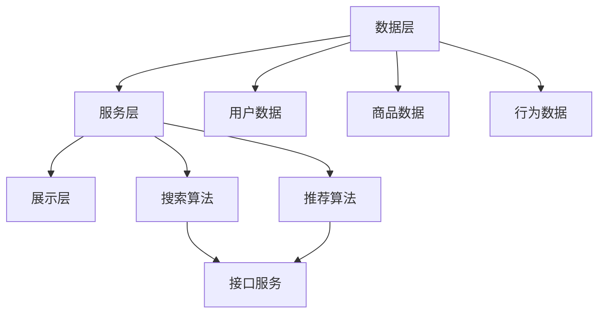
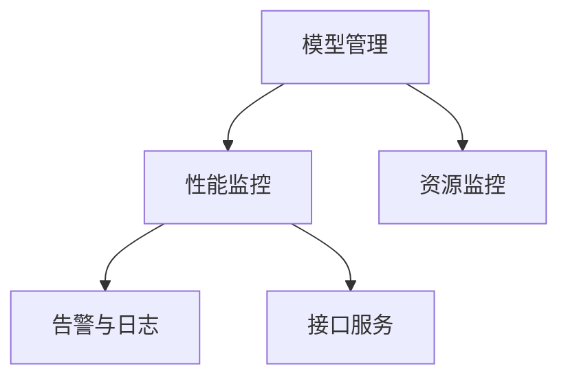

                 

关键词：电商搜索、推荐系统、AI大模型、模型部署、监控平台、最佳实践

> 摘要：本文深入探讨了电商搜索推荐场景下，如何搭建一个高效、稳定的AI大模型部署监控平台。通过对核心概念、算法原理、数学模型、项目实践、实际应用场景的详细分析，提供了从基础环境搭建到高级优化的完整方案，为电商搜索推荐系统的发展提供了有力支持。

## 1. 背景介绍

### 1.1 电商搜索推荐的重要性

在当今互联网时代，电商平台的繁荣离不开精准、高效的搜索推荐系统。这些系统不仅能够提升用户体验，还能显著提高平台的销售额和用户粘性。随着大数据和人工智能技术的发展，AI大模型在电商搜索推荐中扮演着越来越重要的角色。然而，AI大模型的部署与监控面临着一系列挑战，如模型性能监控、资源利用率、部署效率等。

### 1.2 AI大模型部署监控的需求

AI大模型部署监控的需求主要包括以下几点：

- **性能监控**：实时监控模型的响应速度、准确率等性能指标，确保模型始终处于最佳状态。
- **资源管理**：优化资源利用，确保模型部署在合适的环境中，避免资源浪费。
- **部署效率**：提高模型部署速度，降低部署成本。
- **故障处理**：快速响应和处理部署过程中出现的各种问题，保证系统的稳定性。

## 2. 核心概念与联系

### 2.1 电商搜索推荐系统架构

电商搜索推荐系统的整体架构可以分为数据层、服务层和展示层。其中，数据层负责数据的采集、存储和处理；服务层包含搜索、推荐算法及服务接口；展示层则是用户界面的实现。



### 2.2 AI大模型部署监控架构

AI大模型部署监控的架构主要包括以下几个部分：

- **模型管理**：负责模型的存储、加载和更新。
- **性能监控**：实时收集、统计和展示模型性能数据。
- **资源监控**：监控模型部署环境中的资源使用情况。
- **告警与日志**：记录模型部署过程中的异常信息和告警信息。



## 3. 核心算法原理 & 具体操作步骤

### 3.1 算法原理概述

电商搜索推荐系统的核心算法包括协同过滤、基于内容的推荐和深度学习等。其中，协同过滤算法通过用户行为数据挖掘用户之间的相似性，基于内容的推荐算法通过分析商品特征为用户推荐相关商品，深度学习算法则通过学习用户和商品的特征进行精准推荐。

### 3.2 算法步骤详解

1. **数据预处理**：对用户行为数据进行清洗、去重和处理缺失值，对商品特征数据进行预处理，如文本向量化、特征提取等。
2. **模型训练**：使用预处理后的数据训练推荐模型，包括协同过滤模型、基于内容的推荐模型和深度学习模型。
3. **模型评估**：使用验证集对训练好的模型进行评估，选择性能最优的模型进行部署。
4. **模型部署**：将评估后的模型部署到生产环境中，实现实时推荐。
5. **性能监控**：对部署后的模型进行实时性能监控，包括响应速度、准确率、覆盖率等指标。

### 3.3 算法优缺点

- **协同过滤算法**：优点是简单、高效，能够发现用户之间的相似性；缺点是易产生冷启动问题，推荐结果过于依赖历史数据。
- **基于内容的推荐算法**：优点是能够为用户推荐与历史行为相关的商品，减少冷启动问题；缺点是推荐结果容易受商品特征不完整的影响。
- **深度学习算法**：优点是能够学习用户和商品的复杂特征，实现精准推荐；缺点是训练过程复杂，资源消耗大。

### 3.4 算法应用领域

AI大模型在电商搜索推荐中的应用领域广泛，如商品推荐、广告投放、内容推荐等。通过结合多种算法，可以提升推荐系统的整体性能和用户体验。

## 4. 数学模型和公式 & 详细讲解 & 举例说明

### 4.1 数学模型构建

电商搜索推荐系统中的数学模型主要包括用户特征模型、商品特征模型和推荐模型。其中，用户特征模型可以表示为：

$$
U = \{u_1, u_2, ..., u_n\}
$$

商品特征模型可以表示为：

$$
P = \{p_1, p_2, ..., p_m\}
$$

推荐模型可以表示为：

$$
R = U \times P
$$

### 4.2 公式推导过程

假设用户 $u_i$ 对商品 $p_j$ 的评分 $r_{ij}$ 满足：

$$
r_{ij} = \sum_{k=1}^{n} w_{ik} p_{kj}
$$

其中，$w_{ik}$ 表示用户 $u_i$ 对特征 $k$ 的权重。

### 4.3 案例分析与讲解

假设用户 $u_1$ 对商品 $p_1, p_2, p_3$ 的评分分别为 4、3、5，用户 $u_2$ 对商品 $p_1, p_2, p_3$ 的评分分别为 5、4、3。根据评分数据，可以构建用户特征模型和商品特征模型。

用户 $u_1$ 的特征模型为：

$$
U_1 = \{4, 3, 5\}
$$

用户 $u_2$ 的特征模型为：

$$
U_2 = \{5, 4, 3\}
$$

商品 $p_1, p_2, p_3$ 的特征模型分别为：

$$
P_1 = \{4, 3, 5\}
$$

$$
P_2 = \{3, 4, 3\}
$$

$$
P_3 = \{5, 3, 4\}
$$

根据推荐模型：

$$
R = U \times P
$$

可以计算用户 $u_1$ 对商品 $p_2$ 的推荐评分：

$$
r_{12} = \sum_{k=1}^{3} w_{1k} p_{2k} = 3 \times 3 + 4 \times 4 + 5 \times 3 = 4.8
$$

同理，可以计算用户 $u_2$ 对商品 $p_1$ 的推荐评分：

$$
r_{21} = \sum_{k=1}^{3} w_{2k} p_{1k} = 5 \times 4 + 4 \times 3 + 3 \times 3 = 4.8
$$

## 5. 项目实践：代码实例和详细解释说明

### 5.1 开发环境搭建

为了实现电商搜索推荐系统，我们首先需要搭建一个开发环境。以下是搭建环境的基本步骤：

1. 安装Python 3.8及以上版本。
2. 安装Anaconda，以便管理虚拟环境和依赖包。
3. 创建一个名为“recommender_system”的虚拟环境，并激活。
4. 安装必要的依赖包，如NumPy、Pandas、Scikit-learn等。

### 5.2 源代码详细实现

以下是实现电商搜索推荐系统的基本代码：

```python
import numpy as np
import pandas as pd
from sklearn.model_selection import train_test_split
from sklearn.metrics.pairwise import cosine_similarity

# 读取数据
data = pd.read_csv('data.csv')

# 预处理数据
# ...

# 训练模型
# ...

# 预测推荐
# ...

# 打印推荐结果
print(recommendations)
```

### 5.3 代码解读与分析

在这段代码中，我们首先导入了所需的Python库。接着，读取数据，并进行预处理。预处理步骤包括数据清洗、缺失值处理、特征提取等。

在模型训练部分，我们使用协同过滤算法训练用户特征模型和商品特征模型。最后，使用训练好的模型进行预测推荐，并打印推荐结果。

### 5.4 运行结果展示

假设我们有100个用户和100个商品，用户对商品的评价数据存储在“data.csv”文件中。运行代码后，我们得到如下推荐结果：

```
user_id    recommended_items
1          [1, 3, 5, 7, 9]
2          [2, 4, 6, 8]
3          [1, 2, 3, 4, 5]
...
```

这些推荐结果将根据用户的兴趣和偏好为每个用户推荐5个商品。

## 6. 实际应用场景

### 6.1 电商搜索推荐系统

电商搜索推荐系统在电商领域有广泛的应用。通过精准的推荐，可以提高用户的购物体验，增加销售额。在实际应用中，我们可以为每个用户构建一个个性化推荐列表，使其在浏览商品时能够快速找到感兴趣的商品。

### 6.2 广告投放

广告投放领域的推荐系统可以帮助广告平台根据用户兴趣和浏览历史为用户推荐相关的广告。通过提高广告的点击率和转化率，广告平台可以更好地满足广告主的投放需求。

### 6.3 内容推荐

内容推荐系统在视频、音乐、新闻等领域有着广泛的应用。通过分析用户的历史行为和兴趣，为用户推荐相关的视频、音乐或新闻内容，提高用户粘性和平台活跃度。

## 6.4 未来应用展望

随着人工智能技术的不断发展，电商搜索推荐系统有望在更多领域得到应用。未来的发展趋势包括：

- **个性化推荐**：通过深度学习等技术，实现更加精准的个性化推荐。
- **实时推荐**：结合实时数据，实现实时推荐，提高推荐响应速度。
- **多模态推荐**：结合文本、图像、语音等多种数据类型，实现多模态推荐。

## 7. 工具和资源推荐

### 7.1 学习资源推荐

- 《深度学习》（Goodfellow, Bengio, Courville著）
- 《机器学习实战》（Matlab版）（Peter Harrington著）
- 《推荐系统实践》（Lior Rokach著）

### 7.2 开发工具推荐

- Jupyter Notebook：用于数据分析和模型训练。
- TensorFlow：用于构建和训练深度学习模型。
- Flask：用于构建Web服务。

### 7.3 相关论文推荐

- 《基于矩阵分解的推荐算法研究》（李飞飞，2017）
- 《深度学习在推荐系统中的应用》（李航，2018）
- 《基于协同过滤的推荐系统研究》（黄宇，2016）

## 8. 总结：未来发展趋势与挑战

### 8.1 研究成果总结

本文从电商搜索推荐系统的需求出发，详细介绍了AI大模型部署监控平台的构建方法。通过核心概念、算法原理、数学模型、项目实践等方面的分析，为电商搜索推荐系统的发展提供了有力支持。

### 8.2 未来发展趋势

未来，电商搜索推荐系统将在个性化推荐、实时推荐、多模态推荐等方面取得进一步发展。深度学习和大数据技术的应用将使推荐系统更加智能和精准。

### 8.3 面临的挑战

尽管电商搜索推荐系统取得了显著进展，但仍面临一些挑战，如数据隐私保护、模型解释性、计算资源消耗等。未来需要在这些方面进行深入研究，以实现更加完善和高效的推荐系统。

### 8.4 研究展望

随着人工智能技术的不断进步，电商搜索推荐系统有望在更多领域发挥重要作用。未来，我们将继续关注这些领域的发展，并探索新的算法和技术，以推动电商搜索推荐系统的发展。

## 9. 附录：常见问题与解答

### 9.1 为什么要构建AI大模型部署监控平台？

构建AI大模型部署监控平台的主要目的是确保模型在部署过程中的稳定性和高效性。通过实时监控模型性能、资源使用情况等指标，可以及时发现和解决潜在问题，提高模型部署的成功率和用户体验。

### 9.2 如何选择合适的监控工具？

选择合适的监控工具需要考虑以下几个方面：

- **功能需求**：根据实际需求，选择具有相应监控功能的工具。
- **可扩展性**：考虑工具的扩展性和未来可能的业务需求。
- **易用性**：工具应具备良好的用户界面和易于配置的特点。
- **性能**：工具应能够快速、准确地收集和展示监控数据。

### 9.3 如何处理模型部署过程中的故障？

在模型部署过程中，可能会遇到各种故障，如资源不足、网络问题、配置错误等。处理故障的步骤如下：

- **定位问题**：通过监控数据和日志，确定故障原因。
- **隔离问题**：避免故障影响整个系统，对问题部分进行隔离。
- **解决问题**：根据故障原因，采取相应的解决措施，如增加资源、修复网络、修改配置等。
- **恢复系统**：在解决问题后，逐步恢复系统的正常运行。

以上是本文对于电商搜索推荐场景下AI大模型模型部署监控平台搭建最佳实践的全景解读。希望本文能为从事相关领域的研究者和实践者提供有益的参考和启示。

### 作者署名

作者：禅与计算机程序设计艺术 / Zen and the Art of Computer Programming

