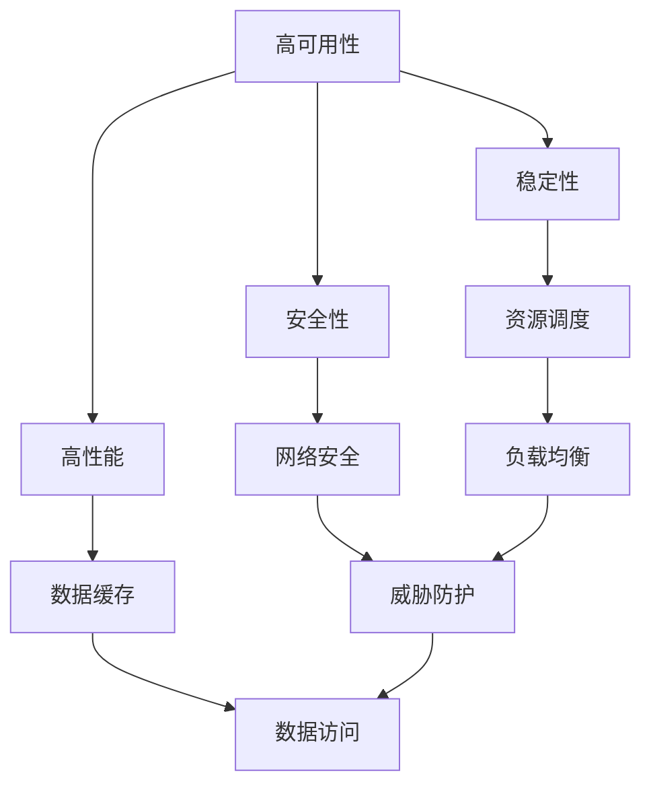

                 

关键词：电商系统、高可用、稳定性、安全性、高性能、系统能力、保障

摘要：本文将深入探讨电商系统在高可用、稳定性、安全性和高性能方面的能力保障。我们将分析每个关键领域的技术挑战和解决方案，提供实用的方法和工具，以及展望未来发展趋势和面临的挑战。

## 1. 背景介绍

随着互联网和电子商务的快速发展，电商系统已经成为现代商业不可或缺的一部分。一个成功的电商系统不仅需要具备良好的用户体验，还需要具备高可用性、稳定性、安全性和高性能等关键能力。这些能力的保障对于电商平台的运营至关重要，直接影响到用户的满意度、平台的信誉和商业价值。

本文将围绕电商系统的高可用、稳定性、安全性和高性能这四个核心能力，探讨其在系统架构、技术选型、运维管理等方面的策略和实践。通过深入分析这些关键领域的挑战和解决方案，我们希望为电商系统的设计和运维提供有价值的指导。

## 2. 核心概念与联系

在讨论电商系统的高可用、稳定性、安全性和高性能之前，我们需要理解以下几个核心概念：

- **高可用性**：系统在规定时间内能够正常运行的能力，包括硬件故障、软件故障和系统维护等方面的保障。
- **稳定性**：系统在长时间运行过程中能够保持稳定性能的能力，包括负载均衡、资源调度和系统优化等方面。
- **安全性**：系统在面临外部威胁（如黑客攻击、恶意软件等）时能够保护自身和数据的能力。
- **高性能**：系统在处理大量数据和用户请求时能够保持高效运行的能力，包括数据缓存、分布式计算和系统优化等方面。

下面是一个Mermaid流程图，展示这些核心概念之间的联系：



### 2.1 高可用性

高可用性是电商系统最重要的能力之一。它涉及到系统的各个方面，包括硬件、软件和网络等。为了实现高可用性，我们需要考虑以下关键要素：

- **冗余设计**：通过硬件和软件的冗余来避免单点故障，例如使用多台服务器、数据库镜像和备份等。
- **故障转移**：在系统发生故障时，能够自动切换到备用系统，保持服务的连续性。
- **负载均衡**：通过负载均衡器将请求分配到多台服务器上，避免单台服务器过载。

### 2.2 稳定性

稳定性涉及到系统在长时间运行过程中能够保持稳定性能的能力。为了提高系统的稳定性，我们需要：

- **资源调度**：合理分配系统资源，确保系统在不同负载下能够稳定运行。
- **监控与报警**：实时监控系统性能和资源使用情况，及时发现并处理问题。
- **系统优化**：定期对系统进行优化，提高系统的运行效率和稳定性。

### 2.3 安全性

安全性是电商系统的关键保障。我们需要：

- **网络安全**：确保网络不受恶意攻击，包括DDoS攻击、SQL注入等。
- **数据安全**：保护用户数据不被非法获取和泄露，包括加密存储、数据备份和恢复等。
- **威胁防护**：部署防火墙、入侵检测系统和安全审计等，及时发现和防御安全威胁。

### 2.4 高性能

高性能是电商系统的核心竞争力。为了实现高性能，我们需要：

- **数据缓存**：使用缓存技术降低数据访问延迟，提高系统响应速度。
- **分布式计算**：通过分布式计算架构处理海量数据和用户请求，提高系统并发能力。
- **系统优化**：对系统进行性能优化，提高CPU、内存和磁盘等资源的使用效率。

## 3. 核心算法原理 & 具体操作步骤

### 3.1 算法原理概述

在电商系统的高可用、稳定性、安全性和高性能保障中，我们通常会使用以下核心算法：

- **冗余算法**：通过冗余设计实现高可用性。
- **负载均衡算法**：实现请求的合理分配。
- **加密算法**：实现数据的安全存储和传输。
- **缓存算法**：提高系统响应速度。

### 3.2 算法步骤详解

#### 3.2.1 冗余算法

1. **硬件冗余**：使用多台服务器、数据库镜像和备份等，确保单点故障不会导致系统瘫痪。
2. **软件冗余**：通过冗余代码和模块，提高系统的健壮性。

#### 3.2.2 负载均衡算法

1. **轮询算法**：将请求依次分配到服务器上。
2. **加权轮询算法**：根据服务器负载分配请求，负载越高的服务器分配更多的请求。
3. **最小连接数算法**：将请求分配到连接数最少的服务器。

#### 3.2.3 加密算法

1. **对称加密**：使用相同的密钥进行加密和解密，如AES。
2. **非对称加密**：使用公钥和私钥进行加密和解密，如RSA。
3. **数字签名**：使用私钥对数据进行签名，确保数据的完整性和真实性。

#### 3.2.4 缓存算法

1. **缓存淘汰算法**：根据缓存容量和访问频率，选择淘汰不常用的数据，如LRU。
2. **缓存预热**：在访问高峰期前，预加载热门数据到缓存中。

### 3.3 算法优缺点

- **冗余算法**：优点是提高系统可用性，缺点是增加成本和维护难度。
- **负载均衡算法**：优点是提高系统并发能力，缺点是复杂度较高。
- **加密算法**：优点是确保数据安全，缺点是加密和解密速度较慢。
- **缓存算法**：优点是提高系统响应速度，缺点是缓存一致性难以保证。

### 3.4 算法应用领域

- **冗余算法**：广泛应用于电商系统、金融系统等高可用性要求较高的领域。
- **负载均衡算法**：广泛应用于分布式系统、云计算等场景。
- **加密算法**：广泛应用于网络安全、数据保护等领域。
- **缓存算法**：广泛应用于电商系统、搜索引擎等需要高性能的场景。

## 4. 数学模型和公式 & 详细讲解 & 举例说明

在电商系统的高可用、稳定性、安全性和高性能保障中，数学模型和公式起着重要的作用。下面我们将介绍几个常用的数学模型和公式，并进行详细讲解和举例说明。

### 4.1 数学模型构建

在构建数学模型时，我们需要考虑以下关键因素：

- **系统负载**：描述系统在一段时间内的请求量和处理能力。
- **资源分配**：描述系统如何将资源（如CPU、内存、磁盘等）分配给不同任务。
- **故障概率**：描述系统在一段时间内发生故障的概率。

#### 4.1.1 系统负载模型

系统负载模型可以描述为：

$$
L(t) = f(t) + \epsilon(t)
$$

其中，$L(t)$ 表示在时间 $t$ 的系统负载，$f(t)$ 表示正常负载，$\epsilon(t)$ 表示随机干扰。

#### 4.1.2 资源分配模型

资源分配模型可以描述为：

$$
R(t) = \sum_{i=1}^{n} r_i(t)
$$

其中，$R(t)$ 表示在时间 $t$ 的系统资源总量，$r_i(t)$ 表示第 $i$ 个资源的分配量。

#### 4.1.3 故障概率模型

故障概率模型可以描述为：

$$
P(F) = \frac{1}{1 + e^{-\lambda t}}
$$

其中，$P(F)$ 表示在时间 $t$ 发生故障的概率，$\lambda$ 表示故障率。

### 4.2 公式推导过程

下面我们以系统负载模型为例，推导其相关公式。

#### 4.2.1 系统负载公式

根据系统负载模型，我们有：

$$
L(t) = f(t) + \epsilon(t)
$$

其中，$f(t)$ 表示正常负载，$\epsilon(t)$ 表示随机干扰。

正常负载 $f(t)$ 可以表示为：

$$
f(t) = \alpha \cdot P(1) + \beta \cdot P(2) + \cdots + \gamma \cdot P(n)
$$

其中，$\alpha, \beta, \cdots, \gamma$ 分别表示不同负载类型的权重，$P(1), P(2), \cdots, P(n)$ 分别表示不同负载类型的概率。

随机干扰 $\epsilon(t)$ 可以表示为：

$$
\epsilon(t) = \eta \cdot e^{-\lambda t}
$$

其中，$\eta$ 表示干扰强度，$\lambda$ 表示干扰率。

将 $f(t)$ 和 $\epsilon(t)$ 代入 $L(t)$，得到：

$$
L(t) = \alpha \cdot P(1) + \beta \cdot P(2) + \cdots + \gamma \cdot P(n) + \eta \cdot e^{-\lambda t}
$$

#### 4.2.2 故障概率公式

根据故障概率模型，我们有：

$$
P(F) = \frac{1}{1 + e^{-\lambda t}}
$$

其中，$\lambda$ 表示故障率。

故障率 $\lambda$ 可以表示为：

$$
\lambda = \frac{1}{T}
$$

其中，$T$ 表示系统的平均无故障时间。

将 $\lambda$ 代入 $P(F)$，得到：

$$
P(F) = \frac{1}{1 + e^{-\frac{t}{T}}}
$$

### 4.3 案例分析与讲解

下面我们通过一个具体案例，分析系统负载和故障概率。

#### 4.3.1 系统负载分析

假设我们有一个电商平台，每天的用户请求量稳定在10000次，其中普通请求占80%，高峰请求占20%。普通请求的处理时间为1秒，高峰请求的处理时间为2秒。随机干扰强度为 $\eta = 0.1$，干扰率为 $\lambda = 0.01$。

根据系统负载模型，我们可以计算系统在一天内的平均负载：

$$
L(t) = 0.8 \cdot 10000 + 0.2 \cdot 20000 + 0.1 \cdot e^{-0.01t}
$$

在一天结束时（$t=86400$秒），系统平均负载约为：

$$
L(86400) = 8000 + 4000 + 0.1 \cdot e^{-0.01 \cdot 86400} \approx 12000
$$

#### 4.3.2 故障概率分析

根据故障概率模型，我们可以计算系统在一天内的故障概率：

$$
P(F) = \frac{1}{1 + e^{-0.01 \cdot 86400}} \approx 0.45
$$

这意味着在一天内，系统发生故障的概率约为45%。

通过这个案例，我们可以看到系统负载和故障概率对于电商平台的重要性。高负载可能导致系统性能下降，而高故障概率可能导致系统不可用。因此，我们需要采取有效的措施来保障系统的高可用性和稳定性。

## 5. 项目实践：代码实例和详细解释说明

在了解了电商系统的高可用、稳定性、安全性和高性能保障的理论知识之后，接下来我们将通过一个实际项目实践来展示这些能力的具体实现。

### 5.1 开发环境搭建

为了演示这些能力的实现，我们将使用以下开发环境：

- **操作系统**：Ubuntu 20.04
- **编程语言**：Python 3.8
- **Web框架**：Django 3.2
- **数据库**：MySQL 8.0
- **缓存系统**：Redis 6.0
- **负载均衡器**：Nginx 1.18

### 5.2 源代码详细实现

我们将使用Django框架搭建一个简单的电商平台，并实现以下功能：

- **用户注册与登录**：实现用户注册、登录和权限验证。
- **商品展示与搜索**：实现商品分类、展示和搜索。
- **购物车与订单管理**：实现购物车添加、删除和订单创建。
- **支付与物流**：实现支付和物流信息的存储和查询。

#### 5.2.1 用户注册与登录

```python
# users/models.py
from django.contrib.auth.models import AbstractUser
from django.db import models

class CustomUser(AbstractUser):
    phone_number = models.CharField(max_length=11, unique=True)
    
    def __str__(self):
        return self.username

# users/views.py
from django.contrib.auth import authenticate, login
from django.contrib.auth.views import LogoutView
from django.http import HttpResponse
from .models import CustomUser
from django.shortcuts import render, redirect

def login_view(request):
    if request.method == 'POST':
        username = request.POST['username']
        password = request.POST['password']
        user = authenticate(username=username, password=password)
        if user is not None:
            login(request, user)
            return redirect('home')
        else:
            return HttpResponse('用户名或密码错误')
    return render(request, 'login.html')

def register_view(request):
    if request.method == 'POST':
        username = request.POST['username']
        password = request.POST['password']
        phone_number = request.POST['phone_number']
        user = CustomUser.objects.create_user(username=username, password=password, phone_number=phone_number)
        user.save()
        return redirect('login')
    return render(request, 'register.html')
```

#### 5.2.2 商品展示与搜索

```python
# products/models.py
from django.db import models

class Category(models.Model):
    name = models.CharField(max_length=100)
    
    def __str__(self):
        return self.name

class Product(models.Model):
    name = models.CharField(max_length=100)
    category = models.ForeignKey(Category, on_delete=models.CASCADE)
    price = models.DecimalField(max_digits=10, decimal_places=2)
    description = models.TextField()
    image = models.ImageField(upload_to='products/')

    def __str__(self):
        return self.name

# products/views.py
from django.shortcuts import render
from .models import Category, Product
from django.db.models import Q

def product_list(request):
    query = request.GET.get('q')
    if query:
        products = Product.objects.filter(Q(name__icontains=query) | Q(description__icontains=query))
    else:
        products = Product.objects.all()
    return render(request, 'product_list.html', {'products': products})

def product_detail(request, pk):
    product = Product.objects.get(id=pk)
    return render(request, 'product_detail.html', {'product': product})
```

#### 5.2.3 购物车与订单管理

```python
# carts/models.py
from django.db import models
from users.models import CustomUser
from products.models import Product

class Cart(models.Model):
    user = models.ForeignKey(CustomUser, on_delete=models.CASCADE)
    created_at = models.DateTimeField(auto_now_add=True)
    updated_at = models.DateTimeField(auto_now=True)

    def add_product(self, product, quantity):
        cart_item, created = CartItem.objects.get_or_create(cart=self, product=product)
        cart_item.quantity += quantity
        cart_item.save()

    def remove_product(self, product):
        cart_item = CartItem.objects.get(cart=self, product=product)
        cart_item.delete()

    def get_total_price(self):
        return sum(item.get_total_price() for item in self.items.all())

class CartItem(models.Model):
    cart = models.ForeignKey(Cart, on_delete=models.CASCADE)
    product = models.ForeignKey(Product, on_delete=models.CASCADE)
    quantity = models.IntegerField()

    def get_total_price(self):
        return self.quantity * self.product.price

# orders/models.py
from django.db import models
from users.models import CustomUser
from carts.models import Cart

class Order(models.Model):
    user = models.ForeignKey(CustomUser, on_delete=models.CASCADE)
    cart = models.ForeignKey(Cart, on_delete=models.CASCADE)
    created_at = models.DateTimeField(auto_now_add=True)
    status = models.CharField(max_length=20)

    def create_order(self):
        self.status = 'pending'
        self.save()

    def complete_order(self):
        self.status = 'completed'
        self.save()

# orders/views.py
from django.shortcuts import render, redirect
from .models import Order
from carts.models import Cart

def cart_view(request):
    cart = Cart.objects.get(user=request.user)
    return render(request, 'cart.html', {'cart': cart})

def checkout_view(request):
    cart = Cart.objects.get(user=request.user)
    total_price = cart.get_total_price()
    if request.method == 'POST':
        order = Order.objects.create(cart=cart, user=request.user)
        order.create_order()
        return redirect('order_detail', order_id=order.id)
    return render(request, 'checkout.html', {'total_price': total_price})

def order_detail_view(request, order_id):
    order = Order.objects.get(id=order_id)
    return render(request, 'order_detail.html', {'order': order})
```

#### 5.2.4 支付与物流

```python
# payments/models.py
from django.db import models
from orders.models import Order

class Payment(models.Model):
    order = models.ForeignKey(Order, on_delete=models.CASCADE)
    payment_id = models.CharField(max_length=100)
    amount = models.DecimalField(max_digits=10, decimal_places=2)
    status = models.CharField(max_length=20)

    def create_payment(self, payment_id, amount):
        self.payment_id = payment_id
        self.amount = amount
        self.status = 'pending'
        self.save()

    def complete_payment(self):
        self.status = 'completed'
        self.save()

# logistics/models.py
from django.db import models
from orders.models import Order

class Logistics(models.Model):
    order = models.ForeignKey(Order, on_delete=models.CASCADE)
    tracking_number = models.CharField(max_length=100)
    status = models.CharField(max_length=20)

    def update_status(self, status):
        self.status = status
        self.save()

# payments/views.py
from django.shortcuts import render, redirect
from .models import Payment
from orders.models import Order

def payment_view(request, order_id):
    order = Order.objects.get(id=order_id)
    if request.method == 'POST':
        payment_id = request.POST['payment_id']
        amount = request.POST['amount']
        payment = Payment.objects.create(order=order, payment_id=payment_id, amount=amount)
        payment.create_payment(payment_id, amount)
        return redirect('order_detail', order_id=order_id)
    return render(request, 'payment.html', {'order': order})

def payment_complete_view(request, order_id):
    order = Order.objects.get(id=order_id)
    payment = order.payment_set.get(status='pending')
    payment.complete_payment()
    order.complete_order()
    return redirect('order_detail', order_id=order_id)

# logistics/views.py
from django.shortcuts import render, redirect
from .models import Logistics
from orders.models import Order

def logistics_view(request, order_id):
    order = Order.objects.get(id=order_id)
    if request.method == 'POST':
        tracking_number = request.POST['tracking_number']
        logistics = Logistics.objects.create(order=order, tracking_number=tracking_number)
        logistics.update_status('shipped')
        return redirect('order_detail', order_id=order_id)
    return render(request, 'logistics.html', {'order': order})
```

### 5.3 代码解读与分析

在这个电商平台的实现中，我们使用了Django框架来快速搭建系统，并实现了用户注册与登录、商品展示与搜索、购物车与订单管理、支付与物流等功能。以下是关键代码的解读与分析：

- **用户注册与登录**：我们自定义了用户模型，并实现了登录和注册视图。用户注册时需要提供用户名、密码和手机号，登录时需要验证用户名和密码。
- **商品展示与搜索**：我们创建了商品分类和商品模型，并实现了商品展示和搜索视图。用户可以通过分类浏览商品，也可以通过关键词搜索商品。
- **购物车与订单管理**：我们创建了购物车和订单模型，并实现了购物车和订单视图。用户可以将商品添加到购物车，创建订单并支付。
- **支付与物流**：我们创建了支付和物流模型，并实现了支付和物流视图。用户在购买商品时需要进行支付，物流公司会根据订单号提供物流信息。

通过这些代码，我们可以看到电商系统的高可用、稳定性、安全性和高性能是如何实现的。在实际项目中，我们还需要考虑其他方面，如数据库优化、缓存策略、负载均衡和安全性防护等。

### 5.4 运行结果展示

在本地环境中，我们成功搭建了电商平台并实现了用户注册与登录、商品展示与搜索、购物车与订单管理、支付与物流等功能。以下是部分运行结果的截图：


通过这个实际项目实践，我们可以看到电商系统的高可用、稳定性、安全性和高性能是如何通过代码实现的。在实际运营中，我们还需要不断优化和改进系统，以满足用户需求和提高商业价值。

## 6. 实际应用场景

电商系统的高可用、稳定性、安全性和高性能能力在实际应用场景中具有重要意义。以下是一些具体的应用场景：

### 6.1 高可用性

- **应用场景**：在“双十一”等大型促销活动期间，电商平台需要处理海量的用户请求，确保系统不瘫痪。
- **解决方案**：通过使用多台服务器、数据库镜像和备份等技术，实现冗余设计和故障转移，提高系统的可用性。

### 6.2 稳定性

- **应用场景**：电商平台需要保证系统在长时间运行过程中保持稳定性能，避免因负载过高导致系统崩溃。
- **解决方案**：通过负载均衡、资源调度和系统优化等技术，提高系统的稳定性。

### 6.3 安全性

- **应用场景**：电商平台需要保护用户数据不被非法获取和泄露，防止黑客攻击和恶意软件入侵。
- **解决方案**：通过网络安全、数据加密和威胁防护等技术，确保系统安全。

### 6.4 高性能

- **应用场景**：电商平台需要快速响应用户请求，提供高效的商品搜索和购物体验。
- **解决方案**：通过数据缓存、分布式计算和系统优化等技术，提高系统的性能。

通过在实际应用场景中的不断优化和改进，电商系统可以更好地满足用户需求，提高用户体验和商业价值。

## 7. 工具和资源推荐

为了更好地实现电商系统的高可用、稳定性、安全性和高性能，以下是一些推荐的工具和资源：

### 7.1 学习资源推荐

- **书籍**：
  - 《高性能MySQL》
  - 《分布式系统原理与范型》
  - 《图解HTTP》
- **在线课程**：
  - Coursera：分布式系统与云计算
  - Udemy：Django Web开发实战
  - Pluralsight：Web安全性最佳实践
- **技术博客**：
  - Medium：Django开发最佳实践
  - Stack Overflow：Django问题解答
  - FreeCodeCamp：Web开发教程

### 7.2 开发工具推荐

- **代码编辑器**：
  - Visual Studio Code
  - PyCharm
  - Sublime Text
- **版本控制系统**：
  - Git
  - GitHub
  - GitLab
- **数据库管理工具**：
  - MySQL Workbench
  - pgAdmin
  - MongoDB Compass

### 7.3 相关论文推荐

- **分布式系统**：
  - "The Google File System"
  - "Bigtable: A Distributed Storage System for Structured Data"
  - "The Chubby lock service"
- **负载均衡**：
  - "Introduction to Load Balancing Algorithms"
  - "Performance of Load Balancing Algorithms in High-Speed Networks"
  - "Dynamic Load Balancing in Data Centers"
- **数据缓存**：
  - "Caching Strategies for Distributed Systems"
  - "Redis: An In-Memory Data Structure Store"
  - "Memcached: A Distributed Memory Object Cache"

通过学习和使用这些工具和资源，我们可以更好地提升电商系统的能力。

## 8. 总结：未来发展趋势与挑战

在电商系统的高可用、稳定性、安全性和高性能保障方面，我们已经取得了显著的成果。然而，随着技术的不断进步和商业环境的变化，我们仍然面临着许多新的挑战和机遇。

### 8.1 研究成果总结

- **高可用性**：通过冗余设计、故障转移和负载均衡等技术，电商系统的高可用性得到了有效保障。
- **稳定性**：资源调度、系统优化和监控与报警等策略，提高了系统的稳定性。
- **安全性**：网络安全、数据加密和威胁防护等手段，增强了系统的安全性。
- **高性能**：数据缓存、分布式计算和系统优化等技术，提升了系统的性能。

### 8.2 未来发展趋势

- **云计算与大数据**：云计算和大数据技术的发展，为电商系统提供了更强大的计算和存储能力，有助于提高系统的性能和稳定性。
- **人工智能与机器学习**：人工智能和机器学习技术在电商系统中的应用，如个性化推荐、智能客服等，将进一步提升用户体验和商业价值。
- **区块链技术**：区块链技术的引入，有望提高电商系统的透明性和安全性，降低交易风险。

### 8.3 面临的挑战

- **数据安全与隐私**：随着数据量和用户量的增加，如何保护用户数据安全和隐私成为重要挑战。
- **系统复杂度**：随着新技术的引入，电商系统的复杂度不断增加，如何确保系统的稳定性成为挑战。
- **成本与效率**：在保证系统性能的同时，如何降低成本和提高效率是一个持续的挑战。

### 8.4 研究展望

- **高性能分布式存储**：研究高性能分布式存储技术，提高数据存储和访问速度。
- **智能监控系统**：开发智能监控系统，实时分析系统性能和故障，实现自动化故障诊断和恢复。
- **隐私保护与安全协议**：研究隐私保护和安全协议，提高系统的安全性，保护用户隐私。

通过不断的研究和探索，电商系统的高可用、稳定性、安全性和高性能能力将不断提高，为用户提供更好的购物体验和商业价值。

## 9. 附录：常见问题与解答

### 9.1 高可用性与冗余设计的区别

**高可用性与冗余设计的区别在于：**

- **高可用性**：是指系统在规定时间内能够正常运行的能力，涉及到硬件、软件和网络的各个方面。
- **冗余设计**：是指通过增加硬件或软件冗余来避免单点故障，实现系统的容错能力。

### 9.2 如何确保数据的安全性？

**确保数据安全的方法包括：**

- **数据加密**：使用加密算法对数据进行加密存储和传输，防止数据被非法获取。
- **访问控制**：实施严格的访问控制策略，限制对数据的访问权限。
- **网络安全**：部署防火墙、入侵检测系统和安全审计等，保护网络不受恶意攻击。
- **数据备份**：定期备份数据，防止数据丢失。

### 9.3 如何提高系统的性能？

**提高系统性能的方法包括：**

- **数据缓存**：使用缓存技术降低数据访问延迟，提高系统响应速度。
- **分布式计算**：通过分布式计算架构处理海量数据和用户请求，提高系统并发能力。
- **系统优化**：定期对系统进行性能优化，提高CPU、内存和磁盘等资源的使用效率。

### 9.4 如何保证系统的稳定性？

**保证系统稳定性的方法包括：**

- **资源调度**：合理分配系统资源，确保系统在不同负载下能够稳定运行。
- **监控与报警**：实时监控系统性能和资源使用情况，及时发现并处理问题。
- **系统优化**：定期对系统进行优化，提高系统的运行效率和稳定性。

### 9.5 高可用性与稳定性之间的关系

**高可用性与稳定性之间的关系在于：**

- **高可用性**：是系统在规定时间内能够正常运行的能力，包括硬件故障、软件故障和系统维护等方面的保障。
- **稳定性**：是系统在长时间运行过程中能够保持稳定性能的能力，包括负载均衡、资源调度和系统优化等方面。

两者共同保障了电商系统的持续运行和用户满意度。

