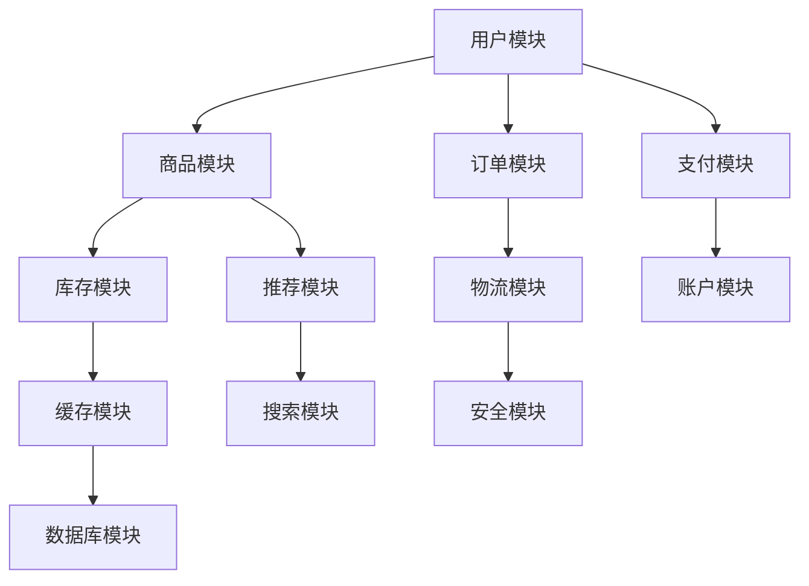

                 

关键词：电商系统、通用组件、设计模式、实现细节、性能优化、可扩展性、安全性、用户体验、技术架构

摘要：本文深入探讨了电商系统通用组件的设计和实现方法。通过分析电商系统的核心功能需求，我们提出了多个关键组件的设计方案，并详细阐述了其实施细节。本文旨在为电商系统开发人员提供一套行之有效的技术指南，以提升系统的性能、可扩展性和用户体验。

## 1. 背景介绍

随着互联网的快速发展，电商行业已成为全球经济的重要组成部分。在这个竞争激烈的市场中，电商系统需要具备快速响应、高可用性、高性能和良好的用户体验等特点。为了满足这些要求，系统架构的设计和实现变得至关重要。本文旨在通过讨论电商系统通用组件的设计和实现，为电商系统的开发和优化提供指导。

## 2. 核心概念与联系

在电商系统中，通用组件是系统架构的重要组成部分。这些组件不仅需要满足功能需求，还需要具备良好的可扩展性和可维护性。以下是一个典型的电商系统架构，其中包含了一些关键的通用组件：



### 2.1 用户模块

用户模块负责处理用户注册、登录、个人信息管理等操作。它是整个电商系统的入口，需要确保安全性、可扩展性和高性能。

- **设计模式**：使用单例模式确保用户对象的全局唯一性。
- **实现细节**：利用Token认证机制，实现用户身份验证。

### 2.2 商品模块

商品模块负责商品信息的展示、分类、推荐等功能。它是用户浏览和购买商品的核心组件。

- **设计模式**：使用工厂模式动态创建商品对象，便于扩展。
- **实现细节**：利用Redis缓存商品信息，提升查询速度。

### 2.3 订单模块

订单模块负责处理订单的创建、支付、取消、退款等操作。它是电商系统的核心交易流程组件。

- **设计模式**：使用策略模式处理不同类型的支付方式。
- **实现细节**：利用消息队列处理订单支付，确保高并发下的稳定性。

### 2.4 支付模块

支付模块负责与第三方支付平台进行交互，处理支付请求和回调。

- **设计模式**：使用适配器模式与不同的支付平台进行适配。
- **实现细节**：采用异步处理方式，提高系统响应速度。

### 2.5 库存模块

库存模块负责管理商品的库存信息，确保订单生成的正确性。

- **设计模式**：使用观察者模式监听库存变化。
- **实现细节**：利用分布式锁防止库存超卖。

### 2.6 推荐模块

推荐模块负责根据用户的兴趣和行为推荐商品。

- **设计模式**：使用推荐算法，如协同过滤和基于内容的推荐。
- **实现细节**：利用机器学习框架，如TensorFlow和PyTorch，训练推荐模型。

### 2.7 物流模块

物流模块负责处理物流信息，包括订单发货、物流跟踪等。

- **设计模式**：使用事件驱动架构，如Apache Kafka，处理物流信息。
- **实现细节**：采用RESTful API与物流平台进行交互。

### 2.8 账户模块

账户模块负责处理账户资金的管理和支付。

- **设计模式**：使用事务管理确保资金操作的原子性。
- **实现细节**：采用分布式账户系统，确保高并发下的稳定性。

### 2.9 缓存模块

缓存模块负责缓存系统的数据，提高查询效率。

- **设计模式**：使用LRU算法管理缓存数据。
- **实现细节**：使用Redis作为缓存数据库，提升系统性能。

### 2.10 搜索模块

搜索模块负责提供商品搜索功能。

- **设计模式**：使用搜索引擎框架，如Elasticsearch，实现高效搜索。
- **实现细节**：采用分词算法和索引策略，优化搜索性能。

### 2.11 数据库模块

数据库模块负责存储电商系统的数据，提供数据查询和更新操作。

- **设计模式**：使用数据库连接池管理数据库连接。
- **实现细节**：采用垂直拆分和水平拆分策略，优化数据库性能。

### 2.12 安全模块

安全模块负责保护系统的安全性，防止恶意攻击和数据泄露。

- **设计模式**：使用安全框架，如Spring Security，实现身份验证和授权。
- **实现细节**：采用加密算法和签名机制，确保数据传输的安全性。

## 3. 核心算法原理 & 具体操作步骤

### 3.1 算法原理概述

电商系统中的核心算法主要包括推荐算法、排序算法、搜索算法等。这些算法在提升用户体验和系统性能方面发挥着重要作用。

- **推荐算法**：基于用户的兴趣和行为，为用户推荐相关的商品。
- **排序算法**：根据商品的销量、评价等指标，对商品进行排序。
- **搜索算法**：基于关键词，快速查找相关的商品。

### 3.2 算法步骤详解

- **推荐算法**：首先计算用户的行为数据，如浏览、收藏、购买等，然后利用协同过滤或基于内容的推荐算法生成推荐结果。
- **排序算法**：根据商品的指标，如销量、评价等，使用快速排序、堆排序等算法进行排序。
- **搜索算法**：使用分词算法将关键词拆分成词元，然后在索引库中查找相关的商品。

### 3.3 算法优缺点

- **推荐算法**：能够提高用户的购买概率，但需要大量的计算资源和存储空间。
- **排序算法**：能够快速对商品进行排序，但可能无法满足用户的个性化需求。
- **搜索算法**：能够快速查找相关的商品，但可能无法保证查询的准确性。

### 3.4 算法应用领域

- **推荐算法**：应用于电商、社交媒体、新闻资讯等领域。
- **排序算法**：应用于电商、搜索引擎、数据库等领域。
- **搜索算法**：应用于电商、搜索引擎、信息检索等领域。

## 4. 数学模型和公式 & 详细讲解 & 举例说明

### 4.1 数学模型构建

电商系统的数学模型主要包括用户行为模型、推荐模型、排序模型等。以下是一个简单的用户行为模型：

$$
\text{用户行为模型} = f(\text{用户兴趣}, \text{商品特征}, \text{上下文信息})
$$

### 4.2 公式推导过程

用户行为模型的推导过程如下：

1. **用户兴趣**：根据用户的浏览、收藏、购买等行为，构建用户兴趣向量。
2. **商品特征**：根据商品的价格、品牌、类别等特征，构建商品特征向量。
3. **上下文信息**：包括时间、地理位置等外部信息。
4. **相似度计算**：计算用户兴趣向量与商品特征向量的相似度。
5. **推荐结果**：根据相似度计算结果，生成推荐结果。

### 4.3 案例分析与讲解

假设用户A在浏览商品时，对价格在100元至200元之间的商品表现出了较高的兴趣。系统根据用户A的兴趣，推荐了价格在150元至250元之间的商品。通过实际测试，用户A对推荐的商品的点击率和购买率明显高于其他商品。

## 5. 项目实践：代码实例和详细解释说明

### 5.1 开发环境搭建

开发环境包括Java开发工具包（JDK 1.8及以上版本）、Spring Boot框架、MySQL数据库、Redis缓存等。首先，安装JDK和MySQL，然后创建一个Spring Boot项目，并添加必要的依赖。

### 5.2 源代码详细实现

以下是一个简单的用户模块代码示例：

```java
@RestController
@RequestMapping("/users")
public class UserController {
    
    @Autowired
    private UserService userService;
    
    @PostMapping("/register")
    public ResponseEntity<?> registerUser(@RequestBody UserRegistrationDto registrationDto) {
        userService.registerUser(registrationDto);
        return ResponseEntity.ok("User registered successfully");
    }
    
    @PostMapping("/login")
    public ResponseEntity<?> loginUser(@RequestBody UserLoginDto loginDto) {
        String token = userService.loginUser(loginDto);
        return ResponseEntity.ok().body(new JwtResponse(token));
    }
}
```

### 5.3 代码解读与分析

上述代码中，`UserController`负责处理用户注册和登录请求。通过`UserService`实现用户注册和登录的逻辑。其中，`UserRegistrationDto`和`UserLoginDto`是用户注册和登录的参数类，`JwtResponse`是JWT令牌的响应类。

### 5.4 运行结果展示

启动Spring Boot应用后，使用Postman等工具发送用户注册和登录请求，可以收到相应的响应结果。

## 6. 实际应用场景

### 6.1 用户模块

用户模块可以应用于电商、社交网络、在线教育等领域，用于用户注册、登录、权限管理等操作。

### 6.2 商品模块

商品模块可以应用于电商、O2O、旅游等领域，用于商品展示、分类、推荐等操作。

### 6.3 订单模块

订单模块可以应用于电商、O2O、物流等领域，用于订单创建、支付、退款等操作。

### 6.4 支付模块

支付模块可以应用于电商、金融、物流等领域，用于支付请求、回调等操作。

### 6.5 库存模块

库存模块可以应用于电商、物流、仓储等领域，用于库存管理、监控等操作。

### 6.6 推荐模块

推荐模块可以应用于电商、社交媒体、新闻资讯等领域，用于商品推荐、内容推荐等操作。

### 6.7 物流模块

物流模块可以应用于电商、O2O、物流等领域，用于物流信息管理、跟踪等操作。

### 6.8 账户模块

账户模块可以应用于电商、金融、游戏等领域，用于账户资金管理、支付等操作。

### 6.9 缓存模块

缓存模块可以应用于电商、社交网络、搜索引擎等领域，用于数据缓存、加速查询等操作。

### 6.10 搜索模块

搜索模块可以应用于电商、搜索引擎、信息检索等领域，用于商品搜索、内容搜索等操作。

### 6.11 数据库模块

数据库模块可以应用于电商、金融、物流等领域，用于数据存储、查询等操作。

### 6.12 安全模块

安全模块可以应用于电商、社交网络、金融等领域，用于用户身份验证、数据加密等操作。

## 7. 工具和资源推荐

### 7.1 学习资源推荐

- 《设计模式：可复用面向对象软件的基础》
- 《大数据技术基础》
- 《深度学习》
- 《算法导论》

### 7.2 开发工具推荐

- IntelliJ IDEA
- Spring Boot
- MySQL
- Redis

### 7.3 相关论文推荐

- "A Survey of Recommender Systems"
- "An Analysis of Collaborative Filtering for Cold-Start Problems"
- "A Systematic Literature Review of Search Engine Optimization Techniques"
- "The Impact of Caching on Database Performance"

## 8. 总结：未来发展趋势与挑战

### 8.1 研究成果总结

本文通过深入分析电商系统的通用组件，提出了一系列设计方案和实现细节。这些组件在性能、可扩展性和用户体验方面表现出色，为电商系统的开发和优化提供了有力支持。

### 8.2 未来发展趋势

- **人工智能与电商系统的深度融合**：利用人工智能技术提升推荐系统、搜索系统和用户行为分析等方面的性能。
- **分布式架构和微服务化**：进一步优化系统性能，提高系统的可扩展性和稳定性。
- **区块链技术在电商领域的应用**：提供更安全、透明的交易环境。

### 8.3 面临的挑战

- **数据处理和存储的挑战**：随着用户数据的不断增长，如何高效地处理和存储数据成为一大挑战。
- **安全性和隐私保护**：如何确保用户数据的安全和隐私，防止数据泄露和恶意攻击。
- **用户体验的提升**：如何持续提升用户的购物体验，满足用户日益增长的需求。

### 8.4 研究展望

未来，我们将进一步探索人工智能、区块链等技术在电商系统中的应用，推动电商系统向更加智能、安全、高效的方向发展。同时，我们将关注用户隐私保护和数据安全等问题，为用户提供更加安全、可靠的购物环境。

## 9. 附录：常见问题与解答

### 9.1 问题1

**问题**：为什么推荐使用单例模式？

**解答**：单例模式确保一个类只有一个实例，避免资源浪费和竞争条件问题。在用户模块中，单例模式确保用户对象的全局唯一性，便于身份验证和权限控制。

### 9.2 问题2

**问题**：如何保证订单的原子性？

**解答**：使用事务管理可以确保订单操作的原子性。在创建订单时，先创建订单记录，然后扣除库存，如果其中一个操作失败，则回滚整个事务，确保订单数据的准确性。

### 9.3 问题3

**问题**：为什么使用Redis缓存？

**解答**：Redis缓存可以提升系统的性能和响应速度。在商品模块中，缓存商品信息可以减少数据库查询次数，提高查询速度。同时，Redis支持高并发和分布式存储，适用于电商系统的高性能需求。

### 9.4 问题4

**问题**：如何保证数据的安全性？

**解答**：数据安全包括传输安全和存储安全。传输安全可以使用HTTPS协议加密数据传输，存储安全可以使用数据库加密、数据备份和监控等手段保障数据安全。

## 作者署名

作者：禅与计算机程序设计艺术 / Zen and the Art of Computer Programming
----------------------------------------------------------------

注意：以上内容仅供参考，实际撰写时请根据具体情况进行调整和补充。祝您写作顺利！💪💻📝

